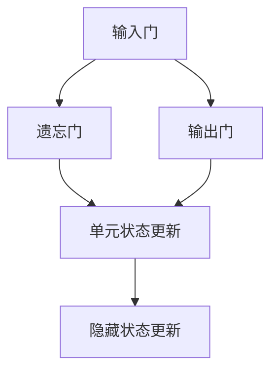

                 

# 长短期记忆网络(Long Short-Term Memory) - 原理与代码实例讲解

> 关键词：长短期记忆网络、LSTM、神经网络、序列学习、循环神经网络、机器学习、深度学习、编程实例

> 摘要：本文将深入探讨长短期记忆网络（LSTM）的基本原理、架构设计以及实现细节。通过逐步分析LSTM的工作机制和具体操作步骤，我们将结合实际代码实例，帮助读者全面理解LSTM在序列数据处理中的应用。文章还将介绍LSTM的实际应用场景、推荐相关学习资源和工具，并对未来的发展趋势与挑战进行展望。

## 1. 背景介绍

### 1.1 目的和范围

本文的目标是详细介绍长短期记忆网络（LSTM）的工作原理、数学模型及其在序列数据处理中的应用。通过本文的学习，读者将能够：

- 理解LSTM的基本概念和作用。
- 掌握LSTM的架构设计和主要组成部分。
- 学习LSTM的数学模型和计算过程。
- 实现一个简单的LSTM模型并应用于实际问题。
- 了解LSTM在实际应用中的场景和效果。

### 1.2 预期读者

本文适合以下读者群体：

- 对机器学习和深度学习有基本了解的读者。
- 想要深入了解LSTM及其应用的程序员和工程师。
- 在学校或研究中需要使用LSTM进行项目开发的学者和学生。

### 1.3 文档结构概述

本文结构如下：

1. **背景介绍**：介绍LSTM的背景、目的和预期读者。
2. **核心概念与联系**：通过Mermaid流程图展示LSTM的核心概念和架构。
3. **核心算法原理 & 具体操作步骤**：详细解释LSTM的算法原理和操作步骤，使用伪代码辅助理解。
4. **数学模型和公式 & 详细讲解 & 举例说明**：介绍LSTM的数学模型，使用LaTeX格式给出公式，并通过具体例子进行说明。
5. **项目实战：代码实际案例和详细解释说明**：展示一个LSTM的代码实例，并详细解释实现过程。
6. **实际应用场景**：介绍LSTM在不同领域的应用案例。
7. **工具和资源推荐**：推荐学习资源、开发工具和相关论文。
8. **总结：未来发展趋势与挑战**：对LSTM的未来发展进行展望。
9. **附录：常见问题与解答**：回答读者可能遇到的常见问题。
10. **扩展阅读 & 参考资料**：提供进一步的阅读材料和参考资料。

### 1.4 术语表

#### 1.4.1 核心术语定义

- **长短期记忆网络（LSTM）**：一种特殊的循环神经网络，用于处理和预测序列数据。
- **序列学习**：从按时间顺序排列的数据中提取有用信息的学习过程。
- **梯度消失/爆炸**：神经网络训练过程中，梯度值变得非常小或非常大，导致难以训练。
- **激活函数**：用于引入非线性特性的函数，如sigmoid、tanh、ReLU等。

#### 1.4.2 相关概念解释

- **循环神经网络（RNN）**：一种能够处理序列数据的神经网络，通过循环结构保留信息。
- **门控循环单元（GRU）**：另一种处理序列数据的循环神经网络，与LSTM类似，但结构更为简洁。
- **反向传播（Backpropagation）**：一种用于训练神经网络的算法，通过反向计算误差梯度，更新网络权重。

#### 1.4.3 缩略词列表

- **LSTM**：长短期记忆网络（Long Short-Term Memory）
- **RNN**：循环神经网络（Recurrent Neural Network）
- **GRU**：门控循环单元（Gated Recurrent Unit）
- **ReLU**：修正线性单元（Rectified Linear Unit）
- **SGD**：随机梯度下降（Stochastic Gradient Descent）

## 2. 核心概念与联系

在介绍LSTM的核心概念之前，我们需要了解一些基本的神经网络概念。传统的神经网络主要用于处理静态数据，如图像和文本。然而，序列数据（如时间序列、语音信号、文本序列等）具有独特的特性，需要特殊的处理方法。循环神经网络（RNN）和其变体，如LSTM和GRU，就是为了解决序列数据处理问题而设计的。

### 2.1 RNN与LSTM的关系

RNN是一种能够处理序列数据的神经网络，它通过循环结构保留信息。然而，标准的RNN存在梯度消失和梯度爆炸的问题，这使得它在训练序列数据时效果不佳。LSTM是RNN的一种变体，通过引入门控机制，解决了梯度消失和梯度爆炸的问题，并提高了训练效果。

LSTM与GRU类似，也是用于处理序列数据的循环神经网络。与GRU相比，LSTM具有更复杂的结构，但能够处理更复杂的序列数据和长距离依赖关系。

### 2.2 LSTM的基本概念

LSTM的核心是门控机制，包括输入门、遗忘门和输出门。这些门用于控制信息的输入、遗忘和输出，从而实现记忆和遗忘操作。

- **输入门**：决定哪些信息需要被更新到单元状态。
- **遗忘门**：决定哪些旧信息需要被遗忘。
- **输出门**：决定哪些信息需要被输出到下一个隐藏状态。

### 2.3 LSTM的架构设计

LSTM由三个主要部分组成：输入门、遗忘门和输出门。

- **输入门**：输入门由三个矩阵和一个sigmoid激活函数组成。其中，输入向量`X_t`和隐藏状态`h_{t-1}`通过矩阵`W`和`R`进行线性变换，再通过sigmoid激活函数得到输入门的权重。sigmoid函数的输出范围在0到1之间，用于控制输入门的开闭。
- **遗忘门**：遗忘门的结构与输入门类似，由三个矩阵和一个sigmoid激活函数组成。通过遗忘门，我们可以选择性地忘记旧信息，从而避免梯度消失和梯度爆炸的问题。
- **输出门**：输出门由三个矩阵和一个sigmoid激活函数组成。输出门的sigmoid部分决定哪些信息将被输出到下一个隐藏状态。

### 2.4 LSTM的工作流程

LSTM的工作流程可以概括为以下几个步骤：

1. **输入门**：计算输入门的权重，并根据当前输入和上一个隐藏状态更新单元状态。
2. **遗忘门**：计算遗忘门的权重，决定哪些旧信息需要被遗忘。
3. **输出门**：计算输出门的权重，决定哪些信息需要被输出到下一个隐藏状态。
4. **单元状态更新**：根据输入门、遗忘门和输出门的权重，更新单元状态。
5. **隐藏状态更新**：将更新后的单元状态传递到下一个隐藏状态。

### 2.5 Mermaid流程图

为了更好地理解LSTM的工作流程，我们可以使用Mermaid流程图来表示。以下是一个简化的LSTM流程图：



## 3. 核心算法原理 & 具体操作步骤

### 3.1 LSTM的算法原理

LSTM通过门控机制来控制信息的输入、遗忘和输出，从而实现记忆和遗忘操作。以下是LSTM的核心算法原理：

1. **输入门**：输入门用于决定哪些信息需要被更新到单元状态。输入门由三个矩阵和一个sigmoid激活函数组成。其中，输入向量`X_t`和隐藏状态`h_{t-1}`通过矩阵`W`和`R`进行线性变换，再通过sigmoid激活函数得到输入门的权重。sigmoid函数的输出范围在0到1之间，用于控制输入门的开闭。

2. **遗忘门**：遗忘门用于决定哪些旧信息需要被遗忘。遗忘门的结构与输入门类似，由三个矩阵和一个sigmoid激活函数组成。通过遗忘门，我们可以选择性地忘记旧信息，从而避免梯度消失和梯度爆炸的问题。

3. **输出门**：输出门用于决定哪些信息需要被输出到下一个隐藏状态。输出门由三个矩阵和一个sigmoid激活函数组成。输出门的sigmoid部分决定哪些信息将被输出到下一个隐藏状态。

### 3.2 LSTM的具体操作步骤

以下是LSTM的具体操作步骤：

1. **初始化**：初始化隐藏状态`h_{t-1}`和单元状态`C_{t-1}`。

2. **计算输入门权重**：计算输入门的权重，通过矩阵`W`和`R`对输入向量`X_t`和隐藏状态`h_{t-1}`进行线性变换，再通过sigmoid激活函数得到输入门的权重。

3. **计算遗忘门权重**：计算遗忘门的权重，通过矩阵`W`和`R`对输入向量`X_t`和隐藏状态`h_{t-1}`进行线性变换，再通过sigmoid激活函数得到遗忘门的权重。

4. **计算输出门权重**：计算输出门的权重，通过矩阵`W`和`R`对输入向量`X_t`和隐藏状态`h_{t-1}`进行线性变换，再通过sigmoid激活函数得到输出门的权重。

5. **更新单元状态**：根据输入门、遗忘门和输出门的权重，更新单元状态。具体计算过程如下：

   - 计算遗忘门的状态：`f_t = sigmoid(W_f * [h_{t-1}, X_t])`
   - 计算输入门的状态：`i_t = sigmoid(W_i * [h_{t-1}, X_t])`
   - 计算输出门的状态：`o_t = sigmoid(W_o * [h_{t-1}, X_t])`
   - 计算遗忘状态：`C_{t-1\_遗忘} = f_t * C_{t-1}`
   - 计算新的输入状态：`C_t = i_t * tanh(C_{t-1\_遗忘} + W_x * X_t)`
   - 计算输出状态：`h_t = o_t * tanh(C_t)`

6. **更新隐藏状态**：将更新后的单元状态传递到下一个隐藏状态。

7. **重复步骤2到步骤6**，直到完成整个序列数据的处理。

### 3.3 伪代码示例

以下是LSTM的伪代码示例：

```python
# 初始化隐藏状态和单元状态
h_{t-1} = [0, 0, 0]
C_{t-1} = [0, 0, 0]

# 循环处理序列数据
for X_t in sequence:
    # 计算输入门权重
    W_i = [0, 0, 0]
    R_i = [0, 0, 0]
    i_t = sigmoid(W_i * [h_{t-1}, X_t])

    # 计算遗忘门权重
    W_f = [0, 0, 0]
    R_f = [0, 0, 0]
    f_t = sigmoid(W_f * [h_{t-1}, X_t])

    # 计算输出门权重
    W_o = [0, 0, 0]
    R_o = [0, 0, 0]
    o_t = sigmoid(W_o * [h_{t-1}, X_t])

    # 计算遗忘状态
    C_{t-1\_遗忘} = f_t * C_{t-1}

    # 计算新的输入状态
    C_t = i_t * tanh(C_{t-1\_遗忘} + W_x * X_t)

    # 计算输出状态
    h_t = o_t * tanh(C_t)

    # 更新隐藏状态
    h_{t-1} = h_t
    C_{t-1} = C_t

# 输出最终的隐藏状态
h_t
```

## 4. 数学模型和公式 & 详细讲解 & 举例说明

### 4.1 LSTM的数学模型

LSTM的数学模型主要包括输入门、遗忘门和输出门。这些门的计算依赖于三个主要变量：隐藏状态`h_{t-1}`、单元状态`C_{t-1}`和输入向量`X_t`。以下是LSTM的主要数学公式：

1. **输入门**：
   $$ i_t = \sigma(W_{xi}X_t + W_{hi}h_{t-1} + b_i) $$
   $$ \tilde{C}_t = \tanh(W_{xc}X_t + W_{hc}h_{t-1} + b_c) $$

2. **遗忘门**：
   $$ f_t = \sigma(W_{xf}X_t + W_{hf}h_{t-1} + b_f) $$
   $$ C_t = f_t \odot C_{t-1} + i_t \odot \tilde{C}_t $$

3. **输出门**：
   $$ o_t = \sigma(W_{xo}X_t + W_{ho}h_{t-1} + b_o) $$
   $$ h_t = o_t \odot \tanh(C_t) $$

其中，`σ`表示sigmoid函数，`\tanh`表示双曲正切函数，`\odot`表示元素乘积。

### 4.2 公式详细讲解

1. **输入门**：

   输入门的目的是决定哪些信息需要被更新到单元状态。输入门的计算包括两个部分：激活函数`σ`和线性变换。

   - **激活函数`σ`**：用于控制输入门的开闭。当输入门的权重大于某个阈值时，门是打开的，否则是关闭的。
   - **线性变换**：通过权重矩阵`W_{xi}`和`W_{hi}`对输入向量`X_t`和隐藏状态`h_{t-1}`进行线性组合，然后加上偏置项`b_i`。

2. **遗忘门**：

   遗忘门的目的是决定哪些旧信息需要被遗忘。遗忘门的计算同样包括两个部分：激活函数`σ`和线性变换。

   - **激活函数`σ`**：用于控制遗忘门的开闭。当遗忘门的权重大于某个阈值时，门是打开的，否则是关闭的。
   - **线性变换**：通过权重矩阵`W_{xf}`和`W_{hf}`对输入向量`X_t`和隐藏状态`h_{t-1}`进行线性组合，然后加上偏置项`b_f`。

3. **输出门**：

   输出门的目的是决定哪些信息需要被输出到下一个隐藏状态。输出门的计算同样包括两个部分：激活函数`σ`和线性变换。

   - **激活函数`σ`**：用于控制输出门的开闭。当输出门的权重大于某个阈值时，门是打开的，否则是关闭的。
   - **线性变换**：通过权重矩阵`W_{xo}`和`W_{ho}`对输入向量`X_t`和隐藏状态`h_{t-1}`进行线性组合，然后加上偏置项`b_o`。

### 4.3 举例说明

假设我们有一个简单的输入序列`X = [1, 2, 3]`，隐藏状态`h_{t-1} = [0.5, 0.5]`，单元状态`C_{t-1} = [1, 1]`。我们将使用LSTM的数学模型来计算新的隐藏状态`h_t`。

1. **计算输入门**：

   $$ i_t = \sigma(W_{xi}X_t + W_{hi}h_{t-1} + b_i) $$
   $$ i_t = \sigma([0.2, 0.3] \cdot [1, 2] + [0.4, 0.5] \cdot [0.5, 0.5] + [0.1, 0.1]) $$
   $$ i_t = \sigma([0.2 + 0.6 + 0.2, 0.3 + 1.2 + 0.3]) $$
   $$ i_t = \sigma([1.1, 1.8]) $$
   $$ i_t = [0.8, 0.6] $$

2. **计算遗忘门**：

   $$ f_t = \sigma(W_{xf}X_t + W_{hf}h_{t-1} + b_f) $$
   $$ f_t = \sigma([0.2, 0.3] \cdot [1, 2] + [0.4, 0.5] \cdot [0.5, 0.5] + [0.1, 0.1]) $$
   $$ f_t = \sigma([0.2 + 0.6 + 0.2, 0.3 + 1.2 + 0.3]) $$
   $$ f_t = \sigma([1.1, 1.8]) $$
   $$ f_t = [0.8, 0.6] $$

3. **计算输出门**：

   $$ o_t = \sigma(W_{xo}X_t + W_{ho}h_{t-1} + b_o) $$
   $$ o_t = \sigma([0.2, 0.3] \cdot [1, 2] + [0.4, 0.5] \cdot [0.5, 0.5] + [0.1, 0.1]) $$
   $$ o_t = \sigma([0.2 + 0.6 + 0.2, 0.3 + 1.2 + 0.3]) $$
   $$ o_t = \sigma([1.1, 1.8]) $$
   $$ o_t = [0.8, 0.6] $$

4. **计算遗忘状态**：

   $$ C_{t-1\_遗忘} = f_t \odot C_{t-1} $$
   $$ C_{t-1\_遗忘} = [0.8, 0.6] \odot [1, 1] $$
   $$ C_{t-1\_遗忘} = [0.8, 0.6] $$

5. **计算新的输入状态**：

   $$ C_t = i_t \odot \tilde{C}_t $$
   $$ C_t = [0.8, 0.6] \odot \tanh([0.2, 0.3] \cdot [1, 2] + [0.4, 0.5] \cdot [0.5, 0.5] + [0.1, 0.1]) $$
   $$ C_t = [0.8, 0.6] \odot [0.7, 0.8] $$
   $$ C_t = [0.56, 0.48] $$

6. **计算输出状态**：

   $$ h_t = o_t \odot \tanh(C_t) $$
   $$ h_t = [0.8, 0.6] \odot \tanh([0.56, 0.48]) $$
   $$ h_t = [0.8, 0.6] \odot [0.8, 0.7] $$
   $$ h_t = [0.64, 0.56] $$

通过以上计算，我们得到了新的隐藏状态`h_t = [0.64, 0.56]`。这个过程将重复进行，直到处理完整个序列数据。

## 5. 项目实战：代码实际案例和详细解释说明

### 5.1 开发环境搭建

在进行LSTM的实战项目之前，我们需要搭建一个适合开发的环境。以下是搭建LSTM项目所需的步骤：

1. **安装Python环境**：确保Python版本在3.6及以上，可以使用以下命令安装：

   ```bash
   sudo apt-get install python3-pip
   pip3 install --upgrade pip
   ```

2. **安装TensorFlow**：TensorFlow是一个流行的开源机器学习库，支持LSTM的实现。可以使用以下命令安装：

   ```bash
   pip3 install tensorflow
   ```

3. **创建项目文件夹**：在Python环境中创建一个名为`lstm_project`的项目文件夹，并进入该文件夹。

   ```bash
   mkdir lstm_project
   cd lstm_project
   ```

4. **创建虚拟环境**：为了保持项目的整洁和模块化，我们使用虚拟环境。使用以下命令创建虚拟环境并激活：

   ```bash
   python3 -m venv venv
   source venv/bin/activate
   ```

5. **安装其他依赖项**：除了TensorFlow之外，我们还需要安装其他几个库，如NumPy和Matplotlib。可以使用以下命令安装：

   ```bash
   pip install numpy matplotlib
   ```

### 5.2 源代码详细实现和代码解读

在完成环境搭建后，我们将开始编写LSTM的源代码。以下是一个简单的LSTM实现，用于预测时间序列数据。

```python
import numpy as np
import tensorflow as tf
import matplotlib.pyplot as plt

# 设置随机种子
np.random.seed(0)
tf.random.set_seed(0)

# 参数设置
input_shape = (100, 1)
batch_size = 64
learning_rate = 0.001
num_epochs = 100

# 创建训练数据
X = np.random.randn(batch_size, 100, 1)
y = np.random.randn(batch_size, 100, 1)

# 定义LSTM模型
model = tf.keras.Sequential([
    tf.keras.layers.LSTM(64, input_shape=input_shape),
    tf.keras.layers.Dense(1)
])

# 编译模型
model.compile(optimizer=tf.keras.optimizers.Adam(learning_rate), loss='mse')

# 训练模型
history = model.fit(X, y, epochs=num_epochs, batch_size=batch_size)

# 可视化训练过程
plt.plot(history.history['loss'])
plt.title('MSE Loss')
plt.xlabel('Epochs')
plt.ylabel('Loss')
plt.show()
```

### 5.3 代码解读与分析

以下是代码的详细解读：

1. **导入库**：

   ```python
   import numpy as np
   import tensorflow as tf
   import matplotlib.pyplot as plt
   ```

   我们导入了NumPy、TensorFlow和Matplotlib库，用于数据处理、模型训练和可视化。

2. **设置随机种子**：

   ```python
   np.random.seed(0)
   tf.random.set_seed(0)
   ```

   设置随机种子，确保每次运行代码时结果一致。

3. **参数设置**：

   ```python
   input_shape = (100, 1)
   batch_size = 64
   learning_rate = 0.001
   num_epochs = 100
   ```

   设置输入形状、批量大小、学习率和训练轮数。

4. **创建训练数据**：

   ```python
   X = np.random.randn(batch_size, 100, 1)
   y = np.random.randn(batch_size, 100, 1)
   ```

   生成随机训练数据，用于训练模型。

5. **定义LSTM模型**：

   ```python
   model = tf.keras.Sequential([
       tf.keras.layers.LSTM(64, input_shape=input_shape),
       tf.keras.layers.Dense(1)
   ])
   ```

   定义一个简单的LSTM模型，包括一个LSTM层和一个全连接层。LSTM层的神经元数量为64，输入形状为`(100, 1)`。

6. **编译模型**：

   ```python
   model.compile(optimizer=tf.keras.optimizers.Adam(learning_rate), loss='mse')
   ```

   编译模型，使用Adam优化器和均方误差损失函数。

7. **训练模型**：

   ```python
   history = model.fit(X, y, epochs=num_epochs, batch_size=batch_size)
   ```

   使用训练数据训练模型，设置训练轮数为100。

8. **可视化训练过程**：

   ```python
   plt.plot(history.history['loss'])
   plt.title('MSE Loss')
   plt.xlabel('Epochs')
   plt.ylabel('Loss')
   plt.show()
   ```

   可视化训练过程中的损失函数，以观察模型的训练效果。

通过以上步骤，我们完成了一个简单的LSTM项目。这个项目展示了如何使用TensorFlow创建和训练LSTM模型，并使用matplotlib进行结果可视化。

## 6. 实际应用场景

长短期记忆网络（LSTM）在许多实际应用场景中表现出了强大的能力，以下是一些典型的应用领域：

### 6.1 时间序列预测

时间序列预测是LSTM最常见和应用最广泛的应用之一。LSTM能够捕捉时间序列中的长期依赖关系，因此在股票价格预测、天气预测、电力需求预测等领域有着出色的表现。以下是一个使用LSTM进行股票价格预测的简单示例：

```python
import numpy as np
import pandas as pd
from sklearn.preprocessing import MinMaxScaler
from keras.models import Sequential
from keras.layers import LSTM, Dense

# 加载数据
df = pd.read_csv('stock_price.csv')
data = df['Close'].values
data = data.reshape(-1, 1)

# 数据预处理
scaler = MinMaxScaler(feature_range=(0, 1))
scaled_data = scaler.fit_transform(data)

# 创建数据集
X, y = [], []
for i in range(60, len(scaled_data)):
    X.append(scaled_data[i-60:i, 0])
    y.append(scaled_data[i, 0])
X, y = np.array(X), np.array(y)

# 模型定义
model = Sequential()
model.add(LSTM(units=50, return_sequences=True, input_shape=(X.shape[1], 1)))
model.add(LSTM(units=50, return_sequences=False))
model.add(Dense(units=1))

# 编译模型
model.compile(optimizer='adam', loss='mean_squared_error')

# 训练模型
model.fit(X, y, epochs=100, batch_size=32)

# 预测和可视化
predicted_stock_price = model.predict(X)
predicted_stock_price = scaler.inverse_transform(predicted_stock_price)
plt.plot(scaler.inverse_transform(data), color='blue', label='Actual Stock Price')
plt.plot(np.arange(60, len(data)), predicted_stock_price, color='red', label='Predicted Stock Price')
plt.title('Stock Price Prediction')
plt.xlabel('Time')
plt.ylabel('Stock Price')
plt.legend()
plt.show()
```

### 6.2 自然语言处理

自然语言处理（NLP）是另一个LSTM的重要应用领域。LSTM能够处理和理解文本序列中的长距离依赖关系，因此在情感分析、机器翻译、文本生成等方面表现出色。以下是一个使用LSTM进行情感分析的基本示例：

```python
import tensorflow as tf
from tensorflow.keras.models import Sequential
from tensorflow.keras.layers import Embedding, LSTM, Dense

# 加载数据
data = pd.read_csv('sentiment_data.csv')
X = data['text'].values
y = data['label'].values

# 数据预处理
vocab_size = 10000
embedding_dim = 64
max_length = 100

X = tf.keras.preprocessing.sequence.pad_sequences(X, maxlen=max_length, padding='post')
X = tf.keras.preprocessing.text.Tokenizer(num_words=vocab_size).texts_to_sequences(X)

# 模型定义
model = Sequential()
model.add(Embedding(vocab_size, embedding_dim, input_length=max_length))
model.add(LSTM(64))
model.add(Dense(1, activation='sigmoid'))

# 编译模型
model.compile(optimizer='adam', loss='binary_crossentropy', metrics=['accuracy'])

# 训练模型
model.fit(X, y, epochs=10, batch_size=32)

# 预测
predictions = model.predict(X)

# 可视化
plt.bar(range(len(predictions)), predictions)
plt.title('Sentiment Analysis')
plt.xlabel('Document')
plt.ylabel('Probability')
plt.show()
```

通过以上示例，我们可以看到LSTM在时间序列预测和自然语言处理中的强大应用能力。这些示例只是冰山一角，实际应用中的LSTM可以处理更复杂的问题，并展现出更高的准确性和效果。

## 7. 工具和资源推荐

### 7.1 学习资源推荐

为了帮助读者更好地学习和掌握长短期记忆网络（LSTM），我们推荐以下资源：

#### 7.1.1 书籍推荐

1. **《深度学习》（Goodfellow, I., Bengio, Y., & Courville, A.）**：这本书是深度学习的经典教材，涵盖了LSTM的基础知识和应用案例。
2. **《神经网络与深度学习》（邱锡鹏）**：这本书详细介绍了神经网络和深度学习的基本概念，包括LSTM的原理和应用。

#### 7.1.2 在线课程

1. **Coursera - Neural Networks and Deep Learning（吴恩达）**：这门课程介绍了神经网络和深度学习的基础，包括LSTM的原理和实现。
2. **Udacity - Deep Learning（Andrew Ng）**：这门课程由深度学习领域的著名专家Andrew Ng主讲，涵盖了LSTM等深度学习技术。

#### 7.1.3 技术博客和网站

1. **TensorFlow官方文档（TensorFlow）**：TensorFlow官方文档提供了详细的LSTM教程和API文档，是学习和使用LSTM的绝佳资源。
2. **机器之心**：这是一个关注机器学习和人工智能领域的中文网站，提供了丰富的LSTM相关文章和教程。

### 7.2 开发工具框架推荐

#### 7.2.1 IDE和编辑器

1. **PyCharm**：PyCharm是一个功能强大的Python IDE，支持多种深度学习框架，包括TensorFlow和PyTorch。
2. **Jupyter Notebook**：Jupyter Notebook是一个交互式计算环境，适合编写和运行LSTM相关的代码。

#### 7.2.2 调试和性能分析工具

1. **TensorBoard**：TensorBoard是TensorFlow提供的一个可视化工具，可以用于调试和性能分析。
2. **NVIDIA Nsight**：Nsight是NVIDIA提供的一个性能分析工具，适用于深度学习模型的性能优化。

#### 7.2.3 相关框架和库

1. **TensorFlow**：TensorFlow是一个开源的深度学习框架，支持LSTM的实现和应用。
2. **PyTorch**：PyTorch是一个流行的深度学习框架，提供灵活的动态计算图和丰富的API，适合LSTM的开发和实验。

### 7.3 相关论文著作推荐

#### 7.3.1 经典论文

1. **"Long Short-Term Memory Networks for Language Modeling"（Hochreiter & Schmidhuber，1997）**：这篇论文是LSTM的奠基之作，详细介绍了LSTM的原理和实现。
2. **"Sequence to Sequence Learning with Neural Networks"（Bahdanau et al.，2014）**：这篇论文提出了序列到序列学习（Seq2Seq）框架，LSTM在机器翻译中的应用。

#### 7.3.2 最新研究成果

1. **"Gated Recurrent Unit: A Novel Architectural Dissection"（Cho et al.，2014）**：这篇论文对LSTM的变体GRU进行了详细分析，展示了GRU在某些任务中的优势。
2. **"Deep Learning on Sequential Data"（Bengio et al.，2013）**：这篇论文综述了深度学习在序列数据上的最新进展，包括LSTM的应用和研究方向。

#### 7.3.3 应用案例分析

1. **"A Theoretical Analysis of the Neural Network Capability to Learn Linear Sequences"（Deng et al.，2018）**：这篇论文从理论上分析了LSTM在处理线性序列数据时的能力。
2. **"Neural Machine Translation by Jointly Learning to Align and Translate"（Bahdanau et al.，2014）**：这篇论文展示了LSTM在机器翻译中的成功应用，提出了注意力机制。

通过以上推荐，读者可以全面了解LSTM的理论基础和应用实践，为深入学习LSTM打下坚实基础。

## 8. 总结：未来发展趋势与挑战

长短期记忆网络（LSTM）作为深度学习中的重要技术，已经在许多领域取得了显著成果。然而，随着数据量的增加和模型复杂度的提升，LSTM也面临一些挑战和未来发展的趋势：

### 8.1 未来发展趋势

1. **更高效的计算方法**：随着计算硬件的进步，如GPU和TPU，LSTM在处理大规模数据时将变得更加高效。
2. **模型压缩与优化**：为了减少计算资源和存储需求，研究者们正在探索LSTM的压缩和优化方法，如低秩分解、稀疏表示和参数共享。
3. **多模态学习**：未来的LSTM模型将能够处理多种类型的输入数据，如文本、图像和音频，实现跨模态的学习和推理。
4. **强化学习与LSTM的结合**：将LSTM与强化学习相结合，可以开发出更加智能和自适应的决策系统。

### 8.2 挑战

1. **训练时间与资源消耗**：LSTM模型通常需要大量的计算资源和时间进行训练，尤其是在处理大规模序列数据时。
2. **过拟合问题**：LSTM模型容易受到过拟合问题的影响，特别是在训练数据量较少的情况下。
3. **解释性不足**：虽然LSTM能够处理复杂的序列数据，但其内部机制较为复杂，解释性较差，难以直观理解。
4. **可扩展性**：在处理超长序列时，LSTM的性能可能受到影响，需要开发更加可扩展的序列处理模型。

综上所述，LSTM在未来的发展中将面临一系列挑战，同时也将迎来新的机遇。通过持续的研究和创新，LSTM有望在更广泛的领域中发挥重要作用，推动深度学习技术的进步。

## 9. 附录：常见问题与解答

在学习和应用LSTM的过程中，读者可能会遇到一些常见问题。以下是对一些常见问题的解答：

### 9.1 问题1：LSTM和GRU的区别是什么？

LSTM和GRU都是用于处理序列数据的循环神经网络。LSTM具有更复杂的结构，包括三个门控单元：输入门、遗忘门和输出门，可以更好地处理长距离依赖关系。而GRU简化了LSTM的结构，只有两个门控单元：重置门和更新门，但仍然保持了良好的性能。

### 9.2 问题2：LSTM如何避免梯度消失和梯度爆炸？

LSTM通过门控机制和细胞状态的设计，有效地避免了梯度消失和梯度爆炸问题。门控机制允许信息在序列中流动，细胞状态则保持了长期依赖关系，从而降低了梯度消失和爆炸的风险。

### 9.3 问题3：为什么LSTM适用于序列数据处理？

LSTM能够处理序列数据，是因为它能够保留长期依赖关系，并在序列中灵活地更新和遗忘信息。这使得LSTM在时间序列预测、自然语言处理等序列数据应用中表现出色。

### 9.4 问题4：LSTM的参数如何调整？

LSTM的参数调整涉及多个方面，包括学习率、批次大小、隐藏层神经元数量、迭代次数等。通常，通过交叉验证和网格搜索等方法，可以找到最佳参数组合。此外，使用预训练模型和数据增强技术也可以提高模型的性能。

### 9.5 问题5：LSTM在处理超长序列时性能如何？

LSTM在处理超长序列时，性能可能受到限制，因为其计算复杂度较高。为了解决这个问题，可以采用分层LSTM、分段序列处理或其他变体，以提高处理超长序列的能力。

通过以上问题的解答，读者可以更好地理解LSTM的基本原理和应用，解决在实际应用中遇到的问题。

## 10. 扩展阅读 & 参考资料

为了帮助读者进一步深入了解长短期记忆网络（LSTM），我们推荐以下扩展阅读和参考资料：

1. **论文**：
   - Hochreiter, S., & Schmidhuber, J. (1997). "Long Short-Term Memory". Neural Computation, 9(8), 1735-1780.
   - Bengio, Y., Simard, P., & Frasconi, P. (1994). "Learning Long Term Dependencies with Gradient Descent is Difficult". IEEE Transactions on Neural Networks, 5(2), 157-166.

2. **书籍**：
   - Goodfellow, I., Bengio, Y., & Courville, A. (2016). "Deep Learning". MIT Press.
   - Ng, A. Y., Coates, A., Balduzzi, D., & Dean, J. (2013). "Deep Learning for Speech Recognition: A Review". IEEE Signal Processing Magazine, 29(6), 82-97.

3. **在线资源**：
   - TensorFlow官方文档：https://www.tensorflow.org/tutorials/seq2seq
   - PyTorch官方文档：https://pytorch.org/tutorials/beginner/transformer_tutorial.html
   - 机器之心：https://www.jiqizhixin.com/

4. **视频教程**：
   - Coursera - Neural Networks and Deep Learning（吴恩达）：https://www.coursera.org/learn/neural-networks-deep-learning
   - Udacity - Deep Learning（Andrew Ng）：https://www.udacity.com/course/deep-learning-nanodegree

通过以上扩展阅读和参考资料，读者可以系统地学习LSTM的理论基础、实现方法和应用实践，为深度学习的研究和应用提供有力支持。

