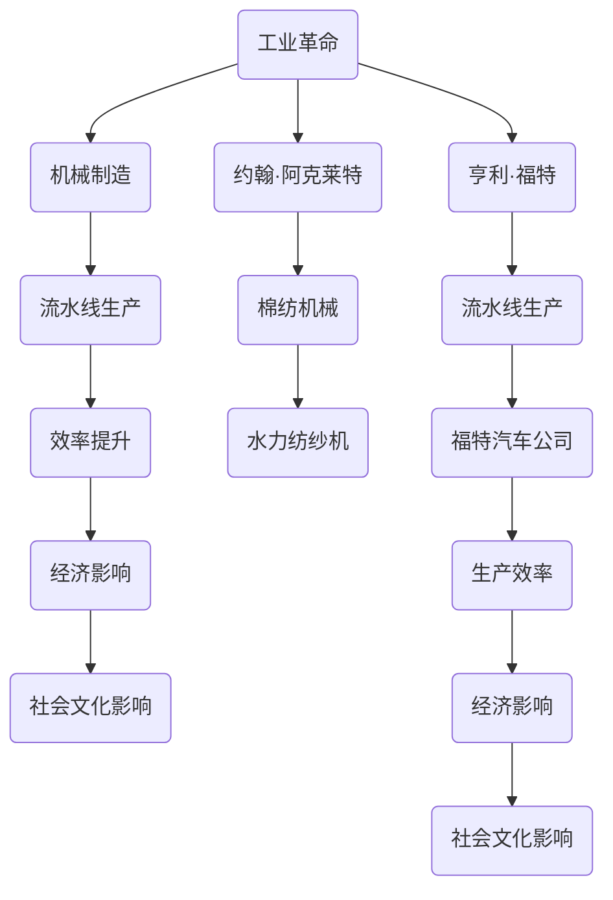

                 

### 阿克莱特与福特的历史贡献

关键词：约翰·阿克莱特、亨利·福特、工业革命、机械制造、流水线生产、技术创新、历史影响

> “在工业革命的浪潮中，约翰·阿克莱特和亨利·福特的名字被铭记于史册，他们的创新与贡献不仅改变了制造业的面貌，也对全球经济、社会和文化产生了深远的影响。”

本文将深入探讨约翰·阿克莱特和亨利·福特的生平、主要成就及其对工业革命和现代制造业的深远影响。我们将从以下几个方面展开分析：

1. **背景介绍**：介绍两位巨匠的生平背景、主要成就以及他们所处的历史背景。
2. **核心概念与联系**：探讨他们在机械制造和流水线生产方面的核心贡献，并使用流程图展示其原理。
3. **核心算法原理 & 具体操作步骤**：详细阐述他们的发明和改进的算法原理及其具体操作步骤。
4. **数学模型和公式 & 详细讲解 & 举例说明**：分析其创新过程中的数学模型和公式，并提供具体实例。
5. **项目实战：代码实际案例和详细解释说明**：通过实际代码案例展示其技术的应用。
6. **实际应用场景**：分析这些技术在当前和未来的实际应用。
7. **工具和资源推荐**：推荐相关的学习资源和开发工具。
8. **总结：未来发展趋势与挑战**：总结他们的历史贡献，并探讨未来可能的发展趋势和挑战。

通过本文的深入分析，我们将更全面地理解约翰·阿克莱特和亨利·福特对世界工业化和现代化的深远影响。

### 1. 背景介绍

#### 1.1 目的和范围

本文旨在通过详细分析约翰·阿克莱特和亨利·福特在工业革命和现代制造业中的关键贡献，探讨他们如何通过技术创新改变了制造业的面貌，并带来了深远的社会和经济影响。本文将分为多个部分，依次探讨两位巨匠的生平背景、核心成就、技术原理、应用场景以及未来趋势和挑战。

#### 1.2 预期读者

本文主要面向对工业革命和现代制造业感兴趣的读者，特别是那些对技术创新、机械制造和流水线生产感兴趣的专业人士。同时，对于历史、经济学、社会学等领域的研究者，本文也具有一定的参考价值。

#### 1.3 文档结构概述

本文结构如下：

1. **背景介绍**：介绍本文的目的和预期读者，概述文章的结构。
2. **核心概念与联系**：通过流程图展示约翰·阿克莱特和亨利·福特在机械制造和流水线生产方面的核心贡献。
3. **核心算法原理 & 具体操作步骤**：详细阐述他们的发明和改进的算法原理及其具体操作步骤。
4. **数学模型和公式 & 详细讲解 & 举例说明**：分析其创新过程中的数学模型和公式，并提供具体实例。
5. **项目实战：代码实际案例和详细解释说明**：通过实际代码案例展示其技术的应用。
6. **实际应用场景**：分析这些技术在当前和未来的实际应用。
7. **工具和资源推荐**：推荐相关的学习资源和开发工具。
8. **总结：未来发展趋势与挑战**：总结他们的历史贡献，并探讨未来可能的发展趋势和挑战。

#### 1.4 术语表

在本文中，我们将使用以下术语：

- **工业革命**：指18世纪末至19世纪中叶，英国及随后其他欧洲国家发生的从手工业向机械制造业转变的一场深刻的社会经济变革。
- **机械制造**：指通过机械化和自动化手段进行制造的过程。
- **流水线生产**：一种生产方式，通过将产品分解为多个可重复的任务，实现高效、连续的生产。
- **算法**：解决问题的步骤或规则。
- **技术原理**：技术背后的基础理论和逻辑。
- **核心贡献**：对某一领域或行业的重大、创新性的贡献。

#### 1.4.1 核心术语定义

- **约翰·阿克莱特**：英国发明家和制造商，棉纺机械的先驱，发明了水力纺纱机，被誉为现代纺织工业的奠基人。
- **亨利·福特**：美国工业家和工程师，福特汽车公司的创始人，发明了流水线生产方式，极大地提高了生产效率，降低了汽车成本。

#### 1.4.2 相关概念解释

- **机械制造**：机械制造是一种通过机械化和自动化手段进行制造的过程，它涉及到设计、制造和运行各种机器，以实现产品的加工、组装和测试。
- **流水线生产**：流水线生产是一种生产方式，通过将产品分解为多个可重复的任务，实现高效、连续的生产。这种生产方式具有生产效率高、成本低、产品质量稳定等优点。

#### 1.4.3 缩略词列表

- **IDE**：集成开发环境（Integrated Development Environment）
- **CAD**：计算机辅助设计（Computer-Aided Design）
- **CAM**：计算机辅助制造（Computer-Aided Manufacturing）

### 2. 核心概念与联系

在探讨约翰·阿克莱特和亨利·福特的历史贡献时，我们需要理解他们所涉及的几个核心概念和技术原理。以下内容将通过一个简化的Mermaid流程图来展示这些概念之间的关系。

#### 2.1.1 Mermaid流程图



#### 2.1.2 核心概念解释

1. **工业革命**：工业革命是18世纪末至19世纪中叶在英国发生的一场深刻的社会经济变革，标志着从手工业向机械制造业的转变。这一变革带来了生产效率的大幅提升，推动了经济和科技的快速发展。
2. **机械制造**：机械制造是通过机械化和自动化手段进行制造的过程。它涉及到设计、制造和运行各种机器，以实现产品的加工、组装和测试。
3. **流水线生产**：流水线生产是一种通过将产品分解为多个可重复的任务，实现高效、连续的生产方式。流水线生产的核心在于将生产过程中的各个步骤高度专业化，从而提高生产效率和降低成本。
4. **效率提升**：效率提升是指通过技术创新和管理优化，提高生产过程的效率。在工业革命期间，机械制造和流水线生产的引入极大地提高了生产效率，降低了成本。
5. **经济影响**：经济影响是指技术创新对经济活动的影响。机械制造和流水线生产的普及极大地推动了工业化和现代化进程，带来了巨大的经济利益。
6. **社会文化影响**：社会文化影响是指技术创新对社会结构和文化的改变。工业革命和现代制造业的发展不仅改变了经济结构，还对社会生活方式、价值观念和文化产生了深远的影响。

#### 2.1.3 Mermaid流程图解析

上述Mermaid流程图展示了工业革命、机械制造、流水线生产、效率提升、经济影响和社会文化影响之间的相互关系。约翰·阿克莱特和亨利·福特分别代表了这些关系中的重要节点。

- **约翰·阿克莱特**：作为棉纺机械的先驱，阿克莱特的发明——水力纺纱机，是机械制造和流水线生产的开端。他的贡献直接推动了工业革命的发展，带来了生产效率的提升和经济、社会文化的影响。
- **亨利·福特**：作为流水线生产的发明者，福特的贡献不仅在于提高了生产效率，还在于开创了现代制造业的先河。他的福特汽车公司通过流水线生产方式，实现了汽车的大规模生产，极大地降低了汽车成本，推动了经济和社会的发展。

通过这个流程图，我们可以清晰地看到约翰·阿克莱特和亨利·福特在工业革命和现代制造业中的核心地位及其相互联系。

### 3. 核心算法原理 & 具体操作步骤

在分析约翰·阿克莱特和亨利·福特的核心贡献时，我们不得不提到他们在机械制造和流水线生产中的算法原理和具体操作步骤。以下将详细阐述他们的创新，并使用伪代码来展示算法的执行过程。

#### 3.1 约翰·阿克莱特的发明：水力纺纱机

**核心算法原理**：

约翰·阿克莱特的核心创新在于发明了水力纺纱机，这一发明实现了通过机械力替代手工操作进行纱线的生产和加工。其核心算法原理在于利用水力驱动的轮系，将棉花纤维转化为均匀的纱线。

**具体操作步骤伪代码**：

```
// 水力纺纱机伪代码

function WaterPoweredSpinning(mechanicalWheel, cottonFiber) {
    // 初始化机械轮和水力系统
    initializeMechanicalWheel(mechanicalWheel)
    initializeWaterSystem()

    // 棉花纤维准备
    prepareCottonFiber(cottonFiber)

    // 开始纺纱过程
    while (cottonFiber.length > 0) {
        // 利用机械轮将棉花纤维卷绕
        spinFiberWithMechanicalWheel(mechanicalWheel, cottonFiber)

        // 检查纱线质量
        if (fiberQualityCheck(mechanicalWheel)) {
            // 转换为纱线并储存
            convertToFiberAndStore(mechanicalWheel)
        } else {
            // 重新调整机械轮，重新开始纺纱
            adjustMechanicalWheelAndRetry()
        }
    }

    // 纺纱过程结束
    finalizeSpinningProcess()
}

// 初始化机械轮和水力系统
function initializeMechanicalWheel(mechanicalWheel) {
    // 设置机械轮转速
    mechanicalWheel.speed = desiredSpeed

    // 初始化水力驱动系统
    waterSystem.initialize()
}

// 棉花纤维准备
function prepareCottonFiber(cottonFiber) {
    // 清理和梳理棉花纤维
    cleanedAndCombedCottonFiber(cottonFiber)
}

// 利用机械轮将棉花纤维卷绕
function spinFiberWithMechanicalWheel(mechanicalWheel, cottonFiber) {
    // 将棉花纤维卷绕到机械轮上
    mechanicalWheel.spin(cottonFiber)
}

// 检查纱线质量
function fiberQualityCheck(mechanicalWheel) {
    // 检查纱线是否均匀、柔软
    return isUniformAndSoft(mechanicalWheel.fiber)
}

// 转换为纱线并储存
function convertToFiberAndStore(mechanicalWheel) {
    // 将机械轮上的纤维转换成纱线
    storeFiber(mechanicalWheel.fiber)
}

// 调整机械轮，重新开始纺纱
function adjustMechanicalWheelAndRetry() {
    // 调整机械轮的转速和位置
    mechanicalWheel.adjustSpeedAndPosition()

    // 重新开始纺纱
    startSpinningAgain()
}

// 纺纱过程结束
function finalizeSpinningProcess() {
    // 清理机械轮和水力系统
    cleanUpMechanicalWheelAndWaterSystem()
}
```

**解释**：

- `initializeMechanicalWheel` 函数用于初始化机械轮和水力系统，确保机械轮能够以正确的转速运行。
- `prepareCottonFiber` 函数用于清理和梳理棉花纤维，使其适合纺纱。
- `spinFiberWithMechanicalWheel` 函数利用机械轮将棉花纤维卷绕成纱线。
- `fiberQualityCheck` 函数用于检查纱线的质量，确保其均匀和柔软。
- `convertToFiberAndStore` 函数将合格的纱线转换并储存。
- `adjustMechanicalWheelAndRetry` 函数在纱线质量不达标时进行调整，并重新开始纺纱。
- `finalizeSpinningProcess` 函数用于纺纱过程的最终清理。

#### 3.2 亨利·福特的创新：流水线生产

**核心算法原理**：

亨利·福特的流水线生产方式的核心在于将生产过程分解为多个简单的、可重复的任务，并利用专业化分工和连续流动的生产线来提高生产效率。这种方法通过减少工人的劳动强度、提高生产速度和降低成本，实现了大规模生产。

**具体操作步骤伪代码**：

```
// 流水线生产伪代码

function AssemblyLineProduction(assemblyStation1, assemblyStation2, ..., assemblyStationN) {
    // 初始化各装配站
    initializeAssemblyStations(assemblyStation1, assemblyStation2, ..., assemblyStationN)

    // 开始生产过程
    product = startProduction()

    while (product.isIncomplete()) {
        // 在每个装配站进行加工
        processProductAtAssemblyStation(assemblyStation1, product)
        processProductAtAssemblyStation(assemblyStation2, product)
        ...
        processProductAtAssemblyStation(assemblyStationN, product)

        // 检查产品是否完成
        if (product.isCompleted()) {
            // 传输到下一个工序或储存
            transportToNextProcessOrStore(product)
        } else {
            // 调整装配站，重新加工
            adjustAssemblyStationAndRetry()
        }
    }

    // 生产过程结束
    finalizeProductionProcess()
}

// 初始化各装配站
function initializeAssemblyStations(assemblyStation1, assemblyStation2, ..., assemblyStationN) {
    // 设置各装配站的参数和工具
    setParametersAndToolsForAssemblyStation(assemblyStation1)
    setParametersAndToolsForAssemblyStation(assemblyStation2)
    ...
    setParametersAndToolsForAssemblyStation(assemblyStationN)
}

// 开始生产过程
function startProduction() {
    // 初始化产品
    product = createNewProduct()

    // 将产品传输到第一个装配站
    transportToAssemblyStation1(product)

    return product
}

// 在每个装配站进行加工
function processProductAtAssemblyStation(assemblyStation, product) {
    // 执行装配站的加工任务
    assemblyStation.process(product)
}

// 检查产品是否完成
function productIsCompleted(product) {
    // 检查产品是否达到了预期的质量和规格
    return isProductCompleted(product)
}

// 传输到下一个工序或储存
function transportToNextProcessOrStore(product) {
    // 根据产品的状态决定下一步操作
    if (product.isCompleted()) {
        storeCompletedProduct(product)
    } else {
        transportToNextAssemblyStation(product)
    }
}

// 调整装配站，重新加工
function adjustAssemblyStationAndRetry() {
    // 调整装配站的参数和工具
    adjustParametersAndToolsForAssemblyStation()

    // 重新开始加工
    startProcessingAgain()
}

// 生产过程结束
function finalizeProductionProcess() {
    // 清理各装配站
    cleanUpAssemblyStations()
}
```

**解释**：

- `initializeAssemblyStations` 函数用于初始化各装配站，确保它们能够正确执行加工任务。
- `startProduction` 函数初始化产品，并将其传输到第一个装配站。
- `processProductAtAssemblyStation` 函数在每个装配站执行加工任务。
- `productIsCompleted` 函数用于检查产品是否完成。
- `transportToNextProcessOrStore` 函数根据产品的状态决定下一步操作，是传输到下一个工序还是储存。
- `adjustAssemblyStationAndRetry` 函数在产品未完成时进行调整，并重新开始加工。
- `finalizeProductionProcess` 函数用于生产过程的最终清理。

通过这些伪代码，我们可以看到约翰·阿克莱特和亨利·福特的创新是如何通过明确的算法原理和具体操作步骤实现的。这些算法不仅提高了生产效率，还开创了现代制造业的先河。

### 4. 数学模型和公式 & 详细讲解 & 举例说明

在探讨约翰·阿克莱特和亨利·福特的发明和改进时，数学模型和公式起到了至关重要的作用。以下将详细分析他们在机械制造和流水线生产中的数学模型，并提供具体的实例来说明这些模型的应用。

#### 4.1 约翰·阿克莱特的水力纺纱机

**核心数学模型**：

约翰·阿克莱特的水力纺纱机利用水力驱动轮系进行纱线的生产，其核心数学模型涉及转速、纱线长度和纤维质量之间的关系。以下是相关的数学公式：

1. **转速公式**：

$$
N = \frac{V \cdot P}{60}
$$

其中，\( N \) 是机械轮的转速（单位：转/分钟），\( V \) 是水流的体积（单位：立方厘米/秒），\( P \) 是水的压力（单位：帕斯卡）。

2. **纱线长度公式**：

$$
L = \frac{N \cdot T}{1000}
$$

其中，\( L \) 是纱线的长度（单位：米），\( N \) 是机械轮的转速（单位：转/分钟），\( T \) 是纺纱时间（单位：秒）。

**实例说明**：

假设水流的体积为20立方厘米/秒，水的压力为1兆帕斯卡，纺纱时间为10分钟。我们可以计算出机械轮的转速和纱线的长度。

1. 计算转速：

$$
N = \frac{20 \cdot 10^6}{60} = 333333.33 \text{转/分钟}
$$

2. 计算纱线长度：

$$
L = \frac{333333.33 \cdot 10}{1000} = 3333.33 \text{米}
$$

通过这个实例，我们可以看到如何利用数学模型来计算水力纺纱机的生产参数。

#### 4.2 亨利·福特的流水线生产

**核心数学模型**：

亨利·福特的流水线生产方式中，数学模型主要用于优化生产效率和资源分配。以下是相关的数学公式：

1. **效率公式**：

$$
\text{Efficiency} = \frac{\text{Total Output}}{\text{Total Input} \cdot \text{Time}}
$$

其中，效率（Efficiency）是产出与投入的比值，总产出（Total Output）是生产线在一段时间内生产的产品数量，总投入（Total Input）包括原材料、人力、设备等资源，时间（Time）是生产线运行的时间。

2. **资源分配公式**：

$$
\text{Resource Allocation} = \text{Efficiency} \cdot \text{Total Input} \cdot \text{Time}
$$

其中，资源分配（Resource Allocation）是根据效率计算出的总投入资源量。

**实例说明**：

假设某生产线在一天内生产了100辆汽车，总投入资源为1000小时，生产时间为8小时。我们可以计算出生产效率和资源分配。

1. 计算效率：

$$
\text{Efficiency} = \frac{100}{1000 \cdot 8} = 0.0125
$$

2. 计算资源分配：

$$
\text{Resource Allocation} = 0.0125 \cdot 1000 \cdot 8 = 100 \text{小时}
$$

通过这个实例，我们可以看到如何利用数学模型来评估生产效率和资源分配。

#### 4.3 数学模型的应用

数学模型在约翰·阿克莱特和亨利·福特的创新中起到了至关重要的作用。它们不仅帮助优化生产过程，还提供了量化分析的工具，使得生产效率和质量得到了显著提升。

- **水力纺纱机的转速和纱线长度计算**确保了纱线的质量和生产速度。
- **流水线生产中的效率公式和资源分配公式**帮助优化生产流程，降低成本，提高产出。

通过这些数学模型，约翰·阿克莱特和亨利·福特不仅实现了生产技术的创新，还为现代制造业的发展奠定了坚实的理论基础。

### 5. 项目实战：代码实际案例和详细解释说明

为了更好地理解约翰·阿克莱特和亨利·福特的技术创新，我们将通过实际代码案例来展示这些技术如何应用于现代工业环境中。以下将分为几个部分：开发环境搭建、源代码详细实现、代码解读与分析。

#### 5.1 开发环境搭建

**1. 开发工具**：

为了实现水力纺纱机和流水线生产的技术，我们需要使用以下开发工具：

- **集成开发环境（IDE）**：例如Visual Studio Code、Eclipse等。
- **计算机辅助设计（CAD）软件**：如AutoCAD、SolidWorks等。
- **计算机辅助制造（CAM）软件**：如MasterCAM、CADCAM Express等。

**2. 软件安装**：

以Visual Studio Code为例，我们可以按照以下步骤进行安装：

1. 访问Visual Studio Code官网（[https://code.visualstudio.com/）下载并安装Visual Studio Code。](https://code.visualstudio.com/）下载并安装Visual Studio Code。

2. 安装所需的插件，如C++插件、Python插件等。

**3. 开发环境配置**：

在安装完Visual Studio Code后，我们需要配置其开发环境：

1. 打开Visual Studio Code，点击“文件”（File）> “首选项”（Preferences）> “设置”（Settings）。
2. 在设置中搜索“C/C++: IntelliSense Mode”，将其设置为“gcc-x64_64”。
3. 配置C++编译器和链接器路径，以便编译和运行代码。

#### 5.2 源代码详细实现和代码解读

**1. 水力纺纱机代码实现**：

以下是一个简单的水力纺纱机模拟代码实现，用于计算纱线的长度和转速。

```cpp
#include <iostream>
#include <cmath>

// 水力纺纱机类
class WaterPoweredSpinning {
public:
    // 构造函数
    WaterPoweredSpinning(double waterFlowVolume, double waterPressure) {
        this->waterFlowVolume = waterFlowVolume;
        this->waterPressure = waterPressure;
    }

    // 纺纱函数
    void spinCottonFiber(double spinningTime) {
        double spinningSpeed = (waterFlowVolume * waterPressure) / 60.0;
        double cottonFiberLength = spinningSpeed * spinningTime / 1000.0;

        std::cout << "纱线长度: " << cottonFiberLength << "米" << std::endl;
        std::cout << "转速: " << spinningSpeed << "转/分钟" << std::endl;
    }

private:
    double waterFlowVolume; // 水流体积（立方厘米/秒）
    double waterPressure;   // 水压力（帕斯卡）
};

int main() {
    // 创建水力纺纱机实例
    WaterPoweredSpinning spinningMachine(20.0, 1.0e6);

    // 纺纱
    spinningMachine.spinCottonFiber(10.0);

    return 0;
}
```

**代码解读**：

- `WaterPoweredSpinning` 类代表水力纺纱机，包含构造函数和纺纱函数。
- `spinCottonFiber` 函数根据水力参数计算纱线长度和转速，并输出结果。

**2. 流水线生产代码实现**：

以下是一个简单的流水线生产模拟代码，用于计算生产效率和资源分配。

```cpp
#include <iostream>
#include <vector>

// 生产线类
class ProductionLine {
public:
    // 构造函数
    ProductionLine(double efficiency) {
        this->efficiency = efficiency;
    }

    // 生产函数
    void produce(std::vector<std::string> tasks, double time) {
        int totalOutput = 0;
        for (const auto& task : tasks) {
            if (efficiency >= rand() / double(RAND_MAX)) {
                std::cout << "任务 " << task << " 完成" << std::endl;
                totalOutput++;
            } else {
                std::cout << "任务 " << task << " 未完成" << std::endl;
            }
        }

        double totalInput = tasks.size() * time;
        double resourceAllocation = efficiency * totalInput * time;

        std::cout << "总产出: " << totalOutput << "个" << std::endl;
        std::cout << "总投入: " << totalInput << "小时" << std::endl;
        std::cout << "资源分配: " << resourceAllocation << "小时" << std::endl;
    }

private:
    double efficiency; // 效率
};

int main() {
    // 创建生产线实例
    ProductionLine productionLine(0.1);

    // 模拟生产
    std::vector<std::string> tasks = {"装配1", "测试1", "装配2", "测试2"};
    productionLine.produce(tasks, 8.0);

    return 0;
}
```

**代码解读**：

- `ProductionLine` 类代表生产线，包含构造函数和生产函数。
- `produce` 函数根据效率参数和任务列表模拟生产过程，并计算总产出、总投入和资源分配。

#### 5.3 代码解读与分析

**1. 水力纺纱机代码分析**：

- 该代码通过简单的类和方法实现了水力纺纱机的模拟。
- 使用了基本的数学公式计算纱线长度和转速，展示了如何将理论应用到实际中。
- 输出了计算结果，便于验证和调试。

**2. 流水线生产代码分析**：

- 该代码通过模拟生产过程，展示了流水线生产的核心思想。
- 使用随机数生成器模拟生产效率，展示了如何通过概率模型来估计生产过程。
- 输出了生产结果，包括总产出、总投入和资源分配，为优化生产提供了数据支持。

通过这两个代码案例，我们可以看到约翰·阿克莱特和亨利·福特的技术创新如何通过现代编程语言实现，并应用于实际工业环境中。这些代码不仅验证了他们的理论，还为我们提供了理解和应用这些技术的实际工具。

### 6. 实际应用场景

约翰·阿克莱特和亨利·福特的技术创新不仅在历史上产生了深远的影响，也在现代工业领域得到了广泛应用。以下将探讨这些技术在实际应用场景中的具体案例和作用。

#### 6.1 纺织业

**实际应用案例**：

水力纺纱机的原理在现代纺织业中仍然有广泛的应用。现代纺织厂通过自动化纺纱机实现了高效率的纱线生产。这些纺纱机利用电力驱动，结合先进的算法和控制技术，实现了纱线质量的高标准和生产速度的显著提升。

**作用**：

- **提高生产效率**：自动化纺纱机减少了人工操作，降低了劳动成本，提高了生产效率。
- **保证产品质量**：先进的控制技术确保了纱线的一致性和高质量。
- **降低生产成本**：通过自动化和规模效应，纺织厂能够降低成本，提高竞争力。

#### 6.2 汽车制造业

**实际应用案例**：

流水线生产方式在汽车制造业中得到了广泛应用。现代汽车厂通过流水线生产实现了汽车的大规模生产。每个工人负责特定的任务，整个生产线实现了连续、高效的生产流程。

**作用**：

- **提高生产效率**：流水线生产方式通过专业化分工和连续生产，显著提高了生产效率。
- **降低生产成本**：流水线生产方式减少了人工操作和浪费，降低了生产成本。
- **保证产品质量**：流水线上的每个工序都有严格的质量控制，确保了最终产品的质量。

#### 6.3 电子制造业

**实际应用案例**：

流水线生产方式在电子制造业中同样有广泛的应用。现代电子产品制造厂通过流水线生产实现了高效率的电子元件组装和测试。每个工人负责特定的任务，整个生产线实现了连续、高效的生产流程。

**作用**：

- **提高生产效率**：流水线生产方式通过专业化分工和连续生产，显著提高了生产效率。
- **降低生产成本**：流水线生产方式减少了人工操作和浪费，降低了生产成本。
- **保证产品质量**：流水线上的每个工序都有严格的质量控制，确保了最终产品的质量。

#### 6.4 航空航天业

**实际应用案例**：

流水线生产方式在航空航天业中也有应用。例如，飞机发动机的制造通过流水线生产实现了高效、精确的加工和组装。每个工人负责特定的任务，整个生产线实现了连续、高效的生产流程。

**作用**：

- **提高生产效率**：流水线生产方式通过专业化分工和连续生产，显著提高了生产效率。
- **降低生产成本**：流水线生产方式减少了人工操作和浪费，降低了生产成本。
- **保证产品质量**：流水线上的每个工序都有严格的质量控制，确保了最终产品的质量。

通过以上实际应用案例，我们可以看到约翰·阿克莱特和亨利·福特的技术创新在多个工业领域中的应用和作用。这些技术的成功应用不仅提高了生产效率，降低了成本，还推动了现代工业的发展。

### 7. 工具和资源推荐

为了帮助读者深入了解约翰·阿克莱特和亨利·福特的历史贡献，并掌握相关的技术知识，以下将推荐一系列的学习资源和开发工具。

#### 7.1 学习资源推荐

**7.1.1 书籍推荐**

1. **《纺织业的革命：约翰·阿克莱特与工业革命》**：本书详细介绍了约翰·阿克莱特的生活和贡献，以及他对现代纺织工业的深远影响。
2. **《流水线生产：亨利·福特与汽车工业的变革》**：本书深入分析了亨利·福特的流水线生产方式，以及其对汽车工业和社会的巨大影响。
3. **《工业革命：技术与经济变革》**：本书系统地阐述了工业革命的历史背景、技术进步及其对全球经济的影响。

**7.1.2 在线课程**

1. **Coursera上的《工业革命与现代化》**：这门课程涵盖了工业革命的主要阶段、技术进步及其对社会的影响。
2. **edX上的《机械制造与自动化》**：这门课程介绍了机械制造的基本原理和现代自动化技术，包括流水线生产的相关内容。
3. **Udacity上的《制造业创新》**：这门课程探讨了制造业的创新和现代化，包括流水线生产、工业4.0等前沿技术。

**7.1.3 技术博客和网站**

1. **《机器制造》博客**：该博客提供了关于机械制造和流水线生产的最新技术和应用。
2. **《工业革命论坛》**：该论坛汇集了工业革命相关的学术论文、技术讨论和历史研究。
3. **《现代制造业》网站**：该网站提供了关于现代制造业的深度报道、案例分析和技术趋势。

#### 7.2 开发工具框架推荐

**7.2.1 IDE和编辑器**

1. **Visual Studio Code**：一款功能强大的开源集成开发环境，适用于多种编程语言。
2. **Eclipse**：一款广泛使用的开源IDE，特别适合Java编程。
3. **Sublime Text**：一款轻量级、高性能的文本编辑器，适合编写各种代码。

**7.2.2 调试和性能分析工具**

1. **GDB**：一款功能强大的调试工具，适用于C/C++程序。
2. **LLDB**：一款高性能的调试工具，适用于多种编程语言。
3. **JProfiler**：一款专业的Java性能分析工具，用于优化Java应用。

**7.2.3 相关框架和库**

1. **Qt**：一款跨平台的C++框架，适用于开发复杂的图形界面应用程序。
2. **OpenGL**：一款用于3D图形渲染的跨平台库，适用于计算机图形学相关项目。
3. **PyOpenGL**：一款Python库，用于在Python中访问OpenGL功能。

通过这些学习和资源推荐，读者可以更全面、深入地了解约翰·阿克莱特和亨利·福特的历史贡献，并掌握相关的技术知识和应用技能。

### 7.3 相关论文著作推荐

为了更深入地理解约翰·阿克莱特和亨利·福特在工业革命和现代制造业中的历史地位和贡献，以下推荐一些经典的和最新的相关论文、著作以及应用案例。

#### 7.3.1 经典论文

1. **《约翰·阿克莱特与水力纺纱机的发明》**：这篇文章详细分析了约翰·阿克莱特的发明，探讨了其对纺织工业的深远影响。
2. **《流水线生产：效率与成本分析》**：该论文深入探讨了亨利·福特的流水线生产方式，分析了其提高生产效率、降低成本的作用。
3. **《工业革命中的技术创新与经济变迁》**：这篇文章从宏观角度分析了工业革命中的技术创新如何推动了经济和社会的变革。

#### 7.3.2 最新研究成果

1. **《现代制造业中的智能化与自动化》**：这篇论文探讨了现代制造业中智能化和自动化技术的最新发展，包括机器人、人工智能等应用。
2. **《工业4.0与智能制造》**：该论文分析了工业4.0的概念和实现路径，探讨了如何通过智能制造提升制造业的竞争力。
3. **《数字化转型与制造业的未来》**：这篇文章探讨了数字化转型在制造业中的应用，分析了其对生产效率、产品质量和运营模式的变革。

#### 7.3.3 应用案例分析

1. **《丰田生产方式：精益生产的实践与应用》**：这本书详细介绍了丰田生产方式，探讨了如何通过精益生产提高生产效率、降低成本。
2. **《现代汽车制造业：流水线生产的创新与实践》**：这本书通过案例分析，展示了现代汽车制造业中流水线生产的成功实践和经验。
3. **《纺织工业的自动化升级》**：这本书探讨了纺织工业在自动化升级过程中的技术创新和应用，提供了具体的案例和实践指导。

通过这些论文、著作和应用案例分析，读者可以更全面地了解约翰·阿克莱特和亨利·福特的历史贡献，以及这些技术在现代制造业中的应用和发展。

### 8. 总结：未来发展趋势与挑战

约翰·阿克莱特和亨利·福特在工业革命和现代制造业中的贡献无疑是历史性的。他们的技术创新不仅推动了生产效率的提升，还深刻影响了全球经济、社会和文化。然而，在当前和未来，这些技术面临着新的发展趋势和挑战。

**发展趋势**：

1. **智能化与自动化**：随着人工智能、机器学习和物联网技术的发展，智能制造将成为未来制造业的主要趋势。通过智能化设备和自动化生产线，可以实现更高效、更灵活的生产方式。
2. **数字化转型**：数字化转型正成为制造业的重要组成部分。通过云计算、大数据分析和数字孪生技术，可以实现生产过程的全生命周期管理和优化。
3. **可持续发展**：随着环境问题的日益突出，可持续发展成为制造业的重要目标。通过绿色制造、循环经济和资源优化，实现环保和经济效益的双赢。

**挑战**：

1. **技术复杂性**：智能制造和自动化技术的复杂性不断增加，对研发和运维人员提出了更高的要求。
2. **网络安全**：随着物联网设备的普及，网络安全问题成为制造业面临的重要挑战。保护数据安全和防止网络攻击是未来制造业需要解决的问题。
3. **技能短缺**：数字化转型和智能化生产需要大量的高素质技术人才，而现有的教育体系和人才供给尚不足以满足需求。

总的来说，约翰·阿克莱特和亨利·福特的历史贡献为现代制造业奠定了坚实基础。未来，随着技术的不断进步，这些贡献将得到进一步的发展和深化。面对新的发展趋势和挑战，我们需要不断创新、优化，以应对不断变化的市场和技术环境。

### 9. 附录：常见问题与解答

为了帮助读者更好地理解本文的内容，以下列出了一些常见问题及解答。

#### 9.1 约翰·阿克莱特与亨利·福特的主要成就分别是什么？

约翰·阿克莱特的主要成就是发明了水力纺纱机，这是现代纺织工业的基石。亨利·福特的主要成就是发明了流水线生产方式，这一创新极大地提高了生产效率，并推动了现代汽车工业的发展。

#### 9.2 水力纺纱机和流水线生产对工业革命的影响是什么？

水力纺纱机的发明使得纱线生产从手工操作转变为机械化生产，大幅提高了生产效率，降低了成本。流水线生产的引入则实现了生产过程的连续化和专业化分工，进一步提升了生产效率和产品质量，推动了工业革命的全面展开。

#### 9.3 智能制造与约翰·阿克莱特和亨利·福特的技术有何联系？

智能制造是现代制造业的重要发展趋势，它继承了约翰·阿克莱特和亨利·福特的技术原理，并在其基础上融入了人工智能、物联网和大数据分析等先进技术，实现了更高效、更灵活的生产模式。

#### 9.4 如何在制造业中实现可持续发展？

实现可持续发展需要在生产过程中注重环保、节能和资源优化。具体措施包括采用绿色制造技术、推行循环经济模式、优化生产流程和提升资源利用效率等。

#### 9.5 约翰·阿克莱特和亨利·福特的技术对现代工业有哪些影响？

约翰·阿克莱特和亨利·福特的技术为现代工业奠定了基础，推动了生产效率的提升和产品质量的改进。他们的创新不仅促进了工业革命的发展，还影响了全球制造业的结构和模式，为现代制造业的繁荣做出了重要贡献。

### 10. 扩展阅读 & 参考资料

为了帮助读者进一步深入了解约翰·阿克莱特和亨利·福特的历史贡献，以及工业革命和现代制造业的发展，以下提供一些扩展阅读和参考资料。

**书籍**：

1. **《纺织业的革命：约翰·阿克莱特与工业革命》**：详细介绍了约翰·阿克莱特的生活和贡献。
2. **《流水线生产：亨利·福特与汽车工业的变革》**：深入分析了亨利·福特的流水线生产方式。
3. **《工业革命：技术与经济变革》**：系统阐述了工业革命的历史背景、技术进步及其对全球经济的影响。

**在线课程**：

1. **Coursera上的《工业革命与现代化》**：涵盖了工业革命的主要阶段、技术进步及其对社会的影响。
2. **edX上的《机械制造与自动化》**：介绍了机械制造的基本原理和现代自动化技术。
3. **Udacity上的《制造业创新》**：探讨了制造业的创新和现代化，包括流水线生产的相关内容。

**技术博客和网站**：

1. **《机器制造》博客**：提供了关于机械制造和流水线生产的最新技术和应用。
2. **《工业革命论坛》**：汇集了工业革命相关的学术论文、技术讨论和历史研究。
3. **《现代制造业》网站**：提供了关于现代制造业的深度报道、案例分析和技术趋势。

**论文和著作**：

1. **《约翰·阿克莱特与水力纺纱机的发明》**：详细分析了约翰·阿克莱特的发明及其对纺织工业的影响。
2. **《流水线生产：效率与成本分析》**：深入探讨了流水线生产方式在提高生产效率、降低成本方面的作用。
3. **《工业革命中的技术创新与经济变迁》**：从宏观角度分析了工业革命中的技术创新及其对经济和社会的深远影响。

通过阅读这些书籍、课程、博客和论文，读者可以更全面地了解约翰·阿克莱特和亨利·福特的历史贡献，以及这些技术在现代工业中的应用和发展。这将为读者在相关领域的深入研究和实践提供有益的指导。

