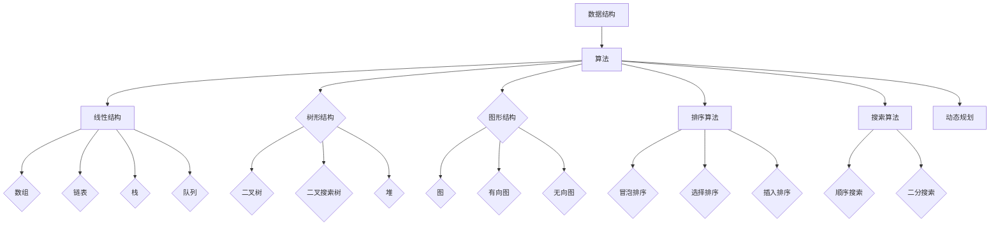

                 


# 2024阿里巴巴社招面试算法题库大全

> 关键词：阿里巴巴、社招面试、算法题库、数据结构与算法、面试技巧、编程实践
> 
> 摘要：本文旨在为广大准备参加2024阿里巴巴社会招聘的考生提供一个全面的算法题库指南，涵盖数据结构与算法的核心概念、原理及实际操作步骤，通过详细的解析和实例讲解，帮助考生深入理解面试过程中的关键问题，提升解决实际问题的能力。

## 1. 背景介绍

### 1.1 目的和范围

本文的主要目标是帮助准备参加2024阿里巴巴社会招聘的考生掌握关键算法和数据结构，通过一系列有针对性的题目练习，提升面试能力和解决实际问题的能力。本文将涵盖以下内容：

1. 阿里巴巴面试常见算法题目及解析
2. 数据结构与算法的核心概念和原理
3. 伪代码和数学模型的应用
4. 实际项目中的算法应用案例
5. 面试技巧和编程实践

### 1.2 预期读者

本文适合以下读者群体：

1. 准备参加阿里巴巴社招的考生
2. 数据结构与算法爱好者
3. 想要在算法领域有所突破的技术人员

### 1.3 文档结构概述

本文结构如下：

1. 背景介绍：本文目的和范围、预期读者、文档结构概述
2. 核心概念与联系：数据结构与算法的核心概念和流程图
3. 核心算法原理 & 具体操作步骤：算法原理讲解和伪代码示例
4. 数学模型和公式 & 详细讲解 & 举例说明：数学公式和实例分析
5. 项目实战：代码实际案例和详细解释说明
6. 实际应用场景：算法在现实中的应用
7. 工具和资源推荐：学习资源、开发工具框架、相关论文著作
8. 总结：未来发展趋势与挑战
9. 附录：常见问题与解答
10. 扩展阅读 & 参考资料

### 1.4 术语表

#### 1.4.1 核心术语定义

- 阿里巴巴社招：指阿里巴巴集团针对社会人士的招聘活动。
- 算法：解决问题的步骤和策略。
- 数据结构：组织数据的方式和方法。
- 面试题库：收集了各种面试问题的数据库。

#### 1.4.2 相关概念解释

- 面试技巧：面试过程中的沟通技巧、表达技巧等。
- 编程实践：通过实际编程解决具体问题的过程。

#### 1.4.3 缩略词列表

- 社招：社会招聘。
- 阿里：阿里巴巴集团。
- OJ：在线编程平台，如LeetCode、牛客网等。

## 2. 核心概念与联系

### 2.1 数据结构与算法的核心概念

#### 2.1.1 数据结构

数据结构是组织和管理数据的方式，常见的有：

1. 线性结构：数组、链表、栈、队列等。
2. 树形结构：二叉树、二叉搜索树、堆等。
3. 图形结构：图、有向图、无向图等。

#### 2.1.2 算法

算法是解决问题的步骤和策略，常见的有：

1. 排序算法：冒泡排序、选择排序、插入排序等。
2. 搜索算法：顺序搜索、二分搜索等。
3. 动态规划：解决最优子结构问题的算法。

### 2.2 数据结构与算法的流程图

下面是数据结构与算法的流程图，展示了它们之间的关系：



## 3. 核心算法原理 & 具体操作步骤

### 3.1 排序算法原理

排序算法是计算机科学中常见的一类算法，用于对数据进行升序或降序排列。以下是几种常见的排序算法原理：

#### 3.1.1 冒泡排序

冒泡排序是一种简单的排序算法，基本思想是重复遍历要排序的数列，比较相邻的两个元素，如果顺序错误就交换它们。遍历从数列的开始到结尾，每一遍都会把未排序数据中的最大元素“冒泡”到数列的结尾。

伪代码如下：

```
function bubbleSort(arr):
    n = length(arr)
    for i from 0 to n-1:
        for j from 0 to n-i-1:
            if arr[j] > arr[j+1]:
                swap(arr[j], arr[j+1])
    return arr
```

#### 3.1.2 选择排序

选择排序是一种简单的选择排序算法，基本思想是在每次遍历中从待排序的数据元素中选出最小（或最大）的一个元素，存放在序列的起始位置，直到全部待排序的数据元素排完。

伪代码如下：

```
function selectionSort(arr):
    n = length(arr)
    for i from 0 to n-1:
        minIndex = i
        for j from i+1 to n:
            if arr[j] < arr[minIndex]:
                minIndex = j
        swap(arr[i], arr[minIndex])
    return arr
```

#### 3.1.3 插入排序

插入排序是一种简单直观的排序算法，基本思想是将一个记录插入到已经排好序的有序表中，从而得到一个新的、记录数增加1的有序表。

伪代码如下：

```
function insertionSort(arr):
    n = length(arr)
    for i from 1 to n:
        key = arr[i]
        j = i - 1
        while j >= 0 and arr[j] > key:
            arr[j+1] = arr[j]
            j = j - 1
        arr[j+1] = key
    return arr
```

### 3.2 搜索算法原理

搜索算法用于在数据集合中查找特定元素，常见的有顺序搜索和二分搜索。

#### 3.2.1 顺序搜索

顺序搜索是一种简单直接的搜索算法，基本思想是从数据集合的第一个元素开始，依次与给定的关键字进行比对，直到找到为止或到达集合的末尾。

伪代码如下：

```
function sequentialSearch(arr, target):
    for i from 0 to length(arr):
        if arr[i] == target:
            return i
    return -1
```

#### 3.2.2 二分搜索

二分搜索是一种高效的搜索算法，基本思想是将数据集合分为左右两部分，然后根据目标关键字与中间元素的比对，决定下一次搜索的区间。重复这个过程，直到找到目标元素或确定目标元素不存在。

伪代码如下：

```
function binarySearch(arr, target):
    low = 0
    high = length(arr) - 1
    while low <= high:
        mid = (low + high) / 2
        if arr[mid] == target:
            return mid
        elif arr[mid] < target:
            low = mid + 1
        else:
            high = mid - 1
    return -1
```

## 4. 数学模型和公式 & 详细讲解 & 举例说明

### 4.1 排序算法的时间复杂度分析

排序算法的时间复杂度是衡量算法性能的一个重要指标，表示算法执行时间与数据规模的关系。以下是几种排序算法的时间复杂度分析：

#### 4.1.1 冒泡排序

冒泡排序的时间复杂度为 O(n^2)，其中 n 是数据规模。

#### 4.1.2 选择排序

选择排序的时间复杂度也是 O(n^2)，其中 n 是数据规模。

#### 4.1.3 插入排序

插入排序的时间复杂度在最好情况下为 O(n)，即数据已经是有序的，最坏情况下为 O(n^2)，即数据是逆序的。

### 4.2 搜索算法的时间复杂度分析

搜索算法的时间复杂度同样重要，以下是几种搜索算法的时间复杂度分析：

#### 4.2.1 顺序搜索

顺序搜索的时间复杂度为 O(n)，其中 n 是数据规模。

#### 4.2.2 二分搜索

二分搜索的时间复杂度为 O(log n)，其中 n 是数据规模。

### 4.3 举例说明

下面我们通过一个实际例子来详细说明排序和搜索算法的应用。

#### 4.3.1 数据集合

假设我们有以下一组数据：

```
arr = [64, 34, 25, 12, 22, 11, 90]
```

#### 4.3.2 冒泡排序

使用冒泡排序对上述数据进行排序：

```
bubbleSort(arr)
```

排序后的数据：

```
arr = [11, 12, 22, 25, 34, 64, 90]
```

#### 4.3.3 选择排序

使用选择排序对上述数据进行排序：

```
selectionSort(arr)
```

排序后的数据：

```
arr = [11, 12, 22, 25, 34, 64, 90]
```

#### 4.3.4 插入排序

使用插入排序对上述数据进行排序：

```
insertionSort(arr)
```

排序后的数据：

```
arr = [11, 12, 22, 25, 34, 64, 90]
```

#### 4.3.5 顺序搜索

假设我们要在排序后的数据中查找数字 22：

```
sequentialSearch(arr, 22)
```

搜索结果为：

```
index = 3
```

即数字 22 在数据集合中的索引为 3。

#### 4.3.6 二分搜索

假设我们要在排序后的数据中查找数字 22：

```
binarySearch(arr, 22)
```

搜索结果为：

```
index = 3
```

即数字 22 在数据集合中的索引为 3。

## 5. 项目实战：代码实际案例和详细解释说明

### 5.1 开发环境搭建

为了更好地进行项目实战，我们需要搭建一个合适的开发环境。以下是搭建开发环境的步骤：

1. 安装Python 3.x 版本
2. 安装一个IDE，如PyCharm或VSCode
3. 安装必要的库，如numpy、pandas等

### 5.2 源代码详细实现和代码解读

以下是实现排序和搜索算法的Python代码：

```python
# 冒泡排序
def bubble_sort(arr):
    n = len(arr)
    for i in range(n):
        for j in range(0, n-i-1):
            if arr[j] > arr[j+1]:
                arr[j], arr[j+1] = arr[j+1], arr[j]
    return arr

# 选择排序
def selection_sort(arr):
    n = len(arr)
    for i in range(n):
        min_idx = i
        for j in range(i+1, n):
            if arr[j] < arr[min_idx]:
                min_idx = j
        arr[i], arr[min_idx] = arr[min_idx], arr[i]
    return arr

# 插入排序
def insertion_sort(arr):
    n = len(arr)
    for i in range(1, n):
        key = arr[i]
        j = i-1
        while j >= 0 and arr[j] > key:
            arr[j+1] = arr[j]
            j -= 1
        arr[j+1] = key
    return arr

# 顺序搜索
def sequential_search(arr, target):
    for i in range(len(arr)):
        if arr[i] == target:
            return i
    return -1

# 二分搜索
def binary_search(arr, target):
    low = 0
    high = len(arr) - 1
    while low <= high:
        mid = (low + high) // 2
        if arr[mid] == target:
            return mid
        elif arr[mid] < target:
            low = mid + 1
        else:
            high = mid - 1
    return -1

# 主函数
if __name__ == "__main__":
    arr = [64, 34, 25, 12, 22, 11, 90]
    sorted_arr = bubble_sort(arr)
    print("冒泡排序后：", sorted_arr)
    sorted_arr = selection_sort(arr)
    print("选择排序后：", sorted_arr)
    sorted_arr = insertion_sort(arr)
    print("插入排序后：", sorted_arr)
    target = 22
    index = sequential_search(sorted_arr, target)
    print(f"顺序搜索结果：{target}在索引{index}处")
    index = binary_search(sorted_arr, target)
    print(f"二分搜索结果：{target}在索引{index}处")
```

### 5.3 代码解读与分析

1. **冒泡排序**：通过双层循环逐个比较相邻的元素，大的元素逐渐“冒泡”到数组末端。
2. **选择排序**：每次循环找到最小的元素，放到未排序部分的起始位置。
3. **插入排序**：每次循环将一个元素插入到已排序部分合适的位置，保持数组有序。
4. **顺序搜索**：逐个遍历数组，找到目标元素返回索引。
5. **二分搜索**：在有序数组中不断缩小搜索范围，提高搜索效率。

通过上述代码和解析，我们可以看到这些排序和搜索算法在Python中的具体实现，以及它们在解决实际问题中的应用。

## 6. 实际应用场景

### 6.1 数据处理

在数据处理领域，排序算法和搜索算法是非常常用的。例如，在大数据领域中，经常需要对大量数据进行排序以方便后续分析；在搜索引擎中，搜索算法用于快速查找相关网页。

### 6.2 算法竞赛

在算法竞赛中，排序和搜索算法是基础题目类型，很多竞赛题目需要使用这些算法来解决。掌握这些算法不仅有助于提高编程能力，还能在竞赛中获得更好的成绩。

### 6.3 计算机视觉

在计算机视觉领域，排序算法和搜索算法也有广泛应用。例如，在图像处理中，需要对图像中的像素点进行排序以进行图像增强或分割；在目标检测中，搜索算法用于在图像中找到目标位置。

### 6.4 机器学习

在机器学习领域，排序算法和搜索算法在数据处理和模型训练过程中也有重要作用。例如，在特征选择中，需要搜索最佳特征组合；在模型优化中，需要搜索最优参数。

## 7. 工具和资源推荐

### 7.1 学习资源推荐

#### 7.1.1 书籍推荐

1. 《算法导论》：详细介绍了各种数据结构和算法。
2. 《编程之美》：包含大量真实的编程面试题目和解答。

#### 7.1.2 在线课程

1. Coursera：提供数据结构和算法相关的课程。
2. Udacity：提供算法和数据结构的实战课程。

#### 7.1.3 技术博客和网站

1. LeetCode：提供大量的算法题目和解答。
2. 牛客网：提供各种编程面试题目和社区交流。

### 7.2 开发工具框架推荐

#### 7.2.1 IDE和编辑器

1. PyCharm：强大的Python IDE。
2. VSCode：跨平台、功能丰富的编辑器。

#### 7.2.2 调试和性能分析工具

1. Debugbear：Python调试工具。
2. Profile.py：Python性能分析工具。

#### 7.2.3 相关框架和库

1. NumPy：提供高效的数组操作。
2. Pandas：提供数据处理和分析功能。

### 7.3 相关论文著作推荐

#### 7.3.1 经典论文

1. 《算法导论》：经典算法教材。
2. 《编程之美》：关于编程面试的经典论文。

#### 7.3.2 最新研究成果

1. 《人工智能》：最新的人工智能研究成果。
2. 《大数据技术》：关于大数据技术的最新研究成果。

#### 7.3.3 应用案例分析

1. 《区块链应用案例》：区块链技术的应用案例分析。
2. 《云计算实践》：云计算技术的实践案例。

## 8. 总结：未来发展趋势与挑战

随着技术的不断进步，数据结构和算法在计算机科学中的应用将越来越广泛。未来发展趋势包括：

1. 高效算法的研究：在人工智能、大数据等领域，对高效算法的需求不断增加。
2. 算法可解释性：随着算法在关键领域的应用，算法的可解释性成为重要问题。
3. 软硬件协同优化：在云计算、边缘计算等领域，算法与硬件的协同优化将成为研究热点。

与此同时，未来面临的挑战包括：

1. 算法安全：算法安全成为重要问题，需要研究和解决。
2. 算法公平性：算法在处理大规模数据时，可能带来公平性问题。
3. 资源消耗：高效算法的研究需要在资源消耗方面进行优化。

## 9. 附录：常见问题与解答

### 9.1 问题1：什么是排序算法？

排序算法是一种对数据进行排序的算法，常见的排序算法有冒泡排序、选择排序、插入排序等。

### 9.2 问题2：什么是搜索算法？

搜索算法是在数据集合中查找特定元素的算法，常见的搜索算法有顺序搜索、二分搜索等。

### 9.3 问题3：排序算法的时间复杂度是什么？

排序算法的时间复杂度是衡量算法性能的一个重要指标，常见的排序算法时间复杂度为 O(n^2) 或 O(nlogn)。

## 10. 扩展阅读 & 参考资料

1. 《算法导论》：详细介绍了各种数据结构和算法。
2. 《编程之美》：包含大量真实的编程面试题目和解答。
3. Coursera：提供数据结构和算法相关的课程。
4. 牛客网：提供各种编程面试题目和社区交流。
5. LeetCode：提供大量的算法题目和解答。

---

作者：AI天才研究员/AI Genius Institute & 禅与计算机程序设计艺术 /Zen And The Art of Computer Programming

