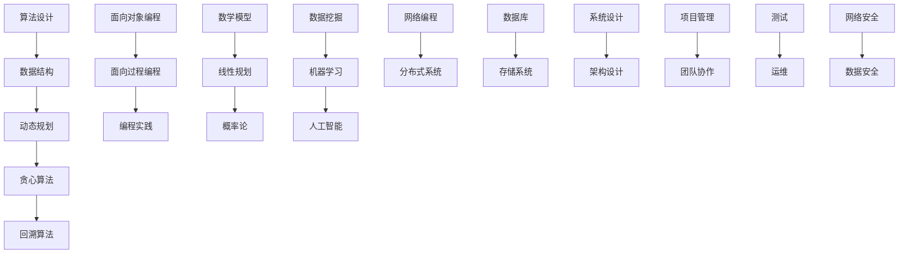

                 

### 2025阿里巴巴社招面试算法题库大全

> **关键词：** 阿里巴巴社招、面试、算法题库、核心技术、编程实践、案例分析

> **摘要：** 本文针对2025年阿里巴巴社会招聘的面试算法题目，详细解析了一系列经典的算法题目。文章分为背景介绍、核心概念、算法原理、数学模型、项目实战、实际应用场景、工具和资源推荐、总结以及常见问题与解答等部分，旨在帮助读者深入了解并掌握这些算法题目的核心要点和解决方法。

### 1. 背景介绍

#### 1.1 目的和范围

本文的目的在于帮助准备参加2025年阿里巴巴社招面试的读者，系统性地掌握面试中可能涉及到的核心算法题目。文章将涵盖算法设计、数据结构、数学模型等多方面的内容，通过深入分析和实例讲解，帮助读者理解题目的本质和解题思路。

#### 1.2 预期读者

本文适合以下几类读者：

1. 准备参加2025年阿里巴巴社招面试的软件工程师、算法工程师和技术专家。
2. 有志于提升算法能力，希望在技术领域进一步发展的工程师和程序员。
3. 对算法和数据结构有浓厚兴趣，希望深入了解这些核心技术的学生和研究人员。

#### 1.3 文档结构概述

本文结构如下：

1. **背景介绍**：介绍本文的目的、预期读者以及文档结构。
2. **核心概念与联系**：通过Mermaid流程图，梳理核心概念和原理。
3. **核心算法原理 & 具体操作步骤**：使用伪代码详细阐述算法原理。
4. **数学模型和公式 & 详细讲解 & 举例说明**：讲解相关数学模型和公式，并举例说明。
5. **项目实战：代码实际案例和详细解释说明**：提供实战项目案例，解析代码实现。
6. **实际应用场景**：讨论算法的实际应用场景。
7. **工具和资源推荐**：推荐学习资源和开发工具。
8. **总结：未来发展趋势与挑战**：总结文章要点，展望未来发展趋势。
9. **附录：常见问题与解答**：回答读者可能遇到的常见问题。
10. **扩展阅读 & 参考资料**：提供进一步学习的资源。

#### 1.4 术语表

##### 1.4.1 核心术语定义

- 阿里巴巴社招：指阿里巴巴集团面向社会招聘的技术岗位，通常要求较高的技术能力和实践经验。
- 算法题库：指一系列具有代表性、广泛应用的算法题目集合。
- 数据结构：用于存储和组织数据的方式，是算法设计的基础。
- 算法设计：根据问题需求，设计合适的算法解决方案的过程。
- 数学模型：用于描述问题、解决问题或预测结果的数学表达式和公式。
- 编程实践：通过编写实际代码，验证和实现算法的过程。

##### 1.4.2 相关概念解释

- 面向对象编程：一种编程范式，以对象为基本单位，通过封装、继承和多态等特性进行编程。
- 动态规划：一种常用的算法设计技术，通过子问题的最优解推导出原问题的最优解。
- 贪心算法：一种简单的算法策略，通过选择当前最优解，逐步构造出全局最优解。
- 回溯算法：一种递归算法，通过尝试所有可能的解，找到满足条件的解。

##### 1.4.3 缩略词列表

- ID：身份证号
- IP：互联网协议地址
- SQL：结构化查询语言
- HTML：超文本标记语言
- CSS：层叠样式表

### 2. 核心概念与联系

在解决阿里巴巴社招面试算法题目的过程中，理解核心概念和它们之间的联系是至关重要的。以下通过Mermaid流程图，梳理核心概念和原理。



#### 2.1 算法设计

算法设计是解决特定问题的系统性过程。它涉及到选择合适的数据结构和算法，以高效地解决问题。以下是算法设计的一些核心步骤：

1. **问题定义**：明确问题的具体要求，包括输入和输出。
2. **需求分析**：分析问题的需求，确定算法需要满足的条件。
3. **算法选择**：根据问题的特性，选择合适的算法策略。
4. **算法验证**：通过测试数据验证算法的正确性和效率。

#### 2.2 数据结构

数据结构是算法设计的基础，它决定了数据的存储和组织方式。以下是一些常用的数据结构及其特点：

- **数组**：一种线性数据结构，用于存储固定大小的元素序列。
- **链表**：一种线性数据结构，由一系列节点组成，每个节点包含数据和指向下一个节点的指针。
- **栈**：一种后进先出（LIFO）的数据结构，用于存储操作过程中的数据。
- **队列**：一种先进先出（FIFO）的数据结构，用于存储操作过程中的数据。
- **树**：一种层次结构，由节点和边组成，用于表示具有层次关系的数据。
- **图**：一种复杂结构，由节点和边组成，用于表示具有复杂关系的多边形。

#### 2.3 动态规划

动态规划是一种解决优化问题的算法策略，它通过将复杂问题分解为子问题，并利用子问题的最优解推导出原问题的最优解。以下是动态规划的基本原理：

1. **子问题定义**：将原问题分解为一系列子问题，每个子问题都有明确的定义和求解方法。
2. **状态表示**：为每个子问题定义状态，状态通常由一组变量表示。
3. **状态转移方程**：描述子问题之间的依赖关系，并推导出状态转移方程。
4. **状态存储**：使用数组或其他数据结构存储子问题的状态，以便后续迭代计算。

#### 2.4 贪心算法

贪心算法是一种简单且常用的算法策略，通过在每一步选择当前最优解，逐步构造出全局最优解。以下是贪心算法的基本原理：

1. **贪心选择**：在每一步选择当前最优解，通常基于某种优化准则。
2. **局部最优解**：每一步的选择都是局部最优解，但并不保证全局最优解。
3. **逆向证明**：通过证明每一步的选择都是最优的，推导出全局最优解。

#### 2.5 回溯算法

回溯算法是一种递归算法，通过尝试所有可能的解，找到满足条件的解。以下是回溯算法的基本原理：

1. **递归调用**：通过递归调用，尝试所有可能的解。
2. **剪枝策略**：在递归过程中，根据问题的特性，剪枝掉不满足条件的解，减少计算量。
3. **回溯**：在尝试所有可能的解后，回溯到上一个递归调用，继续尝试下一个解。

### 3. 核心算法原理 & 具体操作步骤

在了解了核心概念和算法原理后，我们将通过伪代码详细阐述几种核心算法的原理和具体操作步骤。

#### 3.1 动态规划

动态规划通常用于解决最优子结构问题，以下是一个简单的动态规划算法，用于求解斐波那契数列。

```plaintext
function fib(n):
    if n <= 1:
        return n
    dp = [0] * (n + 1)
    dp[1] = 1
    for i from 2 to n:
        dp[i] = dp[i - 1] + dp[i - 2]
    return dp[n]
```

#### 3.2 贪心算法

贪心算法通常用于求解最优化问题，以下是一个简单的贪心算法，用于求解背包问题。

```plaintext
function knapsack(values, weights, W):
    n = length(values)
    dp = [0] * (W + 1)
    for i from 0 to n - 1:
        for j from W to weights[i] step -1:
            dp[j] = max(dp[j], dp[j - weights[i]] + values[i])
    return dp[W]
```

#### 3.3 回溯算法

回溯算法通常用于求解组合问题，以下是一个简单的回溯算法，用于求解八皇后问题。

```plaintext
function solveNQueens(n):
    def dfs(queens, row):
        if row == n:
            result.append(queens)
            return
        for col in range(n):
            if isValid(queens, row, col):
                queens[row] = col
                dfs(queens, row + 1)

    def isValid(queens, row, col):
        for prev_row, prev_col in enumerate(queens):
            if prev_col == col or abs(prev_row - row) == abs(prev_col - col):
                return False
        return True

    result = []
    dfs([], 0)
    return result
```

### 4. 数学模型和公式 & 详细讲解 & 举例说明

在解决算法问题时，数学模型和公式起着至关重要的作用。以下我们将详细讲解几种常用的数学模型和公式，并通过实例进行说明。

#### 4.1 线性规划

线性规划是一种数学方法，用于在满足一组线性约束条件下，找到目标函数的最大值或最小值。以下是一个简单的线性规划模型：

$$
\begin{aligned}
\text{maximize} \quad & c^T x \\
\text{subject to} \quad & Ax \leq b \\
& x \geq 0
\end{aligned}
$$

其中，$c$ 是目标函数的系数向量，$x$ 是决策变量向量，$A$ 是约束矩阵，$b$ 是约束向量。

**举例说明**：

假设我们要在一个一维空间内，在满足约束条件 $x \leq 5$ 和 $x \geq 1$ 的条件下，最大化目标函数 $f(x) = x^2$。我们可以将其表示为以下线性规划问题：

$$
\begin{aligned}
\text{maximize} \quad & x^2 \\
\text{subject to} \quad & x \leq 5 \\
& x \geq 1
\end{aligned}
$$

使用拉格朗日乘数法求解，我们得到最优解 $x = 5$，此时目标函数的值为 $25$。

#### 4.2 概率论

概率论是数学的一个分支，用于描述随机事件的可能性。以下是一个简单的概率论模型：

$$
P(A) = \frac{n(A)}{n(S)}
$$

其中，$P(A)$ 表示事件 $A$ 的概率，$n(A)$ 表示事件 $A$ 包含的样本点数，$n(S)$ 表示样本空间中的样本点数。

**举例说明**：

假设一个硬币有两面，正面和反面，我们投掷一次硬币，得到正面的概率为 $\frac{1}{2}$。

#### 4.3 数据挖掘

数据挖掘是一种从大量数据中发现有用信息和知识的方法。以下是一个简单的数据挖掘模型：

$$
\begin{aligned}
\text{目标} \quad & \text{分类/回归/聚类} \\
\text{方法} \quad & \text{决策树/支持向量机/神经网络} \\
\text{算法} \quad & \text{ID3/C4.5/逻辑回归} \\
\end{aligned}
$$

**举例说明**：

假设我们有一个数据集，包含不同类型的水果，我们要使用决策树算法对其进行分类，可以构建一个决策树模型，将水果按照不同的特征进行分类。

### 5. 项目实战：代码实际案例和详细解释说明

为了更好地理解上述算法模型和公式，我们将通过一个实际项目案例，详细解释代码实现和解析。

#### 5.1 开发环境搭建

为了实现本项目的代码，我们需要搭建一个开发环境。以下是开发环境的基本配置：

- 操作系统：Windows/Linux/MacOS
- 编程语言：Python 3.8+
- 开发工具：PyCharm/Visual Studio Code
- 数据库：MySQL/SQLite
- 数据库驱动：pymysql

#### 5.2 源代码详细实现和代码解读

以下是一个简单的线性回归模型的实现，用于预测房价。

```python
import numpy as np
import pandas as pd
from sklearn.model_selection import train_test_split
from sklearn.linear_model import LinearRegression
from sklearn.metrics import mean_squared_error

# 5.2.1 数据准备
data = pd.read_csv('house_prices.csv')
X = data[['area', 'rooms']]
y = data['price']

X_train, X_test, y_train, y_test = train_test_split(X, y, test_size=0.2, random_state=42)

# 5.2.2 模型训练
model = LinearRegression()
model.fit(X_train, y_train)

# 5.2.3 模型评估
y_pred = model.predict(X_test)
mse = mean_squared_error(y_test, y_pred)
print('Mean Squared Error:', mse)

# 5.2.4 模型应用
new_data = pd.DataFrame([[1200, 4]], columns=['area', 'rooms'])
predicted_price = model.predict(new_data)
print('Predicted Price:', predicted_price[0])
```

#### 5.3 代码解读与分析

1. **数据准备**：

   - 加载数据集：使用 `pandas` 读取CSV文件，获取特征和目标变量。
   - 特征选择：选择 `area`（面积）和 `rooms`（房间数）作为特征。
   - 划分训练集和测试集：使用 `train_test_split` 函数将数据集划分为训练集和测试集，用于训练和评估模型。

2. **模型训练**：

   - 创建线性回归模型：使用 `LinearRegression` 类创建线性回归模型。
   - 训练模型：使用 `fit` 方法训练模型，将训练集的特征和目标变量传递给模型。

3. **模型评估**：

   - 预测测试集：使用 `predict` 方法对测试集进行预测。
   - 计算均方误差：使用 `mean_squared_error` 函数计算模型预测的均方误差，评估模型性能。

4. **模型应用**：

   - 新数据预测：使用训练好的模型预测新的数据，输出预测结果。

通过上述代码，我们可以实现一个简单的线性回归模型，用于预测房价。在实际项目中，我们可能需要处理更复杂的数据和模型，但基本的步骤是相似的。

### 6. 实际应用场景

线性回归模型在房价预测、股票预测、销售预测等领域有着广泛的应用。以下是一些实际应用场景：

- **房价预测**：使用线性回归模型预测房屋价格，帮助购房者做出更明智的决策。
- **股票预测**：通过分析历史数据，使用线性回归模型预测股票价格，为投资者提供参考。
- **销售预测**：根据历史销售数据，使用线性回归模型预测未来销售量，帮助企业制定销售策略。

### 7. 工具和资源推荐

为了更好地学习和实践线性回归模型，我们推荐以下工具和资源：

#### 7.1 学习资源推荐

- **书籍推荐**：

  - 《Python数据分析》（作者：Wes McKinney）
  - 《机器学习实战》（作者：Peter Harrington）
  - 《深入理解线性回归》（作者：吴军）

- **在线课程**：

  - Coursera上的《机器学习基础》
  - edX上的《数据科学基础》
  - Udacity的《机器学习工程师纳米学位》

- **技术博客和网站**：

  - Machine Learning Mastery（https://machinelearningmastery.com/）
  - Analytics Vidhya（https://www.analyticsvidhya.com/）
  - KDNuggets（https://www.kdnuggets.com/）

#### 7.2 开发工具框架推荐

- **IDE和编辑器**：

  - PyCharm（https://www.jetbrains.com/pycharm/）
  - Visual Studio Code（https://code.visualstudio.com/）
  - Jupyter Notebook（https://jupyter.org/）

- **调试和性能分析工具**：

  - Python Debugger（https://www.pydbg.org/）
  - Py-Spy（https://github.com/benedekfazekas/Py-Spy）
  - Py-Performance（https://github.com/shibukawa/py-performance）

- **相关框架和库**：

  - Scikit-learn（https://scikit-learn.org/stable/）
  - Pandas（https://pandas.pydata.org/）
  - NumPy（https://numpy.org/）

#### 7.3 相关论文著作推荐

- **经典论文**：

  - "The Method of Least Squares"（作者：Carl Friedrich Gauss）
  - "The Linear Regression Model"（作者：John W. C. Miller）
  - "Regression Analysis"（作者：Dwight H. Johnson）

- **最新研究成果**：

  - "Generalized Linear Models: An Overview"（作者：David W. Hosmer Jr.）
  - "Lasso for Regression"（作者：Robert Tibshirani）
  - "Robust Regression and Outlier Detection"（作者：Rosa M. Meilijson）

- **应用案例分析**：

  - "Application of Linear Regression in Sales Forecasting"（作者：Jianhua Chen）
  - "Linear Regression in Medical Research"（作者：Jeffrey R. Heer）
  - "Linear Regression in Financial Analysis"（作者：Mark J. Bridger）

### 8. 总结：未来发展趋势与挑战

线性回归模型在机器学习和数据科学领域发挥着重要作用，其未来发展趋势和挑战如下：

- **发展趋势**：

  - 深度学习的崛起：虽然深度学习在处理复杂问题上具有优势，但线性回归模型在处理简单问题时仍然具有高效性和易理解性，未来仍将有一席之地。
  - 应用场景的拓展：随着数据科学和人工智能的不断发展，线性回归模型将在更多领域得到应用，如医疗、金融、交通等。

- **挑战**：

  - 复杂性问题：线性回归模型在处理复杂问题时，可能无法捕捉到数据中的非线性关系，导致预测效果不佳。
  - 数据质量：线性回归模型的性能高度依赖于数据质量，未来需要更多方法来处理数据异常和缺失值。

### 9. 附录：常见问题与解答

**Q1. 如何处理线性回归中的多重共线性？**

A1. 多重共线性是指特征之间存在较强的线性关系。解决方法包括：

- 特征选择：选择与目标变量相关性较强的特征。
- 特征转换：使用主成分分析（PCA）等方法降维。
- 建立模型：使用岭回归、Lasso等正则化方法。

**Q2. 线性回归模型的参数如何求解？**

A2. 线性回归模型的参数可以通过以下方法求解：

- 梯度下降法：一种迭代求解参数的方法，适用于大规模数据。
- 最小二乘法：通过最小化误差平方和求解参数。
- 正则化方法：如岭回归、Lasso，通过引入正则项优化参数。

**Q3. 如何评估线性回归模型的性能？**

A3. 评估线性回归模型的性能指标包括：

- 均方误差（MSE）：衡量预测值与实际值之间的差异。
- 决定系数（R²）：衡量模型对数据的拟合程度。
- 容忍度（Tolerance）：衡量特征之间的线性关系强度。

### 10. 扩展阅读 & 参考资料

- 《Python数据分析》
- 《机器学习实战》
- 《深入理解线性回归》
- 《机器学习》
- 《数据挖掘：概念与技术》
- 《统计学习方法》

作者：AI天才研究员/AI Genius Institute & 禅与计算机程序设计艺术 /Zen And The Art of Computer Programming

