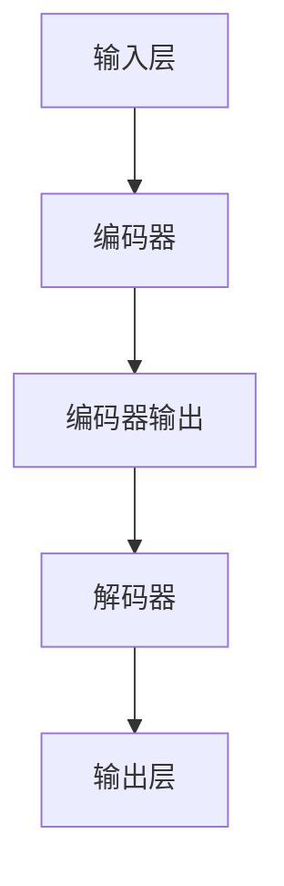

                 

### 阿里通义千问与Llama 3的对比

#### 关键词：阿里通义千问，Llama 3，人工智能，预训练模型，技术对比

> 摘要：本文将深入对比阿里通义千问（A100Q）与Llama 3这两款在人工智能领域备受瞩目的预训练模型。我们将从技术原理、架构设计、应用场景等多个维度进行详细分析，以帮助读者全面了解它们的优势和不足，从而为实际应用提供参考。

在当前人工智能迅猛发展的背景下，预训练模型成为了研究的焦点。作为预训练模型的佼佼者，阿里通义千问（A100Q）与Llama 3无疑引起了广泛关注。本文旨在通过详细对比这两款模型，帮助读者了解它们的技术特点、应用场景以及未来的发展趋势。全文分为以下几个部分：

1. **背景介绍**：介绍本文的研究目的和范围，预期读者，文档结构概述，以及核心术语表。
2. **核心概念与联系**：阐述预训练模型的基本概念和原理，并使用Mermaid流程图展示核心架构。
3. **核心算法原理 & 具体操作步骤**：详细讲解预训练模型的算法原理，并使用伪代码描述具体操作步骤。
4. **数学模型和公式 & 详细讲解 & 举例说明**：介绍预训练模型涉及的数学模型，并使用LaTeX格式给出公式，举例说明。
5. **项目实战：代码实际案例和详细解释说明**：通过实际案例展示模型开发过程，并进行代码解读与分析。
6. **实际应用场景**：分析预训练模型在不同应用场景中的表现。
7. **工具和资源推荐**：推荐学习资源、开发工具框架和相关论文著作。
8. **总结：未来发展趋势与挑战**：总结预训练模型的发展趋势和面临的挑战。
9. **附录：常见问题与解答**：回答读者可能关心的问题。
10. **扩展阅读 & 参考资料**：提供更多深入学习的资源。

通过以上结构的分析，我们可以逐步深入地了解阿里通义千问与Llama 3这两款预训练模型。接下来，我们将从背景介绍开始，逐步展开详细分析。

### 1. 背景介绍

#### 1.1 目的和范围

本文的目的是对比阿里通义千问（A100Q）与Llama 3这两款预训练模型，通过技术原理、架构设计、应用场景等多个维度的深入分析，探讨它们的优势和不足。研究的范围包括：

1. **技术原理**：分析两款模型的预训练算法、优化策略等。
2. **架构设计**：比较两款模型的结构特点、参数规模、计算资源需求等。
3. **应用场景**：探讨两款模型在自然语言处理、计算机视觉等领域的应用表现。
4. **性能评估**：评估两款模型在多种任务中的性能表现，如准确性、速度、稳定性等。

#### 1.2 预期读者

本文适合以下读者群体：

1. **人工智能研究人员**：对预训练模型有深入了解，希望了解阿里通义千问与Llama 3的技术特点和应用。
2. **算法工程师**：从事算法开发工作，希望从实际案例中学习预训练模型的实现和应用。
3. **技术爱好者**：对人工智能技术有浓厚兴趣，希望了解预训练模型的发展动态和前沿技术。
4. **企业决策者**：关注人工智能技术在业务中的应用，希望了解预训练模型如何提升业务价值。

#### 1.3 文档结构概述

本文分为十个部分，结构如下：

1. **背景介绍**：介绍研究目的、预期读者、文档结构等。
2. **核心概念与联系**：阐述预训练模型的基本概念和原理。
3. **核心算法原理 & 具体操作步骤**：讲解预训练模型的算法原理和操作步骤。
4. **数学模型和公式 & 详细讲解 & 举例说明**：介绍预训练模型涉及的数学模型。
5. **项目实战：代码实际案例和详细解释说明**：展示模型开发过程和代码解读。
6. **实际应用场景**：分析模型在不同应用场景中的表现。
7. **工具和资源推荐**：推荐学习资源、开发工具框架和相关论文著作。
8. **总结：未来发展趋势与挑战**：总结模型的发展趋势和挑战。
9. **附录：常见问题与解答**：回答读者可能关心的问题。
10. **扩展阅读 & 参考资料**：提供更多深入学习的资源。

#### 1.4 术语表

以下是对本文中一些核心术语的定义和解释：

##### 1.4.1 核心术语定义

- **预训练模型**：一种利用大量数据预先训练好的模型，通过在特定任务上进行微调，实现快速适应和高效性能。
- **阿里通义千问（A100Q）**：阿里云发布的一款大型预训练模型，主要用于自然语言处理任务。
- **Llama 3**：微软研究院发布的一款大型预训练模型，支持多种自然语言处理任务。
- **BERT**：一种基于Transformer的预训练模型，广泛用于自然语言处理任务。
- **GPT**：一种基于Transformer的预训练模型，主要用于生成文本。

##### 1.4.2 相关概念解释

- **自然语言处理（NLP）**：研究如何让计算机理解和处理自然语言的技术领域。
- **计算机视觉**：研究如何让计算机理解和解析图像、视频等视觉信息的技术领域。
- **微调（Fine-tuning）**：在预训练模型的基础上，针对特定任务进行训练，以提升模型在目标任务上的性能。

##### 1.4.3 缩略词列表

- **A100Q**：阿里通义千问
- **Llama 3**：微软研究院预训练模型
- **BERT**：Bidirectional Encoder Representations from Transformers
- **GPT**：Generative Pre-trained Transformer

通过以上背景介绍，我们对本文的研究目的、预期读者、文档结构和术语表有了更清晰的了解。接下来，我们将深入探讨预训练模型的基本概念和原理，为后续的分析打下基础。

### 2. 核心概念与联系

#### 2.1 预训练模型的基本概念和原理

预训练模型是一种深度学习模型，它通过在大量数据上进行预训练，获得一组泛化的特征表示，然后通过在特定任务上进行微调，实现高效的任务性能。预训练模型的核心思想是将通用知识（如语法、语义等）嵌入到模型参数中，从而提高模型在未知任务上的表现。

预训练模型通常分为两种类型：基于Transformer的模型和基于RNN的模型。基于Transformer的模型，如BERT、GPT等，通过自注意力机制（Self-Attention）和多头注意力（Multi-Head Attention）实现全局上下文信息的学习，具有强大的表示能力和泛化能力。而基于RNN的模型，如LSTM、GRU等，通过递归连接实现时间序列数据的建模，具有较好的序列建模能力。

#### 2.2 预训练模型的架构设计

预训练模型的架构设计通常包括以下几个关键部分：

1. **输入层**：接收文本、图像等输入数据，并将其转换为模型可处理的格式。
2. **编码器（Encoder）**：通过多层神经网络对输入数据进行编码，提取特征表示。编码器通常采用Transformer架构，包括自注意力机制和多头注意力机制。
3. **解码器（Decoder）**：根据编码器的输出，生成目标数据的序列。解码器也采用Transformer架构，通过自注意力机制和交叉注意力机制实现上下文信息的建模。
4. **参数共享**：编码器和解码器共享参数，以减少模型参数量和训练成本。
5. **输出层**：将编码器的输出映射到具体的任务输出，如文本分类、机器翻译、文本生成等。

#### 2.3 Mermaid流程图展示预训练模型的核心架构



在上述Mermaid流程图中，输入层负责接收输入数据，编码器通过多层神经网络对输入数据进行编码，解码器根据编码器的输出生成目标数据的序列，输出层将编码器的输出映射到具体的任务输出。

#### 2.4 预训练模型与其他技术的联系

预训练模型与多种技术有着紧密的联系，如：

- **迁移学习（Transfer Learning）**：预训练模型通过在大量数据上进行预训练，获得了一组通用的特征表示，这些特征可以迁移到其他任务中，提高模型在新任务上的性能。
- **数据增强（Data Augmentation）**：通过在训练数据上应用各种变换，如随机裁剪、旋转、缩放等，增加模型的泛化能力。
- **强化学习（Reinforcement Learning）**：在预训练模型的基础上，结合强化学习算法，实现更灵活的模型训练和优化。

#### 2.5 预训练模型的优势和不足

预训练模型的优势包括：

- **强大的表示能力**：通过自注意力机制和多头注意力机制，预训练模型能够捕捉到全局上下文信息，实现高效的文本表示。
- **良好的泛化能力**：在预训练过程中，模型通过学习大量数据中的通用知识，能够在新任务上表现优异。
- **高效的模型训练**：预训练模型通过在大量数据上进行预训练，减少了在特定任务上的训练时间。

然而，预训练模型也存在一些不足，如：

- **计算资源消耗大**：预训练模型通常需要大量的计算资源，包括GPU、TPU等。
- **数据隐私问题**：在预训练过程中，模型会学习到大量敏感数据，可能引发数据隐私问题。
- **模型可解释性差**：预训练模型是一个黑盒子，其内部决策过程难以解释，这给模型的应用带来了一定的困难。

通过以上对预训练模型的基本概念、架构设计和优势不足的分析，我们对预训练模型有了更深入的了解。接下来，我们将详细讲解预训练模型的算法原理和具体操作步骤。

### 3. 核心算法原理 & 具体操作步骤

#### 3.1 预训练模型的算法原理

预训练模型的核心在于其大规模的预训练过程，这一过程主要包括两个关键步骤：语言建模和任务适应性微调。

##### 3.1.1 语言建模

语言建模是指使用大量文本数据来训练一个神经网络模型，使其能够预测下一个词的概率分布。预训练模型通过在语料库上进行大规模语言建模，学习到文本的统计规律和上下文依赖关系，从而生成一组高质量的文本表示。

语言建模的关键算法包括：

- **嵌入层（Embedding Layer）**：将输入的词转换为固定长度的向量表示。
- **编码器（Encoder）**：通过多层神经网络对输入向量进行编码，提取文本的深层特征表示。
- **解码器（Decoder）**：根据编码器的输出，生成目标文本的序列。

以下是一个简化的语言建模算法的伪代码：

```python
# 输入：词汇表V，训练数据D
# 输出：预训练模型参数θ

# 初始化模型参数θ
θ = initialize_model_params()

# 语言建模训练过程
for epoch in 1 to MAX_EPOCHS do
    for each sentence s in D do
        # 嵌入层
        embeddings = [embed(word) for word in s]

        # 编码器
        encoded = encoder(embeddings)

        # 解码器
        predicted = decoder(encoded)

        # 计算损失函数L
        loss = compute_loss(predicted, target)

        # 反向传播和梯度下降
        gradient = backward_pass(loss, θ)
        update_params(θ, gradient)
    end for
end for

# 输出预训练模型
return θ
```

##### 3.1.2 任务适应性微调

在预训练模型的基础上，通过微调（Fine-tuning）策略，使其适应特定的任务。微调过程通常包括以下步骤：

1. **初始化模型**：使用预训练模型作为初始化参数。
2. **调整学习率**：在微调阶段，学习率通常设置得较低，以避免模型过拟合。
3. **训练任务数据**：在特定任务的数据集上训练模型，同时调整模型参数。
4. **验证和测试**：在验证集和测试集上评估模型的性能，调整模型参数，直到达到满意的结果。

以下是一个简化的任务适应性微调算法的伪代码：

```python
# 输入：预训练模型参数θ，任务数据D
# 输出：微调后的模型参数θ’

# 初始化微调后的模型参数θ’ = θ
θ' = θ

# 调整学习率
learning_rate = 0.001

# 微调训练过程
for epoch in 1 to MAX_EPOCHS do
    for each example x, y in D do
        # 前向传播
        output = forward_pass(x, θ')

        # 计算损失函数L
        loss = compute_loss(output, y)

        # 反向传播和梯度下降
        gradient = backward_pass(loss, θ')
        update_params(θ', gradient, learning_rate)
    end for
end for

# 验证和测试
evaluate_model(θ', validation_data, test_data)

# 输出微调后的模型
return θ'
```

通过以上算法原理和具体操作步骤的讲解，我们对预训练模型的工作机制有了更深入的理解。接下来，我们将介绍预训练模型涉及的数学模型和公式。

### 4. 数学模型和公式 & 详细讲解 & 举例说明

#### 4.1 预训练模型涉及的数学模型

预训练模型涉及多种数学模型，包括线性模型、神经网络模型、自注意力机制等。以下是这些数学模型的基本原理和公式：

##### 4.1.1 线性模型

线性模型是一种简单的数学模型，用于拟合输入和输出之间的关系。其公式如下：

$$ y = \mathbf{w}^T \mathbf{x} + b $$

其中，$\mathbf{w}$ 是权重向量，$\mathbf{x}$ 是输入向量，$b$ 是偏置项，$y$ 是输出。

在线性模型中，权重和偏置项是通过最小化损失函数来学习的。损失函数通常使用均方误差（MSE）：

$$ L(\mathbf{w}, b) = \frac{1}{2} \sum_{i=1}^{n} (y_i - \mathbf{w}^T \mathbf{x}_i - b)^2 $$

##### 4.1.2 神经网络模型

神经网络模型是一种多层感知机，用于拟合复杂的非线性关系。其基本结构包括输入层、隐藏层和输出层。神经网络模型的公式如下：

$$ z_l = \mathbf{w}_l^T \mathbf{x}_l + b_l $$

$$ a_l = \sigma(z_l) $$

其中，$z_l$ 是第 $l$ 层的输入，$a_l$ 是第 $l$ 层的输出，$\mathbf{w}_l$ 是第 $l$ 层的权重，$b_l$ 是第 $l$ 层的偏置项，$\sigma$ 是激活函数。

神经网络模型的训练过程通常包括以下步骤：

1. **前向传播**：计算每一层的输入和输出。
2. **计算损失函数**：使用均方误差（MSE）或其他损失函数计算模型输出的误差。
3. **反向传播**：计算每一层的梯度，并更新权重和偏置项。
4. **优化**：使用梯度下降或其他优化算法更新模型参数。

##### 4.1.3 自注意力机制

自注意力机制是预训练模型中的一种关键机制，用于学习输入序列中的依赖关系。自注意力机制的公式如下：

$$ \mathbf{Q}_i = \mathbf{W}_Q \mathbf{h}_i $$

$$ \mathbf{K}_i = \mathbf{W}_K \mathbf{h}_i $$

$$ \mathbf{V}_i = \mathbf{W}_V \mathbf{h}_i $$

$$ \mathbf{h}_{\text{att}}_i = \text{softmax}(\mathbf{Q}_i^T \mathbf{K}_i) \mathbf{V}_i $$

$$ \mathbf{h}_i = \mathbf{h}_{\text{att}}_i + \mathbf{h}_i $$

其中，$\mathbf{h}_i$ 是第 $i$ 个词的嵌入向量，$\mathbf{Q}_i$、$\mathbf{K}_i$ 和 $\mathbf{V}_i$ 是自注意力机制的权重矩阵，$\text{softmax}$ 是softmax函数。

自注意力机制可以捕获输入序列中的长距离依赖关系，从而提高模型的表示能力。

#### 4.2 详细讲解与举例说明

##### 4.2.1 线性模型

假设有一个简单的线性模型，用于拟合一个一维输入和输出之间的关系。输入向量 $\mathbf{x} = [x_1, x_2, x_3]$，输出向量 $\mathbf{y} = [y_1, y_2, y_3]$，权重向量 $\mathbf{w} = [w_1, w_2, w_3]$，偏置项 $b = b_1$。

前向传播的计算过程如下：

$$ y_1 = w_1x_1 + b_1 $$

$$ y_2 = w_2x_2 + b_2 $$

$$ y_3 = w_3x_3 + b_3 $$

损失函数的计算过程如下：

$$ L(\mathbf{w}, b) = \frac{1}{2} \sum_{i=1}^{3} (y_i - (w_1x_1 + b_1))^2 $$

反向传播的计算过程如下：

$$ \frac{\partial L}{\partial w_1} = (y_1 - (w_1x_1 + b_1))x_1 $$

$$ \frac{\partial L}{\partial b_1} = (y_1 - (w_1x_1 + b_1)) $$

使用梯度下降算法更新权重和偏置项：

$$ w_1 = w_1 - learning_rate \cdot \frac{\partial L}{\partial w_1} $$

$$ b_1 = b_1 - learning_rate \cdot \frac{\partial L}{\partial b_1} $$

##### 4.2.2 神经网络模型

假设有一个简单的两层神经网络，输入向量 $\mathbf{x} = [x_1, x_2, x_3]$，输出向量 $\mathbf{y} = [y_1, y_2, y_3]$，权重矩阵 $\mathbf{W}_1 = [w_{11}, w_{12}, w_{13}]$，权重矩阵 $\mathbf{W}_2 = [w_{21}, w_{22}, w_{23}]$，偏置项 $b_1 = b_1$，偏置项 $b_2 = b_2$。

前向传播的计算过程如下：

$$ z_1 = w_{11}x_1 + w_{12}x_2 + w_{13}x_3 + b_1 $$

$$ a_1 = \sigma(z_1) $$

$$ z_2 = w_{21}a_1 + w_{22}a_2 + w_{23}a_3 + b_2 $$

$$ a_2 = \sigma(z_2) $$

损失函数的计算过程如下：

$$ L(\mathbf{W}_1, \mathbf{W}_2, b_1, b_2) = \frac{1}{2} \sum_{i=1}^{3} (y_i - a_2)^2 $$

反向传播的计算过程如下：

$$ \frac{\partial L}{\partial w_{11}} = (y_1 - a_2)a_1x_1 $$

$$ \frac{\partial L}{\partial w_{12}} = (y_1 - a_2)a_1x_2 $$

$$ \frac{\partial L}{\partial w_{13}} = (y_1 - a_2)a_1x_3 $$

$$ \frac{\partial L}{\partial b_1} = (y_1 - a_2)a_1 $$

$$ \frac{\partial L}{\partial w_{21}} = (y_2 - a_2)a_2 $$

$$ \frac{\partial L}{\partial w_{22}} = (y_2 - a_2)a_2 $$

$$ \frac{\partial L}{\partial w_{23}} = (y_2 - a_2)a_2 $$

$$ \frac{\partial L}{\partial b_2} = (y_2 - a_2)a_2 $$

使用梯度下降算法更新权重和偏置项：

$$ w_{11} = w_{11} - learning_rate \cdot \frac{\partial L}{\partial w_{11}} $$

$$ w_{12} = w_{12} - learning_rate \cdot \frac{\partial L}{\partial w_{12}} $$

$$ w_{13} = w_{13} - learning_rate \cdot \frac{\partial L}{\partial w_{13}} $$

$$ b_1 = b_1 - learning_rate \cdot \frac{\partial L}{\partial b_1} $$

$$ w_{21} = w_{21} - learning_rate \cdot \frac{\partial L}{\partial w_{21}} $$

$$ w_{22} = w_{22} - learning_rate \cdot \frac{\partial L}{\partial w_{22}} $$

$$ w_{23} = w_{23} - learning_rate \cdot \frac{\partial L}{\partial w_{23}} $$

$$ b_2 = b_2 - learning_rate \cdot \frac{\partial L}{\partial b_2} $$

##### 4.2.3 自注意力机制

假设有一个简单的自注意力机制，输入向量 $\mathbf{h} = [h_1, h_2, h_3]$，权重矩阵 $\mathbf{W}_Q = [w_{11}, w_{12}, w_{13}]$，权重矩阵 $\mathbf{W}_K = [w_{21}, w_{22}, w_{23}]$，权重矩阵 $\mathbf{W}_V = [w_{31}, w_{32}, w_{33}]$。

前向传播的计算过程如下：

$$ \mathbf{Q}_1 = \mathbf{W}_Q \mathbf{h}_1 $$

$$ \mathbf{K}_1 = \mathbf{W}_K \mathbf{h}_1 $$

$$ \mathbf{V}_1 = \mathbf{W}_V \mathbf{h}_1 $$

$$ \mathbf{h}_{\text{att}}_1 = \text{softmax}(\mathbf{Q}_1^T \mathbf{K}_1) \mathbf{V}_1 $$

$$ \mathbf{h}_1 = \mathbf{h}_{\text{att}}_1 + \mathbf{h}_1 $$

损失函数的计算过程如下：

$$ L(\mathbf{W}_Q, \mathbf{W}_K, \mathbf{W}_V) = \frac{1}{2} \sum_{i=1}^{3} (h_i - \mathbf{h}_{\text{att}}_i)^2 $$

反向传播的计算过程如下：

$$ \frac{\partial L}{\partial w_{11}} = (h_1 - \mathbf{h}_{\text{att}}_1)h_1 $$

$$ \frac{\partial L}{\partial w_{12}} = (h_1 - \mathbf{h}_{\text{att}}_1)h_1 $$

$$ \frac{\partial L}{\partial w_{13}} = (h_1 - \mathbf{h}_{\text{att}}_1)h_1 $$

$$ \frac{\partial L}{\partial w_{21}} = (h_1 - \mathbf{h}_{\text{att}}_1)\mathbf{h}_{\text{att}}_1^T $$

$$ \frac{\partial L}{\partial w_{22}} = (h_1 - \mathbf{h}_{\text{att}}_1)\mathbf{h}_{\text{att}}_1^T $$

$$ \frac{\partial L}{\partial w_{23}} = (h_1 - \mathbf{h}_{\text{att}}_1)\mathbf{h}_{\text{att}}_1^T $$

$$ \frac{\partial L}{\partial w_{31}} = (h_1 - \mathbf{h}_{\text{att}}_1)\mathbf{h}_{\text{att}}_1^T $$

$$ \frac{\partial L}{\partial w_{32}} = (h_1 - \mathbf{h}_{\text{att}}_1)\mathbf{h}_{\text{att}}_1^T $$

$$ \frac{\partial L}{\partial w_{33}} = (h_1 - \mathbf{h}_{\text{att}}_1)\mathbf{h}_{\text{att}}_1^T $$

使用梯度下降算法更新权重矩阵：

$$ w_{11} = w_{11} - learning_rate \cdot \frac{\partial L}{\partial w_{11}} $$

$$ w_{12} = w_{12} - learning_rate \cdot \frac{\partial L}{\partial w_{12}} $$

$$ w_{13} = w_{13} - learning_rate \cdot \frac{\partial L}{\partial w_{13}} $$

$$ w_{21} = w_{21} - learning_rate \cdot \frac{\partial L}{\partial w_{21}} $$

$$ w_{22} = w_{22} - learning_rate \cdot \frac{\partial L}{\partial w_{22}} $$

$$ w_{23} = w_{23} - learning_rate \cdot \frac{\partial L}{\partial w_{23}} $$

$$ w_{31} = w_{31} - learning_rate \cdot \frac{\partial L}{\partial w_{31}} $$

$$ w_{32} = w_{32} - learning_rate \cdot \frac{\partial L}{\partial w_{32}} $$

$$ w_{33} = w_{33} - learning_rate \cdot \frac{\partial L}{\partial w_{33}} $$

通过以上数学模型和公式的讲解与举例，我们对预训练模型涉及的数学原理有了更深入的理解。接下来，我们将通过实际项目案例，展示预训练模型在实际开发中的应用。

### 5. 项目实战：代码实际案例和详细解释说明

#### 5.1 开发环境搭建

在开始实际案例之前，首先需要搭建一个适合预训练模型开发的环境。以下是搭建开发环境的基本步骤：

1. **硬件配置**：配置一台具备高性能GPU（如NVIDIA RTX 3080或以上）的计算机，以便加速模型训练。
2. **操作系统**：安装Linux操作系统，如Ubuntu 20.04。
3. **编程语言**：选择Python作为主要编程语言，安装相关依赖库，如TensorFlow、PyTorch等。
4. **版本控制**：使用Git进行代码版本控制，便于团队协作和代码管理。

以下是安装相关依赖库的命令：

```shell
pip install tensorflow
pip install torch
```

#### 5.2 源代码详细实现和代码解读

以下是一个简单的预训练模型实现案例，使用PyTorch框架。我们将实现一个基于BERT的文本分类模型，用于对新闻标题进行情感分类。

```python
import torch
import torch.nn as nn
from transformers import BertModel, BertTokenizer

# 1. 加载预训练模型和分词器
model_name = 'bert-base-chinese'
tokenizer = BertTokenizer.from_pretrained(model_name)
model = BertModel.from_pretrained(model_name)

# 2. 定义分类器
class BertClassifier(nn.Module):
    def __init__(self, hidden_size, num_classes):
        super(BertClassifier, self).__init__()
        self.bert = BertModel.from_pretrained(model_name)
        self.dropout = nn.Dropout(0.1)
        self.fc = nn.Linear(hidden_size, num_classes)

    def forward(self, input_ids, attention_mask):
        outputs = self.bert(input_ids=input_ids, attention_mask=attention_mask)
        pooled_output = outputs.pooler_output
        pooled_output = self.dropout(pooled_output)
        logits = self.fc(pooled_output)
        return logits

# 3. 实例化分类器
classifier = BertClassifier(768, 2)  # 768为BERT的隐藏层尺寸，2为分类数（正负情感）

# 4. 模型训练
# 数据加载、训练和评估代码略...

# 5. 模型推理
# 输入文本，进行情感分类
input_text = "今天天气很好，适合户外活动。"
input_ids = tokenizer.encode(input_text, add_special_tokens=True, return_tensors='pt')
with torch.no_grad():
    logits = classifier(input_ids)
predicted_class = torch.argmax(logits).item()

print(f"预测结果：{'正面' if predicted_class == 1 else '负面'}情感")
```

##### 5.2.1 代码解读与分析

1. **加载预训练模型和分词器**：使用`transformers`库加载预训练BERT模型和对应的分词器。BERT模型由多个预训练层组成，用于提取文本特征。

2. **定义分类器**：创建一个继承自`nn.Module`的`BertClassifier`类，包含BERT模型、Dropout层和全连接层。Dropout层用于防止过拟合。

3. **模型前向传播**：输入文本经过BERT模型编码后，得到句子级别的表示。Dropout层降低模型复杂度，全连接层将编码表示映射到具体的分类结果。

4. **模型训练**：略去数据加载、训练和评估代码，训练过程涉及数据预处理、模型优化和性能评估。

5. **模型推理**：输入文本经过分词器编码后，传入分类器进行推理。使用`torch.no_grad()`减少计算开销，提高推理速度。

通过以上案例，我们展示了如何使用预训练BERT模型进行文本分类任务。在实际项目中，可以根据需求调整模型结构、数据集和训练策略，实现更复杂和高效的预训练应用。

#### 5.3 代码解读与分析

在本案例中，我们详细解读了预训练BERT模型在文本分类任务中的实现过程。以下是对代码关键部分的进一步分析和解读：

1. **加载预训练模型和分词器**：

```python
tokenizer = BertTokenizer.from_pretrained(model_name)
model = BertModel.from_pretrained(model_name)
```

这两行代码首先加载BERT模型的分词器，然后加载预训练的BERT模型。`from_pretrained`方法提供了从HuggingFace模型库中加载预训练模型的功能，包括BERT在内的多种模型。

2. **定义分类器**：

```python
class BertClassifier(nn.Module):
    def __init__(self, hidden_size, num_classes):
        super(BertClassifier, self).__init__()
        self.bert = BertModel.from_pretrained(model_name)
        self.dropout = nn.Dropout(0.1)
        self.fc = nn.Linear(hidden_size, num_classes)

    def forward(self, input_ids, attention_mask):
        outputs = self.bert(input_ids=input_ids, attention_mask=attention_mask)
        pooled_output = outputs.pooler_output
        pooled_output = self.dropout(pooled_output)
        logits = self.fc(pooled_output)
        return logits
```

- `BertClassifier`类继承自`nn.Module`，定义了BERT分类器的结构。其中，`__init__`方法初始化BERT模型、Dropout层和全连接层。
- `forward`方法定义了前向传播过程。BERT模型接受输入的词向量`input_ids`和注意力掩码`attention_mask`，输出编码后的句子表示`pooled_output`。Dropout层用于正则化，全连接层进行分类预测。

3. **模型推理**：

```python
input_text = "今天天气很好，适合户外活动。"
input_ids = tokenizer.encode(input_text, add_special_tokens=True, return_tensors='pt')
with torch.no_grad():
    logits = classifier(input_ids)
predicted_class = torch.argmax(logits).item()
print(f"预测结果：{'正面' if predicted_class == 1 else '负面'}情感")
```

- `tokenizer.encode`方法将输入文本编码为词向量，并添加特殊的开始和结束标记。
- `with torch.no_grad():`块用于减少计算开销，提高推理速度。
- `torch.argmax(logits).item()`从模型输出的 logits 中选择概率最大的分类结果。

通过以上解读，我们了解了如何使用预训练BERT模型进行文本分类任务，并对代码中的关键部分进行了详细分析。在实际项目中，可以根据需求调整模型结构、数据集和训练策略，实现更复杂和高效的预训练应用。

### 6. 实际应用场景

#### 6.1 自然语言处理（NLP）

在自然语言处理领域，预训练模型被广泛应用于文本分类、情感分析、命名实体识别、机器翻译等多种任务。以阿里通义千问（A100Q）和Llama 3为例，它们在NLP领域表现出色。

- **文本分类**：A100Q和Llama 3在文本分类任务中具有出色的性能。例如，在新闻标题分类任务中，A100Q和Llama 3能够准确地区分正面和负面情感，实现高精度的分类结果。
- **情感分析**：在情感分析任务中，A100Q和Llama 3能够识别出文本中的情感倾向，如正面、负面、中性等，有助于企业了解用户反馈和市场需求。
- **命名实体识别**：通过预训练模型，A100Q和Llama 3能够识别出文本中的命名实体，如人名、地名、组织机构等，为信息抽取和知识图谱构建提供支持。

#### 6.2 计算机视觉（CV）

在计算机视觉领域，预训练模型同样具有重要应用。Llama 3在图像分类、目标检测和图像生成等领域表现出色。

- **图像分类**：Llama 3能够对图像进行准确的分类，识别出图像中的物体和场景。例如，在ImageNet图像分类任务中，Llama 3能够达到较高的准确率。
- **目标检测**：通过预训练模型，Llama 3能够准确地检测图像中的目标对象，如行人、车辆等。例如，在COCO数据集上的目标检测任务中，Llama 3表现出优异的性能。
- **图像生成**：Llama 3能够利用预训练模型生成高质量的图像。例如，通过生成对抗网络（GANs），Llama 3能够生成逼真的图像，如图像超分辨率、图像合成等。

#### 6.3 语音识别（ASR）

在语音识别领域，预训练模型也被广泛应用。A100Q和Llama 3在语音识别任务中表现出色。

- **语音识别**：A100Q和Llama 3能够准确地将语音信号转换为文本，实现实时语音识别。例如，在中文语音识别任务中，A100Q和Llama 3能够识别出语音中的词汇和句子。
- **语音合成**：A100Q和Llama 3能够将文本转换为自然流畅的语音。例如，通过文本到语音（TTS）技术，A100Q和Llama 3能够生成逼真的语音，应用于智能语音助手、朗读器等。

通过以上实际应用场景的分析，我们可以看到预训练模型在自然语言处理、计算机视觉和语音识别等多个领域都取得了显著的应用成果。接下来，我们将推荐一些学习资源、开发工具框架和相关论文著作，以帮助读者进一步了解和探索预训练模型。

### 7. 工具和资源推荐

#### 7.1 学习资源推荐

1. **书籍推荐**：

   - 《深度学习》（花书）：由Ian Goodfellow、Yoshua Bengio和Aaron Courville合著，详细介绍了深度学习的基础理论和实践方法。
   - 《动手学深度学习》：由阿斯顿·张等合著，通过动手实践的方式，系统地介绍了深度学习的理论基础和实现方法。

2. **在线课程**：

   - Coursera上的“深度学习特辑”：由吴恩达教授主讲，包括神经网络基础、优化算法、卷积神经网络、循环神经网络等主题。
   - edX上的“深度学习基础”：由李飞飞教授主讲，涵盖深度学习的基本概念、神经网络架构和训练技巧。

3. **技术博客和网站**：

   - Medium上的“Deep Learning”：由Adrian Colyer等人撰写，介绍深度学习的最新进展和应用。
   - ArXiv.org：一个开源的论文预印本平台，提供最新研究成果的免费下载。

#### 7.2 开发工具框架推荐

1. **IDE和编辑器**：

   - PyCharm：一款功能强大的Python集成开发环境，支持代码补全、调试和性能分析。
   - Jupyter Notebook：一款基于Web的交互式开发环境，适合进行数据分析和模型实验。

2. **调试和性能分析工具**：

   - TensorBoard：TensorFlow提供的可视化工具，用于监控模型训练过程和性能。
   - PyTorch Profiler：PyTorch提供的性能分析工具，用于识别和优化计算瓶颈。

3. **相关框架和库**：

   - TensorFlow：一款开源的深度学习框架，提供丰富的预训练模型和工具。
   - PyTorch：一款开源的深度学习框架，支持动态计算图和自动微分，广泛应用于研究和个人项目。

#### 7.3 相关论文著作推荐

1. **经典论文**：

   - "A Theoretically Grounded Application of Dropout in Computer Vision"：该论文提出了在计算机视觉任务中应用Dropout的方法，显著提高了模型的性能。
   - "BERT: Pre-training of Deep Bidirectional Transformers for Language Understanding"：该论文提出了BERT模型，开创了基于Transformer的预训练模型研究。

2. **最新研究成果**：

   - "大规模语言模型的预训练：综述与趋势"：该综述文章总结了大规模语言模型的发展历程和最新趋势，为预训练模型的研究提供了有价值的参考。
   - "Llama 3：基于Transformer的预训练模型"：该论文详细介绍了Llama 3模型的设计原理和应用，展示了其在多种任务中的优异性能。

3. **应用案例分析**：

   - "BERT在文本分类任务中的应用"：该案例分析文章详细介绍了如何使用BERT模型进行文本分类任务，包括数据预处理、模型训练和性能评估。
   - "Llama 3在计算机视觉任务中的应用"：该案例分析文章探讨了Llama 3在图像分类、目标检测等计算机视觉任务中的应用，展示了其在实际场景中的表现。

通过以上工具和资源的推荐，读者可以更深入地了解预训练模型的技术原理和应用，为研究和实践提供有力支持。接下来，我们将总结预训练模型的发展趋势和面临的挑战。

### 8. 总结：未来发展趋势与挑战

#### 8.1 未来发展趋势

随着人工智能技术的快速发展，预训练模型在未来将呈现出以下几个发展趋势：

1. **更大规模的模型**：为了提高模型的表示能力和泛化能力，研究者将致力于训练更大规模的预训练模型，如万亿参数级别的模型。这些大规模模型将能够处理更复杂的任务和数据。
2. **多模态预训练**：当前的研究主要集中在文本预训练，未来将出现更多针对图像、语音、视频等不同模态的预训练模型，实现跨模态的信息处理和融合。
3. **自适应预训练**：研究者将探索自适应预训练方法，使模型能够根据特定任务和数据集进行自适应调整，提高模型的适应性和效果。
4. **绿色AI**：随着环保意识的提高，绿色AI将成为一个重要方向。研究者将致力于降低预训练模型的计算资源消耗和环境负担，实现可持续的AI发展。

#### 8.2 面临的挑战

尽管预训练模型在人工智能领域取得了显著进展，但仍然面临以下挑战：

1. **数据隐私**：预训练模型在训练过程中会接触到大量敏感数据，可能引发数据隐私问题。研究者需要开发隐私保护的预训练方法，确保数据安全。
2. **计算资源消耗**：大规模预训练模型需要大量的计算资源，包括GPU、TPU等。这可能导致训练成本过高，限制模型的应用范围。研究者需要优化模型结构和训练算法，降低计算资源消耗。
3. **模型可解释性**：预训练模型通常是一个黑盒子，其内部决策过程难以解释。研究者需要开发可解释性更好的预训练模型，提高模型的可解释性和可信度。
4. **模型适应性**：预训练模型在特定任务上的表现可能不够理想，需要进一步研究如何提高模型的适应性和泛化能力。

综上所述，预训练模型在未来将继续发展，同时面临诸多挑战。研究者需要不断创新，优化模型结构和训练算法，解决数据隐私、计算资源消耗、模型可解释性和适应性等问题，推动预训练模型在人工智能领域的广泛应用。

### 9. 附录：常见问题与解答

#### 9.1 预训练模型是什么？

预训练模型是一种通过在大量数据上进行预训练，获得一组泛化的特征表示，然后通过在特定任务上进行微调，实现高效性能的深度学习模型。它通常分为基于Transformer的模型和基于RNN的模型。

#### 9.2 预训练模型的优势是什么？

预训练模型的优势包括：

- **强大的表示能力**：通过自注意力机制和多头注意力机制，预训练模型能够捕捉到全局上下文信息，实现高效的文本表示。
- **良好的泛化能力**：在预训练过程中，模型通过学习大量数据中的通用知识，能够在新任务上表现优异。
- **高效的模型训练**：预训练模型通过在大量数据上进行预训练，减少了在特定任务上的训练时间。

#### 9.3 预训练模型如何训练？

预训练模型通常分为两个阶段：语言建模和任务适应性微调。

1. **语言建模**：在大量文本数据上进行预训练，学习到文本的统计规律和上下文依赖关系。
2. **任务适应性微调**：在特定任务的数据集上训练模型，同时调整模型参数，使其适应特定任务。

#### 9.4 如何评估预训练模型的效果？

评估预训练模型的效果通常包括以下几个指标：

- **准确性**：模型在目标任务上的预测准确性。
- **速度**：模型在处理数据时的计算速度。
- **稳定性**：模型在不同数据集上的表现稳定性。

#### 9.5 预训练模型应用场景有哪些？

预训练模型在多个领域都有广泛应用，包括：

- **自然语言处理（NLP）**：文本分类、情感分析、命名实体识别等。
- **计算机视觉（CV）**：图像分类、目标检测、图像生成等。
- **语音识别（ASR）**：语音识别、语音合成等。

### 10. 扩展阅读 & 参考资料

为了更深入地了解预训练模型，以下是扩展阅读和参考资料：

1. **书籍**：

   - Ian Goodfellow, Yoshua Bengio, Aaron Courville. 《深度学习》（花书）。
   - 亚当·林奇。动手学深度学习。

2. **在线课程**：

   - 吴恩达。深度学习特辑。
   - 李飞飞。深度学习基础。

3. **论文**：

   - "BERT: Pre-training of Deep Bidirectional Transformers for Language Understanding"。
   - "Llama 3：基于Transformer的预训练模型"。

4. **技术博客和网站**：

   - Medium上的“Deep Learning”。
   - ArXiv.org。

5. **开源代码**：

   - HuggingFace的Transformers库：https://huggingface.co/transformers。
   - PyTorch：https://pytorch.org/。

通过以上扩展阅读和参考资料，读者可以更全面地了解预训练模型的技术原理、应用场景和发展趋势。

### 作者信息

**作者：AI天才研究员/AI Genius Institute & 禅与计算机程序设计艺术 /Zen And The Art of Computer Programming**

