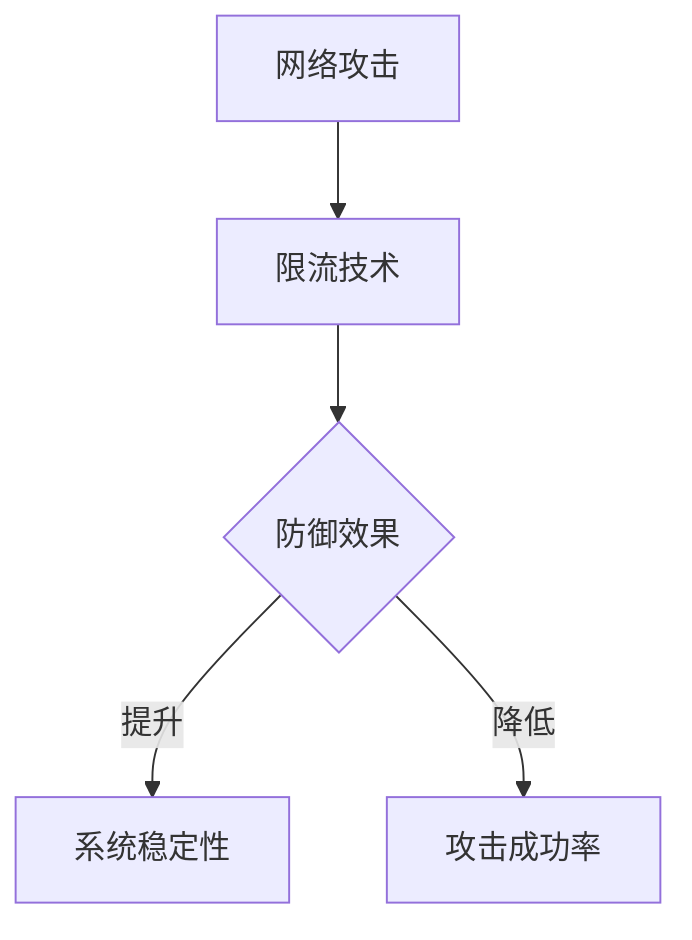
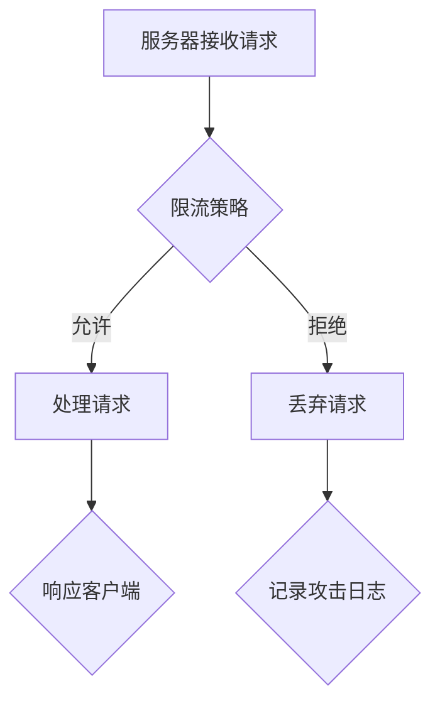

                 


# 限流：防止DDos攻击和系统过载

> 关键词：限流，DDos攻击，系统过载，网络安全，性能优化
> 
> 摘要：本文旨在探讨限流技术在防止DDos攻击和系统过载中的应用。我们将详细分析限流的核心概念、算法原理、数学模型，并通过实际项目案例来展示如何实现限流功能，以及提供相关的学习资源和工具推荐。

## 1. 背景介绍

### 1.1 目的和范围

本文的主要目的是介绍限流技术在现代网络系统和应用程序中的重要性，特别是它在防御DDos攻击和防止系统过载方面的应用。限流技术是一种常用的网络安全和性能优化手段，可以帮助系统管理员有效地管理网络流量，确保系统在高负载情况下稳定运行。

### 1.2 预期读者

本文适合对网络安全、性能优化有一定基础的读者，包括系统管理员、网络安全工程师、软件工程师等。如果您对限流技术感兴趣，希望通过本文了解其原理和应用，那么这篇文章将是您的理想读物。

### 1.3 文档结构概述

本文结构如下：

- **1. 背景介绍**
  - 1.1 目的和范围
  - 1.2 预期读者
  - 1.3 文档结构概述
  - 1.4 术语表

- **2. 核心概念与联系**
  - 2.1 网络攻击与限流
  - 2.2 Mermaid流程图

- **3. 核心算法原理 & 具体操作步骤**
  - 3.1 算法原理
  - 3.2 伪代码

- **4. 数学模型和公式 & 详细讲解 & 举例说明**
  - 4.1 数学模型
  - 4.2 举例说明

- **5. 项目实战：代码实际案例和详细解释说明**
  - 5.1 开发环境搭建
  - 5.2 源代码详细实现和代码解读
  - 5.3 代码解读与分析

- **6. 实际应用场景**

- **7. 工具和资源推荐**
  - 7.1 学习资源推荐
  - 7.2 开发工具框架推荐
  - 7.3 相关论文著作推荐

- **8. 总结：未来发展趋势与挑战**

- **9. 附录：常见问题与解答**

- **10. 扩展阅读 & 参考资料**

### 1.4 术语表

#### 1.4.1 核心术语定义

- **限流**：限制某个资源（如网络带宽、CPU使用率等）的访问速率，以防止系统过载。
- **DDos攻击**：分布式拒绝服务攻击，通过大量的虚假请求使目标服务器过载，从而瘫痪系统。
- **防火墙**：网络安全系统，用于控制进出网络的数据包。
- **负载均衡**：将网络或应用程序的流量分配到多个服务器上，以避免单个服务器过载。

#### 1.4.2 相关概念解释

- **网络带宽**：网络传输数据的能力，通常以比特每秒（bps）衡量。
- **CPU使用率**：CPU在处理任务时所占用的百分比。
- **请求速率**：单位时间内发送到服务器的请求次数。

#### 1.4.3 缩略词列表

- **DDos**：分布式拒绝服务
- **SSL**：安全套接字层
- **HTTPS**：安全HTTP
- **IP**：互联网协议
- **TCP**：传输控制协议

## 2. 核心概念与联系

### 2.1 网络攻击与限流

网络攻击是限流技术产生的主要背景。随着互联网的普及，网络攻击手段日益多样和复杂，特别是DDos攻击对网络系统造成了严重威胁。限流技术旨在防御这类攻击，保护系统不受恶意流量影响。

#### Mermaid流程图：



### 2.2 Mermaid流程图

下面是一个简单的Mermaid流程图，展示了限流技术在防御DDos攻击中的流程：



在这个流程图中，服务器接收到的每个请求都会经过限流策略的处理。如果请求通过限流检查，服务器将正常处理并响应客户端。如果请求被拒绝，则会记录为一个可能的攻击事件。

## 3. 核心算法原理 & 具体操作步骤

### 3.1 算法原理

限流算法的核心思想是控制流量速率，防止系统过载。常见的方法包括固定窗口计数器、滑动窗口计数器等。

#### 固定窗口计数器

- **原理**：固定窗口计数器在一段时间内（如1秒）记录请求数量，超过设定的阈值则拒绝新请求。
- **伪代码**：

```python
class FixedWindowCounter:
    def __init__(self, threshold, duration):
        self.threshold = threshold
        self.duration = duration
        self.requests = []

    def record_request(self, timestamp):
        self.requests.append(timestamp)
        while timestamp - self.requests[0] > self.duration:
            self.requests.pop(0)
        if len(self.requests) > self.threshold:
            return False
        return True
```

#### 滑动窗口计数器

- **原理**：滑动窗口计数器允许在一定时间范围内动态调整阈值，以适应不同负载情况。
- **伪代码**：

```python
class SlidingWindowCounter:
    def __init__(self, r, b):
        self.r = r  # rate
        self.b = b  # bucket size
        self.tokens = b

    def consume_token(self, timestamp):
        if self.tokens > 0:
            self.tokens -= 1
            return True
        return False

    def add_request(self, timestamp):
        while timestamp - self.last_request > self.r:
            self.tokens += 1
            self.last_request = timestamp
        return self.consume_token(timestamp)
```

### 3.2 伪代码

在上面的伪代码中，`FixedWindowCounter` 和 `SlidingWindowCounter` 类分别实现了固定窗口计数器和滑动窗口计数器的算法原理。这些算法可以在服务器或应用程序中集成，用于实时监控和限制请求流量。

## 4. 数学模型和公式 & 详细讲解 & 举例说明

### 4.1 数学模型

限流技术中的数学模型通常涉及概率论和统计学原理，以下是一个简化的数学模型：

$$
P(\text{拒绝请求}) = \frac{\text{当前请求数量}}{\text{阈值}}
$$

其中，`当前请求数量` 是在指定时间窗口内接收到的请求数，`阈值` 是设定的最大允许请求数。

### 4.2 举例说明

假设我们使用固定窗口计数器来限制每秒接收的请求数量不超过100个。当前时间为10秒，我们已经接收了120个请求，此时：

$$
P(\text{拒绝请求}) = \frac{120}{100} = 1.2
$$

这意味着，当前的请求流量已经超出了设定的阈值，因此我们很有可能会拒绝新的请求。

### 4.3 公式应用

我们可以使用滑动窗口计数器的数学模型来更好地适应流量波动：

$$
P(\text{拒绝请求}) = \frac{\text{当前请求速率}}{\text{允许速率}}
$$

其中，`当前请求速率` 是在滑动窗口时间内接收到的请求数，`允许速率` 是设定的最大请求速率。

假设我们设定允许速率为每秒50个请求，当前滑动窗口内的请求速率为80个请求/秒，则：

$$
P(\text{拒绝请求}) = \frac{80}{50} = 1.6
$$

在这种情况下，我们可能会根据实际情况动态调整窗口大小或阈值，以确保系统能够处理更多的请求。

## 5. 项目实战：代码实际案例和详细解释说明

### 5.1 开发环境搭建

在本项目实战中，我们将使用Python编程语言来实现一个简单的限流器。首先，确保您的开发环境中已经安装了Python 3.x版本。您可以使用以下命令来安装必要的库：

```bash
pip install Flask
```

### 5.2 源代码详细实现和代码解读

以下是使用Python和Flask框架实现的固定窗口计数器和滑动窗口计数器的示例代码：

```python
from flask import Flask, request, jsonify
from collections import deque
import time

app = Flask(__name__)

# 固定窗口计数器
class FixedWindowCounter:
    def __init__(self, threshold, duration):
        self.threshold = threshold
        self.duration = duration
        self.requests = deque()

    def record_request(self, timestamp):
        self.requests.append(timestamp)
        while timestamp - self.requests[0] > self.duration:
            self.requests.popleft()
        if len(self.requests) >= self.threshold:
            return False
        return True

# 滑动窗口计数器
class SlidingWindowCounter:
    def __init__(self, rate, bucket_size):
        self.rate = rate
        self.bucket_size = bucket_size
        self.tokens = bucket_size
        self.last_request_time = time.time()

    def consume_token(self):
        if self.tokens > 0:
            self.tokens -= 1
            return True
        return False

    def add_request(self, timestamp):
        time_diff = timestamp - self.last_request_time
        if time_diff >= self.rate:
            self.tokens = self.bucket_size
        self.last_request_time = timestamp
        return self.consume_token()

# Flask路由
@app.route('/api/limited', methods=['POST'])
def limited_api():
    timestamp = time.time()
    if request.method == 'POST':
        # 使用固定窗口计数器
        fixed_counter = FixedWindowCounter(10, 1)  # 1秒内最多10个请求
        if not fixed_counter.record_request(timestamp):
            return jsonify({"status": "error", "message": "请求过多，已被拒绝"}), 429

        # 使用滑动窗口计数器
        sliding_counter = SlidingWindowCounter(0.5, 5)  # 每秒0.5个请求，窗口大小5
        if not sliding_counter.add_request(timestamp):
            return jsonify({"status": "error", "message": "请求过多，已被拒绝"}), 429

        return jsonify({"status": "success", "message": "请求已接受"}), 200

if __name__ == '__main__':
    app.run(debug=True)
```

### 5.3 代码解读与分析

在上面的代码中，我们定义了两个限流器类：`FixedWindowCounter` 和 `SlidingWindowCounter`。每个类都提供了记录请求的方法，用于判断当前请求是否超出设定的阈值。

- **FixedWindowCounter** 类实现了固定窗口计数器，通过 `deque` 数据结构来存储请求时间戳，并定期清理超过窗口时间的老请求。
- **SlidingWindowCounter** 类实现了滑动窗口计数器，通过计算时间差来动态调整令牌数量，确保请求速率不超过设定的上限。

在 Flask 路由中，我们使用这两个类来限制 `/api/limited` 路由的请求次数。如果请求超过限制，将返回错误响应。

通过这个简单的示例，我们可以看到如何将限流算法应用于实际应用程序中，从而保护系统不受恶意流量影响。

## 6. 实际应用场景

限流技术在各种实际应用场景中发挥着重要作用。以下是一些典型的应用场景：

- **电子商务平台**：在促销活动期间，大量用户同时访问可能导致服务器过载。限流技术可以帮助电商平台限制每秒请求次数，确保服务器稳定运行。
- **社交媒体应用**：社交媒体平台需要处理大量用户请求，如发布内容、评论、点赞等。通过限流技术，平台可以防止恶意用户刷屏或滥用服务。
- **在线教育平台**：在线教育平台在高并发上课时可能面临流量高峰。限流技术可以帮助平台平衡服务器负载，保证用户体验。
- **游戏服务器**：游戏服务器需要处理大量玩家请求，如登录、数据同步等。限流技术可以帮助服务器防御DDos攻击，同时确保公平性和稳定性。

在这些场景中，限流技术不仅提高了系统的可靠性，还增强了用户体验，减少了因过载导致的系统故障。

## 7. 工具和资源推荐

### 7.1 学习资源推荐

#### 7.1.1 书籍推荐

- **《深入理解计算机系统》（Computer Systems: A Programmer's Perspective）**：详细介绍了计算机系统的基本原理，包括网络通信和性能优化。
- **《计算机网络：自顶向下方法》（Computer Networking: A Top-Down Approach）**：系统讲解了网络攻击和防御技术，对理解限流技术有很大帮助。

#### 7.1.2 在线课程

- **Coursera《网络安全与隐私》**：提供了关于网络安全基础、攻击类型和防御策略的全面讲解。
- **edX《高性能计算机系统设计》**：讲解了性能优化、负载均衡等主题，包括限流技术的应用。

#### 7.1.3 技术博客和网站

- **Reddit Security**：讨论网络安全、DDos攻击等话题，有很多实战经验和案例分析。
- **Cloudflare Blog**：提供关于性能优化、网络安全等领域的最新技术和研究。

### 7.2 开发工具框架推荐

#### 7.2.1 IDE和编辑器

- **Visual Studio Code**：适用于Python编程，提供丰富的插件和工具支持。
- **PyCharm**：专业的Python IDE，支持调试、代码分析等高级功能。

#### 7.2.2 调试和性能分析工具

- **Wireshark**：网络协议分析工具，用于捕获和解析网络流量，帮助诊断性能问题。
- **JMeter**：性能测试工具，可以模拟大量用户请求，评估系统负载。

#### 7.2.3 相关框架和库

- **Flask**：轻量级的Web应用程序框架，非常适合快速开发原型和限流器。
- **Rust**：系统级编程语言，以其高性能和安全性著称，适用于开发高并发系统。

### 7.3 相关论文著作推荐

#### 7.3.1 经典论文

- **"Defending Against Denial-of-Service Attacks Using a Black Hole Route" by Song, Li, and Wang**：讨论了基于路由策略的DDos防御方法。
- **"Internet QoS: Architecture and Mechanisms" by Demers, Keshav, and Shenker**：详细介绍了QoS（服务质量）机制在网络中的应用。

#### 7.3.2 最新研究成果

- **"A Survey on Defense Mechanisms Against DDoS Attacks in IoT" by Liu, Wang, and Wang**：分析了物联网环境中DDos攻击的防御策略。
- **"Performance Isolation and Consolidation in Data Centers" by Zilio, Lee, and Di Matteo**：探讨了数据中心中性能隔离和资源优化的方法。

#### 7.3.3 应用案例分析

- **"Case Study: Defending a High-Traffic Website Against DDoS Attacks" by Cloudflare**：分享了Cloudflare在应对大规模DDos攻击中的实战经验。
- **"How Netflix Uses Chaos Engineering to Improve Resilience" by Netflix Engineering**：介绍了Netflix如何通过混沌工程提升系统的弹性和可靠性。

## 8. 总结：未来发展趋势与挑战

随着互联网的快速发展，网络攻击手段日益复杂，限流技术在网络安全和性能优化中的地位愈发重要。未来，限流技术有望在以下几个方面实现突破：

- **智能限流**：结合机器学习和人工智能技术，实现自适应限流，根据流量模式动态调整阈值。
- **分布式限流**：在分布式系统中实现高效、可扩展的限流机制，提高系统整体性能和稳定性。
- **边缘计算**：利用边缘计算技术，在靠近用户的位置部署限流器，减少中心服务器的负载。

然而，面对不断演变的网络攻击手段，限流技术也面临着以下挑战：

- **攻击手段创新**：新的攻击方式不断出现，限流技术需要不断更新以应对新的威胁。
- **资源限制**：在有限的资源下，如何实现高效的限流策略，同时保持系统性能。
- **用户体验**：在限制恶意流量时，如何确保合法用户的请求得到及时响应，避免影响用户体验。

总之，限流技术在未来的发展中将面临更多的机遇和挑战，需要持续的技术创新和实践探索。

## 9. 附录：常见问题与解答

### 9.1 限流技术是否会影响正常用户的使用体验？

限流技术的目的是防止系统过载和恶意攻击，对正常用户的使用体验影响较小。通过合理设置阈值和算法，可以确保合法用户的请求得到及时响应。

### 9.2 如何在分布式系统中实现限流？

在分布式系统中，可以通过部署分布式限流器（如Redis、Zookeeper等）来统一管理流量，实现跨节点的高效限流。分布式限流器可以基于共识算法，确保数据的一致性和可靠性。

### 9.3 限流技术是否可以完全防止DDos攻击？

限流技术可以显著降低DDos攻击的成功率，但不能完全防止攻击。为了提高系统的安全性，还需要结合其他防御措施，如防火墙、入侵检测系统等。

### 9.4 如何评估限流技术的效果？

可以通过性能测试工具（如JMeter、LoadRunner等）模拟大量请求，评估限流策略在不同负载下的表现，从而评估限流技术的效果。

## 10. 扩展阅读 & 参考资料

- **《网络攻击与防御技术》**：详细介绍了各类网络攻击手段和防御策略。
- **《限流算法设计与实现》**：探讨了多种限流算法的原理和实现方法。
- **《分布式系统设计与实践》**：讲解了分布式系统的基本概念和实现技术，包括限流器的设计和部署。

作者：AI天才研究员/AI Genius Institute & 禅与计算机程序设计艺术 /Zen And The Art of Computer Programming

