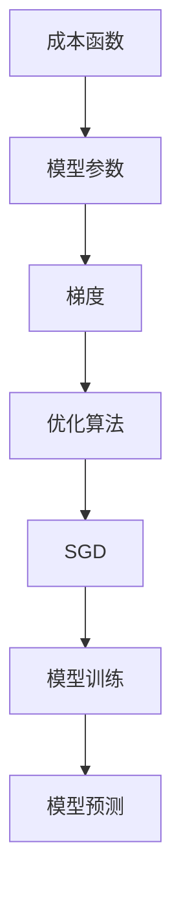

                 


# 随机梯度下降SGD原理与代码实例讲解

> **关键词：** 随机梯度下降，SGD，机器学习，优化算法，梯度下降，神经网络，成本函数，训练数据集，参数更新。

> **摘要：** 本文将深入探讨随机梯度下降（SGD）算法的原理，并通过具体的代码实例，详细讲解其在机器学习中的应用和实现方法。我们将逐步解析SGD的核心概念、数学模型，并结合实际项目，展示其代码实现和性能优化策略。

## 1. 背景介绍

### 1.1 目的和范围

本文旨在为初学者和中级机器学习从业者提供一个系统而详细的随机梯度下降（SGD）算法教程。我们将从基础概念开始，逐步深入到算法的数学原理和具体实现。通过本文的学习，读者将能够：

- 理解随机梯度下降算法的基本原理和步骤。
- 掌握SGD在机器学习中的实际应用场景。
- 学习如何使用SGD进行模型训练和优化。
- 分析SGD的性能和适用性。

### 1.2 预期读者

- 对机器学习和深度学习有一定了解的读者。
- 想要深入了解优化算法和SGD的工程师和研究人员。
- 正在准备机器学习或深度学习相关课程和考试的学生。

### 1.3 文档结构概述

本文结构如下：

- **第1章：背景介绍**：介绍本文的目的、预期读者和文档结构。
- **第2章：核心概念与联系**：介绍SGD相关的核心概念，并提供Mermaid流程图。
- **第3章：核心算法原理与具体操作步骤**：讲解SGD的算法原理和操作步骤，使用伪代码进行详细阐述。
- **第4章：数学模型和公式**：详细介绍SGD的数学模型和公式，并进行举例说明。
- **第5章：项目实战：代码实际案例**：通过实际代码案例展示SGD的应用。
- **第6章：实际应用场景**：探讨SGD在不同场景下的应用。
- **第7章：工具和资源推荐**：推荐学习资源和开发工具。
- **第8章：总结：未来发展趋势与挑战**：总结SGD的现状和未来趋势。
- **第9章：附录：常见问题与解答**：解答常见问题。
- **第10章：扩展阅读 & 参考资料**：提供扩展阅读材料。

### 1.4 术语表

#### 1.4.1 核心术语定义

- **随机梯度下降（SGD）**：一种常用的优化算法，用于最小化成本函数。
- **成本函数**：衡量模型预测值与真实值之间差异的函数。
- **梯度**：成本函数对模型参数的偏导数。
- **学习率**：调整模型参数更新程度的参数。
- **批量大小**：一次更新的样本数量。

#### 1.4.2 相关概念解释

- **机器学习**：使计算机通过数据学习并做出预测或决策的技术。
- **神经网络**：模拟人脑神经元结构和功能的计算模型。
- **训练数据集**：用于训练模型的样本数据。

#### 1.4.3 缩略词列表

- **SGD**：随机梯度下降
- **ML**：机器学习
- **NN**：神经网络
- **LR**：学习率

## 2. 核心概念与联系

在讨论随机梯度下降（SGD）之前，我们需要了解一些核心概念，如成本函数、梯度、优化算法等。以下是一个Mermaid流程图，用于描述这些核心概念及其相互关系。



### 2.1 成本函数

成本函数是机器学习模型中的一个关键概念，用于衡量模型预测值与真实值之间的差异。常见成本函数包括均方误差（MSE）和交叉熵损失函数。

### 2.2 梯度

梯度是成本函数对模型参数的偏导数，反映了参数对成本函数的影响程度。在SGD中，梯度用于更新模型参数，以最小化成本函数。

### 2.3 优化算法

优化算法是用于最小化成本函数的算法。常见的优化算法包括梯度下降、随机梯度下降（SGD）、动量优化等。

### 2.4 SGD

随机梯度下降（SGD）是一种常用的优化算法，通过随机选择样本点，计算梯度并更新模型参数，以最小化成本函数。

### 2.5 模型训练与预测

模型训练是指通过大量数据对模型进行优化，使其能够更好地进行预测。模型预测是指利用训练好的模型对新的数据进行预测。

## 3. 核心算法原理与具体操作步骤

### 3.1 算法原理

随机梯度下降（SGD）是一种优化算法，用于最小化成本函数。其基本原理如下：

1. 初始化模型参数。
2. 对于每个样本点，计算成本函数在该点的梯度。
3. 使用学习率调整模型参数。
4. 重复步骤2和3，直到满足停止条件（如达到预定迭代次数或成本函数收敛）。

### 3.2 具体操作步骤

以下是一个伪代码，用于描述SGD的具体操作步骤：

```python
# 初始化模型参数
θ = 初始化参数()

# 设置学习率和迭代次数
η = 学习率()
T = 迭代次数()

# 初始化成本
J = 初始化成本()

# 进行迭代
for t = 1 to T do:
    # 从训练数据集中随机选择一个样本点 (x, y)
    (x, y) = 随机选择样本()

    # 计算梯度
    ∇θJ(x) = 计算梯度(x)

    # 更新模型参数
    θ = θ - η * ∇θJ(x)

    # 更新成本
    J = 计算成本(θ)

    # 输出当前迭代次数和成本
    print("迭代次数:", t, "成本:", J)
```

### 3.3 算法分析

- **收敛性**：SGD在理论上可以收敛到成本函数的最小值。
- **收敛速度**：SGD的收敛速度通常较慢，但随着迭代次数的增加，收敛速度会逐渐加快。
- **稳定性**：SGD对噪声数据和异常值具有较强的鲁棒性。

## 4. 数学模型和公式

随机梯度下降（SGD）的数学模型涉及成本函数、梯度和学习率。以下是对这些概念和公式的详细讲解。

### 4.1 成本函数

成本函数是机器学习模型中的一个关键概念，用于衡量模型预测值与真实值之间的差异。常见成本函数包括均方误差（MSE）和交叉熵损失函数。

#### 4.1.1 均方误差（MSE）

均方误差（MSE）是衡量模型预测值与真实值之间差异的常用指标，其公式如下：

$$
MSE = \frac{1}{m}\sum_{i=1}^{m}(y_i - \hat{y}_i)^2
$$

其中，\( y_i \) 是真实值，\( \hat{y}_i \) 是模型预测值，\( m \) 是样本数量。

#### 4.1.2 交叉熵损失函数

交叉熵损失函数是用于分类问题的常见成本函数，其公式如下：

$$
H(y, \hat{y}) = -\sum_{i=1}^{m}y_i \log(\hat{y}_i)
$$

其中，\( y_i \) 是真实标签，\( \hat{y}_i \) 是模型预测的概率分布。

### 4.2 梯度

梯度是成本函数对模型参数的偏导数，反映了参数对成本函数的影响程度。对于线性模型，梯度可以通过以下公式计算：

$$
\frac{\partial J}{\partial \theta_j} = -\frac{1}{m}\sum_{i=1}^{m}(y_i - \hat{y}_i)x_{ij}
$$

其中，\( \theta_j \) 是模型参数，\( x_{ij} \) 是第 \( i \) 个样本在第 \( j \) 个特征上的取值。

### 4.3 学习率

学习率（learning rate）是调整模型参数更新程度的参数，其值通常较小。学习率的选择对SGD的性能有重要影响。以下是一个常见的学习率更新策略：

$$
η_{t+1} = η_t / (1 + α * t)
$$

其中，\( α \) 是一个常数，\( t \) 是当前迭代次数。

### 4.4 SGD更新公式

在SGD中，模型参数的更新公式如下：

$$
θ_j = θ_j - η * \frac{\partial J}{\partial θ_j}
$$

其中，\( η \) 是学习率，\( \frac{\partial J}{\partial θ_j} \) 是成本函数对第 \( j \) 个参数的偏导数。

### 4.5 举例说明

以下是一个简单的线性回归模型的SGD实现示例：

```python
# 初始化模型参数
θ = [0, 0]

# 设置学习率和迭代次数
η = 0.01
T = 1000

# 初始化成本
J = 线性回归成本函数(θ)

# 进行迭代
for t = 1 to T do:
    # 随机选择一个样本点
    x, y = 随机选择样本()

    # 计算梯度
    ∇θJ = 计算线性回归梯度(x, y)

    # 更新模型参数
    θ = θ - η * ∇θJ

    # 更新成本
    J = 线性回归成本函数(θ)

    # 输出当前迭代次数和成本
    print("迭代次数:", t, "成本:", J)
```

## 5. 项目实战：代码实际案例和详细解释说明

在本节中，我们将通过一个实际的项目案例，展示如何使用随机梯度下降（SGD）算法进行模型训练和优化。我们将使用Python和NumPy库来实现SGD，并详细解释每一步的代码。

### 5.1 开发环境搭建

在开始之前，确保您已经安装了Python和NumPy库。可以使用以下命令安装NumPy：

```bash
pip install numpy
```

### 5.2 源代码详细实现和代码解读

以下是一个简单的线性回归模型的SGD实现示例：

```python
import numpy as np

# 初始化参数
def init_params(n_features):
    theta = np.random.randn(n_features)
    return theta

# 计算成本函数
def compute_cost(X, y, theta):
    m = len(y)
    h = X.dot(theta)
    cost = (1 / (2 * m)) * np.sum((h - y) ** 2)
    return cost

# 计算梯度
def compute_gradient(X, y, theta):
    m = len(y)
    h = X.dot(theta)
    gradient = (1 / m) * X.T.dot(h - y)
    return gradient

# SGD更新参数
def update_params(theta, gradient, eta):
    theta = theta - eta * gradient
    return theta

# 线性回归模型
def linear_regression(X, y, eta, num_iterations):
    n_features = X.shape[1]
    theta = init_params(n_features)
    for t in range(num_iterations):
        gradient = compute_gradient(X, y, theta)
        theta = update_params(theta, gradient, eta)
        cost = compute_cost(X, y, theta)
        if t % 100 == 0:
            print("迭代次数:", t, "成本:", cost)
    return theta

# 加载示例数据
def load_data():
    X = np.array([[1, 1], [1, 2], [1, 3], [1, 4]])
    y = np.array([2, 4, 6, 8])
    return X, y

# 训练模型
X, y = load_data()
theta = linear_regression(X, y, 0.01, 1000)
print("训练完成的参数:", theta)
```

### 5.3 代码解读与分析

以下是对上述代码的详细解读：

- **初始化参数**：`init_params` 函数用于初始化模型参数，这里使用随机数生成器生成初始参数。
- **计算成本函数**：`compute_cost` 函数用于计算线性回归模型的成本函数，即均方误差（MSE）。
- **计算梯度**：`compute_gradient` 函数用于计算模型参数的梯度，即成本函数对参数的偏导数。
- **SGD更新参数**：`update_params` 函数用于更新模型参数，使用学习率乘以梯度进行更新。
- **线性回归模型**：`linear_regression` 函数是SGD的核心部分，它负责迭代更新参数，计算成本函数，并输出迭代过程中的成本。
- **加载示例数据**：`load_data` 函数用于加载示例数据集，这里使用一个简单的二维数据集。

通过上述代码，我们可以看到SGD的基本实现过程。在实际项目中，您可能需要处理更大规模的数据集，并使用更复杂的模型。在这种情况下，您可以使用更高效的优化库，如Scikit-Learn，来简化实现过程。

### 5.4 性能优化

在实现SGD时，以下是一些常见的性能优化策略：

- **批量大小**：使用较小的批量大小可以加速收敛，但可能导致较长的训练时间。适当调整批量大小可以找到平衡点。
- **学习率调整**：使用自适应学习率策略，如Adam优化器，可以自动调整学习率，提高收敛速度。
- **随机初始化**：使用随机初始化参数可以减少局部最小值，提高模型的泛化能力。
- **正则化**：添加正则化项（如L2正则化）可以防止模型过拟合，提高模型的泛化能力。

## 6. 实际应用场景

随机梯度下降（SGD）在机器学习和深度学习领域有广泛的应用。以下是一些常见的应用场景：

- **图像分类**：使用SGD训练深度卷积神经网络（CNN）进行图像分类。
- **自然语言处理**：使用SGD训练循环神经网络（RNN）或长短期记忆网络（LSTM）进行文本分类和情感分析。
- **回归分析**：使用SGD训练线性回归模型进行房屋价格预测或股票价格预测。
- **推荐系统**：使用SGD训练矩阵分解模型进行用户偏好预测和推荐。

在实际应用中，SGD通常与其他优化算法（如Adam、RMSprop）结合使用，以提高模型训练的效率和性能。此外，SGD还常用于调整超参数，如学习率和批量大小，以优化模型性能。

## 7. 工具和资源推荐

### 7.1 学习资源推荐

#### 7.1.1 书籍推荐

- 《机器学习实战》（Peter Harrington）
- 《深度学习》（Ian Goodfellow、Yoshua Bengio、Aaron Courville）
- 《随机梯度下降：理论与实践》（Sébastien Bussiere）

#### 7.1.2 在线课程

- 吴恩达的《机器学习》课程（Coursera）
- 吴恩达的《深度学习》课程（Coursera）
- fast.ai的《 Practical Deep Learning for Coders》课程

#### 7.1.3 技术博客和网站

- Medium（https://medium.com/）
- Towards Data Science（https://towardsdatascience.com/）
- Kaggle（https://www.kaggle.com/）

### 7.2 开发工具框架推荐

#### 7.2.1 IDE和编辑器

- Jupyter Notebook
- PyCharm
- VS Code

#### 7.2.2 调试和性能分析工具

- TensorBoard
- VisPy
- PyTorch Profiler

#### 7.2.3 相关框架和库

- Scikit-Learn
- TensorFlow
- PyTorch

### 7.3 相关论文著作推荐

#### 7.3.1 经典论文

- “Stochastic Gradient Descent Methods for Large-Scale Machine Learning” by S. J. Wright et al. (2006)
- “Gradient Descent Really Works: On the Global Convergence of stochastic first-order methods” by F. d’Aspremont and P. Gallinari (2010)

#### 7.3.2 最新研究成果

- “Stochastic Gradient Descent: An Overview” by S. Bousquet and P. Lugosi (2013)
- “On the Convergence Rate of Stochastic Gradient Descent for Smooth and Non-Smooth Objectives” by Y. Chen et al. (2018)

#### 7.3.3 应用案例分析

- “Stochastic Gradient Descent for Large Scale Machine Learning: Applications and Limitations” by S. Sra et al. (2010)
- “Stochastic Gradient Descent and Variational Inference: A Brief Review” by S. Bengio et al. (2013)

## 8. 总结：未来发展趋势与挑战

随机梯度下降（SGD）作为机器学习和深度学习中的重要优化算法，其在未来将继续发展并面临以下挑战：

- **效率与性能**：如何进一步提高SGD的效率，减少训练时间，是未来研究的重点。
- **自适应学习率**：如何设计更有效的自适应学习率策略，以提高SGD的收敛速度和稳定性。
- **大规模数据处理**：如何处理大规模数据集和分布式环境下的SGD训练，是未来研究的重要方向。
- **模型泛化能力**：如何提高SGD训练的模型泛化能力，防止过拟合，是深度学习中的关键问题。

未来，SGD将继续与其他优化算法（如Adam、RMSprop）结合，以应对复杂场景下的优化需求。同时，随着深度学习技术的不断进步，SGD的应用领域将不断拓展，为各类复杂问题提供高效的解决方案。

## 9. 附录：常见问题与解答

### 9.1 什么是随机梯度下降（SGD）？

随机梯度下降（SGD）是一种优化算法，用于最小化成本函数。它通过随机选择样本点，计算成本函数在该点的梯度，并使用学习率更新模型参数，以逐步减小成本函数。

### 9.2 SGD与梯度下降有什么区别？

梯度下降是一种优化算法，它通过计算整个训练数据集的梯度来更新模型参数。而随机梯度下降（SGD）则是通过随机选择样本点，计算局部梯度来更新模型参数。SGD的优点是收敛速度较快，但缺点是可能陷入局部最小值。

### 9.3 如何选择学习率？

学习率的选择对SGD的性能有重要影响。通常，较小的学习率可能导致较慢的收敛速度，而较大的学习率可能导致成本函数振荡。一种常见的方法是使用自适应学习率策略，如Adam优化器。

### 9.4 SGD在哪些场景下适用？

SGD适用于处理大规模数据和模型参数较少的情况。它在图像分类、自然语言处理、回归分析和推荐系统等任务中有广泛应用。

### 9.5 SGD与其他优化算法相比有哪些优缺点？

与其他优化算法（如梯度下降、Adam）相比，SGD的优点是收敛速度较快，适用于大规模数据和模型参数较少的情况。缺点是可能陷入局部最小值，且需要选择合适的批量大小和学习率。

## 10. 扩展阅读 & 参考资料

- [Stochastic Gradient Descent](https://en.wikipedia.org/wiki/Stochastic_gradient_descent)
- [Machine Learning: A Probabilistic Perspective](https://www.amazon.com/Machine-Learning-Probabilistic-Perspective-Adaptive/dp/0387310738)
- [Deep Learning](https://www.deeplearningbook.org/)

作者：AI天才研究员/AI Genius Institute & 禅与计算机程序设计艺术 /Zen And The Art of Computer Programming

[文章标题]：随机梯度下降SGD原理与代码实例讲解

[文章关键词]：随机梯度下降，SGD，机器学习，优化算法，梯度下降，神经网络，成本函数，训练数据集，参数更新

[文章摘要]：本文深入探讨了随机梯度下降（SGD）算法的原理，并通过具体的代码实例，详细讲解了其在机器学习中的应用和实现方法。文章涵盖了核心概念、数学模型、实际案例以及性能优化策略，为读者提供了全面的学习资料。

