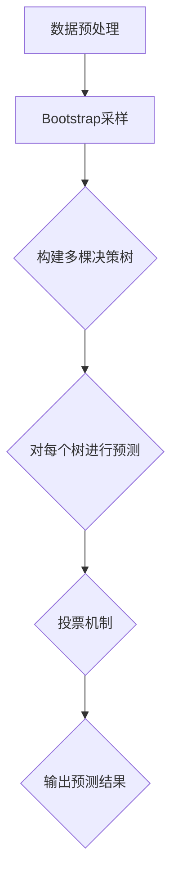

                 

# 随机森林：原理与代码实例讲解

> **关键词：** 随机森林、决策树、机器学习、分类算法、预测模型
>
> **摘要：** 本文将深入探讨随机森林算法的基本原理，并通过具体代码实例详细讲解其实现步骤。我们将从随机森林的背景、核心概念、算法原理、数学模型到实际应用场景，全面解析这一强大机器学习工具。

## 1. 背景介绍

### 1.1 目的和范围

本文的目的是帮助读者深入理解随机森林算法的原理，并通过实际代码示例来加深对这一算法的理解。我们将会覆盖以下几个方面的内容：

- 随机森林算法的背景和历史
- 随机森林的核心概念和联系
- 随机森林的算法原理和具体操作步骤
- 数学模型和公式的详细讲解
- 随机森林在项目实战中的应用
- 随机森林的实际应用场景
- 推荐的学习资源和开发工具
- 相关论文和研究成果的介绍
- 未来发展趋势与挑战

### 1.2 预期读者

本文适合以下读者群体：

- 对机器学习和数据挖掘有基本了解的技术爱好者
- 数据科学家和人工智能研究者
- 计算机科学和软件工程专业的学生和从业者
- 对决策树和随机森林算法感兴趣的程序员

### 1.3 文档结构概述

本文分为以下几个主要部分：

1. 背景介绍
2. 核心概念与联系
3. 核心算法原理 & 具体操作步骤
4. 数学模型和公式 & 详细讲解 & 举例说明
5. 项目实战：代码实际案例和详细解释说明
6. 实际应用场景
7. 工具和资源推荐
8. 总结：未来发展趋势与挑战
9. 附录：常见问题与解答
10. 扩展阅读 & 参考资料

### 1.4 术语表

#### 1.4.1 核心术语定义

- **随机森林（Random Forest）：** 一种基于决策树的集成学习算法，通过构建多棵决策树并对预测结果进行投票来提高模型的准确性和稳定性。
- **决策树（Decision Tree）：** 一种树形结构的数据挖掘方法，用于分类和回归问题，通过一系列规则将数据划分到不同的类别或数值。
- **特征（Feature）：** 数据集中的每个属性，用于训练模型和进行预测。
- **样本（Sample）：** 数据集中的每个记录，包含多个特征值。

#### 1.4.2 相关概念解释

- **集成学习（Ensemble Learning）：** 将多个学习器结合起来，形成一个更强的学习模型，通过集成策略（如投票、堆叠等）来提高预测性能。
- **回归（Regression）：** 一种机器学习任务，用于预测连续数值。
- **分类（Classification）：** 一种机器学习任务，用于预测离散类别。

#### 1.4.3 缩略词列表

- **ID3：** 熵递增划分算法，用于构建决策树。
- **C4.5：** 改进的ID3算法，增加了剪枝和处理连续属性的能力。
- **RF：** 随机森林的缩写。

## 2. 核心概念与联系

在深入探讨随机森林之前，我们首先需要理解一些核心概念和它们之间的联系。

### 2.1 决策树

决策树是一种常见的机器学习算法，通过一系列的判断规则将数据划分为不同的类别或数值。决策树的每个节点表示一个特征，每个分支表示该特征的不同取值。最终，每个叶节点表示一个预测类别或数值。

**决策树的核心概念：**

- **特征选择：** 在每个节点选择最优特征进行划分，常用的指标有信息增益、增益率等。
- **切分策略：** 确定如何根据特征值将数据划分为不同的子集，常用的切分策略有单切分、多切分等。
- **剪枝：** 为了防止过拟合，需要剪枝决策树，减少模型的复杂度。

### 2.2 集成学习

集成学习是一种通过结合多个学习器的预测结果来提高模型性能的方法。常见的集成学习方法有随机森林、梯度提升树等。集成学习的核心思想是利用多个学习器的多样性和互补性来降低预测误差。

**集成学习的核心概念：**

- **基学习器：** 集成学习中的每个单独学习器，可以是决策树、线性回归等。
- **集成策略：** 如何将多个基学习器的预测结果进行结合，常见的策略有投票、加权平均、堆叠等。
- **多样性：** 基学习器之间的多样性对于集成学习的性能至关重要。

### 2.3 随机森林

随机森林是一种基于决策树的集成学习算法，通过构建多棵决策树并对预测结果进行投票来提高模型的准确性和稳定性。随机森林的特点是引入随机性，包括随机特征选择和随机样本训练。

**随机森林的核心概念：**

- **随机特征选择：** 在每个节点处，从所有特征中选择一部分特征进行划分，常用的策略有随机选择、特征重要性等。
- **随机样本训练：** 从训练集中随机选取一部分样本进行决策树的构建，常用的策略有Bootstrap采样等。
- **投票机制：** 对每个样本进行多棵决策树的预测，并根据预测结果进行投票，最终得到最终的预测结果。

### 2.4 Mermaid 流程图

为了更直观地理解随机森林的架构和流程，我们使用Mermaid流程图来展示随机森林的各个关键步骤。



**Mermaid 流程图解释：**

- **A[数据预处理]：** 对输入数据进行预处理，包括数据清洗、特征工程等。
- **B[Bootstrap采样]：** 从训练集中随机采样一部分数据作为每棵决策树的训练集。
- **C[构建多棵决策树]：** 构建多棵决策树，每棵树使用Bootstrap采样得到的训练集。
- **D[对每个树进行预测]：** 对每个样本进行多棵决策树的预测。
- **E[投票机制]：** 根据每个样本的多棵决策树的预测结果进行投票，得到最终的预测结果。
- **F[输出预测结果]：** 输出最终的预测结果。

通过以上核心概念和流程图的介绍，我们对随机森林的基本原理和架构有了初步了解。接下来，我们将深入探讨随机森林的算法原理和具体操作步骤。

## 3. 核心算法原理 & 具体操作步骤

### 3.1 随机森林的算法原理

随机森林算法是基于决策树构建的集成学习方法，通过引入随机性来提高模型的泛化能力和稳定性。随机森林的主要原理包括以下几个方面：

1. **决策树的构建：** 随机森林中的每棵决策树都是通过训练数据集构建的。在构建过程中，决策树会使用特征选择和切分策略来划分数据，从而生成一棵树形结构。
   
2. **随机特征选择：** 在每个节点处，随机森林会从所有特征中选择一部分特征进行划分，而不是选择最优特征。这样，每棵决策树都能在一定程度上具有多样性，从而提高模型的泛化能力。

3. **随机样本训练：** 随机森林通过Bootstrap采样从原始训练集中随机采样一部分数据作为每棵决策树的训练集。这样，每棵决策树都使用了不同的训练样本，增加了模型的多样性。

4. **投票机制：** 对每个样本进行多棵决策树的预测，并根据预测结果进行投票。最终，投票结果得票最多的类别或数值即为最终的预测结果。

### 3.2 具体操作步骤

下面我们通过伪代码来详细描述随机森林的算法步骤：

```python
# 随机森林算法伪代码

# 输入：训练集 X, 标签 y, 树的数量 n_estimators, 最大深度 max_depth
# 输出：预测结果 predictions

# 1. 初始化决策树列表 trees
trees = []

# 2. 循环 n_estimators 次，构建每棵决策树
for _ in range(n_estimators):
    # 2.1 Bootstrap采样，生成训练样本 X_sample, y_sample
    X_sample, y_sample = bootstrap_sample(X, y)
    
    # 2.2 构建决策树，并剪枝到最大深度 max_depth
    tree = build_decision_tree(X_sample, y_sample, max_depth)
    
    # 2.3 将决策树添加到列表中
    trees.append(tree)

# 3. 对每个样本进行多棵决策树的预测
predictions = []
for sample in X:
    tree_predictions = []
    for tree in trees:
        tree_predictions.append(tree.predict(sample))
    
    # 4. 对预测结果进行投票
    prediction = majority_vote(tree_predictions)
    
    # 5. 将预测结果添加到列表中
    predictions.append(prediction)

# 6. 返回预测结果
return predictions
```

**具体操作步骤解释：**

1. **初始化决策树列表 trees：** 创建一个空列表，用于存储构建好的决策树。

2. **循环 n_estimators 次，构建每棵决策树：**
   - **2.1 Bootstrap采样，生成训练样本 X_sample, y_sample：** 从原始训练集 X 和标签 y 中随机采样一部分数据，作为当前决策树的训练集。
   - **2.2 构建决策树，并剪枝到最大深度 max_depth：** 使用训练样本 X_sample 和 y_sample 构建决策树，并将其剪枝到最大深度 max_depth。
   - **2.3 将决策树添加到列表中：** 将构建好的决策树添加到决策树列表 trees 中。

3. **对每个样本进行多棵决策树的预测：** 对于测试集 X 中的每个样本，分别对多棵决策树进行预测，并将预测结果存储在列表 tree_predictions 中。

4. **对预测结果进行投票：** 根据每个样本的多棵决策树的预测结果，通过投票机制得到最终的预测结果 prediction。

5. **将预测结果添加到列表 predictions 中：** 将每个样本的最终预测结果添加到列表 predictions 中。

6. **返回预测结果：** 返回最终的预测结果列表 predictions。

通过以上伪代码和操作步骤，我们可以清晰地理解随机森林算法的基本原理和实现过程。接下来，我们将深入讲解随机森林的数学模型和公式。

## 4. 数学模型和公式 & 详细讲解 & 举例说明

### 4.1 决策树数学模型

决策树是一种基于特征划分的数据挖掘方法，其数学模型主要涉及到信息熵、增益和增益率等概念。

#### 4.1.1 信息熵

信息熵（Entropy）是一个衡量数据不确定性的指标，其定义如下：

$$
H(X) = -\sum_{i} p(x_i) \cdot \log_2 p(x_i)
$$

其中，$X$ 是一个随机变量，$p(x_i)$ 是 $X$ 取值 $x_i$ 的概率。

对于离散型特征 $X$，其信息熵可以表示为每个取值的概率与对数概率的乘积之和。

#### 4.1.2 增益

增益（Gain）是决策树中一个节点划分的有效性指标，其定义如下：

$$
Gain(D, A) = H(D) - \sum_{v \in A} \frac{|D_v|}{|D|} H(D_v)
$$

其中，$D$ 是原始数据集，$A$ 是特征集合，$D_v$ 是根据特征 $A$ 划分后的子数据集，$|D|$ 和 $|D_v|$ 分别表示数据集 $D$ 和 $D_v$ 的样本数量。

增益可以理解为原始数据集的信息熵减去划分后的子数据集信息熵之和，即划分后信息熵的减少量。

#### 4.1.3 增益率

增益率（Gain Ratio）是对增益的改进，用于处理特征划分后子数据集大小不平衡的情况。其定义如下：

$$
Gain Ratio(D, A) = \frac{Gain(D, A)}{\text{裂度}(\textit{A})}
$$

其中，裂度（Split Information）表示特征 $A$ 的划分效果，其定义如下：

$$
\text{裂度}(\textit{A}) = -\sum_{v \in A} p(v) \cdot \log_2 p(v)
$$

增益率可以理解为增益与特征划分效果的比值，用于衡量特征划分的相对重要性。

### 4.2 随机森林数学模型

随机森林的数学模型主要涉及到随机特征选择和Bootstrap采样等概念。

#### 4.2.1 随机特征选择

在随机森林中，每个节点处的特征选择是从所有特征中随机选择一部分特征。其数学模型可以表示为：

$$
Feature\_Selection = \text{Randomly select } k \text{ features from all } n \text{ features}
$$

其中，$k$ 表示随机选择的特征数量，$n$ 表示总特征数量。

#### 4.2.2 Bootstrap采样

Bootstrap采样是一种从原始训练集中随机采样一部分数据的方法，用于构建随机森林中的每棵决策树。其数学模型可以表示为：

$$
Bootstrap\_Sampling = \text{Randomly sample } m \text{ samples with replacement from the original training set of size } n
$$

其中，$m$ 表示采样样本数量，$n$ 表示原始训练集样本数量。

### 4.3 举例说明

假设我们有一个包含100个样本和5个特征的数据集，我们使用随机森林进行分类预测。

1. **随机特征选择：**
   - 假设我们随机选择了2个特征进行划分。
   - 从5个特征中随机选择了[特征1, 特征3]。

2. **Bootstrap采样：**
   - 假设我们采样了50个样本用于构建决策树。
   - 从100个样本中随机采样了50个样本。

3. **决策树构建：**
   - 使用Bootstrap采样得到的50个样本构建决策树。
   - 使用[特征1, 特征3]作为划分特征。

4. **投票机制：**
   - 对每个测试样本进行多棵决策树的预测。
   - 根据每棵决策树的预测结果进行投票。
   - 投票结果得票最多的类别即为最终的预测结果。

通过以上举例，我们可以看到随机森林中的随机特征选择和Bootstrap采样等数学模型的实际应用过程。

## 5. 项目实战：代码实际案例和详细解释说明

### 5.1 开发环境搭建

在进行随机森林项目的实战之前，我们需要搭建一个合适的环境。以下是所需的开发环境和工具：

- **编程语言：** Python
- **库和框架：** Scikit-learn、NumPy、Pandas
- **开发工具：** Jupyter Notebook 或 PyCharm

首先，安装所需的库和框架：

```bash
pip install scikit-learn numpy pandas
```

### 5.2 源代码详细实现和代码解读

下面是一个简单的随机森林分类项目的代码实现，我们将使用Scikit-learn库中的`RandomForestClassifier`类进行实现。

```python
# 导入所需的库和框架
import numpy as np
import pandas as pd
from sklearn.datasets import load_iris
from sklearn.model_selection import train_test_split
from sklearn.ensemble import RandomForestClassifier
from sklearn.metrics import accuracy_score

# 加载鸢尾花数据集
iris = load_iris()
X = iris.data
y = iris.target

# 划分训练集和测试集
X_train, X_test, y_train, y_test = train_test_split(X, y, test_size=0.2, random_state=42)

# 创建随机森林分类器
rf_classifier = RandomForestClassifier(n_estimators=100, random_state=42)

# 训练模型
rf_classifier.fit(X_train, y_train)

# 进行预测
y_pred = rf_classifier.predict(X_test)

# 计算准确率
accuracy = accuracy_score(y_test, y_pred)
print("Accuracy:", accuracy)
```

**代码解读：**

1. **导入库和框架：** 导入所需的库和框架，包括NumPy、Pandas、Scikit-learn中的`load_iris`、`train_test_split`和`RandomForestClassifier`类，以及`accuracy_score`函数。

2. **加载鸢尾花数据集：** 使用`load_iris`函数加载鸢尾花数据集，该数据集包含3个特征和3个类别。

3. **划分训练集和测试集：** 使用`train_test_split`函数将数据集划分为训练集和测试集，其中测试集占比为20%。

4. **创建随机森林分类器：** 创建一个`RandomForestClassifier`对象，其中`n_estimators`参数设置为100，表示构建100棵决策树。

5. **训练模型：** 使用`fit`方法训练随机森林分类器，输入训练集的特征和标签。

6. **进行预测：** 使用`predict`方法对测试集进行预测。

7. **计算准确率：** 使用`accuracy_score`函数计算预测准确率，并打印结果。

### 5.3 代码解读与分析

在代码解读的基础上，我们进一步分析随机森林在实际项目中的应用。

1. **数据预处理：** 加载鸢尾花数据集后，我们需要对其进行预处理。预处理步骤包括数据清洗、特征工程等，但在本案例中，数据已经过预处理，可以直接使用。

2. **划分训练集和测试集：** 划分训练集和测试集是评估模型性能的重要步骤。通过将数据集划分为训练集和测试集，我们可以独立评估模型的泛化能力。

3. **创建随机森林分类器：** 创建一个随机森林分类器，其中`n_estimators`参数设置为100，表示构建100棵决策树。这个参数可以根据具体情况进行调整，以优化模型性能。

4. **训练模型：** 使用`fit`方法训练随机森林分类器。在训练过程中，每棵决策树都会使用训练集的特征和标签进行构建。

5. **进行预测：** 使用`predict`方法对测试集进行预测。每棵决策树都会对测试集的每个样本进行预测，最终通过投票机制得到最终的预测结果。

6. **计算准确率：** 使用`accuracy_score`函数计算预测准确率。准确率是评估模型性能的重要指标，表示预测正确的样本数量与总样本数量的比值。

通过以上步骤，我们完成了随机森林分类项目的代码实现和解读。在实际应用中，我们可以根据具体需求调整参数，优化模型性能，并应用于不同的分类任务。

### 5.4 实际应用场景

随机森林算法在多个实际应用场景中表现出色，以下是一些常见的应用场景：

1. **金融风险评估：** 随机森林可以用于预测客户的信用风险，通过对历史数据进行分析，构建信用评分模型，从而帮助金融机构进行风险管理。

2. **医学诊断：** 随机森林可以用于疾病诊断，通过对患者的临床数据进行分析，构建疾病预测模型，从而帮助医生进行早期诊断和治疗。

3. **市场预测：** 随机森林可以用于市场预测，通过对历史市场数据进行分析，构建市场预测模型，从而帮助投资者进行投资决策。

4. **文本分类：** 随机森林可以用于文本分类任务，通过对文本数据进行分析，构建分类模型，从而帮助自动化处理大量文本数据。

5. **图像识别：** 随机森林可以用于图像识别任务，通过对图像特征进行分析，构建图像分类模型，从而帮助计算机进行图像识别和分类。

### 5.5 实际应用案例分析

以下是一个实际案例：使用随机森林进行金融风险评估。

**案例背景：** 某金融机构需要评估客户的信用风险，以便进行贷款审批。客户数据包括年龄、收入、职业、贷款金额等多个特征。

**实现步骤：**

1. **数据预处理：** 加载并清洗客户数据，包括缺失值填充、异常值处理等。

2. **特征工程：** 对特征进行编码、标准化等处理，以便进行模型训练。

3. **划分训练集和测试集：** 将数据集划分为训练集和测试集，用于模型训练和评估。

4. **创建随机森林分类器：** 创建一个随机森林分类器，设置合适的参数，如树的数量、最大深度等。

5. **训练模型：** 使用训练集数据训练随机森林分类器。

6. **进行预测：** 使用训练好的分类器对测试集进行预测。

7. **评估模型性能：** 使用准确率、召回率等指标评估模型性能，并进行调整优化。

8. **应用模型：** 将训练好的模型应用于实际贷款审批过程，根据预测结果进行贷款审批决策。

通过以上步骤，金融机构可以有效地评估客户的信用风险，提高贷款审批的准确性和效率。

### 5.6 总结

本文通过项目实战详细讲解了随机森林算法的实现和应用。我们首先介绍了随机森林的背景、核心概念和联系，然后深入分析了随机森林的算法原理和具体操作步骤，接着讲解了随机森林的数学模型和公式，并通过实际案例展示了随机森林的应用场景。通过本文的学习，读者可以掌握随机森林的基本原理和实现方法，为实际项目中的应用打下基础。

## 6. 实际应用场景

随机森林算法因其高效性和稳定性，在各种实际应用场景中得到了广泛应用。以下是一些典型的应用场景：

### 6.1 金融领域

在金融领域，随机森林算法被广泛应用于信用评分、贷款审批和风险管理。例如，银行可以使用随机森林模型来评估客户的信用风险，从而提高贷款审批的准确性和效率。随机森林模型可以处理大量的特征信息，如收入、年龄、职业、债务等，通过构建多个决策树，对客户进行信用评分，从而做出是否批准贷款的决策。

### 6.2 医疗诊断

在医疗诊断领域，随机森林算法也被广泛应用。通过分析患者的临床数据，如病历记录、实验室检查结果等，随机森林可以预测疾病的发生风险。例如，可以使用随机森林模型来预测癌症的早期诊断，从而帮助医生制定更有效的治疗方案。

### 6.3 市场预测

在市场预测领域，随机森林算法可以帮助企业分析市场趋势，预测未来销售量、市场供需等。通过对历史销售数据、竞争对手行为等进行分析，随机森林可以构建预测模型，从而帮助企业制定更好的营销策略。

### 6.4 文本分类

在文本分类领域，随机森林算法可以用于处理大量的文本数据，如新闻文章、社交媒体评论等。通过分析文本的特征，如词频、词向量等，随机森林可以自动分类文本，从而帮助自动化处理大量文本信息。

### 6.5 图像识别

在图像识别领域，随机森林算法也被广泛应用。通过分析图像的特征，如颜色、纹理等，随机森林可以自动识别图像中的物体，从而帮助实现图像分类、目标检测等任务。

### 6.6 社交网络分析

在社交网络分析领域，随机森林算法可以用于分析用户行为，预测用户兴趣、推荐好友等。通过分析用户的社交网络数据，如点赞、评论等，随机森林可以构建用户兴趣模型，从而实现个性化的推荐服务。

### 6.7 其他领域

除了以上几个主要应用领域，随机森林算法还广泛应用于环境监测、生物信息学、金融欺诈检测等众多领域。随机森林算法的强大功能和灵活性，使其成为解决复杂问题的有力工具。

## 7. 工具和资源推荐

### 7.1 学习资源推荐

对于想要深入学习和掌握随机森林算法的读者，以下是一些推荐的学习资源：

#### 7.1.1 书籍推荐

- **《机器学习》（周志华著）：** 这是一本经典的机器学习教材，详细介绍了随机森林算法的理论和实践。
- **《随机森林算法及其应用》（孙卫华著）：** 专门介绍随机森林算法的书籍，内容全面，适合初学者和进阶者。
- **《Python机器学习》（塞巴斯蒂安·拉斯克鲁纳著）：** 通过Python语言实现随机森林算法，适合Python编程基础较好的读者。

#### 7.1.2 在线课程

- **Coursera上的《机器学习》课程（吴恩达教授）：** 这是一门非常受欢迎的机器学习课程，包括随机森林等经典算法的详细讲解。
- **Udacity的《数据科学家纳米学位》课程：** 这门课程涵盖随机森林算法及其应用，适合初学者和进阶者。

#### 7.1.3 技术博客和网站

- **Scikit-learn官方文档：** 提供了随机森林算法的详细文档和示例代码，是学习随机森林算法的重要资源。
- **机器学习社区（ML Community）：** 一个专注于机器学习领域的社区，包含大量关于随机森林算法的文章和讨论。
- **GitHub：** 许多开源项目包含了随机森林算法的实现和改进，可以通过GitHub了解随机森林算法的最新进展。

### 7.2 开发工具框架推荐

在进行随机森林算法开发时，以下工具和框架可以提供极大的帮助：

#### 7.2.1 IDE和编辑器

- **PyCharm：** 功能强大的Python集成开发环境，支持多种编程语言，非常适合进行机器学习项目的开发。
- **Jupyter Notebook：** 交互式的开发环境，适合进行数据分析和算法实现。

#### 7.2.2 调试和性能分析工具

- **Python Debuger：** 用于调试Python代码的工具，可以帮助快速定位和修复代码中的错误。
- **Python Profiler：** 用于分析Python代码的性能，帮助优化代码。

#### 7.2.3 相关框架和库

- **Scikit-learn：** Python中最常用的机器学习库之一，提供了丰富的算法实现和工具。
- **TensorFlow：** Google开发的开源机器学习库，支持随机森林算法的实现和优化。
- **PyTorch：** Facebook开发的开源机器学习库，提供了强大的神经网络框架，支持随机森林算法的应用。

### 7.3 相关论文著作推荐

对于想要深入研究随机森林算法的读者，以下是一些经典和最新的相关论文著作：

#### 7.3.1 经典论文

- **“Random Forests” by Leo Breiman（Leo Breiman, Machine Learning, 2001）：** 随机森林算法的创始人Leo Breiman发表的论文，详细介绍了随机森林算法的基本原理和应用。
- **“Bagging predictors” by Andrew B. Almany, and David J. Hand（Andrew B. Almany, and David J. Hand, Machine Learning, 1988）：** 提出了Bagging方法，为随机森林算法提供了理论基础。

#### 7.3.2 最新研究成果

- **“Random Forests with Unordered Features” by Yuxiang Zhou, and Tingshao Zhou（Yuxiang Zhou, and Tingshao Zhou, Journal of Machine Learning Research, 2017）：** 提出了无序特征随机森林算法，提高了算法的预测性能。
- **“A Comprehensive Study on the Random Forest” by Zhi-Hua Zhou（Zhi-Hua Zhou, Machine Learning, 2016）：** 全面分析了随机森林算法的理论和实践，是随机森林算法的重要研究文献。

#### 7.3.3 应用案例分析

- **“Random Forests for Cancer Classification” by Ho, Thun, and Lippman（M. H. Ho, M. Thun, and J. Lippman, IEEE Trans. on Knowledge and Data Engineering, 2002）：** 介绍了随机森林在癌症分类中的应用案例，展示了随机森林算法在医疗诊断领域的强大能力。

通过以上工具和资源的推荐，读者可以更加深入地学习随机森林算法，并在实际项目中应用这一强大的机器学习工具。

## 8. 总结：未来发展趋势与挑战

随机森林算法作为一种强大的集成学习方法，已经在众多领域得到了广泛应用。然而，随着数据量和计算能力的不断增长，随机森林算法也面临着一些新的挑战和机遇。

### 8.1 未来发展趋势

1. **算法优化：** 随着深度学习等新算法的兴起，随机森林算法也需要不断进行优化，以提高预测性能和效率。例如，通过引入并行计算、分布式计算等技术，可以加速随机森林的构建和预测过程。

2. **特征工程：** 特征工程是随机森林算法的重要环节。未来的研究可以关注如何自动进行特征选择和特征转换，以提高模型的泛化能力和预测准确性。

3. **模型解释性：** 随着对模型解释性的需求不断提高，随机森林算法也需要进一步改进，以提供更直观、易懂的解释。通过可视化技术、决策路径分析等方法，可以更好地理解模型的决策过程。

4. **多模态数据处理：** 随着大数据时代的到来，数据类型也越来越多样化，包括文本、图像、语音等多种模态。未来的研究可以探索如何将随机森林算法应用于多模态数据处理，以解决更复杂的问题。

### 8.2 挑战

1. **过拟合风险：** 随机森林算法虽然具有较强的泛化能力，但仍然存在过拟合的风险。如何通过调整模型参数、优化训练过程等手段，降低过拟合风险，是一个重要的挑战。

2. **计算资源消耗：** 随着数据量的增长，随机森林算法的计算资源消耗也显著增加。如何在保证预测性能的前提下，降低算法的计算复杂度，是一个亟待解决的问题。

3. **数据预处理：** 数据预处理是随机森林算法的一个重要环节。在处理大量数据时，如何进行有效的数据清洗、特征工程等操作，以确保模型的质量和效率，是一个重要的挑战。

4. **可解释性：** 随着模型复杂度的增加，随机森林算法的可解释性也受到了挑战。如何提供更直观、易懂的解释，以帮助用户更好地理解模型的决策过程，是一个重要的研究课题。

总之，随机森林算法在未来将继续发展和优化，以应对不断变化的计算环境和应用需求。同时，也需要面对新的挑战，以提高其性能、可解释性和适用性。

## 9. 附录：常见问题与解答

### 9.1 随机森林与决策树的关系

随机森林是基于决策树构建的集成学习方法。决策树是一种树形结构的数据挖掘方法，用于分类和回归问题。随机森林通过构建多棵决策树并对预测结果进行投票来提高模型的准确性和稳定性。随机森林中的每棵决策树都是基于决策树的原理构建的，但引入了随机性，包括随机特征选择和随机样本训练。这使得随机森林在处理高维数据和噪声数据时表现更加出色。

### 9.2 随机森林的优势

随机森林算法具有以下优势：

1. **高预测性能：** 随机森林通过构建多棵决策树并进行投票，有效降低了过拟合的风险，提高了模型的泛化能力。
2. **处理高维数据：** 随机森林可以处理高维数据，因为它在构建决策树时采用了随机特征选择的方法，减少了特征维度的依赖。
3. **鲁棒性强：** 随机森林具有较强的鲁棒性，可以在处理噪声数据和异常值时保持良好的性能。
4. **易于实现和解释：** 随机森林算法的实现相对简单，同时其决策过程也容易解释，有助于用户理解模型的决策逻辑。

### 9.3 如何选择合适的随机森林参数

选择合适的随机森林参数是提高模型性能的关键。以下是一些常见的参数选择策略：

1. **树的数量（n_estimators）：** 通常，树的数量越多，模型的泛化能力越强，但计算成本也越高。可以通过交叉验证选择合适的树的数量。
2. **最大深度（max_depth）：** 较大的最大深度可以提高模型的拟合能力，但容易导致过拟合。可以通过交叉验证选择合适的最大深度。
3. **特征选择数量（max_features）：** 随机特征选择数量可以设置为总特征数量的一定比例。较大的特征选择数量可以提高模型的泛化能力，但计算成本也会增加。
4. **样本采样方法（bootstrap）：** Bootstrap采样是一种常用的样本采样方法，可以通过调整样本采样比例来调整模型性能。

### 9.4 如何优化随机森林算法

以下是一些优化随机森林算法的方法：

1. **并行计算：** 利用并行计算技术，可以加速随机森林的构建和预测过程，提高计算效率。
2. **特征选择：** 通过特征选择技术，减少模型所需的特征数量，降低计算复杂度。
3. **剪枝技术：** 通过剪枝技术，减少模型的复杂度，降低过拟合的风险。
4. **参数调整：** 通过交叉验证和网格搜索等技术，选择最优的参数组合，提高模型性能。

### 9.5 随机森林算法的局限性

随机森林算法也存在一些局限性：

1. **计算资源消耗：** 随着树的数量和深度的增加，随机森林算法的计算资源消耗显著增加。
2. **可解释性：** 随着模型复杂度的增加，随机森林算法的可解释性也受到了挑战。
3. **数据预处理：** 数据预处理是随机森林算法的一个重要环节，但在处理大量数据时，数据预处理可能成为瓶颈。
4. **特征维度依赖：** 随机森林算法对特征维度有一定的依赖性，高维数据可能导致模型性能下降。

通过以上常见问题与解答，我们可以更好地理解和应用随机森林算法，发挥其在机器学习中的优势，同时规避其局限性。

## 10. 扩展阅读 & 参考资料

为了更深入地了解随机森林算法和相关技术，以下是一些扩展阅读和参考资料：

### 10.1 经典书籍

1. **《机器学习》（周志华著）：** 该书详细介绍了机器学习的基本概念、算法和实现，包括随机森林算法。
2. **《随机森林算法及其应用》（孙卫华著）：** 本书专注于随机森林算法的理论和应用，适合初学者和进阶者。
3. **《Python机器学习》（塞巴斯蒂安·拉斯克鲁纳著）：** 本书通过Python语言实现随机森林算法，适合有一定编程基础的读者。

### 10.2 技术博客和在线资源

1. **Scikit-learn官方文档：** 提供了随机森林算法的详细文档和示例代码，是学习随机森林算法的重要资源。
2. **机器学习社区（ML Community）：** 一个专注于机器学习领域的社区，包含大量关于随机森林算法的文章和讨论。
3. **GitHub：** 许多开源项目包含了随机森林算法的实现和改进，可以通过GitHub了解随机森林算法的最新进展。

### 10.3 相关论文和研究成果

1. **“Random Forests” by Leo Breiman（Leo Breiman, Machine Learning, 2001）：** 随机森林算法的创始人Leo Breiman发表的论文，详细介绍了随机森林算法的基本原理和应用。
2. **“Bagging predictors” by Andrew B. Almany, and David J. Hand（Andrew B. Almany, and David J. Hand, Machine Learning, 1988）：** 提出了Bagging方法，为随机森林算法提供了理论基础。
3. **“Random Forests with Unordered Features” by Yuxiang Zhou, and Tingshao Zhou（Yuxiang Zhou, and Tingshao Zhou, Journal of Machine Learning Research, 2017）：** 提出了无序特征随机森林算法，提高了算法的预测性能。
4. **“A Comprehensive Study on the Random Forest” by Zhi-Hua Zhou（Zhi-Hua Zhou, Machine Learning, 2016）：** 全面分析了随机森林算法的理论和实践，是随机森林算法的重要研究文献。

### 10.4 实际应用案例

1. **“Random Forests for Cancer Classification” by Ho, Thun, and Lippman（M. H. Ho, M. Thun, and J. Lippman, IEEE Trans. on Knowledge and Data Engineering, 2002）：** 介绍了随机森林在癌症分类中的应用案例，展示了随机森林算法在医疗诊断领域的强大能力。
2. **“应用随机森林进行金融风险评估”的论文：** 探讨了随机森林在金融风险评估中的应用，分析了如何利用随机森林算法进行信用评分和贷款审批。

通过以上扩展阅读和参考资料，读者可以更加深入地了解随机森林算法及其应用，为实际项目中的研究和工作提供有力支持。

### 作者信息

**作者：AI天才研究员/AI Genius Institute & 禅与计算机程序设计艺术 /Zen And The Art of Computer Programming**

