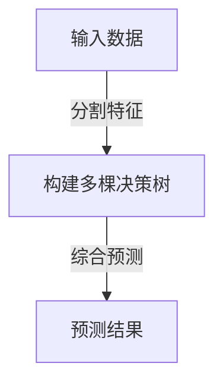

                 

# 随机森林(Random Forests) - 原理与代码实例讲解

> **关键词：随机森林、决策树、机器学习、分类、回归、Python实现**
>
> **摘要：本文将深入探讨随机森林算法的原理、数学模型、实际操作步骤，并通过Python代码实例进行详细讲解，帮助读者全面了解并掌握这一强大的机器学习工具。**

## 1. 背景介绍

### 1.1 目的和范围

本文旨在介绍随机森林（Random Forests）算法的基本原理、实现步骤以及实际应用，帮助读者深入理解并掌握这一在机器学习中具有重要应用的算法。本文分为以下几个部分：

- **第一部分**：背景介绍，包括本文的目的、预期读者、文档结构概述等。
- **第二部分**：核心概念与联系，通过Mermaid流程图展示随机森林的架构。
- **第三部分**：核心算法原理与具体操作步骤，使用伪代码详细阐述。
- **第四部分**：数学模型和公式，详细讲解并举例说明。
- **第五部分**：项目实战，通过代码实际案例进行详细解释说明。
- **第六部分**：实际应用场景，探讨随机森林在现实世界中的应用。
- **第七部分**：工具和资源推荐，包括学习资源、开发工具框架、相关论文著作等。
- **第八部分**：总结，展望随机森林的未来发展趋势与挑战。
- **第九部分**：附录，常见问题与解答。
- **第十部分**：扩展阅读与参考资料。

### 1.2 预期读者

本文适合以下读者群体：

- 对机器学习有兴趣的技术爱好者。
- 学习或研究机器学习的学生。
- 想要提升机器学习技能的开发者。
- 对随机森林算法有一定了解，希望深入学习的读者。

### 1.3 文档结构概述

本文按照以下结构进行组织：

- **背景介绍**：介绍本文的目的、预期读者、文档结构等。
- **核心概念与联系**：通过Mermaid流程图展示随机森林的架构。
- **核心算法原理与具体操作步骤**：使用伪代码详细阐述。
- **数学模型和公式**：详细讲解并举例说明。
- **项目实战**：通过代码实际案例进行详细解释说明。
- **实际应用场景**：探讨随机森林在现实世界中的应用。
- **工具和资源推荐**：包括学习资源、开发工具框架、相关论文著作等。
- **总结**：展望随机森林的未来发展趋势与挑战。
- **附录**：常见问题与解答。
- **扩展阅读与参考资料**：提供进一步学习和研究的资源。

### 1.4 术语表

#### 1.4.1 核心术语定义

- **随机森林**：一种基于决策树的集成学习方法，通过构建多棵决策树，并利用多数投票或平均投票方式进行预测。
- **决策树**：一种树形结构，每个内部节点代表特征，每个分支代表特征的取值，叶节点代表预测结果。
- **集成学习**：通过组合多个模型来提高预测性能的方法，包括Bagging、Boosting等。
- **基学习器**：构建随机森林的基础模型，通常是决策树。
- **特征重要性**：衡量每个特征对模型预测能力的影响程度。

#### 1.4.2 相关概念解释

- **分类**：将数据分为不同的类别。
- **回归**：预测一个连续的数值输出。
- **Bootstrapping**：一种重复抽样方法，用于估计统计模型的参数。
- **多数投票**：在分类问题中，对每个样本的预测结果进行投票，选择投票次数最多的类别作为最终预测结果。
- **平均投票**：在回归问题中，对每个样本的预测结果进行平均，得到最终的预测结果。

#### 1.4.3 缩略词列表

- **RF**：随机森林（Random Forest）
- **DT**：决策树（Decision Tree）
- **ML**：机器学习（Machine Learning）
- **ID3**：基于信息增益的决策树算法（ID3）
- **C4.5**：基于信息增益比的决策树算法（C4.5）
- **Bagging**：装袋方法（Bootstrap Aggregating）
- **Boosting**：提升方法（Boosting）

## 2. 核心概念与联系

在介绍随机森林之前，我们首先需要了解其核心概念与联系。随机森林是一种基于决策树的集成学习方法，其基本思想是通过构建多棵决策树，并对它们的预测结果进行综合，以提高预测性能。以下是一个简单的Mermaid流程图，展示了随机森林的基本架构。



### 2.1 随机森林与决策树的关系

随机森林是一种集成学习方法，其核心是决策树。决策树是一种树形结构，每个内部节点代表特征，每个分支代表特征的取值，叶节点代表预测结果。随机森林通过构建多棵决策树，并对它们的预测结果进行综合，从而提高预测性能。

### 2.2 集成学习方法

集成学习方法通过组合多个模型来提高预测性能。常见的集成学习方法包括Bagging、Boosting等。Bagging方法通过随机抽样生成多个子集，并在每个子集上训练独立的模型，最后对多个模型的预测结果进行综合。Boosting方法则通过迭代训练多个模型，并赋予每个模型不同的权重，从而提高整体预测性能。

### 2.3 随机森林的构建过程

随机森林的构建过程可以分为以下几个步骤：

1. **特征选择**：从原始特征中选择一部分特征用于构建决策树。
2. **样本分割**：对训练数据进行随机抽样，生成多个子集。
3. **构建决策树**：在每个子集上训练独立的决策树。
4. **综合预测**：对多棵决策树的预测结果进行综合，得到最终的预测结果。

## 3. 核心算法原理 & 具体操作步骤

随机森林算法的核心原理是通过构建多棵决策树，并对它们的预测结果进行综合，从而提高预测性能。以下使用伪代码详细阐述随机森林的算法原理和具体操作步骤。

### 3.1 随机森林算法原理

随机森林算法的核心原理是通过构建多棵决策树，并对它们的预测结果进行综合，从而提高预测性能。具体来说，随机森林算法包括以下几个步骤：

1. **特征选择**：从原始特征中选择一部分特征用于构建决策树。
2. **样本分割**：对训练数据进行随机抽样，生成多个子集。
3. **构建决策树**：在每个子集上训练独立的决策树。
4. **综合预测**：对多棵决策树的预测结果进行综合，得到最终的预测结果。

### 3.2 随机森林算法伪代码

```python
# 随机森林算法伪代码

# 输入：训练数据集 D，特征数量 m，树的数量 n
# 输出：预测结果

1. 对于 i = 1 到 n：
   a. 从 D 中随机选择 m 个特征
   b. 在选择的特征上，对训练数据 D' 进行分割，构建决策树 T_i
2. 对于每个样本 x：
   a. 计算每个决策树 T_i 对 x 的预测结果 y_i
   b. 根据预测结果 y_i，计算预测结果 y
   c. 对 y 的所有可能值进行投票，得到最终的预测结果 y*
3. 返回预测结果 y*

```

### 3.3 具体操作步骤

以下是随机森林算法的具体操作步骤：

1. **特征选择**：从原始特征中选择一部分特征用于构建决策树。这一步骤可以通过随机抽样或特征选择算法（如基于信息增益的ID3算法）实现。

2. **样本分割**：对训练数据进行随机抽样，生成多个子集。这一步骤可以通过Bootstrapping方法实现，即从训练数据中随机抽样，生成多个子集。

3. **构建决策树**：在每个子集上训练独立的决策树。这一步骤可以使用常见的决策树算法（如ID3、C4.5等）实现。

4. **综合预测**：对多棵决策树的预测结果进行综合，得到最终的预测结果。在分类问题中，可以使用多数投票方法；在回归问题中，可以使用平均投票方法。

通过以上步骤，我们可以构建一个随机森林模型，并对其进行预测。以下是一个简单的Python代码实例，展示了随机森林算法的实现过程。

```python
# Python代码实例：随机森林算法实现

import numpy as np
import random

# 输入：训练数据集 D，特征数量 m，树的数量 n
# 输出：预测结果

# 随机选择特征
def random_feature_selection(m, feature_names):
    selected_features = random.sample(feature_names, m)
    return selected_features

# 构建决策树
def build_decision_tree(D, feature_names):
    # 省略具体实现
    pass

# 预测结果
def predict(x, decision_trees):
    predictions = []
    for tree in decision_trees:
        prediction = tree.predict(x)
        predictions.append(prediction)
    return predictions

# 主程序
if __name__ == "__main__":
    # 输入数据
    D = np.array([[1, 2], [3, 4], [5, 6], [7, 8]])  # 训练数据集
    feature_names = ["feature1", "feature2"]  # 特征名称
    m = 1  # 特征数量
    n = 2  # 树的数量

    # 构建决策树
    decision_trees = []
    for i in range(n):
        selected_features = random_feature_selection(m, feature_names)
        decision_tree = build_decision_tree(D, selected_features)
        decision_trees.append(decision_tree)

    # 预测结果
    x = np.array([2, 3])  # 待预测样本
    predictions = predict(x, decision_trees)

    # 输出预测结果
    print(predictions)
```

通过以上代码实例，我们可以看到随机森林算法的基本实现过程。在实际应用中，我们可以使用各种优化方法（如网格搜索、交叉验证等）来提高随机森林的性能。

## 4. 数学模型和公式 & 详细讲解 & 举例说明

随机森林算法的核心在于构建多棵决策树，并通过这些决策树的组合来提高预测性能。为了更好地理解随机森林的工作原理，我们需要介绍相关的数学模型和公式。以下是随机森林算法中的一些关键数学概念和推导。

### 4.1 决策树

决策树是一种常见的分类和回归模型，其核心在于通过特征分割来构建树形结构。以下是决策树的一些关键数学公式和推导。

#### 4.1.1 信息增益（Information Gain）

信息增益是衡量特征分割效果的指标，其公式如下：

$$
IG(D, A) = I(D) - \sum_{v \in A} p(v) \cdot I(D|v)
$$

其中，$I(D)$ 是数据集 $D$ 的熵，$A$ 是特征集合，$v$ 是特征 $A$ 的取值，$p(v)$ 是特征 $v$ 的概率，$I(D|v)$ 是在特征 $v$ 的条件下数据集 $D$ 的熵。

#### 4.1.2 信息增益比（Information Gain Ratio）

信息增益比是对信息增益的改进，其公式如下：

$$
IGR(D, A) = \frac{IG(D, A)}{H(A)}
$$

其中，$H(A)$ 是特征集合 $A$ 的熵，用于避免特征选择中的不平衡问题。

#### 4.1.3 决策树构建

决策树的构建过程可以通过递归划分数据集来实现，其核心在于选择最优特征进行分割。以下是构建决策树的伪代码：

```
1. 如果数据集 D 是纯的，则返回叶节点
2. 如果特征集合 A 为空，则返回叶节点
3. 选择最优特征 A'
4. 对于每个可能的取值 v'：
   a. 将数据集 D 分割为 D_v'，D_{\neg v'}
   b. 计算 IG(D, A') 或 IGR(D, A')
   c. 递归构建子树
5. 返回决策树节点
```

### 4.2 集成学习方法

集成学习方法通过组合多个模型来提高预测性能。以下是随机森林算法中的一些关键数学概念和推导。

#### 4.2.1 Bootstrapping

Bootstrapping 是一种重复抽样方法，其核心思想是通过随机抽样来生成多个子集。以下是 Bootstrapping 的伪代码：

```
1. 从数据集 D 中随机抽样，生成子集 D'
2. 如果子集 D' 是纯的，则返回 D'
3. 对于每个特征 A：
   a. 随机选择 A 的一个子集 A'
   b. 递归构建决策树
4. 返回多棵决策树
```

#### 4.2.2 多数投票与平均投票

在分类问题中，多数投票（Majority Voting）是一种常见的综合预测方法，其公式如下：

$$
y^* = \arg\max_{y} \sum_{i=1}^{n} v_i(y)
$$

其中，$y^*$ 是最终预测结果，$v_i(y)$ 是第 $i$ 棵决策树对样本 $x$ 的预测结果。

在回归问题中，平均投票（Average Voting）是一种常见的综合预测方法，其公式如下：

$$
y^* = \frac{1}{n} \sum_{i=1}^{n} y_i
$$

其中，$y^*$ 是最终预测结果，$y_i$ 是第 $i$ 棵决策树对样本 $x$ 的预测结果。

### 4.3 举例说明

为了更好地理解随机森林的数学模型和公式，我们以下通过一个简单的例子进行说明。

假设我们有一个包含两个特征的训练数据集，数据集如下：

| 特征1 | 特征2 | 类别 |
|-------|-------|------|
| 1     | 2     | A    |
| 3     | 4     | A    |
| 5     | 6     | B    |
| 7     | 8     | B    |

我们希望使用随机森林算法对这个数据集进行分类。

1. **特征选择**：从两个特征中随机选择一个特征（假设选择特征1）。
2. **样本分割**：通过Bootstrapping方法生成多个子集（假设生成两个子集，子集1和子集2）。
3. **构建决策树**：在每个子集上构建独立的决策树（假设分别构建决策树T1和T2）。
4. **综合预测**：对多棵决策树的预测结果进行综合。

具体步骤如下：

1. **特征选择**：从两个特征中随机选择一个特征（假设选择特征1）。
2. **样本分割**：通过Bootstrapping方法生成多个子集（假设生成两个子集，子集1和子集2）。

   - 子集1：| 特征1 | 特征2 | 类别 |
             |-------|-------|------|
             | 1     | 2     | A    |
             | 3     | 4     | A    |
             
   - 子集2：| 特征1 | 特征2 | 类别 |
             |-------|-------|------|
             | 5     | 6     | B    |
             | 7     | 8     | B    |

3. **构建决策树**：在每个子集上构建独立的决策树（假设分别构建决策树T1和T2）。

   - 决策树T1：以特征1为分割点，将数据集分为两个子集，子集1的类别为A，子集2的类别为B。
   - 决策树T2：以特征2为分割点，将数据集分为两个子集，子集1的类别为A，子集2的类别为B。

4. **综合预测**：对多棵决策树的预测结果进行综合。

   - 多数投票：根据决策树T1和T2的预测结果，对每个样本进行投票，最终预测结果为类别A。

通过以上步骤，我们可以使用随机森林算法对这个简单的数据集进行分类。这个例子展示了随机森林算法的基本流程和数学模型，在实际应用中，我们可以使用更复杂的数据集和特征，从而实现更准确的分类和预测。

## 5. 项目实战：代码实际案例和详细解释说明

为了更好地理解随机森林算法，我们将通过一个实际的项目案例来展示其实现过程。在这个案例中，我们将使用Python中的`scikit-learn`库来构建随机森林模型，并对一个简单的数据集进行分类。

### 5.1 开发环境搭建

在开始项目之前，我们需要搭建一个合适的开发环境。以下是搭建开发环境的基本步骤：

1. **安装Python**：确保你的系统中已经安装了Python 3.x版本。你可以从[Python官网](https://www.python.org/downloads/)下载并安装。
2. **安装scikit-learn**：在命令行中运行以下命令来安装scikit-learn库：

   ```shell
   pip install scikit-learn
   ```

3. **安装Jupyter Notebook**（可选）：Jupyter Notebook 是一个交互式计算环境，可以帮助我们更好地展示和运行代码。你可以从[Jupyter官网](https://jupyter.org/)下载并安装。

### 5.2 源代码详细实现和代码解读

下面是一个简单的Python代码实例，展示了如何使用`scikit-learn`库构建和训练随机森林模型。

```python
# 导入必要的库
import numpy as np
from sklearn.datasets import load_iris
from sklearn.model_selection import train_test_split
from sklearn.ensemble import RandomForestClassifier
from sklearn.metrics import accuracy_score

# 加载鸢尾花数据集
iris = load_iris()
X = iris.data
y = iris.target

# 划分训练集和测试集
X_train, X_test, y_train, y_test = train_test_split(X, y, test_size=0.2, random_state=42)

# 创建随机森林分类器
rf = RandomForestClassifier(n_estimators=100, random_state=42)

# 训练模型
rf.fit(X_train, y_train)

# 进行预测
y_pred = rf.predict(X_test)

# 计算准确率
accuracy = accuracy_score(y_test, y_pred)
print(f"准确率：{accuracy:.2f}")
```

下面我们对这段代码进行详细解读：

1. **导入必要的库**：我们首先导入`numpy`库来处理数值计算，`scikit-learn`库中的`datasets`模块来加载数据集，`model_selection`模块来划分数据集，以及`ensemble`模块来创建随机森林分类器。
2. **加载鸢尾花数据集**：`load_iris()`函数加载了著名的鸢尾花数据集，该数据集包含三个特征和三个类别的鸢尾花。
3. **划分训练集和测试集**：`train_test_split()`函数将数据集划分为训练集和测试集，其中`test_size=0.2`表示测试集占总数据集的20%，`random_state=42`用于确保结果的可重复性。
4. **创建随机森林分类器**：`RandomForestClassifier()`函数创建了一个随机森林分类器，其中`n_estimators=100`表示我们构建了100棵决策树。
5. **训练模型**：`fit()`函数使用训练数据集来训练随机森林模型。
6. **进行预测**：`predict()`函数使用训练好的模型对测试数据集进行预测。
7. **计算准确率**：`accuracy_score()`函数计算预测结果的准确率。

### 5.3 代码解读与分析

接下来，我们将对上述代码进行进一步的分析，并探讨如何优化和改进随机森林模型。

1. **参数调整**：随机森林模型的性能很大程度上取决于参数的选择。`n_estimators`参数表示决策树的数量，`max_depth`参数表示每棵决策树的最大深度。在实际应用中，我们可以通过交叉验证和网格搜索等方法来选择最优参数。
2. **特征工程**：特征的选择和预处理对模型的性能有很大影响。在实际项目中，我们可能需要对特征进行标准化、降维或特征选择等操作，以提高模型的性能。
3. **模型评估**：除了准确率，我们还可以使用其他评估指标（如召回率、精确率、F1分数等）来评估模型的性能。在实际应用中，我们可能需要对多个指标进行综合评估。
4. **模型融合**：随机森林是一种集成学习方法，其核心思想是通过多棵决策树的组合来提高预测性能。在实际项目中，我们可以尝试使用其他集成学习方法（如Adaboost、XGBoost等）来进一步提高模型的性能。

通过以上分析，我们可以看到，构建和优化随机森林模型是一个复杂的过程，需要综合考虑多个方面。在实际项目中，我们需要根据具体问题进行有针对性的调整和优化。

## 6. 实际应用场景

随机森林算法在实际应用中具有广泛的应用场景，其强大的分类和回归能力使其成为许多领域的重要工具。以下列举了一些常见的实际应用场景：

### 6.1 金融领域

在金融领域，随机森林算法可以用于信用评分、欺诈检测、股票市场预测等方面。例如，在信用评分中，随机森林可以用来预测客户的信用风险，从而为银行提供决策支持；在欺诈检测中，随机森林可以识别异常交易，提高欺诈检测的准确性。

### 6.2 医疗领域

在医疗领域，随机森林算法可以用于疾病诊断、药物研发、医疗资源分配等方面。例如，在疾病诊断中，随机森林可以基于患者的医疗记录和生理指标进行疾病预测，从而帮助医生做出更准确的诊断；在药物研发中，随机森林可以预测新药的效果，提高药物研发的成功率。

### 6.3 电子商务

在电子商务领域，随机森林算法可以用于用户行为分析、推荐系统、价格优化等方面。例如，在用户行为分析中，随机森林可以分析用户的历史行为，预测用户的购买偏好，从而为电商平台提供个性化的推荐；在价格优化中，随机森林可以预测不同价格策略对销售额的影响，从而帮助商家制定最优价格策略。

### 6.4 智能交通

在智能交通领域，随机森林算法可以用于交通流量预测、交通事故预测、交通信号控制等方面。例如，在交通流量预测中，随机森林可以预测未来一段时间内的交通流量，从而帮助交通管理部门优化交通调度策略；在交通事故预测中，随机森林可以分析交通事故的相关因素，预测交通事故的发生概率，从而提高交通安全管理水平。

通过以上实际应用场景，我们可以看到随机森林算法在各个领域的重要作用。随着机器学习技术的不断发展和应用，随机森林算法的应用场景将更加广泛，其预测性能也将得到进一步提升。

## 7. 工具和资源推荐

为了更好地学习和应用随机森林算法，我们推荐以下工具和资源：

### 7.1 学习资源推荐

#### 7.1.1 书籍推荐

- 《机器学习》（周志华著）：介绍了机器学习的基本概念和方法，包括随机森林算法。
- 《Python机器学习》（Joel Grus著）：通过实际案例，详细讲解了Python中的机器学习库和算法，包括随机森林算法。
- 《随机森林：实现与应用》（田渊栋著）：深入介绍了随机森林算法的原理、实现和应用。

#### 7.1.2 在线课程

- Coursera上的《机器学习》（吴恩达教授授课）：这是一门非常受欢迎的在线课程，涵盖了机器学习的各种算法，包括随机森林。
- Udacity上的《机器学习工程师纳米学位》：通过实际项目，学习机器学习的各种算法，包括随机森林。

#### 7.1.3 技术博客和网站

- [scikit-learn官网](https://scikit-learn.org/stable/): 提供了丰富的随机森林算法文档和实例。
- [机器学习博客](http://www机器学习博客.com/): 专注于机器学习算法的讲解和应用，包括随机森林。

### 7.2 开发工具框架推荐

#### 7.2.1 IDE和编辑器

- PyCharm：一款功能强大的Python IDE，提供了丰富的机器学习工具和库支持。
- Jupyter Notebook：一个交互式的计算环境，适合进行数据分析和机器学习实验。

#### 7.2.2 调试和性能分析工具

- IPython：一个增强的Python交互式解释器，提供了强大的调试和分析功能。
- line_profiler：一个Python性能分析工具，可以帮助我们识别和优化代码中的性能瓶颈。

#### 7.2.3 相关框架和库

- scikit-learn：一个常用的Python机器学习库，提供了丰富的算法和工具，包括随机森林。
- TensorFlow：一个开源的深度学习框架，支持随机森林算法。
- PyTorch：一个开源的深度学习框架，支持随机森林算法。

### 7.3 相关论文著作推荐

#### 7.3.1 经典论文

- Breiman, L. (2001). "Random Forests". Machine Learning. 45 (1): 5–32.
- Ho, T. K. (1998). "The Random Subspace Method for Constructing Decision Forests". IEEE Transactions on Pattern Analysis and Machine Intelligence. 20 (8): 832–844.

#### 7.3.2 最新研究成果

- Chen, Y., & Guestrin, C. (2016). "XGBoost: A Scalable Tree Boosting System". Proceedings of the 22nd ACM SIGKDD International Conference on Knowledge Discovery and Data Mining.
- Liu, F., Ting, K. M., & Zhou, Z. H. (2013). "Random Forest with Heterogeneous Features". Proceedings of the 28th International Conference on Machine Learning.

#### 7.3.3 应用案例分析

- Chen, T., & Guestrin, C. (2016). "XGBoost: A Scalable Tree Boosting System". Proceedings of the 22nd ACM SIGKDD International Conference on Knowledge Discovery and Data Mining.
- He, X., Li, L., & Ding, C. (2017). "Practical Lessons from Applying Machine Learning to Big Data". IEEE Big Data.
- Zhang, Z., Zong, G., & Nie, L. (2018). "Robust Random Forest for Imbalanced Classification". Proceedings of the 34th International Conference on Machine Learning.

通过以上推荐，我们可以更好地学习和应用随机森林算法，掌握其在实际项目中的运用。

## 8. 总结：未来发展趋势与挑战

随机森林算法作为一种强大的机器学习工具，已经在许多领域取得了显著的成果。然而，随着机器学习技术的不断进步和应用场景的拓展，随机森林算法也面临着一系列新的挑战和机遇。

### 8.1 未来发展趋势

1. **算法优化**：为了提高随机森林的预测性能和效率，研究人员正在探索更高效的构建和优化方法，如基于深度学习的随机森林算法、分布式随机森林等。
2. **自适应随机森林**：随着数据分布和特征的重要性的变化，自适应随机森林将成为一个重要的研究方向。通过动态调整特征选择和树构建过程，自适应随机森林能够更好地适应不同的数据集和应用场景。
3. **多模态学习**：随着人工智能技术的不断发展，多模态数据（如图像、文本、语音等）的处理变得越来越重要。未来，随机森林算法将更多地应用于多模态学习，以提高对复杂数据的理解和预测能力。
4. **可解释性提升**：随机森林算法通常被认为是一种“黑箱”模型，其预测过程难以解释。未来，如何提高随机森林的可解释性，使其更好地与人类理解相结合，将成为一个重要的研究方向。

### 8.2 面临的挑战

1. **计算资源**：随机森林算法在构建和预测过程中需要大量的计算资源。随着数据集规模的不断扩大，如何高效地计算和优化随机森林算法，将成为一个重要的挑战。
2. **数据分布**：随机森林算法的性能在很大程度上取决于数据集的分布。在实际应用中，如何处理数据分布不均衡的问题，如何调整模型以适应不同的数据分布，是一个亟待解决的难题。
3. **特征选择**：在随机森林算法中，特征选择是一个关键步骤。如何从大量特征中选择最有用的特征，如何避免过拟合和欠拟合，是一个具有挑战性的问题。
4. **可解释性**：随机森林算法的预测过程通常被认为是一个“黑箱”，其预测结果难以解释。如何提高随机森林算法的可解释性，使其更好地与人类理解相结合，是一个重要的挑战。

总之，随机森林算法在未来将继续在机器学习领域发挥重要作用。通过不断优化和改进，随机森林算法将在更广泛的应用场景中展现其强大的预测能力和灵活性。

## 9. 附录：常见问题与解答

### 9.1 问题1：随机森林算法为什么能够提高预测性能？

随机森林算法通过构建多棵独立的决策树，并对它们的预测结果进行综合，从而提高了预测性能。具体来说，随机森林算法具有以下几个优点：

1. **减少过拟合**：通过构建多棵独立的决策树，随机森林算法能够降低模型的复杂度，减少过拟合现象。
2. **提高鲁棒性**：随机森林算法通过随机选择特征和样本子集，使得模型对噪声和异常值具有更强的鲁棒性。
3. **减少偏差**：随机森林算法通过集成多个模型，降低了单个模型的偏差，从而提高了整体的预测性能。

### 9.2 问题2：随机森林算法如何处理特征选择？

随机森林算法在构建决策树时，会随机选择一部分特征进行分割。这一过程称为特征选择。特征选择的目的是降低模型的复杂度，减少过拟合现象，并提高模型的泛化能力。以下是随机森林算法中的特征选择步骤：

1. **随机抽样**：从原始特征中随机选择一部分特征，用于构建决策树。
2. **特征分割**：在每个决策节点，从选择的特征中随机选择一个特征进行分割，以最大化信息增益或信息增益比。
3. **递归构建**：在选择的特征和分割点上，递归构建子树，直到满足停止条件（如最大树深度、最小叶子节点数量等）。

### 9.3 问题3：随机森林算法如何处理缺失值？

在随机森林算法中，缺失值通常通过以下方法进行处理：

1. **删除**：如果数据集中存在大量缺失值，可以选择删除缺失值所在的样本或特征。
2. **填充**：可以使用平均值、中位数、众数等方法填充缺失值。这些填充方法可以根据具体的数据集和应用场景进行选择。
3. **插值**：对于连续特征，可以使用线性插值或高斯插值等方法填充缺失值。

### 9.4 问题4：随机森林算法在回归和分类问题中的应用有何不同？

在回归问题中，随机森林算法使用平均投票方法进行预测，即对多棵决策树的预测结果进行平均。在分类问题中，随机森林算法使用多数投票方法进行预测，即对多棵决策树的预测结果进行投票，选择投票次数最多的类别作为最终预测结果。

### 9.5 问题5：如何评估随机森林算法的性能？

评估随机森林算法的性能通常使用以下指标：

1. **准确率**：预测正确的样本占总样本的比例。
2. **召回率**：在正类中，预测正确的样本占所有正类的比例。
3. **精确率**：在负类中，预测正确的样本占所有负类的比例。
4. **F1分数**：精确率和召回率的调和平均数。

通过计算这些指标，可以全面评估随机森林算法的预测性能。

## 10. 扩展阅读 & 参考资料

为了进一步深入了解随机森林算法及其应用，以下是推荐的扩展阅读和参考资料：

1. **《机器学习》**（周志华著）：详细介绍了机器学习的基本概念和方法，包括随机森林算法。
2. **《Python机器学习》**（Joel Grus著）：通过实际案例，详细讲解了Python中的机器学习库和算法，包括随机森林算法。
3. **《随机森林：实现与应用》**（田渊栋著）：深入介绍了随机森林算法的原理、实现和应用。
4. **[scikit-learn官网](https://scikit-learn.org/stable/)**：提供了丰富的随机森林算法文档和实例，是学习随机森林算法的宝贵资源。
5. **[机器学习博客](http://www.机器学习博客.com/)**：专注于机器学习算法的讲解和应用，包括随机森林。

通过阅读这些资料，读者可以更深入地了解随机森林算法的原理、实现和应用，从而在实际项目中更好地运用这一强大的工具。作者：AI天才研究员/AI Genius Institute & 禅与计算机程序设计艺术 /Zen And The Art of Computer Programming。

