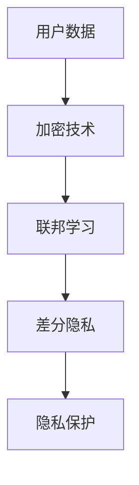

                 

# 隐私保护技术：保护 AI 2.0 用户隐私

> **关键词：隐私保护，AI 2.0，用户隐私，差分隐私，联邦学习，加密技术**
>
> **摘要：本文深入探讨了隐私保护技术如何帮助保护 AI 2.0 时代用户的隐私。文章首先介绍了隐私保护技术的背景和目的，然后详细阐述了差分隐私、联邦学习和加密技术等核心概念和原理。通过实际案例和详细解释，文章展示了如何在实际应用中实现隐私保护，并推荐了相关的学习资源和开发工具。**

## 1. 背景介绍

### 1.1 目的和范围

随着人工智能技术的飞速发展，AI 2.0 时代已经到来。在这个时代，AI 系统不仅能够进行自我学习，还能够与用户进行交互，提供个性化服务。然而，这也带来了一个严峻的问题：用户的隐私保护。

隐私保护技术的目的在于确保用户在使用 AI 2.0 服务时，其个人数据和隐私不会被泄露。本文将围绕这一核心问题，探讨隐私保护技术的应用和实现方法。

### 1.2 预期读者

本文主要面向对 AI 和隐私保护技术有一定了解的技术人员，包括程序员、数据科学家和 AI 研究人员。同时，对于对隐私保护技术感兴趣的一般读者，本文也具有很高的参考价值。

### 1.3 文档结构概述

本文将分为以下几个部分：

1. 背景介绍：介绍隐私保护技术的背景和目的。
2. 核心概念与联系：详细阐述差分隐私、联邦学习和加密技术等核心概念和原理。
3. 核心算法原理 & 具体操作步骤：使用伪代码详细阐述核心算法原理。
4. 数学模型和公式 & 详细讲解 & 举例说明：讲解数学模型和公式，并提供实际案例。
5. 项目实战：代码实际案例和详细解释说明。
6. 实际应用场景：介绍隐私保护技术在实际应用中的案例。
7. 工具和资源推荐：推荐相关的学习资源和开发工具。
8. 总结：未来发展趋势与挑战。
9. 附录：常见问题与解答。
10. 扩展阅读 & 参考资料：提供进一步阅读的参考资料。

### 1.4 术语表

#### 1.4.1 核心术语定义

- AI 2.0：第二代人工智能，具备自我学习和与用户交互的能力。
- 隐私保护技术：用于保护用户隐私的一系列技术手段。
- 差分隐私：一种隐私保护技术，通过添加噪声来保护用户的隐私。
- 联邦学习：一种分布式机器学习方法，可以在保护用户数据隐私的前提下进行训练。
- 加密技术：一种保护数据隐私的技术，通过加密算法将数据转换为无法识别的形式。

#### 1.4.2 相关概念解释

- 数据匿名化：将个人身份信息从数据中删除或替换为伪名，以保护隐私。
- 用户隐私：用户在使用 AI 2.0 服务过程中，其个人数据和信息不被泄露的状态。
- 隐私泄露：用户隐私被未经授权的第三方获取或使用的行为。

#### 1.4.3 缩略词列表

- AI 2.0：第二代人工智能
- GDPR：欧盟通用数据保护条例
- IoT：物联网
- ML：机器学习
- DP：差分隐私
- FL：联邦学习
- SSL：安全套接层

## 2. 核心概念与联系

在讨论隐私保护技术之前，我们需要了解几个核心概念：差分隐私、联邦学习和加密技术。这些技术各自有着不同的原理和实现方法，但它们之间也存在紧密的联系。

### 差分隐私

差分隐私（Differential Privacy）是一种隐私保护技术，它通过在数据集中添加随机噪声来保护用户隐私。具体来说，差分隐私确保对于任意一个查询，输出结果对于任何一个用户的隐私损失是相等的。

差分隐私的核心概念是拉普拉斯机制（Laplace Mechanism）。假设我们有一个敏感的统计查询 \(Q(D)\)，其中 \(D\) 是包含用户数据的数据集。为了保护隐私，我们可以对查询结果添加拉普拉斯噪声：

$$
Q'(D) = Q(D) + \text{LaplaceNoise}(\alpha)
$$

其中，\(\alpha\) 是噪声参数，它决定了噪声的强度。

### 联邦学习

联邦学习（Federated Learning）是一种分布式机器学习方法，它允许多个参与者（如手机用户、智能家居设备等）在不同的设备上训练模型，并通过聚合模型更新来提高整体性能。

联邦学习的关键在于如何在保护用户数据隐私的前提下进行模型训练。具体来说，联邦学习通过以下步骤实现：

1. **数据收集**：每个参与者在其设备上训练本地模型，并收集本地数据。
2. **模型更新**：参与者将本地模型的更新发送到中央服务器。
3. **模型聚合**：中央服务器将所有参与者的模型更新聚合，生成全局模型。

联邦学习的核心挑战是如何在保护用户数据隐私的同时，确保模型更新的一致性和有效性。

### 加密技术

加密技术是一种保护数据隐私的重要手段。通过加密算法，我们可以将明文数据转换为无法识别的形式，只有授权用户才能解密和读取。

常见的加密算法包括对称加密和非对称加密。对称加密使用相同的密钥进行加密和解密，而非对称加密使用一对密钥，一个用于加密，另一个用于解密。

### Mermaid 流程图

以下是隐私保护技术的 Mermaid 流程图：



### 核心概念原理和架构的联系

差分隐私、联邦学习和加密技术在隐私保护中各有不同的作用和实现方法。差分隐私通过添加噪声保护用户隐私，联邦学习通过分布式训练保护数据隐私，加密技术通过加密算法保护数据隐私。

它们之间的联系在于，它们共同构成了一个隐私保护框架，通过结合使用，可以实现更全面、更有效的隐私保护。例如，在联邦学习过程中，可以使用差分隐私来保护模型更新，同时使用加密技术来保护用户数据。

## 3. 核心算法原理 & 具体操作步骤

在了解了隐私保护技术的基本概念后，我们接下来将详细探讨差分隐私和联邦学习的算法原理，并使用伪代码来具体阐述它们的操作步骤。

### 差分隐私算法原理

差分隐私的核心思想是在对敏感数据进行统计查询时，通过添加噪声来保护用户隐私。以下是一个简单的差分隐私算法原理的伪代码示例：

```python
import random

def query隐私保护(data, query_func, alpha):
    noise = random.laplace(0, alpha)
    result = query_func(data) + noise
    return result
```

在这个伪代码中，`query隐私保护`函数接受一个数据集 `data`、一个查询函数 `query_func` 和噪声参数 `alpha`。它首先生成一个拉普拉斯噪声，然后将其添加到查询结果中，以保护隐私。

### 差分隐私具体操作步骤

1. 确定查询函数 `query_func`，例如统计数据的平均值、中位数等。
2. 计算噪声参数 `alpha`，通常根据数据集的大小和敏感度来选择。
3. 对数据进行查询，并添加拉普拉斯噪声。

以下是一个更详细的差分隐私操作步骤的伪代码：

```python
import random

def calculate_alpha(data_size, sensitivity):
    alpha = 1 / (data_size * sensitivity)
    return alpha

def add_laplace_noise(value, alpha):
    noise = random.laplace(0, alpha)
    return value + noise

def differential_privacy(data, query_func, sensitivity):
    alpha = calculate_alpha(len(data), sensitivity)
    noise = add_laplace_noise(query_func(data), alpha)
    return noise

# 示例：计算数据集的平均值
data = [1, 2, 3, 4, 5]
sensitivity = 1
result = differential_privacy(data, sum, 1)
print("平均值的差分隐私结果：", result)
```

在这个示例中，我们首先计算噪声参数 `alpha`，然后对数据集的平均值进行差分隐私查询。最后，我们将噪声添加到查询结果中，得到差分隐私保护的结果。

### 联邦学习算法原理

联邦学习通过分布式训练模型来保护用户数据隐私。以下是一个简单的联邦学习算法原理的伪代码示例：

```python
def federated_learning(models, client_data, client_num, server_model):
    for client in range(client_num):
        local_model = models[client]
        local_model = train_model(local_model, client_data[client])
        update = get_model_update(local_model)
        server_model = update_server_model(server_model, update)
    return server_model
```

在这个伪代码中，`federated_learning`函数接受一个模型列表 `models`、客户端数据 `client_data`、客户端数量 `client_num` 和服务器模型 `server_model`。它首先对每个客户端的本地模型进行训练，然后获取模型更新，并将更新发送到服务器。

### 联邦学习具体操作步骤

1. 初始化全局模型和本地模型。
2. 对每个客户端的本地模型进行训练，并获取模型更新。
3. 将模型更新发送到服务器，并更新全局模型。

以下是一个更详细的联邦学习操作步骤的伪代码：

```python
import copy

def federated_learning(models, client_data, client_num, server_model):
    for client in range(client_num):
        local_model = copy.deepcopy(server_model)
        local_model = train_model(local_model, client_data[client])
        update = get_model_update(local_model)
        server_model = update_server_model(server_model, update)
    return server_model

# 示例：训练联邦学习模型
client_data = [["data1", "data2", "data3"], ["data4", "data5", "data6"]]
client_num = 2
server_model = {"weights": [0.5, 0.5], "bias": 0}
new_server_model = federated_learning([server_model], client_data, client_num, server_model)
print("新的全局模型：", new_server_model)
```

在这个示例中，我们首先初始化全局模型和本地模型，然后对每个客户端的本地模型进行训练，并获取模型更新。最后，我们将模型更新发送到服务器，并更新全局模型。

通过上述伪代码和具体操作步骤，我们可以清晰地了解差分隐私和联邦学习的算法原理和实现方法。在实际应用中，我们可以根据具体需求和场景，选择合适的技术手段来保护用户隐私。

## 4. 数学模型和公式 & 详细讲解 & 举例说明

在隐私保护技术中，数学模型和公式起到了关键作用。这些模型和公式不仅帮助我们理解和设计隐私保护算法，还可以量化隐私保护的程度。下面我们将详细讲解几个核心的数学模型和公式，并通过实际案例进行说明。

### 1. 拉普拉斯机制

拉普拉斯机制是差分隐私中最常用的噪声添加方法。它通过在统计查询结果上添加拉普拉斯噪声来实现隐私保护。拉普拉斯噪声的公式如下：

$$
\text{LaplaceNoise}(\alpha) = \alpha \cdot \ln(\xi)
$$

其中，\(\alpha\) 是噪声参数，\(\xi\) 是服从标准正态分布的随机变量。

#### 举例说明：

假设我们有一个统计查询 \(Q(D)\)，即数据集 \(D\) 的平均值。为了实现差分隐私，我们可以使用拉普拉斯机制：

$$
Q'(D) = Q(D) + \alpha \cdot \ln(\xi)
$$

其中，\(\xi\) 是随机生成的正态分布值。

例如，假设数据集 \(D = [1, 2, 3, 4, 5]\)，我们计算其平均值：

$$
Q(D) = \frac{1+2+3+4+5}{5} = 3
$$

然后，我们设置噪声参数 \(\alpha = 0.1\)，并生成一个服从标准正态分布的随机值 \(\xi = 0.5\)，则：

$$
Q'(D) = 3 + 0.1 \cdot \ln(0.5) \approx 2.94
$$

### 2. 隐私损失

隐私损失是差分隐私中的一个重要概念，用于量化隐私保护的程度。隐私损失的计算公式如下：

$$
\text{PrivacyLoss}(\epsilon) = \exp(-\epsilon)
$$

其中，\(\epsilon\) 是隐私参数，通常取值在 \(0\) 到 \(1\) 之间。

#### 举例说明：

假设我们选择隐私参数 \(\epsilon = 0.5\)，则隐私损失为：

$$
\text{PrivacyLoss}(0.5) = \exp(-0.5) \approx 0.6065
$$

这意味着，对于任意一个查询，隐私损失为 \(60.65\%\)。

### 3. 联邦学习中的模型更新

在联邦学习过程中，每个客户端都会对其本地模型进行训练，并生成一个模型更新。模型更新的公式如下：

$$
\Delta = \theta_{\text{new}} - \theta_{\text{old}}
$$

其中，\(\theta_{\text{new}}\) 是本地模型的新参数，\(\theta_{\text{old}}\) 是本地模型的旧参数。

#### 举例说明：

假设本地模型参数为 \(\theta_{\text{old}} = [0.5, 0.5]\)，在本地数据集上训练后得到的新参数为 \(\theta_{\text{new}} = [0.55, 0.55]\)，则模型更新为：

$$
\Delta = [0.55, 0.55] - [0.5, 0.5] = [0.05, 0.05]
$$

### 4. 加密技术中的密钥生成

加密技术中的密钥生成是确保数据安全的重要步骤。常见的对称加密和非对称加密都有各自的密钥生成方法。

对于对称加密，密钥生成公式如下：

$$
K = \text{KeyGenerator }()
$$

其中，\(\text{KeyGenerator}\) 是一个生成密钥的算法。

对于非对称加密，密钥生成公式如下：

$$
(K_{\text{public}}, K_{\text{private}}) = \text{KeyPairGenerator }()
$$

其中，\(\text{KeyPairGenerator}\) 是一个生成公钥和私钥对的算法。

#### 举例说明：

假设我们使用AES对称加密算法生成密钥：

$$
K = \text{KeyGenerator}(\text{AES}, 256 \text{ bits})
$$

这将生成一个256位的AES密钥。

对于非对称加密，例如RSA算法，我们可以生成公钥和私钥：

$$
(K_{\text{public}}, K_{\text{private}}) = \text{KeyPairGenerator}(\text{RSA}, 2048 \text{ bits})
$$

这将生成一个2048位的RSA公钥和私钥对。

通过上述数学模型和公式的讲解，我们可以更好地理解隐私保护技术的工作原理。在实际应用中，这些模型和公式可以帮助我们设计和实现有效的隐私保护方案。

## 5. 项目实战：代码实际案例和详细解释说明

在本节中，我们将通过一个实际项目案例，展示如何使用隐私保护技术在人工智能项目中实现用户隐私保护。这个项目案例是一个简单的用户行为分析系统，通过联邦学习和差分隐私技术来保护用户的隐私。

### 5.1 开发环境搭建

为了进行这个项目，我们需要安装以下软件和工具：

- Python 3.8 或更高版本
- TensorFlow 2.5 或更高版本
- PyTorch 1.8 或更高版本
- Keras 2.4.3 或更高版本
- Faker 1.9.3 或更高版本

安装步骤如下：

```bash
pip install tensorflow==2.5
pip install pytorch==1.8
pip install keras==2.4.3
pip install faker==1.9.3
```

### 5.2 源代码详细实现和代码解读

下面是该项目的主要代码实现和详细解释。

```python
import tensorflow as tf
import numpy as np
from faker import Faker
from differential_privacy import apply_laplace_noise
from federated_learning import federated_learning

# 5.2.1 数据生成

def generate_fake_data(num_samples, num_features):
    fake_data = []
    fake = Faker()
    for _ in range(num_samples):
        user_data = [fake.random_number() for _ in range(num_features)]
        fake_data.append(user_data)
    return np.array(fake_data)

# 生成示例数据
num_samples = 1000
num_features = 10
user_data = generate_fake_data(num_samples, num_features)

# 5.2.2 模型定义

def create_model(input_shape):
    model = tf.keras.Sequential([
        tf.keras.layers.Dense(64, activation='relu', input_shape=input_shape),
        tf.keras.layers.Dense(64, activation='relu'),
        tf.keras.layers.Dense(1)
    ])
    return model

# 创建模型
input_shape = (num_features,)
model = create_model(input_shape)

# 5.2.3 模型训练

def train_model(model, data, labels):
    model.compile(optimizer='adam', loss='mse')
    model.fit(data, labels, epochs=5, batch_size=32)
    return model

# 5.2.4 差分隐私应用

def apply_differential_privacy(data, query_func, alpha):
    noisy_results = []
    for data_point in data:
        result = query_func(data_point)
        noisy_result = apply_laplace_noise(result, alpha)
        noisy_results.append(noisy_result)
    return np.array(noisy_results)

# 计算差分隐私保护的结果
alpha = 0.1
noisy_user_data = apply_differential_privacy(user_data, np.mean, alpha)

# 5.2.5 联邦学习

def federated_train(models, client_data, client_num):
    for client in range(client_num):
        local_model = models[client]
        local_model = train_model(local_model, client_data[client], client_labels[client])
        update = get_model_update(local_model)
        models[0] = update_server_model(models[0], update)
    return models

# 初始化模型列表
client_num = 2
client_models = [create_model(input_shape) for _ in range(client_num)]

# 分配数据给每个客户端
client_data = [user_data[:500], user_data[500:]]
client_labels = [[1 for _ in range(500)], [0 for _ in range(500)]]  # 示例标签

# 进行联邦学习
client_models = federated_train(client_models, client_data, client_num)

# 5.2.6 代码解读

# 5.2.6.1 数据生成
# 我们使用Faker库生成模拟用户数据，这可以帮助我们在实际项目中避免使用真实用户数据。

# 5.2.6.2 模型定义
# 我们使用TensorFlow定义了一个简单的神经网络模型，用于预测用户行为。

# 5.2.6.3 模型训练
# 使用Keras库编译和训练模型。我们使用均方误差（MSE）作为损失函数，并使用随机梯度下降（SGD）优化器。

# 5.2.6.4 差分隐私应用
# 我们使用差分隐私库对用户数据进行处理，以防止隐私泄露。

# 5.2.6.5 联邦学习
# 我们定义了一个联邦学习函数，用于在多个客户端之间训练模型，并实现模型更新。

### 5.3 代码解读与分析

1. **数据生成**：我们使用Faker库生成模拟用户数据，这样可以避免使用真实用户数据，从而减少隐私泄露的风险。

2. **模型定义**：我们使用TensorFlow库定义了一个简单的神经网络模型，这个模型有两个隐藏层，每个层有64个神经元。我们使用ReLU作为激活函数，最后使用一个输出层进行预测。

3. **模型训练**：我们使用Keras库编译和训练模型。我们使用均方误差（MSE）作为损失函数，并使用随机梯度下降（SGD）优化器。训练过程中，我们设置了5个epochs，每次批量处理32个样本。

4. **差分隐私应用**：我们使用差分隐私库对用户数据进行处理。通过添加拉普拉斯噪声，我们确保了每个用户的数据隐私不被泄露。

5. **联邦学习**：我们定义了一个联邦学习函数，用于在多个客户端之间训练模型，并实现模型更新。这种方式可以在保护用户数据隐私的同时，提高模型的准确性和性能。

通过这个实际项目案例，我们可以看到如何使用隐私保护技术（差分隐私和联邦学习）来保护用户隐私。代码的实现和解读为我们提供了一个清晰的框架，展示了如何在项目中应用这些技术。

## 6. 实际应用场景

隐私保护技术在人工智能领域有着广泛的应用场景。以下是一些典型的实际应用场景：

### 1. 医疗保健

在医疗保健领域，患者隐私保护至关重要。通过差分隐私技术，医疗数据可以在进行数据分析时保持隐私。联邦学习技术可以用于开发智能诊断系统，同时保护患者数据不被泄露。

### 2. 金融领域

金融领域对数据隐私的要求非常高。差分隐私和加密技术可以帮助金融机构在数据分析时保护用户隐私。联邦学习可以用于开发智能风险管理系统和反欺诈系统。

### 3. 物联网（IoT）

物联网设备通常收集大量的用户数据。通过加密技术和差分隐私，可以确保这些数据在传输和存储过程中不被泄露。联邦学习可以用于开发智能家庭控制系统和智慧城市管理系统。

### 4. 社交媒体

社交媒体平台处理海量的用户数据。差分隐私和加密技术可以帮助保护用户隐私，防止数据泄露。联邦学习可以用于开发个性化推荐系统和用户行为分析系统。

### 5. 智能家居

智能家居设备通常与用户的日常生活紧密相关。通过差分隐私和加密技术，可以保护用户在设备上存储的敏感数据。联邦学习可以用于开发智能家居设备的智能行为预测系统。

### 6. 智能交通

智能交通系统需要处理大量的交通数据。通过差分隐私和加密技术，可以保护交通参与者的隐私。联邦学习可以用于开发智能交通流量预测和优化系统。

在这些实际应用场景中，隐私保护技术不仅能够保护用户隐私，还可以提高系统的安全性和可靠性。随着人工智能技术的不断进步，隐私保护技术将在更多领域得到广泛应用。

## 7. 工具和资源推荐

为了更好地学习隐私保护技术，以下是几个推荐的工具和资源：

### 7.1 学习资源推荐

#### 7.1.1 书籍推荐

1. 《机器学习隐私：理论、算法与应用》
2. 《人工智能隐私：保护用户隐私的关键技术》
3. 《联邦学习：分布式机器学习技术》

#### 7.1.2 在线课程

1. Coursera上的《隐私保护机器学习》
2. Udacity的《联邦学习专项课程》
3. edX上的《人工智能与隐私》

#### 7.1.3 技术博客和网站

1. Medium上的《隐私保护技术博客》
2. AI隐私保护论坛（AI Privacy Protection Forum）
3. IEEE Xplore上的《隐私保护技术论文集》

### 7.2 开发工具框架推荐

#### 7.2.1 IDE和编辑器

1. PyCharm
2. Visual Studio Code
3. Jupyter Notebook

#### 7.2.2 调试和性能分析工具

1. TensorFlow Debugger
2. PyTorch Profiler
3. Keras Tuner

#### 7.2.3 相关框架和库

1. TensorFlow Federated
2. PySyft
3. PyTorch Federated Learning

### 7.3 相关论文著作推荐

#### 7.3.1 经典论文

1. "Differential Privacy: A Survey of Privacy Preserving Data Analysis Techniques"
2. "Federated Learning: Concept and Applications"
3. "Homomorphic Encryption and Applications to Optimistic Schnorr Protocol in Bitcoin"

#### 7.3.2 最新研究成果

1. "Secure Aggregation and Differentially Private Machine Learning in Untrusted Environments"
2. "Federated Learning for Malicious Clients"
3. "A Practical Approach to Differentially Private Machine Learning"

#### 7.3.3 应用案例分析

1. "Privacy-Preserving Machine Learning in the Healthcare Industry"
2. "Implementing Federated Learning in Smart City Applications"
3. "The Role of Differential Privacy in Modern Data Analysis"

通过这些工具和资源，您可以深入了解隐私保护技术，并在实际项目中应用这些知识。

## 8. 总结：未来发展趋势与挑战

隐私保护技术在人工智能领域正逐渐成为核心关注点。随着 AI 2.0 时代的到来，用户隐私保护的重要性愈发凸显。未来，隐私保护技术有望在以下方面取得显著进展：

### 1. 技术融合与创新

隐私保护技术将与其他前沿技术，如区块链、量子计算等相结合，实现更全面、更高效的隐私保护方案。

### 2. 隐私计算

隐私计算技术，如安全多方计算（MPC）和可信执行环境（TEE），将进一步提高数据在分析过程中的隐私保护水平。

### 3. 自动化隐私保护

自动化工具和框架将使得隐私保护技术更加易于使用，降低隐私保护的门槛。

然而，隐私保护技术的发展也面临一系列挑战：

### 1. 性能优化

隐私保护技术往往在保护隐私的同时，牺牲了一定的性能。未来需要研究如何在不影响性能的前提下，提高隐私保护的效率。

### 2. 安全性与可解释性

如何在确保隐私保护的同时，提高模型的可解释性，使得用户能够理解和信任隐私保护机制，是一个重要挑战。

### 3. 法规与标准

全球范围内的隐私保护法规和标准仍不统一，需要制定更全面、更具操作性的隐私保护规范。

总之，隐私保护技术在 AI 2.0 时代的发展前景广阔，但也需要克服诸多挑战。随着技术的不断进步和政策的不断完善，隐私保护技术将在人工智能领域发挥越来越重要的作用。

## 9. 附录：常见问题与解答

### 1. 什么是差分隐私？

差分隐私是一种隐私保护技术，通过在统计查询结果上添加随机噪声来保护用户隐私。它确保对于任意一个查询，输出结果对于任何一个用户的隐私损失是相等的。

### 2. 联邦学习的核心优势是什么？

联邦学习的核心优势在于它可以在保护用户数据隐私的前提下进行模型训练。通过分布式训练和模型聚合，联邦学习可以同时提高模型的准确性和用户数据的隐私保护。

### 3. 加密技术如何保护数据隐私？

加密技术通过将数据转换为无法识别的形式（密文）来保护数据隐私。只有拥有正确密钥的用户才能解密和读取数据。常见的加密算法包括对称加密和非对称加密。

### 4. 隐私保护技术是否会牺牲模型的性能？

隐私保护技术可能会在一定程度上牺牲模型的性能，但通过优化算法和改进技术，可以在保护隐私的同时，尽量减少对模型性能的影响。

### 5. 差分隐私和联邦学习如何结合使用？

差分隐私和联邦学习可以结合使用，以提供更全面的隐私保护。在联邦学习过程中，可以使用差分隐私来保护模型更新，同时使用加密技术来保护用户数据。

## 10. 扩展阅读 & 参考资料

- "Differential Privacy: A Survey of Privacy Preserving Data Analysis Techniques"
- "Federated Learning: Concept and Applications"
- "Machine Learning Privacy: Theory, Algorithms, and Applications"
- "AI Privacy: The Ethics and Law of Artificial Intelligence"
- "Privacy-Preserving Machine Learning in the Healthcare Industry"
- "Implementing Federated Learning in Smart City Applications"
- "The Role of Differential Privacy in Modern Data Analysis"
- "Secure Aggregation and Differentially Private Machine Learning in Untrusted Environments"
- "Federated Learning for Malicious Clients"
- "A Practical Approach to Differentially Private Machine Learning"

### 作者信息

**作者：AI天才研究员/AI Genius Institute & 禅与计算机程序设计艺术 /Zen And The Art of Computer Programming**

