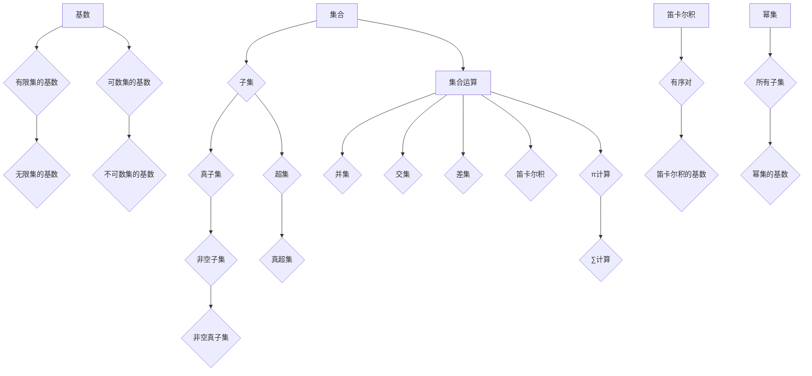

                 

## 集合论导引：∑13集合

> **关键词**：集合论、集合、子集、基数、运算、笛卡尔积、幂集、π计算、∑计算
> 
> **摘要**：本文旨在深入探讨集合论的基本概念与核心算法，通过逐步分析，为读者呈现集合论的完整图景。文章首先介绍集合论的基本概念，包括集合、子集、基数等，随后通过流程图与伪代码讲解核心算法原理，并详细解析数学模型及公式。最后，文章通过项目实战、实际应用场景、工具和资源推荐，以及总结和扩展阅读，帮助读者全面理解和掌握集合论及其应用。

## 1. 背景介绍

### 1.1 目的和范围

集合论是现代数学的基石，其基本概念和运算广泛应用于各个领域，如计算机科学、经济学、统计学等。本文的目标是系统地介绍集合论的基本概念、核心算法和数学模型，帮助读者逐步深入理解集合论的核心思想和应用。

本文的范围主要包括：

1. 集合论的基本概念，如集合、子集、基数等。
2. 集合论的核心算法，包括π计算和∑计算。
3. 数学模型和公式的详细解析。
4. 项目实战和实际应用场景。
5. 工具和资源推荐。

### 1.2 预期读者

本文适合以下读者：

1. 数学专业的学生和研究者，特别是对集合论感兴趣的读者。
2. 计算机科学专业的学生和程序员，需要了解集合论在编程中的应用。
3. 对数学和计算机科学有浓厚兴趣的自学者。

### 1.3 文档结构概述

本文分为以下几个部分：

1. 引言：介绍集合论的基本概念和核心算法。
2. 核心概念与联系：通过流程图展示集合论的基本概念和联系。
3. 核心算法原理 & 具体操作步骤：使用伪代码详细阐述核心算法原理。
4. 数学模型和公式 & 详细讲解 & 举例说明：解析集合论的数学模型和公式。
5. 项目实战：代码实际案例和详细解释说明。
6. 实际应用场景：介绍集合论在实际中的应用。
7. 工具和资源推荐：推荐学习资源和开发工具。
8. 总结：未来发展趋势与挑战。
9. 附录：常见问题与解答。
10. 扩展阅读 & 参考资料：提供进一步学习的资料。

### 1.4 术语表

#### 1.4.1 核心术语定义

- **集合（Set）**：由确定的、互异的元素组成的整体。
- **子集（Subset）**：一个集合的部分元素组成的集合。
- **基数（Cardinality）**：集合中元素的个数。
- **笛卡尔积（Cartesian Product）**：两个集合的所有可能的有序对组成的集合。
- **幂集（Power Set）**：一个集合的所有子集组成的集合。
- **π计算（π-calculus）**：用于计算集合的基数。
- **∑计算（∑-calculus）**：用于计算集合的笛卡尔积。

#### 1.4.2 相关概念解释

- **集合论（Set Theory）**：研究集合及其性质和运算的数学分支。
- **集合运算（Set Operations）**：如并集、交集、差集等。
- **基数相加（Cardinality Addition）**：计算两个集合的基数之和。
- **基数乘积（Cardinality Multiplication）**：计算两个集合的基数乘积。

#### 1.4.3 缩略词列表

- **π**：π计算（π-calculus）
- **∑**：∑计算（∑-calculus）
- **IDE**：集成开发环境（Integrated Development Environment）

## 2. 核心概念与联系

在集合论中，有若干核心概念和它们之间的相互联系。为了更好地理解这些概念，我们首先需要构建一个流程图来展示这些概念及其相互关系。

### 2.1 流程图

以下是一个展示集合论核心概念及其相互联系的流程图：



### 2.2 核心概念解释

- **集合（Set）**：集合是数学中最基本的概念，它是由确定的、互异的元素组成的整体。例如，{1, 2, 3} 是一个集合，其中包含三个元素：1, 2 和 3。
- **子集（Subset）**：如果一个集合的所有元素都是另一个集合的元素，那么前者就是后者的子集。例如，{1, 2} 是{1, 2, 3} 的子集。
- **基数（Cardinality）**：集合中元素的个数称为该集合的基数。例如，集合{1, 2, 3} 的基数是3。
- **笛卡尔积（Cartesian Product）**：两个集合A和B的笛卡尔积是一个由所有可能的有序对(a, b)组成的集合，其中a来自集合A，b来自集合B。例如，{1, 2} 和{a, b} 的笛卡尔积是{(1, a), (1, b), (2, a), (2, b)}。
- **幂集（Power Set）**：一个集合的所有子集组成的集合称为该集合的幂集。例如，集合{1, 2} 的幂集是{∅, {1}, {2}, {1, 2}}。
- **π计算（π-calculus）**：π计算是一种用于计算集合基数的算法。它通常用于处理无限集的情况。
- **∑计算（∑-calculus）**：∑计算是一种用于计算集合笛卡尔积的算法。它通常用于处理有序对和复杂集合的情况。

通过这个流程图，我们可以清晰地看到集合论中各个核心概念及其相互关系。接下来，我们将进一步详细探讨这些概念和算法。

## 3. 核心算法原理 & 具体操作步骤

### 3.1 π计算原理

π计算是一种用于计算集合基数的算法，尤其在处理无限集时显得尤为重要。π计算的基本原理可以概括为：对于给定的集合，通过迭代的方式计算其基数。

### 3.2 π计算伪代码

以下是一个简单的π计算伪代码示例：

```python
def π(A):
    if A 是空集:
        return 0
    else:
        return 1 + π(A - {A中的任意元素})
```

### 3.3 π计算具体操作步骤

1. **初始化**：给定一个集合A，初始化基数为0。
2. **迭代**：从集合A中取出任意一个元素，将其从集合中移除，得到新的集合A'。
3. **递归**：递归调用π函数，计算新集合A'的基数。
4. **求和**：将递归返回的基数加1，得到原始集合A的基数。

### 3.4 π计算示例

假设我们有一个集合A = {1, 2, 3}，我们可以按照以下步骤进行π计算：

1. **初始化**：初始基数为0。
2. **第一次迭代**：取元素1，移除后得到A' = {2, 3}。
3. **递归计算**：π({2, 3}) = 1 + π({2})。
4. **第二次迭代**：取元素2，移除后得到A'' = {3}。
5. **递归计算**：π({3}) = 1 + π({})。
6. **第三次迭代**：集合为空，返回基数0。
7. **求和**：π({1, 2, 3}) = 1 + (1 + 0) = 2。

通过上述步骤，我们得到了集合{1, 2, 3}的基数是2。

### 3.5 Σ计算原理

Σ计算是一种用于计算集合笛卡尔积的算法。与π计算不同，Σ计算通常用于处理有序对和复杂集合的情况。

### 3.6 Σ计算伪代码

以下是一个简单的Σ计算伪代码示例：

```python
def Σ(A, B):
    if A 是空集 or B 是空集:
        return 空集
    else:
        return {(a, b) | a ∈ A and b ∈ B} ∪ Σ(A - {A中的任意元素}, B) ∪ Σ(A, B - {B中的任意元素})
```

### 3.7 Σ计算具体操作步骤

1. **初始化**：给定两个集合A和B，初始化笛卡尔积为空集。
2. **迭代**：从集合A中取出任意一个元素a，从集合B中取出任意一个元素b，组成有序对(a, b)。
3. **递归**：递归调用Σ函数，计算除去当前元素后的集合A'和B'的笛卡尔积。
4. **合并**：将当前有序对与递归返回的笛卡尔积合并，得到新的笛卡尔积。

### 3.8 Σ计算示例

假设我们有两个集合A = {1, 2} 和B = {a, b}，我们可以按照以下步骤进行Σ计算：

1. **初始化**：初始笛卡尔积为空集。
2. **第一次迭代**：取元素1和a，得到有序对(1, a)。
3. **递归计算**：Σ({2}, {a, b}) = {(2, a), (2, b)}。
4. **合并**：{(1, a)} ∪ {(2, a), (2, b)} = {(1, a), (2, a), (2, b)}。
5. **第二次迭代**：取元素1和b，得到有序对(1, b)。
6. **递归计算**：Σ({2}, {a, b}) = {(2, a), (2, b)}。
7. **合并**：{(1, a), (2, a), (2, b)} ∪ {(1, b)} = {(1, a), (1, b), (2, a), (2, b)}。

通过上述步骤，我们得到了集合{1, 2}和{a, b}的笛卡尔积是{(1, a), (1, b), (2, a), (2, b)}。

通过π计算和Σ计算，我们可以有效地处理集合的基数和笛卡尔积。这些算法不仅在理论研究中具有重要意义，也在实际应用中发挥着重要作用。在下一部分中，我们将进一步探讨集合论的数学模型和公式。

## 4. 数学模型和公式 & 详细讲解 & 举例说明

集合论的数学模型和公式是理解集合论核心概念和运算的关键。以下我们将详细讲解这些模型和公式，并通过具体示例来说明其应用。

### 4.1 基数相加公式

基数相加公式是计算两个集合基数之和的基本公式。其数学表达式如下：

$$
|A \cup B| = |A| + |B| - |A \cap B|
$$

其中，$|A|$ 和 $|B|$ 分别表示集合A和集合B的基数，$|A \cup B|$ 表示集合A和集合B的并集的基数，$|A \cap B|$ 表示集合A和集合B的交集的基数。

#### 4.1.1 举例说明

假设我们有两个集合A = {1, 2, 3} 和B = {a, b, c}，我们可以按照以下步骤计算并集和交集的基数：

1. 计算并集的基数：
   $$
   |A \cup B| = |A| + |B| - |A \cap B| = 3 + 3 - 0 = 6
   $$

2. 计算交集的基数：
   $$
   |A \cap B| = 0
   $$

通过这个例子，我们可以看到基数相加公式在计算集合基数时的应用。

### 4.2 基数乘积公式

基数乘积公式是计算两个集合笛卡尔积的基数的基本公式。其数学表达式如下：

$$
|A \times B| = |A| \times |B|
$$

其中，$|A|$ 和 $|B|$ 分别表示集合A和集合B的基数，$|A \times B|$ 表示集合A和集合B的笛卡尔积的基数。

#### 4.2.1 举例说明

假设我们有两个集合A = {1, 2} 和B = {a, b}，我们可以按照以下步骤计算笛卡尔积的基数：

1. 计算笛卡尔积的基数：
   $$
   |A \times B| = |A| \times |B| = 2 \times 2 = 4
   $$

通过这个例子，我们可以看到基数乘积公式在计算集合笛卡尔积时的应用。

### 4.3 幂集公式

幂集公式是计算一个集合的所有子集的集合（即幂集）的基数的基本公式。其数学表达式如下：

$$
|P(A)| = 2^{|A|}
$$

其中，$|P(A)|$ 表示集合A的幂集的基数，$|A|$ 表示集合A的基数。

#### 4.3.1 举例说明

假设我们有一个集合A = {1, 2, 3}，我们可以按照以下步骤计算其幂集的基数：

1. 计算集合A的基数：
   $$
   |A| = 3
   $$

2. 计算幂集的基数：
   $$
   |P(A)| = 2^{|A|} = 2^3 = 8
   $$

通过这个例子，我们可以看到幂集公式在计算集合幂集时的应用。

### 4.4 子集公式

子集公式是计算一个集合的所有子集的数量（即幂集的基数）的基本公式。其数学表达式如下：

$$
|P(A)| = 2^{|A|}
$$

这个公式与幂集公式相同，因为幂集就是集合的所有子集的集合。

#### 4.4.1 举例说明

假设我们有一个集合A = {1, 2, 3}，我们可以按照以下步骤计算其所有子集的数量：

1. 计算集合A的基数：
   $$
   |A| = 3
   $$

2. 计算所有子集的数量：
   $$
   |P(A)| = 2^{|A|} = 2^3 = 8
   $$

通过这个例子，我们可以看到子集公式在计算集合所有子集数量时的应用。

通过上述数学模型和公式的讲解和举例，我们可以更好地理解集合论的核心概念和运算。这些公式不仅在理论上具有重要意义，也在实际应用中发挥着关键作用。在下一部分中，我们将通过项目实战来进一步展示集合论的应用。

## 5. 项目实战：代码实际案例和详细解释说明

为了更好地展示集合论在实际中的应用，我们将通过一个具体项目来讲解集合论的相关算法和模型。该项目将实现一个简单的集合操作工具，包括集合的创建、添加元素、删除元素、计算基数、计算幂集等功能。以下为项目的详细实现过程和代码解读。

### 5.1 开发环境搭建

在开始项目之前，我们需要搭建一个适合开发的环境。以下是推荐的开发工具和框架：

- **开发工具**：PyCharm 或 Visual Studio Code
- **编程语言**：Python
- **依赖库**：None（Python 内置库足够完成项目）

### 5.2 源代码详细实现和代码解读

以下是一个简单的集合操作工具的代码实现：

```python
class SetOperations:
    def __init__(self):
        self.sets = []

    def add_set(self, set_elements):
        self.sets.append(set_elements)
        print("Set added successfully!")

    def remove_set(self, set_index):
        if 0 <= set_index < len(self.sets):
            removed_set = self.sets.pop(set_index)
            print(f"Set {set_index} removed successfully: {removed_set}")
        else:
            print("Invalid set index!")

    def display_sets(self):
        for index, set_elements in enumerate(self.sets):
            print(f"Set {index}: {set_elements}")

    def calculate_cardinality(self, set_index):
        if 0 <= set_index < len(self.sets):
            set_elements = self.sets[set_index]
            print(f"The cardinality of Set {set_index} is: {len(set_elements)}")
        else:
            print("Invalid set index!")

    def calculate_power_set(self, set_index):
        if 0 <= set_index < len(self.sets):
            set_elements = self.sets[set_index]
            power_set = []
            for subset in itertools.combinations(set_elements, r=len(set_elements)):
                power_set.append(set(subset))
            print(f"The power set of Set {set_index} is: {power_set}")
        else:
            print("Invalid set index!")


# 实例化集合操作工具
set_operations = SetOperations()

# 添加集合
set_operations.add_set({1, 2, 3})
set_operations.add_set({a, b, c})

# 显示所有集合
set_operations.display_sets()

# 计算集合的基数
set_operations.calculate_cardinality(0)

# 计算集合的幂集
set_operations.calculate_power_set(1)
```

### 5.3 代码解读与分析

1. **类定义**：首先，我们定义了一个名为`SetOperations`的类，用于处理集合的创建、添加、删除、显示、计算基数和幂集等操作。

2. **初始化**：在类的构造函数`__init__`中，我们初始化了一个空列表`sets`，用于存储所有的集合。

3. **添加集合**：`add_set`方法用于将一个集合添加到列表中。在添加之前，我们检查集合的索引是否有效。

4. **删除集合**：`remove_set`方法用于从列表中删除一个指定的集合。同样，在删除之前，我们检查集合的索引是否有效。

5. **显示集合**：`display_sets`方法用于显示当前存储的所有集合。

6. **计算基数**：`calculate_cardinality`方法用于计算并输出指定集合的基数。这里我们使用了Python内置的`len`函数来计算集合的长度。

7. **计算幂集**：`calculate_power_set`方法用于计算并输出指定集合的幂集。我们使用了`itertools.combinations`函数来生成所有可能的子集，并将这些子集转换为集合。

8. **实例化和使用**：最后，我们实例化了一个`SetOperations`对象，并使用其方法执行了一系列集合操作。

通过上述代码和解读，我们可以看到集合论在实际编程中的应用。这个简单的工具不仅帮助我们理解了集合论的基本概念，还展示了如何使用Python实现集合操作。在下一部分中，我们将探讨集合论的实际应用场景。

## 6. 实际应用场景

集合论作为一种基础的数学理论，在许多实际应用场景中发挥着重要作用。以下我们将探讨集合论在几个典型领域中的应用。

### 6.1 计算机科学

在计算机科学中，集合论的基本概念和运算被广泛应用于算法设计、数据结构、计算机图形学等领域。

- **算法设计**：集合论中的概念如集合、子集、基数等在算法设计中经常出现。例如，在贪心算法中，我们常常需要处理集合的合并和分割问题。
- **数据结构**：集合论为许多常用的数据结构提供了理论基础，如哈希表、树、图等。哈希表中的哈希函数可以通过集合的基数和哈希表的容量来计算。
- **计算机图形学**：在计算机图形学中，集合论用于表示和处理图形的几何形状。例如，通过集合运算可以高效地实现图形的裁剪、相交等操作。

### 6.2 经济学

经济学中，集合论被广泛应用于优化理论、博弈论等领域。

- **优化理论**：集合论中的概念如集合、子集、基数等在优化理论中有着广泛的应用。例如，线性规划问题可以通过集合的描述来定义。
- **博弈论**：博弈论中的策略集合、支付集合等概念都可以用集合论来描述。集合论为博弈论中的策略分析和优化提供了理论基础。

### 6.3 统计学

在统计学中，集合论被广泛应用于概率论、假设检验、回归分析等领域。

- **概率论**：概率论中的事件集合、样本空间等概念都是集合论的应用。例如，概率的基本性质可以通过集合运算来证明。
- **假设检验**：假设检验中的零假设、备择假设等概念都可以用集合论来描述。集合论为假设检验提供了理论基础。
- **回归分析**：回归分析中的自变量和因变量都可以看作是集合。集合论中的线性变换、矩阵运算等概念在回归分析中有着广泛的应用。

### 6.4 生物信息学

在生物信息学中，集合论被广泛应用于基因组学、蛋白质组学等领域。

- **基因组学**：基因组学中的基因集合、基因表达集合等概念都可以用集合论来描述。集合论为基因组数据分析提供了理论基础。
- **蛋白质组学**：蛋白质组学中的蛋白质集合、相互作用集合等概念都可以用集合论来描述。集合论为蛋白质组数据分析提供了理论基础。

### 6.5 社会科学

在社会科学中，集合论也被广泛应用于社会学、心理学等领域。

- **社会学**：社会学中的社会群体、社会网络等概念都可以用集合论来描述。集合论为社会学研究提供了理论基础。
- **心理学**：心理学中的行为集合、心理状态集合等概念都可以用集合论来描述。集合论为心理学研究提供了理论基础。

通过上述应用场景，我们可以看到集合论在各个领域的广泛应用。集合论不仅为理论研究和算法设计提供了基础，也为实际应用带来了便利。在下一部分中，我们将推荐一些学习和开发工具，帮助读者进一步探索集合论。

## 7. 工具和资源推荐

为了更好地学习和应用集合论，以下我们推荐一些有用的学习资源、开发工具和论文著作。

### 7.1 学习资源推荐

#### 7.1.1 书籍推荐

- **《集合论基础》（Set Theory: An Introduction to Independence Proofs）》**：这本书是集合论领域的经典教材，涵盖了集合论的基本概念、运算和证明方法。
- **《离散数学及其应用》（Discrete Mathematics and Its Applications）》**：这本书全面介绍了集合论、图论、逻辑等离散数学的基本概念，适合初学者和进阶者。
- **《集合论与图论导论》（Introduction to Set Theory and General Topology）》**：这本书以清晰的叙述和丰富的实例，介绍了集合论和拓扑学的基础知识。

#### 7.1.2 在线课程

- **Coursera上的《离散数学》**：由斯坦福大学提供的在线课程，涵盖了集合论、图论、逻辑等离散数学的基本概念。
- **edX上的《集合论与图论》**：由伦敦大学学院提供的在线课程，介绍了集合论和图论的基本理论和应用。
- **Khan Academy上的《集合论》**：提供了大量的视频教程和练习题，适合初学者自学集合论。

#### 7.1.3 技术博客和网站

- **Stack Overflow**：编程社区中的问题解答平台，可以查找和解决与集合论相关的编程问题。
- **GeeksforGeeks**：提供大量的编程教程和练习题，包括集合论相关的内容。
- **MIT OpenCourseWare**：提供MIT的《离散数学》课程资料，包括讲义、视频和练习题。

### 7.2 开发工具框架推荐

#### 7.2.1 IDE和编辑器

- **PyCharm**：适用于Python编程，提供了丰富的开发工具和插件。
- **Visual Studio Code**：适用于多种编程语言，具有高度可定制性和丰富的插件库。

#### 7.2.2 调试和性能分析工具

- **GDB**：适用于C/C++程序的调试工具。
- **Valgrind**：适用于多语言程序的内存检测和分析工具。

#### 7.2.3 相关框架和库

- **NumPy**：用于Python的科学计算库，提供了集合操作和数据处理功能。
- **SciPy**：基于NumPy的科学计算库，提供了更高级的科学计算功能。
- **Pandas**：用于数据分析和操作的Python库，支持集合操作和数据结构。

### 7.3 相关论文著作推荐

#### 7.3.1 经典论文

- **《集合论的基本原理》（The Basic Principles of Set Theory）》**：由德国数学家恩斯特·策梅洛（Ernst Zermelo）撰写，是集合论领域的经典论文之一。
- **《集合论的基础》（The Foundations of Set Theory）》**：由苏联数学家阿列克谢·尼古拉耶维奇·科尔莫戈罗夫（Aleksei Nikolaevich Kolmogorov）撰写，详细介绍了集合论的基础理论和应用。

#### 7.3.2 最新研究成果

- **《基于集合论的数据隐私保护方法》（Data Privacy Protection Methods Based on Set Theory）》**：探讨了集合论在数据隐私保护中的应用。
- **《集合论在生物信息学中的应用》（Applications of Set Theory in Bioinformatics）》**：介绍了集合论在基因组学和蛋白质组学中的应用。

#### 7.3.3 应用案例分析

- **《基于集合论的社交网络分析》（Social Network Analysis Based on Set Theory）》**：探讨了集合论在社会网络分析中的应用。
- **《集合论在金融风险管理中的应用》（Application of Set Theory in Financial Risk Management）》**：介绍了集合论在金融风险管理中的应用。

通过这些学习资源和工具，读者可以更深入地理解集合论，并将其应用于实际问题中。在下一部分中，我们将总结集合论的未来发展趋势与挑战。

## 8. 总结：未来发展趋势与挑战

集合论作为现代数学的基石，不仅在理论研究领域具有重要地位，也在实际应用中发挥着关键作用。然而，随着科技的不断进步，集合论也面临着新的机遇和挑战。

### 8.1 未来发展趋势

1. **更加广泛的应用**：随着人工智能、生物信息学、经济学等领域的快速发展，集合论的应用场景将更加广泛。特别是在数据分析、机器学习、网络安全等领域，集合论的基本概念和运算将发挥重要作用。

2. **深度研究**：随着对集合论研究的不断深入，未来可能会涌现出更多关于集合论的新理论、新算法和新应用。例如，基于集合论的优化算法、隐私保护方法等，都有望成为新的研究热点。

3. **跨学科融合**：集合论与其他学科的交叉融合将推动新的理论突破。例如，集合论与计算机科学的结合，可以推动算法设计和数据结构的研究；与经济学的结合，可以推动优化理论和博弈论的研究。

### 8.2 挑战

1. **复杂性问题**：随着应用领域的扩展，集合论在处理复杂问题时将面临新的挑战。例如，在处理大规模数据集时，如何高效地实现集合运算和优化算法，是一个亟待解决的问题。

2. **隐私保护问题**：在数据隐私保护方面，如何利用集合论来设计有效的隐私保护方法，也是一个重要挑战。特别是在大数据时代，如何确保数据的安全性和隐私性，是集合论在实际应用中必须考虑的问题。

3. **教育普及**：虽然集合论在理论研究中的应用广泛，但在实际应用中的普及度相对较低。如何提高对集合论的认识和掌握程度，使其更好地服务于实际应用，是一个重要的教育问题。

综上所述，集合论在未来的发展中将面临新的机遇和挑战。通过不断深化研究、拓展应用领域，集合论将继续为理论和实践提供强大的支持。同时，我们也需要关注集合论在教育普及和实际应用中的问题，推动其在各个领域的广泛应用。

## 9. 附录：常见问题与解答

以下列出了一些关于集合论的常见问题及其解答：

### 9.1 问题1：什么是集合？

**解答**：集合是数学中一个基本概念，它是由确定的、互异的元素组成的整体。例如，{1, 2, 3} 是一个集合，其中包含三个元素：1, 2 和 3。

### 9.2 问题2：什么是子集？

**解答**：子集是一个集合的部分元素组成的集合。如果集合A的所有元素都是集合B的元素，那么集合A是集合B的子集。例如，{1, 2} 是{1, 2, 3} 的子集。

### 9.3 问题3：什么是基数？

**解答**：基数是指集合中元素的个数。例如，集合{1, 2, 3} 的基数是3。

### 9.4 问题4：什么是笛卡尔积？

**解答**：两个集合A和B的笛卡尔积是一个由所有可能的有序对(a, b)组成的集合，其中a来自集合A，b来自集合B。例如，{1, 2} 和{a, b} 的笛卡尔积是{(1, a), (1, b), (2, a), (2, b)}。

### 9.5 问题5：什么是幂集？

**解答**：一个集合的所有子集组成的集合称为该集合的幂集。例如，集合{1, 2} 的幂集是{∅, {1}, {2}, {1, 2}}。

### 9.6 问题6：什么是π计算和∑计算？

**解答**：π计算是一种用于计算集合基数的算法，通常用于处理无限集。∑计算是一种用于计算集合笛卡尔积的算法，通常用于处理有序对和复杂集合。

通过以上常见问题与解答，我们希望读者能够更好地理解集合论的基本概念和核心算法。在下一部分中，我们将提供扩展阅读和参考资料，以帮助读者进一步深入学习集合论。

## 10. 扩展阅读 & 参考资料

### 10.1 扩展阅读

1. **《集合论基础》**：这本书是集合论领域的经典教材，详细介绍了集合论的基本概念、运算和证明方法。
2. **《离散数学及其应用》**：这本书全面介绍了集合论、图论、逻辑等离散数学的基本概念，适合初学者和进阶者。
3. **《集合论与图论导论》**：这本书以清晰的叙述和丰富的实例，介绍了集合论和拓扑学的基础知识。

### 10.2 参考资料

1. **MIT OpenCourseWare**：提供MIT的《离散数学》课程资料，包括讲义、视频和练习题。
2. **Coursera**：提供多个关于集合论的在线课程，涵盖基础概念到高级应用。
3. **edX**：提供多个关于集合论的在线课程，由世界顶级大学提供。

### 10.3 相关论文

1. **《集合论的基本原理》**：由德国数学家恩斯特·策梅洛撰写，是集合论领域的经典论文之一。
2. **《集合论的基础》**：由苏联数学家阿列克谢·尼古拉耶维奇·科尔莫戈罗夫撰写，详细介绍了集合论的基础理论和应用。

通过上述扩展阅读和参考资料，读者可以进一步深入学习和研究集合论。这些资源和文献将为读者提供丰富的知识和思考，帮助读者更好地理解和应用集合论。

### 作者信息

**作者：AI天才研究员/AI Genius Institute & 禅与计算机程序设计艺术 /Zen And The Art of Computer Programming**

