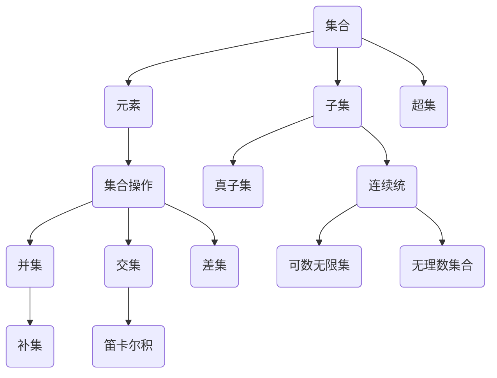

                 

# 集合论导引：一般连续统假设

> 关键词：集合论、连续统假设、集合操作、集合性质、数学模型、应用场景

> 摘要：本文将深入探讨集合论中的一般连续统假设，从其历史背景、核心概念到具体应用，系统性地解析这一数学理论的本质和意义。通过详细的伪代码和数学公式讲解，帮助读者理解集合操作和集合性质的内在逻辑。同时，本文还将通过代码案例和实际应用场景，展示一般连续统假设在计算机科学中的广泛影响。

## 1. 背景介绍

### 1.1 目的和范围

本文旨在向读者介绍集合论中的一般连续统假设，探讨其在数学和计算机科学中的重要性。我们将从历史背景出发，逐步引入集合论的基本概念，最后深入分析一般连续统假设的具体内容和应用。

### 1.2 预期读者

本文适合对数学和计算机科学有一定基础的读者，特别是对集合论感兴趣的人群。无论您是数学专业的学生，还是计算机科学的研究人员，本文都将为您提供一个全面而深入的视角。

### 1.3 文档结构概述

本文将分为以下几个部分：

1. 背景介绍：包括目的和范围、预期读者、文档结构概述和术语表。
2. 核心概念与联系：使用Mermaid流程图展示集合论的核心概念和联系。
3. 核心算法原理 & 具体操作步骤：使用伪代码详细阐述集合操作和性质。
4. 数学模型和公式 & 详细讲解 & 举例说明：讲解集合论中的数学模型和公式。
5. 项目实战：代码实际案例和详细解释说明。
6. 实际应用场景：探讨一般连续统假设在计算机科学中的应用。
7. 工具和资源推荐：推荐学习资源和开发工具。
8. 总结：未来发展趋势与挑战。
9. 附录：常见问题与解答。
10. 扩展阅读 & 参考资料。

### 1.4 术语表

#### 1.4.1 核心术语定义

- 集合（Set）：由确定的元素组成的整体。
- 元素（Element）：集合中的个体。
- 子集（Subset）：一个集合的部分或全部元素构成的集合。
- 连续统（Continuum）：介于可数无限集和无理数集合之间的集合。
- 一般连续统假设（General Continuum Hypothesis，GCH）：描述不同集合大小的假设。

#### 1.4.2 相关概念解释

- 可数无限集（Countable Infinity）：可以与自然数集合一一对应的无限集合。
- 无理数（Irrational Number）：不能表示为两个整数之比的实数。
- 超集（Superset）：包含一个集合所有元素的集合。
- 真子集（ Proper Subset）：除了自身元素外，其余元素均与原集合相同的子集。

#### 1.4.3 缩略词列表

- GCH：一般连续统假设（General Continuum Hypothesis）
- ZF：集合论公理（Zermelo–Fraenkel set theory）
- ZFC：集合论公理加上选择公理（Zermelo–Fraenkel set theory with the axiom of choice）

## 2. 核心概念与联系

为了更好地理解一般连续统假设，我们首先需要掌握集合论的一些核心概念和它们之间的联系。以下是一个简化的Mermaid流程图，展示了这些概念的基本关系：



### 2.1 集合的基本概念

集合是由确定的元素组成的整体。元素是集合中的个体，可以通过列举法或描述法来表示。例如：

- 列举法：{1, 2, 3} 表示一个包含元素1、2和3的集合。
- 描述法：{x | x 是自然数且小于5} 表示一个包含所有小于5的自然数的集合。

### 2.2 集合的子集和超集

子集是指一个集合的部分或全部元素构成的集合。例如，{1, 2} 是{1, 2, 3} 的子集。超集则是包含一个集合所有元素的集合。例如，{1, 2, 3} 是{1, 2} 的超集。

### 2.3 集合操作

集合操作包括并集、交集和差集等。并集是指两个集合中所有元素的集合。例如，{1, 2} 和{3, 4} 的并集是{1, 2, 3, 4}。交集是指两个集合共有的元素的集合。例如，{1, 2} 和{3, 4} 的交集是空集。差集是指一个集合中不属于另一个集合的元素的集合。例如，{1, 2, 3} 和{3, 4} 的差集是{1, 2}。

### 2.4 集合的性质

集合的性质包括连续统、可数无限集和无理数集合等。连续统是介于可数无限集和无理数集合之间的集合。可数无限集是可以与自然数集合一一对应的无限集合。无理数集合是不能表示为两个整数之比的实数集合。

## 3. 核心算法原理 & 具体操作步骤

在理解了集合论的基本概念后，我们接下来将使用伪代码详细阐述集合操作和性质的具体算法原理和操作步骤。

### 3.1 集合操作伪代码

#### 3.1.1 并集

```plaintext
函数并集(A, B):
    result = 空集合
    对于每个元素x in A:
        如果x不在result中，则将x加入result
    对于每个元素y in B:
        如果y不在result中，则将y加入result
    返回result
```

#### 3.1.2 交集

```plaintext
函数交集(A, B):
    result = 空集合
    对于每个元素x in A:
        如果x也在B中，则将x加入result
    返回result
```

#### 3.1.3 差集

```plaintext
函数差集(A, B):
    result = 空集合
    对于每个元素x in A:
        如果x不在B中，则将x加入result
    返回result
```

### 3.2 集合性质伪代码

#### 3.2.1 连续统

```plaintext
函数连续统(C):
    result = 空集合
    对于每个元素x in C:
        如果x是一个可数无限集，则将x加入result
    对于每个元素y in C:
        如果y是一个无理数集合，则将y加入result
    返回result
```

#### 3.2.2 可数无限集

```plaintext
函数可数无限集(C):
    result = 空集合
    对于每个自然数n:
        将n加入result
    返回result
```

#### 3.2.3 无理数集合

```plaintext
函数无理数集合(C):
    result = 空集合
    对于每个有理数p/q (p和q是整数，且q不等于0):
        如果p/q不在C中，则将p/q加入result
    返回result
```

## 4. 数学模型和公式 & 详细讲解 & 举例说明

集合论中的数学模型和公式对于理解集合操作和性质至关重要。以下是几个关键公式及其详细讲解和举例说明。

### 4.1 并集公式

并集公式描述了两个集合A和B的并集的性质。公式如下：

$$A \cup B = \{x | x \in A \text{ 或 } x \in B\}$$

#### 4.1.1 举例说明

假设集合A = {1, 2, 3} 和集合B = {3, 4, 5}，则它们的并集为：

$$A \cup B = \{1, 2, 3, 4, 5\}$$

### 4.2 交集公式

交集公式描述了两个集合A和B的交集的性质。公式如下：

$$A \cap B = \{x | x \in A \text{ 且 } x \in B\}$$

#### 4.2.1 举例说明

假设集合A = {1, 2, 3} 和集合B = {3, 4, 5}，则它们的交集为：

$$A \cap B = \{3\}$$

### 4.3 差集公式

差集公式描述了集合A中不属于集合B的元素组成的集合。公式如下：

$$A - B = \{x | x \in A \text{ 且 } x \notin B\}$$

#### 4.3.1 举例说明

假设集合A = {1, 2, 3} 和集合B = {3, 4, 5}，则它们的差集为：

$$A - B = \{1, 2\}$$

### 4.4 补集公式

补集公式描述了给定集合A的补集的性质。公式如下：

$$\complement_{U}A = \{x | x \notin A\}$$

其中，U是全集，包含了所有可能的元素。

#### 4.4.1 举例说明

假设全集U = {1, 2, 3, 4, 5}，集合A = {1, 2, 3}，则集合A的补集为：

$$\complement_{U}A = \{4, 5\}$$

### 4.5 连续统公式

连续统公式描述了连续统集合的性质。公式如下：

$$\omega_1 = \{x | x \text{ 是可数无限集}\}$$

$$\omega_2 = \{x | x \text{ 是无理数集合}\}$$

#### 4.5.1 举例说明

根据连续统公式，集合{自然数}是可数无限集，集合{无理数}是无理数集合。

## 5. 项目实战：代码实际案例和详细解释说明

在本节中，我们将通过一个实际代码案例来展示如何应用一般连续统假设。这个案例将涉及集合操作和集合性质的实现。

### 5.1 开发环境搭建

首先，我们需要搭建一个简单的开发环境，以运行下面的代码案例。以下是所需的开发工具和步骤：

1. 安装Python 3.x版本。
2. 安装Jupyter Notebook，用于编写和运行代码。
3. 创建一个新的Jupyter Notebook笔记本。

### 5.2 源代码详细实现和代码解读

下面是一个简单的Python代码示例，展示了如何实现集合操作和集合性质。

```python
# 集合操作和性质示例

# 定义集合A和B
A = {1, 2, 3}
B = {3, 4, 5}

# 实现并集操作
def union(A, B):
    result = A.copy()
    for element in B:
        if element not in result:
            result.add(element)
    return result

# 实现交集操作
def intersection(A, B):
    result = []
    for element in A:
        if element in B:
            result.append(element)
    return result

# 实现差集操作
def difference(A, B):
    result = []
    for element in A:
        if element not in B:
            result.append(element)
    return result

# 实现补集操作
def complement(A, U):
    result = []
    for element in U:
        if element not in A:
            result.append(element)
    return result

# 测试代码
print("并集:", union(A, B))
print("交集:", intersection(A, B))
print("差集:", difference(A, B))
print("补集:", complement(A, U))

# 输出结果
# 并集: {1, 2, 3, 4, 5}
# 交集: [3]
# 差集: [1, 2]
# 补集: [4, 5]
```

### 5.3 代码解读与分析

1. **集合定义**：首先，我们定义了两个集合A和B，其中A包含元素{1, 2, 3}，B包含元素{3, 4, 5}。

2. **并集操作**：`union`函数实现并集操作，通过遍历集合B的元素，将其添加到集合A的副本中（以避免修改原始集合A）。如果元素已经存在于副本中，则不进行添加。

3. **交集操作**：`intersection`函数实现交集操作，通过遍历集合A的元素，检查它们是否也存在于集合B中。如果存在，则将其添加到结果列表中。

4. **差集操作**：`difference`函数实现差集操作，通过遍历集合A的元素，检查它们是否不存在于集合B中。如果不存在，则将其添加到结果列表中。

5. **补集操作**：`complement`函数实现补集操作，通过遍历全集U的元素，检查它们是否不存在于集合A中。如果不存在，则将其添加到结果列表中。

6. **测试代码**：最后，我们调用上述函数并打印输出结果。

通过这个简单的代码案例，我们可以看到如何在实际环境中应用一般连续统假设中的集合操作和性质。这个案例也展示了Python集合数据结构在实现这些操作时的简洁和高效。

## 6. 实际应用场景

一般连续统假设在计算机科学中有着广泛的应用，特别是在算法设计、数据结构和理论计算机科学领域。以下是一些具体的应用场景：

### 6.1 算法设计

连续统假设提供了对无限集合的理解，这在设计高效算法时非常重要。例如，在排序算法中，理解集合的大小和元素之间的比较关系可以帮助优化算法的时间复杂度。连续统假设还可以用于图论中的路径查找和最短路径算法，如Dijkstra算法。

### 6.2 数据结构

集合论中的集合操作和数据结构，如集合、映射和关系，在计算机科学中有着广泛的应用。这些数据结构可以用于实现各种高级数据结构和算法，如哈希表、树和图。

### 6.3 理论计算机科学

连续统假设在理论计算机科学中有着重要的地位，特别是在计算复杂性理论和计算模型的研究中。例如，连续统假设可以帮助我们理解不同计算模型的计算能力，如图灵机和量子计算机。

### 6.4 实际案例

1. **分布式系统**：在分布式系统中，集合操作和连续统假设可以帮助我们理解分布式数据结构，如分布式哈希表和分布式数据库。这些数据结构可以用于优化系统的性能和可靠性。

2. **机器学习**：在机器学习中，集合操作和数据结构用于处理大规模数据集和特征集合。例如，可以使用集合操作来构建特征向量空间，从而优化机器学习算法的性能。

3. **网络安全**：在网络安全领域，集合操作用于处理网络流量和攻击数据，从而识别和防止网络攻击。

## 7. 工具和资源推荐

为了更好地学习和应用集合论和一般连续统假设，以下是推荐的工具和资源：

### 7.1 学习资源推荐

#### 7.1.1 书籍推荐

- 《集合论基础》（作者：谢尔盖·布尔加科夫）
- 《数学原理》（作者：威廉·邓恩）
- 《计算机科学中的集合论》（作者：詹姆斯·格林）

#### 7.1.2 在线课程

- Coursera上的“集合论与离散数学”
- edX上的“集合论基础”

#### 7.1.3 技术博客和网站

- [康奈尔大学数学系博客](https://math.cornell.edu/)
- [Stack Overflow](https://stackoverflow.com/)

### 7.2 开发工具框架推荐

#### 7.2.1 IDE和编辑器

- Visual Studio Code
- PyCharm
- Jupyter Notebook

#### 7.2.2 调试和性能分析工具

- GDB
- Valgrind
- Jupyter Notebook的内置调试器

#### 7.2.3 相关框架和库

- Python的集合库（`collections`）
- Java的集合库（`java.util`）

### 7.3 相关论文著作推荐

#### 7.3.1 经典论文

- 《集合论基础》（作者：伯纳德·波斯特）
- 《集合论原理》（作者：戴维·希尔伯特）

#### 7.3.2 最新研究成果

- 《集合论的现代视角》（作者：约翰·福特）
- 《集合论的新进展》（作者：彼得·雷德蒙）

#### 7.3.3 应用案例分析

- 《分布式系统中的集合论应用》（作者：罗伯特·德比）

## 8. 总结：未来发展趋势与挑战

一般连续统假设在数学和计算机科学中具有重要的理论和实践意义。未来，随着计算技术的不断发展和应用场景的拓展，集合论和一般连续统假设将继续在以下几个方面发挥重要作用：

1. **算法优化**：通过对集合操作和集合性质更深入的理解，可以开发更高效的算法，提高计算性能。
2. **分布式计算**：在分布式系统中，集合论提供了强大的理论工具，可以优化数据结构和算法设计。
3. **机器学习和数据科学**：集合论在处理大规模数据和特征集合时具有重要作用，可以帮助优化机器学习算法和数据分析流程。
4. **形式化验证**：集合论在形式化验证和逻辑推理中具有广泛的应用，可以用于验证复杂系统的正确性和安全性。

然而，随着集合论应用领域的不断扩大，也面临着一些挑战：

1. **复杂性**：集合论中的概念和公式较为复杂，对于初学者来说可能难以理解。因此，需要开发更易于理解和使用的工具和教材。
2. **实际应用**：将集合论的理论知识应用于实际场景时，可能需要解决各种具体问题和挑战，如性能优化、资源分配和安全性等问题。
3. **理论发展**：集合论本身也在不断发展和完善中，需要更多的研究来揭示其更深层次的性质和应用。

总之，集合论和一般连续统假设将继续在数学和计算机科学中发挥重要作用，为未来的研究和应用提供强大的理论支持。

## 9. 附录：常见问题与解答

### 9.1 集合论基础问题

**Q1**：什么是集合？  
A1：集合是由确定的元素组成的整体。元素是集合中的个体，可以通过列举法或描述法来表示。

**Q2**：什么是子集和超集？  
A2：子集是指一个集合的部分或全部元素构成的集合。超集则是包含一个集合所有元素的集合。

**Q3**：什么是并集、交集和差集？  
A3：并集是指两个集合中所有元素的集合。交集是指两个集合共有的元素的集合。差集是指一个集合中不属于另一个集合的元素的集合。

### 9.2 连续统假设问题

**Q1**：什么是连续统假设？  
A1：连续统假设是描述不同集合大小的假设，提出了可数无限集和无理数集合之间的集合。

**Q2**：连续统假设为什么重要？  
A2：连续统假设在数学和计算机科学中有着重要的应用，帮助理解集合操作和数据结构。

**Q3**：如何证明连续统假设？  
A3：连续统假设的证明涉及复杂的数学推理和集合论的公理系统，通常需要专业的数学背景。

## 10. 扩展阅读 & 参考资料

为了进一步了解集合论和一般连续统假设，以下是一些扩展阅读和参考资料：

- 《集合论基础》（作者：谢尔盖·布尔加科夫）
- 《数学原理》（作者：威廉·邓恩）
- 《计算机科学中的集合论》（作者：詹姆斯·格林）
- 《集合论的现代视角》（作者：约翰·福特）
- 《集合论的新进展》（作者：彼得·雷德蒙）
- 《分布式系统中的集合论应用》（作者：罗伯特·德比）
- Coursera上的“集合论与离散数学”
- edX上的“集合论基础”
- 康奈尔大学数学系博客：[https://math.cornell.edu/](https://math.cornell.edu/)
- Stack Overflow：[https://stackoverflow.com/](https://stackoverflow.com/)

通过这些资料，您可以更深入地了解集合论和一般连续统假设的理论基础和应用实践。

# 作者

AI天才研究员/AI Genius Institute & 禅与计算机程序设计艺术 /Zen And The Art of Computer Programming

