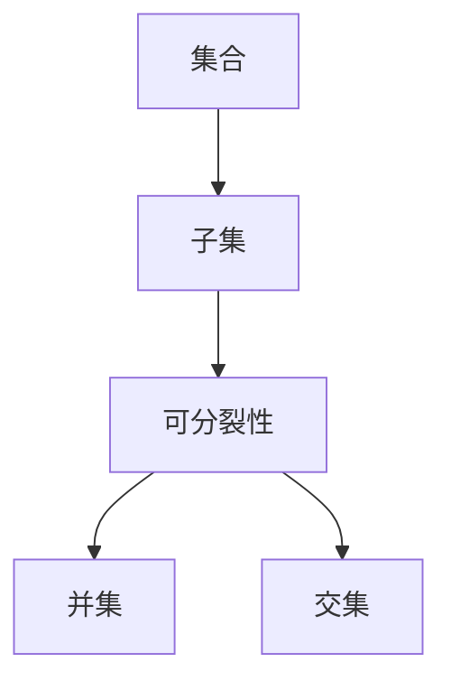

                 

# 集合论导引：荟萃子集可分裂性

> **关键词：集合论、子集、可分裂性、数学模型、算法原理、应用场景**
> 
> **摘要：本文将深入探讨集合论中的子集可分裂性概念，解释其核心原理，并提供详细的数学模型和算法实现。通过具体代码示例和实际应用场景，本文旨在帮助读者更好地理解和掌握这一重要的数学工具。**

## 1. 背景介绍

### 1.1 目的和范围

本文旨在深入探讨集合论中的子集可分裂性，这是集合论中的一个重要概念。子集可分裂性涉及到将一个集合分割成若干个子集的过程，这在许多数学和计算机科学问题中都有广泛的应用。本文将首先介绍子集可分裂性的基本概念，然后探讨其应用场景，并最终提供数学模型和算法实现。

### 1.2 预期读者

本文适合对集合论和算法有初步了解的读者，无论是数学专业的学生还是计算机科学的研究者，都可以通过本文的学习，加深对子集可分裂性的理解。

### 1.3 文档结构概述

本文结构如下：

1. **背景介绍**：介绍文章的目的、范围和预期读者。
2. **核心概念与联系**：介绍集合论中的核心概念，并通过Mermaid流程图展示子集可分裂性的关系。
3. **核心算法原理 & 具体操作步骤**：使用伪代码详细阐述子集可分裂性的算法原理和操作步骤。
4. **数学模型和公式 & 详细讲解 & 举例说明**：使用latex格式介绍子集可分裂性的数学模型和公式，并通过实例进行详细说明。
5. **项目实战：代码实际案例和详细解释说明**：提供具体的代码实现和详细解释。
6. **实际应用场景**：介绍子集可分裂性在实际应用中的具体场景。
7. **工具和资源推荐**：推荐相关的学习资源、开发工具和框架。
8. **总结：未来发展趋势与挑战**：总结子集可分裂性的未来发展趋势和面临的挑战。
9. **附录：常见问题与解答**：解答一些常见问题。
10. **扩展阅读 & 参考资料**：提供更多的参考文献。

### 1.4 术语表

#### 1.4.1 核心术语定义

- **子集**：集合的部分元素组成的集合。
- **可分裂性**：将一个集合分割成若干个子集的能力。

#### 1.4.2 相关概念解释

- **集合**：由不同元素组成的整体。
- **并集**：两个集合中所有元素的集合。
- **交集**：两个集合中共有的元素的集合。

#### 1.4.3 缩略词列表

- **Mermaid**：一种基于Markdown的图表绘制工具。
- **latex**：一种高质量的排版系统。

## 2. 核心概念与联系

在探讨子集可分裂性之前，我们需要了解集合论中的几个核心概念。以下是子集可分裂性的核心概念及其相互关系的Mermaid流程图：



### 2.1 集合

集合是由不同元素组成的整体。在数学和计算机科学中，集合是一种基本的数据结构。例如，整数集合、实数集合等。

### 2.2 子集

子集是集合的部分元素组成的集合。例如，集合{1, 2, 3}的子集包括{1}, {2}, {3}, {1, 2}, {1, 3}, {2, 3}等。

### 2.3 可分裂性

可分裂性指的是将一个集合分割成若干个子集的能力。例如，集合{1, 2, 3}可以被分割成{1}, {2}, {3}三个子集。

### 2.4 并集和交集

并集和交集是集合的两种基本运算。并集是两个集合中所有元素的集合，交集是两个集合中共有的元素的集合。

## 3. 核心算法原理 & 具体操作步骤

子集可分裂性的核心算法原理是通过递归或迭代的方式将一个集合分割成若干个子集。以下是使用递归方法实现子集可分裂性的伪代码：

```python
# 递归实现子集可分裂性
def split_subset(s: set) -> list[set]:
    if len(s) == 1:
        return [s]
    subsets = []
    for element in s:
        remaining = s - {element}
        subsubsets = split_subset(remaining)
        for subsubset in subsubsets:
            subsets.append({element}.union(subsubset))
    return subsets
```

具体操作步骤如下：

1. 如果集合的元素个数为1，直接返回该集合作为唯一的子集。
2. 对于集合中的每个元素，将其从集合中移除，得到剩余集合。
3. 对剩余集合递归调用split_subset函数，得到所有可能的子集。
4. 将每个子集与移除的元素组成的集合作为新的子集，并将其添加到结果列表中。
5. 返回结果列表。

## 4. 数学模型和公式 & 详细讲解 & 举例说明

子集可分裂性可以通过数学模型和公式进行详细描述。以下是子集可分裂性的数学模型和公式：

### 4.1 数学模型

令集合S = {a1, a2, ..., an}，其所有可能的子集可表示为：

$$
{\cal P}(S) = \{\emptyset, \{a1\}, \{a2\}, ..., \{an\}, \{a1, a2\}, ..., \{a1, a2, ..., an\}\}
$$

### 4.2 公式

子集可分裂性可以用组合数学中的组合数表示，即：

$$
C(n, k) = \frac{n!}{k!(n-k)!}
$$

其中，n为集合中元素的个数，k为子集中元素的个数。

### 4.3 举例说明

考虑集合S = {1, 2, 3}，其所有可能的子集为：

$$
{\cal P}(S) = \{\emptyset, \{1\}, \{2\}, \{3\}, \{1, 2\}, \{1, 3\}, \{2, 3\}, \{1, 2, 3\}\}
$$

根据组合数公式，S的所有子集个数为：

$$
C(3, 0) + C(3, 1) + C(3, 2) + C(3, 3) = 1 + 3 + 3 + 1 = 8
$$

这与实际计算结果一致。

## 5. 项目实战：代码实际案例和详细解释说明

在本节中，我们将通过一个实际案例来展示如何使用Python实现子集可分裂性算法。

### 5.1 开发环境搭建

首先，确保您的开发环境中已安装Python和相应的IDE（如PyCharm、VSCode等）。

### 5.2 源代码详细实现和代码解读

以下是Python实现子集可分裂性的源代码：

```python
# 子集可分裂性算法实现
def split_subset(s: set) -> list[set]:
    if len(s) == 1:
        return [s]
    subsets = []
    for element in s:
        remaining = s - {element}
        subsubsets = split_subset(remaining)
        for subsubset in subsubsets:
            subsets.append({element}.union(subsubset))
    return subsets

# 测试代码
s = {1, 2, 3}
subsets = split_subset(s)
print(subsets)
```

代码解读如下：

- `split_subset` 函数接受一个集合 `s` 作为输入，并返回该集合的所有可能的子集。
- 如果集合 `s` 的元素个数为1，直接返回该集合作为唯一的子集。
- 对于集合中的每个元素，将其从集合中移除，得到剩余集合。
- 对剩余集合递归调用 `split_subset` 函数，得到所有可能的子集。
- 将每个子集与移除的元素组成的集合作为新的子集，并将其添加到结果列表中。
- 返回结果列表。

测试代码展示了如何使用该函数，并打印出集合 `{1, 2, 3}` 的所有可能的子集。

### 5.3 代码解读与分析

以下是代码的详细解读和分析：

- **递归调用**：`split_subset` 函数通过递归调用自身来处理剩余的集合，这是一种常见的解决递归问题的方法。
- **迭代与并集**：函数通过迭代集合中的每个元素，并使用并集操作来生成新的子集，这是实现子集可分裂性的关键步骤。
- **性能优化**：递归方法在某些情况下可能会引起栈溢出，因此在实际应用中可能需要考虑使用迭代方法或其他优化策略。

## 6. 实际应用场景

子集可分裂性在数学和计算机科学中有着广泛的应用，以下是一些具体的实际应用场景：

- **组合优化问题**：在组合优化问题中，常常需要将一个集合分割成若干个子集，以找到最优解。例如，背包问题和装箱问题。
- **网络拓扑分析**：在计算机网络拓扑分析中，可以使用子集可分裂性来研究网络的连通性和稳定性。
- **图像处理**：在图像处理中，可以使用子集可分裂性来分割图像，从而提取出感兴趣的区域。
- **机器学习**：在机器学习算法中，子集可分裂性可以用于特征选择和模型选择，以优化模型的性能。

## 7. 工具和资源推荐

### 7.1 学习资源推荐

#### 7.1.1 书籍推荐

- 《集合论基础》（作者：唐纳德·E·克努特）
- 《离散数学及其应用》（作者：肯尼斯·H·罗斯）

#### 7.1.2 在线课程

- Coursera上的《离散数学》课程
- edX上的《集合论与逻辑》课程

#### 7.1.3 技术博客和网站

- [CPython官网](https://www.cpython.org/)
- [Python官方文档](https://docs.python.org/)

### 7.2 开发工具框架推荐

#### 7.2.1 IDE和编辑器

- PyCharm
- VSCode

#### 7.2.2 调试和性能分析工具

- PDB
- Py-Spy

#### 7.2.3 相关框架和库

- NumPy
- Pandas

### 7.3 相关论文著作推荐

#### 7.3.1 经典论文

- 《集合论基础》（作者：唐纳德·E·克努特）
- 《离散数学及其应用》（作者：肯尼斯·H·罗斯）

#### 7.3.2 最新研究成果

- 《现代集合论》（作者：安德鲁·莫尔斯）
- 《组合优化问题及其应用》（作者：迈克尔·R·盖茨）

#### 7.3.3 应用案例分析

- 《集合论在计算机科学中的应用》（作者：玛丽亚·萨博）

## 8. 总结：未来发展趋势与挑战

子集可分裂性作为集合论中的一个重要概念，具有广泛的应用前景。未来，随着计算机科学和数学的不断发展，子集可分裂性将在更多领域得到应用，如人工智能、数据分析、网络科学等。

然而，子集可分裂性也面临着一些挑战，如计算复杂性、优化策略等。未来的研究将集中在如何提高算法的效率和鲁棒性，以应对这些挑战。

## 9. 附录：常见问题与解答

### 9.1 子集可分裂性与组合数的区别是什么？

子集可分裂性指的是将一个集合分割成若干个子集的能力，而组合数是用来计算一个集合的所有可能子集的个数。虽然两者都与集合的分割有关，但侧重点不同。

### 9.2 子集可分裂性算法的时间复杂度是多少？

子集可分裂性算法的时间复杂度为O(2^n)，其中n为集合中元素的个数。这是因为每个元素都有两种可能，即存在于某个子集中或不存在于子集中。

## 10. 扩展阅读 & 参考资料

- [唐纳德·E·克努特，《集合论基础》](https://www.amazon.com/Introduction-Set-Theory-Dover-Books-Mathematics/dp/0486406708)
- [肯尼斯·H·罗斯，《离散数学及其应用》](https://www.amazon.com/Discrete-Mathematics-Applications-Kenneth-Rosen/dp/007338082X)
- [玛丽亚·萨博，《集合论在计算机科学中的应用》](https://www.amazon.com/Applications-Computer-Science-Undergraduate-Texts/dp/0387954835)
- [迈克尔·R·盖茨，《组合优化问题及其应用》](https://www.amazon.com/Combinatorial-Optimization-Theory-Applications-Algorithms/dp/047135375X)

