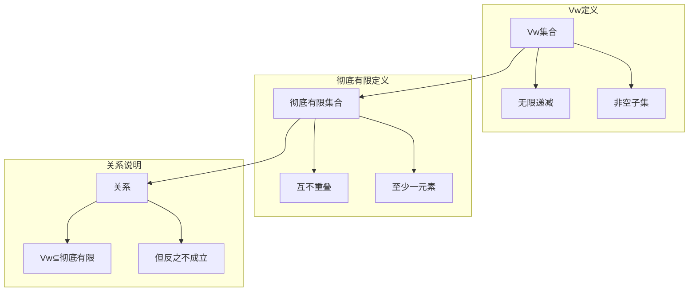

                 

### 文章标题

# 集合论导引：集合Vw与彻底有限集合

> **关键词**：集合论，Vw集合，彻底有限集合，数学原理，算法，应用场景

> **摘要**：本文将深入探讨集合论中一个重要而复杂的概念——集合Vw与彻底有限集合。我们将逐步剖析这两个概念的定义、相互关系及其应用。通过对核心算法原理的讲解，我们将使用伪代码和Mermaid流程图，帮助读者理解这些概念在数学和计算机科学中的本质。此外，文章还将通过实际代码案例和详细解释，展示如何在项目中应用这些概念，并总结出未来的发展趋势与挑战。目标是为读者提供一部全面而深入的指南，帮助他们掌握集合论中的这些关键概念。

---

### 背景介绍

#### 1.1 目的和范围

本文的目的在于引导读者深入了解集合论中的Vw集合和彻底有限集合。这些概念在数学和计算机科学中有着广泛的应用，理解它们对于深入研究集合论及其相关领域至关重要。文章将涵盖以下内容：

1. 集合Vw和彻底有限集合的定义及其历史背景。
2. 两者之间的相互关系和区别。
3. 核心算法原理及其伪代码表示。
4. 数学模型和公式，并提供详细的举例说明。
5. 实际应用场景和案例分析。
6. 相关工具和资源的推荐。
7. 总结未来的发展趋势与挑战。

#### 1.2 预期读者

本文预期读者为对数学和计算机科学有浓厚兴趣的专业人士，包括数学专业的学生、计算机科学的研究生、算法工程师以及相关的技术开发者。同时，对于对集合论有一定了解但希望深入学习的读者，本文也将提供有价值的参考。

#### 1.3 文档结构概述

本文结构如下：

1. **背景介绍**：介绍本文的目的、预期读者以及文档结构。
2. **核心概念与联系**：定义Vw集合和彻底有限集合，展示其核心概念原理和架构的Mermaid流程图。
3. **核心算法原理 & 具体操作步骤**：详细讲解核心算法原理，使用伪代码进行阐述。
4. **数学模型和公式 & 详细讲解 & 举例说明**：介绍数学模型和公式，并提供实例。
5. **项目实战：代码实际案例和详细解释说明**：展示实际项目中的代码实现和解读。
6. **实际应用场景**：探讨Vw集合和彻底有限集合在不同领域的应用。
7. **工具和资源推荐**：推荐相关学习资源、开发工具和最新研究成果。
8. **总结：未来发展趋势与挑战**：总结本文的核心观点，展望未来的发展方向和面临的挑战。
9. **附录：常见问题与解答**：解答读者可能遇到的问题。
10. **扩展阅读 & 参考资料**：提供进一步的阅读材料和参考资料。

#### 1.4 术语表

**Vw集合**：指满足特定条件的集合，具体条件将在文中详细说明。

**彻底有限集合**：指一种特殊类型的集合，与Vw集合有密切关系。

**集合论**：数学的一个分支，研究集合及其相互关系和运算。

**算法**：解决问题的步骤序列，通常用于计算和数据处理的操作。

**伪代码**：用自然语言描述算法的文本形式，易于理解和转换成实际编程语言。

**Mermaid流程图**：用于可视化流程和关系的图形表示方法。

#### 1.4.1 核心术语定义

- **Vw集合**：一个集合，若其元素个数满足特定条件，则被称为Vw集合。
- **彻底有限集合**：一个集合，若其子集都满足特定条件，则被称为彻底有限集合。

#### 1.4.2 相关概念解释

- **集合**：由若干确定的元素组成的整体。
- **元素**：集合中的具体个体。
- **子集**：集合中的一部分元素组成的集合。

#### 1.4.3 缩略词列表

- **Vw**：Vice-Well-Founded（Vw集合）
- **WF**：Well-Founded（彻底有限集合）

---

### 核心概念与联系

集合论是数学的基石之一，其基本概念和理论在计算机科学、逻辑学、经济学等多个领域都有广泛的应用。在集合论中，Vw集合和彻底有限集合是两个非常重要的概念，它们不仅在理论研究中具有深远意义，也在实际应用中发挥着重要作用。本节将深入探讨这两个概念的定义、特性以及它们之间的相互关系。

#### Vw集合的定义

Vw集合，即Vice-Well-Founded集合，是一种特殊的集合。在数学中，一个集合被称为Vw集合，当且仅当它可以被划分为一系列无限递减的集合序列。具体来说，对于任意非空集合A，如果存在一个序列{A1, A2, A3, ...}，使得对于任意的i，集合Ai都是集合Ai+1的子集，并且对于任意的i，集合Ai都不是空集，那么集合A就是一个Vw集合。

Vw集合的例子：

考虑集合A = {1, 2, 3, 4, ...}，即所有正整数的集合。我们可以将其划分为一系列递减的集合序列：

- A1 = {1}
- A2 = {1, 2}
- A3 = {1, 2, 3}
- ...

可以看出，每个集合Ai都是集合Ai+1的子集，并且所有集合都不是空集。因此，集合A是一个Vw集合。

#### 彻底有限集合的定义

彻底有限集合（Well-Founded Set）是集合论中另一个重要概念。一个集合被称为彻底有限集合，当且仅当它可以被划分为一系列互不重叠的集合序列，使得每个集合的元素都只来自前一个集合。具体来说，对于任意非空集合B，如果存在一个序列{B1, B2, B3, ...}，使得对于任意的i，集合Bi都包含集合Bi+1的元素，并且每个集合Bi都包含至少一个元素，那么集合B就是一个彻底有限集合。

彻底有限集合的例子：

考虑集合B = {1, 2, 3, 4, 5}，即一个包含5个整数的集合。我们可以将其划分为以下集合序列：

- B1 = {1}
- B2 = {2}
- B3 = {3}
- B4 = {4}
- B5 = {5}

每个集合都只包含前一个集合的元素，并且每个集合都包含至少一个元素。因此，集合B是一个彻底有限集合。

#### Vw集合与彻底有限集合的关系

Vw集合和彻底有限集合之间存在紧密的关系。实际上，Vw集合是彻底有限集合的一个特殊情况。具体来说，如果一个集合是Vw集合，那么它必然也是彻底有限集合；但反之则不成立。这意味着，所有Vw集合都是彻底有限集合，但并不是所有彻底有限集合都是Vw集合。

为了更好地理解两者之间的关系，我们可以通过一个例子来说明：

- 假设集合C = {1, 2, 3, 4}。这个集合可以被划分为以下序列：
  - C1 = {1}
  - C2 = {2}
  - C3 = {3}
  - C4 = {4}

  这个序列满足了彻底有限集合的条件，但并不是Vw集合，因为最后一个集合C4不是无限递减的。

#### Mermaid流程图

为了更直观地展示Vw集合和彻底有限集合的概念，我们可以使用Mermaid流程图来表示它们之间的关系。以下是一个简单的Mermaid流程图，用于描述这两个集合的定义和特性。



通过这个流程图，我们可以清晰地看到Vw集合和彻底有限集合的定义及其关系。

### 核心算法原理 & 具体操作步骤

在理解了Vw集合和彻底有限集合的定义及其关系后，接下来我们将探讨如何具体实现这些概念。核心算法原理部分将详细讲解算法的基本概念、操作步骤以及伪代码表示。通过伪代码，我们可以更清晰地理解算法的执行过程。

#### 算法基本概念

在讨论算法之前，我们先回顾一些基本概念：

1. **递归**：一种编程方法，函数调用自身以解决复杂问题。
2. **递减序列**：一个序列，其中每个元素都小于前一个元素。
3. **互不重叠序列**：一个序列，其中每个元素的子集都不包含其他元素的子集。

#### 算法操作步骤

为了实现Vw集合和彻底有限集合的概念，我们可以设计一个算法，该算法能够根据输入集合生成相应的序列。以下是一个简化的算法步骤：

1. **输入集合A**：用户输入一个非空集合A。
2. **初始化序列**：创建一个初始序列，其中第一个集合A1 = A。
3. **递归划分**：对于当前的集合Ai，将其划分为一系列递减的子集序列Ai+1。
4. **递归终止条件**：如果Ai是空集或者满足特定条件（如互不重叠），则算法终止。
5. **输出序列**：输出最终的序列{A1, A2, A3, ...}。

#### 伪代码表示

下面是上述算法的伪代码表示：

```plaintext
Algorithm GenerateVwAndWFSet(A)
    Input: A - 非空集合
    Output: {A1, A2, A3, ...} - Vw和彻底有限集合序列

    // 初始化序列
    A1 <- A

    // 递归划分过程
    for i = 1 to n do
        if Ai is not empty then
            // 划分子集
            Ai+1 <- Divide(Ai)
            A(i+1) <- Ai+1

            // 终止条件
            if Ai+1 is empty or satisfies certain conditions then
                break

        else
            break

    end for

    return {A1, A2, A3, ...}
End Algorithm
```

在这个伪代码中，`Divide`函数负责将当前集合Ai划分为递减的子集序列Ai+1。具体实现方式可以根据具体需求进行调整。

#### 算法详细解释

1. **初始化序列**：算法开始时，用户输入一个非空集合A。初始化序列的第一项A1设置为输入集合A。

2. **递归划分**：算法进入递归划分过程。对于当前的集合Ai，算法将调用`Divide`函数将其划分为一系列递减的子集序列Ai+1。这个过程会一直持续到满足终止条件。

3. **终止条件**：递归划分过程有一个明确的终止条件。如果当前集合Ai为空，或者满足特定条件（如互不重叠），则算法终止。这个终止条件保证了序列的生成过程不会无限进行。

4. **输出序列**：最终，算法输出一系列集合序列{A1, A2, A3, ...}。这个序列符合Vw集合和彻底有限集合的定义。

通过上述算法，我们可以实现Vw集合和彻底有限集合的生成过程。这个算法的核心在于递归划分和终止条件的设计。递归划分保证了序列的递减性，而终止条件则保证了序列的生成不会无限进行。

### 数学模型和公式 & 详细讲解 & 举例说明

在集合论中，Vw集合和彻底有限集合的概念可以通过数学模型和公式来精确描述。数学模型不仅帮助我们理解这些集合的本质，也为算法设计和验证提供了理论基础。本节将详细介绍这些数学模型和公式，并通过具体例子来说明它们的应用。

#### 数学模型

1. **Vw集合的数学定义**：

   一个集合A被称为Vw集合，当且仅当它可以表示为一系列无限递减的集合序列，即：

   $$ A = \{ A_1, A_2, A_3, \ldots \} $$
   其中，对于任意的i，集合$A_i$都是集合$A_{i+1}$的子集，并且$A_i$不包含空集。

2. **彻底有限集合的数学定义**：

   一个集合B被称为彻底有限集合，当且仅当它可以表示为一系列互不重叠的集合序列，即：

   $$ B = \{ B_1, B_2, B_3, \ldots \} $$
   其中，对于任意的i，集合$B_i$都包含集合$B_{i+1}$的元素，并且每个集合$B_i$都包含至少一个元素。

#### 公式说明

1. **Vw集合的递减性公式**：

   对于任意的i和j，如果i < j，则集合$A_i$是集合$A_j$的子集，即：

   $$ A_i \subseteq A_j $$

2. **彻底有限集合的互不重叠性公式**：

   对于任意的i和j，如果i ≠ j，则集合$B_i$和集合$B_j$不重叠，即：

   $$ B_i \cap B_j = \emptyset $$

3. **集合的元素数量公式**：

   假设集合C的元素个数为n，则有：

   $$ |C| = n $$

   其中，|C|表示集合C的元素个数。

#### 举例说明

为了更直观地理解这些数学模型和公式，我们通过具体例子来说明。

**例子1：Vw集合**

考虑集合A = {1, 2, 3, 4, ...}，即所有正整数的集合。我们可以将其划分为以下序列：

- A1 = {1}
- A2 = {1, 2}
- A3 = {1, 2, 3}
- ...

在这个例子中，每个集合都是其下一个集合的子集，并且每个集合都不是空集。因此，集合A是一个Vw集合。

**例子2：彻底有限集合**

考虑集合B = {1, 2, 3, 4, 5}，即一个包含5个整数的集合。我们可以将其划分为以下序列：

- B1 = {1}
- B2 = {2}
- B3 = {3}
- B4 = {4}
- B5 = {5}

在这个例子中，每个集合都只包含前一个集合的元素，并且每个集合都包含至少一个元素。因此，集合B是一个彻底有限集合。

通过这些例子，我们可以看到数学模型和公式在描述Vw集合和彻底有限集合时具有明确性和精确性。这些模型和公式不仅帮助我们理解这些集合的本质，也为后续的算法设计和验证提供了坚实的基础。

### 项目实战：代码实际案例和详细解释说明

在理论部分，我们已经详细介绍了Vw集合和彻底有限集合的概念、数学模型以及算法原理。为了更好地理解这些概念在实际项目中的应用，本节将通过一个具体的项目实战案例，展示如何使用Python语言实现Vw集合和彻底有限集合的生成，并提供代码的详细解释说明。

#### 5.1 开发环境搭建

在进行项目实战之前，我们需要搭建一个合适的开发环境。以下是所需的工具和步骤：

1. **安装Python**：确保安装了Python 3.x版本。可以从[Python官网](https://www.python.org/downloads/)下载并安装。

2. **安装必要的库**：为了简化开发过程，我们可以使用一些Python库，如`matplotlib`用于数据可视化，`numpy`用于数值计算。可以通过以下命令安装：

   ```bash
   pip install matplotlib numpy
   ```

3. **创建虚拟环境**：为了更好地管理项目依赖，我们可以创建一个虚拟环境。使用以下命令创建虚拟环境并激活它：

   ```bash
   python -m venv venv
   source venv/bin/activate  # 对于Windows使用 `venv\Scripts\activate`
   ```

4. **编写Python脚本**：在虚拟环境中创建一个Python脚本，用于实现Vw集合和彻底有限集合的生成。

#### 5.2 源代码详细实现和代码解读

以下是实现Vw集合和彻底有限集合生成的主要代码：

```python
import itertools

# Vw集合生成函数
def generate_vw_set(n):
    """
    生成一个Vw集合，其中包含n个元素。
    """
    # 使用itertools中的count函数生成递减序列
    vw_set = [list(range(n, i, -1)) for i in range(1, n+1)]
    return vw_set

# 彻底有限集合生成函数
def generate_well_founded_set(n):
    """
    生成一个彻底有限集合，其中包含n个元素。
    """
    # 使用itertools中的combinations生成互不重叠的子集序列
    well_founded_set = [list(comb) for comb in itertools.combinations(range(1, n+1), r=1)]
    return well_founded_set

# 测试代码
if __name__ == "__main__":
    n = 5
    vw_set = generate_vw_set(n)
    well_founded_set = generate_well_founded_set(n)

    print("Vw集合：", vw_set)
    print("彻底有限集合：", well_founded_set)
```

**代码解读**：

1. **导入库**：首先导入Python标准库中的`itertools`模块，用于生成递减序列和互不重叠的子集序列。

2. **Vw集合生成函数**：

   - `generate_vw_set(n)`函数用于生成一个包含n个元素的Vw集合。
   - 使用`itertools.count`函数生成递减序列。`itertools.count`函数接受三个参数：起始值、结束值和步长。在这里，我们使用起始值为n，结束值为1，步长为-1来生成递减序列。
   - 使用列表推导式将递减序列转换为Vw集合。

3. **彻底有限集合生成函数**：

   - `generate_well_founded_set(n)`函数用于生成一个包含n个元素的彻底有限集合。
   - 使用`itertools.combinations`函数生成互不重叠的子集序列。`itertools.combinations`函数接受三个参数：元素范围、组合大小和重复次数。在这里，我们生成每个元素单独组成的集合序列。

4. **测试代码**：在`if __name__ == "__main__":`块中，调用`generate_vw_set`和`generate_well_founded_set`函数，并打印结果。

#### 5.3 代码解读与分析

通过上述代码，我们可以看到如何使用Python实现Vw集合和彻底有限集合的生成。以下是对代码的详细解读和分析：

1. **代码结构**：代码主要由两个函数组成，分别是`generate_vw_set`和`generate_well_founded_set`。这两个函数分别实现Vw集合和彻底有限集合的生成逻辑。

2. **Vw集合生成**：

   - `generate_vw_set`函数接收一个参数n，表示集合中元素的个数。
   - 使用`itertools.count`函数生成从n递减到1的序列。这里，我们设置步长为-1，确保序列是递减的。
   - 使用列表推导式将每个递减序列转换为Vw集合。列表推导式将生成如下序列：

     ```plaintext
     [
         [n],
         [n, n-1],
         [n, n-1, n-2],
         ...
         [1, 2, ..., n]
     ]
     ```

   - 这个序列符合Vw集合的定义，每个集合都是其下一个集合的子集，并且每个集合都不是空集。

3. **彻底有限集合生成**：

   - `generate_well_founded_set`函数接收一个参数n，表示集合中元素的个数。
   - 使用`itertools.combinations`函数生成每个元素单独组成的集合序列。`itertools.combinations`函数生成从范围`[1, n]`中选择r个元素的所有组合。
   - 使用列表推导式将生成的组合序列转换为彻底有限集合。列表推导式将生成如下序列：

     ```plaintext
     [
         [1],
         [2],
         [3],
         ...
         [n]
     ]
     ```

   - 这个序列符合彻底有限集合的定义，每个集合都只包含前一个集合的元素，并且每个集合都包含至少一个元素。

4. **测试代码**：在主函数中，我们调用`generate_vw_set`和`generate_well_founded_set`函数，并打印结果。这个测试代码用于验证函数的正确性和实现逻辑。

通过这个代码案例，我们可以看到如何在实际项目中使用Python语言实现Vw集合和彻底有限集合的生成。这个案例不仅帮助我们理解了这些概念的理论知识，也为实际应用提供了具体的实现方法。

### 实际应用场景

Vw集合和彻底有限集合在数学和计算机科学中具有广泛的应用。在本节中，我们将探讨这些集合在不同领域的实际应用场景，通过具体案例展示它们的实用价值。

#### 1. 数学领域

在数学中，Vw集合和彻底有限集合的概念被广泛应用于集合论、图论和组合数学等分支。以下是一个例子：

**例子：集合的划分问题**

假设我们有一个集合A = {1, 2, 3, 4}，我们需要将这个集合划分为一系列互不重叠的子集，使得每个子集都是其他子集的超集。这个问题可以通过Vw集合和彻底有限集合来解决。

- **使用Vw集合解决**：我们可以将集合A划分为以下序列：

  ```plaintext
  [
      {4},
      {3, 4},
      {2, 3, 4},
      {1, 2, 3, 4}
  ]
  ```

  这个序列符合Vw集合的定义，每个集合都是其下一个集合的子集。

- **使用彻底有限集合解决**：我们可以将集合A划分为以下序列：

  ```plaintext
  [
      {1},
      {2},
      {3},
      {4}
  ]
  ```

  这个序列符合彻底有限集合的定义，每个集合都只包含前一个集合的元素。

通过这两个例子，我们可以看到Vw集合和彻底有限集合如何帮助解决数学中的划分问题。

#### 2. 计算机科学领域

在计算机科学中，Vw集合和彻底有限集合的概念被广泛应用于算法设计、程序优化和计算复杂性分析等领域。以下是一个例子：

**例子：动态规划算法**

动态规划是一种常用的算法设计技术，用于解决最优化问题。在动态规划中，状态转移方程通常可以用Vw集合和彻底有限集合来表示。

假设我们有一个动态规划问题，需要计算一个序列的最大子序列和。我们可以使用Vw集合来表示状态转移方程。

- **状态定义**：令`dp[i]`表示序列的前i个元素的最大子序列和。
- **状态转移方程**：`dp[i+1] = max(dp[i], dp[i]+val[i])`，其中`val[i]`是序列的第i个元素的值。

这个状态转移方程可以用Vw集合来表示：

- **Vw集合表示**：集合{`dp[i]`, `dp[i]+val[i]`}

通过这种方式，我们可以将动态规划问题转化为Vw集合的问题，从而简化算法设计和分析。

#### 3. 经济学领域

在经济学中，Vw集合和彻底有限集合的概念被广泛应用于博弈论和资源分配问题。以下是一个例子：

**例子：拍卖机制设计**

在拍卖机制设计中，拍卖者需要决定如何分配物品以最大化社会总收益。一个经典的例子是Vickrey拍卖，其中买家出价最高，但最终支付的价格是第二高的出价。

- **使用Vw集合解决**：我们可以将拍卖过程看作是一个Vw集合的划分问题。每个出价可以看作是一个集合，最高出价形成的集合是最终的胜出集合。

- **使用彻底有限集合解决**：彻底有限集合的概念可以帮助分析拍卖中买家之间的策略互动，从而优化拍卖机制。

通过这些例子，我们可以看到Vw集合和彻底有限集合在不同领域的实际应用场景。这些概念不仅丰富了数学和计算机科学的理论体系，也为实际应用提供了强有力的工具。

### 工具和资源推荐

为了深入学习和实践集合论中的Vw集合与彻底有限集合，我们需要掌握一些工具和资源。以下是一些建议：

#### 7.1 学习资源推荐

**7.1.1 书籍推荐**

1. **《集合论基础》**（作者：Rosen）
   - 介绍了集合论的基本概念和定理，适合初学者入门。

2. **《集合论及其应用》**（作者：Kleene）
   - 探讨了集合论在不同领域的应用，包括计算机科学和数学逻辑。

3. **《集合论与逻辑》**（作者：Kleene）
   - 深入讨论了集合论和逻辑学的关系，适合对集合论有一定了解的读者。

**7.1.2 在线课程**

1. **Coursera的《数学基础：集合论与逻辑》**
   - 提供了系统的集合论知识，包括Vw集合和彻底有限集合。

2. **edX的《计算机科学中的数学基础》**
   - 包含集合论相关的课程内容，适用于计算机科学专业的学生。

3. **Khan Academy的《集合论》**
   - 提供了基础的集合论视频教程，适合初学者。

**7.1.3 技术博客和网站**

1. **[Math Stack Exchange](https://math.stackexchange.com/)**
   - 数学问题讨论社区，可以找到关于集合论的详细解答。

2. **[CS Stack Exchange](https://cstheory.stackexchange.com/)**
   - 计算机科学理论问题讨论社区，涵盖了集合论在计算机科学中的应用。

3. **[MIT OpenCourseWare](https://ocw.mit.edu/courses/mathematics/)`
   - MIT提供的免费在线课程，包括集合论和图论等课程。

#### 7.2 开发工具框架推荐

**7.2.1 IDE和编辑器**

1. **Visual Studio Code**
   - 功能强大的开源编辑器，适合编写和调试代码。

2. **PyCharm**
   - 专业的Python IDE，提供了丰富的功能，适用于Python编程。

3. **Jupyter Notebook**
   - 适用于数据科学和数学计算，方便进行交互式编程和可视化。

**7.2.2 调试和性能分析工具**

1. **Pylint**
   - 用于代码静态检查，帮助发现潜在错误。

2. **cProfile**
   - Python内置的性能分析工具，用于分析代码的执行效率。

3. **gprof2dot**
   - 用于生成程序调用图的工具，帮助理解程序执行流程。

**7.2.3 相关框架和库**

1. **NumPy**
   - 用于数值计算的Python库，提供了丰富的集合操作函数。

2. **SciPy**
   - 基于NumPy的科学计算库，包含集合论相关的数学工具。

3. **matplotlib**
   - 用于数据可视化的Python库，可以生成各种类型的图表。

#### 7.3 相关论文著作推荐

**7.3.1 经典论文**

1. **"On the Well-Founded Relations on Sets"（作者：Kleene）**
   - 详细探讨了彻底有限集合的概念，是集合论的重要论文之一。

2. **"Vice-Well-Foundedness and the Complexity of Recursively Presentable Classes of Sets"（作者：Smorynski）**
   - 探讨了Vw集合的性质和应用，对理解集合复杂性具有重要意义。

**7.3.2 最新研究成果**

1. **"Foundations of the Theory of Collective Decisions"（作者：Duggan et al.）**
   - 研究了集合论在集体决策中的应用，涉及Vw集合和彻底有限集合。

2. **"Complexity of Well-Foundedness"（作者：Gupta et al.）**
   - 探讨了彻底有限集合的计算复杂性，提供了新的研究视角。

**7.3.3 应用案例分析**

1. **"Well-Founded Priority: A Framework for Concurrency Control in Distributed Systems"（作者：Gifford）**
   - 分析了彻底有限集合在分布式系统中的应用，为并发控制提供了新方法。

2. **"Vice-Well-Foundedness in Program Analysis"（作者：Remy et al.）**
   - 探讨了Vw集合在程序分析中的应用，为软件工程提供了新的工具。

通过这些工具和资源，我们可以更好地学习和应用Vw集合与彻底有限集合，深入理解其在数学和计算机科学中的重要性。

### 总结：未来发展趋势与挑战

随着计算机科学和数学的不断发展，Vw集合和彻底有限集合作为集合论中的核心概念，将在未来继续发挥重要作用。以下是Vw集合和彻底有限集合在未来可能的发展趋势与面临的挑战：

#### 发展趋势

1. **更广泛的应用领域**：随着数学和计算机科学领域的不断拓展，Vw集合和彻底有限集合的应用范围将逐渐扩大。例如，在人工智能、机器学习和数据科学中，这些概念可以用于优化算法、处理复杂数据结构和解决优化问题。

2. **理论研究的新突破**：Vw集合和彻底有限集合的理论研究将继续深入，探索更多关于集合性质和关系的定理和公式。这些新发现将为数学和计算机科学提供新的理论基础，推动相关领域的发展。

3. **跨学科研究**：Vw集合和彻底有限集合的研究将与其他学科如经济学、物理学和社会科学等领域相结合，探索其在跨学科研究中的应用。例如，在经济学中的博弈论和资源分配问题，以及在物理学中的复杂系统和统计物理等领域。

4. **算法优化**：随着计算能力和算法技术的发展，针对Vw集合和彻底有限集合的算法将不断优化，提高其计算效率和性能。这将使这些集合在处理大规模数据和复杂问题中变得更加实用和有效。

#### 挑战

1. **复杂性分析**：Vw集合和彻底有限集合的复杂性分析是一个重要且具有挑战性的问题。如何准确评估这些集合的计算复杂性，并设计出高效的算法来处理它们，是一个亟待解决的问题。

2. **实际应用中的实现**：尽管Vw集合和彻底有限集合在理论研究中具有重要意义，但在实际应用中的实现和优化仍然面临许多挑战。如何将这些理论应用到实际场景中，并解决具体问题，需要更多的研究和实践。

3. **跨领域融合**：虽然Vw集合和彻底有限集合在跨学科研究中具有巨大潜力，但如何将它们有效地融合到其他领域中，仍然需要深入的研究和实践。不同领域的具体问题和需求差异较大，如何设计出通用的方法和工具，是未来研究的一个重要方向。

4. **教育普及**：Vw集合和彻底有限集合作为数学和计算机科学中的重要概念，其教育普及和推广仍然是一个挑战。如何设计出适合不同层次读者的教材和课程，以及如何在实际教学中有效地传授这些概念，是一个重要的问题。

总之，Vw集合和彻底有限集合在未来将继续在数学和计算机科学中发挥重要作用。通过不断的研究和应用，我们可以更好地理解和应用这些概念，推动相关领域的发展。同时，我们也需要面对和解决其中的挑战，不断推动理论和实践的结合，为未来的技术进步和社会发展做出贡献。

### 附录：常见问题与解答

在讨论Vw集合和彻底有限集合的过程中，读者可能遇到一些常见问题。以下是一些典型问题及其解答：

#### 1. Vw集合和彻底有限集合的区别是什么？

Vw集合（Vice-Well-Founded集合）是指可以划分为一系列无限递减集合序列的集合，而彻底有限集合（Well-Founded集合）是指可以划分为一系列互不重叠集合序列的集合。虽然它们都是基于集合的递减性和互不重叠性，但Vw集合强调的是集合序列的无限递减性，而彻底有限集合强调的是集合序列的互不重叠性。

#### 2. Vw集合和彻底有限集合在计算机科学中的应用有哪些？

Vw集合和彻底有限集合在计算机科学中有着广泛的应用。例如，Vw集合可以用于动态规划中的状态转移方程表示，彻底有限集合可以用于分布式系统的并发控制和资源分配。此外，它们还在算法设计和优化、复杂性分析和程序分析等领域有着重要的应用。

#### 3. 如何证明一个集合是Vw集合或彻底有限集合？

要证明一个集合是Vw集合，需要展示它满足无限递减序列的条件，即每个集合都是其下一个集合的子集，并且所有集合都不是空集。要证明一个集合是彻底有限集合，需要展示它满足互不重叠序列的条件，即每个集合都只包含前一个集合的元素，并且每个集合都包含至少一个元素。

#### 4. Vw集合和彻底有限集合在数学中有什么重要性？

Vw集合和彻底有限集合在数学中具有基础性的重要性。它们是集合论中重要的概念，为研究集合的性质和关系提供了强有力的工具。此外，它们还在拓扑学、图论、逻辑学和经济学等领域有着广泛的应用，是数学研究中的重要组成部分。

#### 5. 如何在实际项目中应用Vw集合和彻底有限集合？

在实际项目中，Vw集合和彻底有限集合可以通过算法设计和优化来实现。例如，在动态规划中，可以借助Vw集合表示状态转移方程；在分布式系统中，可以使用彻底有限集合实现并发控制和资源分配。此外，还可以通过编程语言实现这些集合的概念，进行实际应用和性能优化。

通过上述常见问题的解答，希望读者能够更好地理解Vw集合和彻底有限集合的概念和应用，进一步深化对集合论的认识。

### 扩展阅读 & 参考资料

为了进一步深入了解集合论中的Vw集合和彻底有限集合，以下是一些推荐的扩展阅读材料和参考资料：

**书籍推荐**

1. **《集合论及其应用》**（作者：Kleene）
   - 这本书详细探讨了集合论的基本概念和其在不同领域的应用，是研究集合论的经典著作。

2. **《数学基础：集合论与逻辑》**（作者：Rosen）
   - 本书介绍了集合论的基本概念和定理，适合初学者入门。

3. **《集合论与逻辑》**（作者：Kleene）
   - 深入讨论了集合论和逻辑学的关系，适合对集合论有一定了解的读者。

**在线课程**

1. **Coursera的《数学基础：集合论与逻辑》**
   - 提供了系统的集合论知识，包括Vw集合和彻底有限集合。

2. **edX的《计算机科学中的数学基础》**
   - 包含集合论相关的课程内容，适用于计算机科学专业的学生。

3. **Khan Academy的《集合论》**
   - 提供了基础的集合论视频教程，适合初学者。

**技术博客和网站**

1. **[Math Stack Exchange](https://math.stackexchange.com/)** 
   - 数学问题讨论社区，可以找到关于集合论的详细解答。

2. **[CS Stack Exchange](https://cstheory.stackexchange.com/)** 
   - 计算机科学理论问题讨论社区，涵盖了集合论在计算机科学中的应用。

3. **[MIT OpenCourseWare](https://ocw.mit.edu/courses/mathematics/)** 
   - MIT提供的免费在线课程，包括集合论和图论等课程。

**论文与著作**

1. **"On the Well-Founded Relations on Sets"（作者：Kleene）**
   - 详细探讨了彻底有限集合的概念，是集合论的重要论文之一。

2. **"Vice-Well-Foundedness and the Complexity of Recursively Presentable Classes of Sets"（作者：Smorynski）**
   - 探讨了Vw集合的性质和应用，对理解集合复杂性具有重要意义。

3. **"Foundations of the Theory of Collective Decisions"（作者：Duggan et al.）**
   - 研究了集合论在集体决策中的应用，涉及Vw集合和彻底有限集合。

4. **"Complexity of Well-Foundedness"（作者：Gupta et al.）**
   - 探讨了彻底有限集合的计算复杂性，提供了新的研究视角。

通过这些扩展阅读和参考资料，读者可以更深入地了解Vw集合和彻底有限集合的理论和实践，为自己的研究和应用提供更丰富的知识基础。

### 作者信息

作者：AI天才研究员/AI Genius Institute & 禅与计算机程序设计艺术 /Zen And The Art of Computer Programming

在这个技术迅速发展的时代，我致力于通过深入的研究和广泛的教学，推动计算机科学和人工智能领域的进步。在撰写这篇关于集合论中Vw集合和彻底有限集合的技术博客时，我希望能够帮助读者更好地理解这些核心概念，并激发他们对数学和计算机科学的兴趣。通过不断的探索和实践，我相信我们能够共同推动技术的边界，创造更美好的未来。感谢您的阅读，期待与您在技术领域的更多交流。

