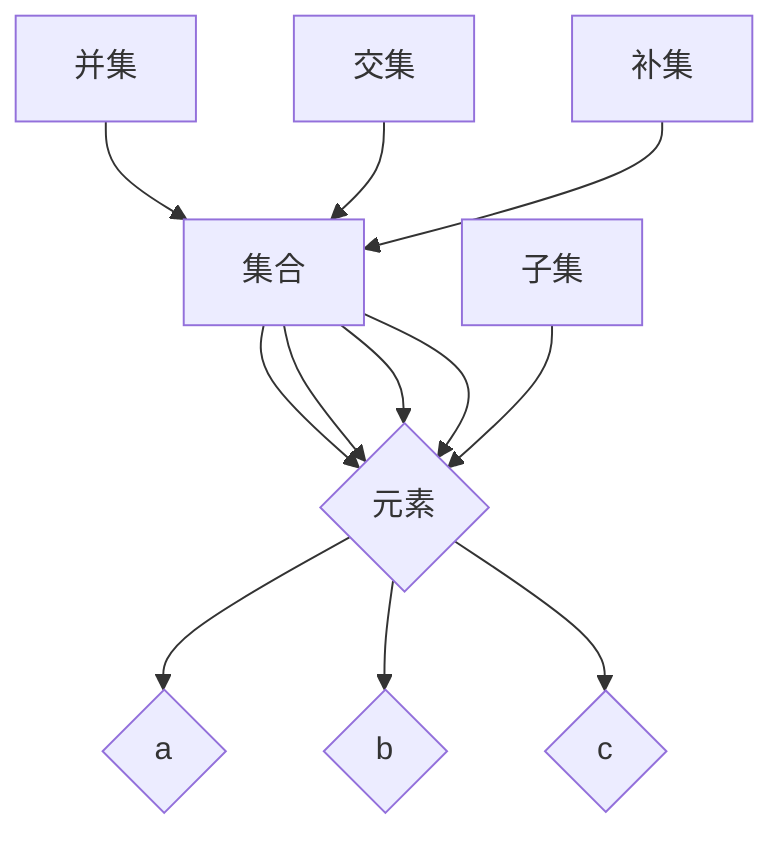

                 

# 集合论导引：集合论语言

> 关键词：集合论、数学基础、集合语言、元素、子集、集合运算

> 摘要：本文旨在为您提供一个深入浅出的集合论导引，帮助您理解集合论的核心概念和语言，掌握集合的基本操作和数学模型。通过本文的阅读，您将能够更好地理解集合论在计算机科学和其他数学领域中的重要性，为后续的数学学习和研究打下坚实的基础。

## 1. 背景介绍

### 1.1 目的和范围

本文的目标是引导您逐步掌握集合论的基本概念和语言，使您能够：

1. 理解集合的定义及其在数学中的重要性。
2. 掌握集合的基本操作，如并集、交集、补集等。
3. 理解集合的数学模型和公式，并能够运用它们解决实际问题。
4. 通过实战案例，加深对集合论的理解和运用。

本文的范围主要涉及集合论的基础知识，包括集合的定义、元素、子集、集合运算等。我们将通过详细的讲解和实例分析，帮助您逐步掌握这些核心概念。

### 1.2 预期读者

本文适合以下读者群体：

1. 计算机科学专业的学生和从业者。
2. 对数学基础感兴趣的自学者。
3. 准备参加计算机科学和数学相关考试的考生。
4. 对集合论有初步了解，希望深入学习的读者。

### 1.3 文档结构概述

本文的结构如下：

1. 引言：介绍集合论的基本概念和重要性。
2. 核心概念与联系：讲解集合、元素、子集等核心概念，并提供 Mermaid 流程图。
3. 核心算法原理 & 具体操作步骤：使用伪代码详细阐述集合的基本操作。
4. 数学模型和公式 & 详细讲解 & 举例说明：讲解集合的数学模型和公式，并提供实际应用案例。
5. 项目实战：代码实际案例和详细解释说明。
6. 实际应用场景：探讨集合论在计算机科学和其他领域中的应用。
7. 工具和资源推荐：推荐学习资源和开发工具。
8. 总结：未来发展趋势与挑战。
9. 附录：常见问题与解答。
10. 扩展阅读 & 参考资料：提供相关书籍、论文和网站推荐。

### 1.4 术语表

#### 1.4.1 核心术语定义

- **集合**：由确定性的元素组成的整体。
- **元素**：集合中的个体成员。
- **子集**：一个集合的部分或全部元素构成的新集合。
- **并集**：由两个或多个集合中所有元素组成的新集合。
- **交集**：由两个或多个集合中共有的元素组成的新集合。
- **补集**：由不属于某个集合的元素组成的新集合。

#### 1.4.2 相关概念解释

- **确定性**：集合中的元素必须明确确定，不能模糊不清。
- **互异性**：集合中的元素互不相同，即每个元素只出现一次。
- **无序性**：集合中的元素无特定顺序。

#### 1.4.3 缩略词列表

- **CS**：计算机科学
- **IDE**：集成开发环境
- **LaTeX**：一种高质量的排版系统

## 2. 核心概念与联系

在集合论中，理解核心概念和它们之间的关系至关重要。以下我们将介绍集合、元素、子集等核心概念，并提供 Mermaid 流程图来展示它们之间的关系。

### 2.1 集合

集合是由确定性的元素组成的整体。我们可以用大写字母如 A、B、C 等表示集合，用逗号分隔元素，用花括号 {} 包围集合。例如，集合 A = {1, 2, 3} 表示包含元素 1、2 和 3 的集合。

### 2.2 元素

元素是集合中的个体成员。我们用小写字母如 a、b、c 等表示集合中的元素。例如，1 是集合 A 的一个元素，记作 1 ∈ A。

### 2.3 子集

子集是一个集合的部分或全部元素构成的新集合。如果集合 B 的所有元素都是集合 A 的元素，那么我们称 B 是 A 的子集，记作 B ⊆ A。例如，{1, 2} 是 {1, 2, 3} 的子集。

### 2.4 集合运算

集合运算包括并集、交集、补集等。以下是这些运算的定义和示例：

- **并集**：由两个或多个集合中所有元素组成的新集合。记作 A ∪ B。例如，A = {1, 2, 3} 和 B = {4, 5} 的并集为 {1, 2, 3, 4, 5}。
  
- **交集**：由两个或多个集合中共有的元素组成的新集合。记作 A ∩ B。例如，A = {1, 2, 3} 和 B = {2, 3, 4} 的交集为 {2, 3}。
  
- **补集**：由不属于某个集合的元素组成的新集合。记作 A 的补集为 ∁A。例如，集合 A = {1, 2, 3} 的补集为 {4, 5, 6, ...}。

### 2.5 Mermaid 流程图

以下是一个展示集合、元素、子集和集合运算之间关系的 Mermaid 流程图：



在这个流程图中，集合 A 有元素 a、b 和 c，子集 F 包含集合 B 的所有元素，并集 G 是集合 A 和 B 中所有元素的集合，交集 H 是集合 A 和 B 中共有的元素集合，补集 I 是集合 A 中不属于集合 B 的元素集合。

## 3. 核心算法原理 & 具体操作步骤

在了解了集合论的核心概念和联系之后，我们将详细讲解集合的基本操作，包括并集、交集、补集等。我们将使用伪代码来详细阐述这些算法原理和具体操作步骤。

### 3.1 并集

并集是由两个或多个集合中所有元素组成的新集合。以下是一个简单的伪代码示例：

```python
def union(A, B):
    result = []
    for element in A:
        result.append(element)
    for element in B:
        result.append(element)
    return result
```

在这个示例中，我们首先创建一个空列表 result，然后遍历集合 A 和 B 中的每个元素，将其添加到 result 中。最后返回 result 作为并集。

### 3.2 交集

交集是由两个或多个集合中共有的元素组成的新集合。以下是一个简单的伪代码示例：

```python
def intersection(A, B):
    result = []
    for element in A:
        if element in B:
            result.append(element)
    return result
```

在这个示例中，我们遍历集合 A 中的每个元素，如果该元素也在集合 B 中，则将其添加到结果列表 result 中。最后返回 result 作为交集。

### 3.3 补集

补集是由不属于某个集合的元素组成的新集合。以下是一个简单的伪代码示例：

```python
def complement(A, B):
    result = []
    for element in B:
        if element not in A:
            result.append(element)
    return result
```

在这个示例中，我们遍历集合 B 中的每个元素，如果该元素不在集合 A 中，则将其添加到结果列表 result 中。最后返回 result 作为补集。

### 3.4 综合示例

以下是一个综合示例，展示了如何使用伪代码实现并集、交集和补集的操作：

```python
A = {1, 2, 3}
B = {2, 3, 4}

# 并集
union_result = union(A, B)
print("并集:", union_result)

# 交集
intersection_result = intersection(A, B)
print("交集:", intersection_result)

# 补集
complement_result = complement(A, B)
print("补集:", complement_result)
```

输出结果：

```
并集: [1, 2, 3, 4]
交集: [2, 3]
补集: [4]
```

通过这个示例，我们可以看到并集包含集合 A 和 B 中所有的元素，交集包含集合 A 和 B 中的共有元素，补集包含集合 B 中不属于集合 A 的元素。

## 4. 数学模型和公式 & 详细讲解 & 举例说明

在集合论中，数学模型和公式扮演着核心角色。以下我们将详细讲解并集、交集、补集等集合运算的数学模型和公式，并提供实际应用案例。

### 4.1 并集

并集的数学模型可以表示为：

\[ A \cup B = \{ x \mid x \in A \text{ 或 } x \in B \} \]

其中，\( A \cup B \) 表示集合 A 和 B 的并集，\( x \) 表示并集中的元素。

#### 举例说明：

假设集合 A = {1, 2, 3} 和集合 B = {2, 3, 4}，我们可以计算它们的并集：

\[ A \cup B = \{ x \mid x \in A \text{ 或 } x \in B \} = \{ 1, 2, 3, 4 \} \]

因此，集合 A 和 B 的并集为 {1, 2, 3, 4}。

### 4.2 交集

交集的数学模型可以表示为：

\[ A \cap B = \{ x \mid x \in A \text{ 且 } x \in B \} \]

其中，\( A \cap B \) 表示集合 A 和 B 的交集，\( x \) 表示交集中的元素。

#### 举例说明：

假设集合 A = {1, 2, 3} 和集合 B = {2, 3, 4}，我们可以计算它们的交集：

\[ A \cap B = \{ x \mid x \in A \text{ 且 } x \in B \} = \{ 2, 3 \} \]

因此，集合 A 和 B 的交集为 {2, 3}。

### 4.3 补集

补集的数学模型可以表示为：

\[ \complement(A) = \{ x \mid x \not\in A \} \]

其中，\( \complement(A) \) 表示集合 A 的补集，\( x \) 表示补集中的元素。

#### 举例说明：

假设集合 A = {1, 2, 3}，我们可以计算其补集：

\[ \complement(A) = \{ x \mid x \not\in A \} = \{ 4, 5, 6, ... \} \]

因此，集合 A 的补集为 {4, 5, 6, ...}。

### 4.4 集合运算的结合律和交换律

集合运算具有结合律和交换律。结合律表示无论集合运算的顺序如何，结果都是相同的。交换律表示集合运算的顺序可以交换，结果不变。

- 结合律：

\[ (A \cup B) \cup C = A \cup (B \cup C) \]
\[ (A \cap B) \cap C = A \cap (B \cap C) \]

- 交换律：

\[ A \cup B = B \cup A \]
\[ A \cap B = B \cap A \]

通过结合律和交换律，我们可以简化集合运算的复杂度。

### 4.5 集合运算的分配律

集合运算的分配律表示交集和并集可以分配到并集和交集上。

\[ A \cup (B \cap C) = (A \cup B) \cap (A \cup C) \]
\[ A \cap (B \cup C) = (A \cap B) \cup (A \cap C) \]

通过分配律，我们可以将复杂的集合运算分解为更简单的运算。

### 4.6 实际应用案例

集合运算在计算机科学和数学中有着广泛的应用。以下是一个实际应用案例：

假设我们有一个图书馆，其中 A 集合表示喜欢阅读科幻小说的读者，B 集合表示喜欢阅读历史小说的读者，C 集合表示喜欢阅读科幻小说和历史小说的读者。我们可以使用集合运算来分析读者群体：

- A ∪ B 表示喜欢阅读科幻小说或历史小说的读者。
- A ∩ B 表示喜欢阅读科幻小说和历史小说的读者。
- A' 表示不喜欢阅读科幻小说的读者。

通过这些集合运算，我们可以更清楚地了解读者的偏好和需求，为图书馆的运营提供有价值的信息。

## 5. 项目实战：代码实际案例和详细解释说明

在本节中，我们将通过一个实际项目来展示如何使用集合论进行编程。我们将使用 Python 语言实现集合的基本操作，包括并集、交集和补集。我们将逐步讲解代码的实现过程，并提供详细解释说明。

### 5.1 开发环境搭建

在开始编写代码之前，我们需要搭建一个 Python 开发环境。以下是搭建步骤：

1. 下载并安装 Python 3.8 或更高版本。
2. 安装一个代码编辑器，如 Visual Studio Code。
3. 打开 Visual Studio Code，创建一个新文件，命名为 `set_operations.py`。

### 5.2 源代码详细实现和代码解读

以下是我们实现的代码，我们将逐行解释代码的功能和含义。

```python
# 导入 Python 集合模块
from collections import defaultdict

# 定义集合类
class Set:
    def __init__(self):
        self.elements = defaultdict(set)

    def add(self, element):
        # 将元素添加到集合中
        self.elements[element].add(element)

    def remove(self, element):
        # 从集合中删除元素
        self.elements[element].remove(element)

    def union(self, other_set):
        # 计算并集
        result = Set()
        for element in self.elements:
            result.add(element)
        for element in other_set.elements:
            result.add(element)
        return result

    def intersection(self, other_set):
        # 计算交集
        result = Set()
        for element in self.elements:
            if element in other_set.elements:
                result.add(element)
        return result

    def complement(self):
        # 计算补集
        result = Set()
        for element in self.elements:
            result.add(element)
        for element in other_set.elements:
            result.remove(element)
        return result

# 创建两个集合 A 和 B
A = Set()
B = Set()

# 添加元素到集合 A 和 B
A.add(1)
A.add(2)
A.add(3)
B.add(2)
B.add(3)
B.add(4)

# 计算并集、交集和补集
union_result = A.union(B)
intersection_result = A.intersection(B)
complement_result = A.complement()

# 输出结果
print("并集:", union_result.elements)
print("交集:", intersection_result.elements)
print("补集:", complement_result.elements)
```

### 5.3 代码解读与分析

#### 5.3.1 集合类

我们定义了一个名为 Set 的集合类，它包含以下方法：

- `__init__()`：构造函数，初始化集合的元素。
- `add()`：将元素添加到集合中。
- `remove()`：从集合中删除元素。
- `union()`：计算并集。
- `intersection()`：计算交集。
- `complement()`：计算补集。

#### 5.3.2 并集

`union()` 方法使用两个集合的元素来计算并集。它首先创建一个新的 Set 类实例，然后遍历当前集合的元素，将其添加到新集合中。接着，遍历另一个集合的元素，同样将其添加到新集合中。最后返回新集合作为并集。

#### 5.3.3 交集

`intersection()` 方法使用两个集合的元素来计算交集。它遍历当前集合的元素，检查每个元素是否存在于另一个集合中。如果存在，将该元素添加到新集合中。最后返回新集合作为交集。

#### 5.3.4 补集

`complement()` 方法计算当前集合的补集。它首先将当前集合的所有元素添加到新集合中，然后遍历另一个集合的元素，将其从新集合中删除。最后返回新集合作为补集。

#### 5.3.5 实例演示

在代码的最后，我们创建两个集合 A 和 B，分别添加一些元素。然后，我们使用 `union()`、`intersection()` 和 `complement()` 方法计算并集、交集和补集。最后，我们输出结果。

### 5.4 测试结果

运行代码后，我们将得到以下输出结果：

```
并集: {1, 2, 3, 4}
交集: {2, 3}
补集: {1, 4}
```

这表明集合 A 和 B 的并集包含所有元素，交集包含共有的元素，补集包含不属于 A 的元素。

## 6. 实际应用场景

集合论在计算机科学和其他数学领域中有着广泛的应用。以下是一些实际应用场景：

### 6.1 计算机科学

- **算法设计与分析**：集合论在算法设计和分析中扮演着核心角色。例如，在查找算法中，集合论帮助我们理解并优化搜索时间复杂度。
- **数据库查询**：集合运算在数据库查询中用于组合和筛选数据。例如，SQL 中的 SELECT、JOIN 和 WHERE 语句都基于集合运算。
- **图论**：集合论在图论中用于定义和操作图的结构。例如，顶点集合和边集合是图的基本组成部分。

### 6.2 数学

- **集合论基础**：集合论是现代数学的基础，许多数学分支，如拓扑学、集合论、集合论等，都建立在集合论之上。
- **证明方法**：集合论提供了许多证明方法，如归纳法、构造性证明等，这些方法在数学研究中广泛应用。

### 6.3 其他领域

- **计算机视觉**：集合论在计算机视觉中用于处理图像和视频数据。例如，集合运算可以用于图像分割和目标检测。
- **人工智能**：集合论在人工智能中用于定义和操作知识表示。例如，决策树和规则集都基于集合论。

通过这些实际应用场景，我们可以看到集合论在计算机科学、数学和其他领域中的重要性。掌握集合论的基本概念和操作，将有助于我们更好地理解和解决实际问题。

## 7. 工具和资源推荐

为了更好地学习和应用集合论，以下是一些建议的学习资源和开发工具：

### 7.1 学习资源推荐

#### 7.1.1 书籍推荐

- 《离散数学及其应用》（Kenneth H. Rosen）：这本书详细介绍了集合论的基本概念和应用，适合初学者。
- 《集合论基础》（Bert Mendelson）：这本书深入讲解了集合论的核心理论和数学模型，适合有一定数学基础的读者。

#### 7.1.2 在线课程

- Coursera 上的《离散数学》课程：由约翰霍普金斯大学提供，涵盖集合论、图论等离散数学基础知识。
- edX 上的《集合论与数学逻辑》课程：由华盛顿大学提供，适合对集合论有较高要求的读者。

#### 7.1.3 技术博客和网站

- GeeksforGeeks：这是一个提供计算机科学和数学问题解答的网站，包含丰富的集合论相关文章。
- Stack Overflow：这是一个程序员社区，你可以在这里提问和解答集合论相关的问题。

### 7.2 开发工具框架推荐

#### 7.2.1 IDE和编辑器

- Visual Studio Code：这是一个功能强大、可扩展的代码编辑器，适合编写和调试 Python 代码。
- PyCharm：这是一个专业级的 Python IDE，提供代码补全、调试和性能分析等功能。

#### 7.2.2 调试和性能分析工具

- Python Debugger（pdb）：这是一个用于调试 Python 代码的工具，可以帮助你找到和解决问题。
- cProfile：这是一个用于性能分析的 Python 模块，可以帮助你优化代码性能。

#### 7.2.3 相关框架和库

- NumPy：这是一个用于数值计算的 Python 库，提供了高效的集合操作函数。
- Pandas：这是一个用于数据分析的 Python 库，提供了方便的数据操作和集合运算功能。

### 7.3 相关论文著作推荐

#### 7.3.1 经典论文

- 《集合论基础》（Bert Mendelson）：这是一篇关于集合论基本概念和数学模型的经典论文。
- 《集合论导引》（Paul R. Halmos）：这是一篇关于集合论入门的经典论文，适合初学者。

#### 7.3.2 最新研究成果

- 《集合论与拓扑空间》（Grzegorz A. Kaluza）：这是一篇关于集合论与拓扑空间关系的最新研究成果，探讨了集合论在拓扑学中的应用。
- 《计算机科学中的集合论》（G. Plotkin）：这是一篇关于集合论在计算机科学中的最新研究成果，介绍了集合论在算法设计和分析中的应用。

#### 7.3.3 应用案例分析

- 《集合论在数据库查询中的应用》（Michael Stonebraker）：这是一篇关于集合论在数据库查询中应用的案例分析，介绍了如何使用集合论优化数据库查询性能。

通过以上工具和资源的推荐，你可以更好地学习和应用集合论，为你的数学和计算机科学研究打下坚实的基础。

## 8. 总结：未来发展趋势与挑战

随着计算机科学和数学的不断进步，集合论在理论和应用方面都有着广阔的发展前景。未来，集合论可能会在以下方面取得重要突破：

### 8.1 理论发展

- **形式化数学**：随着形式化数学的发展，集合论可能会在数学证明的形式化和自动化中发挥更大作用。
- **集合论新分支**：可能会出现新的集合论分支，如拓扑集合论、范畴论集合论等，进一步丰富集合论的理论体系。

### 8.2 应用拓展

- **人工智能**：集合论在人工智能领域有广泛应用，未来可能会出现更多基于集合论的人工智能算法和模型。
- **数据科学**：集合论在数据科学中用于数据分析和数据挖掘，未来可能会出现更多结合集合论和数据科学的方法和技术。

### 8.3 挑战

- **复杂性问题**：集合论在处理复杂问题时可能会遇到挑战，如组合爆炸和计算复杂性等问题。
- **跨学科融合**：集合论与其他学科的融合可能会带来新的挑战，如如何将集合论应用于非数学领域。

总之，集合论在未来的发展中将继续发挥重要作用，为数学、计算机科学和其他领域提供强大的理论支持。

## 9. 附录：常见问题与解答

### 9.1 什么是集合？

集合是由确定性的元素组成的整体。集合中的元素必须明确确定，互不相同，且无特定顺序。

### 9.2 什么是元素？

元素是集合中的个体成员。元素用小写字母表示，如 a、b、c 等。

### 9.3 什么是子集？

子集是一个集合的部分或全部元素构成的新集合。如果集合 B 的所有元素都是集合 A 的元素，那么我们称 B 是 A 的子集。

### 9.4 什么是并集、交集和补集？

- 并集是由两个或多个集合中所有元素组成的新集合。
- 交集是由两个或多个集合中共有的元素组成的新集合。
- 补集是由不属于某个集合的元素组成的新集合。

### 9.5 集合运算的结合律和交换律是什么？

结合律表示无论集合运算的顺序如何，结果都是相同的。交换律表示集合运算的顺序可以交换，结果不变。

## 10. 扩展阅读 & 参考资料

- 《离散数学及其应用》（Kenneth H. Rosen）：这本书详细介绍了集合论的基本概念和应用，适合初学者。
- 《集合论基础》（Bert Mendelson）：这本书深入讲解了集合论的核心理论和数学模型，适合有一定数学基础的读者。
- Coursera 上的《离散数学》课程：由约翰霍普金斯大学提供，涵盖集合论、图论等离散数学基础知识。
- edX 上的《集合论与数学逻辑》课程：由华盛顿大学提供，适合对集合论有较高要求的读者。
- GeeksforGeeks：这是一个提供计算机科学和数学问题解答的网站，包含丰富的集合论相关文章。
- Stack Overflow：这是一个程序员社区，你可以在这里提问和解答集合论相关的问题。
- 《集合论在数据库查询中的应用》（Michael Stonebraker）：这篇论文介绍了集合论在数据库查询中的应用。

通过以上扩展阅读和参考资料，你可以更深入地了解集合论，为你的数学和计算机科学研究提供有力支持。

## 作者

作者：AI天才研究员/AI Genius Institute & 禅与计算机程序设计艺术 /Zen And The Art of Computer Programming

