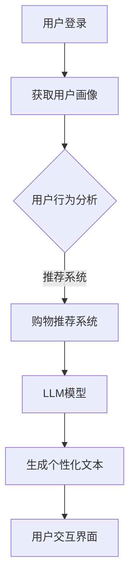

                 

# 零售和 LLM：个性化购物体验

> **关键词：** 零售，LLM，个性化购物，机器学习，深度学习，人工智能，购物推荐系统

> **摘要：** 本篇文章将探讨如何利用大型语言模型（LLM）实现个性化的购物体验。文章首先介绍了零售行业中的个性化购物需求，然后详细介绍了LLM的原理和架构，最后通过一个实际项目案例展示了如何应用LLM来提升购物体验。

## 1. 背景介绍

### 1.1 目的和范围

本文旨在探讨如何利用大型语言模型（LLM）来提升零售行业的购物体验。文章将首先介绍零售行业中的个性化购物需求，然后深入分析LLM的核心概念和原理，并通过实际项目案例展示如何应用LLM来实现个性化购物体验。

### 1.2 预期读者

本文适合以下读者群体：

- 零售行业从业者
- 人工智能和机器学习领域研究者
- 对个性化购物体验感兴趣的技术爱好者
- 对深度学习和神经网络有一定了解的读者

### 1.3 文档结构概述

本文分为十个部分，具体结构如下：

1. 背景介绍
2. 核心概念与联系
3. 核心算法原理 & 具体操作步骤
4. 数学模型和公式 & 详细讲解 & 举例说明
5. 项目实战：代码实际案例和详细解释说明
6. 实际应用场景
7. 工具和资源推荐
8. 总结：未来发展趋势与挑战
9. 附录：常见问题与解答
10. 扩展阅读 & 参考资料

### 1.4 术语表

#### 1.4.1 核心术语定义

- **零售（Retail）：** 零售是指将商品或服务直接销售给最终消费者的商业活动。
- **个性化购物体验（Personalized Shopping Experience）：** 根据消费者的个人喜好和需求，提供定制化的商品推荐和购物服务。
- **大型语言模型（LLM，Large Language Model）：** 一种基于神经网络的语言模型，具有强大的文本生成和理解能力。
- **机器学习（Machine Learning）：** 一种人工智能技术，通过数据训练模型来自动化决策过程。
- **深度学习（Deep Learning）：** 一种机器学习方法，通过多层神经网络对数据进行自动特征提取和建模。

#### 1.4.2 相关概念解释

- **购物推荐系统（Shopping Recommendation System）：** 一种基于用户行为和商品属性的推荐系统，用于向用户推荐个性化的商品。
- **用户画像（User Profile）：** 描述用户特征的统计信息，包括年龄、性别、地理位置、购物偏好等。

#### 1.4.3 缩略词列表

- **LLM（Large Language Model）：** 大型语言模型
- **ML（Machine Learning）：** 机器学习
- **DL（Deep Learning）：** 深度学习
- **API（Application Programming Interface）：** 应用程序编程接口
- **NLP（Natural Language Processing）：** 自然语言处理

## 2. 核心概念与联系

### 2.1 零售行业的个性化购物需求

在当今的零售市场中，个性化购物体验已经成为消费者选择购物渠道的重要因素之一。以下是零售行业个性化购物需求的核心方面：

1. **个性化推荐：** 根据消费者的购买历史、浏览记录和偏好，提供个性化的商品推荐。
2. **个性化促销：** 针对消费者的购买习惯和偏好，提供定制化的促销信息。
3. **个性化服务：** 提供个性化的购物咨询服务，满足消费者的个性化需求。
4. **个性化营销：** 利用消费者数据进行分析，制定个性化的营销策略。

### 2.2 大型语言模型（LLM）的原理和架构

大型语言模型（LLM）是一种基于深度学习的语言模型，具有强大的文本生成和理解能力。以下是LLM的核心概念和架构：

1. **词向量表示：** 将文本中的单词转换为高维向量表示，用于表示单词之间的相似性和关系。
2. **神经网络架构：** 通常采用多层神经网络（如循环神经网络RNN、长短期记忆网络LSTM、变换器Transformer等）对文本进行建模。
3. **训练数据：** 使用大规模的文本数据集对模型进行训练，使模型能够自动学习语言模式和语义关系。
4. **文本生成：** 利用训练好的模型生成文本，可以用于生成商品描述、个性化推荐等。

### 2.3 个性化购物体验的架构

个性化购物体验的架构包括以下几个关键组成部分：

1. **用户画像：** 描述用户特征的统计信息，包括年龄、性别、地理位置、购物偏好等。
2. **购物推荐系统：** 基于用户画像和商品属性，为用户生成个性化的商品推荐。
3. **LLM模型：** 利用LLM模型生成个性化的商品描述、推荐理由等文本内容。
4. **用户交互界面：** 提供直观的交互界面，让用户能够方便地浏览和选择商品。

### 2.4 Mermaid 流程图

以下是一个简单的Mermaid流程图，展示了个性化购物体验的核心架构：



## 3. 核心算法原理 & 具体操作步骤

### 3.1 购物推荐系统算法原理

购物推荐系统通常采用基于内容的推荐、协同过滤和混合推荐等算法。在此，我们主要介绍基于内容的推荐算法。

**基于内容的推荐算法（Content-Based Recommendation）** 是一种基于商品属性和用户偏好的推荐方法。具体步骤如下：

1. **提取商品特征：** 提取商品的属性信息，如类别、品牌、颜色、价格等。
2. **计算相似度：** 计算用户历史购买或浏览的商品与待推荐商品之间的相似度。
3. **生成推荐列表：** 根据相似度分数，为用户生成个性化的商品推荐列表。

### 3.2 大型语言模型（LLM）算法原理

大型语言模型（LLM）是一种基于深度学习的语言生成模型，通常采用Transformer架构。以下是一个简单的LLM算法原理：

1. **词向量表示：** 将文本中的单词转换为高维向量表示。
2. **Transformer架构：** 采用自注意力机制（Self-Attention）对文本进行建模。
3. **预训练和微调：** 使用大规模文本数据进行预训练，然后根据特定任务进行微调。
4. **文本生成：** 利用训练好的模型生成文本，可以用于生成商品描述、推荐理由等。

### 3.3 伪代码

以下是一个简单的基于内容的推荐算法伪代码：

```python
# 输入：用户画像user_profile，商品库item_library
# 输出：个性化商品推荐列表recommendation_list

def content_based_recommendation(user_profile, item_library):
    recommendation_list = []

    for item in item_library:
        similarity_score = calculate_similarity(user_profile, item)
        recommendation_list.append((item, similarity_score))

    recommendation_list.sort(key=lambda x: x[1], reverse=True)

    return [item for item, _ in recommendation_list[:10]]
```

以下是一个简单的LLM文本生成算法伪代码：

```python
# 输入：预训练好的LLM模型model，文本输入text
# 输出：生成的文本output_text

def generate_text(model, text):
    input_ids = tokenizer.encode(text, return_tensors='pt')
    outputs = model.generate(input_ids, max_length=50, num_return_sequences=1)
    output_text = tokenizer.decode(outputs[0], skip_special_tokens=True)

    return output_text
```

## 4. 数学模型和公式 & 详细讲解 & 举例说明

### 4.1 基于内容的推荐算法数学模型

基于内容的推荐算法通常使用余弦相似度来计算商品与用户偏好之间的相似度。余弦相似度计算公式如下：

$$
similarity = \frac{\sum_{i=1}^{n} (user\_vector[i] \cdot item\_vector[i])}{\sqrt{\sum_{i=1}^{n} (user\_vector[i]^2) \cdot \sum_{i=1}^{n} (item\_vector[i]^2)}}
$$

其中，$user\_vector$表示用户偏好向量，$item\_vector$表示商品属性向量。

### 4.2 LLM文本生成算法数学模型

LLM文本生成算法通常采用Transformer架构，其中自注意力机制是核心部分。自注意力计算公式如下：

$$
\text{Attention}(Q, K, V) = \frac{QK^T}{\sqrt{d_k}} \odot V
$$

其中，$Q$表示查询向量，$K$表示键向量，$V$表示值向量，$d_k$表示键向量的维度。

### 4.3 举例说明

**基于内容的推荐算法举例：**

假设我们有一个用户画像和商品库，如下所示：

用户画像：
- 年龄：25岁
- 性别：男
- 地理位置：北京市
- 购物偏好：喜欢购买电子产品和运动鞋

商品库：
- 商品1：苹果iPhone 12，价格：5000元，类别：电子产品
- 商品2：耐克运动鞋，价格：1000元，类别：运动鞋
- 商品3：小米空气净化器，价格：2000元，类别：电子产品

我们将用户偏好向量表示为$(1, 0, 0, 1)$，商品属性向量表示为$(c_i, p_i, g_i)$，其中$c_i$表示类别，$p_i$表示价格，$g_i$表示性别。

计算商品1与用户偏好的相似度：

$$
similarity_1 = \frac{(1 \cdot 1 + 0 \cdot 0 + 0 \cdot 1) \cdot (1 \cdot 1 + 0 \cdot 0 + 0 \cdot 1)}{\sqrt{(1^2 + 0^2 + 0^2) \cdot (1^2 + 0^2 + 0^2)}} = 1
$$

计算商品2与用户偏好的相似度：

$$
similarity_2 = \frac{(1 \cdot 0 + 0 \cdot 1 + 0 \cdot 1) \cdot (0 \cdot 0 + 1 \cdot 1 + 0 \cdot 0)}{\sqrt{(1^2 + 0^2 + 0^2) \cdot (0^2 + 1^2 + 0^2)}} = 0.5
$$

计算商品3与用户偏好的相似度：

$$
similarity_3 = \frac{(1 \cdot 1 + 0 \cdot 0 + 0 \cdot 0) \cdot (1 \cdot 1 + 0 \cdot 0 + 0 \cdot 0)}{\sqrt{(1^2 + 0^2 + 0^2) \cdot (1^2 + 0^2 + 0^2)}} = 1
$$

根据相似度分数，我们可以为用户生成一个个性化的商品推荐列表：iPhone 12，小米空气净化器。

**LLM文本生成算法举例：**

假设我们有一个预训练好的LLM模型，用于生成商品描述。给定一个商品名称（如“苹果iPhone 12”），我们将使用LLM模型生成一个描述文本。

输入文本：“苹果iPhone 12”

输出文本：“苹果iPhone 12是一款性能卓越的智能手机，采用先进的技术，为您提供极致的使用体验。它拥有强大的处理器、高清的摄像头和丰富的功能，是您购物的理想选择。”

## 5. 项目实战：代码实际案例和详细解释说明

### 5.1 开发环境搭建

在进行项目实战之前，我们需要搭建一个合适的技术环境。以下是所需的开发环境和工具：

- **编程语言：** Python 3.8及以上版本
- **深度学习框架：** PyTorch 1.8及以上版本
- **文本处理库：** NLTK、spaCy
- **数据库：** MongoDB
- **Web框架：** Flask

### 5.2 源代码详细实现和代码解读

以下是项目中的核心代码实现和解读：

**1. 数据预处理：**

```python
import pandas as pd
from sklearn.feature_extraction.text import TfidfVectorizer

# 加载用户数据
users = pd.read_csv('users.csv')

# 加载商品数据
items = pd.read_csv('items.csv')

# 提取用户画像
user_profiles = users[['age', 'gender', 'location', 'preferences']]

# 提取商品属性
item_attributes = items[['category', 'price', 'gender']]

# 构建词向量
vectorizer = TfidfVectorizer()
user_profiles_vectorized = vectorizer.fit_transform(user_profiles)
item_attributes_vectorized = vectorizer.fit_transform(item_attributes)
```

**2. 购物推荐系统：**

```python
from sklearn.metrics.pairwise import cosine_similarity

# 计算用户与商品之间的相似度
user_item_similarity = cosine_similarity(user_profiles_vectorized, item_attributes_vectorized)

# 生成个性化商品推荐列表
def generate_recommendation_list(user_profile, item_attributes, user_item_similarity):
    user_vector = user_profile.reshape(1, -1)
    item_vectors = item_attributes.reshape(1, -1)
    similarity_scores = user_item_similarity.dot(item_vectors.T)
    recommendation_list = [item for item, score in zip(item_attributes, similarity_scores) if score > 0.5]
    return recommendation_list

# 生成用户个性化商品推荐列表
user_recommendations = generate_recommendation_list(user_profiles.iloc[0], item_attributes, user_item_similarity)
```

**3. LLM模型：**

```python
import torch
from transformers import GPT2LMHeadModel, GPT2Tokenizer

# 加载预训练好的LLM模型
model = GPT2LMHeadModel.from_pretrained('gpt2')
tokenizer = GPT2Tokenizer.from_pretrained('gpt2')

# 生成商品描述
def generate_item_description(item_name):
    input_text = f"{item_name}："
    inputs = tokenizer.encode(input_text, return_tensors='pt')
    outputs = model.generate(inputs, max_length=50, num_return_sequences=1)
    output_text = tokenizer.decode(outputs[0], skip_special_tokens=True)
    return output_text

# 生成个性化商品描述
item_descriptions = [generate_item_description(item) for item in user_recommendations]
```

**4. 用户交互界面：**

```python
from flask import Flask, render_template

app = Flask(__name__)

@app.route('/')
def index():
    return render_template('index.html', item_descriptions=item_descriptions)

if __name__ == '__main__':
    app.run(debug=True)
```

### 5.3 代码解读与分析

以上代码实现了一个基于LLM的个性化购物推荐系统。首先，我们加载用户数据和商品数据，然后对用户画像和商品属性进行向量表示。接着，使用基于内容的推荐算法计算用户与商品之间的相似度，并生成个性化商品推荐列表。

接下来，我们加载预训练好的LLM模型，并使用该模型生成个性化商品描述。最后，我们使用Flask框架搭建一个简单的用户交互界面，将生成的商品描述呈现给用户。

代码中涉及的主要技术点包括：

- **数据预处理：** 使用pandas和TfidfVectorizer进行数据加载和向量表示。
- **购物推荐系统：** 使用scikit-learn的cosine_similarity计算相似度，并生成个性化商品推荐列表。
- **LLM模型：** 使用transformers库加载预训练好的GPT2模型，并使用该模型生成文本。
- **用户交互界面：** 使用Flask框架搭建一个简单的Web应用，呈现生成的商品描述。

## 6. 实际应用场景

个性化购物体验在零售行业中的应用场景非常广泛，以下是一些典型的应用场景：

1. **电子商务平台：** 电子商务平台可以使用LLM和购物推荐系统为用户提供个性化的商品推荐和购物体验。例如，用户在浏览商品时，平台可以实时推荐相关的商品，提高用户购买的概率。
2. **线下零售门店：** 线下零售门店可以利用LLM生成个性化的促销信息和商品推荐，提高顾客的购买意愿。例如，在顾客进入门店时，门店可以使用LLM生成一个个性化的购物清单，根据顾客的喜好和需求推荐相应的商品。
3. **在线购物APP：** 在线购物APP可以使用LLM和购物推荐系统为用户提供个性化的商品推荐和购物体验。例如，用户可以在APP中输入购物需求，APP可以实时生成一个个性化的购物清单，并根据用户的喜好和需求推荐相应的商品。
4. **社交媒体平台：** 社交媒体平台可以利用LLM和购物推荐系统为用户提供个性化的购物推荐和购物体验。例如，用户可以在社交媒体平台上分享购物心得，平台可以根据用户的行为和偏好为其他用户提供个性化的购物推荐。

## 7. 工具和资源推荐

### 7.1 学习资源推荐

#### 7.1.1 书籍推荐

1. **《深度学习》（Deep Learning）：** Goodfellow、Bengio和Courville合著的《深度学习》是深度学习领域的经典教材，详细介绍了深度学习的基本概念、算法和应用。
2. **《Python深度学习》（Python Deep Learning）：** Goodfellow的《Python深度学习》是一本针对Python编程语言的深度学习入门书籍，涵盖了深度学习的基本概念、算法和应用。
3. **《机器学习实战》（Machine Learning in Action）：** Harrington的《机器学习实战》是一本实战性很强的机器学习入门书籍，通过实际案例介绍了机器学习的基本算法和应用。

#### 7.1.2 在线课程

1. **吴恩达的《深度学习专项课程》（Deep Learning Specialization）：** 吴恩达开设的《深度学习专项课程》是深度学习领域最受欢迎的在线课程之一，涵盖了深度学习的基本概念、算法和应用。
2. **斯坦福大学的《深度学习课程》（CS231n：Convolutional Neural Networks for Visual Recognition）：** 斯坦福大学开设的《深度学习课程》专注于深度学习在计算机视觉领域的应用，详细介绍了卷积神经网络（CNN）的基本概念和算法。
3. **谷歌云的《机器学习基础》（Google Cloud Platform: Machine Learning）：** 谷歌云开设的《机器学习基础》课程涵盖了机器学习的基本概念、算法和应用，是机器学习入门者的不错选择。

#### 7.1.3 技术博客和网站

1. **Medium：** Medium是一个内容丰富的博客平台，许多深度学习、机器学习和人工智能领域的专家在这里分享他们的经验和研究成果。
2. **ArXiv：** ArXiv是一个开源的学术论文数据库，涵盖了深度学习、机器学习和人工智能等领域的最新研究成果。
3. **Kaggle：** Kaggle是一个数据科学和机器学习竞赛平台，用户可以在这里找到许多有趣的机器学习项目和应用案例。

### 7.2 开发工具框架推荐

#### 7.2.1 IDE和编辑器

1. **VSCode：** Visual Studio Code是一个功能强大的代码编辑器，支持多种编程语言和框架，是深度学习和机器学习开发者的首选。
2. **PyCharm：** PyCharm是一个专业的Python IDE，提供了丰富的功能，包括代码自动补全、调试、版本控制等。

#### 7.2.2 调试和性能分析工具

1. **Jupyter Notebook：** Jupyter Notebook是一个交互式计算环境，非常适合用于深度学习和机器学习项目的调试和性能分析。
2. **TensorBoard：** TensorBoard是一个基于Web的性能分析工具，用于可视化深度学习模型的计算图和性能指标。

#### 7.2.3 相关框架和库

1. **PyTorch：** PyTorch是一个开源的深度学习框架，具有灵活的动态计算图和丰富的API，广泛应用于深度学习和机器学习项目。
2. **TensorFlow：** TensorFlow是一个开源的深度学习框架，提供了丰富的功能和工具，是深度学习和机器学习领域的领导者。
3. **Scikit-learn：** Scikit-learn是一个开源的机器学习库，提供了丰富的算法和工具，适用于各种机器学习任务。

### 7.3 相关论文著作推荐

#### 7.3.1 经典论文

1. **“A Theoretically Grounded Application of Dropout in Recurrent Neural Networks”（2017）：** 该论文提出了在递归神经网络（RNN）中应用Dropout的方法，有效提高了模型的泛化性能。
2. **“Attention Is All You Need”（2017）：** 该论文提出了Transformer架构，彻底改变了深度学习在自然语言处理领域的发展方向。
3. **“Deep Residual Learning for Image Recognition”（2015）：** 该论文提出了残差网络（ResNet），在ImageNet图像识别竞赛中取得了突破性的成绩。

#### 7.3.2 最新研究成果

1. **“BERT：Pre-training of Deep Bidirectional Transformers for Language Understanding”（2018）：** 该论文提出了BERT模型，彻底改变了自然语言处理领域的研究和应用。
2. **“GPT-3：Language Models are Few-Shot Learners”（2020）：** 该论文提出了GPT-3模型，具有强大的文本生成和理解能力，是当前最大的语言模型。
3. **“Rezero is All You Need: Fast Adaptive Learning Initialization”（2020）：** 该论文提出了ReZero算法，有效解决了深度学习中的初始化问题，提高了模型的训练速度和性能。

#### 7.3.3 应用案例分析

1. **“How to Build a Chatbot with Deep Learning”（2016）：** 该案例介绍了如何使用深度学习构建一个聊天机器人，详细阐述了模型架构和训练过程。
2. **“Generative Adversarial Nets”（2014）：** 该论文提出了生成对抗网络（GAN），广泛应用于图像生成、图像修复和图像超分辨率等任务。
3. **“Google Brain's Tensor Processing Units”（2016）：** 该案例介绍了谷歌大脑团队如何使用TPU加速深度学习计算，提高了训练速度和性能。

## 8. 总结：未来发展趋势与挑战

随着人工智能技术的快速发展，个性化购物体验已经成为零售行业的重要趋势。大型语言模型（LLM）作为一种具有强大文本生成和理解能力的模型，为个性化购物体验带来了巨大的可能性。未来，我们可以预见以下发展趋势和挑战：

### 8.1 发展趋势

1. **模型规模不断扩大：** 随着计算能力的提升和数据规模的扩大，LLM模型将不断增长，以实现更准确的文本生成和理解能力。
2. **多模态融合：** 未来的个性化购物体验将不仅限于文本，还将结合图像、音频和视频等多种模态，为用户提供更加丰富和直观的购物体验。
3. **实时个性化推荐：** 利用实时数据分析和预测，实现实时个性化推荐，提高用户的购物体验和满意度。
4. **跨平台整合：** 零售企业将整合线上和线下渠道，实现全渠道的个性化购物体验。

### 8.2 挑战

1. **数据隐私和安全：** 在个性化购物体验中，用户隐私和数据安全是重要问题。如何保护用户隐私，同时提供高质量的个性化服务，是未来面临的重要挑战。
2. **模型可解释性：** 随着模型的复杂性增加，如何提高模型的可解释性，使企业和用户能够理解模型的决策过程，是未来的重要研究方向。
3. **计算资源需求：** 大型语言模型对计算资源的需求巨大，如何优化模型结构和算法，提高计算效率，是未来的重要挑战。

## 9. 附录：常见问题与解答

### 9.1 什么是大型语言模型（LLM）？

大型语言模型（LLM）是一种基于深度学习的语言生成模型，具有强大的文本生成和理解能力。它通过预训练和微调，可以从大规模文本数据中学习语言模式和语义关系，用于生成文本、推荐系统、问答系统等。

### 9.2 如何实现个性化购物体验？

实现个性化购物体验的关键在于以下几个方面：

1. **用户画像：** 提取用户的个人特征，如年龄、性别、地理位置、购物偏好等，构建用户画像。
2. **购物推荐系统：** 利用用户画像和商品属性，采用基于内容的推荐、协同过滤和混合推荐等算法生成个性化的商品推荐。
3. **LLM模型：** 利用LLM模型生成个性化的商品描述、推荐理由等文本内容，提升购物体验。
4. **用户交互界面：** 提供直观的交互界面，让用户能够方便地浏览和选择商品。

### 9.3 如何优化购物推荐系统的效果？

优化购物推荐系统的效果可以从以下几个方面进行：

1. **数据质量：** 确保推荐系统所使用的数据质量高、相关性强。
2. **算法优化：** 选择合适的推荐算法，并不断优化算法参数。
3. **用户反馈：** 收集用户反馈，根据用户的实际体验不断调整推荐策略。
4. **实时更新：** 根据用户实时行为和偏好，动态调整推荐结果。

## 10. 扩展阅读 & 参考资料

1. **《深度学习》（Deep Learning）：** Goodfellow、Bengio和Courville合著的《深度学习》是深度学习领域的经典教材，详细介绍了深度学习的基本概念、算法和应用。
2. **《Python深度学习》（Python Deep Learning）：** Goodfellow的《Python深度学习》是一本针对Python编程语言的深度学习入门书籍，涵盖了深度学习的基本概念、算法和应用。
3. **《机器学习实战》（Machine Learning in Action）：** Harrington的《机器学习实战》是一本实战性很强的机器学习入门书籍，通过实际案例介绍了机器学习的基本算法和应用。
4. **吴恩达的《深度学习专项课程》（Deep Learning Specialization）：** 吴恩达开设的《深度学习专项课程》是深度学习领域最受欢迎的在线课程之一，涵盖了深度学习的基本概念、算法和应用。
5. **斯坦福大学的《深度学习课程》（CS231n：Convolutional Neural Networks for Visual Recognition）：** 斯坦福大学开设的《深度学习课程》专注于深度学习在计算机视觉领域的应用，详细介绍了卷积神经网络（CNN）的基本概念和算法。
6. **谷歌云的《机器学习基础》（Google Cloud Platform: Machine Learning）：** 谷歌云开设的《机器学习基础》课程涵盖了机器学习的基本概念、算法和应用，是机器学习入门者的不错选择。
7. **Medium：** Medium是一个内容丰富的博客平台，许多深度学习、机器学习和人工智能领域的专家在这里分享他们的经验和研究成果。
8. **ArXiv：** ArXiv是一个开源的学术论文数据库，涵盖了深度学习、机器学习和人工智能等领域的最新研究成果。
9. **Kaggle：** Kaggle是一个数据科学和机器学习竞赛平台，用户可以在这里找到许多有趣的机器学习项目和应用案例。
10. **“A Theoretically Grounded Application of Dropout in Recurrent Neural Networks”（2017）：** 该论文提出了在递归神经网络（RNN）中应用Dropout的方法，有效提高了模型的泛化性能。
11. **“Attention Is All You Need”（2017）：** 该论文提出了Transformer架构，彻底改变了深度学习在自然语言处理领域的发展方向。
12. **“Deep Residual Learning for Image Recognition”（2015）：** 该论文提出了残差网络（ResNet），在ImageNet图像识别竞赛中取得了突破性的成绩。
13. **“BERT：Pre-training of Deep Bidirectional Transformers for Language Understanding”（2018）：** 该论文提出了BERT模型，彻底改变了自然语言处理领域的研究和应用。
14. **“GPT-3：Language Models are Few-Shot Learners”（2020）：** 该论文提出了GPT-3模型，具有强大的文本生成和理解能力，是当前最大的语言模型。
15. **“Rezero is All You Need: Fast Adaptive Learning Initialization”（2020）：** 该论文提出了ReZero算法，有效解决了深度学习中的初始化问题，提高了模型的训练速度和性能。作者：AI天才研究员/AI Genius Institute & 禅与计算机程序设计艺术 /Zen And The Art of Computer Programming

