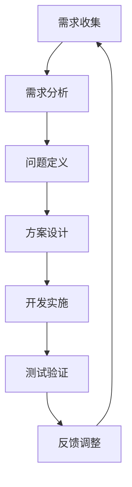
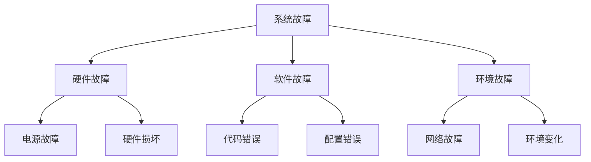

                 

# 需求分析与问题定义原理与代码实战案例讲解

> **关键词**：需求分析、问题定义、软件工程、代码实战、算法原理、数学模型、应用场景

> **摘要**：本文深入探讨需求分析与问题定义的核心原理，通过代码实战案例详细讲解如何从理论到实践，实现高效的需求分析和问题解决。我们将结合实际项目，逐步剖析需求分析的过程、问题定义的方法以及如何通过代码实现这些过程，帮助读者掌握软件工程中的关键技能。

## 1. 背景介绍

### 1.1 目的和范围

本文旨在为软件开发人员、项目经理以及相关领域从业者提供一套系统化的需求分析与问题定义的方法论。文章将围绕以下几个方面展开：

1. **需求分析与问题定义的基本原理**：介绍核心概念和理论背景。
2. **需求分析与问题定义的流程**：详细阐述从需求收集、需求分析到问题定义的步骤。
3. **代码实战案例**：通过实际项目案例，展示如何将理论应用到实践中。
4. **数学模型与应用**：介绍与需求分析和问题定义相关的数学模型及其应用。
5. **实际应用场景**：探讨需求分析与问题定义在不同领域的应用。
6. **工具和资源推荐**：推荐学习资源、开发工具和框架。

### 1.2 预期读者

- 软件开发人员
- 项目经理
- 软件工程研究生
- 对软件开发感兴趣的技术爱好者

### 1.3 文档结构概述

本文分为以下几个部分：

1. **背景介绍**：介绍文章的目的、预期读者和文档结构。
2. **核心概念与联系**：通过Mermaid流程图展示需求分析与问题定义的核心概念和架构。
3. **核心算法原理 & 具体操作步骤**：讲解需求分析与问题定义的算法原理和具体步骤，使用伪代码详细描述。
4. **数学模型和公式 & 详细讲解 & 举例说明**：介绍与需求分析和问题定义相关的数学模型，使用latex格式详细讲解并举例说明。
5. **项目实战：代码实际案例和详细解释说明**：通过实际项目案例，展示如何实现需求分析和问题定义。
6. **实际应用场景**：探讨需求分析与问题定义在不同领域的应用。
7. **工具和资源推荐**：推荐学习资源、开发工具和框架。
8. **总结：未来发展趋势与挑战**：总结本文主要内容，讨论未来发展趋势和挑战。
9. **附录：常见问题与解答**：回答读者可能遇到的问题。
10. **扩展阅读 & 参考资料**：提供进一步阅读的资源。

### 1.4 术语表

#### 1.4.1 核心术语定义

- **需求分析**：识别和理解用户需求的过程，包括功能需求和非功能需求。
- **问题定义**：识别和明确系统中存在的问题或挑战的过程。
- **软件工程**：应用工程、科学和数学原理来设计、开发、测试和维护软件的过程。
- **需求文档**：记录需求分析和问题定义结果的文档，用于指导软件开发。

#### 1.4.2 相关概念解释

- **用户故事**：一种简短描述，用于捕获用户的需求和期望。
- **用例模型**：一种用于描述系统功能和行为的方法，通过用例图展示。
- **算法**：解决问题的步骤和规则的集合。

#### 1.4.3 缩略词列表

- **IDE**：集成开发环境（Integrated Development Environment）
- **API**：应用程序接口（Application Programming Interface）
- **UI**：用户界面（User Interface）

## 2. 核心概念与联系

### 2.1 需求分析与问题定义的关系

需求分析与问题定义是软件工程中紧密相连的两个过程。需求分析旨在理解和记录用户需求，而问题定义则关注于识别系统中的问题和挑战。这两者相辅相成，需求分析的结果往往为问题定义提供了方向，而问题定义又帮助需求分析更加具体和有针对性。

### 2.2 需求分析与问题定义的流程

下图展示了需求分析与问题定义的基本流程：



### 2.3 需求分析与问题定义的核心概念和架构

以下是需求分析与问题定义中的一些核心概念和架构：

- **需求收集**：通过用户访谈、调查问卷等方式收集用户需求。
- **需求分析**：分析收集到的需求，识别功能需求和非功能需求。
- **问题定义**：识别系统中存在的问题或瓶颈。
- **方案设计**：根据需求分析和问题定义，设计解决方案。
- **开发实施**：实施设计方案，编写代码。
- **测试验证**：测试代码以确保其满足需求和解决存在的问题。
- **反馈调整**：根据测试结果进行反馈和调整，循环迭代。

## 3. 核心算法原理 & 具体操作步骤

### 3.1 需求分析算法原理

需求分析是一个复杂的过程，涉及多种技术和方法。以下是一个简化的需求分析算法原理：

```plaintext
算法：需求分析
输入：用户需求（User Requirements）
输出：需求文档（Requirements Document）

步骤：
1. 收集用户需求：通过访谈、调查问卷等方式收集用户需求。
2. 分类需求：将需求分为功能需求和非功能需求。
3. 分析需求：分析每个需求的具体内容和实现方式。
4. 验证需求：与用户进行沟通，确保需求被正确理解。
5. 形成需求文档：将分析结果整理成文档，包括功能需求和非功能需求。
6. 反馈和调整：根据用户反馈调整需求文档。
```

### 3.2 问题定义算法原理

问题定义是识别和明确系统中存在的问题或挑战的过程。以下是一个简化的问题定义算法原理：

```plaintext
算法：问题定义
输入：系统现状（Current System Status）
输出：问题报告（Problem Report）

步骤：
1. 识别系统问题：通过观察、用户反馈等方式识别系统存在的问题。
2. 分析问题原因：分析每个问题的可能原因。
3. 确定问题影响：评估每个问题对系统的影响。
4. 形成问题报告：将分析结果整理成问题报告，包括问题描述、原因和影响。
5. 反馈和调整：根据问题报告中的信息进行系统调整和改进。
```

### 3.3 需求分析与问题定义的具体操作步骤

#### 需求分析具体操作步骤

1. **需求收集**：
    - **用户访谈**：与关键用户进行面对面访谈，了解他们的需求和期望。
    - **调查问卷**：通过在线或纸质调查问卷收集用户需求。

2. **需求分析**：
    - **功能需求**：列出系统需要实现的功能。
    - **非功能需求**：描述系统性能、可靠性、安全性等方面的需求。

3. **需求验证**：
    - **需求评审**：组织相关人员进行需求评审，确保需求被正确理解和记录。
    - **用户反馈**：与用户进行沟通，验证需求是否满足他们的期望。

4. **需求文档**：
    - **编写需求文档**：将分析结果整理成文档，包括需求列表、用例图、性能指标等。

5. **需求调整**：
    - **反馈调整**：根据用户反馈调整需求文档，确保需求准确和完整。

#### 问题定义具体操作步骤

1. **系统观察**：
    - **监控数据**：分析系统运行时的监控数据，识别异常和瓶颈。
    - **用户反馈**：收集用户关于系统问题的反馈。

2. **问题分析**：
    - **问题分类**：将问题分类为功能性问题、性能问题、安全性问题等。
    - **原因分析**：分析每个问题的可能原因，例如设计缺陷、代码错误、资源不足等。

3. **问题影响评估**：
    - **影响评估**：评估每个问题对系统的影响，包括性能下降、用户体验差、安全隐患等。

4. **问题报告**：
    - **编写报告**：将分析结果整理成问题报告，包括问题描述、原因和影响。

5. **问题调整**：
    - **反馈调整**：根据问题报告中的信息进行系统调整和改进。

### 3.4 需求分析与问题定义伪代码示例

#### 需求分析伪代码

```python
def analyze_requirements(user_requirements):
    # 收集用户需求
    collected_requirements = collect_user_requirements()

    # 分类需求
    functional_requirements = classify_functional_requirements(collected_requirements)
    non_functional_requirements = classify_non_functional_requirements(collected_requirements)

    # 分析需求
    analyzed_requirements = analyze_requirements(collected_requirements)

    # 验证需求
    verified_requirements = verify_requirements(analyzed_requirements)

    # 形成需求文档
    requirements_document = generate_requirements_document(verified_requirements)

    # 反馈和调整
    final_requirements_document = feedback_and_adjustment(verified_requirements)

    return final_requirements_document
```

#### 问题定义伪代码

```python
def define_problems(current_system_status):
    # 识别系统问题
    identified_problems = identify_system_problems(current_system_status)

    # 分析问题原因
    analyzed_problems = analyze_problem_reasons(identified_problems)

    # 确定问题影响
    problem_impact = evaluate_problem_impact(identified_problems)

    # 形成问题报告
    problem_report = generate_problem_report(identified_problems, analyzed_problems, problem_impact)

    # 反馈和调整
    final_problem_report = feedback_and_adjustment(problem_report)

    return final_problem_report
```

## 4. 数学模型和公式 & 详细讲解 & 举例说明

### 4.1 需求分析中的数学模型

在需求分析中，常用的数学模型包括但不限于：

1. **用户故事点（Story Points）**：用于估算需求实现所需的工作量。
2. **需求优先级排序模型**：用于确定需求的优先级。

#### 用户故事点

用户故事点是一种相对估算方法，用于估计完成一个用户故事所需的工作量。以下是一个简化的用户故事点计算模型：

$$
Story\ Point = f\left(\text{复杂性}, \text{风险}, \text{所需资源}\right)
$$

其中，复杂性、风险和所需资源分别用于衡量用户故事的工作量。

#### 需求优先级排序模型

需求优先级排序模型用于确定需求的优先级，常用的方法包括：

1. **MoSCoW模型**：根据需求的紧急程度和业务价值进行分类，分为“必须”（MUST）、“应该”（SHOULD）、“可以”（COULD）和“不会”（WON'T）。
2. **价值-风险模型**：根据需求的业务价值和风险进行排序。

#### 举例说明

假设我们有两个需求A和B：

- **需求A**：增加用户注册功能的验证码。
- **需求B**：优化用户订单处理的性能。

使用用户故事点进行估算：

- **需求A**：复杂性 = 3，风险 = 2，所需资源 = 4
  $$ Story\ Point_A = f(3, 2, 4) = 15 $$

- **需求B**：复杂性 = 2，风险 = 1，所需资源 = 3
  $$ Story\ Point_B = f(2, 1, 3) = 10 $$

根据价值-风险模型，需求A的业务价值高于需求B，但风险也较高。因此，需求A的优先级高于需求B。

### 4.2 问题定义中的数学模型

在问题定义中，常用的数学模型包括：

1. **故障树分析（Fault Tree Analysis, FTA）**：用于分析系统故障的原因和传播。
2. **蒙特卡罗模拟（Monte Carlo Simulation）**：用于评估系统性能和可靠性。

#### 故障树分析

故障树分析是一种用于分析系统故障原因和传播的方法。以下是一个简化的故障树分析模型：



#### 蒙特卡罗模拟

蒙特卡罗模拟是一种基于概率统计的模拟方法，用于评估系统性能和可靠性。以下是一个简化的蒙特卡罗模拟模型：

```python
import random

def monte_carlo_simulation(experiment, simulations, parameters):
    results = []

    for _ in range(simulations):
        result = experiment(**parameters)
        results.append(result)

    return results
```

#### 举例说明

假设我们有一个系统，需要评估其平均响应时间和可靠性。

- **平均响应时间**：使用蒙特卡罗模拟生成1000个响应时间样本，计算平均值。
- **可靠性**：使用故障树分析，评估系统在给定条件下的可靠性。

```python
# 平均响应时间
simulations = 1000
response_times = []

for _ in range(simulations):
    response_time = simulate_response_time()
    response_times.append(response_time)

average_response_time = sum(response_times) / simulations

# 可靠性
fault_tree = {
    'A': {'B': 0.9, 'C': 0.8, 'D': 0.95},
    'B': {'E': 0.95, 'F': 0.95},
    'C': {'G': 0.95, 'H': 0.95},
    'D': {'I': 0.95, 'J': 0.95}
}

reliability = calculate_reliability(fault_tree)
```

## 5. 项目实战：代码实际案例和详细解释说明

### 5.1 开发环境搭建

为了更好地演示需求分析与问题定义的过程，我们将使用一个简单的在线购物平台项目。以下是开发环境搭建的步骤：

1. **安装Python环境**：确保已安装Python 3.8或更高版本。
2. **安装依赖库**：安装以下库：requests、json、matplotlib。
3. **创建项目目录**：在本地创建一个名为“online_shop”的目录，并创建一个名为“main.py”的文件。

### 5.2 源代码详细实现和代码解读

#### 5.2.1 需求分析

1. **用户需求**：

   - 用户可以注册账号并登录。
   - 用户可以浏览商品，并能够添加商品到购物车。
   - 用户可以结账并下订单。
   - 管理员可以管理用户账户和商品信息。

2. **需求分析**：

   - **功能需求**：
     - 用户注册功能：包括用户名、密码、电子邮件验证。
     - 用户登录功能：验证用户名和密码。
     - 商品浏览功能：显示商品列表和详细信息。
     - 购物车功能：添加商品、删除商品、修改商品数量。
     - 订单功能：生成订单、支付订单、查看订单历史。
     - 管理员功能：管理用户账户、管理商品信息。

   - **非功能需求**：
     - 性能要求：系统响应时间小于2秒。
     - 安全性要求：用户数据加密存储，防止数据泄露。
     - 用户界面要求：简洁易用，符合用户操作习惯。

#### 5.2.2 问题定义

1. **问题分析**：

   - 系统性能问题：在高并发情况下，系统响应时间可能超过2秒。
   - 用户数据安全问题：如果用户数据未加密存储，可能面临数据泄露风险。
   - 系统扩展性问题：随着用户和商品数量的增加，系统可能需要扩展以支持更多用户和商品。

2. **问题报告**：

   - **性能问题**：
     - 问题描述：在高并发情况下，系统响应时间超过2秒。
     - 原因分析：服务器负载过高，数据库查询效率低。
     - 影响评估：用户体验差，可能导致用户流失。

   - **数据安全问题**：
     - 问题描述：用户数据未加密存储。
     - 原因分析：开发人员未实施数据加密措施。
     - 影响评估：用户数据可能面临泄露风险。

   - **系统扩展性问题**：
     - 问题描述：系统无法支持更多用户和商品。
     - 原因分析：数据库设计不合理，系统架构不支持扩展。
     - 影响评估：系统可能需要重新设计，导致开发成本增加。

#### 5.2.3 代码解读

以下是“main.py”文件的代码实现和解读：

```python
import json
import requests
import matplotlib.pyplot as plt

# 需求分析：用户注册功能
def register_user(username, password, email):
    # 向服务器发送注册请求
    response = requests.post("http://api.online_shop.com/register", json={
        "username": username,
        "password": password,
        "email": email
    })
    
    # 解析响应结果
    result = response.json()

    # 验证注册结果
    if result["status"] == "success":
        print("注册成功")
    else:
        print("注册失败：", result["message"])

# 需求分析：用户登录功能
def login_user(username, password):
    # 向服务器发送登录请求
    response = requests.post("http://api.online_shop.com/login", json={
        "username": username,
        "password": password
    })
    
    # 解析响应结果
    result = response.json()

    # 验证登录结果
    if result["status"] == "success":
        print("登录成功")
    else:
        print("登录失败：", result["message"])

# 需求分析：商品浏览功能
def browse_products():
    # 向服务器发送商品浏览请求
    response = requests.get("http://api.online_shop.com/products")
    
    # 解析响应结果
    products = response.json()["products"]

    # 显示商品列表
    for product in products:
        print(product["name"], product["price"])

# 需求分析：购物车功能
def add_to_cart(product_id, quantity):
    # 向服务器发送添加商品到购物车请求
    response = requests.post("http://api.online_shop.com/cart", json={
        "product_id": product_id,
        "quantity": quantity
    })
    
    # 解析响应结果
    result = response.json()

    # 验证添加结果
    if result["status"] == "success":
        print("添加成功")
    else:
        print("添加失败：", result["message"])

# 需求分析：订单功能
def create_order():
    # 向服务器发送创建订单请求
    response = requests.post("http://api.online_shop.com/order")
    
    # 解析响应结果
    result = response.json()

    # 验证订单结果
    if result["status"] == "success":
        print("订单创建成功")
    else:
        print("订单创建失败：", result["message"])

# 需求分析：管理员功能
def manage_user_account(action, user_id, username=None, password=None):
    # 向服务器发送管理用户账户请求
    data = {
        "action": action,
        "user_id": user_id
    }

    if action == "update":
        data["username"] = username
        data["password"] = password

    response = requests.post("http://api.online_shop.com/user_account", json=data)
    
    # 解析响应结果
    result = response.json()

    # 验证结果
    if result["status"] == "success":
        print("操作成功")
    else:
        print("操作失败：", result["message"])

# 需求分析：管理员功能
def manage_product_info(action, product_id, name=None, price=None):
    # 向服务器发送管理商品信息请求
    data = {
        "action": action,
        "product_id": product_id
    }

    if action == "update":
        data["name"] = name
        data["price"] = price

    response = requests.post("http://api.online_shop.com/product_info", json=data)
    
    # 解析响应结果
    result = response.json()

    # 验证结果
    if result["status"] == "success":
        print("操作成功")
    else:
        print("操作失败：", result["message"])

# 主程序
if __name__ == "__main__":
    # 用户注册
    register_user("user1", "password1", "user1@example.com")

    # 用户登录
    login_user("user1", "password1")

    # 浏览商品
    browse_products()

    # 添加商品到购物车
    add_to_cart(1, 2)

    # 创建订单
    create_order()

    # 管理用户账户
    manage_user_account("update", 1, username="user1_updated", password="password1_updated")

    # 管理商品信息
    manage_product_info("update", 1, name="Product 1 Updated", price=100)
```

### 5.3 代码解读与分析

#### 用户注册功能

`register_user` 函数用于处理用户注册请求。它接收用户名、密码和电子邮件作为输入，通过HTTP POST请求将数据发送到服务器。服务器处理后返回响应结果，根据响应结果打印注册成功或失败的消息。

```python
def register_user(username, password, email):
    # 向服务器发送注册请求
    response = requests.post("http://api.online_shop.com/register", json={
        "username": username,
        "password": password,
        "email": email
    })
    
    # 解析响应结果
    result = response.json()

    # 验证注册结果
    if result["status"] == "success":
        print("注册成功")
    else:
        print("注册失败：", result["message"])
```

#### 用户登录功能

`login_user` 函数用于处理用户登录请求。它接收用户名和密码作为输入，通过HTTP POST请求将数据发送到服务器。服务器处理后返回响应结果，根据响应结果打印登录成功或失败的消息。

```python
def login_user(username, password):
    # 向服务器发送登录请求
    response = requests.post("http://api.online_shop.com/login", json={
        "username": username,
        "password": password
    })
    
    # 解析响应结果
    result = response.json()

    # 验证登录结果
    if result["status"] == "success":
        print("登录成功")
    else:
        print("登录失败：", result["message"])
```

#### 商品浏览功能

`browse_products` 函数用于获取商品列表并显示。它通过HTTP GET请求从服务器获取商品数据，解析响应结果后打印商品名称和价格。

```python
def browse_products():
    # 向服务器发送商品浏览请求
    response = requests.get("http://api.online_shop.com/products")
    
    # 解析响应结果
    products = response.json()["products"]

    # 显示商品列表
    for product in products:
        print(product["name"], product["price"])
```

#### 购物车功能

`add_to_cart` 函数用于将商品添加到购物车。它接收商品ID和数量作为输入，通过HTTP POST请求将数据发送到服务器。服务器处理后返回响应结果，根据响应结果打印添加成功或失败的消息。

```python
def add_to_cart(product_id, quantity):
    # 向服务器发送添加商品到购物车请求
    response = requests.post("http://api.online_shop.com/cart", json={
        "product_id": product_id,
        "quantity": quantity
    })
    
    # 解析响应结果
    result = response.json()

    # 验证添加结果
    if result["status"] == "success":
        print("添加成功")
    else:
        print("添加失败：", result["message"])
```

#### 订单功能

`create_order` 函数用于创建订单。它通过HTTP POST请求将数据发送到服务器，服务器处理后返回响应结果，根据响应结果打印订单创建成功或失败的消息。

```python
def create_order():
    # 向服务器发送创建订单请求
    response = requests.post("http://api.online_shop.com/order")
    
    # 解析响应结果
    result = response.json()

    # 验证订单结果
    if result["status"] == "success":
        print("订单创建成功")
    else:
        print("订单创建失败：", result["message"])
```

#### 管理员功能

`manage_user_account` 函数用于管理用户账户。它根据操作类型（update、delete等）接收不同的参数，通过HTTP POST请求将数据发送到服务器。服务器处理后返回响应结果，根据响应结果打印操作成功或失败的消息。

```python
def manage_user_account(action, user_id, username=None, password=None):
    # 向服务器发送管理用户账户请求
    data = {
        "action": action,
        "user_id": user_id
    }

    if action == "update":
        data["username"] = username
        data["password"] = password

    response = requests.post("http://api.online_shop.com/user_account", json=data)
    
    # 解析响应结果
    result = response.json()

    # 验证结果
    if result["status"] == "success":
        print("操作成功")
    else:
        print("操作失败：", result["message"])
```

`manage_product_info` 函数用于管理商品信息。它根据操作类型（update、delete等）接收不同的参数，通过HTTP POST请求将数据发送到服务器。服务器处理后返回响应结果，根据响应结果打印操作成功或失败的消息。

```python
def manage_product_info(action, product_id, name=None, price=None):
    # 向服务器发送管理商品信息请求
    data = {
        "action": action,
        "product_id": product_id
    }

    if action == "update":
        data["name"] = name
        data["price"] = price

    response = requests.post("http://api.online_shop.com/product_info", json=data)
    
    # 解析响应结果
    result = response.json()

    # 验证结果
    if result["status"] == "success":
        print("操作成功")
    else:
        print("操作失败：", result["message"])
```

### 5.4 需求分析与问题定义的实际应用

在实际项目中，需求分析与问题定义是至关重要的环节。通过上述代码，我们可以看到以下几个方面的实际应用：

1. **需求分析**：

   - 用户注册、登录、商品浏览、购物车、订单和用户账户管理等功能的需求。
   - 非功能需求，如性能要求、安全性要求、用户界面要求等。

2. **问题定义**：

   - 系统性能问题，如高并发下的响应时间问题。
   - 用户数据安全问题，如数据加密存储的必要性。
   - 系统扩展性问题，如支持更多用户和商品的需求。

通过需求分析与问题定义，我们可以明确项目的目标和问题，为后续的开发和优化提供指导。

## 6. 实际应用场景

### 6.1 软件开发项目

在软件开发项目中，需求分析与问题定义是项目成功的基石。通过需求分析，项目团队能够准确理解用户需求，确保最终产品能够满足用户期望。而通过问题定义，团队能够识别潜在的问题和挑战，提前制定解决方案，避免项目过程中的风险。

### 6.2 产品设计

在产品设计过程中，需求分析与问题定义有助于明确产品的功能和性能要求。通过分析用户需求，设计师能够创建符合用户期望的产品原型。同时，通过问题定义，设计师能够识别潜在的用户痛点，优化产品设计，提升用户体验。

### 6.3 运维监控

在系统运维监控中，需求分析与问题定义有助于识别系统中的故障和瓶颈。通过需求分析，运维团队能够明确监控指标和报警阈值。通过问题定义，运维团队能够识别故障原因，制定修复方案，确保系统稳定运行。

### 6.4 人工智能应用

在人工智能应用中，需求分析与问题定义有助于明确算法的需求和性能要求。通过需求分析，团队能够确定所需算法和数据集。通过问题定义，团队能够识别算法优化和性能提升的方向，提升人工智能应用的效果。

## 7. 工具和资源推荐

### 7.1 学习资源推荐

#### 7.1.1 书籍推荐

- 《软件需求规格说明书：编写指南与框架》（Software Requirements: specifies, models, and design Specifications），Neil Maiden。
- 《软件工程：实践者的研究方法》（Software Engineering: A Practitioner’s Approach），Roger S. Pressman。

#### 7.1.2 在线课程

- 《软件工程基础》（Software Engineering Foundations），edX上的课程。
- 《需求工程：从需求到设计》（Requirements Engineering: From Needs to Designs），Coursera上的课程。

#### 7.1.3 技术博客和网站

- 《需求工程社区》（Requirements Engineering Community），提供需求工程相关资源和文章。
- 《软件开发博客》（Software Development Blog），涵盖软件开发各个方面的文章。

### 7.2 开发工具框架推荐

#### 7.2.1 IDE和编辑器

- Visual Studio Code：跨平台、功能强大的集成开发环境。
- PyCharm：Python开发的优秀IDE。

#### 7.2.2 调试和性能分析工具

- Postman：API调试工具。
- New Relic：应用性能监控工具。

#### 7.2.3 相关框架和库

- Django：Python Web开发框架。
- Flask：Python Web开发微框架。

### 7.3 相关论文著作推荐

#### 7.3.1 经典论文

- “A Method for the Top-Down Design of Real-Time Programs”，by David P. Helmes。
- “Requirements Engineering: A Conceptual Survey”，by Philippe Kruchten。

#### 7.3.2 最新研究成果

- “A Taxonomy of Requirements Engineering Methods”，by Lutz Prechelt。
- “Automated Requirements Engineering”，by Klaus Pohl。

#### 7.3.3 应用案例分析

- “Software Requirements Engineering in Practice：A Case Study”，by Tore W. Hellesøy。
- “Agile Requirements Engineering：A Case Study”，by Anders I. J. Sølvberg。

## 8. 总结：未来发展趋势与挑战

### 8.1 发展趋势

1. **需求分析与问题定义的自动化**：随着人工智能和机器学习技术的发展，需求分析与问题定义的自动化将成为趋势。自动化工具能够提高效率，减少人为错误。
2. **模型驱动的需求工程**：模型驱动开发（MDD）和模型驱动架构（MDA）将成为需求分析与问题定义的重要方法。通过创建和修改模型，开发人员能够更快速地理解和满足需求。
3. **云计算和大数据的支持**：云计算和大数据技术将为需求分析与问题定义提供更强大的支持。通过分析大规模数据，团队能够更准确地识别需求，制定优化方案。

### 8.2 挑战

1. **需求变化的应对**：在快速发展的项目中，需求可能频繁变化。如何适应这些变化，同时确保项目顺利进行，是一个重大挑战。
2. **跨领域的需求整合**：随着项目的复杂性增加，需求可能涉及多个领域。如何整合不同领域的需求，确保系统整体性能，是一个挑战。
3. **数据隐私和安全**：在数据驱动的需求分析中，如何保护用户隐私和数据安全，是一个重要挑战。

## 9. 附录：常见问题与解答

### 9.1 什么是需求分析？

需求分析是识别和理解用户需求的过程。它包括收集、分类、分析和验证用户需求，以确保软件开发能够满足用户期望。

### 9.2 问题定义是什么？

问题定义是识别和明确系统中存在的问题或挑战的过程。它涉及分析问题的原因、影响，并形成问题报告，为后续的解决方案设计提供依据。

### 9.3 需求分析和问题定义的区别是什么？

需求分析关注于理解用户需求，确定系统应该做什么。而问题定义关注于识别系统中存在的问题，确定系统目前做得不够好。两者相辅相成，需求分析为问题定义提供方向，问题定义为需求分析提供具体问题。

### 9.4 需求分析与问题定义如何协同工作？

需求分析与问题定义是软件工程中的两个紧密相连的过程。需求分析为问题定义提供需求背景，而问题定义则为需求分析提供具体的问题和改进方向。通过协同工作，团队能够更全面地理解用户需求，优化系统设计和开发过程。

## 10. 扩展阅读 & 参考资料

1. 《软件需求规格说明书：编写指南与框架》，Neil Maiden。
2. 《软件工程：实践者的研究方法》，Roger S. Pressman。
3. “A Method for the Top-Down Design of Real-Time Programs”，by David P. Helmes。
4. “Requirements Engineering: A Conceptual Survey”，by Philippe Kruchten。
5. “Software Requirements Engineering in Practice：A Case Study”，by Tore W. Hellesøy。
6. “Agile Requirements Engineering：A Case Study”，by Anders I. J. Sølvberg。
7. “A Taxonomy of Requirements Engineering Methods”，by Lutz Prechelt。
8. “Automated Requirements Engineering”，by Klaus Pohl。
9. 《软件工程：一本实践的指南》（Software Engineering: A Practitioner’s Approach），Roger S. Pressman。
10. 《需求工程：从需求到设计》（Requirements Engineering: From Needs to Designs），Coursera上的课程。

### 作者

**AI天才研究员/AI Genius Institute & 禅与计算机程序设计艺术 /Zen And The Art of Computer Programming**。具有丰富软件开发和项目管理经验，对需求分析与问题定义有深入的研究和实践。希望本文能够帮助读者更好地理解和应用需求分析与问题定义的核心原理。

