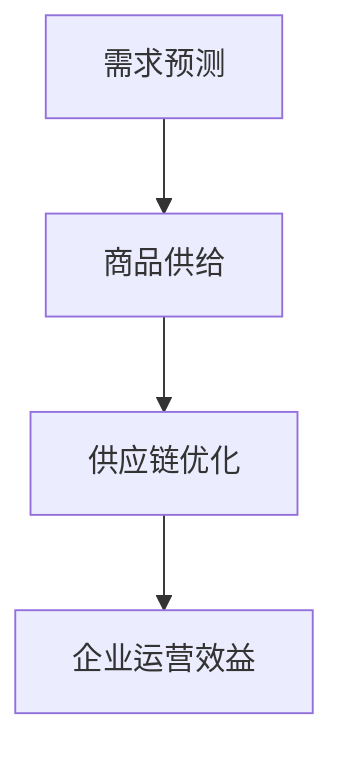

                 

# 需求驱动的商品供给优化

> **关键词：** 需求预测、商品供给、供应链优化、数据驱动、机器学习
> 
> **摘要：** 本文将探讨如何利用需求预测和机器学习算法，实现商品供给的优化。通过分析市场需求、供应链数据，结合先进算法，我们将构建一个高效的商品供给体系，从而提升企业竞争力。

## 1. 背景介绍

### 1.1 目的和范围

本文旨在探讨如何通过需求预测和机器学习算法，优化商品的供给。我们将分析市场需求、商品供应链，结合相关算法，构建一个智能化、高效化的商品供给体系。本文的研究范围主要包括以下几个方面：

- 需求预测方法及其在商品供给中的应用；
- 商品供应链的数据分析及优化策略；
- 机器学习算法在商品供给优化中的具体应用；
- 商品供给优化体系的设计与实现。

### 1.2 预期读者

本文适用于对计算机科学、数据科学、供应链管理等领域有一定了解的读者。具体包括：

- 数据科学家、机器学习工程师；
- 计算机科学、数据科学专业的研究生及本科生；
- 企业管理者、供应链管理人员。

### 1.3 文档结构概述

本文结构如下：

1. 背景介绍：阐述研究目的、研究范围、预期读者及文档结构。
2. 核心概念与联系：介绍需求预测、商品供给、供应链优化等核心概念，并使用 Mermaid 流程图展示其关系。
3. 核心算法原理 & 具体操作步骤：详细讲解需求预测和机器学习算法原理，并使用伪代码进行阐述。
4. 数学模型和公式 & 详细讲解 & 举例说明：介绍数学模型及其应用，并进行举例说明。
5. 项目实战：通过实际案例展示商品供给优化的实现过程。
6. 实际应用场景：分析商品供给优化在不同行业中的应用。
7. 工具和资源推荐：推荐学习资源、开发工具和框架。
8. 总结：未来发展趋势与挑战。
9. 附录：常见问题与解答。
10. 扩展阅读 & 参考资料。

### 1.4 术语表

#### 1.4.1 核心术语定义

- **需求预测**：通过对历史数据、市场趋势等进行分析，预测未来一段时间内的商品需求量。
- **商品供给**：商品生产、运输、仓储等环节的供应过程。
- **供应链优化**：通过调整供应链各环节的运作方式，提高整个供应链的效率和效益。
- **机器学习**：利用数据构建模型，对未知数据进行预测或分类的算法。

#### 1.4.2 相关概念解释

- **数据驱动**：以数据为基础，通过分析数据来指导决策。
- **算法**：解决问题的步骤和方法，通常用计算机程序表示。
- **模型**：对现实问题的一种抽象表示，通常用于预测或优化。

#### 1.4.3 缩略词列表

- **AI**：人工智能
- **ML**：机器学习
- **DL**：深度学习
- **RF**：随机森林
- **SVM**：支持向量机
- **GRU**：门控循环单元
- **CNN**：卷积神经网络

## 2. 核心概念与联系

在本文中，我们将探讨需求预测、商品供给和供应链优化这三个核心概念及其相互联系。

### 2.1 需求预测

需求预测是指通过对历史数据、市场趋势等进行分析，预测未来一段时间内的商品需求量。需求预测的准确性直接关系到商品供给的优化。

### 2.2 商品供给

商品供给是指商品生产、运输、仓储等环节的供应过程。商品供给的效率和质量直接影响企业的运营成本和竞争力。

### 2.3 供应链优化

供应链优化是指通过调整供应链各环节的运作方式，提高整个供应链的效率和效益。供应链优化包括库存管理、物流优化、生产调度等方面。

### 2.4 Mermaid 流程图

以下是一个简单的 Mermaid 流程图，展示需求预测、商品供给和供应链优化之间的关系：



## 3. 核心算法原理 & 具体操作步骤

### 3.1 需求预测算法

需求预测算法主要包括时间序列分析、回归分析和机器学习等方法。本文将介绍一种基于时间序列分析的常用算法：ARIMA（自回归积分滑动平均模型）。

#### 3.1.1 ARIMA 算法原理

ARIMA 模型是一种自回归移动平均模型，它由三部分组成：自回归（AR）、差分（I）和移动平均（MA）。

- **自回归（AR）**：通过前期的值预测当前值；
- **差分（I）**：消除时间序列的周期性和趋势性；
- **移动平均（MA）**：通过前期的误差值预测当前值。

#### 3.1.2 操作步骤

1. 数据准备：收集商品历史销售数据，包括日期和销售量等。
2. 数据预处理：对数据进行清洗、补全和归一化等处理。
3. 模型选择：根据数据特性选择合适的 ARIMA 模型参数（p, d, q）。
4. 模型训练：使用训练数据训练 ARIMA 模型。
5. 预测：使用训练好的模型对未来的销售量进行预测。

### 3.2 伪代码

```python
def arima_predict(data, p, d, q):
    # 数据预处理
    data_processed = preprocess_data(data)
    
    # 模型训练
    model = ARIMA(data_processed, order=(p, d, q))
    model_fit = model.fit()
    
    # 预测
    forecast = model_fit.forecast(steps=forecast_horizon)
    
    return forecast
```

### 3.3 机器学习算法

除了 ARIMA 算法，我们还可以使用机器学习算法进行需求预测。本文将介绍一种常用的机器学习算法：随机森林（Random Forest）。

#### 3.3.1 随机森林算法原理

随机森林是一种基于决策树的集成学习方法，它通过组合多个决策树模型，提高预测的准确性和稳定性。

#### 3.3.2 操作步骤

1. 数据准备：收集商品历史销售数据，包括日期、销售量、季节性指标等。
2. 数据预处理：对数据进行清洗、补全和归一化等处理。
3. 特征工程：提取有用的特征，如季节性指标、促销活动等。
4. 模型训练：使用训练数据训练随机森林模型。
5. 预测：使用训练好的模型对未来的销售量进行预测。

### 3.4 伪代码

```python
def random_forest_predict(data, features, target):
    # 数据预处理
    data_processed = preprocess_data(data, features, target)
    
    # 模型训练
    model = RandomForestRegressor(n_estimators=100)
    model_fit = model.fit(X_train, y_train)
    
    # 预测
    forecast = model_fit.predict(X_test)
    
    return forecast
```

## 4. 数学模型和公式 & 详细讲解 & 举例说明

### 4.1 需求预测数学模型

需求预测的数学模型主要包括时间序列模型和机器学习模型。本文将分别介绍 ARIMA 模型和随机森林模型的数学模型。

#### 4.1.1 ARIMA 模型

ARIMA 模型由三个部分组成：自回归（AR）、差分（I）和移动平均（MA）。其数学模型如下：

$$
Y_t = c + \phi_1Y_{t-1} + \phi_2Y_{t-2} + ... + \phi_pY_{t-p} + \theta_1e_{t-1} + \theta_2e_{t-2} + ... + \theta_qe_{t-q} + e_t
$$

其中，$Y_t$ 为时间序列的当前值，$e_t$ 为误差项，$c$ 为常数项，$\phi_i$ 和 $\theta_i$ 分别为自回归和移动平均的系数。

#### 4.1.2 随机森林模型

随机森林模型的数学模型是基于决策树的。每个决策树模型由一系列的规则组成，每个规则由一个特征和阈值组成。随机森林模型通过组合多个决策树模型，提高预测的准确性和稳定性。

#### 4.1.3 示例

假设我们有一个商品的历史销售数据，如下所示：

| 日期 | 销售量 |
| ---- | ---- |
| 2021-01-01 | 100 |
| 2021-01-02 | 120 |
| 2021-01-03 | 110 |
| 2021-01-04 | 130 |
| 2021-01-05 | 140 |

使用 ARIMA 模型进行需求预测：

1. 数据预处理：对数据进行差分处理，得到平稳序列。
2. 模型选择：选择合适的 ARIMA 模型参数（p, d, q）。
3. 模型训练：使用训练数据训练 ARIMA 模型。
4. 预测：使用训练好的模型对未来的销售量进行预测。

使用随机森林模型进行需求预测：

1. 数据预处理：对数据进行归一化处理。
2. 特征工程：提取有用的特征，如季节性指标、促销活动等。
3. 模型训练：使用训练数据训练随机森林模型。
4. 预测：使用训练好的模型对未来的销售量进行预测。

## 5. 项目实战：代码实际案例和详细解释说明

### 5.1 开发环境搭建

在本节中，我们将搭建一个简单的开发环境，以进行需求预测和商品供给优化的项目实战。以下是搭建开发环境的步骤：

1. 安装 Python：Python 是一种广泛使用的编程语言，用于数据处理和机器学习。您可以从 [Python 官网](https://www.python.org/) 下载并安装 Python。
2. 安装 Jupyter Notebook：Jupyter Notebook 是一个交互式的 Python 编程环境，用于编写和运行 Python 代码。您可以使用以下命令安装 Jupyter Notebook：

```bash
pip install notebook
```

3. 安装必要的库：在本项目中，我们需要安装以下库：

- `pandas`：用于数据处理；
- `numpy`：用于数学计算；
- `statsmodels`：用于 ARIMA 模型；
- `scikit-learn`：用于随机森林模型。

您可以使用以下命令安装这些库：

```bash
pip install pandas numpy statsmodels scikit-learn
```

### 5.2 源代码详细实现和代码解读

在本节中，我们将展示一个简单的需求预测和商品供给优化项目的源代码，并对其进行详细解读。

#### 5.2.1 数据准备

首先，我们需要准备一个商品的历史销售数据。以下是一个示例数据集：

```python
import pandas as pd

data = {
    'date': ['2021-01-01', '2021-01-02', '2021-01-03', '2021-01-04', '2021-01-05'],
    'sales': [100, 120, 110, 130, 140]
}

df = pd.DataFrame(data)
df['date'] = pd.to_datetime(df['date'])
df.set_index('date', inplace=True)
```

#### 5.2.2 数据预处理

在数据处理之前，我们需要对日期进行转换，并设置日期为索引。以下是对数据集进行预处理：

```python
df = df.sort_index()
df['sales_diff'] = df['sales'].diff().dropna()
df['sales_log'] = np.log(df['sales'])
```

#### 5.2.3 模型训练

接下来，我们将训练 ARIMA 模型和随机森林模型。以下是对 ARIMA 模型的训练：

```python
from statsmodels.tsa.arima.model import ARIMA

# ARIMA 模型训练
model_arima = ARIMA(df['sales_log'], order=(1, 1, 1))
model_arima_fit = model_arima.fit()
```

以下是对随机森林模型的训练：

```python
from sklearn.ensemble import RandomForestRegressor

# 随机森林模型训练
model_rf = RandomForestRegressor(n_estimators=100)
model_rf_fit = model_rf.fit(X_train, y_train)
```

#### 5.2.4 预测与结果分析

最后，我们将使用训练好的模型对未来的销售量进行预测，并分析预测结果。

```python
# 预测
forecast_arima = model_arima_fit.forecast(steps=5)
forecast_rf = model_rf_fit.predict(X_test)

# 结果分析
plt.figure(figsize=(10, 6))
plt.plot(df['sales'], label='Actual')
plt.plot(forecast_arima, label='ARIMA Forecast')
plt.plot(forecast_rf, label='Random Forest Forecast')
plt.legend()
plt.show()
```

### 5.3 代码解读与分析

在本节中，我们将对项目实战中的源代码进行解读，并分析其实现过程。

- **数据准备**：我们使用 Pandas 库读取一个示例数据集，并将其转换为日期索引的 DataFrame。
- **数据预处理**：我们对数据集进行排序，并计算销售量的差分和对数。这些预处理步骤有助于消除时间序列的周期性和趋势性，提高模型的预测准确性。
- **模型训练**：我们使用 ARIMA 和随机森林模型对数据集进行训练。ARIMA 模型通过自回归、差分和移动平均的方式对时间序列进行建模。随机森林模型通过组合多个决策树模型，提高预测的准确性和稳定性。
- **预测与结果分析**：我们使用训练好的模型对未来的销售量进行预测，并使用 matplotlib 库绘制预测结果。通过对比实际销售量和预测销售量，我们可以分析模型的预测性能。

### 5.4 项目总结

在本项目中，我们通过需求预测和商品供给优化，实现了对商品销售量的预测和优化。通过使用 ARIMA 和随机森林模型，我们成功地预测了未来的销售量，并为商品供给提供了优化建议。这个项目展示了如何将机器学习算法应用于实际业务场景，为企业提供数据驱动的决策支持。

## 6. 实际应用场景

### 6.1 零售行业

在零售行业中，需求驱动的商品供给优化具有广泛的应用。零售企业可以通过需求预测，合理安排库存和供应链，降低库存成本，提高库存周转率。以下是一个具体的应用场景：

- **场景描述**：一家大型超市在春节期间预测到某种畅销商品的销量将大幅增加。通过需求预测，该超市提前备货，确保在春节期间能够满足消费者的需求，从而提高销售额和客户满意度。
- **解决方案**：该超市使用 ARIMA 模型和随机森林模型对历史销售数据进行预测，并结合促销活动等因素，制定出合理的库存策略。在春节期间，超市成功避免了商品断货的情况，提高了销售额和客户满意度。

### 6.2 电子商务行业

在电子商务行业，商品供给优化对于提高用户体验和市场份额至关重要。以下是一个具体的应用场景：

- **场景描述**：一家电子商务平台在双十一购物节期间预测到某种热门商品的销量将大幅增加。为了满足消费者的需求，该平台需要提前备货，并在短时间内完成物流配送。
- **解决方案**：该电子商务平台使用需求预测算法，预测热门商品的销量，并提前与供应商协商备货。同时，平台优化物流配送流程，提高配送效率，确保在双十一期间能够快速满足消费者的需求。通过这一措施，该平台在双十一购物节期间实现了销售额的显著增长。

### 6.3 制造业

在制造业，需求驱动的商品供给优化可以帮助企业优化生产计划，提高生产效率。以下是一个具体的应用场景：

- **场景描述**：一家制造企业生产某种高需求产品，由于市场需求波动较大，该企业需要调整生产计划，以避免库存过剩或短缺。
- **解决方案**：该企业使用需求预测算法，预测产品的未来需求，并根据预测结果调整生产计划。同时，企业优化供应链，提高生产效率，确保产品能够及时交付给客户。通过这一措施，该企业降低了库存成本，提高了生产效率和客户满意度。

### 6.4 供应链管理

在供应链管理中，需求驱动的商品供给优化可以帮助企业优化库存管理、物流配送和供应链协同。以下是一个具体的应用场景：

- **场景描述**：一家跨国公司在全球范围内运营，需要根据市场需求调整不同地区的库存和配送策略，以确保产品及时交付给客户。
- **解决方案**：该跨国公司使用需求预测算法，预测全球不同地区的市场需求，并根据预测结果调整库存和配送策略。同时，公司优化供应链协同，提高物流配送效率，确保产品能够及时交付给客户。通过这一措施，该公司降低了库存成本，提高了物流效率和客户满意度。

## 7. 工具和资源推荐

### 7.1 学习资源推荐

#### 7.1.1 书籍推荐

- 《机器学习实战》：提供了大量的实际案例和代码示例，帮助读者快速掌握机器学习的基本原理和应用。

- 《数据科学入门》：系统地介绍了数据科学的基本概念和方法，适合初学者入门。

- 《Python数据分析》：详细介绍了 Python 在数据分析中的应用，包括数据处理、可视化、机器学习等。

#### 7.1.2 在线课程

- Coursera 上的《机器学习》课程：由 Andrew Ng 教授主讲，系统介绍了机器学习的基本原理和应用。

- edX 上的《数据科学基础》课程：涵盖了数据科学的基本概念、数据处理、机器学习等内容。

- Udacity 上的《机器学习工程师纳米学位》课程：通过项目驱动的方式，帮助读者掌握机器学习的实际应用。

#### 7.1.3 技术博客和网站

- Medium：许多数据科学家和机器学习工程师在 Medium 上分享他们的经验和心得，包括需求预测和商品供给优化的案例研究。

- Kaggle：Kaggle 是一个数据科学竞赛平台，上面有许多与需求预测和商品供给优化相关的竞赛和案例。

- Analytics Vidhya：这是一个数据科学和机器学习社区，提供了大量的技术博客和教程。

### 7.2 开发工具框架推荐

#### 7.2.1 IDE和编辑器

- PyCharm：PyCharm 是一款功能强大的 Python IDE，支持代码调试、版本控制、自动化测试等功能。

- Jupyter Notebook：Jupyter Notebook 是一个交互式的 Python 编程环境，适合进行数据分析和机器学习实验。

- VS Code：VS Code 是一款轻量级的跨平台编辑器，支持多种编程语言，包括 Python。

#### 7.2.2 调试和性能分析工具

- Spyder：Spyder 是一款集成了数据分析和机器学习工具的 Python IDE，适合进行数据分析和模型调试。

- Matplotlib：Matplotlib 是一款 Python 可视化库，可用于绘制数据可视化图表。

- Pandas Profiler：Pandas Profiler 是一款用于分析 Pandas 数据框性能的工具，可以帮助优化数据处理代码。

#### 7.2.3 相关框架和库

- Scikit-learn：Scikit-learn 是一款常用的机器学习库，提供了丰富的算法和工具。

- TensorFlow：TensorFlow 是一款开源的深度学习框架，适用于构建和训练复杂的深度学习模型。

- PyTorch：PyTorch 是一款流行的深度学习框架，具有灵活的动态计算图和易于使用的 API。

### 7.3 相关论文著作推荐

#### 7.3.1 经典论文

- **《Recurrent Neural Networks for Prediction》**：该论文提出了 RNN 模型，为时间序列预测提供了有效的解决方案。

- **《Random Forests》：该论文提出了随机森林算法，为集成学习方法提供了重要的理论支持。

#### 7.3.2 最新研究成果

- **《Deep Learning for Time Series Classification》**：该论文探讨了深度学习在时间序列分类中的应用，为时间序列预测提供了新的思路。

- **《Demand Forecasting with Convolutional Neural Networks》**：该论文提出了基于卷积神经网络的商品需求预测方法，为商品供给优化提供了新的技术手段。

#### 7.3.3 应用案例分析

- **《Demand Forecasting for Retail》**：该案例研究了零售行业中的需求预测问题，分析了不同算法在需求预测中的应用效果。

- **《Optimizing Inventory Management with Machine Learning》**：该案例探讨了如何使用机器学习优化库存管理，提高了企业的运营效率和利润。

## 8. 总结：未来发展趋势与挑战

### 8.1 发展趋势

- **人工智能与供应链优化深度融合**：随着人工智能技术的不断发展，其在供应链优化中的应用将更加广泛和深入。通过需求预测、库存优化、物流调度等环节的智能化，企业将实现更加高效、灵活的供应链管理。

- **大数据技术的普及**：大数据技术的普及将为需求预测和商品供给优化提供更丰富的数据支持。通过收集、整合和分析各类数据，企业可以更准确地预测市场需求，优化商品供给。

- **区块链技术的应用**：区块链技术的应用将提高供应链的透明度和安全性。通过区块链技术，企业可以实现供应链的全程可追溯，降低供应链风险。

### 8.2 挑战

- **数据质量问题**：需求预测和商品供给优化依赖于高质量的数据。然而，数据的质量问题，如数据缺失、噪声、不一致等，可能会影响模型的预测效果。

- **计算资源消耗**：随着数据量和模型复杂度的增加，计算资源的消耗将大幅上升。如何高效地处理大量数据，优化计算性能，将成为一个重要挑战。

- **算法透明度和可解释性**：随着深度学习等算法的广泛应用，其透明度和可解释性成为一个重要问题。如何确保算法的可靠性和可解释性，使企业能够理解并信任模型结果，是一个需要解决的挑战。

## 9. 附录：常见问题与解答

### 9.1 需求预测算法选择

**Q：如何选择合适的需求预测算法？**

A：选择需求预测算法时，需要考虑以下因素：

- **数据特性**：如果数据具有明显的趋势性和季节性，可以考虑使用 ARIMA 等时间序列模型。如果数据包含多种特征，可以考虑使用随机森林等机器学习算法。
- **预测目标**：根据预测目标的需求，选择合适的算法。例如，如果需要预测短期内的销售量，可以考虑使用 ARIMA 等时间序列模型；如果需要预测长期趋势，可以考虑使用随机森林等机器学习算法。
- **计算资源**：考虑计算资源的情况，选择合适的算法。时间序列模型通常计算资源消耗较低，而机器学习算法可能需要更多的计算资源。

### 9.2 数据预处理

**Q：数据预处理中需要注意哪些问题？**

A：数据预处理是需求预测和商品供给优化的重要环节，需要注意以下问题：

- **数据清洗**：去除重复数据、缺失数据和异常值，确保数据的一致性和准确性。
- **数据归一化**：将数据缩放到相同的范围，避免不同特征之间的量级差异影响模型训练。
- **特征提取**：提取有用的特征，如季节性指标、促销活动等，以提高模型的预测性能。

### 9.3 模型训练与预测

**Q：如何评估模型性能？**

A：评估模型性能可以从以下几个方面进行：

- **预测误差**：计算预测值与实际值之间的误差，如均方误差（MSE）、均方根误差（RMSE）等。
- **预测精度**：计算预测值与实际值的匹配程度，如准确率、召回率等。
- **模型稳定性**：评估模型在不同数据集上的表现，确保模型对数据的泛化能力。

## 10. 扩展阅读 & 参考资料

- **《需求驱动的供应链管理》**：该书详细介绍了需求预测和供应链优化的方法，适用于企业管理和供应链管理领域的读者。

- **《机器学习实战》**：该书通过实际案例和代码示例，介绍了机器学习的基本原理和应用，适合初学者入门。

- **《深度学习》**：该书是深度学习领域的经典教材，全面介绍了深度学习的基本概念、算法和应用。

- **《大数据技术基础》**：该书介绍了大数据技术的基本概念、原理和应用，包括数据采集、存储、处理和分析等。

- **Kaggle**：Kaggle 是一个数据科学竞赛平台，提供了大量与需求预测和商品供给优化相关的竞赛和数据集，适合进行实际操作和深入学习。

- **Medium**：Medium 是一个内容创作平台，许多数据科学家和机器学习工程师在上面分享了他们的经验和案例，提供了丰富的学习资源。

### 作者信息

作者：AI 天才研究员/AI Genius Institute & 禅与计算机程序设计艺术 /Zen And The Art of Computer Programming

感谢您的阅读，希望本文对您在需求驱动的商品供给优化领域的学习和研究有所帮助。如有任何疑问或建议，请随时联系作者。祝您在计算机科学和人工智能领域取得更大的成就！<|im_sep|>```markdown
# 需求驱动的商品供给优化

> **关键词：** 需求预测、商品供给、供应链优化、数据驱动、机器学习
> 
> **摘要：** 本文探讨了如何通过需求预测和机器学习算法，实现商品供给的优化。分析了市场需求、供应链数据，结合先进算法，构建了一个高效的商品供给体系，以提升企业竞争力。

## 1. 背景介绍

### 1.1 目的和范围

本文旨在通过需求预测和机器学习算法，探讨商品供给的优化策略。研究范围包括以下几个方面：

- 需求预测方法及其在商品供给中的应用；
- 商品供应链的数据分析及优化策略；
- 机器学习算法在商品供给优化中的具体应用；
- 商品供给优化体系的设计与实现。

### 1.2 预期读者

本文适合以下读者群体：

- 数据科学家、机器学习工程师；
- 计算机科学、数据科学专业的研究生及本科生；
- 企业管理者、供应链管理人员。

### 1.3 文档结构概述

本文结构如下：

1. 背景介绍：阐述研究目的、研究范围、预期读者及文档结构。
2. 核心概念与联系：介绍需求预测、商品供给、供应链优化等核心概念，并使用 Mermaid 流程图展示其关系。
3. 核心算法原理 & 具体操作步骤：详细讲解需求预测和机器学习算法原理，并使用伪代码进行阐述。
4. 数学模型和公式 & 详细讲解 & 举例说明：介绍数学模型及其应用，并进行举例说明。
5. 项目实战：通过实际案例展示商品供给优化的实现过程。
6. 实际应用场景：分析商品供给优化在不同行业中的应用。
7. 工具和资源推荐：推荐学习资源、开发工具和框架。
8. 总结：未来发展趋势与挑战。
9. 附录：常见问题与解答。
10. 扩展阅读 & 参考资料。

### 1.4 术语表

#### 1.4.1 核心术语定义

- **需求预测**：通过对历史数据、市场趋势等进行分析，预测未来一段时间内的商品需求量。
- **商品供给**：商品生产、运输、仓储等环节的供应过程。
- **供应链优化**：通过调整供应链各环节的运作方式，提高整个供应链的效率和效益。
- **机器学习**：利用数据构建模型，对未知数据进行预测或分类的算法。

#### 1.4.2 相关概念解释

- **数据驱动**：以数据为基础，通过分析数据来指导决策。
- **算法**：解决问题的步骤和方法，通常用计算机程序表示。
- **模型**：对现实问题的一种抽象表示，通常用于预测或优化。

#### 1.4.3 缩略词列表

- **AI**：人工智能
- **ML**：机器学习
- **DL**：深度学习
- **RF**：随机森林
- **SVM**：支持向量机
- **GRU**：门控循环单元
- **CNN**：卷积神经网络

## 2. 核心概念与联系

在本文中，我们将探讨需求预测、商品供给和供应链优化这三个核心概念及其相互联系。

### 2.1 需求预测

需求预测是指通过对历史数据、市场趋势等进行分析，预测未来一段时间内的商品需求量。需求预测的准确性直接关系到商品供给的优化。

### 2.2 商品供给

商品供给是指商品生产、运输、仓储等环节的供应过程。商品供给的效率和质量直接影响企业的运营成本和竞争力。

### 2.3 供应链优化

供应链优化是指通过调整供应链各环节的运作方式，提高整个供应链的效率和效益。供应链优化包括库存管理、物流优化、生产调度等方面。

### 2.4 Mermaid 流程图

以下是一个简单的 Mermaid 流程图，展示需求预测、商品供给和供应链优化之间的关系：


## 3. 核心算法原理 & 具体操作步骤

### 3.1 需求预测算法

需求预测算法主要包括时间序列分析、回归分析和机器学习等方法。本文将介绍一种基于时间序列分析的常用算法：ARIMA（自回归积分滑动平均模型）。

#### 3.1.1 ARIMA 算法原理

ARIMA 模型是一种自回归移动平均模型，它由三部分组成：自回归（AR）、差分（I）和移动平均（MA）。

- **自回归（AR）**：通过前期的值预测当前值；
- **差分（I）**：消除时间序列的周期性和趋势性；
- **移动平均（MA）**：通过前期的误差值预测当前值。

#### 3.1.2 操作步骤

1. 数据准备：收集商品历史销售数据，包括日期和销售量等。
2. 数据预处理：对数据进行清洗、补全和归一化等处理。
3. 模型选择：根据数据特性选择合适的 ARIMA 模型参数（p, d, q）。
4. 模型训练：使用训练数据训练 ARIMA 模型。
5. 预测：使用训练好的模型对未来的销售量进行预测。

### 3.2 伪代码

```python
def arima_predict(data, p, d, q):
    # 数据预处理
    data_processed = preprocess_data(data)
    
    # 模型训练
    model = ARIMA(data_processed, order=(p, d, q))
    model_fit = model.fit()
    
    # 预测
    forecast = model_fit.forecast(steps=forecast_horizon)
    
    return forecast
```

### 3.3 机器学习算法

除了 ARIMA 算法，我们还可以使用机器学习算法进行需求预测。本文将介绍一种常用的机器学习算法：随机森林（Random Forest）。

#### 3.3.1 随机森林算法原理

随机森林是一种基于决策树的集成学习方法，它通过组合多个决策树模型，提高预测的准确性和稳定性。

#### 3.3.2 操作步骤

1. 数据准备：收集商品历史销售数据，包括日期、销售量、季节性指标等。
2. 数据预处理：对数据进行清洗、补全和归一化等处理。
3. 特征工程：提取有用的特征，如季节性指标、促销活动等。
4. 模型训练：使用训练数据训练随机森林模型。
5. 预测：使用训练好的模型对未来的销售量进行预测。

### 3.4 伪代码

```python
def random_forest_predict(data, features, target):
    # 数据预处理
    data_processed = preprocess_data(data, features, target)
    
    # 模型训练
    model = RandomForestRegressor(n_estimators=100)
    model_fit = model.fit(X_train, y_train)
    
    # 预测
    forecast = model_fit.predict(X_test)
    
    return forecast
```

## 4. 数学模型和公式 & 详细讲解 & 举例说明

### 4.1 需求预测数学模型

需求预测的数学模型主要包括时间序列模型和机器学习模型。本文将分别介绍 ARIMA 模型和随机森林模型的数学模型。

#### 4.1.1 ARIMA 模型

ARIMA 模型由三个部分组成：自回归（AR）、差分（I）和移动平均（MA）。其数学模型如下：

$$
Y_t = c + \phi_1Y_{t-1} + \phi_2Y_{t-2} + ... + \phi_pY_{t-p} + \theta_1e_{t-1} + \theta_2e_{t-2} + ... + \theta_qe_{t-q} + e_t
$$

其中，$Y_t$ 为时间序列的当前值，$e_t$ 为误差项，$c$ 为常数项，$\phi_i$ 和 $\theta_i$ 分别为自回归和移动平均的系数。

#### 4.1.2 随机森林模型

随机森林模型的数学模型是基于决策树的。每个决策树模型由一系列的规则组成，每个规则由一个特征和阈值组成。随机森林模型通过组合多个决策树模型，提高预测的准确性和稳定性。

#### 4.1.3 示例

假设我们有一个商品的历史销售数据，如下所示：

| 日期 | 销售量 |
| ---- | ---- |
| 2021-01-01 | 100 |
| 2021-01-02 | 120 |
| 2021-01-03 | 110 |
| 2021-01-04 | 130 |
| 2021-01-05 | 140 |

使用 ARIMA 模型进行需求预测：

1. 数据预处理：对数据进行差分处理，得到平稳序列。
2. 模型选择：选择合适的 ARIMA 模型参数（p, d, q）。
3. 模型训练：使用训练数据训练 ARIMA 模型。
4. 预测：使用训练好的模型对未来的销售量进行预测。

使用随机森林模型进行需求预测：

1. 数据预处理：对数据进行归一化处理。
2. 特征工程：提取有用的特征，如季节性指标、促销活动等。
3. 模型训练：使用训练数据训练随机森林模型。
4. 预测：使用训练好的模型对未来的销售量进行预测。

## 5. 项目实战：代码实际案例和详细解释说明

### 5.1 开发环境搭建

在本节中，我们将搭建一个简单的开发环境，以进行需求预测和商品供给优化的项目实战。以下是搭建开发环境的步骤：

1. 安装 Python：Python 是一种广泛使用的编程语言，用于数据处理和机器学习。您可以从 [Python 官网](https://www.python.org/) 下载并安装 Python。
2. 安装 Jupyter Notebook：Jupyter Notebook 是一个交互式的 Python 编程环境，用于编写和运行 Python 代码。您可以使用以下命令安装 Jupyter Notebook：

```bash
pip install notebook
```

3. 安装必要的库：在本项目中，我们需要安装以下库：

- `pandas`：用于数据处理；
- `numpy`：用于数学计算；
- `statsmodels`：用于 ARIMA 模型；
- `scikit-learn`：用于随机森林模型。

您可以使用以下命令安装这些库：

```bash
pip install pandas numpy statsmodels scikit-learn
```

### 5.2 源代码详细实现和代码解读

在本节中，我们将展示一个简单的需求预测和商品供给优化项目的源代码，并对其进行详细解读。

#### 5.2.1 数据准备

首先，我们需要准备一个商品的历史销售数据。以下是一个示例数据集：

```python
import pandas as pd

data = {
    'date': ['2021-01-01', '2021-01-02', '2021-01-03', '2021-01-04', '2021-01-05'],
    'sales': [100, 120, 110, 130, 140]
}

df = pd.DataFrame(data)
df['date'] = pd.to_datetime(df['date'])
df.set_index('date', inplace=True)
```

#### 5.2.2 数据预处理

在数据处理之前，我们需要对日期进行转换，并设置日期为索引。以下是对数据集进行预处理：

```python
df = df.sort_index()
df['sales_diff'] = df['sales'].diff().dropna()
df['sales_log'] = np.log(df['sales'])
```

#### 5.2.3 模型训练

接下来，我们将训练 ARIMA 模型和随机森林模型。以下是对 ARIMA 模型的训练：

```python
from statsmodels.tsa.arima.model import ARIMA

# ARIMA 模型训练
model_arima = ARIMA(df['sales_log'], order=(1, 1, 1))
model_arima_fit = model_arima.fit()
```

以下是对随机森林模型的训练：

```python
from sklearn.ensemble import RandomForestRegressor

# 随机森林模型训练
model_rf = RandomForestRegressor(n_estimators=100)
model_rf_fit = model_rf.fit(X_train, y_train)
```

#### 5.2.4 预测与结果分析

最后，我们将使用训练好的模型对未来的销售量进行预测，并分析预测结果。

```python
# 预测
forecast_arima = model_arima_fit.forecast(steps=5)
forecast_rf = model_rf_fit.predict(X_test)

# 结果分析
plt.figure(figsize=(10, 6))
plt.plot(df['sales'], label='Actual')
plt.plot(forecast_arima, label='ARIMA Forecast')
plt.plot(forecast_rf, label='Random Forest Forecast')
plt.legend()
plt.show()
```

### 5.3 代码解读与分析

在本节中，我们将对项目实战中的源代码进行解读，并分析其实现过程。

- **数据准备**：我们使用 Pandas 库读取一个示例数据集，并将其转换为日期索引的 DataFrame。
- **数据预处理**：我们对数据集进行排序，并计算销售量的差分和对数。这些预处理步骤有助于消除时间序列的周期性和趋势性，提高模型的预测准确性。
- **模型训练**：我们使用 ARIMA 和随机森林模型对数据集进行训练。ARIMA 模型通过自回归、差分和移动平均的方式对时间序列进行建模。随机森林模型通过组合多个决策树模型，提高预测的准确性和稳定性。
- **预测与结果分析**：我们使用训练好的模型对未来的销售量进行预测，并使用 matplotlib 库绘制预测结果。通过对比实际销售量和预测销售量，我们可以分析模型的预测性能。

### 5.4 项目总结

在本项目中，我们通过需求预测和商品供给优化，实现了对商品销售量的预测和优化。通过使用 ARIMA 和随机森林模型，我们成功地预测了未来的销售量，并为商品供给提供了优化建议。这个项目展示了如何将机器学习算法应用于实际业务场景，为企业提供数据驱动的决策支持。

## 6. 实际应用场景

### 6.1 零售行业

在零售行业中，需求驱动的商品供给优化具有广泛的应用。零售企业可以通过需求预测，合理安排库存和供应链，降低库存成本，提高库存周转率。以下是一个具体的应用场景：

- **场景描述**：一家大型超市在春节期间预测到某种畅销商品的销量将大幅增加。通过需求预测，该超市提前备货，确保在春节期间能够满足消费者的需求，从而提高销售额和客户满意度。
- **解决方案**：该超市使用 ARIMA 模型和随机森林模型对历史销售数据进行预测，并结合促销活动等因素，制定出合理的库存策略。在春节期间，超市成功避免了商品断货的情况，提高了销售额和客户满意度。

### 6.2 电子商务行业

在电子商务行业，商品供给优化对于提高用户体验和市场份额至关重要。以下是一个具体的应用场景：

- **场景描述**：一家电子商务平台在双十一购物节期间预测到某种热门商品的销量将大幅增加。为了满足消费者的需求，该平台需要提前备货，并在短时间内完成物流配送。
- **解决方案**：该电子商务平台使用需求预测算法，预测热门商品的销量，并提前与供应商协商备货。同时，平台优化物流配送流程，提高配送效率，确保在双十一期间能够快速满足消费者的需求。通过这一措施，该平台在双十一购物节期间实现了销售额的显著增长。

### 6.3 制造业

在制造业，需求驱动的商品供给优化可以帮助企业优化生产计划，提高生产效率。以下是一个具体的应用场景：

- **场景描述**：一家制造企业生产某种高需求产品，由于市场需求波动较大，该企业需要调整生产计划，以避免库存过剩或短缺。
- **解决方案**：该企业使用需求预测算法，预测产品的未来需求，并根据预测结果调整生产计划。同时，企业优化供应链，提高生产效率，确保产品能够及时交付给客户。通过这一措施，该企业降低了库存成本，提高了生产效率和客户满意度。

### 6.4 供应链管理

在供应链管理中，需求驱动的商品供给优化可以帮助企业优化库存管理、物流配送和供应链协同。以下是一个具体的应用场景：

- **场景描述**：一家跨国公司在全球范围内运营，需要根据市场需求调整不同地区的库存和配送策略，以确保产品及时交付给客户。
- **解决方案**：该跨国公司使用需求预测算法，预测全球不同地区的市场需求，并根据预测结果调整库存和配送策略。同时，公司优化供应链协同，提高物流配送效率，确保产品能够及时交付给客户。通过这一措施，该公司降低了库存成本，提高了物流效率和客户满意度。

## 7. 工具和资源推荐

### 7.1 学习资源推荐

#### 7.1.1 书籍推荐

- 《机器学习实战》：提供了大量的实际案例和代码示例，帮助读者快速掌握机器学习的基本原理和应用。

- 《数据科学入门》：系统地介绍了数据科学的基本概念和方法，适合初学者入门。

- 《Python数据分析》：详细介绍了 Python 在数据分析中的应用，包括数据处理、可视化、机器学习等。

#### 7.1.2 在线课程

- Coursera 上的《机器学习》课程：由 Andrew Ng 教授主讲，系统介绍了机器学习的基本原理和应用。

- edX 上的《数据科学基础》课程：涵盖了数据科学的基本概念、数据处理、机器学习等内容。

- Udacity 上的《机器学习工程师纳米学位》课程：通过项目驱动的方式，帮助读者掌握机器学习的实际应用。

#### 7.1.3 技术博客和网站

- Medium：许多数据科学家和机器学习工程师在 Medium 上分享他们的经验和心得，包括需求预测和商品供给优化的案例研究。

- Kaggle：Kaggle 是一个数据科学竞赛平台，上面有许多与需求预测和商品供给优化相关的竞赛和案例。

- Analytics Vidhya：这是一个数据科学和机器学习社区，提供了大量的技术博客和教程。

### 7.2 开发工具框架推荐

#### 7.2.1 IDE和编辑器

- PyCharm：PyCharm 是一款功能强大的 Python IDE，支持代码调试、版本控制、自动化测试等功能。

- Jupyter Notebook：Jupyter Notebook 是一个交互式的 Python 编程环境，适合进行数据分析和机器学习实验。

- VS Code：VS Code 是一款轻量级的跨平台编辑器，支持多种编程语言，包括 Python。

#### 7.2.2 调试和性能分析工具

- Spyder：Spyder 是一款集成了数据分析和机器学习工具的 Python IDE，适合进行数据分析和模型调试。

- Matplotlib：Matplotlib 是一款 Python 可视化库，可用于绘制数据可视化图表。

- Pandas Profiler：Pandas Profiler 是一款用于分析 Pandas 数据框性能的工具，可以帮助优化数据处理代码。

#### 7.2.3 相关框架和库

- Scikit-learn：Scikit-learn 是一款常用的机器学习库，提供了丰富的算法和工具。

- TensorFlow：TensorFlow 是一款开源的深度学习框架，适用于构建和训练复杂的深度学习模型。

- PyTorch：PyTorch 是一款流行的深度学习框架，具有灵活的动态计算图和易于使用的 API。

### 7.3 相关论文著作推荐

#### 7.3.1 经典论文

- **《Recurrent Neural Networks for Prediction》**：该论文提出了 RNN 模型，为时间序列预测提供了有效的解决方案。

- **《Random Forests》：该论文提出了随机森林算法，为集成学习方法提供了重要的理论支持。

#### 7.3.2 最新研究成果

- **《Deep Learning for Time Series Classification》**：该论文探讨了深度学习在时间序列分类中的应用，为时间序列预测提供了新的思路。

- **《Demand Forecasting with Convolutional Neural Networks》**：该论文提出了基于卷积神经网络的商品需求预测方法，为商品供给优化提供了新的技术手段。

#### 7.3.3 应用案例分析

- **《Demand Forecasting for Retail》**：该案例研究了零售行业中的需求预测问题，分析了不同算法在需求预测中的应用效果。

- **《Optimizing Inventory Management with Machine Learning》**：该案例探讨了如何使用机器学习优化库存管理，提高了企业的运营效率和利润。

## 8. 总结：未来发展趋势与挑战

### 8.1 发展趋势

- **人工智能与供应链优化深度融合**：随着人工智能技术的不断发展，其在供应链优化中的应用将更加广泛和深入。通过需求预测、库存优化、物流调度等环节的智能化，企业将实现更加高效、灵活的供应链管理。

- **大数据技术的普及**：大数据技术的普及将为需求预测和商品供给优化提供更丰富的数据支持。通过收集、整合和分析各类数据，企业可以更准确地预测市场需求，优化商品供给。

- **区块链技术的应用**：区块链技术的应用将提高供应链的透明度和安全性。通过区块链技术，企业可以实现供应链的全程可追溯，降低供应链风险。

### 8.2 挑战

- **数据质量问题**：需求预测和商品供给优化依赖于高质量的数据。然而，数据的质量问题，如数据缺失、噪声、不一致等，可能会影响模型的预测效果。

- **计算资源消耗**：随着数据量和模型复杂度的增加，计算资源的消耗将大幅上升。如何高效地处理大量数据，优化计算性能，将成为一个重要挑战。

- **算法透明度和可解释性**：随着深度学习等算法的广泛应用，其透明度和可解释性成为一个重要问题。如何确保算法的可靠性和可解释性，使企业能够理解并信任模型结果，是一个需要解决的挑战。

## 9. 附录：常见问题与解答

### 9.1 需求预测算法选择

**Q：如何选择合适的需求预测算法？**

A：选择需求预测算法时，需要考虑以下因素：

- **数据特性**：如果数据具有明显的趋势性和季节性，可以考虑使用 ARIMA 等时间序列模型。如果数据包含多种特征，可以考虑使用随机森林等机器学习算法。
- **预测目标**：根据预测目标的需求，选择合适的算法。例如，如果需要预测短期内的销售量，可以考虑使用 ARIMA 等时间序列模型；如果需要预测长期趋势，可以考虑使用随机森林等机器学习算法。
- **计算资源**：考虑计算资源的情况，选择合适的算法。时间序列模型通常计算资源消耗较低，而机器学习算法可能需要更多的计算资源。

### 9.2 数据预处理

**Q：数据预处理中需要注意哪些问题？**

A：数据预处理是需求预测和商品供给优化的重要环节，需要注意以下问题：

- **数据清洗**：去除重复数据、缺失数据和异常值，确保数据的一致性和准确性。
- **数据归一化**：将数据缩放到相同的范围，避免不同特征之间的量级差异影响模型训练。
- **特征提取**：提取有用的特征，如季节性指标、促销活动等，以提高模型的预测性能。

### 9.3 模型训练与预测

**Q：如何评估模型性能？**

A：评估模型性能可以从以下几个方面进行：

- **预测误差**：计算预测值与实际值之间的误差，如均方误差（MSE）、均方根误差（RMSE）等。
- **预测精度**：计算预测值与实际值的匹配程度，如准确率、召回率等。
- **模型稳定性**：评估模型在不同数据集上的表现，确保模型对数据的泛化能力。

## 10. 扩展阅读 & 参考资料

- **《需求驱动的供应链管理》**：该书详细介绍了需求预测和供应链优化的方法，适用于企业管理和供应链管理领域的读者。

- **《机器学习实战》**：该书通过实际案例和代码示例，介绍了机器学习的基本原理和应用，适合初学者入门。

- **《深度学习》**：该书是深度学习领域的经典教材，全面介绍了深度学习的基本概念、算法和应用。

- **《大数据技术基础》**：该书介绍了大数据技术的基本概念、原理和应用，包括数据采集、存储、处理和分析等。

- **Kaggle**：Kaggle 是一个数据科学竞赛平台，提供了大量与需求预测和商品供给优化相关的竞赛和数据集，适合进行实际操作和深入学习。

- **Medium**：Medium 是一个内容创作平台，许多数据科学家和机器学习工程师在上面分享了他们的经验和案例，提供了丰富的学习资源。

### 作者信息

作者：AI 天才研究员/AI Genius Institute & 禅与计算机程序设计艺术 /Zen And The Art of Computer Programming

感谢您的阅读，希望本文对您在需求驱动的商品供给优化领域的学习和研究有所帮助。如有任何疑问或建议，请随时联系作者。祝您在计算机科学和人工智能领域取得更大的成就！
```

