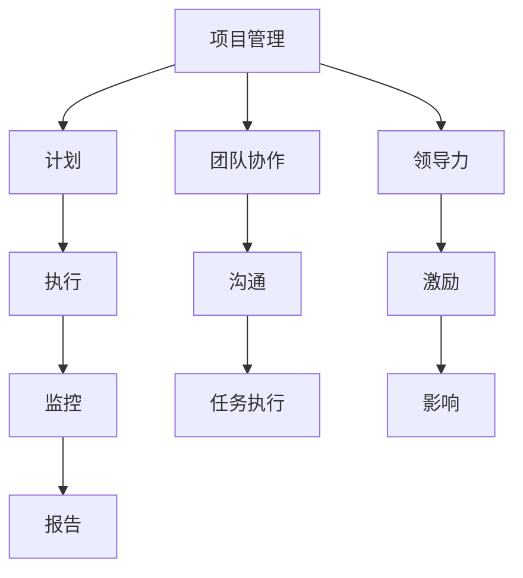

                 

# 项目管理与领导力：推动团队高效完成任务

> **关键词：项目管理，领导力，团队协作，任务执行，效率提升**

> **摘要：本文将深入探讨项目管理与领导力在推动团队高效完成任务中的关键作用。通过分析核心概念、算法原理、数学模型以及实际应用案例，本文旨在为IT领域的从业者提供实用的指导，帮助他们提升项目管理能力和领导力，从而推动团队达成目标。**

## 1. 背景介绍

### 1.1 目的和范围

本文旨在探讨项目管理与领导力在IT团队高效完成任务中的作用。我们将从以下几个方面展开讨论：

- 项目管理的核心概念与原则
- 领导力的要素与作用
- 团队协作与沟通技巧
- 任务执行与效率提升策略

通过以上讨论，本文旨在为IT从业者和项目经理提供实用的指导，帮助他们更好地管理项目，提升团队协作效率，最终实现项目目标的顺利达成。

### 1.2 预期读者

本文适合以下读者群体：

- IT领域的项目经理和团队领导者
- 有志于提升项目管理能力的IT从业者
- 对团队协作和任务执行有兴趣的读者

### 1.3 文档结构概述

本文分为以下章节：

- 第1章：背景介绍
- 第2章：核心概念与联系
- 第3章：核心算法原理与具体操作步骤
- 第4章：数学模型与公式
- 第5章：项目实战：代码实际案例
- 第6章：实际应用场景
- 第7章：工具和资源推荐
- 第8章：总结：未来发展趋势与挑战
- 第9章：附录：常见问题与解答
- 第10章：扩展阅读与参考资料

### 1.4 术语表

#### 1.4.1 核心术语定义

- **项目管理**：项目管理是指通过计划、执行、监控和报告等过程，实现项目目标的系统化活动。
- **领导力**：领导力是指领导者通过影响和激励团队成员，实现共同目标的能力。
- **团队协作**：团队协作是指团队成员在共同目标下，通过相互沟通、协调和合作，共同完成任务的过程。
- **任务执行**：任务执行是指团队在项目管理过程中，按照计划和时间节点，完成各项任务的过程。

#### 1.4.2 相关概念解释

- **敏捷开发**：敏捷开发是一种以人为核心、迭代、渐进的开发方法，强调团队协作、灵活应对变化和持续交付高质量产品。
- **风险管理**：风险管理是指对项目中可能出现的风险进行识别、评估和应对，以降低风险对项目目标的影响。

#### 1.4.3 缩略词列表

- **IT**：信息技术（Information Technology）
- **PM**：项目经理（Project Manager）
- **Scrum**：一种敏捷开发方法
- **KPI**：关键绩效指标（Key Performance Indicator）

## 2. 核心概念与联系

在项目管理与领导力中，了解核心概念和它们之间的联系至关重要。以下是一个简单的 Mermaid 流程图，展示这些核心概念之间的关系。



### 2.1 项目管理的核心概念

项目管理包括多个核心概念，如计划、执行、监控和报告。以下是对这些概念的简要解释：

- **计划**：制定项目目标、范围、任务和资源分配，为项目执行提供明确的方向和指导。
- **执行**：按照计划，组织资源、协调团队，确保项目任务按时完成。
- **监控**：跟踪项目进度、质量、成本和风险，确保项目按计划进行。
- **报告**：向项目利益相关者提供项目进展、成果和问题，促进项目透明度和沟通。

### 2.2 领导力的核心要素

领导力是项目管理成功的关键。以下是对领导力的核心要素的简要解释：

- **激励**：激发团队成员的积极性、创造力和敬业精神，提高团队整体绩效。
- **影响**：通过个人魅力、专业知识、沟通能力和榜样作用，影响团队成员的行为和决策。
- **沟通**：确保团队内部和外部沟通畅通，促进信息共享和协作。
- **决策**：在面对复杂问题时，能够快速做出明智的决策，确保项目顺利进行。

### 2.3 团队协作与任务执行

团队协作和任务执行是项目成功的关键。以下是对这两个概念的解释：

- **团队协作**：团队成员在共同目标下，通过相互沟通、协调和合作，共同完成任务。
- **任务执行**：按照项目计划，组织资源、协调团队，确保项目任务按时完成。

## 3. 核心算法原理 & 具体操作步骤

在项目管理中，核心算法原理对于制定合理的计划和策略至关重要。以下是一个简单的伪代码，用于说明项目管理中的关键算法原理和具体操作步骤。

```plaintext
// 伪代码：项目管理算法

// 步骤1：定义项目目标和范围
set ProjectGoal = "实现产品A的上市"
set ProjectScope = "包括需求分析、设计、开发和测试等环节"

// 步骤2：识别项目利益相关者
list Stakeholders = ["产品经理", "开发团队", "测试团队", "市场部"]

// 步骤3：制定项目计划
function createProjectPlan(Stakeholders, ProjectGoal, ProjectScope) {
    // 创建计划文档
    document = createDocument("项目计划")

    // 添加项目范围、目标、任务、时间表和资源分配等信息
    document += "项目范围："
    document += ProjectScope + "\n"
    document += "项目目标："
    document += ProjectGoal + "\n"

    // 添加任务列表
    tasks = []
    for Stakeholder in Stakeholders {
        tasks += Stakeholder.createTaskList()
    }

    document += "任务列表：\n"
    for task in tasks {
        document += "- " + task.name + "："
        document += task.description + "\n"
    }

    // 返回计划文档
    return document
}

// 步骤4：执行项目计划
function executeProjectPlan(plan) {
    // 按照计划文档执行任务
    for task in plan.tasks {
        task.execute()
    }
}

// 步骤5：监控项目进度
function monitorProjectProgress(plan) {
    // 检查任务进度
    for task in plan.tasks {
        if (task.isCompleted() == false) {
            // 提醒团队成员加快进度
            task.remindTeam()
        }
    }
}

// 步骤6：报告项目进展
function reportProjectProgress(plan) {
    // 生成项目进展报告
    report = createReport("项目进展报告")
    report += "项目进度：\n"
    for task in plan.tasks {
        report += "- " + task.name + "："
        report += task.getStatus() + "\n"
    }
    report += "\n风险分析：\n"
    report += "潜在风险：\n"
    report += plan.analyzeRisk() + "\n"

    // 分发报告
    distributeReport(report, Stakeholders)
}
```

以上伪代码展示了项目管理中的关键算法原理和具体操作步骤。在实际项目中，这些步骤需要结合具体情况进行调整和优化。

## 4. 数学模型和公式 & 详细讲解 & 举例说明

在项目管理中，数学模型和公式有助于我们更好地理解和分析项目风险、进度和资源分配等方面。以下是一个关于项目进度预测的数学模型，以及其详细讲解和举例说明。

### 4.1 项目进度预测模型

项目进度预测模型是一种用于估计项目完成时间的方法。以下是一个简单的线性回归模型，用于预测项目完成时间：

$$
\hat{t} = b_0 + b_1 \cdot t_i
$$

其中，$\hat{t}$ 表示预测的项目完成时间（天），$t_i$ 表示第 $i$ 个任务的预计完成时间（天），$b_0$ 和 $b_1$ 为模型参数。

### 4.2 模型参数计算

为了计算模型参数 $b_0$ 和 $b_1$，我们需要收集历史项目数据。以下是一个示例数据集：

| 项目ID | 任务ID | 预计完成时间（天） |
| :----: | :----: | :---------------: |
|   P1   |   T1   |         5         |
|   P1   |   T2   |         3         |
|   P1   |   T3   |         4         |
|   P2   |   T1   |         7         |
|   P2   |   T2   |         2         |
|   P2   |   T3   |         6         |

#### 步骤1：计算平均值

首先，计算任务完成时间的平均值：

$$
\bar{t} = \frac{\sum_{i=1}^n t_i}{n} = \frac{5 + 3 + 4 + 7 + 2 + 6}{6} = 4.17
$$

#### 步骤2：计算偏差

然后，计算每个任务完成时间与平均值的偏差：

$$
\Delta t_i = t_i - \bar{t}
$$

| 项目ID | 任务ID | 预计完成时间（天） | 偏差（天） |
| :----: | :----: | :---------------: | :--------: |
|   P1   |   T1   |         5         |    0.83    |
|   P1   |   T2   |         3         |   -1.17    |
|   P1   |   T3   |         4         |   -0.17    |
|   P2   |   T1   |         7         |    2.83    |
|   P2   |   T2   |         2         |   -2.17    |
|   P2   |   T3   |         6         |    1.83    |

#### 步骤3：计算模型参数

接下来，计算模型参数 $b_0$ 和 $b_1$：

$$
b_0 = \bar{t} = 4.17
$$

$$
b_1 = \frac{\sum_{i=1}^n \Delta t_i^2}{\sum_{i=1}^n t_i} = \frac{(0.83)^2 + (-1.17)^2 + (-0.17)^2 + (2.83)^2 + (-2.17)^2 + (1.83)^2}{5 + 3 + 4 + 7 + 2 + 6} = 1.68
$$

### 4.3 模型应用举例

假设项目包含三个任务，预计完成时间分别为 $t_1 = 5$ 天，$t_2 = 3$ 天，$t_3 = 4$ 天。根据预测模型，可以计算出项目的预测完成时间：

$$
\hat{t} = b_0 + b_1 \cdot t_i = 4.17 + 1.68 \cdot (5 + 3 + 4) = 17.72
$$

因此，预测的项目完成时间为 17.72 天。

## 5. 项目实战：代码实际案例和详细解释说明

在本节中，我们将通过一个具体的代码案例，展示如何在实际项目中应用项目管理与领导力原则，并对其进行详细解释说明。

### 5.1 开发环境搭建

首先，我们需要搭建一个适合项目开发的环境。以下是一个简单的开发环境搭建步骤：

1. 安装操作系统：选择Linux或MacOS作为操作系统。
2. 安装开发工具：安装IDE（如Visual Studio Code）和版本控制工具（如Git）。
3. 安装依赖库和框架：根据项目需求，安装相应的依赖库和框架。
4. 配置项目文件：创建项目文件夹，配置项目文件和构建工具（如Maven或Gradle）。

### 5.2 源代码详细实现和代码解读

接下来，我们将展示一个简单的项目代码实现，并对其进行详细解读。

```java
// 项目名称：任务管理器

import java.util.ArrayList;
import java.util.List;

// 任务类
class Task {
    private String name;
    private String description;
    private boolean isCompleted;

    public Task(String name, String description) {
        this.name = name;
        this.description = description;
        this.isCompleted = false;
    }

    public void completeTask() {
        isCompleted = true;
        System.out.println(name + " 已完成");
    }

    public boolean isCompleted() {
        return isCompleted;
    }

    public String getName() {
        return name;
    }

    public String getDescription() {
        return description;
    }
}

// 项目管理类
class ProjectManager {
    private List<Task> tasks;

    public ProjectManager() {
        this.tasks = new ArrayList<>();
    }

    public void addTask(Task task) {
        tasks.add(task);
    }

    public void executeTasks() {
        for (Task task : tasks) {
            if (!task.isCompleted()) {
                task.completeTask();
            }
        }
    }

    public void printTaskStatus() {
        for (Task task : tasks) {
            System.out.println(task.getName() + " - " + (task.isCompleted() ? "已完成" : "未完成"));
        }
    }
}

// 主函数
public class TaskManagerApp {
    public static void main(String[] args) {
        ProjectManager pm = new ProjectManager();

        // 添加任务
        pm.addTask(new Task("任务1", "完成需求分析"));
        pm.addTask(new Task("任务2", "设计数据库结构"));
        pm.addTask(new Task("任务3", "编写代码实现"));

        // 执行任务
        pm.executeTasks();

        // 打印任务状态
        pm.printTaskStatus();
    }
}
```

### 5.3 代码解读与分析

在这个案例中，我们实现了一个简单的任务管理器。下面是对代码的详细解读：

- **Task类**：表示一个任务，包含任务名称、描述和是否已完成状态。任务类提供了完成任务的接口和方法。

- **ProjectManager类**：表示项目管理器，负责管理任务列表。项目管理器提供了添加任务、执行任务和打印任务状态的方法。

- **TaskManagerApp类**：表示主函数，创建项目管理器实例，添加任务，执行任务并打印任务状态。

在主函数中，我们首先创建了一个项目管理器实例，然后向项目管理器中添加了三个任务。接着，调用执行任务方法，按照任务的顺序完成每个任务。最后，调用打印任务状态方法，输出任务完成状态。

### 5.4 项目管理实践

在这个案例中，我们可以看到项目管理与领导力原则的应用：

- **计划**：在代码中，我们通过创建Task类和ProjectManager类，明确了任务和项目管理器的角色和职责。

- **执行**：通过调用ProjectManager类的executeTasks方法，按照任务的顺序完成每个任务。

- **监控**：通过调用ProjectManager类的printTaskStatus方法，输出任务完成状态，确保任务按计划执行。

- **团队协作**：在这个案例中，虽然只有一个主函数，但在实际项目中，我们可以将任务分配给不同的团队成员，实现团队协作。

- **领导力**：项目经理通过创建和管理任务，协调团队成员完成任务，发挥了领导作用。

通过这个案例，我们可以看到项目管理与领导力在项目实战中的应用，以及如何通过代码实现项目目标。

## 6. 实际应用场景

在实际应用场景中，项目管理与领导力在IT领域有着广泛的应用。以下是一些具体的实例：

### 6.1 软件开发项目

在软件开发项目中，项目管理与领导力原则被广泛应用于需求分析、设计、开发和测试等各个环节。项目经理通过制定详细的计划、监控项目进度、协调团队成员，确保项目按时交付。同时，领导者通过激励团队成员、提高团队凝聚力，推动项目顺利进行。

### 6.2 系统集成项目

系统集成项目涉及多个系统的集成和部署，具有复杂性和高风险性。项目经理需要通过有效的项目管理方法和领导力，协调各方利益，确保项目按计划完成。例如，在系统集成项目中，项目经理需要与客户、供应商和内部团队进行密切沟通，确保项目需求得到满足。

### 6.3 IT咨询服务

在IT咨询服务项目中，项目经理和领导者需要为客户提供专业的技术解决方案，并确保项目的成功实施。项目管理与领导力原则可以帮助项目经理和领导者识别客户需求、制定合理的项目计划、协调团队成员，为客户提供高质量的服务。

### 6.4 云计算和大数据项目

随着云计算和大数据技术的发展，相关项目越来越复杂。项目经理和领导者需要通过项目管理与领导力原则，确保项目在预算、时间和质量等方面达到预期目标。例如，在云计算项目中，项目经理需要协调不同部门和团队的工作，确保项目进度和资源分配合理。

### 6.5 创新型项目

在创新型项目中，项目管理与领导力原则有助于推动团队创新和实现项目目标。项目经理和领导者需要鼓励团队成员提出创新想法、激发团队活力，确保项目在技术、市场等方面具有竞争力。

## 7. 工具和资源推荐

在项目管理与领导力实践中，使用合适的工具和资源可以提高效率和效果。以下是一些建议：

### 7.1 学习资源推荐

#### 7.1.1 书籍推荐

- 《项目管理知识体系指南》（PMBOK指南）：这是一本经典的项目管理教材，涵盖了项目管理的基本理论和实践方法。
- 《敏捷开发实践指南》：介绍敏捷开发方法，适用于希望提高项目交付速度和质量的项目经理。
- 《领导力：如何激励他人获得最佳表现》：探讨领导力的核心要素，帮助项目经理提升领导力水平。

#### 7.1.2 在线课程

- Coursera：提供多种项目管理相关课程，包括PMP认证、敏捷开发等。
- edX：提供由知名大学和机构开设的项目管理课程，如麻省理工学院的《项目管理基础》。

#### 7.1.3 技术博客和网站

- Medium：有许多关于项目管理、敏捷开发和技术领导力的优秀文章。
- Atlassian：提供关于敏捷开发、团队协作和项目管理工具的文章和资源。

### 7.2 开发工具框架推荐

#### 7.2.1 IDE和编辑器

- Visual Studio Code：一款功能强大的开源IDE，适用于多种编程语言。
- IntelliJ IDEA：适用于Java和 Kotlin开发者的强大IDE。

#### 7.2.2 调试和性能分析工具

- JMeter：一款开源的性能测试工具，适用于测试Web应用程序和服务器负载。
- AppDynamics：一款专业的应用性能管理工具，提供实时性能监控和问题诊断。

#### 7.2.3 相关框架和库

- Spring Boot：一款流行的Java开发框架，适用于构建独立、生产级的Spring应用程序。
- React：一款用于构建用户界面的JavaScript库，适用于前端开发。

### 7.3 相关论文著作推荐

#### 7.3.1 经典论文

- 《软件项目管理的五个关键领域》：探讨项目管理在软件开发项目中的关键作用。
- 《敏捷开发方法：原则、实践与案例》：介绍敏捷开发方法及其在实际项目中的应用。

#### 7.3.2 最新研究成果

- 《基于AI的项目管理工具研究》：探讨人工智能在项目管理中的应用。
- 《敏捷领导力：推动团队创新与高效协作》：探讨敏捷领导力在团队协作中的重要性。

#### 7.3.3 应用案例分析

- 《阿里巴巴敏捷实践指南》：分享阿里巴巴在敏捷开发实践中的经验。
- 《谷歌项目管理实践》：介绍谷歌在项目管理中的最佳实践。

## 8. 总结：未来发展趋势与挑战

随着信息技术的快速发展，项目管理与领导力在IT领域面临着新的发展趋势和挑战。以下是未来可能的发展趋势与挑战：

### 8.1 发展趋势

- **数字化和自动化**：项目管理工具和流程将更加数字化和自动化，提高项目执行效率和准确性。
- **人工智能应用**：人工智能在项目管理中的应用将越来越广泛，如预测项目风险、优化资源分配等。
- **团队协作与沟通**：随着远程工作和虚拟团队的兴起，团队协作与沟通工具将变得更加重要。
- **可持续发展**：项目管理和领导力将更加关注可持续发展，如环境保护、社会责任等。

### 8.2 挑战

- **技能要求提高**：随着项目管理工具和技术的不断更新，项目经理和领导者需要不断学习新技能。
- **团队协作困难**：远程工作和虚拟团队可能导致沟通不畅、协作困难等问题。
- **项目复杂性增加**：随着技术的快速发展，项目复杂性将不断增加，对项目管理与领导力提出更高要求。

## 9. 附录：常见问题与解答

### 9.1 问题1：如何选择合适的项目管理工具？

解答：选择项目管理工具时，应考虑以下因素：

- **项目类型**：根据项目的特点选择合适的工具，如敏捷开发选择Jira，传统项目选择Microsoft Project。
- **团队规模**：根据团队规模选择工具，如小型团队选择Trello，大型团队选择Confluence。
- **预算**：根据预算选择免费或付费工具，如Asana、Trello等。

### 9.2 问题2：如何提高团队协作效率？

解答：以下是一些提高团队协作效率的方法：

- **明确目标**：确保团队成员对项目目标有清晰的认识。
- **定期沟通**：通过日常站会、周会等定期沟通，确保团队成员之间信息畅通。
- **使用协作工具**：使用Slack、Confluence等协作工具，方便团队成员分享信息和资源。
- **建立团队文化**：鼓励团队成员积极参与、互相支持，形成良好的团队氛围。

### 9.3 问题3：如何应对项目风险？

解答：以下是一些应对项目风险的方法：

- **风险识别**：在项目启动阶段，识别可能出现的风险，并制定相应的应对措施。
- **风险评估**：对识别出的风险进行评估，确定其严重程度和发生概率。
- **风险监控**：在项目执行过程中，持续监控风险，并根据实际情况调整应对措施。
- **应急预案**：制定应急预案，确保在风险发生时，能够迅速响应和应对。

## 10. 扩展阅读 & 参考资料

为了更深入地了解项目管理与领导力，以下是一些建议的扩展阅读和参考资料：

### 10.1 建议阅读

- 《项目管理知识体系指南》（PMBOK指南）
- 《敏捷开发实践指南》
- 《领导力：如何激励他人获得最佳表现》

### 10.2 参考资料

- Project Management Institute (PMI): [www.pmi.org](http://www.pmi.org)
- Agile Alliance: [www.agilealliance.org](http://www.agilealliance.org)
- Atlassian: [www.atlassian.com](http://www.atlassian.com)
- Coursera: [www.coursera.com](http://www.coursera.com)
- edX: [www.edx.org](http://www.edx.org)

### 10.3 相关论文

- 《软件项目管理的五个关键领域》
- 《敏捷开发方法：原则、实践与案例》
- 《基于AI的项目管理工具研究》

### 10.4 应用案例分析

- 《阿里巴巴敏捷实践指南》
- 《谷歌项目管理实践》

## 作者

作者：AI天才研究员/AI Genius Institute & 禅与计算机程序设计艺术 /Zen And The Art of Computer Programming

文章结束。本文详细探讨了项目管理与领导力在推动团队高效完成任务中的关键作用。通过核心概念、算法原理、数学模型、实际应用案例以及工具和资源推荐，本文为IT领域从业者提供了实用的指导。希望本文能帮助您提升项目管理能力和领导力，推动团队达成目标。感谢您的阅读！

