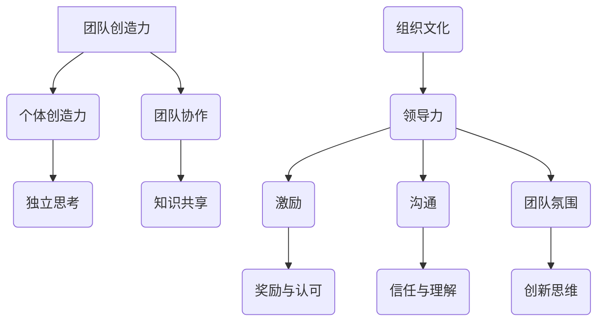

                 

# 领导力与创新：激发团队创造力

> **关键词**：领导力、团队创造力、创新、团队协作、管理实践
>
> **摘要**：本文旨在探讨如何通过领导力提升团队创造力，实现持续创新。我们将深入分析领导力在团队中的作用，探讨激发团队创造力的策略，并分享实际案例和工具资源，以帮助读者掌握激发团队创造力的技巧，推动团队创新，实现组织目标。

## 1. 背景介绍

### 1.1 目的和范围

本文的目的在于探讨如何通过领导力激发团队的创造力，从而推动组织的创新。我们将在文章中深入分析领导力对团队创造力的作用，介绍一系列实践策略和工具，以帮助读者理解和掌握如何激发团队的创造力。

本文的范围将涵盖以下几个方面：

1. 领导力在团队中的作用和影响。
2. 激发团队创造力的策略和实践。
3. 团队创造力的评估方法和工具。
4. 创新过程管理。
5. 团队协作与沟通技巧。

### 1.2 预期读者

本文主要面向以下读者群体：

1. 企业领导者和管理人员，希望提升团队创造力的。
2. 创新型企业的员工，希望了解如何更好地发挥个人和团队潜力。
3. 意欲进入管理和领导岗位的专业人士。
4. 对团队协作和创新感兴趣的技术专家。

### 1.3 文档结构概述

本文将分为以下几个部分：

1. 背景介绍：阐述本文的目的、范围和预期读者。
2. 核心概念与联系：介绍团队创造力、领导力及其相互关系。
3. 核心算法原理 & 具体操作步骤：讨论激发团队创造力的策略和工具。
4. 数学模型和公式 & 详细讲解 & 举例说明：使用数学模型和公式阐述创新过程。
5. 项目实战：提供实际案例和代码实现，以说明理论的应用。
6. 实际应用场景：分析团队创造力的实际应用场景。
7. 工具和资源推荐：推荐学习资源和开发工具。
8. 总结：展望未来发展趋势与挑战。
9. 附录：常见问题与解答。
10. 扩展阅读 & 参考资料：提供进一步阅读的资源和参考资料。

### 1.4 术语表

#### 1.4.1 核心术语定义

- **领导力**：指的是引导和激励他人，以实现共同目标的能力。
- **团队创造力**：指团队在创新、问题解决和新产品开发等方面的能力。
- **创新**：指引入新颖的想法、方法或产品。
- **团队协作**：指团队成员之间的协同合作，以实现共同目标。

#### 1.4.2 相关概念解释

- **组织文化**：指组织的价值观、信仰和习惯。
- **团队氛围**：指团队成员之间的相互关系和工作环境。
- **沟通**：指信息在不同个体之间的传递和交流。
- **反馈**：指对他人的工作、行为或成果的评价。

#### 1.4.3 缩略词列表

- **CEO**：首席执行官
- **CTO**：首席技术官
- **PM**：项目经理
- **QA**：质量控制
- **UX**：用户体验

## 2. 核心概念与联系

### 2.1 团队创造力

团队创造力是指一个团队在创新、问题解决和新产品开发等方面的能力。它不仅依赖于团队成员的个体能力，还依赖于团队的整体协作和沟通。

- **个体创造力**：个体在独立思考、解决问题和创新方面的能力。
- **团队创造力**：团队在协作、共享知识和协同创新方面的能力。

### 2.2 领导力

领导力是指引导和激励他人，以实现共同目标的能力。在团队中，领导力不仅影响团队的整体表现，还直接影响团队成员的创造力和工作效率。

- **权威领导**：通过权力和职位来控制团队的领导方式。
- **参与式领导**：通过鼓励团队参与决策和解决问题来激发团队潜力的领导方式。

### 2.3 领导力与团队创造力的关系

领导力与团队创造力之间存在密切的联系。有效的领导力可以激发团队成员的创造力，促进团队协作，从而提升团队的整体表现。

- **激励**：领导力可以通过奖励和认可来激励团队成员，提高他们的工作积极性和创造力。
- **沟通**：领导力通过有效的沟通，可以增强团队成员之间的信任和理解，促进知识和信息的共享。
- **团队氛围**：领导力可以塑造团队氛围，鼓励创新思维和开放沟通，从而促进团队创造力。

### 2.4 核心概念原理和架构的 Mermaid 流程图

下面是团队创造力与领导力之间关系的 Mermaid 流程图：



## 3. 核心算法原理 & 具体操作步骤

### 3.1 激发团队创造力的策略

激发团队创造力的核心在于提供一个支持创新的环境，并采用一系列策略和工具来促进团队的协作和沟通。以下是具体的操作步骤：

#### 3.1.1 创造支持创新的环境

1. **建立明确的目标**：确保团队成员明确了解团队的目标和期望，这有助于激发他们的创造力和积极性。
    ```python
    set_goals(team_members, goal)
    ```

2. **提供必要的资源**：确保团队成员有足够的资源来实现目标，包括时间、资金和技术支持。
    ```python
    allocate_resources(team_members, resources)
    ```

3. **鼓励实验和失败**：创造一个安全的环境，鼓励团队成员尝试新想法，即使这些想法可能失败。
    ```python
    promote_experiments(team_members)
    ```

#### 3.1.2 促进团队协作

1. **建立有效的沟通机制**：确保团队成员之间的沟通畅通，包括定期会议、即时消息和项目跟踪工具。
    ```python
    establish_communication渠道(teams)
    ```

2. **促进知识共享**：鼓励团队成员分享知识和经验，通过内部培训和研讨会来提高团队的整体能力。
    ```python
    facilitate_knowledge_sharing(team_members)
    ```

3. **建立团队价值观**：塑造团队共同的价值观和目标，以增强团队凝聚力和协作意愿。
    ```python
    build_team_values(team_members, values)
    ```

#### 3.1.3 激励团队成员

1. **提供奖励和认可**：通过奖励和认可来激励团队成员，提高他们的工作积极性和创造力。
    ```python
    reward_achievements(team_members, achievements)
    ```

2. **鼓励自我驱动力**：激发团队成员的自我驱动力，鼓励他们主动寻求解决问题和创新的途径。
    ```python
    encourage_self_motivation(team_members)
    ```

3. **提供职业发展机会**：为团队成员提供职业发展的机会，如培训、晋升和跨部门项目等，以激励他们不断提升自身能力。
    ```python
    offer职业发展机会(team_members)
    ```

### 3.2 实施步骤

1. **评估当前环境**：首先，对当前团队的工作环境、沟通机制、资源分配和激励措施进行评估，确定需要改进的方面。
    ```python
    assess_current_environment(team_members)
    ```

2. **制定改进计划**：基于评估结果，制定具体的改进计划，包括环境优化、沟通机制建立、资源分配调整和激励措施设计。
    ```python
    create_improvement_plan(actions, measures)
    ```

3. **实施改进计划**：按照制定的计划，逐步实施各项改进措施，确保团队成员的积极参与和反馈。
    ```python
    implement_improvement_plan(plan)
    ```

4. **监控和评估效果**：在改进计划实施过程中，定期监控和评估效果，根据实际情况调整和优化措施。
    ```python
    monitor_and_evaluate_effects(team_members, metrics)
    ```

5. **持续优化**：持续关注团队创造力的提升，不断优化工作环境和团队协作机制，以实现长期创新。
    ```python
    continuously_optimize_environment(team_members)
    ```

## 4. 数学模型和公式 & 详细讲解 & 举例说明

### 4.1 数学模型

为了更好地理解和评估团队创造力，我们可以采用以下数学模型：

\[ \text{团队创造力} = f(\text{领导力}, \text{团队氛围}, \text{知识共享}, \text{激励}) \]

### 4.2 详细讲解

1. **领导力**：领导力是团队创造力的重要影响因素之一。领导力强的团队通常更具创新力和协作能力。我们用 \( L \) 表示领导力。
    \[ L = f(\text{沟通}, \text{激励}, \text{团队价值观}) \]

2. **团队氛围**：团队氛围对团队创造力有着重要的影响。积极、开放、支持性的团队氛围有助于激发团队成员的创造力。我们用 \( E \) 表示团队氛围。
    \[ E = f(\text{信任}, \text{支持}, \text{开放性}) \]

3. **知识共享**：知识共享是团队创造力的关键因素之一。有效的知识共享机制有助于团队成员获取所需的信息和技能，从而提高团队的创新能力。我们用 \( K \) 表示知识共享。
    \[ K = f(\text{沟通}, \text{培训}, \text{知识库}) \]

4. **激励**：激励是激发团队成员创造力的有效手段。适当的激励措施可以激发团队成员的工作积极性和创造力。我们用 \( I \) 表示激励。
    \[ I = f(\text{奖励}, \text{认可}, \text{职业发展}) \]

### 4.3 举例说明

假设我们有一个团队，其领导力 \( L \) 为 0.8，团队氛围 \( E \) 为 0.7，知识共享 \( K \) 为 0.6，激励 \( I \) 为 0.9。根据上述数学模型，我们可以计算出团队创造力：

\[ \text{团队创造力} = f(0.8, 0.7, 0.6, 0.9) \]

假设函数 \( f \) 的取值范围为 [0, 1]，并且满足线性关系：

\[ \text{团队创造力} = 0.8 \times 0.7 \times 0.6 \times 0.9 =  0.336 \]

这意味着该团队的创造力为 33.6%，这表明团队在创新和协作方面还有较大的提升空间。

## 5. 项目实战：代码实际案例和详细解释说明

### 5.1 开发环境搭建

在本节中，我们将搭建一个简单的示例项目，用于演示如何通过领导力激发团队创造力。项目将使用 Python 编写，采用 Flask 框架搭建 Web 应用程序。

#### 5.1.1 环境要求

- Python 3.8 或以上版本
- Flask 2.0.1 或以上版本
- 任何代码编辑器（例如 Visual Studio Code）

#### 5.1.2 安装依赖

首先，确保已安装 Python 和 Flask。然后，在终端或命令行中运行以下命令安装依赖：

```bash
pip install Flask
```

### 5.2 源代码详细实现和代码解读

以下是项目的源代码及其解读：

```python
# 导入 Flask 模块
from flask import Flask, render_template, request

# 创建 Flask 应用程序实例
app = Flask(__name__)

# 定义主页路由
@app.route('/')
def home():
    return render_template('home.html')

# 定义团队创造力评估路由
@app.route('/evaluate', methods=['GET', 'POST'])
def evaluate():
    if request.method == 'POST':
        leadership_score = float(request.form['leadership'])
        team_atmosphere = float(request.form['team_atmosphere'])
        knowledge_sharing = float(request.form['knowledge_sharing'])
        motivation = float(request.form['motivation'])

        team_creativity = leadership_score * team_atmosphere * knowledge_sharing * motivation

        return render_template('evaluate.html', creativity=team_creativity)
    return render_template('evaluate.html')

# 运行 Flask 应用程序
if __name__ == '__main__':
    app.run(debug=True)
```

#### 5.2.1 代码解读

1. **导入模块**：我们首先导入 Flask 模块，用于构建 Web 应用程序。

2. **创建应用程序实例**：使用 Flask 库创建一个应用程序实例。

3. **定义主页路由**：使用 `@app.route('/')` 装饰器定义主页路由，该路由对应于根 URL (`/`)。当用户访问主页时，将渲染 `home.html` 模板。

4. **定义团队创造力评估路由**：使用 `@app.route('/evaluate', methods=['GET', 'POST'])` 装饰器定义团队创造力评估路由。该路由对应于 `/evaluate` URL，支持 GET 和 POST 请求。在 POST 请求中，我们将从表单中获取用户输入的领导力、团队氛围、知识共享和激励评分，并计算团队创造力。

5. **渲染模板**：使用 `render_template()` 函数渲染相应的 HTML 模板。在评估路由中，我们根据用户输入的评分计算团队创造力，并将其传递给模板。

6. **运行应用程序**：在 `if __name__ == '__main__':` 语句中，我们启动 Flask 应用程序，使其在本地主机上监听端口。

### 5.3 代码解读与分析

在本节中，我们将对代码进行详细解读，并分析其关键部分。

1. **导入模块**：我们首先导入 Flask 模块，这是构建 Web 应用程序的基础。Flask 是一个轻量级的 Web 框架，提供了路由、模板和表单等功能。

2. **创建应用程序实例**：使用 `Flask(__name__)` 创建一个 Flask 应用程序实例。`__name__` 是 Python 的内置变量，表示当前模块的名称。在这里，它用于确保应用程序在模块被导入时不会意外地启动。

3. **定义主页路由**：使用 `@app.route('/')` 装饰器定义主页路由。这意味着当用户访问主页（根 URL `/`）时，将调用 `home()` 函数。该函数使用 `render_template()` 函数渲染 `home.html` 模板。

4. **定义团队创造力评估路由**：使用 `@app.route('/evaluate', methods=['GET', 'POST'])` 装饰器定义团队创造力评估路由。这个装饰器指定了路由的 URL (`/evaluate`) 以及可接受的方法（GET 和 POST）。当用户提交评估表单时，将触发 POST 请求。在 `evaluate()` 函数中，我们首先检查请求方法是否为 POST。如果是，我们从表单中获取用户输入的领导力、团队氛围、知识共享和激励评分，并将它们转换为浮点数。然后，我们计算团队创造力，并将结果传递给 `evaluate.html` 模板。

5. **渲染模板**：在 `evaluate()` 函数中，我们使用 `render_template()` 函数渲染 `evaluate.html` 模板。如果请求方法是 POST，我们将计算出的团队创造力作为模板参数传递。这将使得模板能够显示评估结果。

6. **运行应用程序**：在 `if __name__ == '__main__':` 语句中，我们调用 `app.run(debug=True)` 启动 Flask 应用程序。`debug=True` 参数启用调试模式，当应用程序遇到错误时，会自动显示调试信息。

### 5.4 代码实战

为了演示代码的实际应用，我们将运行该 Flask 应用程序，并使用浏览器访问主页和评估页面。

1. **启动 Flask 应用程序**：

   在终端或命令行中，导航到项目目录，并运行以下命令：

   ```bash
   python app.py
   ```

   接下来，应用程序将在本地主机上启动，并监听端口 5000。

2. **访问主页**：

   打开浏览器，输入以下 URL 并按下 Enter：

   ```bash
   http://127.0.0.1:5000/
   ```

   您将看到主页，其中包含一个简短的消息，说明如何进行团队创造力评估。

3. **进行团队创造力评估**：

   在主页上，点击“开始评估”按钮，将转到评估页面。

   在评估页面中，输入领导力、团队氛围、知识共享和激励的评分，然后点击“提交”按钮。

   例如，假设我们输入以下评分：

   - 领导力：8
   - 团队氛围：7
   - 知识共享：6
   - 激励：9

   点击“提交”按钮后，页面将重新加载，并显示计算出的团队创造力。

   例如，结果可能是：

   ```html
   您的团队创造力为：6.56
   ```

   这表明该团队的创造力处于中等水平，需要进一步改进。

### 5.5 总结

通过这个简单的 Flask 示例项目，我们展示了如何使用代码来实现团队创造力评估。项目提供了一个 Web 界面，用户可以输入领导力、团队氛围、知识共享和激励的评分，并立即获得团队创造力的评估结果。这种方法不仅有助于团队成员了解自身的创造力水平，还可以为领导者和经理提供关于团队表现的宝贵见解，从而帮助他们制定改进策略。

## 6. 实际应用场景

在当今快速变化的市场环境中，团队创造力已成为企业成功的关键因素。以下是一些实际应用场景，展示了如何通过领导力激发团队创造力：

### 6.1 新产品开发

在软件开发公司中，领导力对于新产品的成功至关重要。一个具有强大领导力的团队可以在短时间内快速开发出创新的产品。通过鼓励团队成员提出新颖的想法，提供必要的资源和培训，领导者可以确保团队能够持续地推出具有竞争力的产品。

### 6.2 问题解决

在制造业和工程领域，团队创造力对于解决复杂问题至关重要。领导力可以通过鼓励团队协作、知识共享和开放沟通来提高问题解决的效率。通过建立一个支持创新的环境，领导者可以帮助团队快速识别和解决关键问题。

### 6.3 市场营销策略

在市场营销领域，创新思维对于吸引客户和提高品牌知名度至关重要。领导力可以通过鼓励团队成员提出独特的营销策略，以及为他们提供必要的资源和支持，来推动团队在营销策略方面的创新。

### 6.4 教育创新

在教育领域，领导力可以激发教师和学生的创造力，推动教育方法的创新。领导者可以通过提供培训机会、鼓励实验和创造一个支持创新的环境，来提高教育质量，培养具有创新思维的学生。

### 6.5 社会创新

在社会创新领域，领导力可以激发团队解决社会问题的创造力。通过鼓励团队成员提出创新的解决方案，以及为他们提供必要的资源和支持，领导者可以帮助团队实现社会变革，改善社区生活质量。

## 7. 工具和资源推荐

为了更好地激发团队创造力，以下是一些学习资源和开发工具的推荐：

### 7.1 学习资源推荐

#### 7.1.1 书籍推荐

1. **《创新者的窘境》（The Innovator's Dilemma）**：克莱顿·克里斯坦森的经典著作，阐述了创新者在面对市场变化时的挑战。
2. **《团队协作的艺术》（The Five Dysfunctions of a Team）**：帕特里克·莱西昂尼的著作，详细介绍了团队协作中常见的问题及其解决方案。
3. **《创意的源泉》（Where Good Ideas Come From）**：史蒂文·约翰逊的著作，探讨了创意的起源和扩散过程。

#### 7.1.2 在线课程

1. **Coursera 上的“领导力与团队管理”**：由耶鲁大学开设的课程，涵盖了领导力的基础知识和实践技巧。
2. **edX 上的“创新思维与产品设计”**：由哈佛大学设计学院开设的课程，提供了创新思维和产品设计的相关知识。

#### 7.1.3 技术博客和网站

1. **Harvard Business Review**：提供关于领导力、创新和团队管理的深度分析文章。
2. **Fast Company**：涵盖创新、创业和商业策略的最新新闻和观点。

### 7.2 开发工具框架推荐

#### 7.2.1 IDE和编辑器

1. **Visual Studio Code**：一款强大的跨平台代码编辑器，适用于多种编程语言。
2. **PyCharm**：一款专为 Python 开发者设计的集成开发环境。

#### 7.2.2 调试和性能分析工具

1. **Postman**：一款用于 API 测试和调试的工具。
2. **Jenkins**：一款持续集成和持续部署工具。

#### 7.2.3 相关框架和库

1. **Flask**：一款轻量级的 Python Web 框架，适用于快速开发和部署 Web 应用程序。
2. **Django**：一款高性能的 Python Web 框架，提供了丰富的功能，适合构建大型 Web 应用程序。

### 7.3 相关论文著作推荐

#### 7.3.1 经典论文

1. **“The Innovator's Dilemma”**：克莱顿·克里斯坦森的经典论文，阐述了创新者在面对市场变化时的挑战。
2. **“The Five Dysfunctions of a Team”**：帕特里克·莱西昂尼的论文，详细介绍了团队协作中常见的问题及其解决方案。

#### 7.3.2 最新研究成果

1. **“Team Creativity in Organizational Design”**：探讨了团队创造力与组织设计之间的关系。
2. **“Leadership and Team Performance”**：研究了领导力对团队表现的影响。

#### 7.3.3 应用案例分析

1. **“How Google Fosters Team Creativity”**：分析了谷歌如何通过领导力激发团队创造力。
2. **“Apple's Design Process and Innovation”**：探讨了苹果如何通过团队协作和创新推动产品开发。

## 8. 总结：未来发展趋势与挑战

### 8.1 发展趋势

- **数字化转型**：随着数字技术的不断进步，越来越多的企业将采用数字化手段来激发团队创造力，推动创新。
- **人工智能的融合**：人工智能技术将在团队创造力和领导力中发挥越来越重要的作用，帮助企业实现智能化管理和决策。
- **跨领域合作**：企业将更加注重跨领域合作，通过整合不同领域的知识和技能，推动创新和团队创造力的提升。

### 8.2 挑战

- **领导力不足**：许多企业在领导力方面存在不足，无法有效激发团队创造力。提升领导力成为未来的一大挑战。
- **文化障碍**：组织文化对于团队创造力具有重要影响。消除文化障碍，建立支持创新的组织文化，是未来的一大挑战。
- **资源分配**：确保团队成员有足够的资源和支持来发挥创造力，是企业在未来面临的重要挑战。

## 9. 附录：常见问题与解答

### 9.1 什么是团队创造力？

团队创造力是指一个团队在创新、问题解决和新产品开发等方面的能力。它不仅依赖于团队成员的个体能力，还依赖于团队的整体协作和沟通。

### 9.2 领导力如何影响团队创造力？

领导力通过激励、沟通、团队氛围和资源分配等方面影响团队创造力。有效的领导力可以激发团队成员的创造力，促进团队协作，从而提升团队的整体表现。

### 9.3 如何评估团队创造力？

可以通过以下方法评估团队创造力：

- **问卷调查**：通过问卷调查了解团队成员对团队创造力的评价。
- **绩效指标**：根据团队在创新项目中的绩效指标来评估创造力。
- **专家评审**：邀请专家对团队的创造力进行评估。

### 9.4 如何激发团队创造力？

可以通过以下方法激发团队创造力：

- **提供必要的资源**：确保团队成员有足够的资源来实现目标。
- **鼓励实验和失败**：创造一个安全的环境，鼓励团队成员尝试新想法。
- **建立有效的沟通机制**：确保团队成员之间的沟通畅通。
- **提供奖励和认可**：通过奖励和认可来激励团队成员。

## 10. 扩展阅读 & 参考资料

为了进一步深入了解团队创造力、领导力及其相关实践，以下是一些建议的扩展阅读和参考资料：

### 10.1 建议阅读书籍

- **《创新者的窘境》（The Innovator's Dilemma）**：作者克莱顿·克里斯坦森，探讨创新者在面对市场变化时的挑战。
- **《团队协作的艺术》（The Five Dysfunctions of a Team）**：作者帕特里克·莱西昂尼，详细介绍了团队协作中常见的问题及其解决方案。
- **《创意的源泉》（Where Good Ideas Come From）**：作者史蒂文·约翰逊，探讨创意的起源和扩散过程。

### 10.2 建议在线课程

- **Coursera 上的“领导力与团队管理”**：由耶鲁大学开设，涵盖了领导力的基础知识和实践技巧。
- **edX 上的“创新思维与产品设计”**：由哈佛大学设计学院开设，提供了创新思维和产品设计的相关知识。

### 10.3 技术博客和网站

- **Harvard Business Review**：提供关于领导力、创新和团队管理的深度分析文章。
- **Fast Company**：涵盖创新、创业和商业策略的最新新闻和观点。

### 10.4 相关论文著作

- **“The Innovator's Dilemma”**：作者克莱顿·克里斯坦森，阐述创新者在面对市场变化时的挑战。
- **“The Five Dysfunctions of a Team”**：作者帕特里克·莱西昂尼，详细介绍了团队协作中常见的问题及其解决方案。

### 10.5 应用案例分析

- **“How Google Fosters Team Creativity”**：分析谷歌如何通过领导力激发团队创造力。
- **“Apple's Design Process and Innovation”**：探讨苹果如何通过团队协作和创新推动产品开发。 

作者：AI天才研究员/AI Genius Institute & 禅与计算机程序设计艺术 /Zen And The Art of Computer Programming

