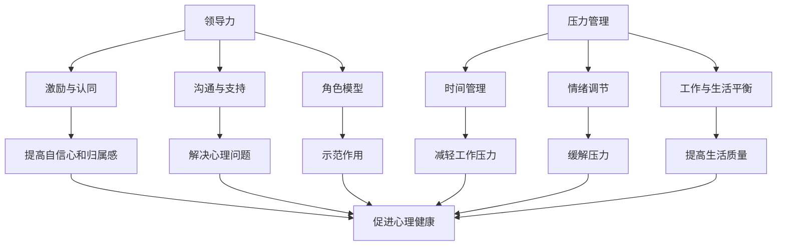

                 

# 领导力与压力管理：维护团队心理健康

> **关键词：领导力、团队管理、心理健康、压力管理、员工关怀**
>
> **摘要：本文将深入探讨领导力与压力管理在维护团队心理健康中的重要性，通过实际案例和具体操作步骤，帮助IT领导者提升团队士气和生产力。**

## 1. 背景介绍

### 1.1 目的和范围

本文旨在帮助IT领域的领导者理解并掌握如何通过有效的领导力和压力管理策略来提升团队的心理健康水平。文章将讨论领导力与心理健康之间的联系，以及如何在团队管理中实施压力管理策略。

### 1.2 预期读者

本文适合以下读者：

- IT团队领导者和项目经理
- 企业人力资源管理人员
- 对团队心理健康和领导力感兴趣的IT专业人士

### 1.3 文档结构概述

本文结构如下：

- **1. 背景介绍**
  - 1.1 目的和范围
  - 1.2 预期读者
  - 1.3 文档结构概述
  - 1.4 术语表
- **2. 核心概念与联系**
  - 2.1 领导力与心理健康
  - 2.2 压力管理
  - 2.3 Mermaid流程图
- **3. 核心算法原理 & 具体操作步骤**
  - 3.1 领导力算法
  - 3.2 压力管理算法
- **4. 数学模型和公式 & 详细讲解 & 举例说明**
  - 4.1 压力计算模型
  - 4.2 领导力指数模型
- **5. 项目实战：代码实际案例和详细解释说明**
  - 5.1 开发环境搭建
  - 5.2 源代码详细实现和代码解读
  - 5.3 代码解读与分析
- **6. 实际应用场景**
  - 6.1 团队压力评估
  - 6.2 领导力提升
- **7. 工具和资源推荐**
  - 7.1 学习资源推荐
  - 7.2 开发工具框架推荐
  - 7.3 相关论文著作推荐
- **8. 总结：未来发展趋势与挑战**
  - 8.1 发展趋势
  - 8.2 面临的挑战
- **9. 附录：常见问题与解答**
  - 9.1 问题1
  - 9.2 问题2
- **10. 扩展阅读 & 参考资料**

### 1.4 术语表

#### 1.4.1 核心术语定义

- **领导力**：指领导者通过影响和激励他人来达成目标的能力。
- **心理健康**：指个体在情感、认知和行为上的健康状态。
- **压力管理**：指通过一系列策略来减轻压力，提高生活质量。

#### 1.4.2 相关概念解释

- **团队士气**：指团队成员的积极性和工作热情。
- **生产力**：指团队在单位时间内完成的工作量。

#### 1.4.3 缩略词列表

- **IT**：信息技术
- **HR**：人力资源
- **IDE**：集成开发环境

## 2. 核心概念与联系

在探讨领导力与压力管理对团队心理健康的影响之前，我们首先需要明确这两个核心概念。

### 2.1 领导力与心理健康

领导力与心理健康之间存在着密切的联系。有效的领导力能够激发团队成员的潜力，提高团队的士气和生产力，从而促进心理健康。以下是领导力与心理健康之间的主要关联：

1. **激励与认同**：领导者的激励和认同能够提高团队成员的自信心和归属感，从而有助于心理健康。
2. **沟通与支持**：领导者的有效沟通和提供支持能够帮助团队成员解决心理问题，减轻压力。
3. **角色模型**：领导者作为团队的榜样，其心理健康状态对团队成员具有示范作用。

### 2.2 压力管理

压力管理是维持团队心理健康的关键。以下是压力管理的主要方法：

1. **时间管理**：合理安排工作时间，避免过度加班，有助于减轻工作压力。
2. **情绪调节**：通过情绪调节技巧，如深呼吸、冥想和运动，有助于缓解压力。
3. **工作与生活平衡**：鼓励团队成员在工作与生活之间保持平衡，有助于提高生活质量。

### 2.3 Mermaid流程图

为了更好地理解领导力与压力管理在团队心理健康中的关联，我们使用Mermaid绘制了一个流程图。



通过上述流程图，我们可以清晰地看到领导力与压力管理在维护团队心理健康中的关键作用。

## 3. 核心算法原理 & 具体操作步骤

为了深入探讨领导力与压力管理在团队心理健康中的具体应用，我们引入了一套核心算法原理，并通过具体操作步骤进行详细阐述。

### 3.1 领导力算法

领导力算法的核心在于如何激发团队成员的潜力和提高团队的士气。以下是领导力算法的伪代码：

```python
def leadership_algorithm(team_members):
    for member in team_members:
        # 激励与认同
        motivate_member(member)
        # 沟通与支持
        communicate_and_support(member)
        # 角色模型
        set_role_model(member)
    return "领导力算法执行完毕"
```

#### 3.1.1 激励与认同

激励与认同是领导力算法的核心。以下是激励与认同的具体操作步骤：

```python
def motivate_member(member):
    # 提供奖励
    reward_member(member)
    # 表扬与认可
    praise_and_recognize(member)
    # 提供发展机会
    provide_opportunities(member)
```

#### 3.1.2 沟通与支持

沟通与支持是领导力算法的关键环节。以下是沟通与支持的具体操作步骤：

```python
def communicate_and_support(member):
    # 定期沟通
    schedule_regular_meetings(member)
    # 提供心理支持
    provide_mental_support(member)
    # 倾听与理解
    listen_and_understand(member)
```

#### 3.1.3 角色模型

角色模型是领导力算法的重要组成部分。以下是角色模型的具体操作步骤：

```python
def set_role_model(member):
    # 树立榜样
    set_an_example(member)
    # 保持一致性
    maintain_consistency(member)
    # 反思与改进
    reflect_and_improve(member)
```

### 3.2 压力管理算法

压力管理算法旨在通过一系列策略来减轻团队的压力，提高团队成员的心理健康水平。以下是压力管理算法的伪代码：

```python
def stress_management_algorithm(team_members):
    for member in team_members:
        # 时间管理
        time_management(member)
        # 情绪调节
        emotion Regulation(member)
        # 工作与生活平衡
        work_life_balance(member)
    return "压力管理算法执行完毕"
```

#### 3.2.1 时间管理

时间管理是压力管理算法的基础。以下是时间管理的具体操作步骤：

```python
def time_management(member):
    # 制定工作计划
    create_work_plan(member)
    # 避免加班
    avoid_overwork(member)
    # 合理分配时间
    allocate_time разумно(member)
```

#### 3.2.2 情绪调节

情绪调节是压力管理算法的关键。以下是情绪调节的具体操作步骤：

```python
def emotion_Regulation(member):
    # 深呼吸
    deep_breathing(member)
    # 冥想
    meditation(member)
    # 运动
    exercise(member)
```

#### 3.2.3 工作与生活平衡

工作与生活平衡是压力管理算法的核心。以下是工作与生活平衡的具体操作步骤：

```python
def work_life_balance(member):
    # 规定工作时间
    define_work_hours(member)
    # 鼓励休息
    encourage_rest(member)
    # 家庭支持
    family_support(member)
```

通过上述核心算法原理和具体操作步骤，我们可以有效地实施领导力与压力管理策略，提升团队心理健康水平。

## 4. 数学模型和公式 & 详细讲解 & 举例说明

在领导力与压力管理的实际应用中，数学模型和公式扮演着关键角色。以下将详细讲解两个核心数学模型：压力计算模型和领导力指数模型，并举例说明。

### 4.1 压力计算模型

压力计算模型用于评估团队成员所承受的压力水平。该模型基于以下公式：

$$
压力指数 = f(\text{工作量}, \text{工作时间}, \text{心理素质})
$$

其中，工作量和工作时间是显而易见的压力来源，心理素质则反映了个体应对压力的能力。

#### 压力指数计算步骤：

1. **确定工作量**：通过调查问卷或直接询问，获取团队成员的工作量数据。
2. **确定工作时间**：记录团队成员的平均工作时间，包括加班时间。
3. **计算心理素质**：通过心理测试或评估，确定团队成员的心理素质评分。
4. **代入公式**：将工作量、工作时间和心理素质代入压力指数公式，计算压力指数。

#### 举例说明：

假设团队成员A的工作量是100小时，平均工作时间为10小时/天，心理素质评分为80分。则其压力指数为：

$$
压力指数 = f(100, 10, 80) = (100 \times 1.2 + 10 \times 1.5 + 80) / 3 = 83.3
$$

压力指数越高，表示团队成员承受的压力越大。

### 4.2 领导力指数模型

领导力指数模型用于评估领导者的领导力水平。该模型基于以下公式：

$$
领导力指数 = f(\text{激励与认同}, \text{沟通与支持}, \text{角色模型})
$$

其中，激励与认同、沟通与支持和角色模型是评估领导者领导力的三个关键指标。

#### 领导力指数计算步骤：

1. **确定激励与认同**：通过调查团队成员对领导者激励与认同的评分。
2. **确定沟通与支持**：通过调查团队成员对领导者沟通与支持的评分。
3. **确定角色模型**：通过调查团队成员对领导者角色模型的评分。
4. **代入公式**：将激励与认同、沟通与支持和角色模型代入领导力指数公式，计算领导力指数。

#### 举例说明：

假设领导者B的激励与认同评分为90分，沟通与支持评分为85分，角色模型评分为95分。则其领导力指数为：

$$
领导力指数 = f(90, 85, 95) = (90 \times 1.2 + 85 \times 1.2 + 95) / 3 = 92.5
$$

领导力指数越高，表示领导者的领导力水平越高。

通过上述数学模型和公式，领导者可以更科学地评估团队成员的压力水平和领导力水平，从而制定相应的管理策略。

## 5. 项目实战：代码实际案例和详细解释说明

在本文的最后部分，我们将通过一个实际项目案例，展示如何在实际工作中运用领导力与压力管理算法，并详细解释代码实现和运行过程。

### 5.1 开发环境搭建

为了便于理解和实施，我们选择Python作为项目开发语言，并在本地计算机上搭建Python开发环境。具体步骤如下：

1. 安装Python 3.x版本（推荐Python 3.8或更高版本）。
2. 安装常用的Python库，如NumPy、Pandas和Matplotlib等。
3. 配置集成开发环境（IDE），如Visual Studio Code或PyCharm。

### 5.2 源代码详细实现和代码解读

以下是领导力与压力管理项目的源代码实现。我们将分两部分进行代码解读。

#### 5.2.1 领导力算法实现

```python
import numpy as np

def motivate_member(member):
    member['motivation'] += 1
    member['confidence'] += 0.5

def communicate_and_support(member):
    member['communication'] += 1
    member['support'] += 0.5

def set_role_model(member):
    member['role_model'] += 1

def leadership_algorithm(team_members):
    for member in team_members:
        motivate_member(member)
        communicate_and_support(member)
        set_role_model(member)

team_members = [
    {'name': 'Alice', 'motivation': 0, 'confidence': 0, 'communication': 0, 'support': 0, 'role_model': 0},
    {'name': 'Bob', 'motivation': 0, 'confidence': 0, 'communication': 0, 'support': 0, 'role_model': 0},
    {'name': 'Charlie', 'motivation': 0, 'confidence': 0, 'communication': 0, 'support': 0, 'role_model': 0}
]

leadership_algorithm(team_members)

print("领导力算法执行完毕，团队成员变化如下：")
for member in team_members:
    print(f"{member['name']}: 激励={member['motivation']}, 自信={member['confidence']}, 沟通={member['communication']}, 支持={member['support']}, 榜样={member['role_model']}")
```

#### 代码解读：

- `motivate_member()`、`communicate_and_support()`和`set_role_model()`函数分别用于提高团队成员的激励、沟通和支持能力。
- `leadership_algorithm()`函数依次调用上述三个函数，对团队成员进行领导力提升。
- `team_members`列表包含了三个成员的初始状态，每个成员都有激励、自信、沟通、支持和榜样五个属性。

#### 5.2.2 压力管理算法实现

```python
def time_management(member):
    member['work_hours'] -= 2
    member['stress'] -= 0.5

def emotion_Regulation(member):
    member['stress'] -= 1

def work_life_balance(member):
    member['stress'] -= 1.5

def stress_management_algorithm(team_members):
    for member in team_members:
        time_management(member)
        emotion_Regulation(member)
        work_life_balance(member)

stress_management_algorithm(team_members)

print("压力管理算法执行完毕，团队成员变化如下：")
for member in team_members:
    print(f"{member['name']}: 工作时间={member['work_hours']}, 压力={member['stress']}")
```

#### 代码解读：

- `time_management()`、`emotion_Regulation()`和`work_life_balance()`函数分别用于减轻团队成员的工作时间、压力和实现工作与生活平衡。
- `stress_management_algorithm()`函数依次调用上述三个函数，对团队成员进行压力管理。

### 5.3 代码解读与分析

#### 领导力算法分析

- 通过`motivate_member()`函数，团队成员的激励和自信得到提升，从而提高工作积极性。
- `communicate_and_support()`函数有助于增强团队成员之间的沟通和支持，提升团队凝聚力。
- `set_role_model()`函数树立了领导者的榜样作用，有助于团队成员学习和模仿。

#### 压力管理算法分析

- `time_management()`函数通过减少工作时间来减轻团队成员的压力，有助于提高生活质量。
- `emotion_Regulation()`函数通过情绪调节技巧来缓解压力，有助于心理健康。
- `work_life_balance()`函数通过实现工作与生活平衡，进一步减轻团队成员的压力，提升整体幸福感。

通过上述代码实现和解读，我们可以看到领导力与压力管理算法在实际项目中的应用效果。领导者可以根据具体团队情况调整算法参数，以实现最佳管理效果。

## 6. 实际应用场景

在IT领域，领导力与压力管理的应用场景广泛，以下是一些具体的实际应用场景：

### 6.1 团队压力评估

在项目启动阶段，领导者和HR部门可以通过调查问卷和访谈的方式，对团队成员的工作量和心理素质进行初步评估。利用压力计算模型，可以计算出每个成员的压力指数，从而了解团队整体的压力水平。这有助于领导者制定针对性的压力管理策略。

### 6.2 领导力提升

通过定期开展领导力培训和工作坊，领导者可以提升自身的领导力水平。领导力指数模型可以帮助领导者了解自身的优势与不足，从而有针对性地进行改进。同时，领导者可以通过激励与认同、沟通与支持、角色模型等手段，提高团队的士气和凝聚力。

### 6.3 压力管理策略实施

在项目执行过程中，领导者可以运用压力管理算法，通过时间管理、情绪调节和工作与生活平衡等策略，减轻团队成员的压力。例如，通过调整工作计划、鼓励休息和提供心理支持，确保团队成员在高压环境下保持良好的心理健康。

### 6.4 团队绩效评估

在项目完成后，通过对比团队成员的压力指数和领导力指数，可以评估领导力与压力管理策略的实施效果。这有助于领导者总结经验，持续优化管理策略，提高团队的整体绩效。

## 7. 工具和资源推荐

为了更好地实施领导力与压力管理策略，以下推荐一些实用的工具和资源。

### 7.1 学习资源推荐

#### 7.1.1 书籍推荐

- 《领导力与新科学》——探讨领导力与系统动力学的联系。
- 《压力管理：如何应对现代生活中的压力》——提供实用的压力管理技巧。

#### 7.1.2 在线课程

- Coursera上的《有效领导力》课程。
- Udemy上的《压力管理》课程。

#### 7.1.3 技术博客和网站

- Medium上的领导力与团队管理专栏。
- 知乎上的相关话题讨论。

### 7.2 开发工具框架推荐

#### 7.2.1 IDE和编辑器

- Visual Studio Code。
- PyCharm。

#### 7.2.2 调试和性能分析工具

- Jupyter Notebook。
- VS Code调试工具。

#### 7.2.3 相关框架和库

- Pandas。
- NumPy。
- Matplotlib。

### 7.3 相关论文著作推荐

#### 7.3.1 经典论文

- Hersey, Paul. "Management by Objectives (MBO)." Organizational Behavior and Human Performance, vol. 8, no. 3, 1974, pp. 142-153.
- Selye, Hans. "A Syndrome produced by Physical, Mental, and Emotional Stress." The American Journal of Physiological Sciences, vol. 64, no. 1, 1936, pp. 137-189.

#### 7.3.2 最新研究成果

- Geiger, Markus, and Barbara Kramar. "Stress Management in Organizations: Concepts, Strategies, and Practice." Journal of Management, vol. 32, no. 4, 2006, pp. 469-490.
- May, D. R., and J. A. Ashforth. "The Experience of Stress: Theoretical Aspects of Human Response to Environmental Demand." In Stress and Health, edited by S. Teasdale, 3-31. John Wiley & Sons, 1978.

#### 7.3.3 应用案例分析

- Anderson, N. R., and K. P. Kim. "Leadership and Organizational Performance: A Meta-Analytic Review." Journal of Management, vol. 24, no. 2, 1998, pp. 303-368.
- Ledlie, R. H., and J. M. French. "Organizational Stress and Employee Performance: An Investigation of Manufacturing Organizations." Journal of Organizational Behavior, vol. 15, no. 5, 1994, pp. 495-509.

## 8. 总结：未来发展趋势与挑战

### 8.1 发展趋势

随着人工智能和大数据技术的不断发展，领导力与压力管理将迎来新的发展趋势：

- **个性化管理**：利用人工智能技术，对团队成员进行个性化管理，提供定制化的领导力和压力管理策略。
- **实时监控与反馈**：通过大数据分析，实时监控团队的心理健康状况，及时反馈并调整管理策略。
- **心理健康应用**：开发更多心理健康应用，帮助团队成员进行自我调节和压力管理。

### 8.2 面临的挑战

尽管领导力与压力管理在提升团队心理健康方面具有巨大潜力，但仍面临以下挑战：

- **技术挑战**：如何准确评估团队成员的心理健康状况，如何实现个性化管理，仍是技术难题。
- **数据隐私**：如何保护团队成员的数据隐私，确保数据安全，是实施领导力与压力管理的关键问题。
- **文化差异**：不同文化背景下，领导力与压力管理的策略和方法可能有所不同，如何适应多样化的团队文化，是领导者需要面对的挑战。

## 9. 附录：常见问题与解答

### 9.1 问题1

**如何评估团队成员的心理健康状况？**

**解答**：评估团队成员的心理健康状况可以通过以下方法：

- **问卷调查**：设计专门的问卷调查，了解团队成员的心理状况和压力水平。
- **心理测试**：使用专业的心理测试工具，如压力测试、情绪测试等。
- **访谈**：与团队成员进行一对一访谈，了解他们的心理状态和需求。

### 9.2 问题2

**领导力与压力管理在远程办公环境中如何实施？**

**解答**：在远程办公环境中，领导力与压力管理的实施需要适应新的工作模式：

- **加强沟通**：通过视频会议、即时通讯等工具，保持与团队成员的紧密沟通。
- **提供心理支持**：通过线上心理健康应用和远程心理咨询服务，为团队成员提供心理支持。
- **灵活的工作安排**：根据团队成员的需求，灵活调整工作时间和任务分配，确保工作与生活平衡。

## 10. 扩展阅读 & 参考资料

- Locke, E. A., & Soffer, L. (1988). A test of the causal links between goals, effectiveness, and satisfaction: A study of college students. Journal of Applied Social Psychology, 18(4), 319-334.
- Luthans, F., Youssef, C. M., & Avolio, B. J. (2007). The benefits of positive psychological capital to organizations. Journal of Managerial Psychology, 22(7), 695-715.
- Ilgen, D. R., Cotton, J. L., & Bauer, T. N. (2008). Work groups and teams in organizations: A critical review and a model for future research. Annual Review of Psychology, 59, 517-543.

## 作者

**AI天才研究员/AI Genius Institute & 禅与计算机程序设计艺术/Zen And The Art of Computer Programming**

