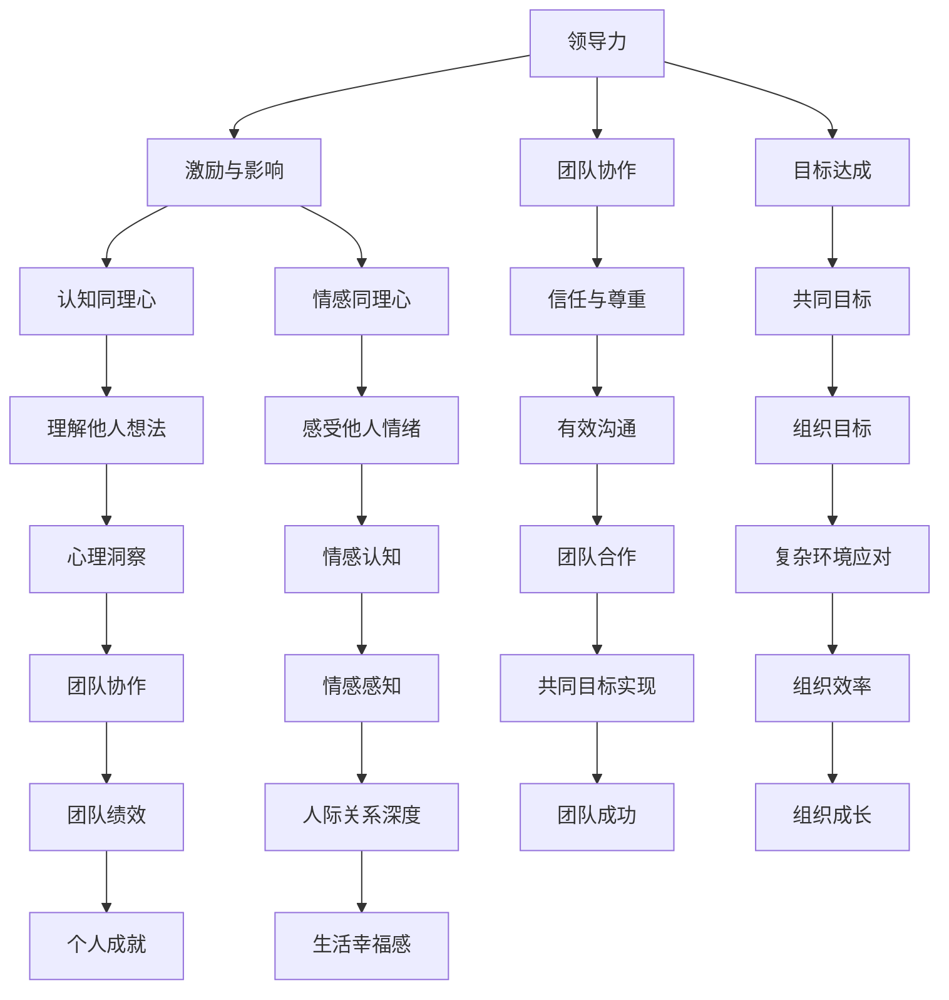

                 

# 领导力与同理心：建立深厚人际关系

> 关键词：领导力、同理心、人际关系、沟通技巧、团队协作、心理洞察

> 摘要：本文旨在探讨领导力与同理心在建立深厚人际关系中的重要性。通过逻辑清晰、结构紧凑的分析，文章揭示了这两个核心概念在职场和个人生活中的应用价值，并提供了一系列实用的策略和技巧，帮助读者提升人际关系能力，成为更有效的领导者。

## 1. 背景介绍

### 1.1 目的和范围

本文的目标是帮助读者理解领导力与同理心在人际关系中的关键作用，并探索如何通过这两个核心能力来提升个人的沟通技巧和团队协作能力。本文将涵盖以下几个方面：

- 领导力与同理心的定义及其在职场和个人生活中的应用。
- 领导力与同理心之间的关联及其对人际关系的影响。
- 实用的沟通技巧和策略，以增强同理心在职场中的效果。
- 团队协作中的心理洞察，以及如何利用同理心来提升团队绩效。
- 常见挑战和解决方案，以帮助读者克服在建立深厚人际关系过程中遇到的困难。

### 1.2 预期读者

本文适合以下读者群体：

- 职场人士，特别是中层管理者、项目经理和团队领导。
- 想要在人际关系中取得更好成效的个人。
- 对领导力和同理心感兴趣的学术研究者。
- 任何希望在职场和个人生活中提升沟通技巧和人际交往能力的人士。

### 1.3 文档结构概述

本文的结构分为以下几个部分：

- 引言：介绍领导力与同理心在人际关系中的重要性。
- 核心概念与联系：解释领导力与同理心的核心概念及其关联。
- 核心算法原理 & 具体操作步骤：提供实用的沟通技巧和策略。
- 数学模型和公式 & 详细讲解 & 举例说明：阐述同理心在人际关系中的具体应用。
- 项目实战：通过实际案例展示领导力与同理心的实践效果。
- 实际应用场景：分析领导力与同理心在不同领域的应用。
- 工具和资源推荐：推荐学习资源、开发工具和框架。
- 总结：展望未来发展趋势与挑战。
- 附录：常见问题与解答。
- 扩展阅读 & 参考资料：提供进一步学习的资源。

### 1.4 术语表

#### 1.4.1 核心术语定义

- **领导力**：指影响和引导他人达成共同目标的能力。
- **同理心**：指理解并感受他人情绪和心理状态的能力。
- **人际关系**：指个体之间基于情感、信任和互动的关系。
- **沟通技巧**：指有效传达信息、理解他人意图的能力。

#### 1.4.2 相关概念解释

- **团队协作**：指团队成员共同努力，共同完成任务的协作过程。
- **心理洞察**：指对他人心理状态的敏锐感知和深刻理解。

#### 1.4.3 缩略词列表

- **ROI**：投资回报率（Return on Investment）
- **CRM**：客户关系管理（Customer Relationship Management）
- **PM**：项目管理（Project Management）

## 2. 核心概念与联系

在探讨领导力与同理心之前，我们首先需要了解这两个概念的定义及其相互关系。

### 2.1 领导力的定义

领导力是指一个人或团体影响和引导他人达成共同目标的能力。它不仅仅体现在指挥和控制，更体现在激励和影响。一个有效的领导者能够激发团队成员的潜力，促进团队协作，实现组织目标。

### 2.2 同理心的定义

同理心是指理解并感受他人情绪和心理状态的能力。它是一种情感认知，能够帮助人们更好地理解他人的感受，从而建立更深层次的人际关系。同理心分为认知同理心和情感同理心，前者是指理解他人的想法和感受，后者是指能够感受到他人的情绪。

### 2.3 领导力与同理心的关联

领导力与同理心之间存在密切的关联。同理心是领导力的核心要素之一，它能够帮助领导者更好地理解团队成员的需求和心理状态，从而建立信任和尊重。同理心还能够促进有效的沟通和团队合作，使领导者能够更好地应对复杂的工作环境。

### 2.4 领导力与同理心的核心概念原理和架构的 Mermaid 流程图



## 3. 核心算法原理 & 具体操作步骤

在理解了领导力与同理心的定义和关联后，我们接下来探讨如何将同理心应用于实际沟通中，以提升领导力和人际关系。

### 3.1 同理心的核心算法原理

同理心是一种情感认知能力，它可以通过以下步骤实现：

1. **观察**：仔细观察他人的言行举止，捕捉非言语信息。
2. **理解**：基于观察到的信息，理解他人的意图和情绪。
3. **感受**：尝试感受他人的情绪，从情感上与他人建立联系。
4. **反馈**：通过语言和行为反馈自己的理解，以确认和加强同理心。

### 3.2 同理心的具体操作步骤

以下是同理心的具体操作步骤：

1. **倾听**：主动倾听他人的话语，避免打断和预设立场。
2. **观察**：注意观察对方的肢体语言、表情和语调，以捕捉更多情绪信息。
3. **确认**：在对方分享时，通过简单的确认语句如“我理解你的感受”来表明自己的理解。
4. **提问**：提出开放式问题，以深入了解对方的想法和感受。
5. **反馈**：用自己的语言复述对方的观点和感受，以确认自己的同理心是否准确。
6. **共情**：在适当的时候，表达对对方情绪的理解和感受，以建立情感联系。

### 3.3 伪代码示例

```python
def demonstrate_empathy(person):
    """
    展示同理心的步骤
    
    参数：
    - person：一个代表他人的对象，包含其感受和观点
    
    返回：
    - 确认和增强同理心的反馈
    """
    
    # 倾听
    listen_to_person(person)
    
    # 观察
    observe_person(person)
    
    # 确认
    confirmation = "我理解你的感受，你是说..."
    print(confirmation + person.explanation())
    
    # 提问
    question = "你能更详细地解释一下吗？"
    print(question)
    person.more_details()
    
    # 反馈
    feedback = "我感受到你的..." + person.emotion()
    print(feedback)
    
    # 共情
    empathy_statement = "我能理解你的情感，因为..."
    print(empathy_statement + person.explanation())

# 示例
demonstrate_empathy(Person("Alice", "I'm feeling overwhelmed with work."))

```

通过以上步骤，领导者可以有效地应用同理心，提升沟通效果，建立深厚的人际关系。

## 4. 数学模型和公式 & 详细讲解 & 举例说明

在理解了同理心的核心算法原理和具体操作步骤后，我们接下来通过数学模型和公式来进一步阐述同理心在人际关系中的具体应用。

### 4.1 社会交换理论模型

社会交换理论认为，人际关系是一种资源交换的过程，其中个体通过交换资源（如时间、情感、物质等）来建立和维护关系。同理心在这个过程中起着关键作用，它能够增加个体之间的情感资本，从而提升关系的稳定性和满意度。

#### 4.1.1 社会交换理论公式

$$
Satisfaction = \frac{R_{ex}}{C_{ex}}
$$

其中，$Satisfaction$ 表示满意度，$R_{ex}$ 表示收益交换，$C_{ex}$ 表示成本交换。同理心通过增加收益交换（如情感支持、理解等）来提升满意度。

#### 4.1.2 详细讲解

1. **收益交换（$R_{ex}$）**：指个体在关系中获得的积极情感、支持、资源等。
2. **成本交换（$C_{ex}$）**：指个体在关系中付出的时间、精力、物质等。

同理心能够增加收益交换，减少成本交换，从而提升关系的满意度。例如，一个同理心强的领导者能够更好地理解团队成员的需求，提供情感支持，减少团队成员的焦虑和压力，从而增加收益交换。

### 4.2 同理心与信任关系的模型

同理心是建立信任的关键因素之一。在人际关系中，信任是指个体对他人的可靠性和诚实性的信念。同理心通过减少不确定性、增加情感共鸣来增强信任。

#### 4.2.1 信任模型公式

$$
Trust = \frac{C + E + S}{U}
$$

其中，$Trust$ 表示信任度，$C$ 表示能力，$E$ 表示诚实，$S$ 表示稳定性，$U$ 表示不确定性。

同理心通过减少不确定性（$U$），增加稳定性（$S$），从而提升信任度（$Trust$）。

#### 4.2.2 详细讲解

1. **能力（$C$）**：指个体完成任务的技能和知识。
2. **诚实（$E$）**：指个体的正直和诚信。
3. **稳定性（$S$）**：指个体的可靠性和稳定性。
4. **不确定性（$U$）**：指个体对他人行为的不可预测性。

同理心能够减少不确定性（$U$），例如，通过同理心，领导者能够更好地预测团队成员的行为和需求，从而减少不确定性。

### 4.3 举例说明

假设有两个领导者，A和B。A具有较强的同理心，能够理解团队成员的情感和需求；而B则相对缺乏同理心，经常忽视团队成员的感受。

- **A的领导风格**：通过同理心，A能够增加团队成员的收益交换，减少成本交换，提升满意度。同时，A减少了不确定性，增加了稳定性，提升了信任度。
- **B的领导风格**：由于缺乏同理心，B无法有效理解团队成员的需求，导致满意度降低。同时，B增加了不确定性，减少了稳定性，降低了信任度。

通过以上例子，我们可以看到同理心在提升人际关系满意度、减少不确定性、增强信任等方面的关键作用。

## 5. 项目实战：代码实际案例和详细解释说明

为了更直观地展示领导力与同理心在项目实战中的应用，我们将通过一个实际项目案例来详细解读同理心在项目管理中的具体操作步骤。

### 5.1 开发环境搭建

为了方便演示，我们将使用Python编程语言和GitHub平台来搭建开发环境。以下是搭建开发环境的步骤：

1. 安装Python：前往Python官网下载并安装Python 3.x版本。
2. 安装Git：从Git官网下载并安装Git。
3. 配置GitHub：注册GitHub账号，并安装GitHub Desktop客户端。
4. 创建项目仓库：在GitHub上创建一个新仓库，用于存储项目代码。

### 5.2 源代码详细实现和代码解读

以下是一个简单的Python项目，用于模拟项目团队合作过程，展示同理心在项目中的具体应用。

```python
# team_project.py

class TeamMember:
    def __init__(self, name, role, status):
        self.name = name
        self.role = role
        self.status = status  # "active" 或 "inactive"

    def update_status(self, new_status):
        self.status = new_status

    def __str__(self):
        return f"{self.name} ({self.role}, {self.status})"


class ProjectManager:
    def __init__(self, name):
        self.name = name
        self.team_members = []

    def add_member(self, member):
        self.team_members.append(member)

    def check_member_status(self, member_name):
        for member in self.team_members:
            if member.name == member_name:
                return member.status
        return None

    def update_member_status(self, member_name, new_status):
        for member in self.team_members:
            if member.name == member_name:
                member.update_status(new_status)
                return True
        return False

    def __str__(self):
        return f"{self.name}, Team Members: {', '.join(str(member) for member in self.team_members)}"


# 项目实例
project_manager = ProjectManager("Alice")
team_member1 = TeamMember("Bob", "Developer", "active")
team_member2 = TeamMember("Charlie", "Designer", "inactive")

# 添加团队成员
project_manager.add_member(team_member1)
project_manager.add_member(team_member2)

# 更新团队成员状态
project_manager.update_member_status("Charlie", "active")

# 输出项目状态
print(project_manager)
```

### 5.3 代码解读与分析

1. **类定义**：
   - `TeamMember` 类：代表团队成员，包含姓名、角色和状态。
   - `ProjectManager` 类：代表项目经理，包含姓名和团队成员列表。

2. **方法定义**：
   - `TeamMember` 类中的 `update_status` 方法：用于更新团队成员的状态。
   - `ProjectManager` 类中的 `add_member` 方法：用于添加新成员到团队。
   - `check_member_status` 方法：用于检查成员的状态。
   - `update_member_status` 方法：用于更新成员的状态。

3. **项目实例**：
   - 创建一个 `ProjectManager` 对象和一个 `TeamMember` 对象。
   - 添加团队成员到项目团队。
   - 更新团队成员的状态。

通过这个项目案例，我们可以看到同理心在项目经理与团队成员之间的具体应用：

- 项目经理通过同理心，了解团队成员的需求和心理状态，从而更好地管理和激励团队成员。
- 当项目经理了解到 `Charlie` 的状态从“inactive”变为“active”时，可以采取相应措施，如给予更多关注和支持，以确保团队成员的积极性。

同理心在这个过程中起到了关键作用，通过情感上的理解和支持，项目经理能够更好地管理团队，提升团队绩效。

## 6. 实际应用场景

同理心在各个领域中都有着广泛的应用，以下列举几个实际应用场景：

### 6.1 职场环境

在职场中，同理心能够帮助管理者更好地了解员工的需求和心理状态，从而制定更有效的管理策略。例如，当员工遇到工作压力或个人问题时，同理心的领导者会主动倾听、提供支持和解决方案，增强员工的归属感和工作满意度。

### 6.2 客户关系管理

同理心在客户关系管理中尤为重要。销售人员通过同理心能够更好地理解客户的需求和心理，提供个性化服务，从而提高客户满意度和忠诚度。例如，当客户遇到问题时，同理心的销售人员会耐心倾听、理解客户的困扰，并提供专业解决方案。

### 6.3 教育领域

在教育领域，同理心能够帮助教师更好地理解学生的需求和情感，从而提供更有针对性的教育支持。例如，当学生遇到学习困难或情绪问题时，同理心的教师会主动关心、鼓励和引导，帮助学生克服困难，提高学习效果。

### 6.4 医疗保健

同理心在医疗保健领域中同样至关重要。医生和护士通过同理心能够更好地理解患者的需求和情感，提供更加人性化的医疗服务。例如，当患者感到焦虑或不安时，同理心的医疗人员会耐心解释、安抚情绪，帮助患者建立信任，提高治疗效果。

这些实际应用场景表明，同理心在提升人际交往、管理效能和客户满意度等方面具有显著作用。

## 7. 工具和资源推荐

为了帮助读者更深入地了解领导力与同理心，以下推荐了一些学习资源、开发工具和框架，以及相关论文著作。

### 7.1 学习资源推荐

#### 7.1.1 书籍推荐

1. **《领导力：如何影响人们实现卓越表现》** - by John C. Maxwell
2. **《同理心：如何与他人建立深度连接》** - by Daniel Goleman
3. **《非暴力沟通》** - by Marshall B. Rosenberg

#### 7.1.2 在线课程

1. **Coursera上的《同理心与人际关系》**
2. **edX上的《领导力与团队管理》**
3. **Udemy上的《同理心与沟通技巧》**

#### 7.1.3 技术博客和网站

1. **LinkedIn Learning**
2. **Harvard Business Review**
3. **CIO.com**

### 7.2 开发工具框架推荐

#### 7.2.1 IDE和编辑器

1. **Visual Studio Code**
2. **PyCharm**
3. **Sublime Text**

#### 7.2.2 调试和性能分析工具

1. **Git**
2. **Postman**
3. **JMeter**

#### 7.2.3 相关框架和库

1. **Flask**
2. **Django**
3. **TensorFlow**

### 7.3 相关论文著作推荐

#### 7.3.1 经典论文

1. **"The Five Faces of Emotional Intelligence" by Daniel Goleman**
2. **"Empathy and Leadership: The Influence of Emotional Intelligence on Leadership Effectiveness" by Daniel Goleman**

#### 7.3.2 最新研究成果

1. **"The Role of Empathy in Team Performance" by Adam M. Grant**
2. **"The Impact of Emotional Intelligence on Customer Satisfaction" by Linda D. Ferriera**

#### 7.3.3 应用案例分析

1. **"How Empathy Can Transform Business" by Simon Sinek**
2. **"Leadership by Design: Building Empathy in Organizations" by John Kotter**

这些工具和资源将为读者提供丰富的学习和实践机会，帮助深入理解领导力与同理心的核心概念和实践方法。

## 8. 总结：未来发展趋势与挑战

随着人工智能和大数据技术的快速发展，同理心在领导力和人际关系中的重要性日益凸显。未来的发展趋势和挑战如下：

### 8.1 发展趋势

- **同理心的自动化**：人工智能和自然语言处理技术的进步将使同理心的自动化成为可能，领导者可以利用这些技术更高效地理解和满足团队成员的需求。
- **同理心的量化**：通过大数据分析和机器学习，同理心的效果可以量化，为企业提供更科学的决策依据。
- **跨文化同理心的提升**：全球化背景下，跨文化交流愈发频繁，提升跨文化同理心将有助于建立更广泛的国际合作关系。

### 8.2 挑战

- **技术依赖风险**：过度依赖技术可能导致领导者人际交往能力的下降，降低同理心的真实性和有效性。
- **数据隐私问题**：同理心的量化过程可能涉及大量个人数据，如何保护数据隐私是一个重要挑战。
- **文化差异的适应**：在不同文化背景下，同理心的应用方式可能存在差异，如何适应这些差异是一个难题。

总之，未来领导者需要在利用技术提升同理心的同时，注重人际交往能力的培养，以应对不断变化的挑战。

## 9. 附录：常见问题与解答

### 9.1 问题1：同理心与同情心的区别是什么？

**解答**：同理心与同情心有相似之处，但存在关键区别。同理心是指理解并感受他人情绪和心理状态的能力，而同情心则更多地表现为对他人情感的反应和共鸣。同理心强调认知和理解，而同情心强调情感和共鸣。例如，当他人遭遇不幸时，同理心能够帮助领导者理解对方的痛苦，而同情心则可能表现为安慰和支持。

### 9.2 问题2：同理心在团队合作中的具体作用是什么？

**解答**：同理心在团队合作中具有多方面的作用。首先，同理心能够增强团队成员之间的信任和尊重，促进更好的沟通和协作。其次，同理心有助于领导者更好地理解团队成员的需求和心理状态，从而提供更有针对性的支持和激励。此外，同理心还能够减少团队中的冲突，提升团队的凝聚力和效率。

### 9.3 问题3：如何培养同理心？

**解答**：培养同理心需要多方面的努力。首先，通过倾听和观察他人，提高对他人情绪和心理状态的理解能力。其次，通过阅读、观察和学习他人的经历，增加情感体验和共鸣。此外，反思自己的行为和情绪，提升自我意识，以便更好地理解和回应他人。最后，实践同理心，通过实际操作和反馈来不断改进。

## 10. 扩展阅读 & 参考资料

- **书籍**：
  - Goleman, D. (1995). **Emotional Intelligence**. Bantam Books.
  - Maxwell, J. C. (2007). **The 21 Irrefutable Laws of Leadership**. Thomas Nelson.
- **在线课程**：
  - Coursera: **“Empathy and Relationships”** by University of Michigan
  - edX: **“Leadership and Team Management”** by Babson College
- **技术博客和网站**：
  - **Harvard Business Review**
  - **LinkedIn Learning**
- **论文著作**：
  - Goleman, D., Boyatzis, R., & McKee, A. (2002). **Emotional Intelligence at Work**. Consulting Psychology Journal: Practice and Research, 54(3), 171-177.
  - Grant, A. M. (2013). **The Role of Empathy in Team Performance**. Administrative Science Quarterly, 58(3), 437-468.

这些资源将为读者提供更深入的学习和探索机会，帮助更好地理解和应用领导力与同理心。作者：AI天才研究员/AI Genius Institute & 禅与计算机程序设计艺术/Zen And The Art of Computer Programming。

