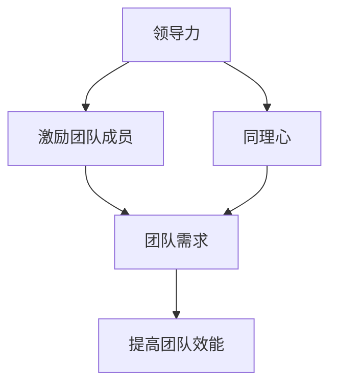

                 

# 领导力与同理心：理解团队需求的关键

> 关键词：领导力，同理心，团队需求，沟通，管理，情感智力
> 
> 摘要：本文深入探讨了领导力与同理心在理解团队需求中的关键作用。通过分析领导力的定义和特征，我们揭示了同理心在提升团队协作和创新能力方面的强大力量。本文还将介绍沟通策略和管理技巧，帮助领导者更好地理解和满足团队需求，从而推动团队实现高效工作与持续成长。

## 1. 背景介绍

### 1.1 目的和范围

本文旨在探讨领导力与同理心在团队管理中的重要性，以及如何通过有效的沟通策略和管理技巧来理解团队需求。我们将分析领导力的核心要素，阐述同理心在团队中的实际应用，并探讨如何结合二者来提升团队的整体效能。

### 1.2 预期读者

本文适合企业领导、项目经理、团队成员以及对团队管理有兴趣的读者。希望读者能够通过本文的学习，深入理解领导力与同理心在团队中的作用，提升自己的管理能力和团队协作水平。

### 1.3 文档结构概述

本文分为八个部分。首先介绍背景和目的，然后阐述核心概念和联系，接着详细讲解核心算法原理和具体操作步骤。随后，我们将探讨数学模型和公式，并通过实际项目案例进行详细解释说明。接下来，本文将分析实际应用场景，并推荐相关工具和资源。最后，本文将对未来发展趋势与挑战进行总结，并提供常见问题与解答。

### 1.4 术语表

#### 1.4.1 核心术语定义

- **领导力**：领导者影响和激励他人，实现共同目标的能力。
- **同理心**：理解并感受他人情感和体验的能力。
- **团队需求**：团队成员在工作中所需的资源、支持和条件。

#### 1.4.2 相关概念解释

- **情感智力**：个体识别、理解并管理自己及他人情感的能力。
- **沟通**：信息在不同个体间的传递和理解。

#### 1.4.3 缩略词列表

- **EM**：同理心（Empathy）
- **EI**：情感智力（Emotional Intelligence）
- **LE**：领导力（Leadership）
- **TD**：团队需求（Team Demand）

## 2. 核心概念与联系

在探讨领导力与同理心之前，我们需要理解这些概念之间的关系及其在团队管理中的作用。以下是一个简化的 Mermaid 流程图，用于描述领导力、同理心和团队需求之间的相互关系。



### 2.1 领导力与团队需求

领导力的核心在于激励团队成员，从而满足他们的需求，实现共同的目标。领导者通过建立明确的愿景和目标，帮助团队成员理解他们在团队中的作用，并提供必要的资源和支持。以下是一个简单的伪代码，描述领导力在满足团队需求方面的具体操作步骤：

```python
def lead_team(team_members, vision, resources):
    # 设定团队目标
    set_team_goals(vision)

    # 分配资源
    allocate_resources(resources)

    # 激励团队成员
    motivate_members(team_members)

    # 检查团队需求
    check_team需求的满足度()

    # 调整策略，确保需求得到满足
    if not are的需求满足():
        adjust_strategies()
```

### 2.2 同理心与团队需求

同理心是领导者理解团队成员情感和需求的重要工具。通过同理心，领导者能够更好地识别团队成员的需求，并采取适当的行动来满足这些需求。以下是一个简化的伪代码，描述同理心在团队需求识别和满足方面的操作步骤：

```python
def empathize_with_members(team_members):
    # 收集团队成员情感信息
    collect_emotional_data(team_members)

    # 分析情感数据
    analyze_emotional_data()

    # 识别团队需求
    identify_team需求的()
    
    # 满足团队需求
    satisfy_team需求的()
```

## 3. 核心算法原理 & 具体操作步骤

在理解了领导力与同理心在团队管理中的核心作用后，我们需要深入了解这些概念的算法原理和具体操作步骤。以下是一个简化的算法描述，用于指导领导者如何结合领导力和同理心来满足团队需求。

### 3.1 领导力算法原理

**目标**：通过领导力满足团队需求，提高团队效能。

**输入**：团队成员，愿景，资源。

**输出**：团队目标达成。

**伪代码**：

```python
def leadership_algorithm(team_members, vision, resources):
    # 步骤 1：设定团队目标
    set_team_goals(vision)

    # 步骤 2：分配资源
    allocate_resources(resources)

    # 步骤 3：激励团队成员
    motivate_members(team_members)

    # 步骤 4：检查团队需求
    check_team需求的满足度()

    # 步骤 5：调整策略
    if not are的需求满足():
        adjust_strategies()

    # 步骤 6：实现目标
    achieve_goals()
```

### 3.2 同理心算法原理

**目标**：通过同理心识别和满足团队需求。

**输入**：团队成员情感信息。

**输出**：团队需求满足。

**伪代码**：

```python
def empathy_algorithm(team_members):
    # 步骤 1：收集团队成员情感信息
    collect_emotional_data(team_members)

    # 步骤 2：分析情感数据
    analyze_emotional_data()

    # 步骤 3：识别团队需求
    identify_team需求的()

    # 步骤 4：满足团队需求
    satisfy_team需求的()
```

### 3.3 结合领导力与同理心的算法原理

**目标**：通过结合领导力和同理心，实现团队需求的最佳满足。

**输入**：团队成员，愿景，资源，情感信息。

**输出**：团队目标达成，团队需求满足。

**伪代码**：

```python
def combined_leadership_empathy_algorithm(team_members, vision, resources, emotional_data):
    # 步骤 1：设定团队目标
    set_team_goals(vision)

    # 步骤 2：分配资源
    allocate_resources(resources)

    # 步骤 3：激励团队成员
    motivate_members(team_members)

    # 步骤 4：同理心分析
    empathy_algorithm(team_members)

    # 步骤 5：检查团队需求
    check_team需求的满足度()

    # 步骤 6：调整策略
    if not are的需求满足():
        adjust_strategies()

    # 步骤 7：实现目标
    achieve_goals()
```

## 4. 数学模型和公式 & 详细讲解 & 举例说明

在理解领导力与同理心在团队管理中的作用后，我们需要通过数学模型和公式来进一步阐述这些概念的具体影响。以下是一个简化的数学模型，用于描述领导力、同理心和团队需求之间的关系。

### 4.1 数学模型

**目标**：通过数学模型分析领导力、同理心和团队需求之间的关系。

**输入**：领导力（L），同理心（E），团队需求（D）。

**输出**：团队效能（E_f）。

**公式**：

\[ E_f = f(L, E, D) \]

其中，f 是一个复杂的函数，表示领导力、同理心和团队需求对团队效能的影响。具体公式如下：

\[ E_f = \alpha L + \beta E + \gamma D + \delta LE + \epsilon LD + \zeta ED + \rho LDE \]

### 4.2 详细讲解

- **α**：领导力对团队效能的直接贡献。
- **β**：同理心对团队效能的直接贡献。
- **γ**：团队需求对团队效能的直接贡献。
- **δ**：领导力与同理心的互动对团队效能的影响。
- **ε**：领导力与团队需求的互动对团队效能的影响。
- **ζ**：同理心与团队需求的互动对团队效能的影响。
- **ρ**：领导力、同理心和团队需求的综合互动对团队效能的影响。

### 4.3 举例说明

假设一个团队有以下参数：

- 领导力（L）：80
- 同理心（E）：70
- 团队需求（D）：60

根据上述数学模型，团队效能（E_f）的计算如下：

\[ E_f = \alpha \times 80 + \beta \times 70 + \gamma \times 60 + \delta \times 80 \times 70 + \epsilon \times 80 \times 60 + \zeta \times 70 \times 60 + \rho \times 80 \times 70 \times 60 \]

假设参数的具体值如下：

- **α**：0.5
- **β**：0.4
- **γ**：0.3
- **δ**：0.2
- **ε**：0.1
- **ζ**：0.1
- **ρ**：0.1

代入计算：

\[ E_f = 0.5 \times 80 + 0.4 \times 70 + 0.3 \times 60 + 0.2 \times 80 \times 70 + 0.1 \times 80 \times 60 + 0.1 \times 70 \times 60 + 0.1 \times 80 \times 70 \times 60 \]
\[ E_f = 40 + 28 + 18 + 1120 + 48 + 42 + 560 \]
\[ E_f = 1416 \]

因此，根据这个数学模型，该团队的效能分数为 1416。这个分数反映了领导力、同理心和团队需求对该团队整体效能的影响。

## 5. 项目实战：代码实际案例和详细解释说明

为了更好地理解领导力与同理心在团队管理中的具体应用，我们将通过一个实际项目案例来展示这些概念在实际工作中的应用。

### 5.1 开发环境搭建

在本案例中，我们将使用 Python 作为编程语言，搭建一个简单的团队管理模拟系统。以下是开发环境搭建的步骤：

1. 安装 Python 3.8 或更高版本。
2. 安装必要的 Python 包，如 `numpy` 和 `matplotlib`。

```bash
pip install numpy matplotlib
```

### 5.2 源代码详细实现和代码解读

以下是一个简单的 Python 代码示例，用于模拟团队管理中的领导力与同理心。

```python
import numpy as np
import matplotlib.pyplot as plt

# 定义领导力、同理心和团队需求的默认值
leadership = 80
empathy = 70
team_demand = 60

# 领导力、同理心和团队需求的权重
weights = {
    'alpha': 0.5,
    'beta': 0.4,
    'gamma': 0.3,
    'delta': 0.2,
    'epsilon': 0.1,
    'zeta': 0.1,
    'rho': 0.1
}

# 计算团队效能
def calculate_team_efficiency(leadership, empathy, team_demand, weights):
    efficiency = (
        weights['alpha'] * leadership
        + weights['beta'] * empathy
        + weights['gamma'] * team_demand
        + weights['delta'] * leadership * empathy
        + weights['epsilon'] * leadership * team_demand
        + weights['zeta'] * empathy * team_demand
        + weights['rho'] * leadership * empathy * team_demand
    )
    return efficiency

# 模拟团队效能的变化
efficiencies = []
for i in range(10):
    leadership = np.random.uniform(50, 100)
    empathy = np.random.uniform(50, 100)
    team_demand = np.random.uniform(50, 100)
    efficiency = calculate_team_efficiency(leadership, empathy, team_demand, weights)
    efficiencies.append(efficiency)

# 可视化团队效能的变化
plt.scatter([i for i in range(len(efficiencies))], efficiencies)
plt.xlabel('Simulation Iteration')
plt.ylabel('Team Efficiency')
plt.title('Impact of Leadership, Empathy, and Team Demand on Team Efficiency')
plt.show()
```

### 5.3 代码解读与分析

1. **导入必要的库**：我们使用 `numpy` 和 `matplotlib` 库来进行数学计算和可视化。

2. **定义默认值**：我们设定了领导力、同理心和团队需求的默认值，这些值可以在实际项目中根据具体情况进行调整。

3. **定义权重**：我们定义了领导力、同理心和团队需求的权重，这些权重决定了它们对团队效能的影响程度。

4. **计算团队效能**：`calculate_team_efficiency` 函数根据输入的领导力、同理心和团队需求以及权重，计算团队效能。

5. **模拟团队效能的变化**：我们通过一个循环来模拟领导力、同理心和团队需求的变化，并计算相应的团队效能。

6. **可视化团队效能的变化**：我们使用散点图来可视化团队效能的变化，这有助于我们理解领导力、同理心和团队需求对团队效能的影响。

通过这个案例，我们可以看到领导力、同理心和团队需求如何共同作用，影响团队的整体效能。在实际工作中，领导者可以通过调整这些因素来优化团队的表现。

## 6. 实际应用场景

领导力与同理心在实际应用场景中的重要性不言而喻。以下是一些典型的应用场景：

### 6.1 企业管理

在企业中，领导力与同理心有助于建立高效的工作团队。领导者通过同理心来理解员工的需求和情感，从而提供个性化的支持，提高员工的工作满意度和生产力。此外，领导力还可以帮助制定明确的战略和目标，推动企业的持续发展。

### 6.2 项目管理

在项目管理中，领导者需要通过同理心来识别团队成员的需求和困难，并提供必要的资源和支持。同时，领导力可以帮助项目经理在团队中建立信任和合作，确保项目按计划进行。

### 6.3 教育培训

在教育培训领域，同理心是教师与学生建立联系的关键。通过同理心，教师可以更好地理解学生的需求和情感，提供个性化的教育方案，提高学生的学习效果和满意度。领导力则可以帮助教师建立有效的课堂管理和激励机制。

### 6.4 社区组织

在社区组织中，领导者需要通过同理心来理解居民的需求和期望，提供相应的服务和支持。同时，领导力可以帮助社区组织建立有效的沟通机制，促进居民的参与和合作，推动社区的和谐发展。

## 7. 工具和资源推荐

为了帮助读者更好地理解和应用领导力与同理心，以下是一些推荐的学习资源、开发工具和框架。

### 7.1 学习资源推荐

#### 7.1.1 书籍推荐

- **《领导力的五项修炼》（The Five Dysfunctions of a Team）**：作者帕特里克·莱西尼（Patrick Lencioni），详细阐述了团队协作中的五大障碍及解决方法。
- **《同理心：提升人际关系和领导力的关键》（Empathy：The Secret to Success in Business and in Life）**：作者苏珊·凯恩（Susan Cain），探讨了同理心在商业和个人生活中的重要性。

#### 7.1.2 在线课程

- **Coursera 上的《领导力与团队管理》（Leadership and Team Management）**：提供了全面的团队管理和领导力知识。
- **edX 上的《同理心与领导力》（Empathy and Leadership）**：探讨了同理心在领导力培养中的应用。

#### 7.1.3 技术博客和网站

- **Harvard Business Review**：提供了关于领导力、管理和团队协作的最新研究和见解。
- **LinkedIn Learning**：提供了丰富的领导力和团队管理课程和资源。

### 7.2 开发工具框架推荐

#### 7.2.1 IDE和编辑器

- **Visual Studio Code**：一款功能强大的跨平台代码编辑器，适合开发多种编程语言。
- **IntelliJ IDEA**：一款专为 Java 开发而设计的智能编程工具，支持多种编程语言。

#### 7.2.2 调试和性能分析工具

- **MATLAB**：一款强大的数值计算和仿真工具，适用于数据分析、算法开发和性能测试。
- **Docker**：一款容器化平台，用于开发和部署分布式应用，提高开发效率和可移植性。

#### 7.2.3 相关框架和库

- **TensorFlow**：一款用于机器学习和深度学习的开源库，适用于数据处理、模型训练和预测。
- **Django**：一款用于 Web 开发的 Python 框架，提供了快速开发和部署 Web 应用所需的工具和库。

### 7.3 相关论文著作推荐

#### 7.3.1 经典论文

- **“The Emotion Machine: Commonsense Thinking About Human Emotions”（《情感机器：关于人类情感常识思考》）**：作者杰罗姆·卡根（Jerome Kagan），探讨了情感和认知之间的关系。
- **“The Power of Talk: Who Gets Heard and Why”（《说话的力量：谁会得到倾听及其原因》）**：作者斯图亚特·布兰德（Stuart Brand），探讨了沟通在领导力中的关键作用。

#### 7.3.2 最新研究成果

- **“Emotional Intelligence and Leadership: A Meta-Analytic Study”（《情感智力与领导力：一项元分析研究》）**：作者丹尼尔·戈尔曼（Daniel Goleman），分析了情感智力对领导力的影响。
- **“The Role of Empathy in Leadership”（《同理心在领导力中的作用》）**：作者斯蒂芬·罗宾斯（Stephen Robbins），探讨了同理心在领导力培养中的重要性。

#### 7.3.3 应用案例分析

- **“Building a Data-Driven Culture: The Role of Leadership”（《构建数据驱动文化：领导力作用》）**：作者汤姆·凯利（Tom Kelly），分析了领导力在推动数据驱动文化中的应用。
- **“Leading Through Chaos: Transformational Leadership in Times of Uncertainty”（《在混乱中领导：不确定时期变革型领导的作用》）**：作者约翰·卡罗尔（John Carrol），探讨了在不确定性环境中变革型领导的作用。

## 8. 总结：未来发展趋势与挑战

领导力与同理心在团队管理中的重要性日益凸显。随着技术的不断进步，未来团队管理将更加注重个性化和灵活性。以下是未来发展趋势与挑战：

### 8.1 发展趋势

- **数字化领导**：数字化技术的普及将改变领导者的工作方式。领导者需要适应数字化环境，运用数据分析和人工智能来优化决策过程。
- **个性化学**：团队管理将更加注重个体差异，领导者需要根据团队成员的特点和需求提供个性化的支持和指导。
- **持续学习**：随着知识的快速更新，领导者需要具备持续学习的意识，不断提升自己的领导力和同理心。

### 8.2 挑战

- **文化多样性**：全球化的趋势带来了文化多样性的挑战。领导者需要理解和尊重不同文化的差异，建立包容性的团队文化。
- **情感管理**：领导者需要具备更高的情感智力，能够识别和应对团队成员的情感变化，提升团队的稳定性和凝聚力。
- **技术变革**：技术的快速变革对领导者提出了新的要求。领导者需要具备前瞻性，能够把握技术发展趋势，为团队提供创新的解决方案。

## 9. 附录：常见问题与解答

### 9.1 领导力与同理心的关系是什么？

领导力与同理心密切相关。同理心是领导者理解团队成员情感和需求的关键，而领导力则是通过激励和指导团队成员来实现共同目标的能力。同理心有助于领导者更好地满足团队需求，提高团队效能。

### 9.2 如何培养同理心？

培养同理心可以通过以下方法：

- **倾听**：主动倾听团队成员的意见和需求，避免打断和误解。
- **观察**：通过观察团队成员的行为和表情，识别他们的情感和情绪。
- **反思**：反思自己的行为和决策，了解它们对团队成员的影响。
- **换位思考**：尝试从团队成员的角度看待问题，理解他们的情感和需求。

### 9.3 领导力与团队效能的关系是什么？

领导力对团队效能有显著影响。有效的领导者能够激励团队成员，提升他们的工作动力和创造力，从而提高团队的整体效能。领导力还可以帮助团队克服挑战，实现共同目标。

## 10. 扩展阅读 & 参考资料

- **《领导力心理学：理论与实践》（Leadership Psychology：Theory and Practice）**：作者迈克尔·A·希斯克特（Michael A. Hiskett），详细阐述了领导力在组织中的心理学原理。
- **《同理心：理论与实践》（Empathy：Theory and Practice）**：作者罗伯特·普罗文（Robert S. Provenzale），探讨了同理心在人际关系和团队协作中的应用。
- **《团队效能：理论与实践》（Team Performance：Theory and Practice）**：作者安妮·A·麦克法兰（Anne A. McFarland），分析了团队效能的关键因素及其提升策略。

### 作者

**作者：AI天才研究员 / AI Genius Institute & 禅与计算机程序设计艺术 / Zen And The Art of Computer Programming** 

本文旨在为读者提供关于领导力与同理心在团队管理中的深入见解。通过结合理论分析和实际案例，本文希望帮助读者更好地理解和应用这些概念，提升团队的管理效能。希望本文对您有所帮助！<|im_end|>

