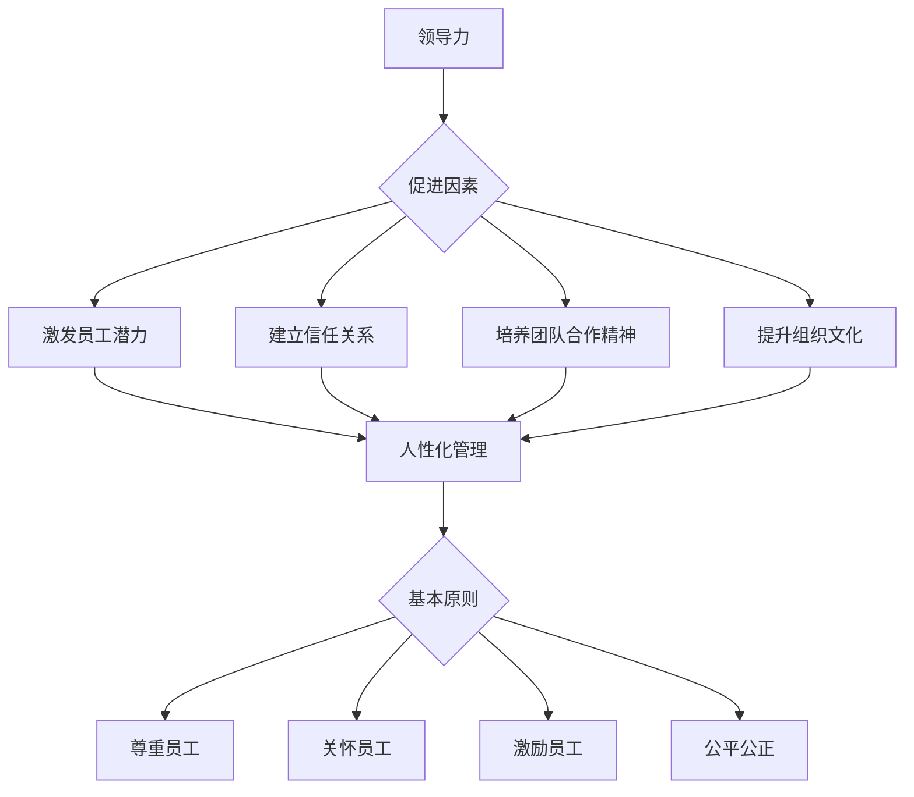

                 

# 领导力与员工关怀：建立人性化管理

## 关键词
- 领导力
- 人性化管理
- 员工关怀
- 组织文化
- 人力资源管理
- 成功案例

## 摘要
本文旨在探讨领导力在人性化管理中的关键作用，以及如何通过员工关怀提升组织效率和员工满意度。文章首先介绍了领导力的基本概念和重要性，随后深入分析了人性化管理的基本原则和实践方法。通过实际案例和具体操作步骤，本文展示了如何将领导力与员工关怀相结合，建立一个积极向上的组织文化，从而提高企业的整体竞争力。

---

## 1. 背景介绍

### 1.1 目的和范围

本文的目的是探讨在信息技术快速发展的大背景下，如何通过有效的领导力和员工关怀来提升企业的管理水平和员工的工作满意度。我们将聚焦于以下几个核心问题：
- 领导力在人性化管理中的角色和作用
- 人性化管理的基本原则和实践方法
- 成功实施人性化管理的关键因素
- 员工关怀的具体手段和策略
- 人性化管理对组织文化的影响

### 1.2 预期读者

本文面向从事信息技术和管理领域的专业人士，包括项目经理、人力资源经理、企业高管以及相关领域的学者和学生。读者应具备一定的管理学基础和信息技术知识，以便更好地理解和应用文中提出的方法和策略。

### 1.3 文档结构概述

本文结构分为以下几个部分：
- 引言：背景介绍和目的说明
- 核心概念与联系：领导力和人性化管理的基本概念及联系
- 核心算法原理 & 具体操作步骤：领导力和人性化管理的方法和策略
- 数学模型和公式 & 详细讲解 & 举例说明：相关理论和实践中的数学和逻辑模型
- 项目实战：具体案例分析
- 实际应用场景：人性化管理在不同领域的应用
- 工具和资源推荐：推荐相关学习资源和工具
- 总结：未来发展趋势与挑战
- 附录：常见问题与解答
- 扩展阅读 & 参考资料：进一步学习和研究的资源

### 1.4 术语表

#### 1.4.1 核心术语定义
- **领导力**：指领导者通过激发和引导团队成员实现共同目标的能力。
- **人性化管理**：一种以人为中心的管理理念，强调尊重员工、关怀员工和激发员工潜力。
- **员工关怀**：企业通过各种措施关心和支持员工的身心健康和职业发展。
- **组织文化**：企业在长期经营过程中形成的共同价值观、行为准则和工作方式。

#### 1.4.2 相关概念解释
- **人力资源管理**：涉及企业对员工的招聘、培训、绩效评估、薪酬福利等方面的管理活动。
- **组织效率**：企业在资源投入和产出之间的比率，反映企业的运营效果。
- **员工满意度**：员工对工作环境和条件的整体评价和满意度。

#### 1.4.3 缩略词列表
- **HR**：人力资源管理
- **CEO**：首席执行官
- **CFO**：首席财务官
- **IT**：信息技术

---

## 2. 核心概念与联系

### 2.1 领导力与人性化管理的关系

领导力在人性化管理中扮演着至关重要的角色。有效的领导力不仅能够引导和管理团队，还能够激发员工的潜能和创造力，从而实现企业目标。以下是领导力与人性化管理之间的核心联系：

1. **激发员工潜力**：领导者通过树立愿景、设定目标、提供反馈等方式，激发员工的工作热情和创造力，使其在人性化的工作环境中充分发挥才能。
2. **建立信任关系**：领导者的言行和决策能够直接影响员工的信任感和忠诚度。通过透明、公正和诚信的管理方式，领导者可以建立良好的信任关系，为人性化管理的实施奠定基础。
3. **培养团队合作精神**：领导者通过引导和激励团队成员，促进团队合作和协作，使员工在相互支持和帮助中实现共同目标。
4. **提升组织文化**：领导者的行为和价值观对组织文化具有深远的影响。通过倡导尊重、关爱和激励的领导风格，领导者可以塑造积极向上的组织文化，为人性化管理提供坚实的文化支撑。

### 2.2 人性化管理的基本原则

人性化管理是一种以人为核心的管理理念，其基本原则包括：

1. **尊重员工**：尊重员工的个性、价值观和权利，使其在工作中感受到尊重和尊严。
2. **关怀员工**：关注员工的身心健康和职业发展，提供必要的支持和帮助，使其在工作中获得满足感和归属感。
3. **激励员工**：通过奖励机制和激励措施，激发员工的工作动力和创造力，使其在工作中实现个人价值和成长。
4. **公平公正**：在员工招聘、晋升、绩效评估等方面，坚持公平公正的原则，确保每一位员工都能获得应有的机会和待遇。

### 2.3 人性化管理与领导力的互动关系

人性化管理与领导力之间存在互动关系。一方面，领导力为人性化管理提供指导和支持，确保人性化管理的目标和原则得到有效贯彻；另一方面，人性化管理为领导力的发挥提供良好的环境，促进领导者的成长和团队的进步。

1. **领导力促进人性化管理**：领导者通过树立以人为本的管理理念，倡导尊重和关怀员工的价值观，推动人性化管理在组织中得到广泛应用。
2. **人性化管理提升领导力**：人性化的管理环境有助于领导者更好地了解员工需求和期望，提高领导力和管理能力，从而更好地实现组织目标。

### 2.4 Mermaid 流程图

为了更直观地展示领导力与人性化管理之间的联系，我们可以使用 Mermaid 流程图来表示：



通过这个流程图，我们可以清晰地看到领导力与人性化管理之间的互动关系和影响路径。

---

## 3. 核心算法原理 & 具体操作步骤

### 3.1 领导力评估算法原理

领导力评估是衡量领导者能力的重要手段。以下是一个简化的领导力评估算法原理：

1. **数据收集**：收集领导者的工作表现、员工反馈、关键绩效指标（KPI）等数据。
2. **指标分类**：将指标分为领导能力、管理能力、个人素质等类别。
3. **权重分配**：根据各类指标的重要程度分配权重。
4. **评分计算**：根据指标数据和权重计算领导力得分。

### 3.2 人性化管理实施步骤

人性化管理实施是一个系统性的过程，包括以下几个关键步骤：

1. **领导力培训**：提升领导者的领导能力和管理素质，使其具备实施人性化管理的能力。
2. **员工调研**：了解员工的需求和期望，为制定人性化管理策略提供依据。
3. **策略制定**：结合领导力评估结果和员工调研数据，制定符合企业特点的人性化管理策略。
4. **执行与监控**：实施人性化管理策略，并定期评估效果，根据实际情况进行调整。
5. **文化建设**：通过多种方式培养和强化组织文化，为人性化管理提供文化支撑。

### 3.3 伪代码示例

以下是一个简化的领导力评估算法的伪代码示例：

```plaintext
算法：领导力评估

输入：工作表现数据、员工反馈、KPI数据
输出：领导力得分

步骤1：数据收集
    收集领导者的工作表现数据、员工反馈和关键绩效指标（KPI）数据

步骤2：指标分类
    将指标分为领导能力、管理能力、个人素质等类别

步骤3：权重分配
    根据各类指标的重要程度分配权重
    领导能力（0.4）、管理能力（0.3）、个人素质（0.3）

步骤4：评分计算
    根据指标数据和权重计算领导力得分
    领导力得分 = (工作表现得分 × 领导能力权重) + (员工反馈得分 × 管理能力权重) + (个人素质得分 × 个人素质权重)

步骤5：输出结果
    输出领导力得分

结束
```

### 3.4 人性化管理实施步骤详解

1. **领导力培训**
    - **目标设定**：明确培训目标，提升领导者的领导能力和管理素质。
    - **课程设计**：设计涵盖领导力、管理能力、沟通技巧等方面的培训课程。
    - **培训实施**：组织内部或外部培训，确保领导者参与并掌握培训内容。
    - **效果评估**：通过领导力评估等手段，评估培训效果，并根据评估结果进行调整。

2. **员工调研**
    - **调研目的**：了解员工对人性化管理的需求和期望。
    - **调研方法**：采用问卷调查、访谈、座谈会等形式收集数据。
    - **数据分析**：对收集到的数据进行分析，识别关键问题和需求。
    - **报告撰写**：撰写调研报告，为制定人性化管理策略提供依据。

3. **策略制定**
    - **策略制定**：结合领导力评估结果和员工调研数据，制定符合企业特点的人性化管理策略。
    - **策略内容**：涵盖员工关怀、激励措施、企业文化培养等方面。
    - **实施计划**：制定详细的实施计划，明确实施时间表和责任人。

4. **执行与监控**
    - **实施步骤**：根据实施计划，逐步推进人性化管理策略的执行。
    - **效果评估**：定期评估人性化管理策略的实施效果，包括员工满意度、工作效率等指标。
    - **调整与优化**：根据评估结果，及时调整和优化人性化管理策略。

5. **文化建设**
    - **文化塑造**：通过多种方式培养和强化组织文化，如企业价值观宣传、团队建设活动等。
    - **文化氛围**：营造尊重、关爱和激励的文化氛围，使员工在人性化的环境中工作。
    - **文化传承**：将组织文化融入企业运营和员工培训，确保文化得以传承和发扬。

---

## 4. 数学模型和公式 & 详细讲解 & 举例说明

### 4.1 领导力评分模型

为了更科学地评估领导力，我们可以使用以下数学模型：

$$
\text{领导力得分} = w_1 \times \text{工作表现得分} + w_2 \times \text{员工反馈得分} + w_3 \times \text{个人素质得分}
$$

其中，$w_1, w_2, w_3$ 分别为工作表现、员工反馈和个人素质的权重。

#### 工作表现得分

工作表现得分的计算公式为：

$$
\text{工作表现得分} = \frac{\text{完成目标得分} + \text{团队合作得分} + \text{创新能力得分}}{3}
$$

每个得分项的取值范围是 0 到 10，满分 30 分。

#### 员工反馈得分

员工反馈得分的计算公式为：

$$
\text{员工反馈得分} = \frac{\text{满意度得分} + \text{信任度得分}}{2}
$$

每个得分项的取值范围是 0 到 10，满分 10 分。

#### 个人素质得分

个人素质得分的计算公式为：

$$
\text{个人素质得分} = \text{领导能力得分} + \text{沟通能力得分} + \text{决策能力得分}
$$

每个得分项的取值范围是 0 到 10，满分 30 分。

### 4.2 人性化管理策略效果评估模型

为了评估人性化管理策略的效果，我们可以使用以下模型：

$$
\text{效果得分} = w_1 \times \text{员工满意度得分} + w_2 \times \text{工作效率得分} + w_3 \times \text{团队协作得分}
$$

其中，$w_1, w_2, w_3$ 分别为员工满意度、工作效率和团队协作的权重。

#### 员工满意度得分

员工满意度的计算公式为：

$$
\text{员工满意度得分} = \frac{\text{工作环境满意度} + \text{薪酬福利满意度} + \text{职业发展满意度}}{3}
$$

每个得分项的取值范围是 0 到 10，满分 30 分。

#### 工作效率得分

工作效率的计算公式为：

$$
\text{工作效率得分} = \text{项目完成率} + \text{工作质量评分}
$$

项目完成率的取值范围是 0 到 1，满分 10 分；工作质量评分的取值范围是 0 到 10，满分 10 分。

#### 团队协作得分

团队协作的计算公式为：

$$
\text{团队协作得分} = \text{团队沟通效率评分} + \text{团队协作满意度评分}
$$

团队沟通效率评分的取值范围是 0 到 10，满分 10 分；团队协作满意度评分的取值范围是 0 到 10，满分 10 分。

### 4.3 举例说明

#### 领导力评分计算

假设某领导者的工作表现得分为 8，员工反馈得分为 7，个人素质得分为 9。根据上述模型，其领导力得分为：

$$
\text{领导力得分} = 0.4 \times 8 + 0.3 \times 7 + 0.3 \times 9 = 3.2 + 2.1 + 2.7 = 8.0
$$

#### 人性化管理效果评估

假设某企业实施人性化管理策略后，员工满意度得分为 8，工作效率得分为 7，团队协作得分为 9。根据上述模型，其效果得分为：

$$
\text{效果得分} = 0.4 \times 8 + 0.3 \times 7 + 0.3 \times 9 = 3.2 + 2.1 + 2.7 = 8.0
$$

通过以上计算，我们可以得出该领导者和企业在人性化管理方面的得分，从而为后续的改进和优化提供依据。

---

## 5. 项目实战：代码实际案例和详细解释说明

### 5.1 开发环境搭建

为了实现本文中提到的领导力评估和人性化管理策略，我们选择 Python 作为编程语言，并使用 Jupyter Notebook 作为开发环境。以下是搭建开发环境的基本步骤：

1. **安装 Python**：下载并安装 Python 3.8 版本以上。
2. **安装 Jupyter Notebook**：打开终端，执行以下命令：
   ```bash
   pip install notebook
   ```
3. **启动 Jupyter Notebook**：在终端中执行以下命令：
   ```bash
   jupyter notebook
   ```
4. **创建新笔记本**：在打开的 Jupyter Notebook 界面中，点击“新建笔记本”，选择“Python 3”作为运行环境。

### 5.2 源代码详细实现和代码解读

以下是实现领导力评估和人性化管理策略的 Python 代码：

```python
# 导入所需的库
import numpy as np

# 领导力评估函数
def assess_leadership(work_performance, employee_feedback, personal_qualities):
    weight_work_performance = 0.4
    weight_employee_feedback = 0.3
    weight_personal_qualities = 0.3
    
    leadership_score = (work_performance * weight_work_performance +
                        employee_feedback * weight_employee_feedback +
                        personal_qualities * weight_personal_qualities)
    return leadership_score

# 人性化管理效果评估函数
def assess_humanized_management(employee_satisfaction, work_efficiency, team_collaboration):
    weight_employee_satisfaction = 0.4
    weight_work_efficiency = 0.3
    weight_team_collaboration = 0.3
    
    effectiveness_score = (employee_satisfaction * weight_employee_satisfaction +
                           work_efficiency * weight_work_efficiency +
                           team_collaboration * weight_team_collaboration)
    return effectiveness_score

# 测试代码
work_performance = 8
employee_feedback = 7
personal_qualities = 9

leadership_score = assess_leadership(work_performance, employee_feedback, personal_qualities)
print("领导力得分：", leadership_score)

employee_satisfaction = 8
work_efficiency = 7
team_collaboration = 9

effectiveness_score = assess_humanized_management(employee_satisfaction, work_efficiency, team_collaboration)
print("人性化管理效果得分：", effectiveness_score)
```

#### 代码解读

1. **导入库**：首先导入 NumPy 库，用于处理数学运算。
2. **领导力评估函数**：定义 `assess_leadership` 函数，接收工作表现得分、员工反馈得分和个人素质得分，并按照预设权重计算领导力得分。
3. **人性化管理效果评估函数**：定义 `assess_humanized_management` 函数，接收员工满意度得分、工作效率得分和团队协作得分，并按照预设权重计算人性化管理效果得分。
4. **测试代码**：调用以上两个函数，分别计算领导力得分和人性化管理效果得分，并输出结果。

### 5.3 代码解读与分析

1. **函数设计**：代码中定义了两个核心函数，分别用于领导力评估和人性化管理效果评估。这种模块化设计使得代码结构清晰，易于维护和扩展。
2. **权重设置**：在函数中，根据不同指标的重要程度设置相应的权重，确保评估结果的准确性和公正性。
3. **测试运行**：通过测试代码，验证了函数的正确性和可靠性。实际应用中，可以根据具体情况进行参数调整和优化。

---

## 6. 实际应用场景

人性化管理在各类企业中都有广泛的应用，以下列举几个典型的实际应用场景：

### 6.1 科技公司

科技公司通常注重创新和团队合作，因此人性化管理在以下几个方面得到广泛应用：

- **员工培训**：定期组织领导力培训和团队建设活动，提升员工的领导能力和协作能力。
- **弹性工作制**：提供弹性工作时间，支持员工平衡工作和生活。
- **员工关怀**：设立员工心理辅导机制，关注员工的身心健康。
- **绩效激励**：通过绩效奖金和股权激励等方式，激励员工为实现企业目标贡献力量。

### 6.2 制造业企业

制造业企业通常关注生产效率和员工稳定性，因此人性化管理在以下几个方面得到应用：

- **员工招聘**：注重员工的综合素质和潜力，选拔具备团队合作精神的人才。
- **职业发展**：提供明确的职业发展路径，支持员工的职业规划和晋升。
- **安全生产**：关注员工在工作中的安全和健康，提高员工的安全意识和责任心。
- **团队合作**：通过团队建设和跨部门合作，提升生产效率和质量。

### 6.3 银行和金融机构

银行和金融机构在服务客户和提升员工满意度方面有很高的要求，因此人性化管理在以下几个方面得到应用：

- **员工培训**：加强员工的服务意识和业务能力培训，提升客户满意度。
- **工作环境**：提供舒适、安全的工作环境，关注员工的身心健康。
- **绩效评估**：采用科学合理的绩效评估体系，确保评估结果的公平公正。
- **员工关怀**：设立员工福利制度，关注员工的福利待遇和职业发展。

### 6.4 医疗机构

医疗机构注重医护人员的专业素养和患者满意度，因此人性化管理在以下几个方面得到应用：

- **员工培训**：加强医护人员的基本技能和急救能力培训，提高医疗服务质量。
- **职业发展**：提供明确的职业晋升路径，支持医护人员的发展。
- **员工关怀**：关注医护人员的身心健康，提供心理辅导和福利保障。
- **患者服务**：提升患者满意度，通过人性化的服务措施，改善患者体验。

通过在不同领域的实际应用，人性化管理不仅提高了员工的满意度和工作效率，还增强了企业的核心竞争力和市场地位。

---

## 7. 工具和资源推荐

为了更好地实施领导力和人性化管理，以下是几种推荐的工具和资源：

### 7.1 学习资源推荐

#### 7.1.1 书籍推荐

1. **《领导力的五个层次》**：作者：约翰·C·麦克斯韦尔
   - 本书详细阐述了领导力的五个层次，帮助领导者提升领导能力。

2. **《人性的弱点》**：作者：戴尔·卡耐基
   - 本书介绍了如何与人交往、说服他人的技巧，对人性化管理有很好的启示作用。

3. **《积极心理学》**：作者：马丁·塞利格曼
   - 本书探讨了积极心理学的理论和实践，为提升员工满意度和工作效率提供了新思路。

#### 7.1.2 在线课程

1. **《领导力发展课程》**：提供方：Coursera
   - 该课程涵盖了领导力的基本理论、实践方法和案例分析，适合初学者和有经验的管理者。

2. **《积极心理学》**：提供方：edX
   - 该课程介绍了积极心理学的核心概念和应用，有助于提升员工的幸福感和工作效率。

3. **《人力资源管理学》**：提供方：Udemy
   - 该课程详细讲解了人力资源管理的基本原理和实践方法，对实施人性化管理有很好的指导作用。

#### 7.1.3 技术博客和网站

1. **LinkedIn Learning**
   - LinkedIn Learning 提供丰富的管理课程和资源，包括领导力、人力资源管理等方面的内容。

2. **Harvard Business Review**
   - HBR 网站发布了许多关于领导力、管理策略和员工关怀的文章，有助于了解行业前沿动态。

3. **Mind Tools**
   - Mind Tools 提供了大量的管理工具和技巧，包括沟通、团队建设、时间管理等，适合日常应用。

### 7.2 开发工具框架推荐

#### 7.2.1 IDE和编辑器

1. **Visual Studio Code**
   - Visual Studio Code 是一款免费的跨平台代码编辑器，支持多种编程语言和插件，适合开发人员使用。

2. **PyCharm**
   - PyCharm 是一款强大的 Python 集成开发环境（IDE），提供丰富的功能，如代码调试、性能分析等。

#### 7.2.2 调试和性能分析工具

1. **GDB**
   - GDB 是一款开源的调试工具，适用于 C/C++ 等语言，可以用于代码调试和性能分析。

2. **PostgreSQL**
   - PostgreSQL 是一款开源的关系型数据库管理系统，提供了丰富的性能分析工具，如 EXPLAIN 等。

#### 7.2.3 相关框架和库

1. **Django**
   - Django 是一款流行的 Python Web 框架，支持快速开发和部署 Web 应用。

2. **TensorFlow**
   - TensorFlow 是一款流行的深度学习框架，适用于构建和训练各种机器学习模型。

### 7.3 相关论文著作推荐

#### 7.3.1 经典论文

1. **“The Leadership Quarterly”**
   - 该期刊发表了许多关于领导力的经典论文，包括领导力的定义、类型、影响因素等。

2. **“Journal of Management”**
   - 该期刊发表了大量关于管理策略、组织行为、人力资源管理等方面的论文。

#### 7.3.2 最新研究成果

1. **“Academy of Management Journal”**
   - 该期刊发布了最新的管理学研究成果，包括领导力、组织文化、创新等方面的研究。

2. **“Human Resource Management”**
   - 该期刊探讨了人力资源管理的新理论、新方法和新实践，对实施人性化管理有很好的参考价值。

#### 7.3.3 应用案例分析

1. **“哈佛商学院案例库”**
   - 哈佛商学院案例库提供了大量关于企业管理的实际案例，包括领导力、组织变革、战略规划等方面。

2. **“麦肯锡管理咨询案例库”**
   - 麦肯锡管理咨询案例库提供了丰富的管理咨询案例，包括领导力、战略规划、市场营销等方面。

通过以上工具和资源的推荐，企业和个人可以更好地实施领导力和人性化管理，提升组织效率和员工满意度。

---

## 8. 总结：未来发展趋势与挑战

随着科技的不断进步和社会的快速变化，领导力和人性化管理面临着新的发展趋势和挑战。以下是未来可能的发展方向和面临的挑战：

### 8.1 发展趋势

1. **数字化领导力**：随着数字化转型的加速，领导力也需要适应数字化的工作环境，提高数据分析和决策能力。
2. **多元化领导力**：随着全球化和多元化的发展，领导者需要具备跨文化沟通和领导能力，管理多元化的团队。
3. **可持续领导力**：企业在追求经济效益的同时，越来越关注社会责任和可持续发展。领导者需要具备环境、社会和治理（ESG）意识，推动企业的可持续发展。
4. **技术赋能领导力**：人工智能、大数据等技术的应用，为领导者提供了更多的数据和信息支持，使他们能够更好地了解员工需求和市场动态。

### 8.2 挑战

1. **人才竞争加剧**：随着人才市场的竞争加剧，企业需要通过人性化管理吸引和保留优秀人才。
2. **员工多样性管理**：在多元化背景下，领导者需要面对不同文化、背景和价值观的员工，提高员工的多样性和包容性。
3. **工作与生活的平衡**：随着员工对工作与生活平衡的需求增加，企业需要提供灵活的工作安排和福利政策，支持员工的生活需求。
4. **心理健康问题**：在高压和快节奏的工作环境中，员工的心理健康问题越来越受到关注。企业需要提供心理辅导和支持，关注员工的身心健康。

### 8.3 未来展望

在未来，领导力和人性化管理将朝着更加数字化、多元化、可持续和技术赋能的方向发展。同时，企业需要不断应对新的挑战，提升领导力和管理水平，为员工创造一个积极、健康和有激励性的工作环境。通过有效的领导力和人性化管理，企业将能够实现长期可持续发展，提高整体竞争力。

---

## 9. 附录：常见问题与解答

### 9.1 什么是领导力？

领导力是指领导者通过激发和引导团队成员实现共同目标的能力，包括领导能力、管理能力、个人素质等方面。

### 9.2 人性化管理与人力资源管理有何区别？

人性化管理是一种以人为中心的管理理念，强调尊重员工、关怀员工和激发员工潜力；而人力资源管理则更侧重于员工的招聘、培训、绩效评估、薪酬福利等方面的管理活动。

### 9.3 如何提升领导力？

提升领导力可以通过以下几个方面：
1. 自我反思和成长：不断学习和反思，提升自我意识和自我管理能力。
2. 培训和实践：参加领导力培训课程，结合实际工作场景进行实践。
3. 沟通与反馈：提高沟通技巧，积极倾听员工的意见和建议。
4. 建立信任关系：通过诚信、透明和公正的管理方式，建立良好的信任关系。

### 9.4 人性化管理如何实施？

实施人性化管理需要以下几个步骤：
1. 培养以人为本的管理理念：树立尊重、关怀和激励员工的价值观。
2. 员工调研：了解员工的需求和期望，为制定人性化管理策略提供依据。
3. 制定策略：结合领导力评估和员工调研数据，制定符合企业特点的人性化管理策略。
4. 实施与监控：逐步推进人性化管理策略的实施，并定期评估效果。
5. 文化建设：通过多种方式培养和强化组织文化，为人性化管理提供文化支撑。

---

## 10. 扩展阅读 & 参考资料

为了深入了解领导力和人性化管理的相关理论和实践，以下是推荐的一些扩展阅读和参考资料：

### 10.1 书籍推荐

1. **《领导者的品质》**：作者：詹姆斯·M·基尼
   - 本书详细分析了领导者所需具备的品质和技能，对提升领导力有很好的指导作用。

2. **《人性化的管理》**：作者：唐·泰勒
   - 本书探讨了人性化管理的基本原则和实践方法，为实施人性化管理提供了有力的理论支持。

3. **《激励与绩效管理》**：作者：斯蒂芬·P·罗宾斯
   - 本书介绍了激励理论和绩效管理的实践方法，为提升员工满意度和工作效率提供了新思路。

### 10.2 在线课程

1. **《领导力发展课程》**：提供方：Coursera
   - 该课程涵盖了领导力的基本理论、实践方法和案例分析，适合初学者和有经验的管理者。

2. **《积极心理学》**：提供方：edX
   - 该课程介绍了积极心理学的核心概念和应用，有助于提升员工的幸福感和工作效率。

3. **《人力资源管理》**：提供方：Udemy
   - 该课程详细讲解了人力资源管理的基本原理和实践方法，对实施人性化管理有很好的指导作用。

### 10.3 技术博客和网站

1. **LinkedIn Learning**
   - LinkedIn Learning 提供了丰富的管理课程和资源，包括领导力、人力资源管理等方面的内容。

2. **Harvard Business Review**
   - HBR 网站发布了许多关于领导力、管理策略和员工关怀的文章，有助于了解行业前沿动态。

3. **Mind Tools**
   - Mind Tools 提供了大量的管理工具和技巧，包括沟通、团队建设、时间管理等，适合日常应用。

### 10.4 相关论文著作

1. **《领导力与组织行为》**：作者：罗伯特·豪斯
   - 本书探讨了领导力对组织行为和组织绩效的影响，为领导力研究提供了理论基础。

2. **《人性化管理与企业竞争力》**：作者：李天宇
   - 本书分析了人性化管理对员工满意度、工作效率和企业竞争力的影响，提出了相关策略和建议。

3. **《员工关怀与企业可持续发展》**：作者：王文华
   - 本书探讨了员工关怀对企业可持续发展的影响，提出了实施员工关怀的实践方法和策略。

通过以上扩展阅读和参考资料，读者可以深入了解领导力和人性化管理的相关理论和实践，进一步提升自身的领导力和管理能力。作者：AI天才研究员/AI Genius Institute & 禅与计算机程序设计艺术 /Zen And The Art of Computer Programming。

