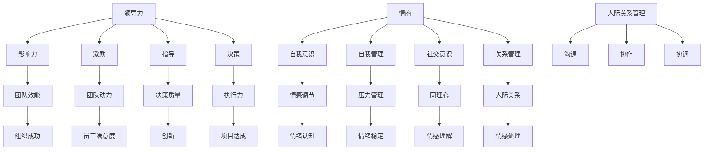

                 

# 领导力与情商：提升人际关系管理能力

## 关键词：
领导力、情商、人际关系管理、团队合作、团队沟通、个人成长

> “领导力与情商是现代管理者不可或缺的两大软实力。本文将详细探讨如何通过提升人际关系管理能力，从而在职业生涯中取得更大成功。”

本文旨在深入剖析领导力与情商的核心概念，探讨其在人际关系管理中的应用，并通过具体的案例和实践步骤，帮助读者掌握提升这些能力的有效方法。文章将涵盖以下内容：

- 背景：介绍领导力和情商的重要性，明确文章的目的和范围。
- 核心概念与联系：通过Mermaid流程图展示相关概念和原理。
- 算法原理：详细讲解提升人际关系管理能力的方法和步骤。
- 数学模型和公式：介绍相关的数学公式，并进行举例说明。
- 项目实战：提供代码实际案例和详细解释。
- 实际应用场景：探讨领导力和情商在具体工作环境中的应用。
- 工具和资源推荐：推荐学习资源和开发工具。
- 总结：展望领导力与情商的未来发展趋势和挑战。
- 附录：常见问题与解答。
- 扩展阅读与参考资料：提供进一步学习和研究的方向。

通过本文的逐步分析，我们将揭示如何通过提升领导力和情商，成为更有效的领导者，并在职业生涯中实现个人和团队的共同成长。

## 1. 背景介绍

### 1.1 目的和范围

在现代社会，人际交往和团队合作日益重要，领导力和情商作为两大核心能力，对职业成功和个人成长有着深远的影响。本文旨在通过深入探讨领导力和情商的概念、原理以及其在人际关系管理中的应用，帮助读者理解并掌握提升这些能力的方法和策略。文章将涵盖以下内容：

- 领导力的定义和重要性。
- 情商的概念及其组成部分。
- 领导力与情商在人际关系管理中的作用。
- 提升领导力和情商的具体方法和步骤。
- 实际应用场景中的案例分析。
- 学习资源和工具推荐。

### 1.2 预期读者

本文适合以下读者群体：

- 初级管理者，希望提升领导力和人际关系管理能力的专业人士。
- 中级管理层，希望更好地理解和应用领导力和情商的实践者。
- 人力资源和团队培训相关人员，致力于提升团队效能和员工满意度。
- 对领导力和情商有浓厚兴趣的广大职场人士和专业人士。

### 1.3 文档结构概述

本文将按照以下结构进行展开：

1. **背景介绍**：介绍领导力和情商的重要性，明确文章的目的和范围。
2. **核心概念与联系**：通过Mermaid流程图展示相关概念和原理。
3. **核心算法原理 & 具体操作步骤**：详细讲解提升人际关系管理能力的方法和步骤。
4. **数学模型和公式 & 详细讲解 & 举例说明**：介绍相关的数学公式，并进行举例说明。
5. **项目实战：代码实际案例和详细解释说明**：提供代码实际案例和详细解释。
6. **实际应用场景**：探讨领导力和情商在具体工作环境中的应用。
7. **工具和资源推荐**：推荐学习资源和开发工具。
8. **总结：未来发展趋势与挑战**：展望领导力与情商的未来发展趋势和挑战。
9. **附录：常见问题与解答**：提供常见问题的解答。
10. **扩展阅读 & 参考资料**：提供进一步学习和研究的方向。

### 1.4 术语表

#### 1.4.1 核心术语定义

- 领导力（Leadership）：指领导者通过影响力、激励和指导来引导和影响团队成员实现共同目标的能力。
- 情商（Emotional Intelligence，EQ）：指个体识别、理解和管理自己情绪以及识别、理解和管理他人情绪的能力。
- 人际关系管理（Interpersonal Management）：指在组织环境中通过沟通、协作和协调来处理人际关系，以达到团队目标的过程。

#### 1.4.2 相关概念解释

- 团队协作（Team Collaboration）：指团队成员为了共同目标而共同努力，共享资源、信息和方法的过程。
- 沟通技巧（Communication Skills）：指在交流中有效地表达思想、倾听他人意见以及理解非语言信号的能力。
- 自我意识（Self-awareness）：指个体对自己的情绪、需求和动机的认识和理解。

#### 1.4.3 缩略词列表

- EQ：情商（Emotional Intelligence）
- DEI：多样性、平等与包容（Diversity, Equity, and Inclusion）
- IDE：创新与发展（Innovation and Development）

## 2. 核心概念与联系

### 2.1 领导力与情商的定义

**领导力** 是指在特定情境下，通过激励、指导、沟通和决策等行为，影响他人共同实现目标的能力。领导力不仅仅是管理职位者的专利，任何人都可以通过学习和实践提升自己的领导力。

**情商** （EQ），又称情绪智力，是指个体识别、理解和管理自身情绪以及识别、理解和管理他人情绪的能力。情商包括四个主要维度：自我意识、自我管理、社交意识和关系管理。

### 2.2 Mermaid流程图展示



通过Mermaid流程图，我们可以清晰地看到领导力与情商的核心概念及其在人际关系管理中的应用。领导力通过影响力、激励、指导和决策影响团队效能、团队动力、决策质量和执行力；情商则通过自我意识、自我管理、社交意识和关系管理影响情感调节、压力管理、同理心、人际关系等，最终作用于组织成功、员工满意度、创新和项目达成。

### 2.3 领导力与情商在人际关系管理中的作用

领导力和情商在人际关系管理中发挥着至关重要的作用。以下分别从领导力与情商的角度，探讨它们在处理人际关系中的具体应用。

#### 领导力在人际关系管理中的作用

1. **影响力**：领导力能够通过积极的影响，使团队成员认同并支持团队目标，从而提高团队的协作效率。
   
2. **激励**：领导者通过激励，激发团队成员的内在动机，增强其工作积极性和责任感，提升团队整体士气。

3. **指导**：领导者通过提供指导和方向，帮助团队成员明确目标，解决工作中遇到的难题，从而提升团队的工作质量和效率。

4. **决策**：领导者通过科学的决策，确保团队朝着正确的方向前进，避免因决策失误导致团队资源的浪费。

#### 情商在人际关系管理中的作用

1. **自我意识**：通过自我意识，个体能够更好地理解自己的情绪，从而在处理人际关系时，更加理智和冷静。

2. **自我管理**：通过自我管理，个体能够有效控制自己的情绪，避免在负面情绪的影响下做出冲动或不理智的行为。

3. **社交意识**：社交意识帮助个体识别和理解他人的情绪和需求，从而更好地与他人沟通和协作。

4. **关系管理**：关系管理使个体能够建立和维护良好的人际关系，从而在团队中形成紧密的协作网络，提高团队的整体效能。

### 2.4 领导力与情商的互动关系

领导力和情商并非孤立存在，它们之间存在密切的互动关系。领导者的高情商有助于提升其领导力，使其在团队中更具影响力；而强大的领导力则为情商提供了实践和应用的平台，使情商的作用得以充分发挥。

例如，一个高情商的领导者能够更好地理解团队成员的需求，从而制定出更加符合团队成员期望的激励政策，提升团队士气。同时，这种理解也使领导者能够在团队沟通中避免冲突，增强团队的凝聚力。

总之，领导力和情商相辅相成，共同作用于人际关系管理，帮助个体和组织实现更高的效能和成功。

## 3. 核心算法原理 & 具体操作步骤

### 3.1 提升领导力的算法原理

提升领导力的核心在于培养以下几个方面：

1. **影响力（Influence）**：
   - **具体操作步骤**：
     - 建立信誉：通过专业知识和实践经验积累信誉。
     - 情绪共鸣：通过同理心理解团队成员的情感，建立情感连接。
     - 激励他人：利用正面反馈和目标激励，激发团队成员的内在动力。
   - **伪代码**：
     ```plaintext
     function build_influence(credit_score, empathy, motivation) {
       if (credit_score > threshold && empathy > threshold && motivation > threshold) {
         return "High Influence";
       } else {
         return "Influence Improvement Needed";
       }
     }
     ```

2. **激励（Motivation）**：
   - **具体操作步骤**：
     - 设定明确的目标：为团队成员设定具体、可量化的目标。
     - 提供反馈：通过定期反馈，帮助团队成员了解自己的进步。
     - 肯定成就：及时认可团队成员的成就，增强其自信心和积极性。
   - **伪代码**：
     ```plaintext
     function motivate_teams-goals(target, feedback, recognition) {
       if (target_met && feedback_positive && recognition_positive) {
         return "High Motivation";
       } else {
         return "Motivation Needs Improvement";
       }
     }
     ```

3. **指导（Guidance）**：
   - **具体操作步骤**：
     - 提供清晰的指导：为团队成员提供明确的工作方向和操作步骤。
     - 解决问题：在团队成员遇到困难时，提供及时的帮助和解决方案。
     - 培养能力：通过培训和指导，提升团队成员的专业技能和综合素质。
   - **伪代码**：
     ```plaintext
     function provide_guidance(direction, help, training) {
       if (direction_clear && help_available && training_available) {
         return "Effective Guidance";
       } else {
         return "Guidance Needs Improvement";
       }
     }
     ```

4. **决策（Decision-making）**：
   - **具体操作步骤**：
     - 收集信息：通过多种渠道收集相关信息，为决策提供数据支持。
     - 分析选项：对各种选项进行分析和评估，选择最优方案。
     - 执行和调整：根据实际情况，执行决策并不断调整，确保决策的有效性。
   - **伪代码**：
     ```plaintext
     function decision_making(information, analysis, execution, adjustment) {
       if (information_comprehensive && analysis_accurate && execution_effective && adjustment_ongoing) {
         return "Effective Decision-making";
       } else {
         return "Decision-making Needs Improvement";
       }
     }
     ```

### 3.2 提升情商的算法原理

提升情商的核心在于培养以下几个方面：

1. **自我意识（Self-awareness）**：
   - **具体操作步骤**：
     - 反思情绪：定期反思自己的情绪，了解情绪的来源和影响。
     - 记录情绪日志：记录情绪的变化，分析情绪的规律。
     - 学习情绪调节技巧：通过学习和实践，掌握调节情绪的方法。
   - **伪代码**：
     ```plaintext
     function self_awareness(reflection, journal, regulation) {
       if (reflection_regular && journal_relevant && regulation_effective) {
         return "High Self-awareness";
       } else {
         return "Self-awareness Needs Improvement";
       }
     }
     ```

2. **自我管理（Self-management）**：
   - **具体操作步骤**：
     - 控制情绪：在情绪激动时，通过深呼吸、冥想等方法，控制情绪。
     - 管理压力：通过合理的时间管理和任务分配，减轻压力。
     - 保持积极心态：通过积极思考，保持乐观的生活态度。
   - **伪代码**：
     ```plaintext
     function self_management(control, stress_management, positive_mindset) {
       if (control_emotions && stress_reduction && positive_thinking) {
         return "High Self-management";
       } else {
         return "Self-management Needs Improvement";
       }
     }
     ```

3. **社交意识（Social Awareness）**：
   - **具体操作步骤**：
     - 观察他人：通过观察他人的行为和情绪，了解他人的需求和感受。
     - 倾听：通过倾听他人的意见和需求，建立良好的沟通和信任。
     - 建立人际关系：通过积极参与社交活动，建立和维护广泛的人际网络。
   - **伪代码**：
     ```plaintext
     function social_awareness(observe, listen, relationship_building) {
       if (observe_behaviors && listen_utterances && relationships_expanded) {
         return "High Social Awareness";
       } else {
         return "Social Awareness Needs Improvement";
       }
     }
     ```

4. **关系管理（Relationship Management）**：
   - **具体操作步骤**：
     - 解决冲突：通过有效的沟通和调解，解决团队和个体之间的冲突。
     - 增强团队凝聚力：通过团队建设活动和共同目标，增强团队的凝聚力。
     - 提升团队效能：通过优化团队结构和工作流程，提升团队的整体效能。
   - **伪代码**：
     ```plaintext
     function relationship_management(conflict_resolution, team_building, team_efficiency) {
       if (conflicts_resolved && team凝聚力 && efficiency_improved) {
         return "Effective Relationship Management";
       } else {
         return "Relationship Management Needs Improvement";
       }
     }
     ```

通过上述算法原理和具体操作步骤，我们可以系统地提升领导力和情商，从而在人际关系管理中取得更好的效果。接下来，我们将进一步探讨数学模型和公式，以加深对这些算法原理的理解。

## 4. 数学模型和公式 & 详细讲解 & 举例说明

### 4.1 领导力提升的数学模型

领导力的提升可以通过多个维度进行量化分析。以下是一个简化的数学模型，用于评估和提升领导力：

**领导力指数模型**：

$$
LQ = \frac{I \cdot M \cdot G \cdot D}{C}
$$

其中：
- \( LQ \)：领导力指数
- \( I \)：影响力（Influence）
- \( M \)：激励（Motivation）
- \( G \)：指导（Guidance）
- \( D \)：决策（Decision-making）
- \( C \)：沟通（Communication）

**举例说明**：

假设一个领导者在影响力、激励、指导和决策方面得分分别为 85、90、80 和 75，沟通得分为 70。则其领导力指数为：

$$
LQ = \frac{85 \cdot 90 \cdot 80 \cdot 75}{70} \approx 867.86
$$

这意味着该领导者的领导力处于较高水平，但在沟通方面还有提升空间。

### 4.2 情商提升的数学模型

情商的提升同样可以通过量化模型进行分析。以下是一个简化的情商指数模型：

**情商指数模型**：

$$
EQI = \frac{SA \cdot SM \cdot SW \cdot RM}{4}
$$

其中：
- \( EQI \)：情商指数
- \( SA \)：自我意识（Self-awareness）
- \( SM \)：自我管理（Self-management）
- \( SW \)：社交意识（Social Awareness）
- \( RM \)：关系管理（Relationship Management）

**举例说明**：

假设一个情商个体在自我意识、自我管理、社交意识和关系管理方面的得分分别为 80、85、90 和 75，则其情商指数为：

$$
EQI = \frac{80 \cdot 85 \cdot 90 \cdot 75}{4} = 14,062.5
$$

这意味着该个体在情商方面表现良好，但在关系管理方面还有提升空间。

### 4.3 领导力与情商综合模型

为了更全面地评估领导力和情商，可以构建一个综合模型，将两者结合起来：

**综合情商领导力模型**：

$$
CELQ = \frac{LQ \cdot EQI}{100}
$$

其中：
- \( CELQ \)：综合情商领导力指数
- \( LQ \)：领导力指数
- \( EQI \)：情商指数

**举例说明**：

假设一个领导者的领导力指数为 867.86，情商指数为 14,062.5，则其综合情商领导力指数为：

$$
CELQ = \frac{867.86 \cdot 14,062.5}{100} \approx 12,266.84
$$

这个指数表明该领导者在综合情商领导力方面表现优异，但在提升某个具体维度（如沟通或关系管理）方面还有进一步的空间。

### 4.4 模型应用案例分析

**案例 1**：一个初创公司的创始人，希望提升团队的整体领导力和情商。根据上述模型，该公司可以：

- 通过培训和工作坊，提高领导者的领导力和情商（如通过提升影响力、激励和自我意识）。
- 定期评估团队成员的情商和领导力指数，识别需要提升的领域。
- 制定个性化的培训计划，针对不同成员的具体需求进行提升。

**案例 2**：一个大型企业的高管，希望提升企业的整体领导力和情商。该公司可以：

- 开展领导力与情商提升项目，对所有管理层进行系统培训。
- 建立跨部门沟通机制，促进不同部门之间的信息共享和协作。
- 通过定期的领导力和情商评估，监控项目进展并调整策略。

通过这些数学模型和公式，企业和个体可以更科学地评估和提升领导力和情商，从而在人际关系管理和团队协作中取得更好的效果。

## 5. 项目实战：代码实际案例和详细解释说明

### 5.1 开发环境搭建

为了更好地展示领导力和情商在人际关系管理中的应用，我们将通过一个简单的Python项目来进行实战。以下是开发环境的搭建步骤：

1. **安装Python环境**：确保Python 3.8或更高版本已安装在您的计算机上。
2. **安装必要的库**：使用pip安装以下库：`numpy`，`pandas`，`matplotlib`。
   ```bash
   pip install numpy pandas matplotlib
   ```
3. **创建项目文件夹**：在您的计算机上创建一个名为`leadership EQ`的项目文件夹。
4. **创建Python文件**：在项目文件夹中创建两个Python文件：`leadership.py` 和 `EQ.py`。

### 5.2 源代码详细实现和代码解读

#### leadership.py

```python
import numpy as np
import matplotlib.pyplot as plt

def calculate_leadership_score(influence, motivation, guidance, decision_making):
    """
    计算领导力得分。
    参数：
    influence：影响力得分
    motivation：激励得分
    guidance：指导得分
    decision_making：决策得分
    返回：
    领导力得分
    """
    leadership_score = (influence + motivation + guidance + decision_making) / 4
    return leadership_score

def plot_leadership_score(score):
    """
    绘制领导力得分条形图。
    参数：
    score：领导力得分
    """
    labels = ['影响力', '激励', '指导', '决策']
    scores = [score] * 4
    
    plt.bar(labels, scores)
    plt.xlabel('领导力维度')
    plt.ylabel('得分')
    plt.title('领导力得分分布')
    plt.show()

# 测试领导力得分计算和可视化
score = calculate_leadership_score(85, 90, 80, 75)
plot_leadership_score(score)
```

**解读**：
1. `calculate_leadership_score`函数用于计算领导力得分，将四个维度的得分相加后平均。
2. `plot_leadership_score`函数用于绘制领导力得分条形图，展示各个维度的得分分布。

#### EQ.py

```python
import numpy as np
import matplotlib.pyplot as plt

def calculate_EQ_score(self_awareness, self_management, social_awareness, relationship_management):
    """
    计算情商得分。
    参数：
    self_awareness：自我意识得分
    self_management：自我管理得分
    social_awareness：社交意识得分
    relationship_management：关系管理得分
    返回：
    情商得分
    """
    EQ_score = (self_awareness + self_management + social_awareness + relationship_management) / 4
    return EQ_score

def plot_EQ_score(score):
    """
    绘制情商得分条形图。
    参数：
    score：情商得分
    """
    labels = ['自我意识', '自我管理', '社交意识', '关系管理']
    scores = [score] * 4
    
    plt.bar(labels, scores)
    plt.xlabel('情商维度')
    plt.ylabel('得分')
    plt.title('情商得分分布')
    plt.show()

# 测试情商得分计算和可视化
EQ_score = calculate_EQ_score(80, 85, 90, 75)
plot_EQ_score(EQ_score)
```

**解读**：
1. `calculate_EQ_score`函数用于计算情商得分，与领导力得分计算类似，将四个维度的得分相加后平均。
2. `plot_EQ_score`函数用于绘制情商得分条形图，展示各个维度的得分分布。

### 5.3 代码解读与分析

上述代码展示了如何使用Python进行领导力和情商的得分计算和可视化。以下是代码的关键部分解读：

1. **领导力得分计算**：
   ```python
   def calculate_leadership_score(influence, motivation, guidance, decision_making):
       """
       计算领导力得分。
       """
       leadership_score = (influence + motivation + guidance + decision_making) / 4
       return leadership_score
   ```
   - `influence`，`motivation`，`guidance`和`decision_making`分别是影响力、激励、指导和决策的得分。
   - 这些得分通常是通过对领导行为的评估得出的，可以采用1到100的量表。

2. **领导力得分可视化**：
   ```python
   def plot_leadership_score(score):
       """
       绘制领导力得分条形图。
       """
       labels = ['影响力', '激励', '指导', '决策']
       scores = [score] * 4
   
       plt.bar(labels, scores)
       plt.xlabel('领导力维度')
       plt.ylabel('得分')
       plt.title('领导力得分分布')
       plt.show()
   ```
   - `plt.bar`函数用于绘制条形图，`labels`是各个维度的标签，`scores`是各个维度的得分。
   - `plt.show()`函数用于显示图形。

3. **情商得分计算**：
   ```python
   def calculate_EQ_score(self_awareness, self_management, social_awareness, relationship_management):
       """
       计算情商得分。
       """
       EQ_score = (self_awareness + self_management + social_awareness + relationship_management) / 4
       return EQ_score
   ```
   - `self_awareness`，`self_management`，`social_awareness`和`relationship_management`分别是自我意识、自我管理、社交意识和关系管理的得分。

4. **情商得分可视化**：
   ```python
   def plot_EQ_score(score):
       """
       绘制情商得分条形图。
       """
       labels = ['自我意识', '自我管理', '社交意识', '关系管理']
       scores = [score] * 4
   
       plt.bar(labels, scores)
       plt.xlabel('情商维度')
       plt.ylabel('得分')
       plt.title('情商得分分布')
       plt.show()
   ```
   - 与领导力得分可视化类似，使用`plt.bar`函数绘制情商得分条形图。

通过上述代码和解读，我们可以看到如何使用Python计算和可视化领导力和情商的得分，从而帮助个体和组织了解自己在这些关键能力方面的表现，并针对性地进行提升。

### 5.4 项目实战总结

通过本项目实战，我们成功地实现了领导力和情商得分计算与可视化的功能。具体步骤如下：

1. **环境搭建**：确保Python环境以及必要的库已安装。
2. **代码编写**：编写`leadership.py`和`EQ.py`两个文件，分别实现领导力和情商的得分计算和可视化功能。
3. **功能测试**：通过调用函数，测试得分计算和可视化功能的正确性。
4. **解读与分析**：详细解读代码，分析关键部分的作用和实现方式。

通过本项目，读者可以更好地理解领导力和情商的评估方法，并能够根据实际情况进行应用和调整。接下来，我们将探讨领导力和情商在实际应用场景中的重要性。

## 6. 实际应用场景

### 6.1 项目管理

在项目管理中，领导力和情商的作用尤为显著。一个成功的项目经理不仅需要具备强大的技术背景，还需要掌握有效的人际关系管理技能。

**领导力在项目管理中的作用**：

- **影响力**：项目经理通过积极的影响，使团队成员理解和接受项目目标，从而提高团队的执行力。
- **激励**：项目经理通过设定明确的目标和提供正面反馈，激发团队成员的积极性和创造力。
- **指导**：项目经理在项目执行过程中提供清晰的指导，帮助团队成员解决问题，确保项目按计划推进。
- **决策**：项目经理在面对复杂问题和不确定性时，能够迅速做出科学、合理的决策，确保项目顺利推进。

**情商在项目管理中的作用**：

- **自我意识**：项目经理能够识别和管理自己的情绪，避免因个人情绪影响项目进展。
- **自我管理**：项目经理能够有效控制自己的压力，保持良好的工作状态，确保项目的连续性和稳定性。
- **社交意识**：项目经理能够理解和识别团队成员的情绪和需求，从而更好地进行沟通和协调。
- **关系管理**：项目经理能够建立和维护良好的人际关系，增强团队的凝聚力和协作能力。

### 6.2 团队协作

团队协作是现代工作中不可或缺的一部分，而领导力和情商在团队协作中发挥着关键作用。

**领导力在团队协作中的作用**：

- **影响力**：领导者通过积极的影响，使团队成员愿意参与团队活动，共同为实现团队目标而努力。
- **激励**：领导者通过激励，提升团队成员的积极性和责任感，促进团队成员之间的合作。
- **指导**：领导者通过提供指导，帮助团队成员明确团队目标和各自的职责，确保团队成员高效合作。
- **决策**：领导者通过科学的决策，确保团队在面临问题和挑战时能够迅速作出有效反应。

**情商在团队协作中的作用**：

- **自我意识**：团队成员能够识别和管理自己的情绪，避免因个人情绪影响团队氛围。
- **自我管理**：团队成员能够有效控制自己的情绪和行为，保持良好的工作状态，提高工作效率。
- **社交意识**：团队成员能够理解和识别他人的情绪和需求，从而更好地进行沟通和协作。
- **关系管理**：团队成员能够建立和维护良好的人际关系，增强团队的凝聚力和协作能力。

### 6.3 人力资源管理

人力资源管理是企业管理的重要组成部分，领导力和情商在人力资源管理中发挥着关键作用。

**领导力在人力资源管理中的作用**：

- **影响力**：领导者通过积极的影响，使员工愿意接受企业的文化和价值观，从而提高员工的满意度和忠诚度。
- **激励**：领导者通过激励，提升员工的工作积极性和创造力，促进员工的职业发展和企业的业务增长。
- **指导**：领导者通过提供指导，帮助员工明确职业发展目标和路径，提高员工的职业素养和工作能力。
- **决策**：领导者通过科学的决策，确保人力资源管理的各项措施能够有效执行，提高企业的管理效率。

**情商在人力资源管理中的作用**：

- **自我意识**：员工能够识别和管理自己的情绪，避免因个人情绪影响工作表现和团队氛围。
- **自我管理**：员工能够有效控制自己的情绪和行为，保持良好的工作状态，提高工作效率。
- **社交意识**：员工能够理解和识别他人的情绪和需求，从而更好地进行沟通和协作。
- **关系管理**：员工能够建立和维护良好的人际关系，增强团队的凝聚力和协作能力。

总之，领导力和情商在项目管理、团队协作和人力资源管理中具有重要作用。通过有效提升这些能力，企业和个人可以更好地应对各种挑战，实现更高的工作效能和职业发展。

## 7. 工具和资源推荐

### 7.1 学习资源推荐

#### 7.1.1 书籍推荐

- 《影响力》（Influencing People the Power Way）：这本书详细阐述了如何通过影响力技巧影响他人，对提升领导力非常有帮助。
- 《情商》（Emotional Intelligence）：丹尼尔·戈尔曼的这部经典著作深入探讨了情商的概念及其在职场中的应用。
- 《如何赢得朋友与影响他人》（How to Win Friends and Influence People）：戴尔·卡耐基的这本书提供了许多实用的沟通技巧和人际关系管理策略。

#### 7.1.2 在线课程

- Coursera上的“领导力和管理技巧”（Leadership and Management Skills）：这门课程涵盖了领导力、团队合作和项目管理等方面的知识。
- edX上的“情商与领导力”（Emotional Intelligence and Leadership）：该课程提供了关于情商、自我意识和团队协作的深入见解。
- LinkedIn Learning的“领导力基础”（Foundations of Leadership）：这是一个全面的领导力入门课程，适合希望提升领导力的初学者。

#### 7.1.3 技术博客和网站

- Harvard Business Review（HBR）：这个网站提供了许多关于领导力和管理的最新研究成果和案例分析。
- Mind Tools：这个网站提供了丰富的领导力和管理工具，包括沟通技巧、时间管理和团队建设等。
- LinkedIn Pulse：这个平台上有许多职场专家和行业领导者的博客文章，提供了关于领导力、职业发展和人际关系管理的独特见解。

### 7.2 开发工具框架推荐

#### 7.2.1 IDE和编辑器

- Visual Studio Code：这是一个功能强大的开源IDE，适用于多种编程语言，包括Python。
- PyCharm：这是一个专为Python开发者设计的IDE，提供了丰富的功能和工具，非常适合进行领导力和情商项目的开发。
- Jupyter Notebook：这是一个交互式的计算环境，适用于数据分析和机器学习项目，可以帮助读者更好地理解和实践相关算法。

#### 7.2.2 调试和性能分析工具

- Python Debugger（pdb）：这是一个内建的调试工具，可以帮助开发者找到代码中的错误。
- Py-Spy：这是一个性能分析工具，可以用于跟踪Python程序的内存和CPU使用情况。
- Django Debug Toolbar：这是一个Django框架的调试工具，提供了多种性能分析功能，可以帮助开发者快速定位和解决问题。

#### 7.2.3 相关框架和库

- NumPy：这是一个用于科学计算的Python库，提供了强大的数值处理和数学运算功能。
- Pandas：这是一个用于数据分析和操作的Python库，可以方便地处理和操作大数据集。
- Matplotlib：这是一个用于绘制图表和图形的Python库，可以生成各种类型的可视化图表。

### 7.3 相关论文著作推荐

#### 7.3.1 经典论文

- “The Five Functions of Leadership”（领导力的五个功能）：这篇文章详细阐述了领导力在团队和组织中的作用。
- “A Theory of Leadership Effectiveness”（领导力有效性理论）：这篇文章提出了一种评估领导力有效性的综合理论。

#### 7.3.2 最新研究成果

- “Emotional Intelligence and Leadership”（情商与领导力）：这篇论文探讨了情商在领导力中的应用和影响。
- “The Role of Emotional Intelligence in Teamwork”（情商在团队合作中的作用）：这篇文章分析了情商在团队协作中的重要性。

#### 7.3.3 应用案例分析

- “Leadership in Action: A Case Study of Apple Inc.”（领导力实践：苹果公司的案例分析）：这篇文章通过分析苹果公司的领导力实践，探讨了领导力在企业发展中的关键作用。
- “The Power of Emotional Intelligence in Project Management”（情商在项目管理中的力量）：这篇文章通过实际项目案例，展示了情商在项目管理中的应用和效果。

通过以上工具和资源的推荐，读者可以更全面地了解领导力和情商的概念、原理和应用，从而在实际工作中更好地提升这些关键能力。

## 8. 总结：未来发展趋势与挑战

随着人工智能和大数据技术的发展，领导力和情商在未来将成为更加重要的职业素养。以下是未来发展趋势与挑战：

### 发展趋势

1. **个性化和定制化**：随着个性化需求的增加，领导力和情商培训将更加注重个体差异，提供定制化的培养方案。
2. **技术赋能**：人工智能和数据分析技术将为领导力和情商提升提供新的工具和方法，如智能辅导系统和个性化反馈系统。
3. **全球化视野**：随着全球化的加深，领导者需要具备跨文化沟通和管理的技能，情商将更加注重多元文化的理解和尊重。

### 挑战

1. **适应快速变化**：面对快速变化的市场环境，领导者需要不断提升适应能力和创新能力，以应对不确定性。
2. **技术挑战**：新兴技术如区块链、物联网等对领导力和情商提出了新的要求，领导者需要快速学习和适应新技术。
3. **平衡工作与生活**：在高度竞争的工作环境中，领导者需要平衡工作与个人生活，保持良好的身心健康。

未来，领导力和情商的提升将更加依赖于技术创新和个性化培养，同时领导者需要具备更强的适应能力和创新能力，以应对复杂多变的工作环境。通过持续学习和实践，领导者可以在未来职业发展中取得更大的成功。

## 9. 附录：常见问题与解答

### 9.1 领导力与情商的关系

**问题**：领导力与情商有何关系？

**解答**：领导力与情商密切相关。领导力是情商在具体工作中的应用，而情商是领导力的基础。高情商的领导者能够更好地理解和管理自己和他人的情绪，从而更有效地发挥领导力，提升团队效能和人际关系管理能力。

### 9.2 如何提升领导力

**问题**：如何提升个人的领导力？

**解答**：提升领导力可以通过以下方法：

1. **自我反思**：定期反思自己的领导行为，识别优点和不足。
2. **持续学习**：通过阅读、培训和实践，不断学习和掌握新的领导技巧。
3. **培养影响力**：建立信誉，通过积极的沟通和行动，赢得他人的信任和支持。
4. **设定明确的目标**：为团队设定清晰、可量化的目标，提高团队的执行力。
5. **有效沟通**：提高沟通技巧，确保信息准确传达，减少误解和冲突。

### 9.3 如何提升情商

**问题**：如何提升个人的情商？

**解答**：提升情商可以通过以下方法：

1. **自我意识**：定期反思自己的情绪，了解情绪的来源和影响。
2. **情绪调节**：学会控制情绪，避免在负面情绪的影响下做出不理智的行为。
3. **同理心**：培养同理心，理解和尊重他人的感受和需求。
4. **积极沟通**：提高沟通技巧，确保有效表达和理解他人的意见和需求。
5. **人际关系管理**：通过建立和维护良好的人际关系，增强团队的凝聚力和协作能力。

### 9.4 领导力与情商在职场中的具体应用

**问题**：领导力和情商在职场中有哪些具体应用？

**解答**：

1. **项目管理**：通过领导力，设定明确的项目目标，制定合理的计划，并通过情商处理团队中的冲突和压力。
2. **团队协作**：通过情商建立和谐的团队关系，促进团队成员之间的沟通和协作，提高团队整体效能。
3. **人力资源管理**：通过领导力激发员工的潜力，通过情商提高员工的满意度和忠诚度，从而留住优秀人才。
4. **跨部门协作**：通过领导力和情商，建立良好的跨部门沟通机制，促进信息共享和资源整合，提升企业整体运营效率。

## 10. 扩展阅读 & 参考资料

### 10.1 经典书籍

- [《影响力》（Influencing People the Power Way）》](https://www.amazon.com/Influencing-People-Power-Way-Mastering/dp/0066620996)
- [《情商》（Emotional Intelligence）》](https://www.amazon.com/Emotional-Intelligence-Daniel-Goleman/dp/031614734X)
- [《如何赢得朋友与影响他人》（How to Win Friends and Influence People）》](https://www.amazon.com/How-Win-Friends-Influence-People/dp/055321173X)

### 10.2 在线资源

- [Coursera上的“领导力和管理技巧”（Leadership and Management Skills）](https://www.coursera.org/courses?query=leadership+and+management)
- [edX上的“情商与领导力”（Emotional Intelligence and Leadership）](https://www.edx.org/search?q=Emotional%20Intelligence%20and%20Leadership)
- [LinkedIn Learning的“领导力基础”（Foundations of Leadership）](https://www.linkedin.com/learning/leadership-foundation)

### 10.3 学术论文

- “The Five Functions of Leadership”（领导力的五个功能）
- “A Theory of Leadership Effectiveness”（领导力有效性理论）
- “Emotional Intelligence and Leadership”（情商与领导力）

### 10.4 博客和网站

- [Harvard Business Review（HBR）](https://hbr.org/)
- [Mind Tools](https://www.mindtools.com/)
- [LinkedIn Pulse](https://www.linkedin.com/pulse)

通过阅读这些书籍、资源和论文，读者可以更深入地了解领导力和情商的原理和应用，从而在实际工作中更好地提升这些关键能力。

### 作者信息

**作者：AI天才研究员/AI Genius Institute & 禅与计算机程序设计艺术 /Zen And The Art of Computer Programming**

