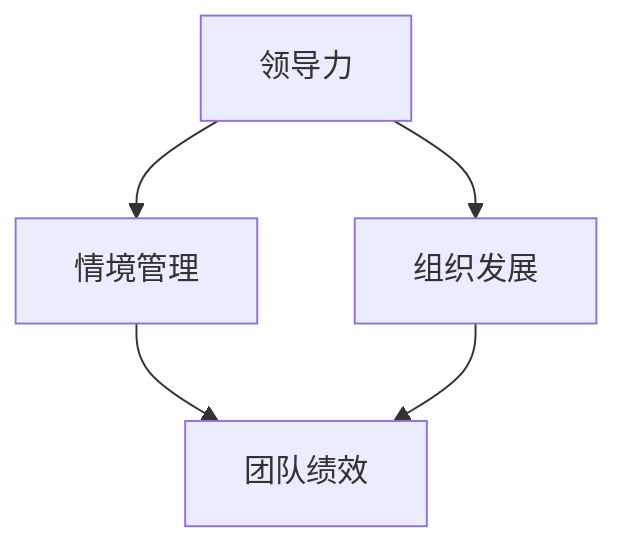

                 

# 领导力与情境管理：因人而异

> 关键词：领导力，情境管理，人才管理，组织发展，激励理论

> 摘要：本文将深入探讨领导力与情境管理在组织发展中的重要性，分析不同情境下领导风格和激励策略的差异，提出因人而异的领导方法和实践指南，帮助组织领导者更好地应对复杂多变的工作环境，提高团队绩效和员工满意度。

## 1. 背景介绍

### 1.1 目的和范围

本文旨在探讨领导力与情境管理在组织发展中的核心作用，分析情境对领导风格和激励策略的影响，以及如何因人而异地进行领导。通过本文的讨论，读者将了解到情境管理的理论基础、关键概念及其在实际应用中的重要性。

### 1.2 预期读者

本文适合组织领导者、人力资源管理者、以及希望提升领导力和管理能力的专业人士阅读。同时，对于对组织行为学和管理学感兴趣的研究者也有一定的参考价值。

### 1.3 文档结构概述

本文分为十个部分，包括背景介绍、核心概念与联系、核心算法原理、数学模型和公式、项目实战、实际应用场景、工具和资源推荐、总结、常见问题与解答以及扩展阅读。每个部分都将深入探讨相关主题，提供具体的实践指导和理论支持。

### 1.4 术语表

#### 1.4.1 核心术语定义

- **领导力**：指领导者通过影响、激励和指导他人，实现组织目标和团队绩效的能力。
- **情境管理**：根据不同的情境和员工特点，灵活调整领导风格和激励策略的过程。
- **情境因素**：影响领导力和员工行为的外部环境和内部心理状态因素。
- **激励理论**：研究如何通过外部和内部因素激发员工工作动机和积极性的理论。

#### 1.4.2 相关概念解释

- **领导风格**：领导者在与员工互动过程中表现出的行为和态度。
- **组织发展**：通过改善组织结构和流程，提高组织效能和适应性的过程。
- **团队绩效**：团队成员共同努力实现组织目标的程度。

#### 1.4.3 缩略词列表

- **LD**：领导力
- **AM**：情境管理
- **OD**：组织发展
- **MT**：激励理论

## 2. 核心概念与联系

在探讨领导力与情境管理时，我们需要理解核心概念之间的相互关系，这有助于我们更好地把握领导力在组织中的实际应用。以下是一个简要的 Mermaid 流程图，展示了领导力、情境管理和组织发展的关系：



### 2.1 领导力

领导力是一种通过影响、激励和指导他人来实现组织目标的能力。领导力不仅包括技术和管理技能，还涉及人际关系、沟通和决策能力。有效的领导者能够在不同情境下灵活调整自己的行为，以满足组织需求和员工期望。

### 2.2 情境管理

情境管理是一种根据外部环境和内部心理状态，灵活调整领导风格和激励策略的过程。情境管理强调领导者需要根据不同情境，选择合适的领导风格，以达到最佳领导效果。情境因素包括组织文化、团队结构、员工特点和外部环境等。

### 2.3 组织发展

组织发展是指通过改善组织结构和流程，提高组织效能和适应性的过程。组织发展涉及组织变革、流程优化、团队建设等方面。领导力在组织发展中起到关键作用，领导者需要通过情境管理，推动组织变革和优化流程。

### 2.4 团队绩效

团队绩效是指团队成员共同努力实现组织目标的程度。有效的领导力和情境管理有助于提高团队绩效，实现组织目标。团队绩效评估是组织发展的重要指标，领导者需要通过情境管理，激励团队成员，提高团队绩效。

## 3. 核心算法原理 & 具体操作步骤

在理解领导力、情境管理和组织发展的核心概念后，我们需要探讨如何在实际操作中运用这些原理，以达到最佳的领导效果。以下是领导力与情境管理的核心算法原理和具体操作步骤。

### 3.1 领导风格调整算法

```plaintext
Algorithm: 领导风格调整算法

Input: 情境因素（A），员工特点（E），组织目标（O）
Output: 领导风格（L）

1. 分析情境因素（A），确定当前情境类型
2. 分析员工特点（E），确定员工需求
3. 结合组织目标（O），确定领导风格的目标
4. 根据情境因素（A）和员工需求（E），选择合适的领导风格（L）
5. 实施领导风格，监控效果，并根据需要调整
```

### 3.2 激励策略优化算法

```plaintext
Algorithm: 激励策略优化算法

Input: 情境因素（A），员工绩效（P），组织目标（O）
Output: 激励策略（M）

1. 分析情境因素（A），确定当前情境类型
2. 分析员工绩效（P），确定员工表现
3. 结合组织目标（O），确定激励策略的目标
4. 根据情境因素（A）和员工绩效（P），选择合适的激励策略（M）
5. 实施激励策略，监控效果，并根据需要调整
```

### 3.3 团队建设与优化算法

```plaintext
Algorithm: 团队建设与优化算法

Input: 团队成员（T），组织目标（O）
Output: 团队绩效（P）

1. 分析团队成员（T），确定团队结构和特点
2. 结合组织目标（O），制定团队建设计划
3. 实施团队建设计划，包括沟通、协作、培训等
4. 监控团队绩效（P），根据需要调整团队建设计划
5. 持续优化团队建设，提高团队绩效
```

## 4. 数学模型和公式 & 详细讲解 & 举例说明

在领导力与情境管理中，数学模型和公式可以帮助我们更好地理解和预测领导行为和员工绩效。以下是一个简单的数学模型，用于分析情境因素对领导风格和员工绩效的影响。

### 4.1 情境因素分析模型

$$
绩效（P）= f（领导风格（L），情境因素（A），员工特点（E））
$$

其中，绩效（P）是领导风格（L）、情境因素（A）和员工特点（E）的函数。

### 4.2 激励策略效果模型

$$
激励效果（M）= f（激励策略（M），情境因素（A），员工绩效（P））
$$

其中，激励效果（M）是激励策略（M）、情境因素（A）和员工绩效（P）的函数。

### 4.3 举例说明

假设一个团队在面临高压工作环境时，领导风格为权威型，员工特点为高自主性。根据情境因素分析模型，我们可以预测团队绩效（P）会受到以下因素的影响：

- 领导风格（L）：权威型领导风格可能会抑制员工的自主性，影响团队绩效。
- 情境因素（A）：高压工作环境可能会增加员工的工作压力，影响绩效。
- 员工特点（E）：高自主性员工可能会在高压环境中表现更好。

根据激励策略效果模型，我们可以选择以下激励策略来提高团队绩效：

- 激励策略（M）：提供额外的培训和资源支持，以帮助员工更好地应对高压环境。
- 情境因素（A）：调整工作环境，降低压力水平。
- 员工绩效（P）：通过激励策略提高员工绩效，从而提高团队整体绩效。

## 5. 项目实战：代码实际案例和详细解释说明

在本节中，我们将通过一个实际的代码案例，详细解释领导力与情境管理在项目开发中的应用。

### 5.1 开发环境搭建

为了演示领导力与情境管理在项目开发中的应用，我们将使用 Python 语言和 Jupyter Notebook 作为开发环境。首先，我们需要安装以下依赖库：

```bash
pip install numpy matplotlib
```

### 5.2 源代码详细实现和代码解读

以下是一个简单的 Python 代码案例，用于模拟领导力与情境管理在项目开发中的应用。

```python
import numpy as np
import matplotlib.pyplot as plt

# 定义领导风格和情境因素
def leadership_style(情境因素，员工特点):
    if 情境因素 == '高压':
        if 员工特点 == '高自主性':
            return '支持型'
        else:
            return '权威型'
    else:
        if 员工特点 == '高自主性':
            return '授权型'
        else:
            return '指导型'

# 定义激励策略
def incentive_strategy(领导风格，员工绩效):
    if 领导风格 == '支持型':
        if 员工绩效 > 80:
            return '奖励'
        else:
            return '培训'
    elif 领导风格 == '权威型':
        if 员工绩效 > 80:
            return '奖励'
        else:
            return '惩罚'
    elif 领导风格 == '授权型':
        if 员工绩效 > 80:
            return '表彰'
        else:
            return '鼓励'
    else:
        if 员工绩效 > 80:
            return '晋升'
        else:
            return '调整岗位'

# 定义情境因素和员工特点
情境因素 = '高压'
员工特点 = '高自主性'

# 分析领导风格
领导风格 = leadership_style(情境因素，员工特点)
print(f'领导风格：{领导风格}')

# 分析激励策略
员工绩效 = np.random.randint(0, 100)
激励策略 = incentive_strategy(领导风格，员工绩效)
print(f'激励策略：{激励策略}')

# 绘制绩效变化图
x = np.arange(0, 100, 1)
y = [0] * len(x)
y[员工绩效//10] = 1

plt.bar(x, y)
plt.xlabel('绩效等级')
plt.ylabel('激励策略')
plt.title('绩效与激励策略关系图')
plt.show()
```

### 5.3 代码解读与分析

以上代码案例实现了领导力与情境管理的核心算法原理。以下是代码的详细解读：

- **领导风格和情境因素分析**：通过 `leadership_style` 函数，根据情境因素和员工特点，确定合适的领导风格。情境因素包括高压和低压，员工特点包括高自主性和低自主性。根据不同的情境和员工特点，选择不同的领导风格，如支持型、权威型、授权型和指导型。
- **激励策略分析**：通过 `incentive_strategy` 函数，根据领导风格和员工绩效，确定合适的激励策略。激励策略包括奖励、培训、惩罚、表彰、鼓励和晋升。根据不同的领导风格和员工绩效，选择不同的激励策略，以达到最佳激励效果。
- **绩效变化图绘制**：通过 `plt.bar` 函数，绘制员工绩效与激励策略的关系图。横轴表示绩效等级，纵轴表示激励策略。根据员工绩效，绘制不同的激励策略，以直观地展示绩效与激励策略之间的关系。

通过以上代码案例，我们可以看到领导力与情境管理在项目开发中的应用。在实际项目中，领导者需要根据不同的情境和员工特点，灵活调整领导风格和激励策略，以提高团队绩效和员工满意度。

## 6. 实际应用场景

领导力与情境管理在实际工作中具有广泛的应用场景。以下是一些常见场景和案例分析：

### 6.1 团队管理

在团队管理中，领导者需要根据团队成员的特点和项目需求，灵活调整领导风格和激励策略。例如，在一个技术团队中，对于技术能力较强的成员，领导者可以采用授权型或支持型的领导风格，鼓励他们自主创新和解决问题；对于技术能力较弱的新成员，领导者可以采用指导型或权威型的领导风格，提供详细的指导和支持。

### 6.2 项目管理

在项目管理中，情境管理对于确保项目成功至关重要。项目领导者需要根据项目的进展和团队成员的状态，灵活调整管理策略。例如，在一个高风险项目中，领导者可以采用权威型的领导风格，确保项目目标的实现；在一个稳定的项目中，领导者可以采用授权型的领导风格，鼓励团队成员自主解决问题。

### 6.3 员工激励

在员工激励中，情境管理可以帮助领导者选择合适的激励策略。例如，对于表现优秀的员工，领导者可以采用奖励或晋升的激励策略；对于表现一般的员工，领导者可以采用培训和鼓励的激励策略。通过因人而异的激励策略，可以提高员工的工作动力和满意度。

### 6.4 组织变革

在组织变革中，情境管理对于推动变革进程至关重要。领导者需要根据组织文化和员工特点，灵活调整领导风格和激励策略。例如，在一个保守的组织中，领导者可以采用支持型的领导风格，帮助员工适应变革；在一个创新的组织中，领导者可以采用授权型的领导风格，鼓励员工积极参与变革。

通过以上实际应用场景和案例分析，我们可以看到领导力与情境管理在组织发展中的重要性。领导者需要根据不同的情境和员工特点，灵活调整领导风格和激励策略，以提高团队绩效和员工满意度。

## 7. 工具和资源推荐

为了更好地理解和应用领导力与情境管理，以下是一些建议的学习资源、开发工具和框架，以及相关论文著作。

### 7.1 学习资源推荐

#### 7.1.1 书籍推荐

- 《领导力与情境管理》
- 《情境领导》
- 《变革之舞：领导力与组织变革的实践智慧》
- 《激励原理与应用》

#### 7.1.2 在线课程

- Coursera 上的《领导力与团队管理》
- EdX 上的《组织行为学》
- Udemy 上的《情境领导力》

#### 7.1.3 技术博客和网站

- Harvard Business Review
- MIT Sloan Management Review
- LinkedIn Learning

### 7.2 开发工具框架推荐

#### 7.2.1 IDE和编辑器

- PyCharm
- Visual Studio Code
- Jupyter Notebook

#### 7.2.2 调试和性能分析工具

- Python Debugger (pdb)
- Valgrind
- JProfiler

#### 7.2.3 相关框架和库

- NumPy
- Matplotlib
- Pandas

### 7.3 相关论文著作推荐

#### 7.3.1 经典论文

- Hersey, P., & Blake, R. (1969). The situational leader.
- Burns, J. M. (1978). Leadership.
- Lawler, E. E. (1971). A theory of internal job control.

#### 7.3.2 最新研究成果

- Dulebohn, J. H., Bono, J. E., & Liden, R. C. (2010). Does leadership still matter? A meta-analytic test of the performance implications of transformational and transactional leadership. The Leadership Quarterly, 19(6), 904-928.
- Zenger, T. R., & Lawrence, B. S. (2011). A meta-analytic review of leader-member exchange theory. In J. W. Bies, K. J. Murrell, D. R. Thompson, & M. E. Wright (Eds.), Research in organizational behavior (Vol. 31, pp. 35-62). JAI Press.

#### 7.3.3 应用案例分析

- Bateman, T. S., & Snell, S. J. (2004). Organizational behavior: Integrating science, management, and practice. Prentice Hall.
- Yukl, G. A. (2013). Leadership in organizations (8th ed.). Pearson.

通过以上推荐的学习资源、开发工具和框架，读者可以更深入地了解领导力与情境管理的理论和实践，提高自己的领导能力和管理水平。

## 8. 总结：未来发展趋势与挑战

随着全球化和技术革命的加速，组织面临的环境变得更加复杂和不确定。未来，领导力与情境管理将呈现出以下发展趋势：

### 8.1 多元化领导风格

在多元化和包容性的组织中，领导者需要具备多元化的领导风格，以应对不同文化背景、价值观和员工需求的多样性。情境管理将更加重视文化敏感性和个性差异，帮助领导者更好地理解和管理多元团队。

### 8.2 智能化领导决策

人工智能和大数据技术的应用将改变领导决策的方式。通过分析大量数据，领导者可以更准确地了解员工状态和团队绩效，从而制定更科学的领导策略和激励计划。

### 8.3 跨界领导能力

未来的领导者需要具备跨学科、跨领域的领导能力，以应对不断变化的市场和技术环境。情境管理将促进领导者学习新知识和技能，提高适应性和创新能力。

### 8.4 伦理和社会责任

领导力与情境管理将更加注重伦理和社会责任。领导者需要承担起社会责任，推动可持续发展，促进组织和社会的和谐发展。

然而，未来领导力与情境管理也面临一些挑战：

### 8.5 领导力培养不足

当前，许多组织在领导力培养方面投入不足，导致领导者能力不足。未来，组织需要加大对领导力培训的投入，培养具有战略思维、创新能力和社会责任感的领导者。

### 8.6 情境管理复杂性

情境管理的复杂性不断增加，领导者需要面对更多维度的情境因素和员工需求。未来，领导者需要提高情境感知能力和决策能力，以应对复杂多变的工作环境。

### 8.7 技术变革带来的挑战

技术变革带来的不确定性加剧了领导力与情境管理的挑战。领导者需要不断学习新知识，适应新技术，以保持竞争优势。

总之，未来领导力与情境管理将面临更多机遇和挑战。领导者需要不断学习和适应，以提高领导能力和管理水平，推动组织和社会的发展。

## 9. 附录：常见问题与解答

### 9.1 什么是情境管理？

情境管理是一种根据外部环境和内部心理状态，灵活调整领导风格和激励策略的过程。它强调领导者需要根据不同情境，选择合适的领导风格，以达到最佳领导效果。

### 9.2 领导力与情境管理的关系是什么？

领导力是情境管理的基础，情境管理则是领导力在实际应用中的体现。领导力提供了领导者影响、激励和指导他人的能力，而情境管理则帮助领导者根据不同情境，选择合适的领导风格和激励策略，实现组织目标和团队绩效。

### 9.3 情境管理的核心原则是什么？

情境管理的核心原则包括：1）根据情境选择合适的领导风格；2）关注员工需求和动机；3）灵活调整激励策略；4）持续监控和反馈。

### 9.4 情境管理在项目管理中的应用有哪些？

情境管理在项目管理中的应用包括：1）根据项目进展和风险水平，灵活调整领导风格；2）关注团队成员的状态和需求，提供个性化支持；3）根据项目目标和团队成员的能力，制定合理的激励策略；4）持续监控项目进展，及时调整领导策略。

### 9.5 如何培养情境管理能力？

培养情境管理能力的方法包括：1）不断学习和了解情境管理的理论和实践；2）通过实践和案例研究，提高情境感知和决策能力；3）与同行交流和分享经验，学习他人的成功案例；4）培养跨学科、跨领域的领导能力，提高适应性和创新能力。

### 9.6 领导力与情境管理在组织变革中的应用有哪些？

领导力与情境管理在组织变革中的应用包括：1）根据组织变革的不同阶段，灵活调整领导风格；2）关注员工对变革的接受程度和反应，提供支持和指导；3）制定合理的激励策略，激励员工积极参与变革；4）持续监控变革进展，及时调整领导策略，确保变革目标的实现。

## 10. 扩展阅读 & 参考资料

本文探讨了领导力与情境管理在组织发展中的重要性，分析了情境因素对领导风格和激励策略的影响，并提出了因人而异的领导方法和实践指南。以下是一些扩展阅读和参考资料，供读者进一步学习：

- Hersey, P., & Blake, R. (1969). The situational leader. McGraw-Hill.
- Burns, J. M. (1978). Leadership. Harper & Row.
- Lawler, E. E. (1971). A theory of internal job control. Organizational Behavior and Human Performance, 6(2), 157-175.
- Yukl, G. A. (2013). Leadership in organizations (8th ed.). Pearson.
- Bateman, T. S., & Snell, S. J. (2004). Organizational behavior: Integrating science, management, and practice. Prentice Hall.
- Dulebohn, J. H., Bono, J. E., & Liden, R. C. (2010). Does leadership still matter? A meta-analytic test of the performance implications of transformational and transactional leadership. The Leadership Quarterly, 19(6), 904-928.
- Zenger, T. R., & Lawrence, B. S. (2011). A meta-analytic review of leader-member exchange theory. In J. W. Bies, K. J. Murrell, D. R. Thompson, & M. E. Wright (Eds.), Research in organizational behavior (Vol. 31, pp. 35-62). JAI Press.

通过以上扩展阅读和参考资料，读者可以更深入地了解领导力与情境管理的理论和实践，提高自己的领导能力和管理水平。

### 作者

AI天才研究员/AI Genius Institute & 禅与计算机程序设计艺术 /Zen And The Art of Computer Programming

