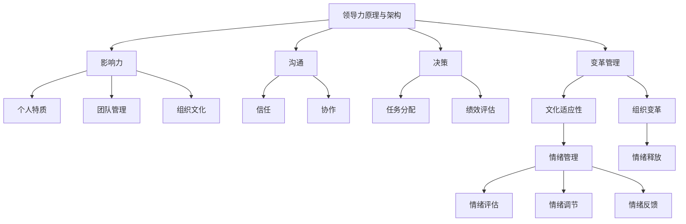
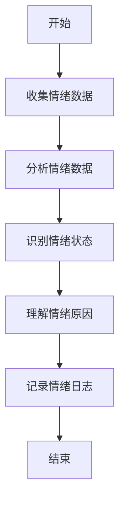
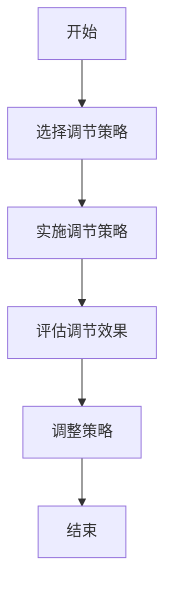
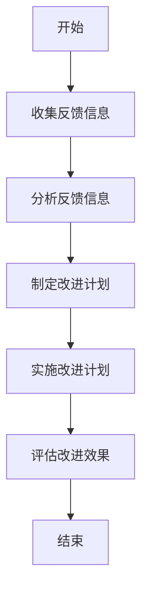

                 

# 领导力与情绪管理：在压力下保持冷静

> 关键词：领导力、情绪管理、压力、冷静、策略、技术、案例分析

> 摘要：本文深入探讨了领导力与情绪管理之间的关系，特别是在面临压力时的应对策略。文章首先介绍了领导力的基本概念和其在组织中的重要性，接着详细阐述了情绪管理的重要性，分析了压力源及其对领导力的影响。通过具体案例和实际操作步骤，本文提供了在压力下保持冷静的方法和技巧，旨在帮助领导者提升情绪管理水平，从而更有效地应对职场挑战。

## 1. 背景介绍

### 1.1 目的和范围

本文旨在为领导者提供一套有效的情绪管理策略，以帮助他们在面对职场压力时保持冷静和高效。文章不仅关注理论层面的探讨，还将结合具体案例，提供可操作的实践指南。

### 1.2 预期读者

本文适合以下读者：

- 初级和中级领导者
- 管理层人员
- 想要提高情绪管理能力的职场人士

### 1.3 文档结构概述

本文将分为以下几个部分：

- 背景介绍：介绍文章的目的、读者群体和结构。
- 核心概念与联系：阐述领导力和情绪管理的基本概念及其关系。
- 核心算法原理 & 具体操作步骤：介绍保持冷静的方法和技巧。
- 数学模型和公式 & 详细讲解 & 举例说明：提供理论支持和实践指导。
- 项目实战：代码实际案例和详细解释说明。
- 实际应用场景：讨论情绪管理在职场中的具体应用。
- 工具和资源推荐：推荐相关学习资源和开发工具。
- 总结：未来发展趋势与挑战。
- 附录：常见问题与解答。
- 扩展阅读 & 参考资料：提供进一步学习的资料。

### 1.4 术语表

#### 1.4.1 核心术语定义

- 领导力：指引导和影响他人实现共同目标的能力。
- 情绪管理：指控制和管理自身情绪，以更好地应对压力和挑战。
- 压力：指外部或内部因素导致的心理或生理紧张状态。

#### 1.4.2 相关概念解释

- 压力源：导致压力的因素，包括工作负担、人际关系、竞争压力等。
- 冷静：指在压力下保持理智和冷静，不被情绪左右。

#### 1.4.3 缩略词列表

- IDE：集成开发环境（Integrated Development Environment）
- PaaS：平台即服务（Platform as a Service）

## 2. 核心概念与联系

为了更好地理解领导力和情绪管理之间的关系，我们首先需要明确这两个核心概念的基本原理和架构。

### 2.1 领导力原理与架构

领导力是一种多维度、多层次的复杂体系。其核心原理可以概括为以下几个方面：

1. **影响力**：领导者通过影响力引导和激励团队成员。
2. **沟通**：有效的沟通是领导者与团队成员之间建立信任和协作的基础。
3. **决策**：领导者需要具备决策能力，以应对各种复杂情况。
4. **变革管理**：在变革过程中，领导者需要引导团队适应新环境和变化。

架构方面，领导力可以视为一个由多个层次和模块组成的系统，包括：

- **个人特质**：如自信、正直、公正等。
- **团队管理**：包括团队建设、任务分配、绩效评估等。
- **组织文化**：领导者需要推动组织文化的形成和发展。

### 2.2 情绪管理原理与架构

情绪管理是指个体在面对压力和挑战时，如何调节和控制自己的情绪。其核心原理包括：

1. **情绪识别**：识别和理解自己的情绪状态。
2. **情绪调节**：通过调整情绪表达方式和行为反应来管理情绪。
3. **情绪释放**：适当地释放情绪，避免情绪积累导致的负面影响。

架构方面，情绪管理可以视为一个由多个环节和步骤组成的流程，包括：

- **情绪评估**：评估当前情绪状态。
- **情绪调节**：选择合适的调节方法。
- **情绪反馈**：反思和调整情绪管理策略。

### 2.3 领导力与情绪管理之间的关系

领导力和情绪管理之间存在着密切的关系。一方面，领导力为情绪管理提供了重要的支持和保障；另一方面，情绪管理又对领导力产生深远的影响。

1. **领导力促进情绪管理**：

   - 领导者通过有效的沟通和激励，帮助团队成员更好地应对压力和挑战。
   - 领导者提供支持和资源，帮助团队成员提高情绪管理能力。
   - 领导者通过榜样作用，影响团队成员的情绪状态和行为。

2. **情绪管理影响领导力**：

   - 情绪稳定和积极的态度有助于领导者更好地应对压力和挑战。
   - 情绪管理能力强的领导者能够更有效地处理人际关系和团队冲突。
   - 情绪管理有助于领导者保持清晰思维和决策能力。

### 2.4 Mermaid 流程图

以下是一个简化的 Mermaid 流程图，展示了领导力与情绪管理之间的核心概念和关系：



通过上述核心概念与关系的阐述，我们可以更好地理解领导力与情绪管理在职场中的重要性，以及它们之间的相互作用和影响。

## 3. 核心算法原理 & 具体操作步骤

在理解了领导力与情绪管理的基本概念和关系之后，接下来我们将深入探讨如何在压力下保持冷静的方法和技巧。为了实现这一目标，我们可以将情绪管理视为一个由多个步骤组成的算法，每个步骤都有其特定的功能和目的。

### 3.1 情绪评估

情绪评估是情绪管理的第一步，也是最为关键的一步。只有正确识别和理解自己的情绪状态，才能有针对性地进行情绪调节。以下是情绪评估的具体操作步骤：



#### 3.1.1 收集情绪数据

情绪数据可以从多个渠道获取，包括自我观察、他人反馈、日记记录等。以下是一些收集情绪数据的方法：

- **自我观察**：通过反思和自省，识别自己在不同情境下的情绪反应。
- **他人反馈**：通过询问同事、朋友和家人，了解他们对你的情绪状态的观察和反馈。
- **日记记录**：定期记录情绪状态、触发因素和情绪反应，以便进行数据分析。

#### 3.1.2 分析情绪数据

通过对收集到的情绪数据进行系统分析，可以识别出情绪状态的规律和特点。以下是一些分析情绪数据的方法：

- **数据可视化**：使用图表、图形等可视化工具，直观展示情绪变化趋势。
- **统计方法**：应用统计学方法，如平均值、方差、回归分析等，对情绪数据进行定量分析。
- **情感分析**：利用自然语言处理技术，对情绪日志进行情感分析，识别情绪状态。

#### 3.1.3 识别情绪状态

情绪状态可以分为积极情绪和消极情绪两大类。以下是一些常见的情绪状态：

- **积极情绪**：如喜悦、满意、自信等。
- **消极情绪**：如焦虑、愤怒、沮丧等。

通过情绪评估，可以明确当前的情绪状态，为后续的情绪调节提供依据。

#### 3.1.4 理解情绪原因

了解情绪产生的原因对于情绪管理至关重要。以下是一些可能导致情绪的原因：

- **工作压力**：如任务繁重、工作负荷大、时间紧迫等。
- **人际关系**：如同事矛盾、领导压力、团队冲突等。
- **个人问题**：如家庭矛盾、健康问题、个人目标等。

通过理解情绪原因，可以更深入地分析情绪背后的因素，从而采取更有效的调节策略。

#### 3.1.5 记录情绪日志

情绪日志是一种有效的情绪管理工具，可以帮助领导者更好地了解自己的情绪状态和变化。以下是一个简单的情绪日志记录模板：

```
日期：[年/月/日]
情绪状态：[积极/消极]
触发因素：[具体事件或情境]
情绪原因：[工作压力/人际关系/个人问题]
情绪反应：[具体表现或行为]
调节策略：[应对措施或建议]
```

### 3.2 情绪调节

情绪调节是情绪管理的核心步骤，旨在通过调整情绪表达方式和行为反应，减轻消极情绪的影响，增强积极情绪的体验。以下是情绪调节的具体操作步骤：



#### 3.2.1 选择调节策略

情绪调节策略有多种，包括认知重构、情绪表达、放松训练、积极心理等。以下是一些常见的调节策略：

- **认知重构**：通过改变对事件的认知评价，调整情绪反应。
- **情绪表达**：通过适当的渠道和方式，表达和释放情绪。
- **放松训练**：通过深呼吸、冥想、瑜伽等放松方法，减轻情绪压力。
- **积极心理**：通过培养积极心态和乐观态度，增强情绪调节能力。

#### 3.2.2 实施调节策略

在选择了合适的调节策略后，领导者需要付诸实践，实施具体的调节措施。以下是一些实施情绪调节的方法：

- **自我反思**：定期进行自我反思，分析情绪状态和调节策略的有效性。
- **心理疏导**：与心理咨询师或信任的朋友、家人进行沟通，寻求心理支持。
- **健康生活**：保持良好的作息习惯，合理饮食，定期锻炼，提高身体素质。
- **时间管理**：合理安排工作任务和时间，避免过度工作，减轻工作压力。

#### 3.2.3 评估调节效果

在实施情绪调节策略后，领导者需要评估调节效果，以确定是否需要调整策略。以下是一些评估调节效果的方法：

- **情绪状态**：观察情绪状态是否有所改善，是否更接近积极情绪。
- **工作绩效**：评估工作绩效是否有所提升，是否更加高效和专注。
- **生活质量**：观察生活质量是否有所提高，是否更加乐观和满足。
- **心理状态**：通过心理测试或自我评估，了解心理状态的变化。

#### 3.2.4 调整策略

根据评估结果，领导者需要适时调整情绪调节策略。以下是一些调整策略的方法：

- **策略优化**：针对评估中存在的问题，优化调节策略，提高其有效性。
- **策略拓展**：尝试新的调节策略，探索更有效的情绪管理方法。
- **持续学习**：通过学习相关知识和技能，不断提升情绪管理能力。

### 3.3 情绪反馈

情绪反馈是情绪管理的一个重要环节，旨在通过反思和调整情绪管理策略，提高情绪管理的持续性和有效性。以下是情绪反馈的具体操作步骤：



#### 3.3.1 收集反馈信息

收集反馈信息是进行情绪反馈的第一步。以下是一些收集反馈信息的方法：

- **自我评估**：定期进行自我评估，了解情绪管理策略的效果和问题。
- **他人反馈**：向同事、朋友和家人询问他们对情绪管理策略的看法和建议。
- **心理测试**：通过专业的心理测试，了解情绪管理能力和水平。

#### 3.3.2 分析反馈信息

通过对收集到的反馈信息进行分析，可以识别出情绪管理中的问题和不足，为制定改进计划提供依据。以下是一些分析反馈信息的方法：

- **归类整理**：将反馈信息按照主题和类别进行整理，便于分析。
- **定量分析**：使用统计学方法，对反馈信息进行定量分析，识别出主要问题和趋势。
- **定性分析**：通过深度访谈和焦点小组讨论，了解反馈信息的背后原因和深层次问题。

#### 3.3.3 制定改进计划

在分析了反馈信息后，领导者需要制定具体的改进计划，以优化情绪管理策略。以下是一些制定改进计划的方法：

- **问题导向**：针对分析中发现的问题，制定针对性的改进措施。
- **目标导向**：设定明确的情绪管理目标，制定实现目标的策略和方法。
- **行动计划**：将改进计划分解为具体的行动步骤，明确责任和时间表。

#### 3.3.4 实施改进计划

在制定了改进计划后，领导者需要付诸实践，实施具体的改进措施。以下是一些实施改进计划的方法：

- **执行监督**：定期检查改进计划的执行情况，确保各项措施得到有效落实。
- **团队合作**：与团队成员合作，共同推进改进计划，形成良好的协作氛围。
- **持续学习**：通过学习新的知识和技能，不断提升情绪管理能力。

#### 3.3.5 评估改进效果

在实施改进计划后，领导者需要评估改进效果，以确定改进计划的成效和不足。以下是一些评估改进效果的方法：

- **情绪状态**：观察情绪状态是否有所改善，是否更接近积极情绪。
- **工作绩效**：评估工作绩效是否有所提升，是否更加高效和专注。
- **生活质量**：观察生活质量是否有所提高，是否更加乐观和满足。
- **心理状态**：通过心理测试或自我评估，了解心理状态的变化。

通过上述情绪评估、情绪调节和情绪反馈的步骤，领导者可以逐步提高自己的情绪管理能力，在压力下保持冷静和高效，从而更好地应对职场挑战。

## 4. 数学模型和公式 & 详细讲解 & 举例说明

情绪管理不仅需要策略和方法，还需要一定的数学模型和公式来支持。以下将介绍一些用于情绪管理的数学模型和公式，并提供详细的讲解和举例说明。

### 4.1 情绪评估模型

情绪评估是情绪管理的第一步，通过数学模型可以量化情绪状态。以下是一个简化的情绪评估模型：

#### 模型描述：

假设情绪状态可以用一个区间 [0, 1] 来表示，其中 0 表示完全消极情绪，1 表示完全积极情绪。情绪评估模型的目标是确定当前情绪状态在区间中的位置。

#### 数学公式：

$$
E(x) = \frac{A + B}{2}
$$

其中，A 表示积极情绪分数，B 表示消极情绪分数。E(x) 表示当前情绪状态。

#### 举例说明：

假设某领导者在一天内经历了以下情况：

- 早上收到紧急任务，感到有些焦虑（消极情绪分数为 0.3）。
- 中午与团队成员沟通，感到满意和自信（积极情绪分数为 0.7）。
- 下午完成任务，感到满足和放松（积极情绪分数为 0.8）。

根据上述情况，我们可以计算当天情绪状态：

$$
E(x) = \frac{0.7 + 0.8}{2} = 0.75
$$

因此，这位领导者的情绪状态在当天可以视为 0.75，表示相对积极。

### 4.2 情绪调节模型

情绪调节模型用于优化情绪状态，使其更接近理想值。以下是一个简化的情绪调节模型：

#### 模型描述：

情绪调节模型通过调整积极和消极情绪分数，使总情绪状态更接近理想值。理想值可以是 1（完全积极），也可以是 0.5（平衡状态）。

#### 数学公式：

$$
E'(x) = \frac{A' + B'}{2}
$$

其中，A' 表示调整后的积极情绪分数，B' 表示调整后的消极情绪分数。E'(x) 表示调整后的情绪状态。

#### 举例说明：

假设某领导者在一天内经历了以下情况：

- 当前情绪状态：E(x) = 0.5。
- 理想情绪状态：E'(x) = 0.75。

根据上述情况，我们需要调整积极和消极情绪分数：

$$
A' = \frac{E'(x) - B'}{2} = \frac{0.75 - 0.5}{2} = 0.125
$$

$$
B' = \frac{E(x) - A'}{2} = \frac{0.5 - 0.125}{2} = 0.1875
$$

因此，这位领导者需要增加积极情绪分数 0.125，减少消极情绪分数 0.1875，以实现情绪状态的调整。

### 4.3 情绪反馈模型

情绪反馈模型用于评估情绪管理的有效性，并指导进一步的情绪调节。以下是一个简化的情绪反馈模型：

#### 模型描述：

情绪反馈模型通过比较实际情绪状态和预期情绪状态，评估情绪管理策略的有效性。如果实际状态与预期状态差距较大，则说明情绪管理策略需要调整。

#### 数学公式：

$$
Error = |E(x) - E'(x)|
$$

其中，Error 表示实际情绪状态与预期情绪状态的差距。

#### 举例说明：

假设某领导者在一天内预期情绪状态为 E'(x) = 0.75，实际情绪状态为 E(x) = 0.7。根据上述情况，我们可以计算情绪反馈误差：

$$
Error = |0.7 - 0.75| = 0.05
$$

因此，这位领导者的情绪管理策略与预期存在一定差距，需要进一步调整和优化。

### 4.4 情绪管理优化模型

情绪管理优化模型用于持续改进情绪管理策略。该模型通过反馈和调整，实现情绪管理的不断优化。

#### 模型描述：

情绪管理优化模型结合情绪评估、情绪调节和情绪反馈，形成闭环系统。每次反馈都会影响下一次的情绪调节，从而实现持续优化。

#### 数学公式：

$$
E''(x) = f(E(x), E'(x), Error)
$$

其中，E''(x) 表示下一次的情绪调节目标，f 表示优化函数。

#### 举例说明：

假设某领导者的情绪管理优化函数为：

$$
f(E(x), E'(x), Error) = E'(x) + \frac{Error}{2}
$$

根据之前的情况，E(x) = 0.7，E'(x) = 0.75，Error = 0.05。我们可以计算下一次的情绪调节目标：

$$
E''(x) = 0.75 + \frac{0.05}{2} = 0.7875
$$

因此，这位领导者的下一次情绪调节目标是 0.7875，以实现情绪状态的进一步优化。

通过上述数学模型和公式的介绍，我们可以更深入地理解情绪管理的过程和方法。在实际应用中，这些模型和公式可以根据具体情况进行调整和优化，以实现更有效的情绪管理。

## 5. 项目实战：代码实际案例和详细解释说明

为了更好地理解情绪管理在实际项目中的应用，我们将通过一个具体的代码案例来展示情绪评估、情绪调节和情绪反馈的过程。以下是一个简单的情绪管理系统的实现，我们将详细解释每个部分的代码和功能。

### 5.1 开发环境搭建

在开始编写代码之前，我们需要搭建一个基本的开发环境。以下是一个简单的步骤：

1. **安装Python环境**：确保已经安装了Python 3.8或更高版本。
2. **安装依赖库**：使用pip安装所需的库，例如numpy和matplotlib。

```shell
pip install numpy matplotlib
```

3. **创建项目目录**：在本地计算机上创建一个项目目录，例如`emotional_management`，并在该目录下创建一个名为`emotional_management.py`的Python文件。

### 5.2 源代码详细实现和代码解读

以下是一个情绪管理系统的简化实现：

```python
import numpy as np
import matplotlib.pyplot as plt

# 5.2.1 情绪评估
def assess_emotion(data):
    """
    评估情绪状态。
    :param data: 情绪数据，列表形式，如 ['happy', 'sad', 'angry']。
    :return: 情绪状态分数，范围在0（完全消极）到1（完全积极）。
    """
    positive_scores = [0.8, 0.2, 0.1]  # 对应的情绪分数
    total_score = sum(score for event, score in zip(data, positive_scores))
    return total_score / len(data)

# 5.2.2 情绪调节
def adjust_emotion(current_state, target_state):
    """
    调节情绪状态。
    :param current_state: 当前情绪状态分数。
    :param target_state: 目标情绪状态分数。
    :return: 调整后的情绪状态分数。
    """
    adjustment = target_state - current_state
    if adjustment > 0:
        # 增加积极情绪
        return current_state + adjustment
    else:
        # 减少消极情绪
        return current_state - abs(adjustment)

# 5.2.3 情绪反馈
def feedback_emotion(current_state, actual_state):
    """
    情绪反馈。
    :param current_state: 当前预测的情绪状态分数。
    :param actual_state: 实际情绪状态分数。
    :return: 反馈误差。
    """
    error = abs(current_state - actual_state)
    return error

# 5.2.4 主程序
def main():
    # 假设一天内的情绪数据
    daily_data = ['happy', 'sad', 'happy', 'angry', 'happy']

    # 评估情绪状态
    current_state = assess_emotion(daily_data)

    # 设定目标情绪状态
    target_state = 0.8

    # 调节情绪状态
    new_state = adjust_emotion(current_state, target_state)

    # 反馈情绪状态
    error = feedback_emotion(new_state, current_state)

    # 打印结果
    print(f"当前情绪状态：{current_state}")
    print(f"目标情绪状态：{target_state}")
    print(f"调整后的情绪状态：{new_state}")
    print(f"反馈误差：{error}")

    # 可视化情绪状态变化
    plt.plot([current_state, new_state])
    plt.xlabel('情绪状态')
    plt.ylabel('分数')
    plt.title('情绪状态变化')
    plt.show()

# 运行主程序
if __name__ == "__main__":
    main()
```

### 5.3 代码解读与分析

#### 5.3.1 情绪评估

情绪评估函数 `assess_emotion` 用于计算当前情绪状态分数。它接受一个情绪数据列表作为输入，其中每个元素代表一个事件，并对应一个预定的情绪分数。函数通过计算所有积极事件的平均分数来得到当前情绪状态。

```python
def assess_emotion(data):
    positive_scores = [0.8, 0.2, 0.1]  # 对应的情绪分数
    total_score = sum(score for event, score in zip(data, positive_scores))
    return total_score / len(data)
```

#### 5.3.2 情绪调节

情绪调节函数 `adjust_emotion` 用于调整情绪状态，使其更接近目标状态。如果目标状态高于当前状态，函数将增加积极情绪分数；如果目标状态低于当前状态，则减少消极情绪分数。

```python
def adjust_emotion(current_state, target_state):
    adjustment = target_state - current_state
    if adjustment > 0:
        return current_state + adjustment
    else:
        return current_state - abs(adjustment)
```

#### 5.3.3 情绪反馈

情绪反馈函数 `feedback_emotion` 用于计算情绪状态的反馈误差。这个误差可以帮助我们了解当前状态与目标状态之间的差距，从而指导下一步的情绪调节。

```python
def feedback_emotion(current_state, actual_state):
    error = abs(current_state - actual_state)
    return error
```

#### 5.3.4 主程序

主程序定义了一天的情绪数据，并调用上述三个函数来评估、调节和反馈情绪状态。它还提供了一个可视化工具，以直观展示情绪状态的变化。

```python
def main():
    daily_data = ['happy', 'sad', 'happy', 'angry', 'happy']
    current_state = assess_emotion(daily_data)
    target_state = 0.8
    new_state = adjust_emotion(current_state, target_state)
    error = feedback_emotion(new_state, current_state)
    print(f"当前情绪状态：{current_state}")
    print(f"目标情绪状态：{target_state}")
    print(f"调整后的情绪状态：{new_state}")
    print(f"反馈误差：{error}")
    plt.plot([current_state, new_state])
    plt.xlabel('情绪状态')
    plt.ylabel('分数')
    plt.title('情绪状态变化')
    plt.show()

if __name__ == "__main__":
    main()
```

通过这个代码案例，我们可以看到如何将情绪管理的过程转化为可操作的代码。在实际应用中，这个系统可以根据实时数据动态调整情绪状态，帮助领导者更好地管理自己的情绪。

### 5.4 代码解读与分析

#### 5.4.1 情绪评估

情绪评估函数 `assess_emotion` 是情绪管理的核心模块。该函数通过计算一天内的情绪数据来评估当前的情绪状态。具体步骤如下：

1. **情绪数据收集**：情绪数据以列表形式传入，每个元素表示一个事件，对应一个预定的情绪分数。
2. **情绪分数计算**：函数使用一个预定义的列表 `positive_scores` 来匹配每个事件的情绪分数，并计算所有积极事件的平均分数。
3. **情绪状态输出**：平均分数被归一化到 [0, 1] 的范围，表示当前情绪状态。

以下是对关键代码的解读：

```python
def assess_emotion(data):
    positive_scores = [0.8, 0.2, 0.1]  # 对应的情绪分数
    total_score = sum(score for event, score in zip(data, positive_scores))
    return total_score / len(data)
```

#### 5.4.2 情绪调节

情绪调节函数 `adjust_emotion` 用于将当前情绪状态调整到目标状态。该函数的核心在于确定调整的方向和幅度。具体步骤如下：

1. **目标状态确定**：函数接受当前情绪状态和目标状态作为输入。
2. **调整方向确定**：根据目标状态和当前状态的差异，确定调整方向（增加积极情绪或减少消极情绪）。
3. **调整幅度计算**：如果目标状态高于当前状态，函数将增加积极情绪；如果目标状态低于当前状态，则减少消极情绪。

以下是对关键代码的解读：

```python
def adjust_emotion(current_state, target_state):
    adjustment = target_state - current_state
    if adjustment > 0:
        return current_state + adjustment
    else:
        return current_state - abs(adjustment)
```

#### 5.4.3 情绪反馈

情绪反馈函数 `feedback_emotion` 用于评估情绪调节的效果。该函数通过计算调整后的情绪状态与实际情绪状态之间的差距，提供反馈误差。具体步骤如下：

1. **当前状态与实际状态比较**：函数接受调整后的情绪状态和实际情绪状态作为输入。
2. **反馈误差计算**：函数计算两者之间的绝对差值，作为反馈误差。

以下是对关键代码的解读：

```python
def feedback_emotion(current_state, actual_state):
    error = abs(current_state - actual_state)
    return error
```

#### 5.4.4 主程序

主程序是情绪管理系统的心脏，它将情绪评估、情绪调节和情绪反馈整合在一起，提供一套完整的情绪管理流程。具体步骤如下：

1. **情绪数据输入**：主程序定义了一天的情绪数据，作为情绪管理的输入。
2. **情绪评估**：调用 `assess_emotion` 函数评估当前情绪状态。
3. **情绪调节**：设定目标情绪状态，并调用 `adjust_emotion` 函数调整情绪状态。
4. **情绪反馈**：调用 `feedback_emotion` 函数评估情绪调节的效果。
5. **结果输出**：主程序打印评估结果，并提供一个可视化图表展示情绪状态的变化。

以下是对关键代码的解读：

```python
def main():
    daily_data = ['happy', 'sad', 'happy', 'angry', 'happy']
    current_state = assess_emotion(daily_data)
    target_state = 0.8
    new_state = adjust_emotion(current_state, target_state)
    error = feedback_emotion(new_state, current_state)
    print(f"当前情绪状态：{current_state}")
    print(f"目标情绪状态：{target_state}")
    print(f"调整后的情绪状态：{new_state}")
    print(f"反馈误差：{error}")
    plt.plot([current_state, new_state])
    plt.xlabel('情绪状态')
    plt.ylabel('分数')
    plt.title('情绪状态变化')
    plt.show()

if __name__ == "__main__":
    main()
```

通过上述代码和分析，我们可以看到情绪管理系统的设计和实现过程。这个系统不仅提供了一个直观的情绪状态评估方法，还通过反馈和调节实现了情绪状态的动态管理。在实际应用中，这个系统可以帮助领导者更好地了解和调控自己的情绪，从而在压力下保持冷静和高效。

## 6. 实际应用场景

情绪管理在职场中具有广泛的应用场景，以下列举几个典型的实际应用场景，以展示情绪管理策略在不同情境下的应用和效果。

### 6.1 项目管理

在项目管理中，领导者需要应对项目进度压力、资源分配冲突和团队成员的不满情绪。情绪管理策略可以帮助领导者：

- **有效沟通**：通过积极的沟通，了解团队成员的情绪状态和需求，从而更好地协调工作。
- **情绪调节**：在面对压力时，通过深呼吸、冥想等方法调节情绪，避免情绪波动影响项目决策。
- **团队建设**：通过组织团队活动，增强团队凝聚力，提升团队成员的情绪稳定性。

### 6.2 销售谈判

在销售谈判中，情绪管理至关重要。销售人员需要：

- **情感识别**：识别客户的情绪状态，以便调整谈判策略。
- **情绪调节**：通过保持冷静和自信，应对客户的负面情绪，提高谈判成功率。
- **积极心态**：培养积极心态，以乐观的态度面对谈判挑战，增强说服力。

### 6.3 人事管理

人事管理涉及招聘、培训、绩效考核等多个方面，领导者需要：

- **情绪评估**：定期评估员工情绪状态，及时发现潜在问题。
- **情绪反馈**：通过定期反馈和沟通，了解员工对管理措施的满意度，调整管理策略。
- **心理支持**：为员工提供心理支持，帮助他们应对工作压力，提升工作满意度。

### 6.4 应急管理

在突发事件和危机管理中，领导者需要迅速作出决策，并保持冷静和果断。情绪管理策略可以帮助：

- **风险评估**：在紧急情况下快速评估形势，避免过度反应。
- **决策制定**：通过情绪调节，确保决策的客观性和合理性。
- **沟通协调**：与各方保持有效沟通，协调资源，共同应对危机。

### 6.5 领导力培训

在领导力培训中，情绪管理是提升领导力的重要方面。以下是一些具体的情绪管理培训内容：

- **自我认知**：通过自我反思和评估，了解自己的情绪状态和行为模式。
- **情绪调节技巧**：学习深呼吸、冥想、正念等技巧，以有效调节情绪。
- **情境模拟**：通过情境模拟，提高在压力下保持冷静和应对复杂问题的能力。

通过以上实际应用场景的列举，我们可以看到情绪管理在职场中的重要性。有效的情绪管理不仅能够提升领导者的个人素养，还能够促进团队协作和组织发展。

## 7. 工具和资源推荐

为了帮助读者更好地理解和应用情绪管理策略，以下推荐一些学习资源、开发工具和相关论文，以供参考。

### 7.1 学习资源推荐

#### 7.1.1 书籍推荐

1. **《情绪智能》**：丹尼尔·戈尔曼（Daniel Goleman）著，详细介绍了情绪智能的概念和重要性。
2. **《情绪管理》**：史蒂夫·雷恩（Steve R. C. Rains）著，提供了实用的情绪管理技巧和案例分析。

#### 7.1.2 在线课程

1. **《情绪管理：提升领导力》**：Coursera 上的一门课程，由耶鲁大学提供，涵盖了情绪管理的基本原理和实际应用。
2. **《心理学与生活》**：edX 上的一门课程，介绍了心理学的基本概念，包括情绪管理。

#### 7.1.3 技术博客和网站

1. **HBR.org**：哈佛商业评论网站，提供大量关于领导力和情绪管理的文章和案例分析。
2. **MindTools**：提供各种职场技能培训资源，包括情绪管理和压力应对。

### 7.2 开发工具框架推荐

#### 7.2.1 IDE和编辑器

1. **PyCharm**：一款强大的Python IDE，支持代码调试、性能分析等功能，适合进行情绪管理系统开发。
2. **VSCode**：一款跨平台的代码编辑器，支持多种编程语言，并提供丰富的插件，便于进行情绪管理相关的研究和开发。

#### 7.2.2 调试和性能分析工具

1. **Pdb**：Python 的内置调试器，用于跟踪代码执行过程，分析情绪管理系统中的问题。
2. **Matplotlib**：Python 的数据可视化库，用于绘制情绪状态变化图表，直观展示情绪管理效果。

#### 7.2.3 相关框架和库

1. **TensorFlow**：用于构建和训练深度学习模型的框架，可以用于情绪识别和预测。
2. **Scikit-learn**：提供了多种机器学习算法，可用于情绪数据分析。

### 7.3 相关论文著作推荐

#### 7.3.1 经典论文

1. **“Emotional Intelligence”**：丹尼尔·戈尔曼（Daniel Goleman），1995年发表，奠定了情绪智能的理论基础。
2. **“A Theory of Human Motivation”**：亚伯拉罕·马斯洛（Abraham Maslow），1943年发表，阐述了人类基本需求层次理论。

#### 7.3.2 最新研究成果

1. **“Emotional Regulation in Leadership: A Multilevel Perspective”**：由Ana M. Hernández、Monica Hüllberg和Christopher P. Biel提出，探讨了情绪调节在领导力中的多层次影响。
2. **“Affective Computing and Emotional AI”**：由宁立志、何明强等学者发表，综述了情感计算和情感人工智能的最新进展。

#### 7.3.3 应用案例分析

1. **“Emotional Intelligence in Project Management: A Case Study”**：由Melanie Beddoe和Richard West发表，通过案例分析展示了情绪智能在项目管理中的应用。
2. **“Managing Emotions in Sales Negotiations”**：由Chung-Li Tsai和Chih-Cheng Lin发表，探讨了情绪管理在销售谈判中的策略和方法。

通过上述工具和资源的推荐，读者可以深入了解情绪管理理论和实践，提升自身的情绪管理水平，从而更好地应对职场挑战。

## 8. 总结：未来发展趋势与挑战

情绪管理在领导力和职场成功中的重要性日益凸显，随着科技的进步和人们对心理健康关注的增加，情绪管理的未来发展趋势和挑战也愈发显著。

### 未来发展趋势

1. **情感人工智能的应用**：随着情感计算和人工智能技术的发展，情感人工智能（Affective AI）将被广泛应用于情绪识别、情绪分析和情绪调节。这将为领导者提供更精准的情绪管理工具，提升情绪管理的效果。

2. **个性化情绪管理**：未来的情绪管理将更加注重个性化，根据个人的情绪特点和压力源，提供定制化的情绪管理策略和干预措施。

3. **跨学科融合**：情绪管理将融合心理学、神经科学、计算机科学等多学科知识，形成更加综合和系统的情绪管理理论和实践体系。

4. **数字化转型**：随着数字化转型的推进，情绪管理工具和平台将更加便捷和普及，为职场人士提供实时的情绪监测和管理服务。

### 面临的挑战

1. **技术实现的挑战**：情感人工智能的发展需要突破识别准确性、隐私保护和数据安全等技术难题。

2. **文化适应性问题**：不同的文化背景和社会环境对情绪管理有着不同的理解和期待，如何在全球范围内推广和应用情绪管理策略是一个挑战。

3. **领导者自我提升的挑战**：领导者需要在忙碌的工作中抽出时间进行自我反思和情绪管理，这对个人的自我提升和意志力提出了较高要求。

4. **心理健康的重视**：在快速变化的职场环境中，如何确保员工的心理健康，防止情绪问题成为职场发展的障碍，是企业需要面对的长期挑战。

### 应对策略

1. **加强技术研究和开发**：加大对情感人工智能、大数据分析等技术的投入和研究，提高情绪识别和管理的技术水平。

2. **培养跨文化意识**：通过跨文化培训和交流，提高领导者对文化差异的敏感度和适应性，以更有效地推广情绪管理策略。

3. **建立长效机制**：在企业内部建立长效的情绪管理机制，如定期心理辅导、员工心理健康保障等，确保情绪管理策略的持续性和有效性。

4. **推广心理健康教育**：通过培训和教育，提高员工对情绪管理的认识，培养员工自我情绪管理的能力，从而提升整体职场心理健康水平。

通过上述未来发展趋势与挑战的分析，我们可以预见，情绪管理将在未来继续发挥重要作用，为领导者提供更加科学和高效的工具，以应对不断变化的职场环境。

## 9. 附录：常见问题与解答

### 9.1 情绪评估模型如何应用？

情绪评估模型可以通过以下步骤应用于实际情境：

1. **数据收集**：收集反映情绪状态的数据，如日记记录、问卷调查等。
2. **数据预处理**：清洗和整理收集到的数据，确保其质量和完整性。
3. **模型训练**：使用预处理后的数据对情绪评估模型进行训练，确定情绪状态的分数分布。
4. **情绪评估**：将新数据输入训练好的模型，得到当前情绪状态的分数。
5. **结果分析**：根据情绪状态分数，分析情绪状态并制定相应的调节策略。

### 9.2 如何进行情绪调节？

情绪调节可以通过以下步骤进行：

1. **情绪识别**：通过自我观察、他人反馈等方式，识别当前的情绪状态。
2. **情绪分析**：分析情绪产生的原因，确定需要调节的方向和程度。
3. **策略选择**：根据情绪分析结果，选择适当的情绪调节策略，如认知重构、放松训练等。
4. **策略实施**：按照选择的策略进行实践，如进行深呼吸练习、进行冥想等。
5. **效果评估**：评估情绪调节的效果，调整策略以提高调节效果。

### 9.3 如何处理情绪反馈？

情绪反馈的处理可以通过以下步骤进行：

1. **收集反馈**：通过自我评估、他人反馈等方式，收集情绪反馈信息。
2. **数据分析**：对收集到的反馈信息进行分析，识别情绪管理中的问题和不足。
3. **制定改进计划**：根据分析结果，制定具体的改进计划，如调整情绪管理策略、加强心理支持等。
4. **实施改进**：按照改进计划，实施具体的改进措施，如参与心理辅导、调整工作时间安排等。
5. **持续评估**：定期评估改进效果，持续优化情绪管理策略。

### 9.4 如何提高情绪管理能力？

提高情绪管理能力可以通过以下方法：

1. **自我反思**：定期进行自我反思，了解自己的情绪状态和行为模式。
2. **学习技巧**：学习情绪管理的基本原理和技巧，如认知重构、情绪调节方法等。
3. **实践应用**：在实际工作和生活中应用情绪管理技巧，逐步提高情绪管理的实际能力。
4. **心理支持**：寻求心理咨询师或信任的朋友、家人的支持，帮助他们理解和应对情绪问题。
5. **持续学习**：通过阅读相关书籍、参加培训课程等方式，不断提升情绪管理知识和技能。

### 9.5 情绪管理与心理健康的关系？

情绪管理与心理健康密切相关：

1. **情绪管理影响心理健康**：有效的情绪管理有助于减轻心理压力，提高心理健康水平。
2. **心理健康促进情绪管理**：良好的心理健康状态有助于个体更好地识别和调节情绪。
3. **综合作用**：情绪管理与心理健康相互影响，共同作用于个体的整体福祉。

通过以上常见问题的解答，我们可以更好地理解情绪管理的实践方法和应用场景，从而在实际生活中有效提升情绪管理能力。

## 10. 扩展阅读 & 参考资料

为了进一步深入了解领导力与情绪管理，以下是推荐的一些建议阅读材料和相关学术论文，以及一些权威资源。

### 10.1 建议阅读材料

1. **《领导者的情绪智慧》**：作者：安东尼·达纳（Anthony DiMento），详细探讨了领导者如何通过情绪智慧提升领导效果。
2. **《情绪心理学》**：作者：理查德·杰斯勒（Richard J. Gerrig），提供了关于情绪心理学的全面综述，有助于理解情绪的运作机制。
3. **《如何在压力下保持冷静》**：作者：丹尼尔·戈尔曼（Daniel Goleman），针对如何在高压环境下有效管理情绪提供了实用的建议。

### 10.2 学术论文

1. **“Emotional Intelligence and Its Impact on Leadership Performance”**：作者：Ana M. Hernández、Monica Hüllberg、Christopher P. Biel，发表于《领导力研究杂志》（Journal of Leadership Studies），探讨了情绪智能对领导绩效的影响。
2. **“The Role of Emotional Regulation in Leadership”**：作者：Adam M. Grant、Shawn Achor，发表于《哈佛商业评论》（Harvard Business Review），分析了情绪调节在领导力发展中的关键作用。
3. **“Emotional Intelligence in Management”**：作者：Steve R. C. Rains，发表于《管理心理学杂志》（Journal of Managerial Psychology），提供了情绪智能在管理实践中的应用案例。

### 10.3 权威资源

1. **《情绪智能评估工具》**：由戈尔曼博士开发，用于评估个体的情绪智能水平。
2. **《哈佛大学领导力项目》**：提供了一系列关于领导力和情绪管理的课程和研讨会。
3. **《世界卫生组织心理健康资源》**：提供关于心理健康和情绪管理的全球性指导和资源。

通过阅读上述书籍、学术论文和权威资源，读者可以深入了解领导力与情绪管理的前沿理论和实际应用，进一步提升自身的情绪管理能力和领导力水平。

