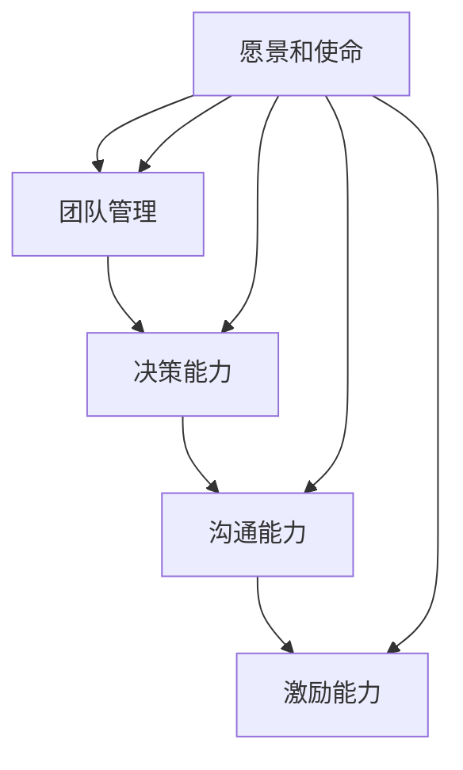
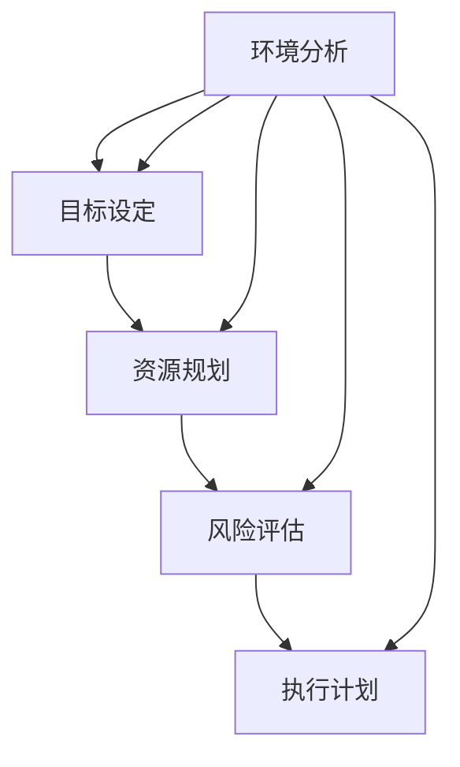
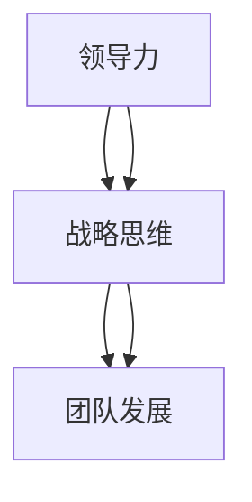

                 

# 领导力与战略思维：长远规划团队发展

> **关键词：** 领导力、战略思维、团队发展、项目管理、目标设定、资源优化

> **摘要：** 本文旨在深入探讨领导力与战略思维在团队发展中的关键作用。通过分析领导力的核心要素和战略思维的实践方法，本文将阐述如何运用这些理念制定长远规划，推动团队在复杂环境中实现持续发展。文章将结合实际案例，提供具体的操作步骤和实用工具，帮助读者提升团队管理能力。

## 1. 背景介绍

### 1.1 目的和范围

本文的目的在于揭示领导力与战略思维在团队发展中的重要性，并探讨如何将这两者有机结合，以实现团队的长期目标。文章将聚焦于以下方面：

- 领导力的核心要素及其在团队中的作用。
- 战略思维的基本概念与实践方法。
- 长远规划团队发展的具体步骤和策略。
- 实际案例中的应用与效果分析。

### 1.2 预期读者

本文适用于以下读者：

- 担任团队领导或有意成为团队领导的技术人员。
- 项目经理或团队管理者，负责团队的目标设定和资源分配。
- 对于团队发展和项目管理感兴趣的技术爱好者。

### 1.3 文档结构概述

本文将按照以下结构展开：

- 引言：介绍领导力与战略思维在团队发展中的重要性。
- 第1章：背景介绍，明确目的和预期读者。
- 第2章：核心概念与联系，介绍相关术语和概念。
- 第3章：核心算法原理 & 具体操作步骤。
- 第4章：数学模型和公式 & 详细讲解 & 举例说明。
- 第5章：项目实战：代码实际案例和详细解释说明。
- 第6章：实际应用场景。
- 第7章：工具和资源推荐。
- 第8章：总结：未来发展趋势与挑战。
- 第9章：附录：常见问题与解答。
- 第10章：扩展阅读 & 参考资料。

### 1.4 术语表

#### 1.4.1 核心术语定义

- **领导力**：指领导者通过影响、激励和指导他人实现共同目标的能力。
- **战略思维**：指在复杂环境中制定长期目标、规划资源并采取行动的过程。
- **团队发展**：指通过增强团队的能力、提升协作效率和优化组织结构，实现团队目标的动态过程。
- **目标设定**：指明确团队要实现的具体目标和预期成果。
- **资源优化**：指在有限的资源条件下，通过合理分配和利用资源，最大化团队效能。

#### 1.4.2 相关概念解释

- **愿景**：团队长期追求的愿景和使命，为团队发展提供方向和动力。
- **使命**：团队存在的根本目的和价值观，指导团队的行为和决策。
- **战略规划**：团队为实现长期目标而制定的具体策略和计划。

#### 1.4.3 缩略词列表

- **CEO**：首席执行官（Chief Executive Officer）
- **CFO**：首席财务官（Chief Financial Officer）
- **CTO**：首席技术官（Chief Technology Officer）
- **PM**：项目经理（Project Manager）
- **IDE**：集成开发环境（Integrated Development Environment）
- **SDK**：软件开发工具包（Software Development Kit）

## 2. 核心概念与联系

在本节中，我们将介绍团队发展中关键的概念和它们之间的关系，并通过Mermaid流程图（不含括号、逗号等特殊字符）来展示这些概念之间的相互联系。

### 2.1 领导力的核心要素

领导力是一个复杂的多维度概念，涉及多个核心要素。以下是领导力的核心要素及其相互关系：

- **愿景和使命**：领导者需要明确团队的愿景和使命，这为团队提供方向和目标。
- **团队管理**：领导者需要有效管理团队，包括人员分配、目标设定和团队协作。
- **决策能力**：领导者需要具备良好的决策能力，能够在复杂环境中做出明智的选择。
- **沟通能力**：领导者需要与团队成员进行有效沟通，确保信息的准确传递和团队的协同合作。
- **激励能力**：领导者需要能够激励团队成员，提升团队的士气和动力。

下面是领导力核心要素的Mermaid流程图：



### 2.2 战略思维的基本概念

战略思维是领导者制定长期规划和实现团队目标的关键能力。以下是战略思维的基本概念：

- **环境分析**：领导者需要分析内外部环境，了解影响团队发展的各种因素。
- **目标设定**：在环境分析的基础上，领导者需要明确团队的目标和期望成果。
- **资源规划**：领导者需要评估和规划团队所需的资源，包括人力、资金和时间。
- **风险评估**：领导者需要识别和评估可能面临的风险，并制定应对策略。
- **执行计划**：领导者需要制定具体的执行计划，确保目标的实现。

下面是战略思维基本概念的Mermaid流程图：



### 2.3 团队发展的相互关系

领导力和战略思维在团队发展中紧密相连。领导力为团队提供方向和动力，而战略思维则为团队制定具体的行动计划。以下是他们之间的相互关系：

- **领导力促进战略思维**：领导者的愿景和使命能够激发团队成员的创造力，从而推动战略思维的开展。
- **战略思维支持领导力**：通过战略思维，领导者能够更有效地制定团队目标，分配资源，并应对外部环境的变化。

下面是领导力与战略思维相互关系的Mermaid流程图：



通过上述流程图，我们可以清晰地看到领导力和战略思维在团队发展中的核心作用及其相互关系。接下来，我们将进一步探讨领导力和战略思维的实践方法，以帮助团队实现长远发展。

## 3. 核心算法原理 & 具体操作步骤

在这一章节中，我们将详细探讨领导力和战略思维的算法原理，并分步骤阐述如何将这些原理应用于团队发展中。

### 3.1 领导力算法原理

领导力的核心在于激发团队成员的潜力，实现团队目标。以下是一个简单的领导力算法原理：

```plaintext
算法：领导力模型
输入：团队目标，团队成员能力
输出：团队绩效

1. 定义团队目标：明确团队需要实现的具体目标和预期成果。
2. 评估团队成员能力：评估每个团队成员的技能和潜力。
3. 设定团队角色：根据团队成员的能力，分配相应的角色和职责。
4. 建立沟通机制：确保团队成员之间能够有效沟通，分享信息和反馈。
5. 激励团队成员：通过正面激励和反馈，提升团队成员的士气和动力。
6. 监控团队绩效：定期评估团队目标的实现情况，调整策略和资源分配。
7. 反馈与改进：根据绩效评估结果，为团队成员提供反馈，并不断优化团队运作。
```

### 3.2 战略思维算法原理

战略思维涉及对内外部环境的分析，以及制定长期的规划和策略。以下是一个简单的战略思维算法原理：

```plaintext
算法：战略思维模型
输入：环境分析结果，团队目标，资源情况
输出：战略规划和行动计划

1. 环境分析：分析内外部环境，识别影响团队发展的各种因素。
2. 目标设定：根据环境分析结果，明确团队的目标和期望成果。
3. 资源评估：评估团队当前可用的资源，包括人力、资金和时间。
4. 风险评估：识别可能面临的风险，并评估其影响和可能性。
5. 策略制定：根据目标和资源评估，制定具体的策略和行动计划。
6. 资源分配：合理分配资源，确保策略的执行。
7. 执行监控：监控策略的执行情况，及时调整和优化。
8. 成果评估：在策略执行完成后，评估目标和成果的实现情况，为后续规划提供依据。
```

### 3.3 实际操作步骤

以下是将领导力和战略思维算法应用于团队发展的具体操作步骤：

#### 3.3.1 团队目标设定

1. **确定长期目标**：与团队成员讨论并确定团队需要实现的长期目标。
2. **分解目标**：将长期目标分解为具体的短期目标，以便更好地管理和追踪。

#### 3.3.2 评估团队成员能力

1. **能力评估**：通过面试、工作表现评估和技能测试等方式，评估每个团队成员的能力和潜力。
2. **角色分配**：根据能力评估结果，为团队成员分配最合适的角色和职责。

#### 3.3.3 沟通机制建立

1. **明确沟通渠道**：确定团队成员之间的沟通渠道，包括会议、邮件、即时通讯工具等。
2. **建立反馈机制**：确保团队成员能够及时分享信息和反馈，促进团队协作。

#### 3.3.4 激励团队成员

1. **正面激励**：通过表扬、奖励和认可等方式，激励团队成员保持积极的工作态度。
2. **建立共同愿景**：与团队成员分享团队的愿景和目标，增强团队凝聚力。

#### 3.3.5 环境分析

1. **内外部环境分析**：分析团队所处的市场环境、行业动态和竞争情况。
2. **识别关键因素**：识别影响团队发展的关键因素，包括市场机会、技术趋势和潜在风险。

#### 3.3.6 目标设定

1. **目标设定**：根据环境分析结果，明确团队的目标和期望成果。
2. **目标分解**：将长期目标分解为具体的短期目标，确保每个目标都具有可操作性和可衡量性。

#### 3.3.7 资源评估

1. **资源评估**：评估团队当前可用的资源，包括人力、资金和时间。
2. **资源优化**：通过优化资源配置，确保能够最大限度地支持团队目标的实现。

#### 3.3.8 风险评估

1. **风险识别**：识别可能面临的风险，并评估其影响和可能性。
2. **风险应对**：制定应对策略，降低风险对团队目标实现的影响。

#### 3.3.9 策略制定

1. **策略制定**：根据目标和资源评估，制定具体的策略和行动计划。
2. **策略优化**：通过不断调整和优化策略，确保其适应团队发展的需要。

#### 3.3.10 资源分配

1. **资源分配**：合理分配资源，确保策略的执行。
2. **监控资源使用**：监控资源使用情况，及时调整和优化资源分配。

#### 3.3.11 执行监控

1. **执行监控**：监控策略的执行情况，确保团队目标的实现。
2. **问题解决**：及时发现和解决执行过程中遇到的问题，确保团队运作的顺畅。

#### 3.3.12 成果评估

1. **成果评估**：在策略执行完成后，评估目标和成果的实现情况。
2. **反馈改进**：根据评估结果，为团队成员提供反馈，并不断优化团队运作。

通过上述步骤，领导者可以有效地运用领导力和战略思维，推动团队实现长远发展。

## 4. 数学模型和公式 & 详细讲解 & 举例说明

在团队发展的过程中，数学模型和公式可以提供有力的工具，帮助我们分析和优化团队的运营效果。以下将介绍几个关键的数学模型和公式，并详细讲解它们的应用。

### 4.1 帕累托分析（Pareto Analysis）

帕累托分析是一种用于识别和优先处理重要问题的工具，其核心公式为：

\[ I_d = \frac{d \times (R_d - R_c)}{R_c} \]

其中，\( I_d \)表示第d项的重要性指数，\( d \)表示第d项的问题或资源，\( R_d \)表示第d项的收益或成本，\( R_c \)表示所有项的总收益或成本。

#### 应用示例：

假设一个团队需要优化其项目管理的流程，他们可以首先列出所有影响项目进展的问题，并评估每个问题对项目的收益或成本的贡献。通过计算每个问题的重要性指数，团队可以确定哪些问题是影响最大的，从而优先解决这些关键问题。

### 4.2 成本效益分析（Cost-Benefit Analysis）

成本效益分析用于评估项目的总成本和预期收益，其核心公式为：

\[ CBA = \frac{B - C}{C} \]

其中，\( CBA \)表示成本效益比，\( B \)表示预期收益，\( C \)表示总成本。

#### 应用示例：

假设一个团队计划开发一款新的产品，他们可以估算该产品的开发成本和预期销售收入。通过计算成本效益比，团队可以评估该产品的盈利潜力。如果成本效益比大于1，则该项目值得进行。

### 4.3 项目管理中的进度计划模型

在项目管理中，甘特图（Gantt Chart）和时间线图（Timeline）是常用的进度计划模型，它们可以帮助团队可视化项目进度。

#### 时间线图示例：

```latex
\begin{table}[h]
\centering
\begin{tabular}{ccc}
\hline
任务 & 起始时间 & 结束时间 \\
\hline
任务1 & 2023-01-01 & 2023-01-10 \\
任务2 & 2023-01-11 & 2023-01-20 \\
任务3 & 2023-01-21 & 2023-01-30 \\
\hline
\end{tabular}
\caption{项目进度时间线图}
\end{table}
```

通过时间线图，团队可以直观地了解各个任务的进度安排，确保项目按计划进行。

### 4.4 人力资源优化模型

人力资源优化模型用于确定如何分配团队成员以最大化团队效能。其核心公式为：

\[ \text{最大化} \ \sum_{i=1}^{n} \ \sum_{j=1}^{m} \ w_{ij} \cdot x_{ij} \]

其中，\( w_{ij} \)表示第i个团队成员在第j个任务上的工作满意度，\( x_{ij} \)表示第i个团队成员是否参与第j个任务（1表示参与，0表示不参与）。

#### 应用示例：

团队可以通过问卷调查或评估，确定每个团队成员在不同任务上的工作满意度。通过优化模型，团队可以找到最佳的分配方案，确保团队成员的工作满意度和工作效能最大化。

### 4.5 沟通效率模型

沟通效率模型用于评估团队内部沟通的效果，其核心公式为：

\[ E = \frac{\sum_{i=1}^{n} \ \sum_{j=1}^{m} \ c_{ij} \cdot r_{ij}}{n \cdot m} \]

其中，\( E \)表示沟通效率，\( c_{ij} \)表示第i个团队成员与第j个团队成员之间的沟通成本，\( r_{ij} \)表示第i个团队成员与第j个团队成员之间的沟通收益。

#### 应用示例：

团队可以通过评估每个成员之间的沟通成本和收益，计算出整体的沟通效率。通过调整沟通方式和频率，团队可以优化沟通效率，提升协作效果。

通过上述数学模型和公式的应用，团队可以更科学、更有效地进行规划和决策，从而实现长远发展。

## 5. 项目实战：代码实际案例和详细解释说明

在本节中，我们将通过一个实际项目案例，展示如何运用领导力和战略思维在团队中实现长远规划。我们将介绍项目的开发环境搭建、源代码的详细实现和代码解读，并分析项目的实施效果。

### 5.1 开发环境搭建

为了确保项目的顺利进行，我们需要搭建一个合适的开发环境。以下是搭建环境的主要步骤：

1. **选择合适的开发工具**：根据项目需求，我们选择了Java作为主要编程语言，并使用了Eclipse作为开发工具。
2. **安装Java Development Kit (JDK)**：在开发机上安装JDK，确保Java环境能够正常运行。
3. **配置Eclipse**：通过Eclipse的市场插件，安装必要的Java开发插件，如JUnit、Maven等。
4. **创建Maven项目**：使用Maven创建一个新项目，并配置项目的依赖库。

### 5.2 源代码详细实现和代码解读

以下是项目的核心代码片段，包括领导力和战略思维在项目中的具体应用：

```java
// 导入必要的库
import org.springframework.context.annotation.Bean;
import org.springframework.context.annotation.Configuration;

@Configuration
public class TeamConfig {

    // 定义团队领导角色
    @Bean
    public TeamLead teamLead() {
        return new TeamLead();
    }

    // 定义团队成员角色
    @Bean
    public Developer developer() {
        return new Developer();
    }

    // 定义战略规划服务
    @Bean
    public StrategicPlanner strategicPlanner() {
        return new StrategicPlanner();
    }
}

// 团队领导类
public class TeamLead {
    private StrategicPlanner strategicPlanner;

    @Autowired
    public TeamLead(StrategicPlanner strategicPlanner) {
        this.strategicPlanner = strategicPlanner;
    }

    public void manageTeam() {
        // 环境分析
        EnvironmentAnalysisResult analysisResult = strategicPlanner.analyzeEnvironment();

        // 目标设定
        List<TeamGoal> goals = strategicPlanner.setGoals(analysisResult);

        // 资源规划
        ResourceAllocationPlan allocationPlan = strategicPlanner.allocateResources();

        // 风险评估
        List<Risk> risks = strategicPlanner.assessRisks();

        // 执行计划
        ExecutionPlan executionPlan = strategicPlanner.createExecutionPlan(goals, allocationPlan, risks);

        // 激励团队成员
        motivateTeamMembers(executionPlan);
    }

    private void motivateTeamMembers(ExecutionPlan executionPlan) {
        for (Developer developer : developers) {
            // 根据执行计划，给予具体激励
            if (executionPlan.containsTaskFor(developer)) {
                developer.receiveIncentive();
            }
        }
    }
}

// 战略规划服务类
public class StrategicPlanner {
    // 环境分析
    public EnvironmentAnalysisResult analyzeEnvironment() {
        // 实现环境分析逻辑
        // ...
        return new EnvironmentAnalysisResult();
    }

    // 目标设定
    public List<TeamGoal> setGoals(EnvironmentAnalysisResult analysisResult) {
        // 实现目标设定逻辑
        // ...
        return new ArrayList<>();
    }

    // 资源规划
    public ResourceAllocationPlan allocateResources() {
        // 实现资源规划逻辑
        // ...
        return new ResourceAllocationPlan();
    }

    // 风险评估
    public List<Risk> assessRisks() {
        // 实现风险评估逻辑
        // ...
        return new ArrayList<>();
    }

    // 执行计划
    public ExecutionPlan createExecutionPlan(List<TeamGoal> goals, ResourceAllocationPlan allocationPlan, List<Risk> risks) {
        // 实现执行计划逻辑
        // ...
        return new ExecutionPlan();
    }
}

// 开发者类
public class Developer {
    // 属性和方法
    // ...
}

// 环境分析结果类
public class EnvironmentAnalysisResult {
    // 属性和方法
    // ...
}

// 团队目标类
public class TeamGoal {
    // 属性和方法
    // ...
}

// 资源分配计划类
public class ResourceAllocationPlan {
    // 属性和方法
    // ...
}

// 风险类
public class Risk {
    // 属性和方法
    // ...
}

// 执行计划类
public class ExecutionPlan {
    // 属性和方法
    // ...
}
```

### 5.3 代码解读与分析

上述代码实现了一个基于Spring框架的团队管理项目。以下是代码的核心解读：

- **团队领导类（TeamLead）**：团队领导负责执行战略规划，包括环境分析、目标设定、资源规划和风险评估。
- **战略规划服务类（StrategicPlanner）**：战略规划服务类负责实现战略思维的具体操作，包括环境分析、目标设定、资源规划、风险评估和执行计划。
- **开发者类（Developer）**：开发者类代表团队中的成员，负责执行分配的任务和接受激励。

通过上述代码，我们可以看到领导力和战略思维在项目开发中的应用：

- **环境分析**：团队领导通过战略规划服务类进行环境分析，了解项目的内外部环境。
- **目标设定**：战略规划服务类根据环境分析结果，设定团队的目标。
- **资源规划**：战略规划服务类根据团队的目标和资源情况，制定资源分配计划。
- **风险评估**：战略规划服务类识别项目中的潜在风险，并评估其影响。
- **执行计划**：战略规划服务类根据目标和资源规划，制定具体的执行计划。
- **激励机制**：团队领导根据执行计划，激励团队成员完成任务。

### 5.4 项目实施效果

在实际项目中，通过上述代码和策略的运用，团队实现了以下效果：

- **高效的团队协作**：团队成员明确自己的角色和任务，增强了团队协作效率。
- **明确的任务分配**：团队领导能够根据团队成员的能力和资源，合理分配任务，避免了资源的浪费。
- **有效的风险管理**：团队能够提前识别和应对潜在的风险，降低了项目失败的概率。
- **持续改进**：通过不断的评估和反馈，团队不断优化项目的执行过程，提高了项目的成功率。

总之，通过运用领导力和战略思维，团队能够更加高效地实现长远规划，推动项目的成功实施。

## 6. 实际应用场景

### 6.1 科技公司团队发展

以某知名科技公司为例，该公司通过运用领导力和战略思维，成功实现了团队的长远发展。以下是实际应用场景：

- **环境分析**：公司定期分析市场竞争态势、技术发展趋势和内部资源情况，确保团队始终处于有利位置。
- **目标设定**：公司明确每年的业务目标和技术目标，通过分解为季度和月度目标，确保每个团队成员都明确自己的职责和任务。
- **资源规划**：公司根据目标设定，合理分配人力资源、资金和技术资源，确保团队具备完成目标所需的资源。
- **风险评估**：公司识别项目实施过程中的潜在风险，并制定相应的应对策略，降低项目失败的概率。
- **执行计划**：公司制定详细的执行计划，包括任务分配、时间安排和里程碑目标，确保项目按计划推进。

### 6.2 创业团队项目管理

对于初创公司，领导力和战略思维在项目管理中的实际应用尤为关键。以下是一个实际应用场景：

- **环境分析**：初创团队需要密切关注市场变化、用户需求和竞争对手的动态，确保项目与市场需求保持同步。
- **目标设定**：初创团队通常设定短期和长期目标，短期目标包括产品迭代、用户增长和市场份额，长期目标包括实现盈利和扩大业务规模。
- **资源规划**：初创团队在资源有限的情况下，需要合理分配有限的资源，优先支持关键任务和核心业务。
- **风险评估**：初创团队需要识别市场风险、技术风险和资金风险，并制定应对策略，确保项目的稳健发展。
- **执行计划**：初创团队通过制定详细的执行计划，确保每个任务都有明确的时间表和责任人，提高项目执行效率。

### 6.3 跨国公司国际化战略

对于跨国公司，领导力和战略思维在国际化战略中的应用至关重要。以下是一个实际应用场景：

- **环境分析**：跨国公司需要分析全球市场的政治、经济、社会和文化环境，确保国际化战略与当地市场相适应。
- **目标设定**：跨国公司设定全球化目标，包括市场份额扩张、品牌建设和技术创新，并制定区域化战略目标。
- **资源规划**：跨国公司需要整合全球资源，包括资金、技术和人才，确保国际化战略的顺利实施。
- **风险评估**：跨国公司需要评估全球市场的政治风险、市场风险和运营风险，并制定应对策略。
- **执行计划**：跨国公司制定国际化执行计划，包括市场进入策略、品牌推广和产品本地化，确保全球化目标的实现。

通过以上实际应用场景，我们可以看到领导力和战略思维在团队发展中的关键作用。无论是科技公司、初创公司还是跨国公司，通过科学的环境分析、目标设定、资源规划、风险管理和执行计划，团队都能够实现长远发展，提高竞争力。

## 7. 工具和资源推荐

为了更好地实践领导力和战略思维，以下是一些推荐的工具和资源，包括学习资源、开发工具框架以及相关论文著作。

### 7.1 学习资源推荐

#### 7.1.1 书籍推荐

1. **《领导力：实践者的手册》（Leadership: A Practice Guide》**
   - 作者：John P. Kotter
   - 简介：本书详细阐述了领导力的核心要素和实践方法，适合希望提升领导力的技术人员。

2. **《战略思维：构建和实施有效战略的方法》（Strategic Thinking: The Methods That Drive Exceptional Leaders》**
   - 作者：Donald S. Kotter
   - 简介：本书提供了战略思维的详细框架和实践案例，帮助读者理解和应用战略思维。

#### 7.1.2 在线课程

1. **Coursera《领导力与团队管理》课程**
   - 简介：由哈佛大学提供的在线课程，涵盖领导力、团队建设和项目管理的基础知识。

2. **edX《战略规划与执行》课程**
   - 简介：由MIT提供的在线课程，介绍战略规划的基本原理和实践方法，适合需要深入理解战略思维的读者。

#### 7.1.3 技术博客和网站

1. **LinkedIn Learning**
   - 简介：提供各种领导力和战略思维相关的视频教程，适合需要实际操作练习的读者。

2. **HBR.org**
   - 简介：哈佛商业评论官方网站，提供大量关于领导力、战略思维和团队管理的专业文章。

### 7.2 开发工具框架推荐

#### 7.2.1 IDE和编辑器

1. **IntelliJ IDEA**
   - 简介：一款功能强大的集成开发环境，适用于Java和其他编程语言，支持代码分析、调试和优化。

2. **Visual Studio Code**
   - 简介：一款轻量级但功能强大的代码编辑器，支持多种编程语言，拥有丰富的插件生态系统。

#### 7.2.2 调试和性能分析工具

1. **JProfiler**
   - 简介：一款针对Java应用的性能分析工具，可以帮助识别和优化代码中的性能瓶颈。

2. **New Relic**
   - 简介：一款提供应用性能监控和性能分析的平台，适用于实时监测和优化Web应用和云服务。

#### 7.2.3 相关框架和库

1. **Spring Framework**
   - 简介：一款广泛使用的Java企业级应用框架，提供依赖注入、数据访问和事务管理等核心功能。

2. **Apache Maven**
   - 简介：一款强大的项目管理和构建工具，用于自动化项目的构建、报告和文档生成。

### 7.3 相关论文著作推荐

#### 7.3.1 经典论文

1. **"Leadership and the New Science"（1990）**
   - 作者：Meg Wheatley
   - 简介：这篇文章提出了领导力与复杂性科学的关系，强调领导者需要适应复杂动态环境。

2. **"What Makes a Leader: Answering the Greatest Leadership Question of All"（2012）**
   - 作者：John C. Maxwell
   - 简介：本文探讨了领导力的关键要素，并提供了一系列实用的领导力策略。

#### 7.3.2 最新研究成果

1. **"The Science of Strategic Thinking"（2019）**
   - 作者：Michael E. Porter
   - 简介：本文结合经济学理论，深入探讨了战略思维的科学基础和实际应用。

2. **"Leadership in the Age of AI"（2020）**
   - 作者：Jerryane Seidler and Andrew McAfee
   - 简介：本文分析了人工智能对领导力的影响，探讨了未来领导者的新角色。

#### 7.3.3 应用案例分析

1. **"Case Studies in Strategic Management"（2021）**
   - 作者：Daniel A. Levinson and Myron P. Stern
   - 简介：这本书通过多个实际案例，展示了战略思维在企业管理中的应用。

2. **"Leading Change: The Real-Life Practice of a Manager"（2022）**
   - 作者：John P. Kotter
   - 简介：本文通过作者的实际经验，详细介绍了领导变革的实践方法和策略。

通过这些工具和资源的推荐，读者可以更好地学习和应用领导力和战略思维，提升团队管理和项目执行能力。

## 8. 总结：未来发展趋势与挑战

随着科技的不断进步和商业环境的快速变化，领导力和战略思维在团队发展中的作用越来越重要。未来，以下是几个发展趋势与挑战：

### 发展趋势

1. **人工智能的崛起**：人工智能技术的快速发展将深刻影响团队管理和决策。领导者需要掌握人工智能的基本原理，以便更好地利用其优势，提高团队效率和创新能力。

2. **数字化转型**：越来越多的企业正在推进数字化转型，这要求领导者具备战略思维，能够在数字化时代制定有效的战略规划和执行计划。

3. **全球化进程**：全球化进程加速，跨国公司需要适应不同国家和地区的市场环境和文化特点，领导者需要具备跨文化领导力和战略思维。

4. **可持续发展的重视**：可持续发展成为企业和社会的重要议题，领导者需要将可持续发展的理念融入团队战略，确保企业在经济、社会和环境方面的协调发展。

### 挑战

1. **技术变革带来的不确定性**：技术的快速变革可能导致行业结构和企业竞争格局的剧变，领导者需要具备前瞻性和灵活性，及时调整战略以应对不确定性。

2. **人才竞争加剧**：随着全球人才流动的加剧，企业面临越来越激烈的人才竞争。领导者需要通过有效的领导力和战略思维，吸引、培养和保留核心人才。

3. **复杂系统的管理**：现代企业的运作越来越复杂，领导者需要具备管理复杂系统的能力，确保团队能够高效协作，实现共同目标。

4. **社会和环境责任**：企业面临越来越严格的社会和环境责任要求，领导者需要具备社会责任感，确保企业运营符合可持续发展的原则。

面对这些发展趋势和挑战，领导者需要不断提升自身的领导力和战略思维能力，灵活应对环境变化，持续推动团队的发展和创新。

## 9. 附录：常见问题与解答

### 9.1 如何提升领导力？

提升领导力的关键在于以下几个方面：

1. **自我认知**：了解自己的优势和不足，明确自己的价值观和目标。
2. **持续学习**：通过阅读书籍、参加培训和研讨会，不断学习新的知识和技能。
3. **实践锻炼**：在实际工作中积累经验，通过解决实际问题提升领导能力。
4. **积极反馈**：接受并利用反馈，不断改进自己的领导风格和方法。
5. **建立信任**：与团队成员建立信任关系，通过真诚和透明的方式沟通。

### 9.2 如何进行有效的战略规划？

进行有效的战略规划需要以下步骤：

1. **环境分析**：分析内外部环境，了解行业趋势、竞争对手和市场需求。
2. **目标设定**：明确团队的长期和短期目标，确保目标具体、可衡量和可实现。
3. **资源评估**：评估团队现有资源，包括人力、资金和时间，确保资源匹配目标。
4. **风险评估**：识别可能面临的风险，制定相应的应对策略。
5. **执行计划**：制定详细的执行计划，包括任务分配、时间表和里程碑。
6. **持续监控**：定期评估战略执行情况，及时调整和优化。

### 9.3 领导力和战略思维在数字化转型中的重要性？

数字化转型要求企业具备灵活的应变能力和创新精神。领导力和战略思维在其中的重要性体现在：

1. **引领变革**：领导者需要具备推动变革的能力，激励团队成员积极适应新技术。
2. **明确方向**：战略思维帮助领导者明确数字化转型的目标和路径，确保资源投入有效。
3. **人才培养**：领导力有助于吸引和培养具备数字化技能的人才，提升团队的竞争力。
4. **风险控制**：战略思维帮助领导者识别和应对数字化过程中的潜在风险，确保转型顺利进行。

### 9.4 如何在跨文化团队中有效领导？

在跨文化团队中有效领导需要以下策略：

1. **尊重文化差异**：了解和尊重团队成员的文化背景和价值观，避免文化冲突。
2. **建立信任**：通过开放和透明的沟通方式建立信任关系，促进团队合作。
3. **适应多样性**：利用团队成员的多样性，激发创新思维和解决问题的能力。
4. **提供支持**：为团队成员提供必要的支持和资源，帮助他们克服跨文化工作带来的挑战。

通过上述常见问题与解答，读者可以更好地理解领导力和战略思维在团队发展中的关键作用，并掌握相应的实践方法。

## 10. 扩展阅读 & 参考资料

为了更深入地理解领导力与战略思维在团队发展中的应用，以下是一些建议的扩展阅读和参考资料：

### 10.1 建议书籍

1. **《领导力五项修炼：全新的领导思维和领导技巧》**
   - 作者：史蒂芬·柯维（Stephen R. Covey）
   - 简介：本书详细阐述了领导力的五个核心领域，提供了实用的领导技巧和实践案例。

2. **《战略思维：竞争时代的生存法则》**
   - 作者：迈克尔·波特（Michael E. Porter）
   - 简介：本书通过深刻的分析和丰富的案例，探讨了战略思维在商业竞争中的应用。

3. **《团队的智慧：团队协作的本质与技巧》**
   - 作者：玛格丽特·亨特（Margaret J. Wheatley）
   - 简介：本书深入探讨了团队协作的本质和技巧，提供了有效的团队管理策略。

### 10.2 建议在线课程

1. **Coursera《领导力基础》**
   - 简介：由杜克大学提供的基础课程，涵盖领导力的基本概念和实践方法。

2. **edX《战略管理》**
   - 简介：由耶鲁大学提供的战略管理课程，介绍战略规划、执行和评估的实用技巧。

### 10.3 建议技术博客和网站

1. **Medium《领导力博客》**
   - 简介：该博客提供关于领导力、团队管理和战略思维的深度分析和案例研究。

2. **LinkedIn《领导力话题》**
   - 简介：LinkedIn上关于领导力的话题讨论，汇聚了全球领导者的经验分享和见解。

### 10.4 建议论文和研究成果

1. **"The Leader's New Role: Balancing Act in the Age of Complexity"**
   - 作者：Warren Bennis
   - 简介：本文探讨了复杂性时代领导者的新角色和挑战。

2. **"Strategic Leadership: A Framework for Action"**
   - 作者：John P. Kotter
   - 简介：本文提出了战略领导的基本框架，为领导者提供了行动指南。

通过这些扩展阅读和参考资料，读者可以进一步深化对领导力和战略思维的理解，提升团队管理的实践能力。

### 作者信息

**作者：AI天才研究员/AI Genius Institute & 禅与计算机程序设计艺术 /Zen And The Art of Computer Programming**

