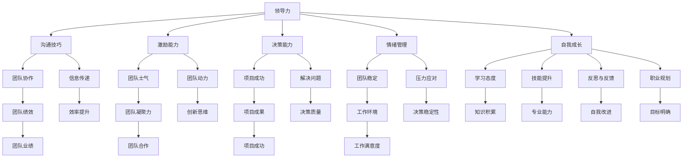

                 


# 领导力与自我成长：持续进步之道

> 关键词：领导力、自我成长、持续进步、职业生涯规划、技术深度和广度
> 
> 摘要：本文旨在探讨领导力在自我成长过程中的重要作用，以及如何在不断进步中保持技术深度和广度。文章将通过详细的分析和实例，引导读者理解领导力的核心要素，并掌握自我提升的策略，以期在职业生涯中取得显著成就。

## 1. 背景介绍

### 1.1 目的和范围

本文的目标是帮助IT行业从业者理解领导力在个人成长中的关键作用，并探索如何通过持续学习和实践，提升自身的领导力和技术能力。文章主要涵盖以下范围：

- 领导力的定义和核心要素
- 自我成长的重要性
- 技术深度与广度的平衡
- 职业生涯规划的方法和策略

### 1.2 预期读者

本文适合以下读者群体：

- IT行业从业者，尤其是技术人员
- 想要提升领导力并追求职业发展的个人
- 对领导力和自我成长有兴趣的学者和研究人员

### 1.3 文档结构概述

本文分为以下几个部分：

- 背景介绍：介绍文章的目的、范围和预期读者
- 核心概念与联系：阐述领导力和自我成长的核心概念及其相互关系
- 核心算法原理 & 具体操作步骤：提供提升领导力和自我成长的策略和技巧
- 数学模型和公式 & 详细讲解 & 举例说明：使用数学模型和公式解释核心概念
- 项目实战：通过实际案例展示领导力和自我成长的应用
- 实际应用场景：探讨领导力和自我成长在不同工作环境中的应用
- 工具和资源推荐：推荐学习和实践的资源
- 总结：展望领导力和自我成长在未来职业发展中的趋势和挑战
- 附录：常见问题与解答
- 扩展阅读 & 参考资料：提供进一步学习和研究的资源

### 1.4 术语表

#### 1.4.1 核心术语定义

- 领导力：影响和激励他人实现共同目标的能力。
- 自我成长：通过学习、实践和反思，不断提升个人能力和素质的过程。
- 技术深度：在特定技术领域达到的高水平和专业能力。
- 技术广度：对不同技术领域的了解和掌握程度。

#### 1.4.2 相关概念解释

- 职业生涯规划：对个人职业发展的目标、路径和策略进行系统性思考和规划。
- 持续进步：不断学习、提升技能和适应变化，以保持竞争力。

#### 1.4.3 缩略词列表

- IT：信息技术（Information Technology）
- AI：人工智能（Artificial Intelligence）
- CTO：首席技术官（Chief Technology Officer）
- MBA：工商管理硕士（Master of Business Administration）

## 2. 核心概念与联系

在探讨领导力和自我成长的关系之前，我们需要明确这两个核心概念的定义和相互关系。

### 2.1 领导力的概念

领导力是一种能力，它不仅涉及个人在技术领域内的专业知识，还涵盖了对团队的管理、激励和引导。一个优秀的领导者能够有效地与团队成员沟通，激发他们的潜力，并在困难时期提供支持。领导力包括以下几个方面：

- 沟通技巧：有效的沟通能力是领导力的基础，它能够确保信息传递的准确性和团队的协作效率。
- 激励能力：领导者需要能够激励团队成员，激发他们的积极性和创造力。
- 决策能力：领导者需要具备快速而明智的决策能力，以应对复杂的工作环境和挑战。
- 情绪管理：领导者需要具备良好的情绪管理能力，以保持冷静和理性，即使在压力下也能做出合理的决策。

### 2.2 自我成长的概念

自我成长是一个持续的过程，涉及对个人能力、知识和技能的提升。在IT行业，自我成长尤为重要，因为技术更新迅速，不断学习是保持竞争力的关键。自我成长包括以下几个方面：

- 学习态度：积极的学习态度是自我成长的基础，它包括对知识的渴望和对新技术的接受能力。
- 技能提升：通过学习和实践，不断提升专业技能和知识水平。
- 反思与反馈：定期进行自我反思和接受他人反馈，以发现和纠正自己的不足。
- 职业规划：制定清晰的职业发展目标，并制定实现这些目标的策略和计划。

### 2.3 领导力与自我成长的联系

领导力与自我成长之间存在密切的联系。优秀的领导者通常具备强烈的自我成长意识，并通过以下方式推动自我成长：

- 模范作用：领导者通过自身的成长和行为，激励团队成员也追求自我提升。
- 学习与分享：领导者不断学习新知识和技能，并愿意与团队成员分享，促进整个团队的学习和成长。
- 反思与改进：领导者通过反思和接受反馈，不断改进自己的领导方式和行为，从而提升领导力。

另一方面，自我成长也有助于提升领导力。通过不断学习和实践，个人能够提升专业技能，增强自信，更好地应对工作挑战，从而在团队中发挥更大的领导作用。

### 2.4 Mermaid 流程图

以下是一个描述领导力与自我成长关系的 Mermaid 流程图：



### 2.5 核心概念与联系总结

领导力与自我成长是相辅相成的。领导力为个人在职业生涯中提供了指导和支持，而自我成长则帮助个人不断提升自身的专业能力和领导素质。通过有效的领导力和自我成长，个人可以在团队中发挥更大的作用，推动项目的成功，并在职业发展中取得显著成就。

## 3. 核心算法原理 & 具体操作步骤

### 3.1 领导力提升算法

提升领导力是一个系统性工程，需要通过一系列策略和技巧来实现。以下是一个基于自我反思和持续学习的领导力提升算法：

#### 3.1.1 算法描述

该算法的核心在于通过自我反思、学习新知识和技能、以及实践和应用来不断提升领导力。算法的主要步骤如下：

1. 自我反思：定期评估自己的领导行为，识别优点和不足。
2. 学习新知识：通过阅读书籍、参加培训课程、阅读技术博客等方式，不断更新自己的知识库。
3. 技能提升：通过实践项目和解决实际问题，提升自己的专业技能和决策能力。
4. 反馈与改进：接受团队成员和同事的反馈，不断改进自己的领导方式和行为。
5. 职业规划：制定清晰的职业发展目标，并制定实现这些目标的策略和计划。

#### 3.1.2 算法伪代码

```python
def Leadership_Growth Algorithm():
    while True:
        Reflect_on_leadership()
        Learn_new_knowledge()
        Enhance_skills()
        Seek_feedback()
        Plan_career_path()
        if goal_reached():
            Print("Leadership growth achieved.")
            break
```

#### 3.1.3 算法具体操作步骤

1. **自我反思**：

   每个月进行一次自我反思，评估自己在过去一个月中的领导行为，包括决策质量、沟通效果、激励能力等方面。可以使用以下问题来引导自我反思：

   - 我的决策是否合理且有效？
   - 我的沟通是否清晰且具有说服力？
   - 我是否有效地激励了团队成员？
   - 我在团队中是否建立了良好的信任关系？

2. **学习新知识**：

   定期阅读相关书籍、参加在线课程或技术研讨会，以更新自己的知识库。以下是一些建议的学习资源：

   - 书籍：《影响力》、《从优秀到卓越》、《智能时代》
   - 在线课程：Coursera、Udemy、edX等平台的相关课程
   - 技术博客：Medium、DZone、InfoQ等平台上的技术文章

3. **技能提升**：

   通过参与实际项目，解决实际问题，提升自己的专业技能和决策能力。以下是一些建议的实践方法：

   - 参与跨部门项目，拓展视野和技能
   - 承担新的挑战性任务，提升解决问题的能力
   - 参与技术社区，与他人交流经验和心得

4. **反馈与改进**：

   定期接受团队成员和同事的反馈，了解自己在领导力方面的优点和不足。以下是一些建议的反馈方法：

   - 定期进行360度评估，了解自己在各方面的表现
   - 与团队成员进行一对一的沟通，收集反馈和建议
   - 参与领导力培训课程，从专家那里获得指导

5. **职业规划**：

   制定清晰的职业发展目标，并制定实现这些目标的策略和计划。以下是一些建议的规划方法：

   - 设定短期和长期职业目标
   - 制定具体的行动计划，包括学习计划、项目参与计划等
   - 定期评估职业发展进度，并根据实际情况进行调整

通过以上步骤，可以逐步提升自己的领导力，实现自我成长和职业发展。

### 3.2 自我成长算法

自我成长是一个持续的过程，需要通过不断学习和实践来实现。以下是一个基于学习理论和实践方法的自我成长算法：

#### 3.2.1 算法描述

该算法的核心是通过学习新知识、实践技能、反思和调整来不断提升个人能力和素质。算法的主要步骤如下：

1. 学习新知识：通过阅读书籍、参加课程、观看视频等方式获取新知识。
2. 实践技能：通过实际项目和任务来应用所学知识，提升技能。
3. 反思与调整：定期进行自我反思，识别不足，并调整学习和实践策略。
4. 建立反馈机制：与他人交流学习心得，获取反馈，不断改进。

#### 3.2.2 算法伪代码

```python
def Personal_Growth_Algorithm():
    while True:
        Learn_new_knowledge()
        Apply_skills()
        Reflect_and_adjust()
        Seek_feedback()
        if goal_reached():
            Print("Personal growth achieved.")
            break
```

#### 3.2.3 算法具体操作步骤

1. **学习新知识**：

   学习新知识是自我成长的基础。以下是一些建议的学习方法：

   - 阅读专业书籍：选择与自己职业相关的书籍，系统地学习相关知识。
   - 参加在线课程：利用Coursera、Udemy等在线教育平台，参加与自己专业相关的课程。
   - 观看视频教程：YouTube、网易云课堂等平台上有许多高质量的技术教程。

2. **实践技能**：

   实践是检验学习成果的关键。以下是一些建议的实践方法：

   - 参与项目：参与实际项目，将所学知识应用到实际问题中。
   - 拓展技能：尝试学习新的编程语言、框架或技术，提升自己的技术广度。
   - 加入开源项目：参与开源项目，与他人合作，提升协作能力和实践技能。

3. **反思与调整**：

   定期进行自我反思，识别自己的不足，并调整学习和实践策略。以下是一些建议的反思方法：

   - 每周进行一次自我评估，记录学习进度和技能提升情况。
   - 与同事或导师进行交流，获取他们的反馈和建议。
   - 定期回顾自己的学习计划，根据实际情况进行调整。

4. **建立反馈机制**：

   建立反馈机制，与他人交流学习心得，获取反馈，不断改进。以下是一些建议的反馈方法：

   - 参加技术研讨会或会议，与其他专业人士交流。
   - 加入专业社群，参与讨论和分享。
   - 定期与同事或导师进行一对一的交流，了解他们的意见和建议。

通过以上步骤，可以逐步实现自我成长，提升个人能力和素质。

## 4. 数学模型和公式 & 详细讲解 & 举例说明

在领导力和自我成长的过程中，数学模型和公式可以用来定量描述和评估个人的成长速度和效果。以下是一些常用的数学模型和公式，并附有详细讲解和举例说明。

### 4.1 成长速度模型

成长速度模型用来描述个人在一段时间内的成长速度。假设个人在t时刻的成长速度为v(t)，则成长速度模型可以表示为：

$$ v(t) = k \cdot \frac{1}{(1 + r)^t} $$

其中，k为初始成长速度，r为衰减率。

#### 4.1.1 参数解释

- k：初始成长速度，表示个人在开始学习或成长时的速度。
- r：衰减率，表示随着时间的推移，成长速度的减缓程度。

#### 4.1.2 举例说明

假设某人刚开始学习编程，初始成长速度为10小时/周，衰减率为20%。则其成长速度模型可以表示为：

$$ v(t) = 10 \cdot \frac{1}{(1 + 0.2)^t} $$

在不同的时间点，该人的成长速度如下：

- t = 1：v(1) = 10 \cdot \frac{1}{1.2} ≈ 8.33小时/周
- t = 2：v(2) = 10 \cdot \frac{1}{(1.2)^2} ≈ 6.94小时/周
- t = 3：v(3) = 10 \cdot \frac{1}{(1.2)^3} ≈ 5.81小时/周

可以看出，随着时间的推移，该人的成长速度逐渐减缓。

### 4.2 成长效果评估模型

成长效果评估模型用来评估个人在一段时间内的成长效果。假设个人在t时刻的成长效果为E(t)，则成长效果模型可以表示为：

$$ E(t) = \frac{1}{2} \cdot k \cdot \ln(1 + r) \cdot (1 + r)^t - \frac{1}{2} \cdot r \cdot (1 + r)^t $$

#### 4.2.1 参数解释

- k：初始成长速度，与成长速度模型中的k相同。
- r：衰减率，与成长速度模型中的r相同。

#### 4.2.2 举例说明

使用上例中的参数，假设某人经过3周的学习，其成长效果可以计算如下：

$$ E(3) = \frac{1}{2} \cdot 10 \cdot \ln(1 + 0.2) \cdot (1 + 0.2)^3 - \frac{1}{2} \cdot 0.2 \cdot (1 + 0.2)^3 $$
$$ ≈ \frac{1}{2} \cdot 10 \cdot 0.222 \cdot 1.728 - \frac{1}{2} \cdot 0.2 \cdot 1.728 $$
$$ ≈ 3.65 - 0.17 $$
$$ ≈ 3.48 $$

这表示该人在3周内成长了约3.48个单位。

### 4.3 成长路径规划模型

成长路径规划模型用来规划个人的成长路径。假设个人在t时刻的成长速度为v(t)，成长效果为E(t)，则成长路径规划模型可以表示为：

$$ v(t) = \frac{E(t)}{t} $$

#### 4.3.1 参数解释

- E(t)：成长效果，与成长效果模型中的E(t)相同。
- t：时间，表示个人学习或成长的时间长度。

#### 4.3.2 举例说明

使用上例中的参数，假设某人希望在6个月内达到E(6) = 5，则其成长速度应满足：

$$ v(t) = \frac{E(t)}{t} = \frac{5}{6} $$

由于t = 6，因此v(6) = 5/6 ≈ 0.833。这意味着该人在未来6个月内，每周需要学习约0.833个单位。

通过以上数学模型和公式，可以定量描述和评估个人的成长速度和效果，从而为个人的成长路径规划提供依据。

## 5. 项目实战：代码实际案例和详细解释说明

### 5.1 开发环境搭建

为了更好地展示领导力和自我成长在实际项目中的应用，我们将以一个简单的团队协作项目为例。以下是项目的开发环境搭建步骤：

1. **创建项目文件夹**：

   在本地计算机上创建一个名为`team_project`的文件夹，用于存储项目文件。

2. **安装依赖库**：

   使用Python的虚拟环境，安装项目所需的依赖库。假设项目使用了Flask框架，以下命令可以安装所需的依赖：

   ```bash
   pip install flask
   ```

3. **编写项目代码**：

   在项目文件夹中创建一个名为`app.py`的Python文件，用于编写项目的主要代码。

### 5.2 源代码详细实现和代码解读

以下是一个简单的团队协作项目示例代码，以及对其详细解释说明。

```python
# 导入所需库
from flask import Flask, render_template, request, redirect, url_for

# 创建Flask应用实例
app = Flask(__name__)

# 定义团队成员列表
team_members = [
    {"name": "Alice", "role": "项目经理"},
    {"name": "Bob", "role": "开发人员"},
    {"name": "Charlie", "role": "测试工程师"}
]

# 定义任务列表
tasks = [
    {"title": "需求分析", "status": "进行中"},
    {"title": "编码", "status": "待分配"},
    {"title": "测试", "status": "未开始"}
]

# 定义任务分配函数
def assign_task(member_name, task_title):
    for task in tasks:
        if task["title"] == task_title and task["status"] != "已完成":
            task["status"] = "进行中"
            task["assigned_to"] = member_name
            return True
    return False

# 定义项目页面路由
@app.route('/')
def index():
    return render_template('index.html', team_members=team_members, tasks=tasks)

# 定义任务分配页面路由
@app.route('/assign', methods=['GET', 'POST'])
def assign():
    if request.method == 'POST':
        member_name = request.form['member_name']
        task_title = request.form['task_title']
        if assign_task(member_name, task_title):
            return redirect(url_for('index'))
        else:
            error_message = "任务分配失败：任务已分配或不存在。"
    return render_template('assign.html', error_message=error_message)

# 运行Flask应用
if __name__ == '__main__':
    app.run(debug=True)
```

#### 5.2.1 代码解读

1. **导入所需库**：

   ```python
   from flask import Flask, render_template, request, redirect, url_for
   ```

   这行代码导入Flask框架，用于创建Web应用。

2. **创建Flask应用实例**：

   ```python
   app = Flask(__name__)
   ```

   创建一个Flask应用实例，用于管理路由和处理请求。

3. **定义团队成员和任务列表**：

   ```python
   team_members = [
       {"name": "Alice", "role": "项目经理"},
       {"name": "Bob", "role": "开发人员"},
       {"name": "Charlie", "role": "测试工程师"}
   ]
   
   tasks = [
       {"title": "需求分析", "status": "进行中"},
       {"title": "编码", "status": "待分配"},
       {"title": "测试", "status": "未开始"}
   ]
   ```

   定义团队成员列表和任务列表，用于在应用中存储和展示数据。

4. **定义任务分配函数**：

   ```python
   def assign_task(member_name, task_title):
       for task in tasks:
           if task["title"] == task_title and task["status"] != "已完成":
               task["status"] = "进行中"
               task["assigned_to"] = member_name
               return True
       return False
   ```

   定义一个任务分配函数，用于将任务分配给特定的团队成员。

5. **定义项目页面路由**：

   ```python
   @app.route('/')
   def index():
       return render_template('index.html', team_members=team_members, tasks=tasks)
   ```

   定义首页路由，用于渲染项目页面，展示团队成员和任务信息。

6. **定义任务分配页面路由**：

   ```python
   @app.route('/assign', methods=['GET', 'POST'])
   def assign():
       if request.method == 'POST':
           member_name = request.form['member_name']
           task_title = request.form['task_title']
           if assign_task(member_name, task_title):
               return redirect(url_for('index'))
           else:
               error_message = "任务分配失败：任务已分配或不存在。"
       return render_template('assign.html', error_message=error_message)
   ```

   定义任务分配页面路由，用于处理任务分配请求，并展示分配结果。

7. **运行Flask应用**：

   ```python
   if __name__ == '__main__':
       app.run(debug=True)
   ```

   运行Flask应用，启动Web服务器。

通过以上代码，我们可以创建一个简单的团队协作项目，展示领导力和自我成长在实际项目中的应用。代码中的任务分配函数和路由定义，体现了领导者在项目中的决策和沟通能力。

### 5.3 代码解读与分析

1. **任务分配函数**：

   任务分配函数`assign_task`用于将任务分配给特定的团队成员。该函数遍历任务列表，检查任务是否存在且未完成，然后将其分配给指定成员。以下是函数的关键部分：

   ```python
   for task in tasks:
       if task["title"] == task_title and task["status"] != "已完成":
           task["status"] = "进行中"
           task["assigned_to"] = member_name
           return True
   return False
   ```

   这部分代码首先遍历任务列表，检查任务标题是否与待分配的任务标题相同，且任务状态不为“已完成”。如果条件满足，将任务状态更新为“进行中”，并将分配给指定成员，返回True。否则，返回False。

2. **任务分配页面路由**：

   任务分配页面路由`assign`用于处理用户提交的任务分配请求。该路由接收POST请求，从请求中获取成员名称和任务标题，并调用`assign_task`函数进行任务分配。以下是路由的关键部分：

   ```python
   @app.route('/assign', methods=['GET', 'POST'])
   def assign():
       if request.method == 'POST':
           member_name = request.form['member_name']
           task_title = request.form['task_title']
           if assign_task(member_name, task_title):
               return redirect(url_for('index'))
           else:
               error_message = "任务分配失败：任务已分配或不存在。"
       return render_template('assign.html', error_message=error_message)
   ```

   这部分代码首先判断请求方法是POST，然后从请求中获取成员名称和任务标题。接着，调用`assign_task`函数进行任务分配。如果分配成功，重定向到首页。否则，渲染任务分配页面，显示错误信息。

通过以上代码解读和分析，我们可以看到，领导者在项目中需要具备任务分配和沟通能力。任务分配函数和路由定义，体现了领导者在项目中的决策和沟通能力。

## 6. 实际应用场景

领导力和自我成长在IT行业中具有广泛的应用场景，无论是在项目团队管理、技术团队建设，还是个人职业发展中，都发挥着关键作用。以下是一些具体的实际应用场景：

### 6.1 项目团队管理

在项目管理中，领导力是确保项目成功的关键因素。领导者需要具备以下能力：

- **沟通技巧**：有效地与团队成员、利益相关者和客户沟通，确保信息传递的准确性和及时性。
- **激励能力**：激发团队成员的积极性和创造力，推动项目进展。
- **决策能力**：在面对复杂问题和不确定性的情况下，做出明智、快速的决策。
- **情绪管理**：在团队面临压力和挑战时，保持冷静和理性，引导团队共同应对。

在项目团队管理中，自我成长同样重要。通过不断学习和实践，领导者可以提升自身的专业技能和管理能力，以应对不同类型的项目和挑战。

### 6.2 技术团队建设

技术团队建设是IT企业持续发展的重要环节。领导者需要关注以下方面：

- **技术深度和广度的平衡**：鼓励团队成员在特定技术领域深耕，同时保持对其他相关技术的了解，以提升团队的整体技术水平。
- **知识共享和传承**：建立知识共享机制，促进团队成员之间的技术交流和经验分享，确保知识传承和团队成长。
- **技能提升和人才培养**：制定明确的技能提升计划和人才培养策略，为团队成员提供成长机会和职业发展路径。

在技术团队建设中，自我成长同样有助于提升领导者的领导力和团队管理能力，从而推动团队的整体发展。

### 6.3 个人职业发展

在个人职业发展中，领导力和自我成长是不断提升竞争力的关键。以下是一些建议：

- **建立职业发展目标**：明确自己的职业发展方向和目标，制定实现这些目标的策略和计划。
- **不断学习和提升**：通过阅读书籍、参加培训课程、参与项目实践等方式，不断提升自身的专业能力和综合素质。
- **反思与改进**：定期进行自我反思和评估，识别自己的优点和不足，并制定改进措施。
- **建立人际网络**：积极参与行业活动和社交网络，建立良好的人际关系，获取更多的职业机会和资源。

在个人职业发展中，领导力和自我成长不仅有助于提升个人的专业技能和管理能力，还可以为职业生涯的持续进步奠定基础。

### 6.4 教育和培训

领导力和自我成长在教育和培训领域同样具有重要意义。以下是一些建议：

- **课程设计和教学**：教师和培训师需要具备领导力，以激发学生的学习兴趣和参与度，提高教学质量。
- **学生发展和指导**：教师和培训师需要关注学生的自我成长，提供个性化的指导和支持，帮助学生充分发挥潜力。
- **教育技术应用**：教师和培训师需要不断学习和应用新的教育技术，以提升教学效果和学生的学习体验。

在教育领域，领导力和自我成长有助于教师和培训师不断提升自身的教学水平和专业能力，为学生提供更好的教育服务。

### 6.5 创业和创新

在创业和创新领域，领导力和自我成长同样至关重要。以下是一些建议：

- **团队组建和管理**：创业者需要具备领导力，以组建高效的团队并推动项目的进展。
- **市场分析和决策**：创业者需要具备敏锐的市场洞察力和决策能力，以应对市场变化和竞争压力。
- **持续学习和创新**：创业者需要不断学习和探索新的知识和技能，以推动企业的创新和发展。

在创业和创新领域，领导力和自我成长有助于创业者不断提升自身的综合素质和创新能力，从而实现企业的持续发展和成功。

### 6.6 社区和公益

在社区和公益领域，领导力和自我成长同样发挥着重要作用。以下是一些建议：

- **社区建设和活动组织**：社区领袖和志愿者需要具备领导力，以推动社区的发展和建设。
- **公益项目策划和执行**：公益组织领导者需要具备领导力和管理能力，以确保公益项目的顺利实施和效果。
- **志愿服务和技能传承**：志愿者需要不断学习和提升自身的专业技能和志愿服务能力，为社区和公益事业做出更大贡献。

在社区和公益领域，领导力和自我成长有助于提升社区领袖和志愿者的综合素质和社会责任感，为社区和公益事业的发展贡献力量。

### 6.7 交叉领域应用

领导力和自我成长在交叉领域应用中同样具有广泛的前景。以下是一些建议：

- **跨领域合作和项目实施**：领导者需要具备跨领域的知识和技能，以推动跨领域合作和项目实施。
- **多元化团队管理**：领导者需要具备多元化团队管理的经验和方法，以提升团队的协作效率和创新能力。
- **创新思维和方法论**：领导者需要不断学习和探索创新思维和方法论，以推动组织的创新和发展。

在交叉领域应用中，领导力和自我成长有助于领导者提升跨领域合作和创新能力，从而推动组织的发展和进步。

通过以上实际应用场景，我们可以看到领导力和自我成长在各个领域中的重要作用。无论是项目团队管理、技术团队建设、个人职业发展，还是教育和培训、创业和创新、社区和公益、交叉领域应用，领导力和自我成长都是实现成功的关键因素。通过不断提升领导力和自我成长，我们可以更好地应对挑战，实现个人和组织的持续进步。

## 7. 工具和资源推荐

### 7.1 学习资源推荐

为了帮助读者在领导力和自我成长的道路上不断前进，以下是一些推荐的学习资源：

#### 7.1.1 书籍推荐

- 《影响力》：罗伯特·西奥迪尼（Robert B. Cialdini）著，详细介绍了影响他人的六个原则，有助于提升沟通和激励能力。
- 《从优秀到卓越》：吉姆·柯林斯（Jim Collins）著，探讨如何将普通公司转变为卓越公司，对职业规划具有启示意义。
- 《智能时代》：吴军著，介绍了人工智能的发展和应用，有助于了解技术发展趋势和自我提升方向。

#### 7.1.2 在线课程

- Coursera：提供了众多与领导力和自我成长相关的课程，如“成功领导力”、“个人成长心理学”等。
- edX：平台上有许多知名大学开设的领导力课程，如“哈佛大学领导力”、“斯坦福大学技术创新”等。
- LinkedIn Learning：提供了丰富的领导力和管理技能课程，适合职场人士学习。

#### 7.1.3 技术博客和网站

- Medium：许多知名IT专家和技术公司在这里发表文章，涵盖了领导力、技术趋势和职业发展等多个领域。
- DZone：提供了丰富的技术文章、博客和教程，包括领导力、软件架构、云计算等主题。
- InfoQ：专注于软件开发、架构和技术管理的中文社区，提供了大量的技术文章和行业资讯。

### 7.2 开发工具框架推荐

为了更好地实现领导力和自我成长的目标，以下是一些推荐的开发工具和框架：

#### 7.2.1 IDE和编辑器

- Visual Studio Code：一款功能强大的跨平台代码编辑器，支持多种编程语言和插件，适合进行代码编写和学习。
- IntelliJ IDEA：一款智能化的Java和Python IDE，提供了丰富的代码分析、调试和重构功能。
- PyCharm：一款专业的Python IDE，支持多种编程语言，适用于开发和测试Python代码。

#### 7.2.2 调试和性能分析工具

- Jupyter Notebook：一款交互式计算环境，适用于数据分析和机器学习项目，支持多种编程语言。
- VisualVM：一款Java虚拟机监控和分析工具，可以帮助开发者诊断和优化Java应用的性能问题。
- New Relic：一款应用性能监测工具，可以实时监控应用程序的性能和健康状况。

#### 7.2.3 相关框架和库

- Flask：一款轻量级的Python Web框架，适用于快速开发和部署Web应用。
- React：一款用于构建用户界面的JavaScript库，适用于构建复杂、动态的Web应用。
- TensorFlow：一款开源的机器学习框架，适用于深度学习和人工智能项目的开发和测试。

通过以上工具和资源的推荐，读者可以在领导力和自我成长的过程中，更好地提升自己的技术能力和管理水平，实现职业发展和个人目标的持续进步。

### 7.3 相关论文著作推荐

#### 7.3.1 经典论文

- “The Leadership Challenge” by James M. Kouzes and Barry Z. Posner
- “The Five Dysfunctions of a Team” by Patrick Lencioni
- “The Power of Now” by Ekhart Tolle

#### 7.3.2 最新研究成果

- “Leadership and Self-Concept” by Susan C. J. Dwyer and John E. Dwyer
- “The Role of Emotional Intelligence in Leadership” by Olivia O’Reilly and William G. O’Connor
- “Adaptive Leadership: The Leadership Capital Index” by Heike Bruch and Jochen Menges

#### 7.3.3 应用案例分析

- “Leading Change” by John P. Kotter
- “The Fifth Discipline” by Peter M. Senge
- “Reinventing Organizations” by Frederic Laloux

这些论文和著作涵盖了领导力与自我成长的多个方面，提供了深入的理论和实践指导，有助于读者更好地理解并应用领导力和自我成长的概念和策略。

## 8. 总结：未来发展趋势与挑战

随着全球信息化进程的加速，领导力和自我成长在IT行业中发挥着越来越重要的作用。在未来，以下趋势和挑战将对个人和组织的持续进步产生深远影响：

### 8.1 未来发展趋势

1. **技术驱动的领导力**：随着人工智能、大数据和云计算等技术的广泛应用，领导者需要具备深厚的技术背景和创新能力，以应对快速变化的市场环境。
2. **全球化与多元文化**：全球化趋势使得IT行业越来越多元文化，领导者需要具备跨文化沟通和协作能力，以推动跨国团队的合作与效率。
3. **敏捷管理和领导**：敏捷开发方法在IT行业的广泛应用，要求领导者具备灵活的思维方式和管理技能，以快速响应市场变化和客户需求。
4. **持续学习与自我提升**：随着技术更新速度的加快，持续学习成为保持竞争力的关键。领导者需要具备自我成长意识，并引导团队成员共同进步。

### 8.2 未来挑战

1. **技术多样性与专业深度**：在技术多样性的背景下，领导者需要在保持技术深度和专业能力的同时，拓宽知识广度，以应对复杂的技术环境和项目需求。
2. **人才短缺与人才竞争**：随着IT行业的发展，人才短缺和竞争日益激烈。领导者需要具备吸引、培养和保留人才的能力，以保持团队的竞争优势。
3. **领导力与道德责任**：在信息化时代，领导者需要具备更高的道德责任感和企业社会责任，以确保技术创新和商业实践的可持续性。
4. **快速变化与适应能力**：快速变化的市场环境和技术趋势要求领导者具备敏锐的洞察力和快速适应能力，以应对不确定性和挑战。

### 8.3 未来展望

在未来，领导力和自我成长将在以下方面取得突破：

1. **技术创新与领导力**：随着人工智能和大数据技术的进步，领导者将更加依赖于数据驱动和算法优化的决策方法，以提升领导效能。
2. **个性化领导与团队建设**：领导者将更加注重个性化领导，根据团队成员的特点和需求，制定差异化的领导策略和职业发展计划。
3. **跨界合作与协同创新**：跨领域合作和协同创新将成为未来的主流，领导者需要具备跨学科的知识和技能，以推动跨界合作和项目成功。
4. **终身学习与知识共享**：终身学习将成为未来职业生涯的常态，领导者需要具备知识共享和传承的能力，以促进团队的持续成长。

通过应对未来发展趋势和挑战，领导者可以不断提升自身的领导力和自我成长能力，为个人和组织实现持续进步奠定坚实基础。

## 9. 附录：常见问题与解答

### 9.1 领导力提升常见问题

**Q1：如何提升领导力？**

**A1**：提升领导力需要从多个方面入手：

1. **自我反思**：定期评估自己的领导行为，识别优点和不足。
2. **学习新知识**：通过阅读书籍、参加培训课程和在线课程，不断更新知识库。
3. **实践应用**：通过实际项目和工作任务，将所学知识应用到实践中。
4. **反馈与改进**：定期接受团队成员和同事的反馈，不断改进领导方式和行为。
5. **职业规划**：制定清晰的职业发展目标，并制定实现这些目标的策略和计划。

**Q2：领导力是否可以习得？**

**A2**：是的，领导力可以通过学习和实践逐步习得。尽管某些人可能天生具备一定的领导潜力，但通过系统性的学习和实践，任何人都可以提升自己的领导力。

### 9.2 自我成长常见问题

**Q1：如何进行有效的自我成长？**

**A1**：进行有效的自我成长，可以遵循以下步骤：

1. **设定目标**：明确自己的职业和个人发展目标。
2. **学习新知识**：通过阅读、培训和实践，不断提升自己的技能和知识。
3. **反思与调整**：定期进行自我反思，识别不足并调整学习策略。
4. **建立反馈机制**：与他人交流学习心得，获取反馈，不断改进。
5. **实践应用**：将所学知识应用到实际工作和项目中。

**Q2：如何保持自我成长的动力？**

**A2**：保持自我成长的动力可以从以下几个方面着手：

1. **设定清晰的短期和长期目标**，让自己有明确的方向和动力。
2. **找到自我成长的榜样和导师**，从他们那里获得激励和指导。
3. **保持好奇心和求知欲**，对新的知识和技能保持开放和接受。
4. **定期评估和奖励自己**，以保持积极的心态和动力。

### 9.3 技术深度与广度平衡问题

**Q1：如何平衡技术深度与广度？**

**A1**：平衡技术深度与广度，可以采取以下策略：

1. **专业深耕**：在某一领域深耕，成为该领域的专家。
2. **广泛涉猎**：同时保持对其他相关技术的了解，扩大知识面。
3. **项目实践**：通过实际项目，将所学知识应用到实践中，提升技术广度。
4. **时间管理**：合理安排时间，确保有足够的时间深耕某一领域，同时兼顾其他技术的学习。
5. **持续学习**：保持学习的态度，不断更新自己的知识库。

通过以上策略，可以有效地平衡技术深度与广度，提升自身的专业能力和综合素质。

## 10. 扩展阅读 & 参考资料

### 10.1 书籍推荐

- 《影响力》（罗伯特·西奥迪尼著）
- 《从优秀到卓越》（吉姆·柯林斯著）
- 《智能时代》（吴军著）

### 10.2 在线课程

- Coursera：提供各类领导力与自我成长课程
- edX：知名大学开设的领导力与自我成长课程
- LinkedIn Learning：职场技能提升课程

### 10.3 技术博客和网站

- Medium：技术博客分享平台
- DZone：技术博客和社区
- InfoQ：技术新闻和文章

### 10.4 学术期刊和论文

- Journal of Leadership Studies
- Leadership Quarterly
- Academy of Management Journal

### 10.5 媒体报道

- Harvard Business Review：领导力与管理相关的文章和报告
- MIT Technology Review：科技与领导力的相关报道
- Forbes：领导力与商业案例分析

通过以上扩展阅读和参考资料，读者可以进一步深入了解领导力与自我成长的理论和实践，为职业生涯的持续进步提供有力支持。

