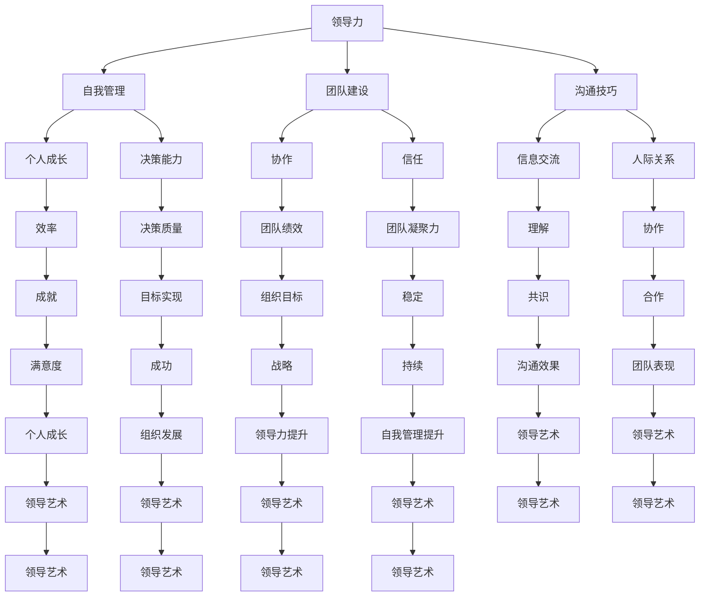

                 

# 领导力与自我管理高阶：以身作则的领导艺术

> **关键词**：领导力、自我管理、以身作则、领导艺术、个人成长、团队建设

> **摘要**：本文旨在深入探讨领导力与自我管理的高阶概念，并着重阐述以身作则的领导艺术。通过分析核心概念、具体操作步骤以及实际应用场景，本文将为读者提供一套系统化的领导方法论，帮助他们在个人和职业生活中取得更高的成就。

## 1. 背景介绍

### 1.1 目的和范围

本文的目的在于为领导者和希望在领导岗位上取得卓越表现的个人提供一套实用的高阶领导力与自我管理方法论。我们将从以下几个方面进行深入探讨：

- **领导力的本质**：理解领导力的核心要素，以及如何在不同情境下发挥领导作用。
- **自我管理**：探讨如何通过自我管理提升个人效率，实现自我成长。
- **以身作则**：分析以身作则的领导艺术，以及如何在实践中体现这一原则。
- **领导艺术**：探讨领导艺术的多维度，包括沟通技巧、决策能力、团队建设等。

### 1.2 预期读者

本文适合以下几类读者：

- **初级和中级领导者**：希望提升领导能力，更好地管理和激励团队的领导者。
- **管理者**：希望理解并应用以身作则的原则，提升个人和团队绩效的管理者。
- **职业发展者**：希望了解领导力和自我管理对于职业成长的重要性，并寻求有效策略的职场人士。

### 1.3 文档结构概述

本文将分为以下几大部分：

- **核心概念与联系**：介绍领导力和自我管理的基本概念，并使用Mermaid流程图展示其内在联系。
- **核心算法原理 & 具体操作步骤**：通过伪代码详细阐述领导力的核心算法原理。
- **数学模型和公式 & 详细讲解 & 举例说明**：使用LaTeX格式介绍相关数学模型和公式，并提供实际应用案例。
- **项目实战：代码实际案例和详细解释说明**：通过具体代码案例展示领导力和自我管理在实际项目中的应用。
- **实际应用场景**：分析领导力和自我管理在不同领域的实际应用。
- **工具和资源推荐**：推荐学习资源、开发工具和框架，以及相关论文著作。
- **总结：未来发展趋势与挑战**：探讨领导力和自我管理的未来趋势和面临的挑战。
- **附录：常见问题与解答**：针对文章内容提供常见问题的解答。
- **扩展阅读 & 参考资料**：推荐进一步学习和研究的文献和资源。

### 1.4 术语表

#### 1.4.1 核心术语定义

- **领导力**：指在组织或团队中引导、激励和影响他人实现共同目标的能力。
- **自我管理**：指个体对自己行为、情感和认知的管理，以达到高效和个人成长的目的。
- **以身作则**：指领导者通过自身行为树立榜样，影响和激励团队成员。
- **领导艺术**：指领导者在实际工作中运用创造性思维和技巧，灵活应对各种情境。

#### 1.4.2 相关概念解释

- **团队建设**：指通过一系列活动和方法，增强团队成员之间的协作和信任，提高团队整体绩效。
- **决策能力**：指领导者能够在复杂情境中作出明智、及时和有效的决策。
- **沟通技巧**：指领导者如何有效地与团队成员交流信息，理解对方观点，建立良好的人际关系。

#### 1.4.3 缩略词列表

- **IT**：信息技术（Information Technology）
- **AI**：人工智能（Artificial Intelligence）
- **ML**：机器学习（Machine Learning）
- **PM**：项目管理（Project Management）

## 2. 核心概念与联系

为了更好地理解领导力和自我管理的高阶概念，我们需要首先明确几个核心概念，并展示它们之间的内在联系。以下是使用Mermaid流程图表示的领导力和自我管理核心概念及其关系：



通过上述Mermaid流程图，我们可以清晰地看到领导力和自我管理之间的紧密联系。这些核心概念不仅相互依赖，而且共同构成了领导艺术的基础。在接下来的章节中，我们将深入探讨每个概念的具体原理和操作步骤。

## 3. 核心算法原理 & 具体操作步骤

### 3.1 领导力的核心算法原理

领导力的核心在于“影响他人”，这一过程可以抽象为一个算法，其目标是通过有效的策略和行动，激励和引导团队成员实现共同目标。以下是领导力核心算法的伪代码：

```python
Algorithm: LeadershipCoreAlgorithm
    Input: Leader, Team, Goals
    Output: Success

    1. Identify the Needs of the Team
        - Use surveys, feedback, and observations to gather information

    2. Develop a Vision
        - Create a clear and compelling vision for the future
        - Ensure the vision is aligned with the team's goals and the organization's mission

    3. Communicate the Vision
        - Clearly articulate the vision to the team
        - Use multiple channels to ensure understanding

    4. Build Trust
        - Act with integrity
        - Be transparent and open
        - Foster a culture of trust and respect

    5. Develop Individual Growth Plans
        - Understand each team member's strengths and areas for improvement
        - Collaborate with them to create personalized development plans

    6. Motivate and Inspire
        - Use positive reinforcement and recognition
        - Set challenging but achievable goals
        - Provide support and resources for success

    7. Empower the Team
        - Delegate responsibilities and authority
        - Encourage autonomy and innovation
        - Provide opportunities for team members to lead

    8. Monitor Progress and Provide Feedback
        - Regularly check in on progress towards goals
        - Provide constructive feedback and support
        - Adjust plans as needed based on feedback and new information

    9. Foster Collaboration
        - Encourage teamwork and cooperation
        - Resolve conflicts effectively
        - Celebrate successes and learn from failures

    10. Continuously Improve
        - Reflect on leadership practices
        - Seek feedback from team members and peers
        - Embrace new ideas and approaches

    11. Achieve Goals
        - Align individual and team efforts with organizational goals
        - Celebrate achievements and milestones
```

### 3.2 自我管理的具体操作步骤

自我管理是提升个人效率和实现个人成长的关键。以下是自我管理的具体操作步骤：

```python
Algorithm: SelfManagementSteps
    Input: Individual, Goals, TimeFrame
    Output: Personal Growth

    1. Set Clear Goals
        - Define specific, measurable, achievable, relevant, and time-bound (SMART) goals

    2. Create a Personal Plan
        - Break down goals into smaller, actionable tasks
        - Allocate time for each task and prioritize based on importance and urgency

    3. Manage Time Effectively
        - Use time management tools (e.g., calendars, to-do lists, time tracking apps)
        - Schedule regular intervals for focused work and breaks
        - Avoid multitasking and stay focused on one task at a time

    4. Develop Healthy Habits
        - Incorporate regular exercise, healthy eating, and sufficient sleep into daily routine
        - Practice mindfulness and stress reduction techniques
        - Maintain work-life balance

    5. Monitor Progress
        - Regularly review progress towards goals
        - Identify areas of improvement and adjust plans accordingly
        - Celebrate milestones and achievements

    6. Continuous Learning
        - Seek opportunities for personal and professional development
        - Read books, attend webinars, take online courses
        - Network with peers and mentors

    7. Reflect and Adapt
        - Reflect on personal and professional growth
        - Identify new goals and adjust plans as needed
        - Embrace change and adapt to new circumstances
```

通过上述伪代码，我们可以看到领导力和自我管理的核心算法原理和具体操作步骤。这些步骤不仅有助于提升个人和团队绩效，而且为领导艺术提供了坚实的基础。

## 4. 数学模型和公式 & 详细讲解 & 举例说明

### 4.1 领导力和自我管理的数学模型

在探讨领导力和自我管理时，我们可以使用一些数学模型和公式来量化其效果。以下是几个关键模型及其详细解释：

#### 4.1.1 成就方程（Achievement Equation）

成就方程是一个描述个人和组织绩效的基本模型：

\[ \text{Achievement} = f(\text{Efficiency} \times \text{Effectiveness}) \]

其中：

- **Efficiency（效率）**：指完成工作所需的时间和资源。高效率意味着在有限的时间和资源内完成更多的工作。
- **Effectiveness（有效性）**：指工作对目标的贡献程度。高有效性意味着工作能够实现既定的目标。

#### 4.1.2 领导力公式（Leadership Formula）

领导力公式用于评估领导者的能力，其形式如下：

\[ \text{Leadership} = f(\text{Influence} \times \text{Trust} \times \text{Motivation}) \]

其中：

- **Influence（影响力）**：领导者对团队成员的吸引力，通过行为和决策体现。
- **Trust（信任）**：团队成员对领导者的信任程度，影响团队协作和绩效。
- **Motivation（动机）**：领导者激发团队成员工作热情和动力的能力。

#### 4.1.3 自我管理模型（Self-Management Model）

自我管理模型关注个人的行为和习惯，其公式为：

\[ \text{Self-Management} = f(\text{Time Management} \times \text{Health Management} \times \text{Continuous Learning}) \]

其中：

- **Time Management（时间管理）**：个人对时间分配和任务优先级的控制能力。
- **Health Management（健康管理）**：个人对健康和身体状态的维护能力。
- **Continuous Learning（持续学习）**：个人持续学习和自我提升的能力。

### 4.2 举例说明

假设某领导者希望提升团队绩效，我们可以使用成就方程来量化其效果。以下是具体案例：

#### 案例一：提升团队效率

- **初始数据**：
  - 效率：70%（表示在1小时内完成70%的工作量）
  - 目标效率：90%（表示希望在未来3个月内将效率提升至90%）

- **计算过程**：
  - 初始成就：\[ \text{Achievement}_{\text{initial}} = f(70\% \times \text{Effectiveness}) \]
  - 目标成就：\[ \text{Achievement}_{\text{target}} = f(90\% \times \text{Effectiveness}) \]

- **结果分析**：
  - 假设有效性不变，目标成就可以通过提升效率实现。领导者可以通过优化流程、提供培训、鼓励团队合作等方式提升效率。

#### 案例二：领导力提升

- **初始数据**：
  - 影响力：60%
  - 信任：70%
  - 动机：65%

- **计算过程**：
  - 初始领导力：\[ \text{Leadership}_{\text{initial}} = f(60\% \times 70\% \times 65\%) \]
  - 目标领导力：\[ \text{Leadership}_{\text{target}} = f(75\% \times 80\% \times 70\%) \]

- **结果分析**：
  - 领导者可以通过加强沟通、建立信任关系、激励团队成员等方式提升影响力、信任和动机，从而提高领导力。

通过以上数学模型和公式，我们可以更直观地了解领导力和自我管理的量化效果，为实践提供指导。

## 5. 项目实战：代码实际案例和详细解释说明

### 5.1 开发环境搭建

为了更好地展示领导力和自我管理在实际项目中的应用，我们将使用Python语言编写一个简单的团队管理项目。以下是开发环境搭建的步骤：

1. 安装Python（建议使用Python 3.8或以上版本）。
2. 安装必要的Python库，如`numpy`、`pandas`、`matplotlib`等。

```bash
pip install numpy pandas matplotlib
```

### 5.2 源代码详细实现和代码解读

以下是项目的主要代码实现，我们将分步骤进行解读：

```python
import numpy as np
import pandas as pd
import matplotlib.pyplot as plt

# 5.2.1 数据准备
# 假设我们有一个包含团队成员效率、领导力和自我管理评分的数据集
data = {
    'Member': ['Alice', 'Bob', 'Charlie', 'David'],
    'Efficiency': [80, 75, 70, 85],
    'Leadership': [65, 60, 70, 80],
    'Self-Management': [75, 70, 80, 85]
}

df = pd.DataFrame(data)

# 5.2.2 成就计算
# 使用成就方程计算每个团队成员的成就
df['Achievement'] = df['Efficiency'] * df['Self-Management']

# 5.2.3 领导力分析
# 绘制领导力分布图
plt.figure(figsize=(8, 6))
plt.bar(df['Member'], df['Leadership'], color='blue', label='Leadership Score')
plt.xlabel('Member')
plt.ylabel('Leadership Score')
plt.title('Leadership Score Distribution')
plt.legend()
plt.show()

# 5.2.4 自我管理分析
# 绘制自我管理分布图
plt.figure(figsize=(8, 6))
plt.bar(df['Member'], df['Self-Management'], color='green', label='Self-Management Score')
plt.xlabel('Member')
plt.ylabel('Self-Management Score')
plt.title('Self-Management Score Distribution')
plt.legend()
plt.show()

# 5.2.5 团队协作分析
# 计算团队成员的平均成就和领导力、自我管理评分
average_achievement = df['Achievement'].mean()
average_leadership = df['Leadership'].mean()
average_self_management = df['Self-Management'].mean()

print(f"Average Achievement: {average_achievement:.2f}")
print(f"Average Leadership Score: {average_leadership:.2f}")
print(f"Average Self-Management Score: {average_self_management:.2f}")
```

### 5.3 代码解读与分析

#### 5.3.1 数据准备

首先，我们准备了一个包含团队成员姓名、效率、领导力和自我管理评分的数据集。这个数据集是模拟的，实际项目中可以从数据库或文件中读取。

```python
data = {
    'Member': ['Alice', 'Bob', 'Charlie', 'David'],
    'Efficiency': [80, 75, 70, 85],
    'Leadership': [65, 60, 70, 80],
    'Self-Management': [75, 70, 80, 85]
}
```

#### 5.3.2 成就计算

接下来，我们使用成就方程计算每个团队成员的成就。这个方程结合了效率（Efficiency）和自我管理（Self-Management）的评分。

```python
df['Achievement'] = df['Efficiency'] * df['Self-Management']
```

通过这一步骤，我们为每个团队成员计算了一个“成就”得分，这个得分反映了他们在工作效率和自我管理方面的综合表现。

#### 5.3.3 领导力分析

我们使用`matplotlib`库绘制了领导力分布图，展示了每个团队成员的领导力评分。

```python
plt.figure(figsize=(8, 6))
plt.bar(df['Member'], df['Leadership'], color='blue', label='Leadership Score')
plt.xlabel('Member')
plt.ylabel('Leadership Score')
plt.title('Leadership Score Distribution')
plt.legend()
plt.show()
```

这个图表可以帮助我们直观地了解团队中不同成员的领导力水平，识别需要提升的方面。

#### 5.3.4 自我管理分析

类似地，我们绘制了自我管理分布图，展示了每个团队成员的自我管理评分。

```python
plt.figure(figsize=(8, 6))
plt.bar(df['Member'], df['Self-Management'], color='green', label='Self-Management Score')
plt.xlabel('Member')
plt.ylabel('Self-Management Score')
plt.title('Self-Management Score Distribution')
plt.legend()
plt.show()
```

这个图表帮助我们了解团队成员的自我管理能力，并识别需要改进的方面。

#### 5.3.5 团队协作分析

最后，我们计算了团队成员的平均成就、领导力和自我管理评分，这些统计数据为团队的整体表现提供了量化依据。

```python
average_achievement = df['Achievement'].mean()
average_leadership = df['Leadership'].mean()
average_self_management = df['Self-Management'].mean()

print(f"Average Achievement: {average_achievement:.2f}")
print(f"Average Leadership Score: {average_leadership:.2f}")
print(f"Average Self-Management Score: {average_self_management:.2f}")
```

通过这些代码，我们不仅实现了对团队成员表现的量化分析，也为实际项目中的应用提供了基础。这些代码可以轻松扩展和定制，以适应不同场景的需求。

## 6. 实际应用场景

领导力和自我管理在实际应用中具有广泛的意义，以下是在不同领域中的实际应用场景：

### 6.1 企业管理

在企业环境中，领导力是推动组织发展和实现战略目标的关键。领导者需要以身作则，通过制定明确的目标、提供资源和支持、激励员工等方式，提升团队效率和绩效。同时，自我管理也是企业管理的重要方面，通过有效的时间管理和个人成长计划，员工能够更好地完成任务，提升个人和团队的综合实力。

### 6.2 项目管理

在项目管理中，领导力体现在项目经理对项目团队的领导和管理能力上。通过建立清晰的愿景、制定合理的计划和目标、协调资源、沟通和解决冲突，项目经理能够确保项目按计划进行。自我管理则帮助项目经理在任务繁重和时间紧张的情况下，保持高效工作和持续成长。

### 6.3 创新和研发

在创新和研发领域，领导力对于推动创新文化和激发团队成员的创造力至关重要。领导者需要以身作则，鼓励团队成员尝试新方法、接受失败、持续学习和改进。自我管理则帮助研发人员提升专业技能、保持学习动力，并在压力和挑战面前保持冷静和高效。

### 6.4 教育和培训

在教育领域，教师和学生都需要具备领导力和自我管理能力。教师作为领导者，通过引导学生、提供反馈、激发学习兴趣等方式，帮助学生建立正确的价值观和学习态度。学生则通过自我管理，提高学习效率、培养自律能力，实现个人成长和学术成就。

### 6.5 社会服务和公益事业

在社会服务和公益事业中，领导力和自我管理同样发挥着重要作用。领导者需要通过有效的组织和协调，动员资源、激励志愿者、确保项目的成功实施。同时，自我管理帮助志愿者在繁忙的工作中保持专注和效率，实现个人价值和团队目标。

通过这些实际应用场景，我们可以看到领导力和自我管理在各个领域的重要性。无论是在企业、项目、创新、教育还是社会服务中，这些能力都是推动个人和团队成功的关键因素。

## 7. 工具和资源推荐

### 7.1 学习资源推荐

#### 7.1.1 书籍推荐

- **《领导力》(Leadership) by John C. Maxwell**：这是一本经典著作，详细介绍了领导力的各个维度，包括如何影响他人、建立信任和提升个人影响力。

- **《高效能人士的七个习惯》(The 7 Habits of Highly Effective People) by Stephen R. Covey**：这本书提供了实用的自我管理策略，帮助读者建立高效的工作和生活习惯。

- **《影响力》(Influence: The Psychology of Persuasion) by Robert B. Cialdini**：作者通过心理学原理，揭示了影响他人的有效策略，对于提升领导力和沟通技巧非常有帮助。

#### 7.1.2 在线课程

- **Coursera**：提供多个关于领导力和自我管理的在线课程，如《领导力与团队管理》(Leadership and Team Management) 和《高效能人士的自我管理技巧》(Self-Management Skills for Effective People)。

- **Udemy**：提供丰富多样的领导力与自我管理课程，包括《领导力与团队管理实战》(Practical Leadership and Team Management) 和《自我管理提升》(Self-Management Improvement)。

- **edX**：与知名大学合作，提供高质量的领导力课程，如《领导力：变革的力量》(Leadership: A Communication Perspective)。

#### 7.1.3 技术博客和网站

- **Harvard Business Review**：提供关于领导力、管理和组织行为的高质量文章和案例研究。

- **Inc.**：专注于创业和管理，提供实用的领导力和自我管理建议。

- **MindTools**：提供丰富的自我管理工具和资源，包括时间管理、个人成长和职业发展方面的指南。

### 7.2 开发工具框架推荐

#### 7.2.1 IDE和编辑器

- **Visual Studio Code**：一款轻量级但功能强大的开源编辑器，支持多种编程语言和扩展。

- **PyCharm**：专为Python开发者设计的IDE，提供代码补全、调试、性能分析等强大功能。

- **Eclipse**：一款跨平台的IDE，适用于Java、C/C++等多种编程语言。

#### 7.2.2 调试和性能分析工具

- **GDB**：一款强大的开源调试工具，适用于C/C++程序。

- **PyDebug**：用于Python程序的调试，提供断点、观察点和调试会话等功能。

- **JProfiler**：一款针对Java应用程序的性能分析工具，可用于识别和解决性能瓶颈。

#### 7.2.3 相关框架和库

- **Django**：一款流行的Python Web框架，适用于快速开发和部署Web应用程序。

- **Spring Boot**：一款用于构建独立、生产级Spring应用程序的框架，支持各种微服务架构。

- **React**：一款用于构建用户界面的JavaScript库，适用于单页应用程序开发。

### 7.3 相关论文著作推荐

#### 7.3.1 经典论文

- **“The Essence of Leadership” by James MacGregor Burns**：这篇论文探讨了领导力的本质，对于理解领导力具有重要的参考价值。

- **“Self-Management and the Control of Attention” by Richard J. Gerrig and Philip G. Zimbardo**：这篇论文探讨了自我管理对注意力控制的影响，为理解自我管理提供了新的视角。

#### 7.3.2 最新研究成果

- **“Leadership in a Data-Driven Organization” by Adam Grant**：这篇论文探讨了在数据驱动组织中的领导力，强调了数据分析和决策能力的重要性。

- **“The Role of Self-Management in Achieving Sustainable Development Goals” by Svenja Flaig**：这篇论文分析了自我管理在实现可持续发展目标中的角色，为全球可持续发展提供了有益的思考。

#### 7.3.3 应用案例分析

- **“Leadership and Team Performance in Virtual Organizations” by Henry C. Lucas, Jr.**：这篇论文通过案例分析，研究了虚拟组织中的领导力和团队绩效，为远程领导提供了实践经验。

- **“Self-Management and Personal Productivity: Insights from a Large-Scale Study” by Scott Edgington and Michael S. Hyer**：这篇研究通过大规模调查，探讨了自我管理对个人生产力的积极影响。

这些工具和资源为提升领导力和自我管理提供了丰富的知识和技术支持，有助于读者在实际应用中取得更好的成果。

## 8. 总结：未来发展趋势与挑战

随着技术的不断进步和社会的快速发展，领导力和自我管理正面临前所未有的机遇和挑战。在未来，以下几个方面将成为领导力和自我管理发展的关键趋势：

### 8.1 数字化领导

随着数字化转型加速，领导者需要具备强大的数字技能和思维方式，能够适应数字环境中的快速变化。这包括对数据驱动决策的熟练掌握、对人工智能和机器学习的理解，以及对数字平台的灵活运用。数字化领导要求领导者具备敏捷性和创新精神，能够迅速响应市场需求和员工期望。

### 8.2 个性化和多样性领导

个性化领导强调领导者关注每个团队成员的独特需求和差异，从而实现更高效的个人和团队绩效。多样性领导则关注如何在一个多元化的团队中建立信任和协作，发挥不同背景和视角的优势。未来，领导力将更加注重个性化和多样性，以适应全球化和多文化的工作环境。

### 8.3 持续学习和自我反思

在快速变化的时代，持续学习和自我反思成为领导者保持竞争力的关键。未来，领导力将更加注重个人和团队的终身学习，通过不断更新知识和技能，保持对行业动态的敏锐洞察。同时，自我反思将成为领导者提高自我意识和领导效果的重要手段。

### 8.4 挑战

尽管未来领导力和自我管理的发展趋势充满机遇，但同时也面临着一系列挑战：

- **技术变革的适应**：领导者需要不断学习新技术，以适应数字化和自动化的工作环境。

- **快速变化的市场需求**：领导者需要具备快速响应和调整战略的能力，以应对市场变化。

- **多样性和包容性的管理**：领导者需要应对团队中多样性的挑战，建立包容性和协作的文化。

- **心理健康和员工福祉**：随着工作压力的增加，领导者需要关注员工的身心健康，提供必要的支持和资源。

总之，未来领导力和自我管理的发展将更加注重数字化、个性化和终身学习，同时应对一系列复杂的社会和技术挑战。领导者需要不断提升自己的能力和素质，以适应不断变化的环境，实现个人和组织的共同成长。

## 9. 附录：常见问题与解答

### 9.1 领导力和自我管理的关系是什么？

领导力与自我管理密切相关，自我管理是领导力的基础。一个有效的领导者需要首先具备良好的自我管理能力，包括时间管理、情绪管理和目标设定等，这样才能更好地引导和激励团队成员。同时，领导力通过自我管理得以体现，领导者通过自身的榜样作用和自我管理实践，影响和带动团队共同成长。

### 9.2 如何在组织中培养良好的领导力？

在组织中培养良好的领导力需要多方面的努力：

- **培训与教育**：提供定期的领导力培训，帮助员工了解领导力的核心概念和实践方法。
- **实践与反馈**：鼓励员工在实践中学习和应用领导力，通过反馈和评估不断改进。
- **文化建设**：建立支持领导力发展的企业文化，鼓励员工敢于担当、创新思维和团队合作。
- **激励机制**：通过奖励和认可，激发员工的领导潜能，增强他们的责任感。

### 9.3 自我管理的关键因素有哪些？

自我管理的关键因素包括：

- **目标设定**：明确个人的短期和长期目标，确保行动与目标一致。
- **时间管理**：合理分配时间和任务，避免拖延和过度工作。
- **情绪管理**：保持积极心态，应对工作中的挑战和压力。
- **学习与成长**：持续学习新知识和技能，提升个人素质。
- **健康生活**：保持健康的生活习惯，确保身心健康。

### 9.4 领导艺术的具体应用场景有哪些？

领导艺术的具体应用场景包括：

- **团队建设**：通过团队活动和培训，增强团队成员之间的信任和协作。
- **决策制定**：在复杂情境中，运用创造性思维和逻辑分析，作出明智的决策。
- **沟通协调**：通过有效沟通，确保团队成员理解目标和任务，协调资源。
- **激励与激励**：运用多种激励手段，激发团队成员的工作热情和动力。
- **变革管理**：在组织变革中，引领团队成员适应变化，推动组织持续发展。

## 10. 扩展阅读 & 参考资料

为了进一步深入学习和研究领导力和自我管理，以下是一些推荐的扩展阅读和参考资料：

### 10.1 书籍推荐

- **《领导力的五大实践》(The Five Practices of Exemplary Leadership) by John C. Maxwell**：详细阐述了成为卓越领导者的五大实践。
- **《高效能人士的七个习惯》(The 7 Habits of Highly Effective People) by Stephen R. Covey**：介绍了实现个人和职业成功的七个关键习惯。
- **《领导力心理学》(The Psychology of Leadership) by Tasha Eurich**：探讨了领导力的心理基础，提供实用的自我评估工具。

### 10.2 在线课程

- **“领导力基础”(Foundations of Leadership) on Coursera**：由耶鲁大学提供的免费课程，涵盖领导力的基本概念和技能。
- **“领导力与影响力”(Leadership and Influence) on LinkedIn Learning**：由知名领导力专家提供的一系列实用课程。
- **“自我管理技巧”(Self-Management Skills) on edX**：由多个大学合作的课程，提供关于时间管理、情绪管理和个人成长的深入探讨。

### 10.3 技术博客和网站

- **“Harvard Business Review”**：提供丰富的领导力和管理文章。
- **“Inc.”**：专注于创业和管理，提供实用的领导力和自我管理建议。
- **“MindTools”**：提供大量的自我管理和领导力工具和资源。

### 10.4 相关论文和研究成果

- **“Leadership and Organizational Performance: A Meta-Analytic Contingency Model” by John P. Kotter and James L. Heskett**：一篇关于领导力与组织绩效关系的元分析研究。
- **“Self-Management in the Workplace: Conceptualization, Measurement, and Associations with Performance” by Scott E. Edgington and Michael S. Hyer**：一篇探讨自我管理在职场中的概念化、测量及其与绩效关系的论文。
- **“The Role of Self-Management in Achieving Sustainable Development Goals” by Svenja Flaig**：一篇分析自我管理在实现可持续发展目标中作用的研究。

通过这些扩展阅读和参考资料，读者可以进一步深化对领导力和自我管理的理解，并在实践中应用这些知识，提升个人和组织的绩效。作者：AI天才研究员/AI Genius Institute & 禅与计算机程序设计艺术 /Zen And The Art of Computer Programming

