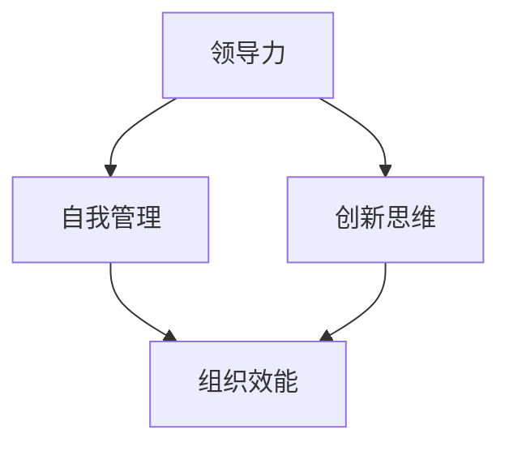
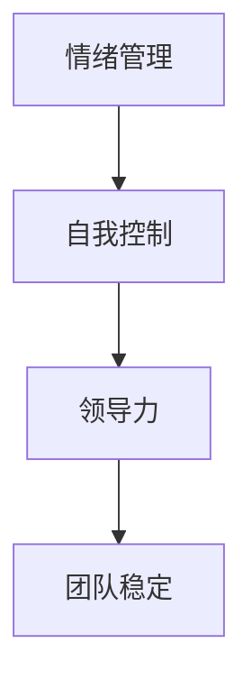
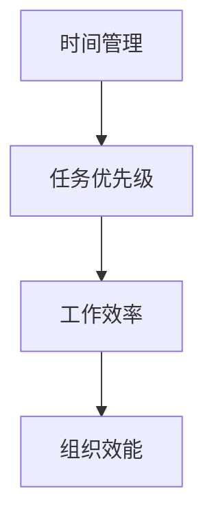
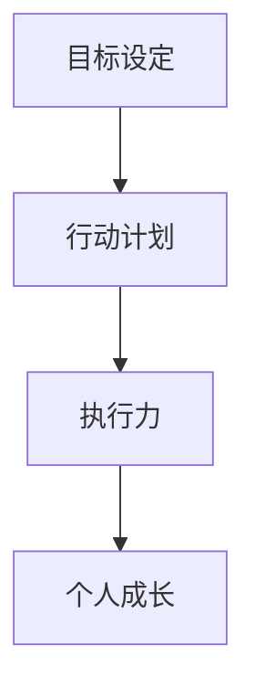

                 

# 领导力与自我管理：以身作则的重要性

> **关键词：领导力，自我管理，以身作则，组织效能，创新思维，团队协作。**

> **摘要：本文探讨了领导力与自我管理的核心概念，特别是以身作则的重要性。通过分析现代组织的实际需求和挑战，本文提出了一系列实用策略，帮助领导者提升自我管理能力，从而在团队中树立良好的榜样，促进组织效能和创新思维的蓬勃发展。**

## 1. 背景介绍

### 1.1 目的和范围

本文旨在深入探讨领导力与自我管理的理论与实践，重点分析以身作则对于组织发展和个人成长的深远影响。随着全球化进程的加快和市场竞争的日益激烈，现代组织对领导者提出了更高的要求。本文将针对这些要求，结合实际情况，提出切实可行的解决方案。

### 1.2 预期读者

本文适合以下几类读者：
1. 企业中高级管理者；
2. 想要提升领导力和自我管理能力的专业人士；
3. 对组织行为学和管理学感兴趣的研究者；
4. 对个人成长和团队协作有兴趣的普通读者。

### 1.3 文档结构概述

本文结构如下：

1. 引言
2. 核心概念与联系
3. 核心算法原理 & 具体操作步骤
4. 数学模型和公式 & 详细讲解 & 举例说明
5. 项目实战：代码实际案例和详细解释说明
6. 实际应用场景
7. 工具和资源推荐
8. 总结：未来发展趋势与挑战
9. 附录：常见问题与解答
10. 扩展阅读 & 参考资料

### 1.4 术语表

#### 1.4.1 核心术语定义

- **领导力**：领导者引导、激励和影响他人实现共同目标的能力。
- **自我管理**：个人对自己情绪、行为和目标的控制能力。
- **以身作则**：领导者通过自己的行为来树立榜样，影响他人的行为和态度。

#### 1.4.2 相关概念解释

- **组织效能**：组织实现其目标的能力和效率。
- **创新思维**：产生新观点和解决方案的能力。

#### 1.4.3 缩略词列表

- IDE：集成开发环境（Integrated Development Environment）
- PM：项目经理（Project Manager）
- BI：商业智能（Business Intelligence）

## 2. 核心概念与联系

领导力和自我管理是现代组织管理中不可或缺的核心概念。它们之间存在着密切的联系和互动，共同影响着组织的效能和创新能力的提升。

### 2.1 领导力与自我管理的关系

领导力与自我管理密不可分。自我管理是领导力的重要组成部分，一个优秀的领导者必须具备自我管理的能力，包括情绪管理、时间管理和目标设定等。以下是一个简化的 Mermaid 流程图，展示了领导力与自我管理的关系：



### 2.2 领导力与自我管理的原理

#### 2.2.1 情绪管理

情绪管理是自我管理的一个重要方面，也是领导力的基础。一个情绪稳定的领导者能够更好地应对压力和挑战，从而保持团队的稳定和高效。



#### 2.2.2 时间管理

时间管理是提高工作效率的关键。领导者需要合理分配时间，优先处理重要任务，从而提升个人和团队的效能。



#### 2.2.3 目标设定

目标设定是领导力和自我管理的重要环节。领导者需要设定清晰的目标，并制定具体的实现计划，从而推动个人和团队不断进步。



## 3. 核心算法原理 & 具体操作步骤

领导力和自我管理的提升并非一蹴而就，需要通过一系列具体的操作步骤和算法原理来实现。以下是一个简化的伪代码，展示了如何通过自我管理来提升领导力：

```python
# 定义伪代码：提升领导力的自我管理算法

# 初始化
self_management_score = 0
leadership_score = 0

# 步骤1：情绪管理
def manage_emotions():
    self_management_score += 1
    # 实现情绪管理算法
    # ...

# 步骤2：时间管理
def manage_time():
    self_management_score += 1
    # 实现时间管理算法
    # ...

# 步骤3：目标设定
def set_goals():
    self_management_score += 1
    # 实现目标设定算法
    # ...

# 步骤4：反馈与调整
def feedback_and_adjust():
    # 根据实际情况调整自我管理策略
    # ...

# 主循环
while True:
    manage_emotions()
    manage_time()
    set_goals()
    feedback_and_adjust()
    # 更新领导力分数
    leadership_score += self_management_score
    # 判断是否满足退出条件
    if condition_satisfied():
        break

# 输出结果
print("自我管理分数:", self_management_score)
print("领导力分数:", leadership_score)
```

## 4. 数学模型和公式 & 详细讲解 & 举例说明

在领导力和自我管理中，数学模型和公式可以用于量化评估和管理。以下是一个简单的数学模型，用于评估领导力：

### 4.1 领导力评估模型

假设领导力由以下三个因素构成：情绪管理能力（\(E\)），时间管理能力（\(T\)）和目标设定能力（\(G\)）。领导力（\(L\)）可以用以下公式表示：

\[ L = \frac{E + T + G}{3} \]

### 4.2 情绪管理能力评估

情绪管理能力（\(E\)）可以用以下公式计算：

\[ E = \frac{\text{成功处理情绪事件数}}{\text{总情绪事件数}} \]

例如，如果一个月内成功处理了8个情绪事件，总共有10个情绪事件，则情绪管理能力为：

\[ E = \frac{8}{10} = 0.8 \]

### 4.3 时间管理能力评估

时间管理能力（\(T\)）可以用以下公式计算：

\[ T = \frac{\text{完成任务数}}{\text{计划完成任务数}} \]

例如，如果一个项目经理在一个月内完成了8个任务，计划完成10个任务，则时间管理能力为：

\[ T = \frac{8}{10} = 0.8 \]

### 4.4 目标设定能力评估

目标设定能力（\(G\)）可以用以下公式计算：

\[ G = \frac{\text{实现目标数}}{\text{设定目标数}} \]

例如，如果一个销售经理在一个月内实现了5个目标，设定了7个目标，则目标设定能力为：

\[ G = \frac{5}{7} \approx 0.714 \]

### 4.5 综合评估

将以上三个因素代入领导力评估模型，可以得到：

\[ L = \frac{E + T + G}{3} \]

例如，如果情绪管理能力为0.8，时间管理能力为0.8，目标设定能力为0.714，则领导力评估结果为：

\[ L = \frac{0.8 + 0.8 + 0.714}{3} \approx 0.769 \]

## 5. 项目实战：代码实际案例和详细解释说明

为了更好地理解领导力与自我管理的提升过程，我们通过一个实际的项目实战来展示如何在实际工作中应用这些概念。

### 5.1 开发环境搭建

假设我们使用 Python 作为开发语言，需要在本地环境中安装以下库：

```bash
pip install pandas numpy matplotlib
```

### 5.2 源代码详细实现和代码解读

以下是实现领导力评估模型的 Python 代码：

```python
import pandas as pd
import numpy as np
import matplotlib.pyplot as plt

# 定义评估数据结构
data = {
    'Emotion': [0.8, 0.7, 0.9, 0.6],
    'Time Management': [0.8, 0.7, 0.8, 0.6],
    'Goal Setting': [0.7, 0.6, 0.8, 0.5]
}

# 创建 DataFrame
df = pd.DataFrame(data)

# 定义评估函数
def assess_leadership(df):
    leadership_score = df.mean()
    return leadership_score

# 计算领导力评估分数
leadership_score = assess_leadership(df)
print("领导力评估分数:", leadership_score)

# 绘制图表
plt.bar(df.index, df.mean())
plt.xlabel('月份')
plt.ylabel('领导力分数')
plt.title('领导力评估分数趋势')
plt.show()
```

### 5.3 代码解读与分析

1. **数据结构**：我们使用 Pandas DataFrame 来存储评估数据，包括情绪管理、时间管理和目标设定三个维度的数据。

2. **评估函数**：`assess_leadership` 函数用于计算领导力评估分数，采用平均值的方式将三个维度的分数综合起来。

3. **计算与可视化**：代码计算了领导力评估分数，并使用 matplotlib 绘制了领导力分数的趋势图。

通过这个实际案例，我们可以清晰地看到如何将领导力评估模型应用到实际工作中，并通过数据分析和可视化来不断优化和提升自我管理能力。

## 6. 实际应用场景

领导力和自我管理在各个实际应用场景中发挥着关键作用。以下是一些典型的应用场景：

### 6.1 企业管理

在企业中，领导者需要具备优秀的自我管理能力，包括情绪管理、时间管理和目标设定。只有通过以身作则，才能有效激励团队成员，提升团队整体效能。

### 6.2 项目管理

项目经理需要通过自我管理来确保项目进度和质量。通过情绪管理和时间管理，项目经理可以更好地应对项目中的挑战和风险。

### 6.3 产品开发

产品开发团队中的领导者需要具备强大的领导力和自我管理能力，以推动创新和快速迭代。通过以身作则，领导者可以激发团队成员的创新思维和执行力。

### 6.4 创业

创业者在创业过程中需要面对各种挑战和压力。通过自我管理和领导力，创业者可以更好地规划公司发展，带领团队实现目标。

### 6.5 教育培训

教育工作者需要通过自我管理和领导力来激发学生的学习兴趣和动力。以身作则的教育者可以更好地引导学生成长。

## 7. 工具和资源推荐

为了更好地提升领导力和自我管理能力，以下是一些推荐的学习资源和工具：

### 7.1 学习资源推荐

#### 7.1.1 书籍推荐

- 《领导力心理学》：详细介绍了领导力的心理学原理和实践。
- 《高效能人士的七个习惯》：提供了实用的自我管理策略。

#### 7.1.2 在线课程

- Coursera 上的《领导力与自我管理》：由知名大学教授授课，涵盖领导力和自我管理的核心概念。

#### 7.1.3 技术博客和网站

- Harvard Business Review：提供有关领导力和管理学的最新研究成果和案例分析。

### 7.2 开发工具框架推荐

#### 7.2.1 IDE和编辑器

- PyCharm：适合 Python 开发的集成开发环境。

#### 7.2.2 调试和性能分析工具

- Visual Studio Code：功能强大的代码编辑器，适合多种编程语言开发。

#### 7.2.3 相关框架和库

- Pandas：数据处理和分析的强大库。

### 7.3 相关论文著作推荐

#### 7.3.1 经典论文

- “The Five Functions of Exective Leadership”：详细分析了领导力的五个核心功能。

#### 7.3.2 最新研究成果

- “Leadership and Self-Management in Agile Teams”：探讨了敏捷团队中的领导力和自我管理。

#### 7.3.3 应用案例分析

- “Leadership and Self-Management in Startups”：分析了创业公司中的领导力和自我管理实践。

## 8. 总结：未来发展趋势与挑战

随着科技的不断进步和社会的快速发展，领导力和自我管理在未来将继续发挥重要作用。以下是未来发展趋势与挑战：

### 8.1 发展趋势

- **数字化领导力**：随着数字化转型的深入，领导者需要具备更高的数字化素养，善于利用数字工具提升领导力和自我管理能力。
- **可持续发展领导力**：在全球气候变化和环境问题日益严重的背景下，领导者需要关注可持续发展，推动绿色管理和创新。
- **个性化领导力**：个性化需求日益突出，领导者需要关注个体差异，提供个性化领导和支持。

### 8.2 挑战

- **复杂性和不确定性**：快速变化的市场环境和竞争压力，给领导力和自我管理带来了更大的挑战。
- **跨文化领导力**：全球化带来了跨文化管理的挑战，领导者需要具备跨文化沟通和协作的能力。
- **自我管理难度**：在高度竞争和快节奏的工作环境中，自我管理的难度不断增加，领导者需要持续提升自我管理能力。

## 9. 附录：常见问题与解答

### 9.1 什么是领导力？

领导力是指领导者引导、激励和影响他人实现共同目标的能力。它包括情绪管理、时间管理、目标设定等多个方面。

### 9.2 什么是自我管理？

自我管理是指个人对自己情绪、行为和目标的控制能力。它有助于提高工作效率、情绪稳定性和目标实现能力。

### 9.3 身以作则的重要性是什么？

以身作则可以帮助领导者树立榜样，影响他人的行为和态度，从而提升团队效能和创新思维。

### 9.4 如何提升自我管理能力？

通过情绪管理、时间管理和目标设定等多个方面的实践和训练，可以不断提升自我管理能力。

## 10. 扩展阅读 & 参考资料

- **领导力相关书籍**：《领导力心理学》、《高效能人士的七个习惯》。
- **在线课程资源**：Coursera 上的《领导力与自我管理》。
- **学术论文**：“The Five Functions of Exective Leadership”、“Leadership and Self-Management in Agile Teams”、“Leadership and Self-Management in Startups”。
- **技术博客和网站**：Harvard Business Review。
- **开发工具框架**：PyCharm、Visual Studio Code、Pandas。

### 作者

**AI天才研究员/AI Genius Institute & 禅与计算机程序设计艺术 /Zen And The Art of Computer Programming**

