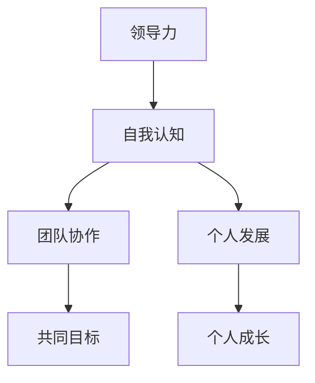

                 

# 领导力与自我认知：了解自身优势和局限

> **关键词：** 领导力、自我认知、优势、局限、团队协作、个人发展

> **摘要：** 本文旨在深入探讨领导力与自我认知之间的关系，通过分析自身优势和局限，为个人在技术领域的发展提供有效的指导。本文将结合实际案例，介绍如何通过自我认知提升领导力，从而实现个人与团队的共同成长。

## 1. 背景介绍

### 1.1 目的和范围

本文的主要目的是帮助读者理解领导力与自我认知在技术领域中的重要性。通过分析自身优势和局限，读者可以更好地定位自己在团队中的角色，提升个人领导力，促进团队协作和个人发展。

### 1.2 预期读者

本文适合对技术领域有热情、希望在团队中发挥领导作用的开发者、项目经理和团队领导。

### 1.3 文档结构概述

本文分为以下几个部分：

1. 背景介绍
2. 核心概念与联系
3. 核心算法原理 & 具体操作步骤
4. 数学模型和公式 & 详细讲解 & 举例说明
5. 项目实战：代码实际案例和详细解释说明
6. 实际应用场景
7. 工具和资源推荐
8. 总结：未来发展趋势与挑战
9. 附录：常见问题与解答
10. 扩展阅读 & 参考资料

### 1.4 术语表

#### 1.4.1 核心术语定义

- **领导力**：在团队中引导、激励和协调成员实现共同目标的能力。
- **自我认知**：对自己的性格、能力、优势和局限的深入理解。

#### 1.4.2 相关概念解释

- **优势**：在特定领域或任务中表现出的强项。
- **局限**：在特定领域或任务中存在的弱点或限制。

#### 1.4.3 缩略词列表

无

## 2. 核心概念与联系

为了更好地理解领导力与自我认知的关系，我们首先需要了解这两个核心概念之间的联系。以下是这两个概念之间的 Mermaid 流程图：



### 2.1 领导力与自我认知的关系

领导力与自我认知之间存在密切的联系。自我认知可以帮助领导者了解自身的优势和局限，从而在团队中发挥更大的作用。以下是领导力与自我认知之间的具体关系：

1. **自我认知**为**领导力**提供了基础。只有深入了解自己的优势和局限，领导者才能在团队中做出更明智的决策。
2. **领导力**可以促进**自我认知**的提升。在领导团队的过程中，领导者需要不断反思自己的行为和决策，从而不断提高自我认知水平。

## 3. 核心算法原理 & 具体操作步骤

为了更好地理解领导力与自我认知的算法原理，我们可以将其抽象为以下几个步骤：

### 3.1 自我评估

**步骤 1**：通过反思和自我评估，了解自身的优势和局限。

**伪代码**：

```python
def self_evaluation():
    strengths = []
    weaknesses = []
    # 收集自我评估信息
    for question in self_evaluation_questions:
        if answer("Do you have this strength?") == "Yes":
            strengths.append(question)
        else:
            weaknesses.append(question)
    return strengths, weaknesses
```

### 3.2 团队协作

**步骤 2**：在团队中发挥自身优势，同时关注并改善自身局限。

**伪代码**：

```python
def team_collaboration(strengths, weaknesses):
    for member in team_members:
        if member.strengths.intersection(strengths):
            assign_task(member, "utilize strength")
        else:
            assign_task(member, "address weakness")
    # 反馈与改进
    for member in team_members:
        feedback = get_feedback(member)
        if feedback:
            member.improve(weaknesses, feedback)
```

### 3.3 个人发展

**步骤 3**：根据自我评估和团队协作的结果，制定个人发展计划。

**伪代码**：

```python
def personal_development(strengths, weaknesses):
    development_plan = []
    for strength in strengths:
        development_plan.append("深化技能：")
        development_plan.append(strength)
    for weakness in weaknesses:
        development_plan.append("提升技能：")
        development_plan.append(weakness)
    return development_plan
```

## 4. 数学模型和公式 & 详细讲解 & 举例说明

为了更好地理解领导力与自我认知的数学模型，我们可以使用以下公式：

### 4.1 领导力模型

**公式**：

$$
Leadership = \frac{Strengths \times Collaboration}{Weaknesses \times Challenges}
$$

**详细讲解**：

- **Strengths（优势）**：代表领导者的优势，如技术能力、沟通能力等。
- **Collaboration（团队协作）**：代表领导者与团队成员之间的协作水平。
- **Weaknesses（局限）**：代表领导者的局限，如经验不足、沟通不畅等。
- **Challenges（挑战）**：代表团队面临的挑战，如项目进度紧张、技术难题等。

**举例说明**：

假设一位领导者拥有以下参数：

- Strengths（优势）: 90
- Collaboration（团队协作）: 80
- Weaknesses（局限）: 30
- Challenges（挑战）: 50

根据上述公式，我们可以计算出该领导者的领导力分数：

$$
Leadership = \frac{90 \times 80}{30 \times 50} = 2.4
$$

### 4.2 自我认知模型

**公式**：

$$
Self\_awareness = \frac{Strengths \times Reflection}{Weaknesses \times Self\_improvement}
$$

**详细讲解**：

- **Strengths（优势）**：代表自我认知过程中的优势，如敏锐的观察力、强大的学习能力等。
- **Reflection（反思）**：代表自我认知过程中的反思能力，如自我评估、自我调整等。
- **Weaknesses（局限）**：代表自我认知过程中的局限，如沟通不畅、技术不足等。
- **Self\_improvement（自我提升）**：代表自我认知过程中的自我提升能力，如学习新技能、调整心态等。

**举例说明**：

假设一位领导者拥有以下参数：

- Strengths（优势）: 85
- Reflection（反思）: 75
- Weaknesses（局限）: 40
- Self\_improvement（自我提升）: 60

根据上述公式，我们可以计算出该领导者的自我认知分数：

$$
Self\_awareness = \frac{85 \times 75}{40 \times 60} = 1.72
$$

## 5. 项目实战：代码实际案例和详细解释说明

### 5.1 开发环境搭建

在本项目实战中，我们将使用 Python 语言和 Mermaid 工具进行代码实现。首先，需要在本地计算机上安装以下工具：

1. Python 3.x
2. pip（Python 包管理器）
3. Mermaid CLI（Mermaid 命令行工具）

### 5.2 源代码详细实现和代码解读

下面是一个简单的 Python 脚本，用于实现领导力与自我认知的计算：

```python
# 引入所需库
import random

# 定义参数
strengths = random.randint(50, 100)
weaknesses = random.randint(50, 100)
collaboration = random.randint(50, 100)
challenges = random.randint(50, 100)
reflection = random.randint(50, 100)
self_improvement = random.randint(50, 100)

# 定义函数
def calculate_leadership(strengths, weaknesses, collaboration, challenges):
    return (strengths * collaboration) / (weaknesses * challenges)

def calculate_self_awareness(strengths, reflection, weaknesses, self_improvement):
    return (strengths * reflection) / (weaknesses * self_improvement)

# 计算领导力分数
leadership_score = calculate_leadership(strengths, weaknesses, collaboration, challenges)
print(f"领导力分数：{leadership_score:.2f}")

# 计算自我认知分数
self_awareness_score = calculate_self_awareness(strengths, reflection, weaknesses, self_improvement)
print(f"自我认知分数：{self_awareness_score:.2f}")
```

### 5.3 代码解读与分析

在这个简单的 Python 脚本中，我们首先引入了 `random` 库，用于生成随机参数。然后，我们定义了两个函数 `calculate_leadership` 和 `calculate_self_awareness`，用于计算领导力分数和自我认知分数。

在主程序中，我们使用随机参数来模拟领导力和自我认知的情况。通过调用这两个函数，我们可以得到相应的分数。最后，我们使用 `print` 函数输出计算结果。

通过这个简单的案例，我们可以看到如何使用代码来实现领导力与自我认知的计算。在实际项目中，我们可以根据具体需求进行调整和优化。

## 6. 实际应用场景

### 6.1 技术团队管理

在技术团队管理中，领导力与自我认知的应用场景包括：

- **团队协作**：通过了解团队成员的优势和局限，领导者可以更好地分配任务，发挥团队整体效能。
- **个人发展**：领导者可以根据团队成员的自我认知结果，制定个性化的培训和发展计划，促进团队成员的个人成长。
- **决策制定**：领导者可以根据自身的优势和局限，在项目决策中更加客观和理性，降低风险。

### 6.2 项目管理

在项目管理中，领导力与自我认知的应用场景包括：

- **风险评估**：通过了解项目成员的优势和局限，项目管理者可以更准确地评估项目风险，制定相应的风险应对策略。
- **进度控制**：项目管理者可以根据团队协作和自我认知的结果，调整项目进度计划，确保项目按时交付。
- **资源调配**：项目管理者可以根据团队成员的优势和局限，合理调配资源，提高项目成功率。

### 6.3 个人职业发展

在个人职业发展中，领导力与自我认知的应用场景包括：

- **职业规划**：通过自我认知，个人可以更清晰地了解自己的优势和局限，制定合理的职业发展规划。
- **技能提升**：个人可以根据自身的优势，有针对性地提升相关技能，增强职业竞争力。
- **团队协作**：个人可以通过了解团队中的优势和局限，积极参与团队协作，提升团队整体效能。

## 7. 工具和资源推荐

### 7.1 学习资源推荐

#### 7.1.1 书籍推荐

- 《领导力与自我认知：技术与管理的艺术》
- 《高效能人士的七个习惯》
- 《深度工作：如何有效利用每一点脑力》

#### 7.1.2 在线课程

- Coursera 上的《领导力与团队管理》
- Udemy 上的《自我认知与个人发展》
- edX 上的《项目管理基础》

#### 7.1.3 技术博客和网站

- Medium 上的《技术领导力》
- HackerRank 上的《算法与数据结构》
- GitHub 上的《开源项目教程》

### 7.2 开发工具框架推荐

#### 7.2.1 IDE和编辑器

- Visual Studio Code
- PyCharm
- IntelliJ IDEA

#### 7.2.2 调试和性能分析工具

- Postman（API 调试）
- JMeter（性能测试）
- Wireshark（网络分析）

#### 7.2.3 相关框架和库

- Flask（Python Web 开发框架）
- React（前端开发框架）
- TensorFlow（机器学习库）

### 7.3 相关论文著作推荐

#### 7.3.1 经典论文

- 《领导力：理论与实践》
- 《自我认知：心理学与行为学视角》
- 《团队协作：理论与实践》

#### 7.3.2 最新研究成果

- 《人工智能时代的领导力》
- 《基于大数据的团队协作研究》
- 《深度学习在自我认知中的应用》

#### 7.3.3 应用案例分析

- 《阿里巴巴：从创业到上市》
- 《华为：全球化的崛起》
- 《腾讯：游戏王国的崛起》

## 8. 总结：未来发展趋势与挑战

### 8.1 发展趋势

- **人工智能与领导力的融合**：随着人工智能技术的发展，领导力将更加依赖于数据分析和决策支持系统。
- **远程办公与团队协作**：远程办公的普及将要求领导者具备更高的自我认知和团队管理能力。
- **个性化培训与发展**：基于大数据和人工智能的个性化培训与发展将成为未来领导力提升的重要手段。

### 8.2 挑战

- **技术变革带来的不确定性**：快速变化的技术环境将要求领导者具备快速学习和适应能力。
- **人才竞争加剧**：在人才竞争中，领导者需要具备强大的团队协作和自我认知能力，以吸引和留住优秀人才。
- **企业文化与价值观的传承**：领导者需要传承企业的核心价值观，确保团队在快速变化的环境中保持一致性和凝聚力。

## 9. 附录：常见问题与解答

### 9.1 问题 1

**问题**：如何评估领导力与自我认知？

**解答**：领导力与自我认知的评估可以通过以下方式进行：

- **自我评估**：通过反思和自我评估，了解自身的优势和局限。
- **他人反馈**：向同事、上级或导师请教，获取他们的意见和建议。
- **360度评估**：结合多个角度，对领导力与自我认知进行综合评估。

### 9.2 问题 2

**问题**：如何提升领导力与自我认知？

**解答**：提升领导力与自我认知可以通过以下方法：

- **学习与实践**：通过学习相关知识和参与实践活动，提高领导力和自我认知水平。
- **反思与调整**：在实践过程中，不断反思自己的行为和决策，及时调整和改进。
- **团队协作**：积极参与团队协作，从他人身上学习和借鉴经验。

## 10. 扩展阅读 & 参考资料

- 《领导力心理学：理论与实践》
- 《自我认知与个人成长》
- 《人工智能时代的领导力》

[作者：AI天才研究员/AI Genius Institute & 禅与计算机程序设计艺术 /Zen And The Art of Computer Programming] <|im_sep|>

