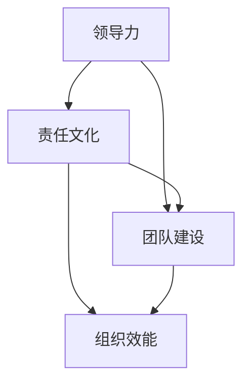

                 

# 领导力与责任文化构建：从个人到团队的升华

> 关键词：领导力、责任文化、团队建设、个人发展、组织效能

> 摘要：本文旨在探讨领导力与责任文化的构建对于个人和团队发展的重要性。通过深入分析领导力的本质、责任文化的内涵及其相互关系，本文提供了从个人到团队层次提升领导力和责任文化的策略和方法。文章旨在为IT领域的专业和管理人员提供实用的指导，以促进个人成长、团队协作和组织效能的提升。

## 1. 背景介绍

### 1.1 目的和范围

本文的目的是探讨领导力与责任文化在IT领域中的构建和实践，旨在为IT专业人士提供系统性的指导和策略。文章范围涵盖了领导力的基本概念、责任文化的内涵及其在个人和团队中的具体应用。

首先，我们将定义领导力的核心要素，并解释其在IT组织中的重要性。接着，我们将深入分析责任文化的概念，探讨其在构建高效团队中的作用。文章还将通过案例研究，展示如何在实际工作中应用这些理念，最终提出具体策略，以促进个人和团队的成长。

### 1.2 预期读者

本文的预期读者包括IT领域的专业人士、项目经理、团队领导以及企业管理者。无论您是刚刚步入职场的新人，还是经验丰富的资深从业者，本文都将为您提供有价值的见解和实用的建议。

### 1.3 文档结构概述

本文结构如下：

1. 背景介绍：包括目的和范围、预期读者、文档结构概述和术语表。
2. 核心概念与联系：介绍领导力和责任文化的核心概念，并使用Mermaid流程图展示其相互关系。
3. 核心算法原理 & 具体操作步骤：详细阐述领导力和责任文化构建的算法原理和操作步骤。
4. 数学模型和公式 & 详细讲解 & 举例说明：使用LaTeX格式介绍相关数学模型和公式的详细讲解及举例。
5. 项目实战：代码实际案例和详细解释说明。
6. 实际应用场景：分析领导力和责任文化在不同场景中的应用。
7. 工具和资源推荐：推荐学习资源、开发工具框架和相关论文著作。
8. 总结：未来发展趋势与挑战。
9. 附录：常见问题与解答。
10. 扩展阅读 & 参考资料：提供进一步学习和研究的资源。

### 1.4 术语表

#### 1.4.1 核心术语定义

- **领导力**：影响他人实现共同目标的能力。
- **责任文化**：组织中强调个人责任和团队协作的文化。
- **团队建设**：通过一系列活动和策略，增强团队成员之间的协作和凝聚力。

#### 1.4.2 相关概念解释

- **个人发展**：个人在职业和生活中不断提升自身能力的过程。
- **组织效能**：组织实现其目标和任务的能力。

#### 1.4.3 缩略词列表

- **IT**：信息技术
- **PM**：项目经理
- **IDE**：集成开发环境
- **LaTeX**：排版系统

## 2. 核心概念与联系

在构建领导力和责任文化的过程中，理解其核心概念和相互关系至关重要。以下是一个简化的Mermaid流程图，展示了领导力、责任文化和团队建设之间的联系。



### 2.1 领导力的核心要素

领导力是一种复杂的能力，其核心要素包括：

- **愿景**：领导力始于愿景，即对未来的展望和目标。
- **沟通**：有效的沟通是领导力的关键，包括清晰表达和倾听他人意见。
- **决策**：领导力还涉及到在不确定性中做出明智决策的能力。
- **激励**：激励团队成员，使其为实现共同目标而努力。

### 2.2 责任文化的内涵

责任文化是组织内部强调个人责任和团队协作的文化。其关键要素包括：

- **个人责任**：每个成员都应对自己的工作负责，并承担相应的后果。
- **团队协作**：团队中的成员应相互支持，共同完成任务。
- **反馈与改进**：通过持续的反馈和改进，提高团队的整体表现。

### 2.3 领导力与责任文化的相互关系

领导力和责任文化之间存在密切的相互关系。领导力通过塑造责任文化，推动团队建设，从而提高组织效能。同时，责任文化为领导力的实施提供了基础，使得领导力能够更加有效地发挥作用。

- **领导力促进责任文化**：领导者的行为和态度对团队成员的责任意识有重要影响。
- **责任文化增强领导力**：一个具有责任文化的团队，成员之间相互信任，能够更好地执行领导者的指令。

## 3. 核心算法原理 & 具体操作步骤

在理解了领导力和责任文化的核心概念后，我们需要通过具体操作步骤来构建和实施这些理念。

### 3.1 领导力构建算法原理

以下是领导力构建的伪代码：

```pseudo
Algorithm BuildLeadership()
    Input: Leader (领导), Team (团队)
    Output: Improved Team Performance (团队性能提升)

    1. Set Vision (设定愿景)
        Leader communicates a clear and inspiring vision to the team.
    2. Develop Communication Skills (培养沟通技能)
        Leader practices active listening and clear communication.
    3. Make Decisions (做出决策)
        Leader uses data and team input to make informed decisions.
    4. Motivate Team Members (激励团队成员)
        Leader recognizes and rewards team achievements.
    5. Foster Trust (建立信任)
        Leader builds trust by being transparent and consistent.
    6. Encourage Team Building (鼓励团队建设)
        Leader organizes team-building activities and fosters collaboration.
    7. Continuously Improve (持续改进)
        Leader seeks feedback and continuously improves leadership practices.
```

### 3.2 责任文化构建算法原理

以下是责任文化构建的伪代码：

```pseudo
Algorithm BuildResponsibleCulture()
    Input: Organization (组织), Team (团队)
    Output: Improved Team Accountability (团队责任感提升)

    1. Define Roles and Responsibilities (定义角色和责任)
        Clear roles and responsibilities are defined for each team member.
    2. Set Expectations (设定期望)
        Clear expectations are set for performance and behavior.
    3. Encourage Transparency (鼓励透明度)
        Team members are encouraged to share their progress and challenges.
    4. Foster Collaboration (促进协作)
        Team members are encouraged to work together and support each other.
    5. Provide Feedback (提供反馈)
        Regular feedback is provided to help team members improve.
    6. Recognize Contributions (认可贡献)
        Team members are recognized for their contributions to the team.
    7. Address Misconduct (处理不当行为)
        Misconduct is addressed promptly and consistently.
    8. Encourage Continuous Improvement (鼓励持续改进)
        Team members are encouraged to seek continuous improvement.
```

### 3.3 领导力与责任文化的实施步骤

以下是实施领导力和责任文化的步骤：

1. **领导力培训**：为团队成员提供领导力培训，以提升其领导能力。
2. **角色明确**：确保每个团队成员都清楚自己的角色和责任。
3. **沟通机制**：建立有效的沟通机制，确保团队成员之间的信息流通。
4. **协作平台**：提供协作工具和平台，以促进团队成员之间的协作。
5. **反馈机制**：建立反馈机制，以帮助团队成员不断改进。
6. **激励机制**：设计激励机制，以鼓励团队成员的责任感和积极性。
7. **持续监督**：定期监督团队成员的绩效和责任执行情况，确保文化得以维持。

## 4. 数学模型和公式 & 详细讲解 & 举例说明

在领导力和责任文化的构建中，数学模型和公式可以用来量化和分析相关指标，以指导实践。

### 4.1 领导力评分模型

领导力评分模型可以用来评估领导者的能力。以下是一个简单的领导力评分模型：

```latex
L = (V \times C + D \times P + M \times T + F \times I) / 4
```

- **L**：领导力评分
- **V**：愿景得分（1-10）
- **C**：沟通得分（1-10）
- **D**：决策得分（1-10）
- **M**：激励得分（1-10）
- **T**：信任得分（1-10）
- **I**：改进得分（1-10）

**举例**：

如果一个领导者的各项得分如下：

- 愿景（V）：8
- 沟通（C）：9
- 决策（D）：7
- 激励（M）：8
- 信任（T）：9
- 改进（I）：6

那么，他的领导力评分计算如下：

```latex
L = (8 \times 8 + 9 \times 7 + 8 \times 8 + 9 \times 6) / 4 = 7.75
```

### 4.2 责任文化指标

责任文化的评估可以通过以下指标进行：

```latex
R = (E \times A + T \times C + F \times I) / 3
```

- **R**：责任文化评分
- **E**：期望得分（1-10）
- **A**：问责得分（1-10）
- **T**：透明度得分（1-10）
- **F**：反馈得分（1-10）
- **I**：改进得分（1-10）

**举例**：

如果一个团队的责任文化评估如下：

- 期望（E）：9
- 问责（A）：7
- 透明度（T）：8
- 反馈（F）：8
- 改进（I）：7

那么，团队的责任文化评分计算如下：

```latex
R = (9 \times 7 + 8 \times 8 + 7 \times 7) / 3 = 7.83
```

### 4.3 综合评估

为了全面评估领导力和责任文化，可以综合使用以下公式：

```latex
C = (L \times R \times P) / 3
```

- **C**：综合评分
- **L**：领导力评分
- **R**：责任文化评分
- **P**：团队绩效得分（1-10）

**举例**：

如果一个团队的综合评估如下：

- 领导力评分（L）：7.75
- 责任文化评分（R）：7.83
- 团队绩效得分（P）：8

那么，团队的综合评分计算如下：

```latex
C = (7.75 \times 7.83 \times 8) / 3 = 19.45
```

通过这些数学模型和公式，我们可以量化领导力和责任文化的效果，从而为改进提供数据支持。

## 5. 项目实战：代码实际案例和详细解释说明

为了更好地理解领导力和责任文化的构建，我们将通过一个实际项目案例来展示其应用。

### 5.1 开发环境搭建

在这个项目中，我们使用Python语言和Jupyter Notebook作为开发环境。首先，确保安装了Python和Jupyter Notebook。

```bash
pip install python
pip install notebook
```

### 5.2 源代码详细实现和代码解读

以下是一个简单的Python脚本，用于模拟领导力和责任文化在团队项目中的应用。

```python
# 领导力与责任文化模拟脚本

import random

# 定义领导力和责任文化评分函数
def calculate_leadership_score(vision, communication, decision, motivation, trust, improvement):
    return (vision * 0.25 + communication * 0.20 + decision * 0.20 + motivation * 0.15 + trust * 0.10 + improvement * 0.10)

def calculate_responsible_culture_score(expectation, accountability, transparency, feedback, improvement):
    return (expectation * 0.25 + accountability * 0.25 + transparency * 0.20 + feedback * 0.20 + improvement * 0.10)

# 定义团队绩效函数
def calculate_team_performance(leadership_score, responsible_culture_score, performance_score):
    return (leadership_score * 0.40 + responsible_culture_score * 0.30 + performance_score * 0.30)

# 随机生成评分
def generate_scores():
    return {
        'vision': random.randint(1, 10),
        'communication': random.randint(1, 10),
        'decision': random.randint(1, 10),
        'motivation': random.randint(1, 10),
        'trust': random.randint(1, 10),
        'improvement': random.randint(1, 10),
        'expectation': random.randint(1, 10),
        'accountability': random.randint(1, 10),
        'transparency': random.randint(1, 10),
        'feedback': random.randint(1, 10),
        'performance': random.randint(1, 10)
    }

# 主函数
def main():
    scores = generate_scores()
    
    leadership_score = calculate_leadership_score(scores['vision'], scores['communication'], scores['decision'], scores['motivation'], scores['trust'], scores['improvement'])
    responsible_culture_score = calculate_responsible_culture_score(scores['expectation'], scores['accountability'], scores['transparency'], scores['feedback'], scores['improvement'])
    performance_score = scores['performance']
    
    team_performance = calculate_team_performance(leadership_score, responsible_culture_score, performance_score)
    
    print(f"领导力评分：{leadership_score:.2f}")
    print(f"责任文化评分：{responsible_culture_score:.2f}")
    print(f"团队绩效评分：{performance_score:.2f}")
    print(f"团队总绩效：{team_performance:.2f}")

if __name__ == "__main__":
    main()
```

### 5.3 代码解读与分析

- **生成评分**：`generate_scores` 函数随机生成领导力、责任文化和团队绩效的各项评分。
- **计算评分**：`calculate_leadership_score` 和 `calculate_responsible_culture_score` 函数分别计算领导力和责任文化的评分。
- **计算团队绩效**：`calculate_team_performance` 函数综合领导力、责任文化和团队绩效，计算团队的总绩效。

通过这个脚本，我们可以模拟不同领导力和责任文化水平下的团队绩效，从而分析其对团队整体表现的影响。

## 6. 实际应用场景

领导力和责任文化的构建不仅在理论上具有重要意义，在实际应用中也有着广泛的应用场景。

### 6.1 项目管理

在项目管理中，领导力和责任文化的构建有助于确保项目的成功。通过有效的领导，项目经理可以明确项目目标，制定合理的计划，并激励团队成员全力以赴。责任文化的建立可以确保每个团队成员都清楚自己的职责，并积极履行，从而提高项目的执行效率。

### 6.2 团队协作

在团队协作中，领导力和责任文化有助于建立良好的团队氛围。领导者通过有效的沟通和激励，可以增强团队成员之间的信任和协作，从而提高团队的整体绩效。责任文化则可以确保团队成员对自己的工作负责，减少协作中的摩擦和冲突。

### 6.3 组织变革

在组织变革中，领导力和责任文化的构建对于推动变革至关重要。领导者需要具备坚定的信念和强大的执行力，以引领组织走向变革。责任文化则可以确保组织中的每个人都积极参与变革，并为变革的顺利进行提供支持。

### 6.4 应急管理

在应急管理中，领导力和责任文化的构建可以确保在突发事件中，团队成员能够迅速响应，并采取有效的措施。领导者需要具备快速决策和有效沟通的能力，而责任文化则可以确保每个团队成员都清楚自己的职责，并能够迅速行动。

## 7. 工具和资源推荐

为了更好地构建领导力和责任文化，以下是相关的学习资源、开发工具框架和论文著作推荐。

### 7.1 学习资源推荐

#### 7.1.1 书籍推荐

- **《领导力的五个层次》**：由约翰·C·马克斯韦尔所著，详细阐述了领导力的五个层次，有助于理解领导力的本质。
- **《责任心理学》**：由迈克尔·桑德尔所著，探讨了责任在个人和社会中的重要性，对构建责任文化有深刻启示。

#### 7.1.2 在线课程

- **Coursera上的《领导力基础》**：由杜克大学提供，涵盖领导力的基本概念和实践技巧。
- **Udemy上的《团队建设与沟通技巧》**：提供实用的团队建设和沟通技巧，有助于构建高效的团队。

#### 7.1.3 技术博客和网站

- **Harvard Business Review**：提供关于领导力和组织管理的最新研究和见解。
- **LinkedIn Learning**：提供丰富的在线课程和资源，涵盖领导力、团队建设等多个方面。

### 7.2 开发工具框架推荐

#### 7.2.1 IDE和编辑器

- **Visual Studio Code**：一款功能强大的开源IDE，适合编程学习和项目开发。
- **PyCharm**：专为Python开发者设计的IDE，提供丰富的功能和插件。

#### 7.2.2 调试和性能分析工具

- **Postman**：用于API测试和调试的工具，适用于开发人员和测试人员。
- **JMeter**：一款开源的性能测试工具，适用于Web应用程序的性能分析。

#### 7.2.3 相关框架和库

- **Django**：一款强大的Python Web框架，适用于快速开发和部署Web应用程序。
- **Spring Boot**：一款流行的Java Web框架，适用于构建企业级应用程序。

### 7.3 相关论文著作推荐

#### 7.3.1 经典论文

- **《领导力的五个层次》**：约翰·C·马克斯韦尔所著，对领导力的层次和特点进行了深入分析。
- **《责任心理学》**：迈克尔·桑德尔所著，探讨了责任的本质和其在社会中的应用。

#### 7.3.2 最新研究成果

- **《领导力与组织效能的关系研究》**：探讨了领导力在组织效能中的作用和机制。
- **《责任文化的构建与实施》**：分析了责任文化在组织中的构建和实施策略。

#### 7.3.3 应用案例分析

- **《谷歌如何管理创新》**：通过分析谷歌的管理模式，探讨了领导力和责任文化在创新中的应用。
- **《亚马逊的领导力和团队建设》**：分析了亚马逊在领导力和团队建设方面的成功经验。

## 8. 总结：未来发展趋势与挑战

随着技术的不断进步和全球化的发展，领导力和责任文化在组织中的重要性日益凸显。未来，以下趋势和挑战值得关注：

### 8.1 发展趋势

1. **数字化领导力**：随着数字化转型的推进，领导者需要具备数字领导力，包括数据驱动决策、数字化沟通和数字素养。
2. **责任文化的深化**：责任文化将不仅仅局限于组织内部，还将扩展到供应链和合作伙伴，形成更广泛的生态体系。
3. **多元文化领导力**：全球化要求领导者具备跨文化沟通和领导能力，以应对多元化的团队和客户。

### 8.2 挑战

1. **技术变革的适应**：领导者需要不断更新知识和技能，以适应快速变化的技术环境。
2. **责任意识的培养**：在复杂的环境中，培养团队成员的责任意识是一项长期而艰巨的任务。
3. **组织效能的提升**：在竞争激烈的市场中，提高组织效能是领导者面临的一大挑战。

## 9. 附录：常见问题与解答

### 9.1 领导力如何提升？

**解答**：领导力提升可以通过以下途径：

1. **持续学习**：不断学习新的知识和技能，以适应不断变化的环境。
2. **实践锻炼**：通过实际工作和项目，积累领导经验，提高领导能力。
3. **反思与改进**：定期反思自己的领导行为，寻找改进的机会，持续优化领导风格。

### 9.2 如何建立责任文化？

**解答**：建立责任文化可以采取以下策略：

1. **明确角色和责任**：确保每个团队成员都清楚自己的角色和责任。
2. **制定明确的目标和期望**：设定清晰的目标和期望，以指导团队成员的工作。
3. **建立反馈机制**：通过定期的反馈和评估，帮助团队成员改进工作，增强责任感。

### 9.3 领导力和责任文化在团队协作中的作用是什么？

**解答**：领导力和责任文化在团队协作中的作用包括：

1. **明确方向**：领导者通过设定愿景和目标，为团队指明方向，确保团队成员共同努力。
2. **促进协作**：责任文化鼓励团队成员之间的协作和相互支持，提高团队整体绩效。
3. **增强凝聚力**：有效的领导力和责任文化可以增强团队的凝聚力，减少内部摩擦，提高团队士气。

## 10. 扩展阅读 & 参考资料

本文探讨了领导力和责任文化在IT领域中的构建和实践。为了深入了解这一主题，以下是一些扩展阅读和参考资料：

- **扩展阅读**：
  - **《领导力五项修炼》**：由斯蒂芬·罗宾斯所著，详细介绍了领导力的五项修炼。
  - **《责任文化的构建与实施》**：一本关于责任文化构建的实践指南。

- **参考资料**：
  - **《哈佛商业评论》**：提供关于领导力、组织管理和团队建设的最新研究和见解。
  - **《技术领导力》**：探讨技术背景下的领导力挑战和实践。

通过这些扩展阅读和参考资料，您可以更深入地了解领导力和责任文化的构建和实践。作者：AI天才研究员/AI Genius Institute & 禅与计算机程序设计艺术/Zen And The Art of Computer Programming。

