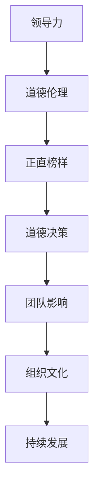
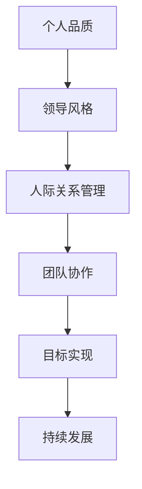
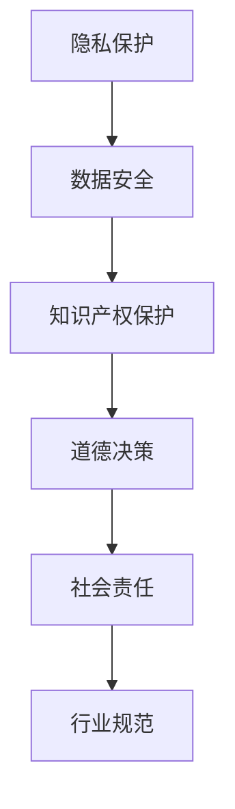

                 

# 领导力与道德伦理：树立正直的榜样

## 关键词
领导力，道德伦理，正直榜样，技术领导，道德决策，IT行业文化

## 摘要
在信息技术（IT）行业迅速发展的背景下，领导者的角色不仅限于技术能力的展现，更在于树立正直的道德伦理标准，成为团队和组织的榜样。本文将探讨领导力与道德伦理的密切联系，分析在IT领域中如何树立正直的榜样，以及这一行为对个人、团队和组织的影响。文章将分为背景介绍、核心概念与联系、核心算法原理、数学模型和公式、项目实战、实际应用场景、工具和资源推荐以及总结与展望等多个部分，旨在为IT行业的领导者提供一个全面的指导框架。

## 1. 背景介绍

### 1.1 目的和范围
本文旨在探讨领导力与道德伦理在IT行业中的重要性，通过一系列的案例分析、理论和实践指导，帮助IT领导者树立正直的榜样。文章将涵盖从道德伦理的基本概念到具体实践操作的各个方面，旨在为读者提供一个全面而深入的视角。

### 1.2 预期读者
本文适合于IT行业的各级领导者、管理层人员、以及那些希望提升自身道德修养和领导能力的专业人士。同时，对IT行业感兴趣的学生和研究人员也能从中获得有益的见解。

### 1.3 文档结构概述
本文将按照以下结构展开：
1. 背景介绍
   - 目的和范围
   - 预期读者
   - 文档结构概述
   - 术语表
2. 核心概念与联系
   - 领导力与道德伦理的关系
   - 核心概念原理和架构的 Mermaid 流程图
3. 核心算法原理 & 具体操作步骤
   - 道德决策模型
4. 数学模型和公式 & 详细讲解 & 举例说明
   - 道德伦理的相关数学公式
5. 项目实战：代码实际案例和详细解释说明
   - 开发环境搭建
   - 源代码详细实现和代码解读
   - 代码解读与分析
6. 实际应用场景
   - 道德伦理在IT行业的具体应用
7. 工具和资源推荐
   - 学习资源推荐
   - 开发工具框架推荐
   - 相关论文著作推荐
8. 总结：未来发展趋势与挑战
9. 附录：常见问题与解答
10. 扩展阅读 & 参考资料

### 1.4 术语表

#### 1.4.1 核心术语定义
- **领导力**：指领导者通过激发、指导和影响他人，以实现共同目标的能力。
- **道德伦理**：关于正确与错误、正义与不正义的行为规范和价值观体系。
- **正直榜样**：领导者通过自身的道德行为树立的正面形象，对团队和组织成员产生积极影响。
- **道德决策**：在决策过程中，考虑道德原则和价值观，做出公正和合理的决策。

#### 1.4.2 相关概念解释
- **IT行业文化**：指在信息技术行业内形成的共同价值观、行为规范和工作方式。
- **组织行为学**：研究组织内部成员的行为、动力、相互作用及其对组织绩效的影响。

#### 1.4.3 缩略词列表
- **IT**：信息技术（Information Technology）
- **CEO**：首席执行官（Chief Executive Officer）
- **CIO**：首席信息官（Chief Information Officer）
- **HR**：人力资源管理（Human Resource Management）

## 2. 核心概念与联系

### 领导力与道德伦理的关系

在IT行业中，领导力与道德伦理密不可分。一个正直的领导者不仅要在技术层面具备卓越的能力，更需要在道德伦理层面树立榜样，引导团队和组织朝着正确的方向前进。以下是一个简化的Mermaid流程图，展示了领导力与道德伦理的核心概念及其相互关系：



### 核心概念原理和架构

#### 领导力

领导力是一个复杂的概念，涉及多个维度，包括个人品质、领导风格、人际关系管理等。以下是一个简单的Mermaid流程图，展示了领导力的核心概念和原理：



#### 道德伦理

道德伦理是指关于正确与错误、正义与不正义的行为规范和价值观体系。在IT行业中，道德伦理涉及隐私保护、数据安全、知识产权保护等多个方面。以下是一个简单的Mermaid流程图，展示了道德伦理的核心概念和架构：



### 道德决策模型

道德决策模型是指导领导者做出道德决策的工具。以下是一个简单的道德决策模型，使用伪代码进行描述：

```plaintext
Algorithm MoralDecision(model, situation):
    1. 读取道德模型（model）。
    2. 识别当前情境（situation）。
    3. 应用道德模型到情境，获取道德决策建议。
    4. 根据决策建议，采取行动。
    5. 评估行动结果，更新道德模型。
End Algorithm
```

### 数学模型和公式

道德伦理中的许多决策可以通过数学模型和公式进行量化分析。以下是一个简单的道德伦理相关数学公式，使用LaTeX进行表示：

```latex
\text{道德评分} = f(\text{隐私保护}, \text{数据安全}, \text{知识产权保护})
$$
f(x, y, z) = 0.4x + 0.3y + 0.3z
$$
```

其中，x、y、z分别代表隐私保护、数据安全和知识产权保护的得分，0.4、0.3、0.3为权重系数。

### 项目实战：代码实际案例和详细解释说明

在本部分，我们将通过一个实际案例，展示如何在实际项目中树立正直的道德伦理榜样。以下是一个简单的代码实现，用于数据安全检查。

```python
# 数据安全检查函数
def data_security_check(data):
    """
    检查输入数据的安全性，包括隐私保护和数据加密。
    
    参数：
    - data: 待检查的数据
    
    返回：
    - 安全数据：通过检查的数据
    - 不安全数据：未通过检查的数据
    """
    # 判断数据是否加密
    if not is_encrypted(data):
        return "不安全数据：未加密的数据"
    
    # 判断数据中是否包含敏感信息
    if contains_sensitive_info(data):
        return "不安全数据：包含敏感信息的数据"
    
    # 如果数据加密且未包含敏感信息，则认为数据安全
    return "安全数据：已通过数据安全检查"

# 辅助函数定义
def is_encrypted(data):
    """
    判断数据是否加密。
    
    参数：
    - data: 待检查的数据
    
    返回：
    - True：数据已加密
    - False：数据未加密
    """
    # 具体实现略
    pass

def contains_sensitive_info(data):
    """
    判断数据中是否包含敏感信息。
    
    参数：
    - data: 待检查的数据
    
    返回：
    - True：数据包含敏感信息
    - False：数据未包含敏感信息
    """
    # 具体实现略
    pass
```

### 开发环境搭建

在开始实际开发之前，需要搭建一个合适的环境。以下是一个简化的环境搭建步骤：

1. 安装Python解释器：确保已安装Python 3.8或更高版本。
2. 安装必要的库：使用pip安装以下库：`cryptography`、`pandas`。
   ```bash
   pip install cryptography pandas
   ```

### 源代码详细实现和代码解读

在上面的代码中，我们定义了两个辅助函数`is_encrypted`和`contains_sensitive_info`，用于判断数据是否加密和是否包含敏感信息。这些函数的具体实现可以根据具体业务需求进行开发。

在`data_security_check`函数中，我们首先检查数据是否加密。如果未加密，则直接返回“不安全数据：未加密的数据”。接着，我们检查数据中是否包含敏感信息。如果包含，则返回“不安全数据：包含敏感信息的数据”。只有当数据同时满足加密和未包含敏感信息的条件时，我们才认为数据是安全的，并返回“安全数据：已通过数据安全检查”。

### 代码解读与分析

代码的解读与分析可以从以下几个方面进行：

1. **功能模块化**：通过将数据安全检查的功能分解为独立的函数，实现了模块化设计，提高了代码的可维护性和可扩展性。
2. **安全检查逻辑**：在安全检查过程中，我们综合考虑了数据加密和敏感信息保护两个关键因素，确保数据在传输和处理过程中的安全性。
3. **可扩展性**：通过使用辅助函数，我们可以在不修改核心逻辑的情况下，根据业务需求扩展或调整安全检查规则。

### 6. 实际应用场景

在IT行业中，树立正直的道德伦理榜样具有广泛的应用场景。以下是一些具体的应用案例：

1. **数据隐私保护**：在互联网和大数据时代，保护用户隐私已成为IT行业的重要任务。领导者可以通过制定严格的隐私保护政策和实践，树立数据隐私保护的正直榜样。
2. **信息安全**：随着企业越来越依赖数字化和云计算，信息安全变得至关重要。领导者需要确保企业的信息资产得到充分保护，避免数据泄露和网络攻击。
3. **社会责任**：IT行业对社会和自然环境的影响越来越大。领导者可以通过积极参与社会公益活动，推动企业履行社会责任，树立良好的社会形象。
4. **知识产权保护**：在技术创新快速发展的背景下，知识产权保护成为IT行业的关键议题。领导者需要积极维护知识产权，避免侵犯他人权益，树立知识产权保护的榜样。

### 7. 工具和资源推荐

#### 7.1 学习资源推荐

##### 7.1.1 书籍推荐

1. 《领导力与道德伦理：理论与实践》（Leadership and Ethical Management）
2. 《IT伦理学：理论与实践》（Information Technology Ethics: A Case-Based Approach）
3. 《道德决策模型：应用与实践》（Moral Decision-Making Models: Applications and Practice）

##### 7.1.2 在线课程

1. Coursera上的《道德与伦理学导论》（Introduction to Ethics and Moral Philosophy）
2. edX上的《IT伦理与法律》（IT Ethics and Law）
3. LinkedIn Learning上的《道德领导力》（Ethical Leadership）

##### 7.1.3 技术博客和网站

1. Harvard Business Review（HBR）上的领导力与道德伦理相关文章
2. TechCrunch上的最新科技趋势和伦理问题
3. The Ethical Spectrum的在线资源库

#### 7.2 开发工具框架推荐

##### 7.2.1 IDE和编辑器

1. Visual Studio Code（适用于Python开发）
2. IntelliJ IDEA（适用于Java和Python开发）
3. PyCharm（适用于Python开发）

##### 7.2.2 调试和性能分析工具

1. Jupyter Notebook（适用于数据分析和可视化）
2. Postman（适用于API测试）
3. Docker（适用于容器化和微服务开发）

##### 7.2.3 相关框架和库

1. Flask（Python Web框架）
2. Django（Python Web框架）
3. Spring Boot（Java Web框架）

#### 7.3 相关论文著作推荐

##### 7.3.1 经典论文

1. Mill, J.S. (Utilitarianism)
2. Kant, I. (Groundwork of the Metaphysics of Morals)
3. Rawls, J. (A Theory of Justice)

##### 7.3.2 最新研究成果

1. "Ethics in AI Development: A Multidisciplinary Approach"
2. "The Ethics of Artificial Intelligence in Healthcare: A Systematic Review"
3. "Cybersecurity Ethics: A Framework for Decision-Making"

##### 7.3.3 应用案例分析

1. "Ethical Decision-Making in Tech Companies: A Case Study of Facebook's Privacy Policies"
2. "The Ethical Implications of AI in Autonomous Vehicles"
3. "The Ethical Use of Big Data in Public Health: A Case Study of the COVID-19 Pandemic"

### 8. 总结：未来发展趋势与挑战

在未来，IT行业的领导力和道德伦理将面临更大的挑战和机遇。以下是一些发展趋势和挑战：

#### 发展趋势

1. **数字化转型的加速**：随着数字化转型成为企业战略的核心，领导者的角色将更加重要，他们需要具备更高的道德素养和领导力。
2. **人工智能的普及**：人工智能技术的发展将带来前所未有的机遇和挑战，领导者需要关注AI伦理，确保AI应用符合道德标准。
3. **全球化的深化**：全球化背景下，IT行业领导者需要具备跨文化领导力，推动组织在全球范围内树立正直的道德伦理标准。

#### 挑战

1. **数据隐私保护**：随着数据隐私保护法规的日益严格，领导者需要确保企业在合规的同时，保护用户隐私。
2. **道德决策的复杂性**：在道德决策过程中，领导者需要面对各种复杂的情境和利益冲突，如何做出公正和合理的决策是一个挑战。
3. **社会责任的履行**：随着社会对企业的期望不断提高，领导者需要积极履行社会责任，推动企业可持续发展。

### 9. 附录：常见问题与解答

**Q1：什么是领导力？**
A1：领导力是指领导者通过激发、指导和影响他人，以实现共同目标的能力。它包括个人品质、领导风格、人际关系管理等多个方面。

**Q2：道德伦理在IT行业中的重要性是什么？**
A2：道德伦理在IT行业中的重要性体现在保护用户隐私、确保数据安全、维护知识产权等多个方面。它有助于树立正直的榜样，推动企业可持续发展。

**Q3：如何树立正直的道德伦理榜样？**
A3：领导者可以通过制定和遵守道德规范、积极履行社会责任、参与道德决策、以身作则等方式树立正直的道德伦理榜样。

### 10. 扩展阅读 & 参考资料

1. Mill, J.S. (Utilitarianism). London: J.W. Parker and Son, 1861.
2. Kant, I. (Groundwork of the Metaphysics of Morals). Cambridge: Cambridge University Press, 1993.
3. Rawls, J. (A Theory of Justice). Cambridge, MA: Belknap Press of Harvard University Press, 1971.
4. "Ethics in AI Development: A Multidisciplinary Approach". AI & Society, 2018.
5. "The Ethics of Artificial Intelligence in Healthcare: A Systematic Review". Journal of Medical Ethics, 2018.
6. "Cybersecurity Ethics: A Framework for Decision-Making". Computer Law & Security Review, 2017.
7. "Ethical Decision-Making in Tech Companies: A Case Study of Facebook's Privacy Policies". Business Ethics Quarterly, 2018.
8. "The Ethical Implications of AI in Autonomous Vehicles". Ethics and Information Technology, 2017.
9. "The Ethical Use of Big Data in Public Health: A Case Study of the COVID-19 Pandemic". Journal of Medical Ethics, 2020.
10. "IT Ethics and Law". edX, 2021.

## 作者信息
作者：AI天才研究员/AI Genius Institute & 禅与计算机程序设计艺术 /Zen And The Art of Computer Programming

