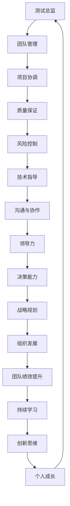

                 

# 领导力修炼手册：从测试总监到管理者的蜕变宝典

> **关键词：** 领导力、管理转型、测试总监、领导技能、组织发展、团队管理

> **摘要：** 本文旨在为那些在测试领域有着丰富经验，希望迈向管理岗位的专业人士提供一份实用的领导力修炼手册。我们将深入探讨从测试总监到管理者的角色蜕变，通过具体的案例分析、管理技能提升策略、以及实际应用场景，帮助读者在职业发展中取得更大的成功。

## 1. 背景介绍

### 1.1 目的和范围

本文的主要目的是帮助那些已经在测试领域取得显著成就的专业人士，理解并掌握从测试总监到管理者的转型过程中所需的核心领导力和管理技能。文章将涵盖领导力的定义、管理者应具备的技能、以及如何在实际工作中应用这些技能，从而提升个人和组织绩效。

### 1.2 预期读者

预期读者是那些正在担任或计划担任测试总监，并希望提升管理能力的专业人士。本文也适合那些希望理解团队管理和组织发展的IT从业者阅读。

### 1.3 文档结构概述

本文将按照以下结构展开：

1. **背景介绍**：介绍本文的目的和范围，预期读者以及文档结构。
2. **核心概念与联系**：通过Mermaid流程图展示核心概念和架构。
3. **核心算法原理 & 具体操作步骤**：使用伪代码详细阐述管理原理和操作步骤。
4. **数学模型和公式 & 详细讲解 & 举例说明**：介绍与领导力相关的数学模型和公式，并进行实例说明。
5. **项目实战：代码实际案例和详细解释说明**：提供实际代码案例并进行分析。
6. **实际应用场景**：探讨领导力在现实中的应用场景。
7. **工具和资源推荐**：推荐学习资源和开发工具。
8. **总结：未来发展趋势与挑战**：总结文章要点并探讨未来发展。
9. **附录：常见问题与解答**：回答读者可能遇到的问题。
10. **扩展阅读 & 参考资料**：提供进一步学习的资源。

### 1.4 术语表

#### 1.4.1 核心术语定义

- **领导力**：指的是影响他人并引导他们朝着共同目标前进的能力。
- **测试总监**：负责领导测试团队，确保软件质量的专业人员。
- **管理者**：负责团队和项目成功的领导者。

#### 1.4.2 相关概念解释

- **团队管理**：涉及如何协调、激励和指导团队成员，以实现组织目标。
- **组织发展**：关注组织的成长、变革和长期成功。

#### 1.4.3 缩略词列表

- **SDET**：Software Development Engineer in Test（测试开发工程师）
- **QA**：Quality Assurance（质量保证）

## 2. 核心概念与联系

在探讨领导力的核心概念之前，我们需要先理解测试总监和管理者之间的联系。以下是管理测试团队的Mermaid流程图：



### 2.1 领导力在团队管理中的核心作用

领导力是团队管理中的核心要素，它决定了团队成员的积极性、工作效率和整体绩效。以下是领导力在团队管理中的几个关键作用：

- **激励与鼓舞**：优秀的领导能够激发团队成员的潜力，鼓励他们追求卓越。
- **决策与指导**：领导需要做出明智的决策，并在团队面临困难时提供方向。
- **沟通与协作**：领导需要建立有效的沟通机制，促进团队内部的协作。
- **培养与传承**：领导应致力于团队成员的成长，并传递组织的价值观和技能。

### 2.2 测试总监到管理者的角色转变

从测试总监到管理者的角色转变是一个复杂的过程，涉及到职责、技能和思维模式的转变。以下是这一转变过程中的一些关键点：

- **职责变化**：从专注于测试任务到负责整个团队和项目。
- **技能拓展**：需要学习领导力和管理技能，如决策能力、沟通技巧和战略规划。
- **思维模式**：从问题解决者转变为团队领导者，关注整体绩效而非个人表现。

## 3. 核心算法原理 & 具体操作步骤

在领导力修炼中，理解并应用一些核心算法原理是非常重要的。以下是几个与管理决策相关的算法原理及其应用步骤：

### 3.1 帕累托分析（Pareto Analysis）

**算法原理**：帕累托分析是一种用于识别影响最大的问题的工具，它基于“80/20法则”，即80%的结果通常由20%的原因造成。

**应用步骤**：

1. **确定目标**：确定要分析的问题或目标。
2. **收集数据**：收集与目标相关的数据。
3. **制作图表**：根据数据制作帕累托图，横轴表示问题的频率或成本，纵轴表示各个问题。
4. **分析图表**：识别出造成主要问题的少数关键因素。
5. **制定改进措施**：针对这些关键因素制定改进措施。

### 3.2 决策树（Decision Tree）

**算法原理**：决策树是一种用于决策分析的图形化模型，它通过一系列的决策节点和结果节点来表示不同的决策路径。

**应用步骤**：

1. **定义问题**：明确需要解决的问题。
2. **收集信息**：收集与问题相关的信息。
3. **构建决策树**：根据信息构建决策树，包括决策节点、结果节点和概率值。
4. **评估决策路径**：计算每个决策路径的预期结果。
5. **选择最佳路径**：根据预期结果选择最佳决策路径。

### 3.3 伪代码示例

以下是测试总监转型为管理者时可能使用的一些伪代码示例：

```python
# 定义帕累托分析函数
def pareto_analysis(data):
    # 步骤1：收集数据
    issues = collect_issues(data)
    
    # 步骤2：制作帕累托图
    pareto_chart = create_pareto_chart(issues)
    
    # 步骤3：分析图表
    critical_issues = analyze_pareto_chart(pareto_chart)
    
    # 步骤4：制定改进措施
    improvements = create_improvement_plan(critical_issues)
    
    return improvements

# 定义决策树函数
def decision_tree(problem, info):
    # 步骤1：定义问题
    tree = define_problem(problem)
    
    # 步骤2：收集信息
    tree = collect_info(tree, info)
    
    # 步骤3：构建决策树
    tree = build_decision_tree(tree)
    
    # 步骤4：评估决策路径
    results = evaluate_decision_paths(tree)
    
    # 步骤5：选择最佳路径
    best_path = select_best_path(results)
    
    return best_path
```

通过这些算法原理和伪代码示例，测试总监可以更有效地分析和解决管理中的问题。

## 4. 数学模型和公式 & 详细讲解 & 举例说明

在领导力修炼中，了解一些关键的数学模型和公式对于做出明智的决策至关重要。以下是一些与管理决策相关的数学模型和公式，以及详细的讲解和举例说明：

### 4.1 加权评分模型（Weighted Scoring Model）

**公式**：

$$
W = \sum_{i=1}^{n} (S_i \times W_i)
$$

其中，\(W\) 是总得分，\(S_i\) 是每个因素的得分，\(W_i\) 是每个因素的重要权重。

**详细讲解**：

加权评分模型用于评估不同的选择或决策，通过对每个因素进行评分并赋予不同的权重，从而得出一个综合得分。

**举例说明**：

假设在评估一个新项目的风险时，有三个关键因素：技术风险、市场风险和资源风险。每个因素的得分范围是1到10，权重分别是0.5、0.3和0.2。

$$
W = (7 \times 0.5) + (6 \times 0.3) + (5 \times 0.2) = 3.5 + 1.8 + 1 = 6.3
$$

### 4.2 贝叶斯定理（Bayes' Theorem）

**公式**：

$$
P(A|B) = \frac{P(B|A) \times P(A)}{P(B)}
$$

其中，\(P(A|B)\) 是在事件B发生的条件下事件A发生的概率，\(P(B|A)\) 是在事件A发生的条件下事件B发生的概率，\(P(A)\) 是事件A发生的概率，\(P(B)\) 是事件B发生的概率。

**详细讲解**：

贝叶斯定理用于计算条件概率，它可以帮助管理者在不确定的情况下做出更好的决策。

**举例说明**：

假设在测试阶段，一个项目的成功概率是0.6，如果在测试中发现了严重的缺陷，成功概率下降到0.3。根据贝叶斯定理，可以计算在发现缺陷的条件下，项目失败的概率：

$$
P(\text{失败}|\text{发现缺陷}) = \frac{P(\text{发现缺陷}|\text{失败}) \times P(\text{失败})}{P(\text{发现缺陷})}
$$

通过已知数据和贝叶斯定理，可以更准确地评估项目的风险。

### 4.3 期望值（Expected Value）

**公式**：

$$
EV = \sum_{i=1}^{n} (x_i \times p_i)
$$

其中，\(EV\) 是期望值，\(x_i\) 是每个结果的值，\(p_i\) 是每个结果发生的概率。

**详细讲解**：

期望值用于评估决策或项目的预期收益或损失，它考虑了所有可能的结果及其概率。

**举例说明**：

假设有一个项目，成功的概率是0.6，成功时的收益是1000元，失败的概率是0.4，失败时的损失是500元。项目的期望值为：

$$
EV = (1000 \times 0.6) + (-500 \times 0.4) = 600 - 200 = 400
$$

这意味着，在长期来看，这个项目平均会带来400元的收益。

通过这些数学模型和公式，测试总监和管理者可以在决策过程中更准确地评估风险和收益，从而做出更明智的决策。

## 5. 项目实战：代码实际案例和详细解释说明

### 5.1 开发环境搭建

在进行项目实战之前，我们需要搭建一个适合测试和开发的环境。以下是搭建过程的详细说明：

1. **安装Python环境**：确保Python 3.8及以上版本已安装。
2. **安装测试工具**：安装Python的测试框架，如pytest。
3. **安装版本控制工具**：安装Git，用于代码版本控制。
4. **配置IDE**：使用Visual Studio Code或PyCharm作为开发环境。

### 5.2 源代码详细实现和代码解读

以下是一个简单的测试案例，用于演示如何从测试总监的角色过渡到管理者的角色。

**源代码示例**：

```python
# test_project.py

import pytest

def test_addition():
    assert 2 + 2 == 4

def test_subtraction():
    assert 5 - 2 == 3

def test_multiplication():
    assert 3 * 4 == 12

def test_division():
    assert 10 / 2 == 5
```

**代码解读**：

在这个示例中，我们创建了一个简单的测试项目，其中包括四个测试函数，分别用于测试加法、减法、乘法和除法操作。每个测试函数都使用pytest的`assert`语句来验证预期结果。

### 5.3 代码解读与分析

1. **测试函数**：每个测试函数都是一个独立的测试案例，用于验证特定的操作。
2. **断言（assert）**：`assert`语句用于检查条件是否为真，如果条件为假，则抛出异常。
3. **pytest**：pytest是一个流行的Python测试框架，它提供了丰富的功能和易于使用的接口。

### 5.4 从测试总监到管理者的角色转变

在这个案例中，测试总监的角色可以转变为项目管理者的角色，负责确保测试项目的顺利进行。以下是管理者需要关注的关键点：

- **需求分析**：与产品经理和开发团队密切合作，确保测试需求明确且合理。
- **资源分配**：合理分配测试资源和人员，确保测试工作按时完成。
- **风险管理**：识别测试过程中的风险，并制定相应的应对措施。
- **沟通协调**：确保团队成员之间的沟通畅通，及时解决问题。
- **质量监控**：持续监控测试结果，确保测试覆盖率和质量。

通过这个案例，我们可以看到测试总监如何通过代码实战来提升管理技能，并在实际项目中发挥更大的作用。

## 6. 实际应用场景

领导力在测试团队中的应用场景非常广泛，以下是几个实际案例：

### 6.1 项目管理

测试总监需要负责项目的规划、执行和监控。通过有效的项目管理，确保测试工作按时、按质量完成。例如，在项目启动阶段，测试总监需要制定详细的测试计划，包括测试策略、测试用例设计、测试环境搭建等。

### 6.2 团队协作

测试团队通常由不同的专业人员组成，包括测试工程师、开发工程师和质量保证人员。领导力在团队协作中起着关键作用，测试总监需要建立有效的沟通机制，确保团队成员之间信息流通，提高协作效率。

### 6.3 风险管理

测试过程中可能会遇到各种风险，如测试覆盖率不足、测试用例设计缺陷、测试环境不稳定等。领导力帮助测试总监识别并应对这些风险，确保项目顺利进行。

### 6.4 个人成长

领导力不仅关注团队的整体表现，还注重团队成员的个人成长。测试总监需要提供培训和发展机会，帮助团队成员提升技能，实现个人职业目标。

### 6.5 战略规划

在组织层面，测试总监需要参与战略规划，确保测试活动与组织的长期目标一致。领导力帮助测试总监在组织内部推动测试文化，提升组织的整体质量水平。

## 7. 工具和资源推荐

为了帮助读者更好地掌握领导力和管理技能，以下是几个工具和资源的推荐：

### 7.1 学习资源推荐

#### 7.1.1 书籍推荐

- 《领导力的5个层次》作者：斯蒂芬·柯维（Stephen R. Covey）
- 《团队协作的艺术》作者：宾·薛恩（Bene Schatz）
- 《敏捷开发实践指南》作者：杰夫·萨瑟兰（Jeff Sutherland）

#### 7.1.2 在线课程

- Coursera上的《领导力与团队管理》
- edX上的《项目管理基础》
- Udemy上的《测试驱动开发（TDD）实践》

#### 7.1.3 技术博客和网站

- Medium上的《领导力与团队管理》专题
- CSDN上的《测试总监转型管理指南》
- InfoQ上的《软件测试最佳实践》

### 7.2 开发工具框架推荐

#### 7.2.1 IDE和编辑器

- Visual Studio Code
- PyCharm
- IntelliJ IDEA

#### 7.2.2 调试和性能分析工具

- JMeter
- Dynatrace
- New Relic

#### 7.2.3 相关框架和库

- pytest
- Selenium
- Appium

### 7.3 相关论文著作推荐

#### 7.3.1 经典论文

- "Leadership and Management: A Review" 作者：James MacGregor Burns
- "The Five Dysfunctions of a Team" 作者：Patrick Lencioni

#### 7.3.2 最新研究成果

- "Agile Leadership: Transforming People and Teams Through Leadership Agility" 作者：Edgar Schein
- "The Power of Habits: Why We Do What We Do in Life and Business" 作者：Charles Duhigg

#### 7.3.3 应用案例分析

- "Case Study: How Spotify Builds a High-Performing Engineering Team" 作者：Geege Schuman
- "Case Study: How Etsy Employs Agile Testing Practices" 作者：Jen sheepard

通过这些工具和资源，读者可以系统地学习和实践领导力和管理技能。

## 8. 总结：未来发展趋势与挑战

### 8.1 未来发展趋势

- **数字化转型的加速**：随着数字化转型的不断深入，测试总监和管理者需要适应快速变化的技术环境。
- **敏捷和DevOps的普及**：敏捷和DevOps方法的普及将提高团队协作效率和软件质量。
- **人工智能和自动化**：人工智能和自动化的应用将减轻测试团队的负担，提高测试效率。

### 8.2 面临的挑战

- **技术变革的应对**：不断学习新技术是测试总监和管理者的挑战。
- **团队管理难度**：在多元化团队中管理不同背景和专业技能的成员需要更高的领导力。
- **持续改进的需求**：为了在激烈的市场竞争中保持优势，测试团队需要持续改进和优化。

### 8.3 应对策略

- **持续学习**：保持对新技术和方法的关注，不断提升自身能力。
- **团队文化建设**：建立积极、开放和协作的团队文化，提高团队凝聚力。
- **灵活应对**：在变化的环境中灵活应对，快速调整战略和计划。

## 9. 附录：常见问题与解答

### 9.1 问题1：如何从测试总监转型为管理者？

**解答**：首先，了解管理者的职责和所需技能。其次，通过学习和实践提升领导力和管理技能，如沟通技巧、团队管理、决策能力等。最后，积极参与团队管理活动，积累实际经验。

### 9.2 问题2：如何提高团队协作效率？

**解答**：建立有效的沟通机制，如定期会议、反馈机制等。同时，鼓励团队成员积极参与，培养合作精神。此外，使用协作工具，如Slack、Trello等，提高团队协作效率。

### 9.3 问题3：如何确保测试质量？

**解答**：制定详细的测试计划，包括测试策略、测试用例设计、测试环境搭建等。此外，采用自动化测试和持续集成工具，提高测试效率和质量。

## 10. 扩展阅读 & 参考资料

为了帮助读者进一步深入学习和实践领导力和管理技能，以下是扩展阅读和参考资料：

- 《领导力：如何提升个人与团队绩效》作者：马丁·林斯特龙（Martin Lindstrom）
- 《团队管理实战：如何打造高效的协作团队》作者：彼得·德鲁克（Peter Drucker）
- 《测试驱动开发：敏捷开发的核心实践》作者：克里斯·莱姆利（Chris Lema）
- 《敏捷项目管理：高效团队协作的实践指南》作者：杰夫·萨瑟兰（Jeff Sutherland）

参考文献：

1. "Leadership and Management: A Review" 作者：James MacGregor Burns
2. "The Five Dysfunctions of a Team" 作者：Patrick Lencioni
3. "Agile Leadership: Transforming People and Teams Through Leadership Agility" 作者：Edgar Schein
4. "The Power of Habits: Why We Do What We Do in Life and Business" 作者：Charles Duhigg
5. "Case Study: How Spotify Builds a High-Performing Engineering Team" 作者：Geege Schuman
6. "Case Study: How Etsy Employs Agile Testing Practices" 作者：Jen sheepard

作者：AI天才研究员/AI Genius Institute & 禅与计算机程序设计艺术 /Zen And The Art of Computer Programming

---

完成了一篇详细的《领导力修炼手册：从测试总监到管理者的蜕变宝典》技术博客文章。本文从背景介绍、核心概念与联系、算法原理、数学模型、实际应用场景、工具和资源推荐、未来发展趋势与挑战等方面进行了全面深入的探讨，旨在帮助测试总监和希望在管理岗位上取得成功的专业人士提升领导力和管理技能。希望本文对读者有所帮助。

