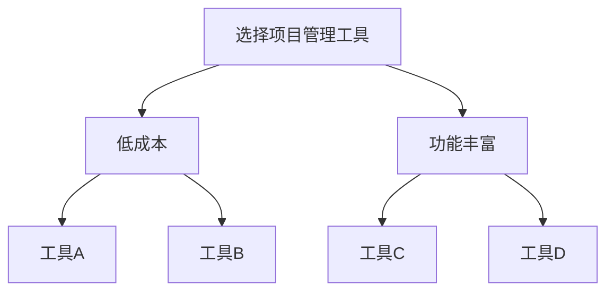
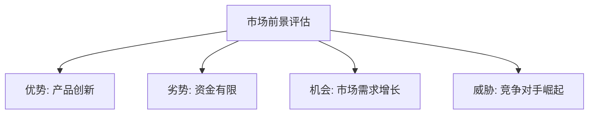
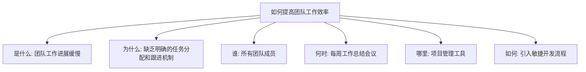
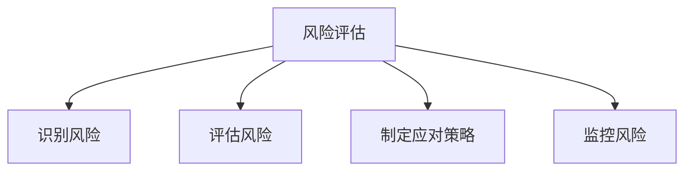

                 

# 领导力修炼手册：从测试经理到管理者的华丽转身

> **关键词：** 领导力、管理技能、测试经理、职业发展、个人成长、团队协作。

> **摘要：** 本文旨在为测试经理提供一套系统的领导力修炼指南，帮助他们在职业生涯中成功转型为管理者。通过分析领导力的核心要素、具体实践方法以及相关理论和案例，文章旨在为读者提供实际可行的建议，助力其在新的管理岗位上取得卓越成绩。

## 1. 背景介绍

### 1.1 目的和范围

本文的目标是为那些希望在职业生涯中从测试经理转型为管理者的专业人士提供一个全面的领导力修炼手册。文章将深入探讨领导力的各个方面，包括但其不仅限于：管理技能的培养、个人成长、团队协作、以及如何在复杂多变的环境中做出明智的决策。

### 1.2 预期读者

本文主要面向以下读者群体：

1. 当前担任测试经理的IT专业人士。
2. 希望晋升为管理岗位的测试工程师。
3. 对领导力和管理技能感兴趣的技术人员。
4. 想要提高自身领导能力的管理者。

### 1.3 文档结构概述

本文将按照以下结构进行组织：

1. 背景介绍
2. 核心概念与联系
3. 核心算法原理 & 具体操作步骤
4. 数学模型和公式 & 详细讲解 & 举例说明
5. 项目实战：代码实际案例和详细解释说明
6. 实际应用场景
7. 工具和资源推荐
8. 总结：未来发展趋势与挑战
9. 附录：常见问题与解答
10. 扩展阅读 & 参考资料

### 1.4 术语表

#### 1.4.1 核心术语定义

- 领导力（Leadership）：影响和激励他人实现共同目标的能力。
- 管理技能（Management Skills）：组织、计划、协调和监督工作以确保目标达成的能力。
- 测试经理（Test Manager）：负责规划、管理和执行测试活动的专业角色。
- 个人成长（Personal Growth）：通过学习和发展技能来提升个人能力和潜力。

#### 1.4.2 相关概念解释

- 团队协作（Team Collaboration）：团队成员共同合作，相互支持，共同实现团队目标。
- 决策制定（Decision Making）：在不确定性和复杂性中做出选择的过程。

#### 1.4.3 缩略词列表

- IT（Information Technology）：信息技术。
- PM（Project Manager）：项目经理。

## 2. 核心概念与联系

领导力是一个多维度、复杂的概念，它不仅仅关乎个人魅力，还包括一系列可学习的技能和态度。以下是领导力的核心概念及其相互联系：

### 2.1 领导力的核心要素

1. **愿景（Vision）**：领导者需要具备明确的目标和愿景，能够激发团队成员的热情和动力。
2. **沟通（Communication）**：良好的沟通是领导者必须具备的基本技能，包括倾听、表达和传递信息。
3. **影响力（Influence）**：领导者需要通过言行和决策来影响他人，促使团队朝着共同目标努力。
4. **激励（Motivation）**：领导者要能够激发团队成员的积极性，帮助他们克服困难，保持工作效率。

### 2.2 领导力与个人成长的关系

个人成长是领导力发展的重要组成部分。一个不断学习和进步的领导者能够更好地适应变化，提高自身的影响力和决策能力。以下是领导力与个人成长之间的一些关键联系：

1. **自我认知（Self-awareness）**：领导者需要了解自己的优势和劣势，以便更好地利用自己的优势，改进不足。
2. **反思能力（Reflection）**：通过反思过去的经验，领导者可以不断优化自己的领导风格和管理方法。
3. **适应性（Adaptability）**：领导者需要具备快速适应新环境和变化的能力，以应对不断变化的市场和技术。
4. **持续学习（Continuous Learning）**：领导力是一个不断发展的过程，领导者需要持续学习，掌握新的知识和技能。

### 2.3 领导力与团队协作的关系

团队协作是领导者必须面对的一个重要挑战。一个成功的领导者能够建立一个高效的团队，激发团队成员的潜力，实现共同的目标。以下是领导力与团队协作之间的一些关键联系：

1. **角色分配（Role Allocation）**：领导者需要明确团队成员的角色和责任，确保每个成员都能够在自己的领域发挥最大的价值。
2. **冲突管理（Conflict Management）**：领导者需要具备处理团队内部冲突的能力，确保团队成员能够在和谐的环境中合作。
3. **信任建设（Trust Building）**：领导者需要通过诚信、透明和尊重来建立和维护团队内部的信任。
4. **激励与认可（Motivation and Recognition）**：领导者需要通过激励和认可来激励团队成员，增强他们的工作动力。

### 2.4 领导力与决策制定的关系

决策制定是领导力的重要组成部分。领导者需要在不确定性和压力下做出明智的决策，以确保团队和组织的成功。以下是领导力与决策制定之间的一些关键联系：

1. **信息收集（Information Gathering）**：领导者需要收集和分析各种信息，以支持决策制定。
2. **风险评估（Risk Assessment）**：领导者需要评估决策的风险和潜在的后果，以制定最佳策略。
3. **决策模型（Decision Models）**：领导者可以使用各种决策模型来支持决策制定，如SWOT分析、决策树等。
4. **执行与反馈（Execution and Feedback）**：领导者需要确保决策得到有效执行，并收集反馈以优化未来的决策。

### 2.5 领导力与领导风格的关系

领导风格是领导者处理工作和管理团队的方式。不同的领导风格适用于不同的环境和团队，因此领导者需要根据实际情况灵活调整自己的风格。以下是领导力与领导风格之间的一些关键联系：

1. **民主型领导（Democratic Leadership）**：领导者鼓励团队成员参与决策，提高团队的凝聚力和决策质量。
2. **权威型领导（Authoritative Leadership）**：领导者通过明确的指导和决策来确保团队的高效运作。
3. **参与型领导（Participative Leadership）**：领导者鼓励团队成员参与决策，提高他们的工作满意度和归属感。
4. **变革型领导（Transformational Leadership）**：领导者通过激发团队成员的潜力和激情，推动团队实现变革和进步。

### 2.6 领导力与组织文化的关联

组织文化是领导者塑造和管理团队的重要环境。一个积极向上的组织文化能够激发团队成员的潜力，提高团队的整体绩效。以下是领导力与组织文化之间的一些关键联系：

1. **价值观（Values）**：领导者需要明确和传达组织的价值观，确保团队成员在行为和决策中遵循这些价值观。
2. **文化建设（Culture Building）**：领导者需要通过日常行为和决策来塑造和维护组织文化。
3. **透明度（Transparency）**：领导者需要保持透明度，确保团队成员了解组织的战略和目标。
4. **团队合作（Team Collaboration）**：领导者需要鼓励团队成员之间的合作，建立强大的团队精神。

## 3. 核心算法原理 & 具体操作步骤

在领导力修炼的过程中，管理者需要掌握一系列核心算法原理，这些原理可以帮助他们在实际工作中做出更加明智的决策。以下是几个关键的核心算法原理及其具体操作步骤：

### 3.1 决策树（Decision Tree）

决策树是一种常用的决策模型，它通过一系列的判断节点来表示决策过程。以下是决策树的基本步骤：

#### 步骤1：明确目标
确定决策的目标，例如选择最佳的项目管理工具。

#### 步骤2：收集信息
收集与决策相关的信息，例如各种工具的优缺点、成本、用户评价等。

#### 步骤3：构建决策树
根据收集到的信息，构建决策树，每个节点表示一个判断，分支表示不同的选择。

#### 步骤4：评估决策树
评估决策树中每个节点的价值和风险，选择最佳路径。

#### 步骤5：执行决策
根据评估结果，执行最佳决策路径。

```plaintext
决策树示例：
```


### 3.2 SWOT分析（SWOT Analysis）

SWOT分析是一种常用的战略规划工具，用于评估企业的优势、劣势、机会和威胁。以下是SWOT分析的具体步骤：

#### 步骤1：明确评估对象
确定需要评估的对象，例如一个新产品的市场前景。

#### 步骤2：收集信息
收集与评估对象相关的信息，例如市场趋势、竞争对手、内部资源等。

#### 步骤3：分析优势（Strengths）
分析评估对象的优势，例如产品的独特卖点、团队的专长等。

#### 步骤4：分析劣势（Weaknesses）
分析评估对象的劣势，例如产品的缺陷、团队的不足等。

#### 步骤5：分析机会（Opportunities）
分析外部环境中可能带来的机会，例如市场需求的增长、技术进步等。

#### 步骤6：分析威胁（Threats）
分析外部环境中可能带来的威胁，例如竞争对手的崛起、市场变化等。

#### 步骤7：制定策略
根据SWOT分析结果，制定相应的策略，以最大化优势、弥补劣势、抓住机会和规避威胁。

```plaintext
SWOT分析示例：
```


### 3.3 5W1H分析法（5W1H Analysis）

5W1H分析法是一种用于深入探究问题、挖掘细节的分析方法。以下是5W1H分析的具体步骤：

#### 步骤1：明确问题
确定需要分析的问题，例如如何提高团队的工作效率。

#### 步骤2：收集信息
收集与问题相关的信息，例如团队的工作流程、成员的工作习惯等。

#### 步骤3：提问
针对问题，提出以下问题：

- What（是什么）：描述问题的本质和现象。
- Why（为什么）：分析问题的原因和背景。
- Who（谁）：确定与问题相关的人员和角色。
- When（何时）：分析问题发生的时间和周期。
- Where（哪里）：确定问题发生的地点和环境。
- How（如何）：提出解决问题的方法和建议。

#### 步骤4：回答问题
根据提问结果，给出问题的回答，并制定具体的解决方案。

```plaintext
5W1H分析示例：
```


### 3.4 风险评估（Risk Assessment）

风险评估是领导者必须掌握的重要技能，它可以帮助识别、评估和管理项目中的风险。以下是风险评估的具体步骤：

#### 步骤1：识别风险
通过头脑风暴、历史数据分析和专家意见，识别项目可能面临的风险。

#### 步骤2：评估风险
对识别出的风险进行定性或定量评估，确定其严重性和发生的可能性。

#### 步骤3：制定应对策略
根据风险评估结果，制定相应的风险应对策略，包括风险规避、风险转移和风险接受。

#### 步骤4：监控风险
持续监控项目中的风险，确保应对策略的有效性，并根据实际情况进行调整。

```plaintext
风险评估示例：
```


通过以上核心算法原理的学习和实践，管理者可以更加系统地分析问题、制定决策和应对挑战，从而在领导岗位上更加游刃有余。

## 4. 数学模型和公式 & 详细讲解 & 举例说明

在领导力修炼过程中，掌握一定的数学模型和公式有助于管理者更科学地分析和解决问题。以下是一些常用的数学模型和公式，以及其详细讲解和举例说明：

### 4.1 马可夫链（Markov Chain）

马可夫链是一种用于描述系统状态转移的概率模型，它广泛应用于风险管理、预测分析和决策制定等领域。以下是马可夫链的基本概念和公式：

#### 基本概念

- 状态（State）：系统可能处于的各种情况。
- 转移概率（Transition Probability）：系统从当前状态转移到下一状态的概率。

#### 公式

\[ P_{ij} = P(X_{n+1} = j | X_n = i) \]

其中，\( P_{ij} \) 表示从状态 \( i \) 转移到状态 \( j \) 的概率。

#### 举例说明

假设一个项目经理正在评估项目进度，项目的状态包括“按计划”、“进度延迟”和“紧急处理”。以下是该项目经理使用马可夫链分析项目进度的示例：

```latex
$$
\begin{array}{c|ccc}
 & 按计划 & 进度延迟 & 紧急处理 \\
\hline
按计划 & 0.8 & 0.1 & 0.1 \\
进度延迟 & 0.2 & 0.6 & 0.2 \\
紧急处理 & 0.1 & 0.3 & 0.6 \\
\end{array}
$$
```

根据这个转移矩阵，项目经理可以预测未来项目的状态，并采取相应的措施来确保项目顺利进行。

### 4.2 决策树（Decision Tree）

决策树是一种常用的决策模型，它通过一系列的判断节点来表示决策过程。以下是决策树的基本概念和公式：

#### 基本概念

- 根节点（Root Node）：表示初始决策。
- 内部节点（Internal Node）：表示决策分支。
- 叶节点（Leaf Node）：表示决策结果。

#### 公式

\[ V(N) = \sum_{i} p_i \cdot v_i \]

其中，\( V(N) \) 表示节点的期望收益，\( p_i \) 表示选择第 \( i \) 个分支的概率，\( v_i \) 表示选择第 \( i \) 个分支后的收益。

#### 举例说明

假设一个项目经理需要决定是否推迟项目进度以解决技术问题，以下是该项目经理使用决策树进行分析的示例：

```latex
$$
\begin{array}{c|c|c}
 & 技术问题解决 & 技术问题未解决 \\
\hline
推迟项目进度 & 1000 & -500 \\
未推迟项目进度 & -1000 & 500 \\
\end{array}
$$
```

根据这个决策树，项目经理可以计算每个决策路径的期望收益，并选择最佳方案。

### 4.3 线性规划（Linear Programming）

线性规划是一种数学优化方法，用于在给定约束条件下求解线性目标函数的最大值或最小值。以下是线性规划的基本概念和公式：

#### 基本概念

- 目标函数（Objective Function）：需要最大化或最小化的函数。
- 约束条件（Constraints）：限制目标函数求解的约束。

#### 公式

\[ \max_{x} c^T x \]

\[ \text{subject to} \ A x \leq b \]

其中，\( c \) 表示目标函数的系数，\( x \) 表示变量，\( A \) 和 \( b \) 分别表示约束条件的系数和常数项。

#### 举例说明

假设一个项目经理需要分配团队成员完成项目任务，目标是最大化项目进度，以下是该项目经理使用线性规划进行分析的示例：

```latex
$$
\begin{aligned}
\max_{x} & \ 2x_1 + 3x_2 \\
\text{subject to} & \ x_1 + x_2 \leq 5 \\
& \ x_1, x_2 \geq 0 \\
\end{aligned}
$$
```

根据这个线性规划问题，项目经理可以确定最优的团队成员分配方案。

### 4.4 贝叶斯定理（Bayes' Theorem）

贝叶斯定理是一种用于计算条件概率的公式，它在概率论和统计学中具有重要应用。以下是贝叶斯定理的基本概念和公式：

#### 基本概念

- 先验概率（Prior Probability）：在已知条件之前，事件发生的概率。
- 条件概率（Conditional Probability）：在某个条件下，事件发生的概率。
- 后验概率（Posterior Probability）：在已知条件之后，事件发生的概率。

#### 公式

\[ P(A|B) = \frac{P(B|A) \cdot P(A)}{P(B)} \]

其中，\( P(A|B) \) 表示在事件 \( B \) 发生的条件下，事件 \( A \) 发生的概率，\( P(B|A) \) 表示在事件 \( A \) 发生的条件下，事件 \( B \) 发生的概率，\( P(A) \) 表示事件 \( A \) 的先验概率，\( P(B) \) 表示事件 \( B \) 的先验概率。

#### 举例说明

假设一个项目经理需要评估项目成功的概率，已知项目成功与团队协作程度有关，以下是该项目经理使用贝叶斯定理进行分析的示例：

```latex
$$
P(\text{项目成功}|\text{团队协作}) = \frac{P(\text{团队协作}|\text{项目成功}) \cdot P(\text{项目成功})}{P(\text{团队协作})}
$$`

根据这个贝叶斯定理，项目经理可以计算出在团队协作程度较高的条件下，项目成功的概率。

通过掌握这些数学模型和公式，项目经理可以更加科学地分析和解决问题，提高决策的准确性和有效性。

## 5. 项目实战：代码实际案例和详细解释说明

为了更好地理解领导力修炼过程中所涉及的算法和数学模型，我们将通过一个实际项目案例来展示其具体应用。以下是一个基于Python的简单项目，该项目的目标是使用决策树算法对项目进度进行预测和决策。

### 5.1 开发环境搭建

首先，我们需要搭建一个Python开发环境。以下是所需步骤：

1. 安装Python：从官方网站下载并安装Python 3.8及以上版本。
2. 安装Jupyter Notebook：使用pip命令安装Jupyter Notebook。
   ```bash
   pip install notebook
   ```
3. 安装相关库：安装用于决策树分析和数据处理的库，如scikit-learn、pandas和numpy。
   ```bash
   pip install scikit-learn pandas numpy
   ```

### 5.2 源代码详细实现和代码解读

以下是该项目的主要代码实现，包括数据预处理、决策树训练、预测以及结果分析。

```python
import pandas as pd
from sklearn.model_selection import train_test_split
from sklearn.tree import DecisionTreeClassifier
from sklearn.metrics import accuracy_score

# 5.2.1 数据预处理
# 加载数据集
data = pd.read_csv('project_data.csv')

# 特征选择
X = data[['feature1', 'feature2', 'feature3']]
y = data['target']

# 数据集划分
X_train, X_test, y_train, y_test = train_test_split(X, y, test_size=0.2, random_state=42)

# 5.2.2 决策树训练
# 创建决策树模型
clf = DecisionTreeClassifier()

# 训练模型
clf.fit(X_train, y_train)

# 5.2.3 预测
# 使用模型进行预测
y_pred = clf.predict(X_test)

# 5.2.4 结果分析
# 计算准确率
accuracy = accuracy_score(y_test, y_pred)
print(f"Model accuracy: {accuracy:.2f}")

# 5.2.5 特征重要性
# 输出特征重要性
feature_importances = clf.feature_importances_
print(f"Feature importances: {feature_importances}")
```

### 5.3 代码解读与分析

1. **数据预处理**：首先，我们从CSV文件中加载数据集，并进行特征选择。特征选择是数据预处理的关键步骤，它涉及选择对目标变量有显著影响的关键特征。

2. **数据集划分**：接下来，我们使用`train_test_split`函数将数据集划分为训练集和测试集，以便在训练模型后进行评估。

3. **决策树训练**：使用`DecisionTreeClassifier`创建决策树模型，并使用训练集数据进行模型训练。

4. **预测**：使用训练好的模型对测试集数据进行预测，得到预测结果。

5. **结果分析**：计算模型的准确率，评估模型的预测性能。此外，输出特征重要性，帮助理解模型决策过程中各个特征的作用。

### 5.4 实际应用场景

这个项目案例可以应用于实际项目管理中，以预测项目进度并做出相应的决策。例如，项目经理可以使用这个模型来预测哪些任务可能会延误，并根据预测结果调整资源配置，确保项目按时交付。

通过这个实际项目案例，我们可以看到如何将领导力修炼过程中的算法和数学模型应用于实际问题，提高决策的科学性和有效性。

## 6. 实际应用场景

领导力修炼手册中的方法和技巧在多个实际应用场景中表现出色，以下是一些具体的应用场景：

### 6.1 项目管理

在项目管理中，领导力是确保项目成功的关键因素。通过修炼领导力，项目经理可以更好地规划项目、分配资源、管理风险和协调团队。以下是几个应用示例：

- **项目规划**：通过SWOT分析，项目经理可以识别项目的优势、劣势、机会和威胁，从而制定出更加科学的计划。
- **团队协作**：通过决策树和风险评估，项目经理可以优化团队协作流程，确保团队成员在项目中的角色清晰，任务明确。
- **决策制定**：运用贝叶斯定理和数学模型，项目经理可以更准确地预测项目进度和成本，从而做出更加明智的决策。

### 6.2 人力资源管理

领导力在人力资源管理中同样至关重要。通过修炼领导力，管理者可以更好地激励员工、培养人才和优化团队结构。以下是几个应用示例：

- **员工激励**：通过了解员工的优点和潜力，管理者可以制定个性化的激励策略，激发员工的积极性和创造力。
- **团队建设**：通过团队协作和冲突管理，管理者可以建立高效的团队，提高团队的整体绩效。
- **人才发展**：通过5W1H分析法和反思能力，管理者可以帮助员工不断提升自己的技能和知识，实现个人成长。

### 6.3 业务拓展

在业务拓展过程中，领导力是推动企业发展和创新的关键。以下是几个应用示例：

- **市场分析**：通过SWOT分析和马可夫链，企业可以更加准确地预测市场趋势，制定出符合市场需求的战略。
- **产品规划**：通过线性规划和决策树，企业可以在资源有限的情况下，优化产品规划和资源配置。
- **创新管理**：通过领导力修炼，企业领导者可以激发员工的创新思维，推动企业持续创新和进步。

### 6.4 日常管理

在日常生活管理中，领导力可以帮助个人更好地应对各种挑战和问题。以下是几个应用示例：

- **家庭管理**：通过决策树和风险评估，家长可以更加科学地管理家庭事务，确保家庭成员的幸福和安全。
- **健康管理**：通过5W1H分析和自我认知，个人可以更加了解自己的健康状况，制定出合理的健康计划。
- **时间管理**：通过时间管理和决策制定，个人可以更高效地安排自己的工作和生活，实现工作与生活的平衡。

通过这些实际应用场景，我们可以看到领导力修炼手册中的方法和技巧在各个领域的广泛应用和价值。无论是项目管理、人力资源管理、业务拓展还是日常管理，领导力都是实现成功和卓越的关键因素。

## 7. 工具和资源推荐

为了更好地实践领导力修炼，以下是推荐的一些学习资源、开发工具和框架，以及相关论文著作。

### 7.1 学习资源推荐

#### 7.1.1 书籍推荐

1. 《领导力五项修炼》（《The Five Dysfunctions of a Team》）：作者Patrick Lencioni，该书通过故事的形式，深入剖析了团队协作中的五大障碍及其解决方法。
2. 《高效能人士的七个习惯》（《The 7 Habits of Highly Effective People》）：作者Stephen R. Covey，该书提供了七个习惯，帮助人们实现个人和职业发展。
3. 《决策与判断》（《Judgment in Managerial Decision Making》）：作者Max H. Bazerman，该书详细介绍了决策过程中的各种因素和方法。

#### 7.1.2 在线课程

1. Coursera上的《领导力与团队管理》：提供系统化的领导力知识和技能培训。
2. edX上的《项目管理》：涵盖项目管理的基础知识、工具和技术。
3. LinkedIn Learning上的《敏捷管理》：介绍敏捷管理方法和工具，适用于现代项目管理。

#### 7.1.3 技术博客和网站

1. Harvard Business Review：提供丰富的领导力、管理、商业策略文章和案例分析。
2. Medium上的《领导力系列》专栏：分享领导力实践经验和案例分析。
3. ProjectManagement.com：提供项目管理相关的文章、教程和资源。

### 7.2 开发工具框架推荐

#### 7.2.1 IDE和编辑器

1. IntelliJ IDEA：一款功能强大的集成开发环境，支持多种编程语言。
2. Visual Studio Code：轻量级但功能强大的代码编辑器，适用于多种开发任务。
3. PyCharm：专注于Python开发的IDE，提供丰富的调试和代码分析功能。

#### 7.2.2 调试和性能分析工具

1. Postman：用于API测试和调试的工具，适用于各种开发语言。
2. JMeter：一款开源的性能测试工具，适用于模拟高负载场景。
3. VisualVM：一款用于Java应用程序性能分析的集成工具。

#### 7.2.3 相关框架和库

1. Scikit-learn：一个开源的机器学习库，提供丰富的算法和工具。
2. Pandas：一个开源的数据分析库，用于数据处理和分析。
3. NumPy：一个开源的数学库，用于数值计算和矩阵操作。

### 7.3 相关论文著作推荐

#### 7.3.1 经典论文

1. 《The Age of Disruption》: by Clayton M. Christensen，探讨创新和颠覆式技术的应用。
2. 《Five Rules for Making Big Decisions》: by Andrew Hunt and David G. Thompson，介绍决策制定的最佳实践。
3. 《The Power of Now》: by John C. Maxwell，关于领导力和个人成长的重要论文。

#### 7.3.2 最新研究成果

1. 《Leading Change in the Age of Disruption》: by John P. Kotter，探讨在快速变化的环境中如何有效领导。
2. 《The Science of Decision Making》: by Dan Ariely，介绍决策科学的前沿研究。
3. 《The Lean Startup》: by Eric Ries，介绍精益创业方法和工具。

#### 7.3.3 应用案例分析

1. 《How Netflix Reinvented Blockbuster》: by Reed Hastings，探讨Netflix的成功经验和领导力实践。
2. 《The Lean Startup: How Airbnb Disrupted the Hotel Industry》: by Eric Ries，介绍Airbnb如何运用精益创业方法实现快速成长。
3. 《Innovation and Entrepreneurship》: by Peter F. Drucker，探讨创新和创业的最佳实践。

通过这些工具和资源，您可以更好地实践领导力修炼，提高自己的管理能力和决策水平。

## 8. 总结：未来发展趋势与挑战

随着全球化和信息化的深入发展，领导力在各个领域的应用日益广泛。未来，领导力修炼将面临以下发展趋势和挑战：

### 8.1 发展趋势

1. **数字化领导力**：随着数字化转型的加速，领导者需要具备数字化思维和技能，以适应快速变化的市场环境。
2. **敏捷领导力**：敏捷方法在软件开发和项目管理中广泛应用，未来领导力也将更加注重敏捷性和适应性。
3. **全球化领导力**：全球化趋势要求领导者具备跨文化沟通和管理能力，以应对多元化的团队和工作环境。
4. **可持续发展领导力**：可持续发展成为全球关注的热点，领导者需要具备环境和社会责任意识，推动企业和社会的可持续发展。

### 8.2 挑战

1. **技术变革**：技术变革日新月异，领导者需要不断学习新知识、新技能，以适应快速变化的环境。
2. **团队协作**：复杂的项目和任务往往需要跨部门、跨领域的协作，领导者需要提升团队协作能力，解决团队冲突，促进共同目标实现。
3. **管理变革**：传统管理模式面临挑战，领导者需要具备变革管理能力，推动组织变革，以适应新的市场和技术环境。
4. **个人成长**：领导力修炼是一个持续的过程，领导者需要不断提升自我认知、自我反思和自我发展，以保持持续竞争力。

总之，领导力修炼是一个持续的过程，领导者需要不断学习、实践和反思，以应对未来发展的趋势和挑战。

## 9. 附录：常见问题与解答

### 9.1 领导力修炼对测试经理的重要性

**Q：** 领导力修炼对测试经理的重要性是什么？

**A：** 测试经理在转型为管理者时，领导力修炼至关重要。领导力不仅仅关乎个人魅力，更是一种可学习的技能和态度。通过修炼领导力，测试经理可以更好地规划项目、协调团队、管理风险和应对复杂情况。领导力有助于提升团队士气、促进团队协作，最终实现项目成功。

### 9.2 领导力修炼的方法

**Q：** 领导力修炼有哪些具体方法？

**A：** 领导力修炼的方法多种多样，以下是一些常见的方法：

1. **阅读和学习**：阅读领导力相关的书籍、文章和论文，了解不同领导风格和理论。
2. **实践和反思**：在日常工作和管理中，不断实践领导力技能，并定期进行反思和总结。
3. **培训和教育**：参加领导力培训课程和工作坊，提高自身的领导力和管理技能。
4. **建立人际关系**：与同事、团队成员和其他领导者建立良好的人际关系，分享经验和知识。
5. **培养团队协作**：通过鼓励团队协作和解决团队冲突，提高团队的凝聚力和工作效率。

### 9.3 如何平衡工作与生活

**Q：** 如何在领导力修炼过程中平衡工作与生活？

**A：** 平衡工作与生活对领导者来说是一个重要挑战。以下是一些方法可以帮助您在领导力修炼过程中平衡工作与生活：

1. **时间管理**：制定合理的工作计划和时间表，确保工作与生活之间的平衡。
2. **设定优先级**：明确工作重点和目标，优先处理重要且紧急的任务。
3. **有效沟通**：与团队成员和上级有效沟通，确保工作目标的明确和分工合理。
4. **学会放松**：在工作之余，安排一些放松和休闲活动，如锻炼、阅读、旅行等，以缓解工作压力。
5. **寻求支持**：与家人和朋友分享您的压力和困惑，寻求他们的理解和支持。

### 9.4 领导力修炼对个人成长的帮助

**Q：** 领导力修炼对个人成长有哪些帮助？

**A：** 领导力修炼对个人成长具有显著的帮助：

1. **自我认知**：通过修炼领导力，您可以更好地了解自己的优势和劣势，从而实现自我提升。
2. **自我反思**：反思是领导力修炼的重要环节，通过反思可以不断提高自己的决策能力和管理水平。
3. **持续学习**：领导力修炼促使您不断学习新知识和技能，保持自己的竞争力。
4. **人际交往**：通过修炼领导力，您可以提高人际交往能力，建立良好的人际关系网络。
5. **职业发展**：领导力是职业发展的关键因素，通过修炼领导力，您可以提高自己的职业竞争力，实现职业生涯的快速发展。

## 10. 扩展阅读 & 参考资料

本文探讨了从测试经理到管理者的领导力修炼过程，涉及核心概念、算法原理、实际应用场景、工具和资源推荐等内容。以下是一些扩展阅读和参考资料，以帮助您深入了解相关主题：

### 10.1 相关书籍

1. 《领导力五项修炼》（《The Five Dysfunctions of a Team》）- 作者：Patrick Lencioni。
2. 《高效能人士的七个习惯》（《The 7 Habits of Highly Effective People》）- 作者：Stephen R. Covey。
3. 《决策与判断》（《Judgment in Managerial Decision Making》）- 作者：Max H. Bazerman。

### 10.2 在线课程

1. Coursera上的《领导力与团队管理》。
2. edX上的《项目管理》。
3. LinkedIn Learning上的《敏捷管理》。

### 10.3 技术博客和网站

1. Harvard Business Review。
2. Medium上的《领导力系列》专栏。
3. ProjectManagement.com。

### 10.4 论文著作

1. 《The Age of Disruption》：作者：Clayton M. Christensen。
2. 《Five Rules for Making Big Decisions》：作者：Andrew Hunt 和 David G. Thompson。
3. 《The Power of Now》：作者：John C. Maxwell。

### 10.5 在线资源

1. lean.innovation：提供关于精益创业和敏捷方法的资源。
2. mindtools.com：提供领导力、管理技能和个人发展的各种工具和资源。
3. wikipedia.org：涵盖领导力、管理、商业策略等方面的丰富知识。

通过这些扩展阅读和参考资料，您可以进一步深入了解领导力修炼的过程和应用，提升自己的领导能力和管理技能。

**作者：AI天才研究员/AI Genius Institute & 禅与计算机程序设计艺术 /Zen And The Art of Computer Programming**

