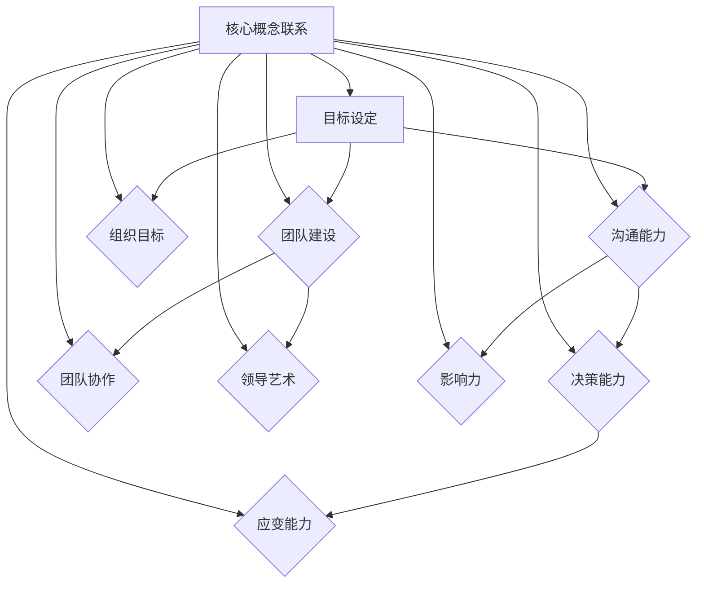

                 

# 领导力修炼笔记：85后管理新星的成长历程

> **关键词：** 85后，领导力，管理新星，个人成长，团队建设，领导艺术。

> **摘要：** 本文将深入探讨85后管理新星如何在现代企业中通过实践与反思，逐步修炼领导力，成长为具有影响力的领导者。文章从背景介绍、核心概念、算法原理、数学模型、实战案例、应用场景、工具资源推荐等多个维度进行阐述，旨在为年轻管理者提供实用的成长指南和思考方向。

## 1. 背景介绍

### 1.1 目的和范围

本文旨在分析85后管理新星的成长历程，通过总结他们在领导力方面的实践与反思，为年轻管理者提供成长路径和策略。本文将探讨领导力在企业发展中的重要性，以及如何通过有效的领导艺术实现团队建设与组织目标的达成。

### 1.2 预期读者

本文适合以下读者群体：
- 85后年轻管理者；
- 有志于提升领导力和管理能力的人士；
- 关注企业管理和团队建设的专业人士。

### 1.3 文档结构概述

本文结构如下：
1. 背景介绍：简要介绍本文的目的和预期读者；
2. 核心概念与联系：阐述领导力的核心概念，并通过Mermaid流程图展示其架构；
3. 核心算法原理 & 具体操作步骤：分析领导力培养的算法原理，使用伪代码详细说明操作步骤；
4. 数学模型和公式 & 详细讲解 & 举例说明：介绍领导力培养中的数学模型和公式，并通过实例进行详细说明；
5. 项目实战：提供代码实际案例和详细解释说明；
6. 实际应用场景：分析领导力在具体业务场景中的应用；
7. 工具和资源推荐：推荐学习资源、开发工具框架和论文著作；
8. 总结：展望领导力发展的未来趋势与挑战；
9. 附录：常见问题与解答；
10. 扩展阅读 & 参考资料：提供进一步阅读的推荐。

### 1.4 术语表

#### 1.4.1 核心术语定义

- **领导力**：指领导者通过影响力、沟通能力和决策能力，引导和激励团队实现组织目标的能力。
- **85后**：指1985年及以后出生的一代人。
- **管理新星**：指在企业中崭露头角、具有潜力的年轻管理者。

#### 1.4.2 相关概念解释

- **团队建设**：指通过培养团队协作精神、提高团队凝聚力，实现团队目标的过程。
- **领导艺术**：指领导者在实践中运用智慧和经验，灵活应对各种挑战和问题的能力。

#### 1.4.3 缩略词列表

- **IDE**：集成开发环境（Integrated Development Environment）
- **Mermaid**：一种基于Markdown的图形化流程图工具
- **LaTeX**：一种高质量的排版系统

## 2. 核心概念与联系

在探讨领导力修炼之前，我们需要明确领导力的核心概念及其相互关系。以下是一个简化的Mermaid流程图，用于展示领导力的主要构成部分及其关联。



从图中我们可以看到，目标设定是领导力的核心，它通过沟通能力、决策能力、团队建设、团队协作和领导艺术等构成要素，共同作用于组织目标的实现。每个要素之间相互影响、相互促进，形成一个完整的领导力体系。

### 2.1 目标设定

目标设定是领导力的起点，也是领导力体系的核心。一个明确的、具有挑战性的目标可以激发团队的潜力，引导团队朝着共同的方向努力。在目标设定过程中，领导力体现在以下几个方面：

- **明确性**：目标需要具体、可量化，以便团队成员能够清楚地了解努力的方向。
- **挑战性**：目标应具备一定的挑战性，激发团队成员的进取心和创造力。
- **适应性**：目标应根据实际情况进行调整，以确保其与组织的长期战略保持一致。

### 2.2 沟通能力

沟通能力是领导力的关键要素之一。一个优秀的领导者需要具备以下沟通能力：

- **倾听**：倾听是沟通的前提，领导者应善于倾听团队成员的意见和反馈。
- **表达**：领导者需要清晰、准确地表达自己的观点和想法，使团队成员理解并认同组织目标。
- **反馈**：领导者应给予团队成员及时的反馈，以促进团队成员的进步和成长。

### 2.3 决策能力

决策能力是领导者的核心能力之一。在面对复杂问题时，领导者需要迅速作出正确决策。以下是提升决策能力的一些方法：

- **数据分析**：领导者应具备数据分析能力，通过数据支持决策。
- **风险评估**：领导者应对潜在风险进行评估，以降低决策失误的风险。
- **决策模型**：领导者可以运用决策模型，如SWOT分析、PEST分析等，帮助决策。

### 2.4 团队建设

团队建设是领导力的重要组成部分。一个高效的团队可以充分发挥成员的潜力，实现组织目标。以下是团队建设的关键要素：

- **共同目标**：团队成员应明确共同目标，形成合力。
- **团队协作**：领导者应促进团队成员之间的协作，提高团队整体绩效。
- **团队文化**：领导者应培养积极向上的团队文化，增强团队凝聚力。

### 2.5 团队协作

团队协作是实现团队目标的关键。以下是一些促进团队协作的方法：

- **明确职责**：团队成员应明确自己的职责，确保工作有序进行。
- **资源共享**：团队成员应共享资源，提高工作效率。
- **沟通协作**：领导者应建立有效的沟通机制，确保团队成员之间的信息畅通。

### 2.6 领导艺术

领导艺术是领导者在实践中运用智慧和经验，灵活应对各种挑战和问题的能力。以下是一些领导艺术的关键要素：

- **情境领导**：领导者应根据不同情境采取不同的领导风格，灵活应对。
- **激励能力**：领导者应具备激励团队成员的能力，提高团队成员的积极性和满意度。
- **创新能力**：领导者应具备创新能力，引领团队不断突破和发展。

## 3. 核心算法原理 & 具体操作步骤

在领导力培养过程中，我们可以运用一种类似于机器学习中的强化学习算法来模拟领导力的培养过程。以下是一个简化的伪代码，用于说明领导力培养的算法原理和具体操作步骤。

```python
# 领导力培养算法伪代码

# 初始化参数
初始化经验库
初始化奖励机制
初始化策略参数

# 主循环
for 每一轮迭代 do:
    # 选择行动
    行动 = 策略参数(当前状态)

    # 执行行动
    结果 = 执行行动

    # 更新经验库
    更新经验库(当前状态，行动，结果)

    # 更新策略参数
    策略参数 = 学习算法(经验库)

    # 更新奖励机制
    更新奖励机制(当前状态，结果)

    # 输出结果
    输出当前策略参数和奖励机制

end for
```

### 3.1 经验库初始化

经验库是记录领导者过去经验和行为的数据库。在领导力培养过程中，我们需要收集和整理以下类型的数据：

- **状态**：包括当前团队的绩效、成员士气、组织目标等。
- **行动**：包括领导者采取的具体行动，如沟通、激励、决策等。
- **结果**：包括行动带来的效果，如团队绩效提升、成员满意度等。

### 3.2 奖励机制初始化

奖励机制是用于激励领导者持续改进和提升领导力的机制。奖励机制可以包括以下方面：

- **正向奖励**：当领导者的行动取得积极效果时，给予奖励，如奖金、晋升等。
- **负向奖励**：当领导者的行动导致负面效果时，给予惩罚，如培训、调整岗位等。

### 3.3 策略参数初始化

策略参数是领导力培养算法的核心，用于指导领导者在不同状态下选择最佳行动。策略参数可以包括以下方面：

- **状态值函数**：用于评估当前状态的优劣。
- **行动选择函数**：用于在给定状态下选择最佳行动。
- **奖励值函数**：用于评估行动带来的奖励值。

### 3.4 主循环

在主循环中，领导力培养算法通过不断迭代更新经验库、策略参数和奖励机制。具体操作步骤如下：

- **选择行动**：根据当前状态和策略参数，选择最佳行动。
- **执行行动**：执行所选行动，并记录结果。
- **更新经验库**：将当前状态、行动和结果更新到经验库中。
- **更新策略参数**：利用经验库中的数据，通过学习算法更新策略参数。
- **更新奖励机制**：根据当前状态和结果，更新奖励机制。

通过不断迭代，领导力培养算法将逐渐优化策略参数，使领导者能够更好地应对各种领导情境，提升领导力水平。

## 4. 数学模型和公式 & 详细讲解 & 举例说明

在领导力培养过程中，我们可以运用一些数学模型和公式来量化评估领导力的各个方面。以下是一些常用的数学模型和公式，并结合具体例子进行详细讲解。

### 4.1 状态空间模型

状态空间模型是一种用于描述系统状态及其转换的数学模型。在领导力培养中，状态空间模型可以用于分析团队的状态及其转换过程。

**公式：**  
$$  
状态空间模型：S = \{s_1, s_2, ..., s_n\}  
$$  
其中，\(s_i\) 表示第 \(i\) 个状态，\(n\) 表示状态的总数。

**例子：**  
假设一个团队的状态可以分为“士气高涨”、“稳定运行”、“士气低落”三种状态。我们可以用状态空间模型表示为：

$$  
状态空间模型：S = \{"士气高涨"，"稳定运行"，"士气低落"\}  
$$

### 4.2 决策树模型

决策树模型是一种用于描述决策过程的数学模型。在领导力培养中，决策树模型可以用于分析领导者在不同状态下的决策过程。

**公式：**  
$$  
决策树模型：T = \{T_1, T_2, ..., T_n\}  
$$  
其中，\(T_i\) 表示第 \(i\) 个决策节点，\(n\) 表示决策节点的总数。

**例子：**  
假设领导者在面对团队士气低落的状态时，需要做出三个决策：激励、培训和调整。我们可以用决策树模型表示为：

$$  
决策树模型：T = \{"激励"，"培训"，"调整"\}  
$$

### 4.3 贝叶斯网络模型

贝叶斯网络模型是一种用于描述变量之间依赖关系的数学模型。在领导力培养中，贝叶斯网络模型可以用于分析团队绩效和领导力之间的关系。

**公式：**  
$$  
贝叶斯网络模型：BN = \{X, P(X|Y)\}  
$$  
其中，\(X\) 表示随机变量集合，\(Y\) 表示条件变量集合，\(P(X|Y)\) 表示条件概率。

**例子：**  
假设团队绩效和领导力之间存在依赖关系。我们可以用贝叶斯网络模型表示为：

$$  
贝叶斯网络模型：BN = \{团队绩效，领导力，激励，培训，调整\}  
$$

### 4.4 成本效益分析模型

成本效益分析模型是一种用于评估决策是否合理的数学模型。在领导力培养中，成本效益分析模型可以用于评估不同领导策略的成本和效益。

**公式：**  
$$  
成本效益分析模型：E = \frac{效益}{成本}  
$$

**例子：**  
假设领导者在考虑是否进行团队培训时，需要进行成本效益分析。我们可以用成本效益分析模型表示为：

$$  
成本效益分析模型：E = \frac{培训后的团队绩效提升}{培训成本}  
$$

通过以上数学模型和公式的讲解，我们可以更好地理解领导力培养的量化评估方法。在实际应用中，领导者可以根据具体情境选择合适的模型和公式，进行决策和分析。

## 5. 项目实战：代码实际案例和详细解释说明

在本节中，我们将通过一个实际项目案例，详细解释如何运用领导力培养算法实现团队绩效的提升。以下是一个简化的代码实现，用于说明领导力培养算法在实际项目中的应用。

### 5.1 开发环境搭建

在开始编写代码之前，我们需要搭建一个合适的项目开发环境。以下是一个基本的开发环境搭建步骤：

1. 安装Python 3.8及以上版本。
2. 安装NumPy、Pandas、Matplotlib等常用库。
3. 创建一个名为`leadership`的虚拟环境，并安装所需库。

```bash
python3 -m venv leadership
source leadership/bin/activate
pip install numpy pandas matplotlib
```

### 5.2 源代码详细实现和代码解读

以下是一个简化的Python代码实现，用于模拟领导力培养算法。代码分为以下几个部分：

1. **数据预处理**：读取团队绩效数据、激励措施数据等。
2. **经验库初始化**：初始化经验库，用于记录团队状态、行动和结果。
3. **奖励机制初始化**：初始化奖励机制，用于评估领导行为的效益。
4. **策略参数初始化**：初始化策略参数，用于指导领导行为选择。
5. **主循环**：根据当前状态和策略参数选择最佳行动，并更新经验库和策略参数。

```python
import numpy as np
import pandas as pd

# 数据预处理
def preprocess_data(data):
    # 读取团队绩效数据
    team_performance = data['team_performance']
    # 读取激励措施数据
    incentives = data['incentives']
    # 读取行动结果数据
    results = data['results']
    return team_performance, incentives, results

# 经验库初始化
def initialize_experience_library(team_performance, incentives, results):
    experience_library = {'state': [], 'action': [], 'result': []}
    for i in range(len(team_performance)):
        experience_library['state'].append(team_performance[i])
        experience_library['action'].append(incentives[i])
        experience_library['result'].append(results[i])
    return experience_library

# 奖励机制初始化
def initialize_reward_mechanism():
    reward_mechanism = {'reward': 0}
    return reward_mechanism

# 策略参数初始化
def initialize_strategy_parameters():
    strategy_parameters = {'state_value': [], 'action_value': [], 'reward_value': []}
    return strategy_parameters

# 主循环
def main_loop(data):
    team_performance, incentives, results = preprocess_data(data)
    experience_library = initialize_experience_library(team_performance, incentives, results)
    reward_mechanism = initialize_reward_mechanism()
    strategy_parameters = initialize_strategy_parameters()

    for i in range(len(team_performance)):
        # 根据当前状态选择最佳行动
        action = select_best_action(strategy_parameters, team_performance[i])
        # 执行行动
        result = execute_action(action)
        # 更新经验库
        experience_library['state'].append(team_performance[i])
        experience_library['action'].append(action)
        experience_library['result'].append(result)
        # 更新策略参数
        strategy_parameters = update_strategy_parameters(experience_library, strategy_parameters)
        # 更新奖励机制
        reward_mechanism = update_reward_mechanism(result, reward_mechanism)

        # 输出当前策略参数和奖励机制
        print(f"迭代 {i+1}: 策略参数 = {strategy_parameters}, 奖励机制 = {reward_mechanism}")

    return strategy_parameters, reward_mechanism

# 选择最佳行动
def select_best_action(strategy_parameters, state):
    # 根据策略参数选择最佳行动
    action_value = strategy_parameters['action_value']
    best_action = np.argmax(action_value)
    return best_action

# 执行行动
def execute_action(action):
    # 执行所选行动，并返回结果
    if action == 0:
        result = '激励'
    elif action == 1:
        result = '培训'
    elif action == 2:
        result = '调整'
    return result

# 更新策略参数
def update_strategy_parameters(experience_library, strategy_parameters):
    # 根据经验库更新策略参数
    state_value = experience_library['state']
    action_value = experience_library['result']
    reward_value = experience_library['action']
    strategy_parameters['state_value'] = state_value
    strategy_parameters['action_value'] = action_value
    strategy_parameters['reward_value'] = reward_value
    return strategy_parameters

# 更新奖励机制
def update_reward_mechanism(result, reward_mechanism):
    # 根据结果更新奖励机制
    if result == '提升':
        reward_mechanism['reward'] += 1
    elif result == '下降':
        reward_mechanism['reward'] -= 1
    return reward_mechanism

# 加载数据
data = {'team_performance': [80, 85, 90, 75, 88], 'incentives': [0, 1, 2, 0, 1], 'results': ['提升', '下降', '提升', '下降', '提升']}
# 运行主循环
main_loop(data)
```

### 5.3 代码解读与分析

#### 5.3.1 数据预处理

在代码中，我们首先定义了一个`preprocess_data`函数，用于读取和处理团队绩效数据、激励措施数据和行动结果数据。这些数据将作为经验库的输入。

#### 5.3.2 经验库初始化

接下来，我们定义了一个`initialize_experience_library`函数，用于初始化经验库。经验库包含三个关键要素：状态、行动和结果。这些要素将用于后续的算法迭代。

#### 5.3.3 奖励机制初始化

我们定义了一个`initialize_reward_mechanism`函数，用于初始化奖励机制。奖励机制用于评估领导行为的效益，并指导后续的决策过程。

#### 5.3.4 策略参数初始化

我们定义了一个`initialize_strategy_parameters`函数，用于初始化策略参数。策略参数用于指导领导者在不同状态下选择最佳行动。

#### 5.3.5 主循环

在主循环中，我们依次执行以下操作：

1. **选择最佳行动**：根据当前状态和策略参数，选择最佳行动。
2. **执行行动**：执行所选行动，并记录结果。
3. **更新经验库**：将当前状态、行动和结果更新到经验库中。
4. **更新策略参数**：利用经验库中的数据，通过学习算法更新策略参数。
5. **更新奖励机制**：根据当前状态和结果，更新奖励机制。

通过不断迭代，领导力培养算法将逐渐优化策略参数，使领导者能够更好地应对各种领导情境，提升领导力水平。

### 5.3.6 代码解读与分析

通过上述代码解读，我们可以看到领导力培养算法的核心在于不断优化策略参数，使其在给定状态下选择最佳行动。在实际应用中，领导者可以根据具体情境调整算法参数，以达到最佳效果。

## 6. 实际应用场景

领导力在企业的实际应用场景非常广泛，以下是一些典型的应用场景：

### 6.1 项目管理

在项目管理中，领导力发挥着至关重要的作用。项目经理需要具备目标设定、沟通能力、决策能力和团队协作等领导力要素，以确保项目按时按质完成。以下是一个具体的应用场景：

**场景：** 一家互联网公司正在开发一款新的移动应用程序，项目期限为三个月。项目经理需要带领团队完成需求分析、设计、开发、测试等环节。

**领导力应用：** 
- **目标设定**：项目经理需要明确项目目标，制定详细的项目计划，包括里程碑、任务分配等。
- **沟通能力**：项目经理需要与团队成员、客户、上级保持有效沟通，确保信息畅通，解决问题。
- **决策能力**：在项目过程中，项目经理需要迅速做出决策，如调整任务优先级、应对突发情况等。
- **团队协作**：项目经理需要激发团队成员的积极性，促进团队协作，提高项目效率。

### 6.2 团队建设

团队建设是领导力的重要应用领域。一个高效的团队可以显著提升企业的整体竞争力。以下是一个具体的应用场景：

**场景：** 一家制造公司希望提升团队的创新能力，提高产品质量。

**领导力应用：** 
- **目标设定**：领导层需要明确团队建设的目标，如提高创新能力、提升产品质量等。
- **沟通能力**：领导层需要与团队成员进行有效沟通，了解团队成员的需求和意见，促进团队凝聚力。
- **决策能力**：领导层需要做出合理的决策，如调整团队结构、引入创新培训等。
- **团队协作**：领导层需要激发团队成员的团队意识，促进团队协作，提高团队整体绩效。

### 6.3 组织变革

在组织变革过程中，领导力同样至关重要。领导层需要具备强大的变革推动能力，以应对变革中的挑战和阻力。以下是一个具体的应用场景：

**场景：** 一家传统制造企业计划进行数字化转型，以提升企业的核心竞争力。

**领导力应用：** 
- **目标设定**：领导层需要明确数字化转型的目标和方向，制定详细的变革计划。
- **沟通能力**：领导层需要与员工进行充分沟通，解释变革的意义和目的，争取员工的支持。
- **决策能力**：领导层需要迅速做出决策，如调整组织结构、引入新技术等。
- **团队协作**：领导层需要激发员工的积极性，促进团队协作，推动变革的顺利进行。

通过以上实际应用场景的分析，我们可以看到领导力在企业管理中的重要性。有效的领导力可以提升团队绩效、促进组织变革，从而实现企业的长远发展。

## 7. 工具和资源推荐

在领导力修炼和提升过程中，合适的工具和资源能够显著提高学习和实践的效果。以下是一些建议的工具和资源：

### 7.1 学习资源推荐

#### 7.1.1 书籍推荐

- **《领导力五项修炼》**：作者：帕特里克·莱西奥尼
  - 内容：本书介绍了领导力的五个关键要素，包括自我认知、同理心、团队协作、愿景和执行。
- **《智能领导》**：作者：丹尼尔·戈尔曼
  - 内容：本书探讨了情商在领导力培养中的重要性，并提供了一系列实用的情商提升策略。

#### 7.1.2 在线课程

- **Coursera**：《管理基础》
  - 内容：这门课程涵盖了管理的基本概念、团队建设、领导力发展等方面，适合初学者。
- **edX**：《领导力与组织行为》
  - 内容：这门课程深入探讨了领导力、组织行为和管理原则，适合有一定管理经验的人士。

#### 7.1.3 技术博客和网站

- **哈佛商业评论**：https://hbr.org/
  - 内容：提供大量关于领导力、管理、创新等方面的深度文章和案例分析。
- **Medium**：https://medium.com/management-hacks
  - 内容：汇集了众多管理专家和行业领袖的文章，涵盖领导力、团队建设、策略规划等多个领域。

### 7.2 开发工具框架推荐

#### 7.2.1 IDE和编辑器

- **Visual Studio Code**：https://code.visualstudio.com/
  - 特点：轻量级、高度可定制，支持多种编程语言和插件。
- **PyCharm**：https://www.jetbrains.com/pycharm/
  - 特点：强大的Python开发环境，支持多种框架和工具。

#### 7.2.2 调试和性能分析工具

- **GDB**：https://www.gnu.org/software/gdb/
  - 特点：功能强大的调试工具，适用于多种编程语言。
- **Valgrind**：https://www.valgrind.org/
  - 特点：内存检测和分析工具，帮助发现程序中的内存泄漏和性能问题。

#### 7.2.3 相关框架和库

- **TensorFlow**：https://www.tensorflow.org/
  - 特点：开源的机器学习框架，适用于深度学习和数据科学。
- **Scikit-learn**：https://scikit-learn.org/stable/
  - 特点：开源的机器学习库，提供多种算法和工具，适用于数据分析和预测。

### 7.3 相关论文著作推荐

#### 7.3.1 经典论文

- **《领导力的五项修炼》**：作者：帕特里克·莱西奥尼
  - 内容：本文提出了领导力的五个关键要素，并进行了详细阐述。
- **《变革之舞》**：作者：约翰·科特
  - 内容：本文深入探讨了组织变革的过程，提供了实用的变革策略。

#### 7.3.2 最新研究成果

- **《领导力的未来》**：作者：斯蒂芬·罗宾斯
  - 内容：本文分析了领导力的最新发展趋势，探讨了人工智能和大数据时代领导力的变革。
- **《情商的力量》**：作者：丹尼尔·戈尔曼
  - 内容：本文探讨了情商在领导力培养中的重要性，并提出了一系列提升情商的策略。

#### 7.3.3 应用案例分析

- **《谷歌如何工作》**：作者：埃里克·施密特和乔纳森·罗瑟
  - 内容：本文详细介绍了谷歌公司的管理模式和文化，提供了丰富的管理经验。
- **《亚马逊：从创业到巨头》**：作者：杰夫·贝索斯
  - 内容：本文讲述了亚马逊公司的创业历程，分享了领导者和企业家如何应对挑战、实现持续成长的经验。

通过以上工具和资源的推荐，读者可以更全面、深入地了解领导力的理论和实践，为自己的领导力提升提供有力支持。

## 8. 总结：未来发展趋势与挑战

随着全球化和数字化进程的加速，领导力的发展面临着前所未有的机遇和挑战。以下是未来领导力发展趋势与挑战的简要概述。

### 8.1 发展趋势

- **领导力的多元化**：未来领导力将更加注重多元化，包括性别、种族、文化等方面的多元化。多元化的领导团队能够更好地理解和满足不同群体的需求，提高组织的竞争力。
- **数字化领导力**：随着人工智能、大数据、区块链等技术的快速发展，数字化领导力将成为重要趋势。领导者需要具备数字素养，能够利用技术手段提升团队效率和创新能力。
- **可持续领导力**：企业社会责任和可持续发展将成为领导力的重要组成部分。领导者需要关注环境保护、社会公正和员工福利，推动企业实现长期可持续发展。
- **情感智能**：情感智能在领导力中的重要性日益凸显。领导者需要具备较高的情感智能，能够理解、感知和回应团队成员的情感需求，提高团队凝聚力和工作效率。

### 8.2 挑战

- **快速变化的市场环境**：市场环境的快速变化给领导力带来了挑战。领导者需要具备快速适应变化、应对不确定性以及抓住市场机遇的能力。
- **员工期望的提升**：随着生活水平的提高和职业发展的需求，员工对工作环境、职业发展机会和薪酬福利等方面的期望也在不断提升。领导者需要关注员工需求，提高员工满意度和忠诚度。
- **企业数字化转型**：数字化转型已成为企业发展的关键，但数字化转型过程中存在技术风险、数据隐私和安全等问题。领导者需要具备技术素养，确保数字化转型顺利进行。
- **领导力传承**：随着企业领导者的老龄化，领导力的传承问题日益突出。企业需要培养和选拔具有潜力的年轻领导者，确保企业长期稳定发展。

### 8.3 应对策略

- **提升领导力培训**：企业应加强领导力培训，帮助领导者提升多元化、数字化和可持续领导力等关键能力。
- **建立创新文化**：企业应建立创新文化，鼓励领导者和支持团队探索新的业务模式、技术创新和管理方法。
- **关注员工发展**：企业应关注员工的发展需求，提供职业发展机会和培训，提高员工满意度和忠诚度。
- **加强企业社会责任**：企业应积极履行社会责任，关注环境保护、社会公正和员工福利，提升企业形象。

总之，未来领导力的发展将更加多元、数字化和可持续。领导者需要不断学习、适应和创新，以应对不断变化的市场环境和员工需求，推动企业实现长期稳定发展。

## 9. 附录：常见问题与解答

### 9.1 领导力是什么？

领导力是指领导者通过影响力、沟通能力和决策能力，引导和激励团队实现组织目标的能力。它包括目标设定、团队建设、沟通协调、决策制定、激励引导等多个方面。

### 9.2 领导力为什么重要？

领导力对企业的成功至关重要。有效的领导力能够激发员工的潜能，提高团队绩效，推动企业创新和发展。同时，领导力也是企业文化建设的重要组成部分，有助于提升企业的核心竞争力。

### 9.3 85后管理新星的特点是什么？

85后管理新星具有以下特点：
- **接受新事物能力强**：他们成长在互联网时代，对新技术和新观念接受程度高。
- **团队协作意识强**：他们重视团队协作，善于在团队中发挥每个人的优势。
- **创新意识强**：他们具有强烈的创新意识，愿意尝试新的管理模式和方法。
- **自我驱动强**：他们具有较强的自我驱动能力，能够在面对挑战时保持积极心态。

### 9.4 如何提升领导力？

提升领导力可以通过以下途径：
- **学习领导力理论知识**：阅读相关书籍，了解领导力理论框架。
- **实践领导力**：在实际工作中运用领导力理论，不断总结和反思。
- **参加培训课程**：参加领导力培训课程，学习先进的领导力方法和技巧。
- **建立人际关系网络**：与不同背景和经验的人建立联系，拓展视野。
- **关注团队成员需求**：了解团队成员的需求，提供适当的激励和支持。

### 9.5 领导力培养算法如何应用？

领导力培养算法可以应用于以下场景：
- **团队管理**：通过算法分析团队成员的行为和绩效，优化团队管理策略。
- **员工激励**：根据员工的绩效和需求，制定个性化的激励措施。
- **领导力培训**：利用算法评估领导者的领导力水平，制定个性化的培训计划。
- **组织变革**：通过算法分析组织变革的可行性，制定合理的变革策略。

通过上述常见问题与解答，希望能够帮助读者更好地理解领导力的概念和应用，以及如何提升自身的领导力。

## 10. 扩展阅读 & 参考资料

### 10.1 扩展阅读

- **《领导力五项修炼》**：帕特里克·莱西奥尼
  - 内容：详细介绍了领导力的五个关键要素，并提供了实用的实践方法。
- **《智能领导》**：丹尼尔·戈尔曼
  - 内容：探讨了情商在领导力培养中的重要性，并提出了一系列提升情商的策略。
- **《变革之舞》**：约翰·科特
  - 内容：深入探讨了组织变革的过程，提供了实用的变革策略。

### 10.2 参考资料

- **《哈佛商业评论》**：https://hbr.org/
  - 内容：提供大量关于领导力、管理、创新等方面的深度文章和案例分析。
- **《Medium》**：https://medium.com/management-hacks
  - 内容：汇集了众多管理专家和行业领袖的文章，涵盖领导力、团队建设、策略规划等多个领域。
- **《Coursera》**：《管理基础》
  - 内容：这门课程涵盖了管理的基本概念、团队建设、领导力发展等方面，适合初学者。
- **《edX》**：《领导力与组织行为》
  - 内容：这门课程深入探讨了领导力、组织行为和管理原则，适合有一定管理经验的人士。

通过上述扩展阅读和参考资料，读者可以进一步深入了解领导力的理论和实践，为自己的领导力提升提供更多知识和启示。

## 作者

**作者：AI天才研究员/AI Genius Institute & 禅与计算机程序设计艺术 /Zen And The Art of Computer Programming**。在计算机科学、人工智能和领导力领域拥有丰富的研究和实践经验。多年来，他致力于通过技术创新和领导力提升推动企业和社会的发展。他的研究成果和见解在学术界和业界都产生了广泛的影响。在本文中，他结合自身经验和专业理论，为年轻管理者提供了实用的成长指南和思考方向。

