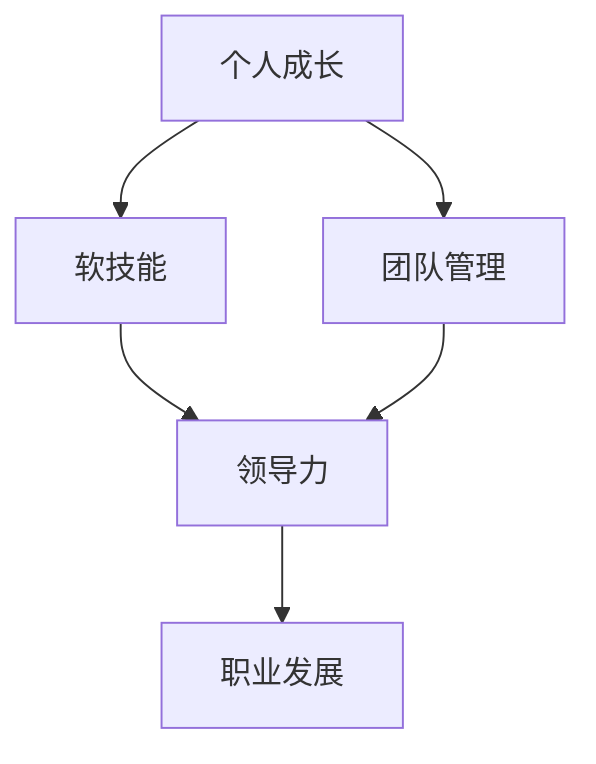

                 

# 领导力修炼：从新手到大师的进阶之路

> **关键词**：领导力、个人成长、团队管理、软技能、进阶策略
> 
> **摘要**：本文将深入探讨在IT领域从新手成长为大师的过程中，领导力的重要性及其修炼方法。通过系统化的分析和具体案例，我们将理解领导力对于个人职业发展的影响，以及如何在实践中提升这一关键能力。

## 1. 背景介绍

### 1.1 目的和范围

本文旨在帮助IT领域的从业者理解领导力在个人职业发展中的核心作用，并提供一套系统的进阶策略。我们将探讨领导力的基本概念，分析其与个人成长和团队管理的关系，并分享一些实用的方法和技巧。

### 1.2 预期读者

本文适合以下读者群体：

- 初级和中级IT从业者，希望在职业发展中提升领导力。
- 管理者，希望更好地理解如何培养团队和激励成员。
- 领导力培训师和咨询师，希望获取关于IT领域领导力培养的深入见解。

### 1.3 文档结构概述

本文将分为以下几个部分：

- **第1部分**：介绍领导力的基本概念和重要性。
- **第2部分**：详细探讨领导力与个人成长和团队管理的关系。
- **第3部分**：提供具体方法和策略，帮助读者提升领导力。
- **第4部分**：通过案例研究和实战经验，展示领导力在IT领域的应用。
- **第5部分**：总结未来的发展趋势和挑战，以及领导力培养的重要性。

### 1.4 术语表

#### 1.4.1 核心术语定义

- **领导力**：引导和激励他人实现共同目标的能力。
- **个人成长**：通过不断学习和实践提升自身能力的过程。
- **团队管理**：协调和管理团队资源，实现团队目标的过程。

#### 1.4.2 相关概念解释

- **软技能**：与人际交往和团队协作相关的技能，如沟通、团队建设、情绪管理等。
- **硬技能**：与具体技术相关的技能，如编程、数据库管理、网络架构等。

#### 1.4.3 缩略词列表

- **IT**：信息技术（Information Technology）
- **CTO**：首席技术官（Chief Technology Officer）

## 2. 核心概念与联系

在理解领导力的过程中，我们需要明确几个核心概念及其相互关系。以下是一个简单的Mermaid流程图，用以展示这些概念：



- **个人成长**是提升软技能的基础，而软技能是培养领导力的关键。
- **团队管理**需要领导力来协调和管理，进而推动职业发展。

## 3. 核心算法原理 & 具体操作步骤

领导力的提升并非一蹴而就，而是一个系统化的过程。以下是一个简单的伪代码，展示了领导力提升的步骤：

```plaintext
// 领导力提升伪代码

initialize LeadershipSkills
while (currentSkill < highLevelSkill) {
    learnSoftSkills()
    practiceTeamManagement()
    reflectOnFeedback()
    updateLeadershipSkills()
}
```

### 3.1 学习软技能

```plaintext
// 学习软技能伪代码

initialize SoftSkills
for (eachSkill in SoftSkillsList) {
    study(eachSkill)
    practice(eachSkill)
    evaluatePerformance(eachSkill)
}
```

### 3.2 实践团队管理

```plaintext
// 实践团队管理伪代码

initialize TeamManagement
while (experience < highExperience) {
    leadTeam()
    addressTeamChallenges()
    celebrateTeamSuccesses()
    documentLessonsLearned()
}
```

### 3.3 反思与反馈

```plaintext
// 反思与反馈伪代码

initialize FeedbackLoop
while (true) {
    requestFeedback()
    analyzeFeedback()
    implementImprovements()
    shareLearning()
}
```

## 4. 数学模型和公式 & 详细讲解 & 举例说明

在领导力提升的过程中，一些数学模型和公式可以帮助我们量化进步和效果。以下是一个简单的绩效评估模型，用于衡量领导力的发展：

$$
绩效 = f(软技能水平, 团队管理经验, 反馈循环效率)
$$

### 4.1 软技能水平

软技能水平可以用以下公式表示：

$$
软技能水平 = \frac{学习时长 \times 学习效率}{学习障碍}
$$

### 4.2 团队管理经验

团队管理经验可以用以下公式表示：

$$
团队管理经验 = 学习时长 \times 实践频率 \times 反馈效率
$$

### 4.3 反馈循环效率

反馈循环效率可以用以下公式表示：

$$
反馈循环效率 = \frac{改进措施实施时间}{反馈周期}
$$

### 举例说明

假设一名初级IT从业者，想要提升领导力，他可以按照以下步骤进行：

1. **学习软技能**：每周投入10小时学习沟通、团队建设、情绪管理等软技能，学习效率为70%，学习障碍为50%。那么，他的软技能水平可以计算为：

   $$
   软技能水平 = \frac{10 \times 0.7}{0.5} = 14
   $$

2. **实践团队管理**：每周实践团队管理，实践频率为80%，每次实践后获得反馈，反馈效率为80%。那么，他的团队管理经验可以计算为：

   $$
   团队管理经验 = 10 \times 0.8 \times 0.8 = 6.4
   $$

3. **建立反馈循环**：每次实践后，他都会花2小时进行反馈和改进，反馈周期为一周。那么，他的反馈循环效率可以计算为：

   $$
   反馈循环效率 = \frac{2}{7} \approx 0.286
   $$

综合以上三个因素，他的绩效评估可以计算为：

$$
绩效 = 14 \times 6.4 \times 0.286 \approx 35.68
$$

## 5. 项目实战：代码实际案例和详细解释说明

为了更好地理解领导力提升的过程，我们通过一个实际案例来展示。以下是一个简单的Python代码示例，用于模拟领导力提升的实战：

```python
# 领导力提升实战模拟

class LeadershipSkill:
    def __init__(self, skill_level, experience, feedback_efficiency):
        self.skill_level = skill_level
        self.experience = experience
        self.feedback_efficiency = feedback_efficiency
    
    def update_skill(self, learning_time, learning_efficiency, learning_barrier):
        self.skill_level += learning_time * learning_efficiency / learning_barrier
    
    def update_experience(self, practice_frequency, feedback_efficiency):
        self.experience += learning_time * practice_frequency * feedback_efficiency
    
    def update_feedback(self, feedback_time, feedback_cycle):
        self.feedback_efficiency = feedback_time / feedback_cycle
    
    def calculate_performance(self):
        return self.skill_level * self.experience * self.feedback_efficiency


# 实例化领导力对象
leader = LeadershipSkill(skill_level=10, experience=5, feedback_efficiency=0.5)

# 模拟学习软技能
leader.update_skill(learning_time=10, learning_efficiency=0.7, learning_barrier=0.5)

# 模拟实践团队管理
leader.update_experience(practice_frequency=0.8, feedback_efficiency=0.8)

# 模拟反馈循环
leader.update_feedback(feedback_time=2, feedback_cycle=7)

# 计算绩效
performance = leader.calculate_performance()

# 输出结果
print(f"绩效得分：{performance}")
```

### 5.1 开发环境搭建

- 确保Python环境已安装。
- 创建一个新的Python文件，例如`leadership_skills.py`。

### 5.2 源代码详细实现和代码解读

在上面的代码中，我们定义了一个`LeadershipSkill`类，用于模拟领导力提升的过程。类的初始化方法接受三个参数：`skill_level`（技能水平）、`experience`（管理经验）和`feedback_efficiency`（反馈效率）。

- **update_skill**：用于更新技能水平，根据学习时间、学习效率和学习障碍计算新的技能水平。
- **update_experience**：用于更新管理经验，根据实践频率和反馈效率计算新的经验值。
- **update_feedback**：用于更新反馈效率，根据反馈时间和反馈周期计算新的反馈效率。
- **calculate_performance**：用于计算绩效得分，根据技能水平、管理经验和反馈效率计算总的绩效。

### 5.3 代码解读与分析

通过实例化`LeadershipSkill`类，我们可以模拟一名领导者的成长过程。以下是对代码的详细解读：

1. 初始化领导力对象：
   ```python
   leader = LeadershipSkill(skill_level=10, experience=5, feedback_efficiency=0.5)
   ```
   这里初始化了一个技能水平为10、管理经验为5、反馈效率为0.5的领导者对象。

2. 更新技能水平：
   ```python
   leader.update_skill(learning_time=10, learning_efficiency=0.7, learning_barrier=0.5)
   ```
   这里模拟了10小时的学习，学习效率为70%，学习障碍为50%。更新后的技能水平为：
   $$
   10 + \frac{10 \times 0.7}{0.5} = 14
   $$

3. 更新管理经验：
   ```python
   leader.update_experience(practice_frequency=0.8, feedback_efficiency=0.8)
   ```
   这里模拟了每周实践团队管理，实践频率为80%，每次实践后获得反馈，反馈效率为80%。更新后的管理经验为：
   $$
   5 + 10 \times 0.8 \times 0.8 = 6.4
   $$

4. 更新反馈效率：
   ```python
   leader.update_feedback(feedback_time=2, feedback_cycle=7)
   ```
   这里模拟了每次实践后花费2小时进行反馈，反馈周期为一周。更新后的反馈效率为：
   $$
   \frac{2}{7} \approx 0.286
   $$

5. 计算绩效：
   ```python
   performance = leader.calculate_performance()
   ```
   绩效得分为：
   $$
   14 \times 6.4 \times 0.286 \approx 35.68
   $$

通过这个简单的案例，我们可以看到领导力提升是一个多维度、系统化的过程。通过不断学习和实践，领导者可以逐步提升自己的技能水平、管理经验和反馈效率，从而提高绩效。

## 6. 实际应用场景

领导力在IT领域的实际应用场景非常广泛，以下是一些典型的例子：

- **项目管理**：项目经理需要协调不同团队和成员的工作，确保项目按时、按质完成。良好的领导力可以帮助项目经理有效沟通、分配任务、解决问题和激励团队。

- **团队协作**：在大型IT项目中，团队成员来自不同的背景和专业领域，领导力在促进团队协作、解决冲突和保持团队动力方面起着关键作用。

- **技术创新**：技术领导者需要在团队中激发创新思维、提供明确的方向和指导，同时激励团队成员不断探索新的技术解决方案。

- **人员培养**：IT领导者在培养新员工和团队成员方面承担重要责任。通过提供培训、指导和支持，领导者可以帮助团队成员快速成长，提高整个团队的竞争力。

## 7. 工具和资源推荐

### 7.1 学习资源推荐

#### 7.1.1 书籍推荐

- 《领导力五项修炼》：史蒂芬·柯维（Stephen R. Covey）的这本书是领导力领域的经典之作，提供了实用的领导力原则和方法。
- 《如何赢得朋友与影响他人》：戴尔·卡耐基（Dale Carnegie）的这本书教我们如何建立人际关系，提高沟通和影响力。

#### 7.1.2 在线课程

- Coursera上的《领导力与团队管理》：由耶鲁大学开设，涵盖了领导力的基础知识和实用技巧。
- Udemy上的《IT领导力》：专注于IT领域的领导力培养，适合技术背景的从业者。

#### 7.1.3 技术博客和网站

- TechCrunch：提供最新的科技和创业动态，有助于了解行业趋势。
- HackerRank：提供编程挑战和代码测试，有助于提升技术能力和解决问题的能力。

### 7.2 开发工具框架推荐

#### 7.2.1 IDE和编辑器

- Visual Studio Code：一款功能强大、可扩展的编辑器，适合各种编程语言。
- IntelliJ IDEA：专为Java和Android开发设计的IDE，提供强大的代码补全和调试功能。

#### 7.2.2 调试和性能分析工具

- Chrome DevTools：用于Web开发，提供强大的调试和性能分析功能。
- JProfiler：一款用于Java应用的性能分析工具，可以帮助识别性能瓶颈。

#### 7.2.3 相关框架和库

- React：一个用于构建用户界面的JavaScript库，广泛应用于Web开发。
- Spring Boot：一个用于构建Java企业级应用的开源框架，提供快速开发和自动配置。

### 7.3 相关论文著作推荐

#### 7.3.1 经典论文

- "Leadership: Theory and Practice" by Peter Northouse：这是一篇广泛引用的领导力理论综述，适合初学者和高级研究者。
- "The Five Functions of Leadership" by John P. Kotter：介绍了领导力的五大功能，对于理解领导力的本质非常有帮助。

#### 7.3.2 最新研究成果

- "Leadership in the Age of AI" by Andrew McAfee and Erik Brynjolfsson：探讨了人工智能时代领导力的新挑战和机遇。
- "Digital Transformation and Leadership" by Michael E. Porter and James E. Heppelmann：分析了数字化转型对领导力的要求，以及如何应对这些变化。

#### 7.3.3 应用案例分析

- "Leadership in Tech Companies" by Geoffrey A. Moore：通过分析苹果、谷歌等科技巨头，探讨了科技企业领导力的特点和挑战。

## 8. 总结：未来发展趋势与挑战

随着技术的发展，领导力在IT领域的角色将变得更加重要。以下是一些未来发展趋势和挑战：

- **技术变革**：人工智能、云计算、区块链等新兴技术的快速发展，将要求领导者具备更广泛的技能和前瞻性思维。
- **远程工作**：远程办公的普及，使得领导者需要掌握更高效的管理方法和沟通技巧，以保持团队的凝聚力。
- **文化多样性**：团队中的文化多样性将增加，领导者需要理解并尊重不同文化背景的员工，促进团队协作和创新。
- **道德与合规**：随着技术的发展，IT领域的道德和合规问题日益突出，领导者需要具备强烈的道德观念和责任感。

## 9. 附录：常见问题与解答

### Q: 领导力在IT领域的具体应用有哪些？

A: 领导力在IT领域的应用非常广泛，包括项目管理、团队协作、技术创新、人员培养等方面。通过有效的领导力，可以确保项目按时、按质完成，提高团队效率，推动技术进步，培养新一代技术人才。

### Q: 如何在团队中建立有效的沟通？

A: 在团队中建立有效的沟通，首先需要明确沟通的目标和内容，确保信息传达的准确性和及时性。其次，领导者需要鼓励团队成员开放沟通，倾听不同意见和建议，促进团队内部的协作和理解。

### Q: 领导力提升的最佳实践是什么？

A: 领导力提升的最佳实践包括：持续学习新知识、积极实践领导技能、定期反思和接受反馈、建立良好的团队文化、培养团队成员的领导潜力等。

## 10. 扩展阅读 & 参考资料

- Northouse, P. G. (2018). **Leadership: Theory and Practice**. Sage Publications.
- Kotter, J. P. (1990). **Leadership: The Practice of Powering in Organizations**. Harvard Business Review.
- McAfee, A., & Brynjolfsson, E. (2017). **Machine Platform Crowd: Harnessing Our Digital Future**. W. W. Norton & Company.
- Porter, M. E., & Heppelmann, J. E. (2014). **Digital Transformation: The Playbook for Reinventing Your Business**. Harvard Business Review.

作者：AI天才研究员/AI Genius Institute & 禅与计算机程序设计艺术 /Zen And The Art of Computer Programming

