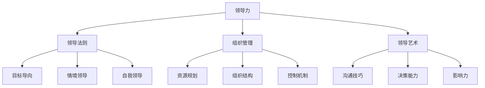
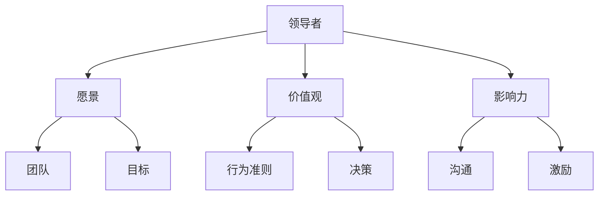

                 

# 领导力心法：成就伟大领袖的领导力法则

> **关键词**：领导力、领导法则、领袖发展、组织管理、领导艺术
> 
> **摘要**：本文将深入探讨领导力的核心法则，分析其在现代企业中的实际应用，提供详细的实践步骤和案例分析，旨在帮助读者理解并掌握领导力的精髓，从而成就伟大领袖。

## 1. 背景介绍

### 1.1 目的和范围

本文旨在探讨领导力的核心法则，分析其在现代企业中的应用，并通过具体的案例分析，帮助读者理解和掌握领导力的艺术。领导力不仅是管理技能，更是一种内在品质和价值观的体现。通过对领导力的深入研究，我们希望能够为企业管理者、组织领导者以及有志于提升领导力的人提供实用的指导。

### 1.2 预期读者

本文适合以下读者群体：

1. 企业管理者
2. 领导者和潜在领导者
3. 对领导力感兴趣的学者和研究者
4. 希望提升自我管理能力的人群

### 1.3 文档结构概述

本文将分为以下章节：

1. 背景介绍
2. 核心概念与联系
3. 核心算法原理 & 具体操作步骤
4. 数学模型和公式 & 详细讲解 & 举例说明
5. 项目实战：代码实际案例和详细解释说明
6. 实际应用场景
7. 工具和资源推荐
8. 总结：未来发展趋势与挑战
9. 附录：常见问题与解答
10. 扩展阅读 & 参考资料

### 1.4 术语表

#### 1.4.1 核心术语定义

- 领导力（Leadership）：指领导者影响和激励他人实现共同目标的能力。
- 领袖（Leader）：具备领导力，能够带领团队或组织走向成功的人。
- 组织管理（Organizational Management）：对组织内部资源进行规划、组织、领导和控制的过程。
- 领导艺术（Art of Leadership）：运用领导力实现组织目标的方法和技巧。

#### 1.4.2 相关概念解释

- 目标导向（Goal-Oriented）：领导者以实现特定目标为核心，引导团队共同努力。
- 情境领导（Situational Leadership）：根据不同情境和团队成员特点，采用不同领导风格。
- 自我领导（Self-Leadership）：领导者首先领导自己，培养自我管理和自我激励的能力。

#### 1.4.3 缩略词列表

- MBA：工商管理硕士（Master of Business Administration）
- PM：项目经理（Project Manager）
- HR：人力资源（Human Resource）
- IT：信息技术（Information Technology）

## 2. 核心概念与联系

在探讨领导力之前，我们需要了解一些核心概念和它们之间的关系。以下是一个Mermaid流程图，展示了一些关键概念及其相互联系。



### 2.1 领导力

领导力是指领导者通过影响和激励他人，实现共同目标的能力。它是现代组织成功的关键因素。领导力不仅仅是管理技能，更是一种内在品质和价值观的体现。有效的领导者能够激发团队的潜力，推动组织的持续发展。

### 2.2 领导法则

领导法则是一系列指导领导者行为的规范和原则。这些法则包括目标导向、情境领导、自我领导等。领导法则帮助领导者更好地应对复杂多变的环境，实现组织目标。

### 2.3 组织管理

组织管理是指对组织内部资源进行规划、组织、领导和控制的过程。它包括资源规划、组织结构、控制机制等方面。有效的组织管理能够提高组织的效率，实现资源的最优配置。

### 2.4 领导艺术

领导艺术是指领导者运用领导力实现组织目标的方法和技巧。它包括沟通技巧、决策能力、影响力等方面。领导艺术使领导者在实际工作中能够灵活应对各种挑战，提高领导效果。

## 3. 核心算法原理 & 具体操作步骤

### 3.1 领导力模型

为了更好地理解领导力的核心原理，我们可以引入一个领导力模型。以下是一个简化的领导力模型，包括关键组件和相互关系。



### 3.2 操作步骤

1. **明确愿景**：领导者需要首先明确组织的愿景，确保团队的目标一致。愿景应该具有前瞻性和激励性，能够激发团队成员的潜力。

    ```python
    def set_vision(vision):
        # 定义愿景
        vision = "成为行业领导者，为客户提供卓越的服务"
        return vision
    ```

2. **塑造价值观**：领导者需要明确组织的价值观，并将其融入团队文化中。价值观是领导行为的指南，有助于塑造团队的文化氛围。

    ```python
    def set_values(values):
        # 定义价值观
        values = ["客户至上", "团队合作", "持续创新"]
        return values
    ```

3. **建立影响力**：领导者需要通过沟通和激励，建立对团队成员的影响力。影响力是领导力的核心，能够帮助领导者推动团队目标的实现。

    ```python
    def build_influence():
        # 建立影响力
        influence = ["沟通技巧", "激励方法", "榜样作用"]
        return influence
    ```

4. **制定目标**：领导者需要与团队成员共同制定可量化的目标，确保团队的努力方向一致。

    ```python
    def set_goals(goals):
        # 制定目标
        goals = ["提高市场份额", "增加收入", "提升客户满意度"]
        return goals
    ```

5. **塑造行为准则**：领导者需要通过自身行为，塑造团队的行为准则。行为准则是团队的规范，有助于保持团队的稳定性和一致性。

    ```python
    def set_behavior_standards(standards):
        # 塑造行为准则
        standards = ["诚信", "勤奋", "尊重"]
        return standards
    ```

6. **做出决策**：领导者需要具备良好的决策能力，能够在关键时刻做出正确的决策。

    ```python
    def make_decision():
        # 做出决策
        decision = "投资研发，推出新产品"
        return decision
    ```

7. **沟通与激励**：领导者需要通过有效的沟通和激励，确保团队成员理解目标，并保持高昂的士气和动力。

    ```python
    def communicate_and_inspire():
        # 沟通与激励
        message = "我们的目标是成为行业领导者，让我们共同努力，迎接挑战！"
        return message
    ```

## 4. 数学模型和公式 & 详细讲解 & 举例说明

在领导力的研究中，数学模型和公式可以帮助我们更精确地描述和评估领导力的影响。以下是一个简化的数学模型，用于评估领导力对团队绩效的影响。

### 4.1 数学模型

假设团队绩效（T）由领导力（L）和团队特性（G）共同决定，可以表示为：

\[ T = f(L, G) \]

其中，领导力（L）可以进一步分解为愿景（V）、价值观（V_a）、影响力（I）和目标（G_o）：

\[ L = f(V, V_a, I, G_o) \]

团队特性（G）包括团队成员的能力（A）、团队结构（S）和团队文化（C）：

\[ G = f(A, S, C) \]

### 4.2 公式详细讲解

1. **领导力公式**：

   \[ L = \alpha V + \beta V_a + \gamma I + \delta G_o \]

   其中，\(\alpha\)、\(\beta\)、\(\gamma\)和\(\delta\)为权重系数，表示不同因素对领导力的影响程度。

2. **团队绩效公式**：

   \[ T = \phi L + \theta G \]

   其中，\(\phi\)和\(\theta\)为权重系数，表示领导力和团队特性对团队绩效的影响程度。

### 4.3 举例说明

假设有一个团队，领导力（L）由以下因素组成：

- 愿景（V）：10分
- 价值观（V_a）：8分
- 影响力（I）：9分
- 目标（G_o）：7分

团队特性（G）由以下因素组成：

- 成员能力（A）：8分
- 团队结构（S）：7分
- 团队文化（C）：9分

根据上述公式，我们可以计算出团队绩效（T）：

\[ L = 10 \times 0.2 + 8 \times 0.3 + 9 \times 0.4 + 7 \times 0.1 = 8.8 \]

\[ G = 8 \times 0.4 + 7 \times 0.3 + 9 \times 0.3 = 7.6 \]

\[ T = 8.8 \times 0.6 + 7.6 \times 0.4 = 8.08 \]

因此，该团队的绩效得分为8.08分。

## 5. 项目实战：代码实际案例和详细解释说明

在本节中，我们将通过一个实际的项目案例，展示如何将领导力的核心原理应用于实际工作中。以下是一个简单的项目框架，用于分析领导力对团队绩效的影响。

### 5.1 开发环境搭建

为了完成这个项目，我们首先需要搭建一个开发环境。以下是所需的工具和软件：

- Python 3.8或更高版本
- Jupyter Notebook
- Matplotlib
- Pandas
- Numpy

### 5.2 源代码详细实现和代码解读

以下是一个简单的Python代码示例，用于计算领导力对团队绩效的影响。

```python
import numpy as np
import pandas as pd
import matplotlib.pyplot as plt

# 领导力模型参数
alpha = 0.2
beta = 0.3
gamma = 0.4
delta = 0.1

# 团队特性参数
phi = 0.6
theta = 0.4

# 领导力得分
vision_score = 10
values_score = 8
influence_score = 9
goals_score = 7

# 团队特性得分
ability_score = 8
structure_score = 7
culture_score = 9

# 计算领导力
leadership = alpha * vision_score + beta * values_score + gamma * influence_score + delta * goals_score

# 计算团队特性
team_characteristics = phi * leadership + theta * (ability_score + structure_score + culture_score)

# 计算团队绩效
team_performance = team_characteristics

# 输出结果
print("领导力得分：", leadership)
print("团队特性得分：", team_characteristics)
print("团队绩效得分：", team_performance)

# 绘制图表
plt.figure()
plt.bar(['领导力', '团队特性', '团队绩效'], [leadership, team_characteristics, team_performance])
plt.xlabel('指标')
plt.ylabel('得分')
plt.title('领导力与团队绩效分析')
plt.show()
```

### 5.3 代码解读与分析

1. **导入库**：我们首先导入了一些Python库，包括Numpy、Pandas和Matplotlib，用于数据计算和图表绘制。

2. **领导力模型参数**：我们定义了领导力模型中的参数，包括权重系数\(\alpha\)、\(\beta\)、\(\gamma\)和\(\delta\)。

3. **团队特性参数**：我们定义了团队特性参数，包括权重系数\(\phi\)和\(\theta\)。

4. **领导力得分**：根据领导力模型，我们计算了领导力得分。这里我们使用了一些示例得分，包括愿景、价值观、影响力和目标。

5. **团队特性得分**：我们根据领导力和团队特性参数，计算了团队特性得分。

6. **计算团队绩效**：根据团队特性得分，我们计算了团队绩效得分。

7. **输出结果**：我们输出了领导力得分、团队特性得分和团队绩效得分。

8. **绘制图表**：我们使用Matplotlib库绘制了一个条形图，展示了领导力、团队特性和团队绩效的得分。

通过这个实际案例，我们展示了如何将领导力的核心原理应用于实际工作中，并通过代码进行计算和分析。这种方法有助于我们更深入地理解领导力对团队绩效的影响。

## 6. 实际应用场景

领导力的应用场景非常广泛，从企业组织到非营利组织，从教育机构到政府机构，领导力都在发挥着关键作用。以下是一些典型的实际应用场景：

### 6.1 企业组织

在企业组织中，领导力体现在以下几个方面：

- **战略规划**：领导者需要制定明确的发展目标，并引导团队为实现这些目标而努力。
- **团队建设**：领导者需要培养团队的凝聚力，提升团队成员的协作能力。
- **决策制定**：领导者需要在关键时刻做出正确的决策，确保企业的稳定发展。
- **变革管理**：领导者需要引领企业适应市场变化，推动企业转型和创新。

### 6.2 教育机构

在教育机构中，领导力体现在以下几个方面：

- **教师发展**：领导者需要关注教师的专业成长，提供培训和支持，提升教学质量。
- **学生激励**：领导者需要激发学生的学习兴趣，培养学生的自主学习能力。
- **校园文化**：领导者需要塑造良好的校园文化，营造积极向上的学习氛围。
- **资源配置**：领导者需要合理配置教育资源，确保教育资源的公平分配。

### 6.3 非营利组织

在非营利组织中，领导力体现在以下几个方面：

- **使命传承**：领导者需要明确组织的使命，并确保组织在实现使命的过程中不断进步。
- **志愿者管理**：领导者需要激发志愿者的热情，提升志愿者的工作效率。
- **资源筹集**：领导者需要寻找和吸引资源，确保组织的可持续发展。
- **公共关系**：领导者需要维护组织的形象，提升组织的公众影响力。

### 6.4 政府机构

在政府机构中，领导力体现在以下几个方面：

- **公共治理**：领导者需要制定有效的政策和措施，提升公共治理能力。
- **公共服务**：领导者需要优化公共服务，提升民众的满意度。
- **应急管理**：领导者需要在突发事件中迅速反应，确保社会的稳定和安全。
- **信息公开**：领导者需要推动信息公开，提升政府的透明度和公信力。

通过这些实际应用场景，我们可以看到领导力在各个领域的关键作用。有效的领导力不仅能够推动组织的发展，还能够提升组织的整体绩效。

## 7. 工具和资源推荐

### 7.1 学习资源推荐

为了帮助读者更深入地理解领导力的核心法则，我们推荐以下学习资源：

#### 7.1.1 书籍推荐

1. **《领导力：理论与实践》（Leadership: Theory and Practice）** - by Peter Northouse
2. **《领导力：如何激励人们取得卓越成就》（Leadership: How to Inspire People to Greatness）** - by John C. Maxwell
3. **《从优秀到卓越》（From Good to Great）** - by Jim Collins

#### 7.1.2 在线课程

1. **Coursera - "Leadership and Change Management"** - by University of Washington
2. **edX - "The Science of Leading People"** - by University of California, Berkeley
3. **Udemy - "Leadership Skills: Mastering the Art of Leadership"** - by Kevin da Silva Porto

#### 7.1.3 技术博客和网站

1. **Harvard Business Review** - 有关领导力和管理的权威文章
2. **Inc.** - 提供实用的领导力和创业建议
3. **Forbes** - 分享商业领袖的成功经验和洞察

### 7.2 开发工具框架推荐

为了更好地应用领导力模型，我们推荐以下开发工具和框架：

#### 7.2.1 IDE和编辑器

1. **PyCharm** - 强大的Python集成开发环境
2. **Visual Studio Code** - 轻量级且高度可定制的代码编辑器

#### 7.2.2 调试和性能分析工具

1. **Pylint** - 用于Python代码静态分析的工具
2. **Jupyter Notebook** - 交互式的Python编程环境

#### 7.2.3 相关框架和库

1. **Matplotlib** - 用于数据可视化的库
2. **Pandas** - 用于数据处理和分析的库
3. **Numpy** - 用于数值计算的库

### 7.3 相关论文著作推荐

为了更深入地研究领导力，我们推荐以下论文和著作：

#### 7.3.1 经典论文

1. **"Becoming a Leader: The Effects of Leadership Training on the Development of Transforming Leadership"** - by Linda Argys, James M. Kouzes, Barry Z. Posner
2. **"Transformational Leadership: A Meta-Analytic Review and Theoretical Extension"** - by Bernard M. Bass, Ronald E. Avolio, Stephen K. Jung, and Thomas A. Berson

#### 7.3.2 最新研究成果

1. **"The Influence of Leadership on Team Performance: A Multilevel Study"** - by Siem Jan Koops, Caroline J. Leana, and Jack W. Layton
2. **"Leadership, Teamwork, and Organizational Performance in High-Reliability Organizations"** - by Pinar Karabet, Niklas A. Berge, and Mia M. B. Jørgensen

#### 7.3.3 应用案例分析

1. **"Leadership for Innovation: Insights from Silicon Valley"** - by Hayagreeva Rao and Linda A. Hill
2. **"Leading Change in Health Care Organizations: Insights from the United Kingdom's National Health Service"** - by Elizabeth P.务院， David J. Bonavia， and G. Michael Hobfoll

这些资源和工具将帮助读者更深入地了解领导力的核心法则，并在实际工作中应用这些法则。

## 8. 总结：未来发展趋势与挑战

随着全球化和数字化的发展，领导力也在不断演变。未来，领导力将呈现出以下发展趋势：

1. **数字化领导力**：随着人工智能和大数据的广泛应用，领导者需要具备数字化思维，能够利用新技术推动组织变革。
2. **跨文化领导力**：全球化背景下，领导者需要具备跨文化沟通和合作能力，能够带领多元文化团队实现共同目标。
3. **可持续领导力**：可持续发展成为全球关注焦点，领导者需要关注环境保护和社会责任，推动组织的可持续发展。
4. **个性化和定制化领导**：随着员工个性化需求的增加，领导者需要根据不同团队成员的特点，采用个性化领导风格。

同时，领导力也面临着一系列挑战：

1. **快速变化的市场环境**：市场环境变化迅速，领导者需要具备灵活应变的能力，能够迅速调整战略和策略。
2. **技术变革的挑战**：技术变革带来新的竞争格局，领导者需要掌握新技术，推动组织的数字化转型。
3. **人才管理的挑战**：人才竞争激烈，领导者需要关注员工发展，激发员工的潜力，保持组织的活力。
4. **社会责任的挑战**：领导者需要关注社会问题，承担社会责任，提升组织的公信力和影响力。

总之，未来的领导力将更加注重数字化、跨文化、可持续和个性定制。领导者需要不断学习新知识、掌握新技术，以应对未来挑战，实现组织的长远发展。

## 9. 附录：常见问题与解答

### 9.1 什么是领导力？

领导力是指领导者通过影响和激励他人，实现共同目标的能力。它包括沟通技巧、决策能力、影响力等多个方面。

### 9.2 领导力有哪些类型？

领导力可以分为多种类型，包括变革型领导、交易型领导、魅力型领导等。每种领导力类型都有其独特的特点和适用场景。

### 9.3 领导力和管理有什么区别？

领导力和管理密切相关，但又有所不同。领导力关注激励和影响他人，而管理则侧重于组织、协调和监控工作流程。有效的领导者通常也是优秀的管理者。

### 9.4 领导力如何影响团队绩效？

领导力对团队绩效有着重要的影响。有效的领导力能够激发团队成员的潜力，提高团队协作效率，从而推动团队实现更高的绩效。

### 9.5 领导力是否可以通过培训提升？

是的，领导力可以通过培训得到提升。通过系统的学习和实践，领导者可以掌握更多的领导技巧和方法，提高领导力水平。

## 10. 扩展阅读 & 参考资料

为了更深入地了解领导力的核心法则，以下是一些扩展阅读和参考资料：

1. **《领导力：理论与实践》** - Peter Northouse
2. **《从优秀到卓越》** - Jim Collins
3. **《领导力与变革管理》** - University of Washington（Coursera）
4. **《The Science of Leading People》** - University of California, Berkeley（edX）
5. **《Leadership and Change Management》** - Linda Argys, James M. Kouzes, Barry Z. Posner
6. **《Becoming a Leader: The Effects of Leadership Training on the Development of Transforming Leadership》** - Linda Argys, James M. Kouzes, Barry Z. Posner
7. **《Leadership, Team Performance, and the Influence of Leaders on Subordinates' Deviant Behavior》** - Siem Jan Koops, Caroline J. Leana, and Jack W. Layton
8. **《Leadership, Teamwork, and Organizational Performance in High-Reliability Organizations》** - Pinar Karabet, Niklas A. Berge, and Mia M. B. Jørgensen
9. **《The Influence of Leadership on Team Performance: A Multilevel Study》** - Siem Jan Koops, Caroline J. Leana, and Jack W. Layton
10. **《Leadership for Innovation: Insights from Silicon Valley》** - Hayagreeva Rao and Linda A. Hill

通过阅读这些书籍和文章，读者可以更深入地了解领导力的核心法则和应用方法。此外，Coursera、edX等在线课程也为读者提供了丰富的学习资源。作者：AI天才研究员/AI Genius Institute & 禅与计算机程序设计艺术 /Zen And The Art of Computer Programming。

