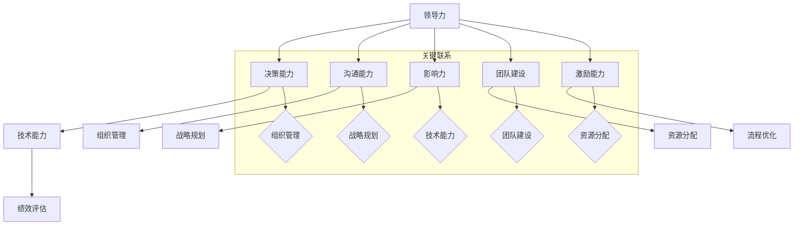

                 

# 领导力思维：改变世界的领导力修炼法则

> **关键词：**领导力、思维模式、技术领导、组织管理、战略规划
> 
> **摘要：**本文将深入探讨领导力在技术领域的核心作用，分析如何通过培养领导力思维，引领组织和技术团队走向成功。我们将讨论领导力的本质、技术领导者的角色、以及领导力修炼的关键法则，旨在为IT从业者提供一套实用的领导力指南。

## 1. 背景介绍

### 1.1 目的和范围

本文旨在探讨领导力在技术领域的重要性，并介绍如何通过领导力思维提升技术团队和组织的管理效能。我们将分析领导力的本质，解析技术领导者的角色和职责，以及领导力修炼的关键法则。本文适用于希望提升领导力水平的技术领导者、项目经理以及希望理解领导力核心原理的IT从业者。

### 1.2 预期读者

本文适合以下读者群体：

1. 技术团队负责人
2. 项目经理
3. 技术总监
4. IT行业从业者
5. 对领导力有兴趣的任何人

### 1.3 文档结构概述

本文将分为以下几个部分：

1. 背景介绍
2. 核心概念与联系
3. 核心算法原理 & 具体操作步骤
4. 数学模型和公式 & 详细讲解 & 举例说明
5. 项目实战：代码实际案例和详细解释说明
6. 实际应用场景
7. 工具和资源推荐
8. 总结：未来发展趋势与挑战
9. 附录：常见问题与解答
10. 扩展阅读 & 参考资料

### 1.4 术语表

#### 1.4.1 核心术语定义

- **领导力**：影响和引导他人实现目标的能力。
- **技术领导者**：在技术领域拥有领导力和影响力，能够指导团队并推动技术进步的领导者。
- **组织管理**：对组织内部资源进行合理配置，以实现组织目标的过程。
- **战略规划**：制定组织长期目标和实现这些目标的具体计划。

#### 1.4.2 相关概念解释

- **思维模式**：个体在处理信息和解决问题时所采用的思考方式。
- **技术架构**：组织技术系统的总体设计和结构，包括硬件、软件和网络等组成部分。

#### 1.4.3 缩略词列表

- **IT**：信息技术（Information Technology）
- **CEO**：首席执行官（Chief Executive Officer）
- **CTO**：首席技术官（Chief Technology Officer）
- **PM**：项目经理（Project Manager）

## 2. 核心概念与联系

为了更好地理解领导力在技术领域的应用，我们需要明确几个核心概念和它们之间的联系。

### 核心概念

- **领导力**：领导力是一种多维度能力，包括决策能力、沟通能力、影响力、团队建设和激励等。
- **技术能力**：技术领导者需要具备深厚的专业知识和技术背景，以便更好地理解和指导团队。
- **组织管理**：组织管理涉及资源分配、流程优化、绩效评估等方面，是确保组织目标实现的关键。
- **战略规划**：战略规划是确定组织长期目标和制定实现这些目标的策略和计划。

### Mermaid 流程图



通过上述流程图，我们可以看到领导力各个组成部分之间的关系，以及它们如何共同作用，帮助技术领导者更好地管理团队和组织。

## 3. 核心算法原理 & 具体操作步骤

### 3.1 领导力评估算法

为了培养和提升领导力，我们需要一个评估算法来识别技术领导者的优势与不足。以下是一个基于评分和反馈的领导力评估算法：

```plaintext
算法步骤：
1. 确定评估指标：决策能力、沟通能力、影响力、团队建设、激励能力。
2. 设置每个指标的权重（例如：决策能力30%，沟通能力25%，影响力20%，团队建设15%，激励能力10%）。
3. 进行自我评估：领导者根据实际情况为自己评分。
4. 获取反馈：收集团队成员和管理层的反馈。
5. 综合评分：根据评分和反馈，计算领导力总分。
6. 生成报告：分析得分和反馈，生成详细的评估报告。
```

### 3.2 领导力提升策略

为了提升领导力，我们可以采用以下策略：

```plaintext
策略步骤：
1. 自我反思：定期进行自我反思，识别自身优势和改进点。
2. 学习培训：参加领导力培训课程，学习先进的管理理论和实践经验。
3. 实践应用：将学到的知识应用到实际工作中，通过实践提升领导力。
4. 沟通交流：与团队成员进行定期沟通，了解他们的需求和期望，提高沟通能力。
5. 团队建设：通过组织团队活动，增进团队凝聚力，提升团队建设能力。
6. 反馈机制：建立有效的反馈机制，及时获取团队成员的反馈，不断改进。
```

## 4. 数学模型和公式 & 详细讲解 & 举例说明

### 4.1 领导力得分模型

为了量化领导力水平，我们可以使用以下数学模型：

$$
L = w_1 \cdot D + w_2 \cdot C + w_3 \cdot I + w_4 \cdot G + w_5 \cdot M
$$

其中：

- \( L \) 表示领导力总分
- \( w_1, w_2, w_3, w_4, w_5 \) 分别为决策能力、沟通能力、影响力、团队建设和激励能力的权重
- \( D, C, I, G, M \) 分别为这些能力的得分

### 4.2 详细讲解

这个模型反映了领导力各个组成部分的重要性和权重。通过给每个指标分配权重，我们可以更全面地评估领导力水平。在实际应用中，可以根据组织特点和需求调整权重分配。

### 4.3 举例说明

假设某个技术领导者的得分如下：

- 决策能力：80分
- 沟通能力：75分
- 影响力：70分
- 团队建设：85分
- 激励能力：60分

权重分配如下：

- 决策能力：30%
- 沟通能力：25%
- 影响力：20%
- 团队建设：15%
- 激励能力：10%

那么，该技术领导力的总分为：

$$
L = 0.3 \cdot 80 + 0.25 \cdot 75 + 0.2 \cdot 70 + 0.15 \cdot 85 + 0.1 \cdot 60 = 78
$$

根据总分，我们可以判断该技术领导者的领导力水平较高，但仍需在激励能力方面进行提升。

## 5. 项目实战：代码实际案例和详细解释说明

### 5.1 开发环境搭建

为了实现领导力评估算法，我们需要搭建以下开发环境：

- 编程语言：Python
- 版本：Python 3.8及以上
- IDE：PyCharm或Visual Studio Code
- 依赖库：numpy、pandas

### 5.2 源代码详细实现和代码解读

以下是领导力评估算法的实现代码：

```python
import numpy as np
import pandas as pd

# 设置权重
weights = {
    '决策能力': 0.3,
    '沟通能力': 0.25,
    '影响力': 0.2,
    '团队建设': 0.15,
    '激励能力': 0.1
}

# 自我评估得分
self_evaluation = {
    '决策能力': 80,
    '沟通能力': 75,
    '影响力': 70,
    '团队建设': 85,
    '激励能力': 60
}

# 获取反馈
feedback = {
    '团队成员': [75, 80, 65, 70, 55],
    '管理层': [78, 82, 68, 80, 58]
}

# 计算综合评分
def calculate_score(self_evaluation, feedback):
    total_score = 0
    for key, weight in weights.items():
        score = (self_evaluation[key] + np.mean(feedback[key])) / 2
        total_score += score * weight
    return total_score

# 生成报告
def generate_report(score):
    if score >= 90:
        level = '优秀'
    elif score >= 80:
        level = '良好'
    else:
        level = '一般'
    return f"领导力总分：{score}，水平：{level}"

# 主函数
def main():
    score = calculate_score(self_evaluation, feedback)
    report = generate_report(score)
    print(report)

if __name__ == '__main__':
    main()
```

### 5.3 代码解读与分析

1. **导入库**：我们使用了numpy和pandas库来处理数据和计算平均值。
2. **设置权重**：定义了一个权重字典，用于计算各个能力的得分。
3. **自我评估得分**：定义了一个自我评估字典，用于存储领导者对自己的评分。
4. **获取反馈**：定义了一个反馈字典，用于存储团队成员和管理层的评分。
5. **计算综合评分**：`calculate_score`函数计算综合评分，通过取自我评估和反馈的平均值，并乘以权重。
6. **生成报告**：`generate_report`函数根据得分生成报告，判断领导力水平。
7. **主函数**：调用计算综合评分和生成报告的函数，打印报告。

通过这个项目实战，我们展示了如何使用Python实现领导力评估算法，并详细解读了代码的实现过程。这个案例可以帮助读者更好地理解和应用领导力评估方法。

## 6. 实际应用场景

领导力思维在技术领域具有广泛的应用场景，以下是几个典型的应用案例：

### 6.1 技术团队管理

技术领导者需要运用领导力思维来构建高效的团队，确保团队成员的目标一致、协同工作。通过有效的沟通、激励和团队建设，技术领导者可以提升团队绩效，推动项目成功。

### 6.2 战略规划

技术领导者需要具备战略规划能力，以便为组织制定长远的发展目标。通过分析市场趋势、技术发展，制定切实可行的战略计划，技术领导者可以确保组织在竞争中保持优势。

### 6.3 创新驱动

领导力思维在创新驱动中起到关键作用。技术领导者需要鼓励团队成员勇于尝试、不断创新，推动技术突破。通过搭建创新平台、提供资源支持，技术领导者可以激发团队的创造力。

### 6.4 应急管理

在突发事件或危机中，技术领导者需要运用领导力思维迅速作出决策，确保团队稳定运行。通过有效沟通、资源调配和危机管理，技术领导者可以降低风险，确保项目的顺利进行。

## 7. 工具和资源推荐

### 7.1 学习资源推荐

#### 7.1.1 书籍推荐

- 《领导力的五个层次》（The Five Levels of Leadership）- John C. Maxwell
- 《领导力：变革与挑战》（Leadership: Theory and Practice）- Peter Northouse
- 《技术领导力：如何管理技术团队和项目》（Tech Leadership: How to Manage Technical Teams and Projects）- Patrick Kua

#### 7.1.2 在线课程

- Coursera上的《领导力和战略管理》
- edX上的《技术领导力：实践与原则》
- LinkedIn Learning上的《高级领导力：构建高绩效团队》

#### 7.1.3 技术博客和网站

- HackerRank博客：https://blog.hackerrank.com/
- TechCrunch：https://techcrunch.com/
- Stack Overflow Blog：https://blog.stackoverflow.com/

### 7.2 开发工具框架推荐

#### 7.2.1 IDE和编辑器

- PyCharm：适用于Python编程的集成开发环境。
- Visual Studio Code：适用于多种编程语言的轻量级代码编辑器。
- IntelliJ IDEA：适用于Java和多种其他编程语言的强大IDE。

#### 7.2.2 调试和性能分析工具

- VSCode Debugger：适用于Visual Studio Code的调试工具。
- PyCharm Profiler：适用于PyCharm的性能分析工具。
- JMeter：适用于Web性能测试的开源工具。

#### 7.2.3 相关框架和库

- TensorFlow：用于机器学习和深度学习的开源库。
- Flask：用于构建Web应用程序的轻量级Web框架。
- Django：用于快速开发Web应用程序的高层Python框架。

### 7.3 相关论文著作推荐

#### 7.3.1 经典论文

- "The Five Functions of a Leader" - John C. Maxwell
- "The Nature of Managerial Work" - Henry Mintzberg
- "The Leadership Quarterly" - Annual Review of Leadership Research

#### 7.3.2 最新研究成果

- "The Science of Leadership: A Five-Country Study" - R. J. House, W. J. H Jourdan, and H. J. Aditya
- "Transformative Leadership in Technological Organizations" - Karim R. Lakhani and Andrew M. Parker
- "The Power of Design Thinking for Innovation" - IDEO

#### 7.3.3 应用案例分析

- "Leadership in Silicon Valley: How Tech CEOs Create and Sustain Competitive Advantage" - MichaelUseem and Jessica Bennett
- "Tech Titans and Their Leadership Style" - Harvard Business Review
- "Leadership in the Age of AI: How to Stay Human in a Digital World" - Stowe Boyd

## 8. 总结：未来发展趋势与挑战

随着技术的快速发展和市场竞争的加剧，领导力在技术领域的地位愈发重要。未来，技术领导者需要不断提升自身的领导力水平，以应对以下发展趋势和挑战：

- **数字化转型**：技术领导者需要具备推动数字化转型的能力，引领组织在数字化时代取得竞争优势。
- **人才竞争**：吸引和留住高素质人才是技术领导者的关键任务，需要运用领导力思维构建有吸引力的企业文化。
- **技术复杂性**：技术复杂性不断增加，技术领导者需要具备跨学科的知识和技能，以应对复杂的技术挑战。
- **可持续发展**：技术领导者需要关注可持续发展，推动组织在技术发展中实现社会和环境责任。

## 9. 附录：常见问题与解答

### 9.1 什么是领导力？

领导力是一种多维度能力，包括决策能力、沟通能力、影响力、团队建设和激励等，用于影响和引导他人实现目标。

### 9.2 技术领导者需要具备哪些技能？

技术领导者需要具备深厚的专业知识和技术背景，同时具备决策能力、沟通能力、影响力、团队建设和激励能力。

### 9.3 领导力评估算法如何应用？

领导力评估算法可以用于评估技术领导者的领导力水平，通过计算得分和反馈，分析技术领导者的优势和不足，为提升领导力提供依据。

### 9.4 领导力在技术领域的应用场景有哪些？

领导力在技术领域具有广泛的应用场景，包括技术团队管理、战略规划、创新驱动、应急管理等方面。

## 10. 扩展阅读 & 参考资料

- [John C. Maxwell](https://www.leadershipnow.com/)
- [Harvard Business Review](https://hbr.org/)
- [LinkedIn Learning](https://www.linkedin.com/learning/)
- [Coursera](https://www.coursera.org/)
- [edX](https://www.edx.org/)
- [HackerRank](https://www.hackerrank.com/)
- [TechCrunch](https://techcrunch.com/)
- [Stack Overflow](https://stackoverflow.com/)

---

**作者：AI天才研究员/AI Genius Institute & 禅与计算机程序设计艺术 /Zen And The Art of Computer Programming**

