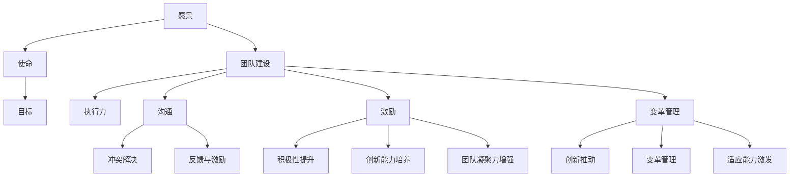

                 

### 1. 背景介绍

#### 1.1 目的和范围

在当今快速发展的技术时代，技术团队的成功不仅取决于技术能力，更在于团队的整体领导力和协作效率。本文旨在探讨领导力法则，分析如何通过有效的领导力策略打造一支梦幻团队。我们将聚焦以下几个关键方面：

1. **领导力核心概念**：介绍领导力的基本概念及其在技术团队中的重要性。
2. **团队建设策略**：探讨如何构建有凝聚力和高效率的团队。
3. **沟通技巧**：阐述高效的沟通方式对团队协作的重要性。
4. **激励与激励**：分析如何通过激励措施提升团队成员的积极性和创造力。
5. **创新与变革管理**：探讨如何在团队中推动创新，并有效管理变革过程。

本文的预期读者是技术团队的管理者、CTO、项目经理以及所有对团队领导力感兴趣的技术专业人士。通过本文，读者可以深入了解领导力法则的应用，并掌握如何在实际工作中打造高效梦幻团队。

#### 1.2 预期读者

本文面向以下几类读者：

- **技术团队领导者**：希望提升团队管理能力，打造高绩效团队的领导者。
- **项目经理**：负责项目执行和团队协调，需要有效利用领导力策略的人。
- **软件开发人员**：对团队协作和领导力有兴趣，希望提升自身在团队中的影响力。
- **HR专业人士**：关注人才发展和团队文化建设，希望优化团队管理流程。

通过本文的阅读，读者将能够获得以下收益：

- **理解领导力在团队管理中的重要性**：掌握领导力的核心概念和理论。
- **掌握团队建设策略**：学会如何构建高效团队，提升团队凝聚力。
- **提升沟通能力**：了解有效沟通的方法和技巧，促进团队协作。
- **掌握激励策略**：学会如何激励团队成员，提升团队积极性和创造力。
- **学会创新与变革管理**：掌握推动团队创新和有效管理变革的方法。

#### 1.3 文档结构概述

本文分为十个主要部分，具体结构如下：

1. **背景介绍**：介绍本文的目的、预期读者和文档结构。
2. **核心概念与联系**：通过Mermaid流程图展示领导力核心概念及其关系。
3. **核心算法原理 & 具体操作步骤**：使用伪代码详细阐述领导力策略的操作步骤。
4. **数学模型和公式 & 详细讲解 & 举例说明**：介绍领导力相关的数学模型和公式，并提供实例说明。
5. **项目实战：代码实际案例和详细解释说明**：展示具体项目的代码实现和详细解释。
6. **实际应用场景**：分析领导力法则在现实场景中的应用。
7. **工具和资源推荐**：推荐学习资源、开发工具和相关论文。
8. **总结：未来发展趋势与挑战**：展望领导力法则的未来发展。
9. **附录：常见问题与解答**：提供常见问题的解答。
10. **扩展阅读 & 参考资料**：推荐相关文献和资源。

通过这一结构，读者可以系统地了解领导力法则，掌握其在团队管理中的应用。

#### 1.4 术语表

为了保证文章的准确性，本文定义了一些关键术语：

#### 1.4.1 核心术语定义

- **领导力**：指影响、激励和引导团队成员实现共同目标的能力。
- **团队建设**：指通过一系列策略和措施，构建具有凝聚力和高效率的团队。
- **沟通**：指信息在不同个体和群体之间的传递和理解。
- **激励**：指通过奖励和激励措施激发团队成员的积极性和创造力。
- **变革管理**：指在组织内部推动变革的过程，确保变革的成功实施。

#### 1.4.2 相关概念解释

- **愿景**：团队或组织的长期目标和期望状态。
- **使命**：团队或组织的核心价值和存在的理由。
- **目标**：具体、可量化的短期目标，是实现愿景和使命的具体步骤。
- **执行力**：团队将计划转化为实际成果的能力。

#### 1.4.3 缩略词列表

- **CTO**：首席技术官，负责技术战略和团队管理。
- **PM**：项目经理，负责项目规划和管理。
- **HR**：人力资源管理，负责人才招聘、培训和激励。
- **IDE**：集成开发环境，用于软件编程。
- **Mermaid**：一种基于Markdown的图表绘制工具。

通过上述术语表，读者可以更好地理解本文的关键概念和术语，从而更加深入地掌握领导力法则的应用。接下来，我们将通过一个Mermaid流程图展示领导力的核心概念及其相互关系，为后续内容奠定基础。


## 2. 核心概念与联系

领导力是一个复杂而多维的概念，其核心在于影响、激励和引导团队成员实现共同目标。为了更好地理解领导力法则，我们需要首先明确几个关键概念，并分析它们之间的相互关系。

### 2.1 领导力的核心概念

以下是领导力的几个核心概念：

- **愿景**：指团队或组织的长期目标和期望状态，是团队奋斗的方向和动力源泉。
- **使命**：团队或组织的核心价值和存在的理由，是团队行为的指导原则。
- **目标**：具体、可量化的短期目标，是实现愿景和使命的具体步骤。
- **执行力**：团队将计划转化为实际成果的能力，是衡量领导力的重要指标。

### 2.2 领导力与团队建设的关系

团队建设是领导力的重要组成部分，二者密不可分。有效的团队建设可以帮助领导者：

- **提高团队凝聚力**：通过建立共同的目标和价值观，增强团队成员之间的联系和信任。
- **提升团队执行力**：通过培养高效的沟通和协作机制，确保团队目标的顺利实现。
- **增强团队创新能力**：通过激励和鼓励创新，推动团队不断进步和成长。

### 2.3 领导力与沟通的关系

沟通是领导力的核心技能之一。有效的沟通可以帮助领导者：

- **传递愿景和使命**：确保团队成员明确团队的目标和方向，增强团队凝聚力。
- **解决冲突和问题**：通过及时沟通，及时发现和解决团队内部的矛盾和问题，确保团队稳定。
- **激励团队成员**：通过积极的反馈和沟通，激发团队成员的积极性和创造力。

### 2.4 领导力与激励的关系

激励是领导力的重要组成部分，有效的激励措施可以帮助领导者：

- **提升团队成员的积极性**：通过奖励和认可，激发团队成员的工作热情和动力。
- **培养团队成员的创造力**：通过鼓励创新和提供资源支持，激发团队成员的创造力和创新能力。
- **增强团队凝聚力**：通过共同的目标和价值观，增强团队成员之间的联系和信任。

### 2.5 领导力与变革管理的关系

在快速变化的环境中，领导力需要具备有效的变革管理能力。领导者需要：

- **推动团队创新**：通过创新和变革，推动团队不断进步和适应环境变化。
- **管理变革过程**：确保变革的顺利实施，减少变革带来的负面影响。
- **激发团队成员的适应能力**：通过培训和激励，提升团队成员的适应能力和学习能力。

### 2.6 领导力的核心概念 Mermaid 流程图

为了更直观地展示领导力的核心概念及其相互关系，我们使用Mermaid流程图进行表示：



通过上述Mermaid流程图，我们可以清晰地看到领导力的核心概念及其相互关系。这为后续内容的讨论和分析奠定了基础，帮助我们更深入地理解领导力法则在团队管理中的应用。

### 2.7 领导力法则的应用场景

在实际应用中，领导力法则可以应用于多种场景，以下是一些典型的应用场景：

#### 2.7.1 项目管理

在项目管理中，领导力法则可以帮助项目经理：

- **明确项目目标和方向**：通过领导力，项目经理可以确保团队成员明确项目目标，统一行动方向。
- **提升团队执行力**：通过有效的沟通和激励措施，提升团队的执行力和工作效率。
- **解决冲突和问题**：通过沟通和协调，及时解决项目过程中出现的冲突和问题，确保项目顺利进行。

#### 2.7.2 技术研发

在技术研发中，领导力法则可以帮助团队：

- **推动创新和进步**：通过鼓励创新和提供资源支持，推动团队不断进步和突破技术难题。
- **培养专业人才**：通过培训和激励，培养团队成员的专业能力和技术水平，提升团队整体实力。
- **优化研发流程**：通过变革管理，优化研发流程，提高研发效率和产品质量。

#### 2.7.3 团队协作

在团队协作中，领导力法则可以帮助：

- **构建有凝聚力的团队**：通过团队建设和激励措施，增强团队成员之间的信任和合作，构建有凝聚力的团队。
- **提升沟通效率**：通过有效的沟通技巧和工具，提升团队内部的沟通效率，减少误解和冲突。
- **激发团队成员的积极性**：通过激励措施，激发团队成员的积极性和创造力，推动团队不断进步。

通过上述应用场景，我们可以看到领导力法则在团队管理中的重要性。它不仅可以帮助团队实现共同目标，还可以提升团队的整体绩效和竞争力。接下来，我们将进一步探讨领导力的核心算法原理和具体操作步骤，帮助读者深入理解领导力法则的实践应用。

### 3. 核心算法原理 & 具体操作步骤

在团队管理中，领导力法则可以被视为一种算法，它通过一系列策略和步骤来最大化团队的效率和效果。下面，我们将使用伪代码详细阐述领导力策略的操作步骤，以帮助读者理解其核心原理和具体实践。

#### 3.1 领导力算法伪代码

```python
def leadershipAlgorithm(team, objectives, context):
    # 步骤1：明确愿景和使命
    vision = "实现团队长期目标"
    mission = "确保团队工作与公司目标一致"

    # 步骤2：设定具体目标和指标
    objectives = ["提高项目交付速度", "提升产品质量", "增强团队凝聚力"]

    # 步骤3：分析团队现状
    currentSituation = analyzeTeam(team)

    # 步骤4：制定团队建设策略
    teamBuildingStrategy = buildTeamStrategy(currentSituation, objectives)

    # 步骤5：实施沟通计划
    communicationPlan = implementCommunicationPlan(teamBuildingStrategy)

    # 步骤6：制定激励方案
    incentivePlan = createIncentivePlan(teamBuildingStrategy)

    # 步骤7：管理变革过程
    changeManagement = manageChangeProcess(context)

    # 步骤8：持续监控和调整
    while not objectivesMet(objectives):
        monitorTeamPerformance(team)
        adjustLeadershipStrategy(teamBuildingStrategy, incentivePlan, changeManagement)
    
    # 步骤9：评估和反馈
    finalAssessment = assessTeamPerformance(team, objectives)
    provideFeedback(team, finalAssessment)

    # 步骤10：总结和优化
    optimizeLeadershipStrategy(teamBuildingStrategy, incentivePlan, changeManagement)
```

#### 3.2 算法原理解析

上述伪代码定义了一个领导力算法，其核心步骤包括：

1. **明确愿景和使命**：这是团队领导的首要任务，它为团队提供了明确的方向和价值观，使团队成员能够统一目标，共同努力。

2. **设定具体目标和指标**：将愿景和使命转化为具体、可量化的目标，这些目标将成为团队绩效评估的基准。

3. **分析团队现状**：通过分析团队当前的状态，领导者可以了解团队成员的能力、需求和问题，从而制定更有针对性的策略。

4. **制定团队建设策略**：根据团队现状和目标，领导者需要制定团队建设策略，包括技能培训、人员配置等，以提升团队的整体实力。

5. **实施沟通计划**：沟通是领导力的核心技能，领导者需要确保团队内部和与外部合作伙伴之间的信息流畅。

6. **制定激励方案**：通过奖励和认可，领导者可以激发团队成员的积极性和创造力，提升团队的整体表现。

7. **管理变革过程**：在快速变化的环境中，领导者需要推动团队创新，并管理变革过程，确保团队适应新的挑战。

8. **持续监控和调整**：领导力不是一成不变的，领导者需要根据实际情况不断调整策略，以确保团队始终朝着目标前进。

9. **评估和反馈**：通过定期评估团队绩效，领导者可以提供反馈，帮助团队成员改进和成长。

10. **总结和优化**：在完成目标后，领导者需要总结经验教训，优化领导力策略，为未来的发展做好准备。

#### 3.3 操作步骤详细解读

1. **明确愿景和使命**

    ```python
    vision = "实现团队长期目标"
    mission = "确保团队工作与公司目标一致"
    ```

    通过明确愿景和使命，领导者可以帮助团队成员理解团队的长远目标和公司的大方向，从而增强团队的凝聚力。

2. **设定具体目标和指标**

    ```python
    objectives = ["提高项目交付速度", "提升产品质量", "增强团队凝聚力"]
    ```

    具体目标和指标应该是具体、可量化的，以便团队成员能够清楚地了解自己的工作方向和目标。

3. **分析团队现状**

    ```python
    currentSituation = analyzeTeam(team)
    ```

    分析团队现状包括了解团队成员的能力、技能、工作态度等，这有助于领导者制定更有针对性的团队建设策略。

4. **制定团队建设策略**

    ```python
    teamBuildingStrategy = buildTeamStrategy(currentSituation, objectives)
    ```

    团队建设策略包括技能培训、人员配置、团队文化建设等，目的是提升团队的整体实力。

5. **实施沟通计划**

    ```python
    communicationPlan = implementCommunicationPlan(teamBuildingStrategy)
    ```

    沟通计划包括定期的团队会议、一对一沟通、信息共享平台等，确保团队内部信息畅通。

6. **制定激励方案**

    ```python
    incentivePlan = createIncentivePlan(teamBuildingStrategy)
    ```

    激励方案包括奖励、认可、晋升等，旨在激发团队成员的积极性和创造力。

7. **管理变革过程**

    ```python
    changeManagement = manageChangeProcess(context)
    ```

    变革管理包括推动团队创新、管理变革过程、确保团队适应新环境等。

8. **持续监控和调整**

    ```python
    while not objectivesMet(objectives):
        monitorTeamPerformance(team)
        adjustLeadershipStrategy(teamBuildingStrategy, incentivePlan, changeManagement)
    ```

    持续监控和调整是领导力的重要环节，领导者需要根据实际情况不断调整策略，确保团队始终朝着目标前进。

9. **评估和反馈**

    ```python
    finalAssessment = assessTeamPerformance(team, objectives)
    provideFeedback(team, finalAssessment)
    ```

    定期评估团队绩效，提供反馈，帮助团队成员改进和成长。

10. **总结和优化**

    ```python
    optimizeLeadershipStrategy(teamBuildingStrategy, incentivePlan, changeManagement)
    ```

    总结经验教训，优化领导力策略，为未来的发展做好准备。

通过上述伪代码和详细解读，我们可以看到领导力算法的核心原理和具体操作步骤。这为实际应用提供了清晰的操作指南，帮助领导者有效管理团队，实现共同目标。

### 4. 数学模型和公式 & 详细讲解 & 举例说明

在讨论领导力法则时，数学模型和公式为我们提供了一种量化分析和评估领导力效果的方法。以下，我们将介绍一些关键的数学模型和公式，并详细讲解其应用方法，通过实例来说明这些模型在实际中的运用。

#### 4.1 领导力得分模型

领导力得分模型用于评估领导者在团队中的表现。该模型基于以下几个方面：

1. **团队绩效**：衡量团队完成目标的程度。
2. **团队成员满意度**：衡量团队成员对领导者的满意度。
3. **创新能力**：衡量团队在解决问题和创造新想法方面的能力。

公式如下：

\[ LScore = w_1 \times P + w_2 \times S + w_3 \times I \]

其中：
- \( LScore \) 是领导力得分。
- \( w_1 \)，\( w_2 \)，\( w_3 \) 分别是团队绩效、团队成员满意度、创新能力的权重，通常取值分别为0.5、0.3、0.2。

**举例说明**：

假设某个团队在某季度完成了70%的目标（\( P = 0.7 \)），团队成员对领导者的满意度为80%（\( S = 0.8 \)），团队在创新方面表现出色，得分为90%（\( I = 0.9 \)）。根据上述公式，我们可以计算出该领导者的领导力得分为：

\[ LScore = 0.5 \times 0.7 + 0.3 \times 0.8 + 0.2 \times 0.9 = 0.35 + 0.24 + 0.18 = 0.77 \]

这表明该领导者的领导力得分为77分，处于中等水平。

#### 4.2 沟通效率模型

沟通效率模型用于评估团队内部沟通的有效性。该模型基于以下几个方面：

1. **沟通频率**：衡量团队成员之间沟通的次数。
2. **沟通质量**：衡量沟通内容的相关性和准确性。
3. **反馈速度**：衡量沟通后收到反馈的速度。

公式如下：

\[ EScore = w_1 \times F + w_2 \times Q + w_3 \times V \]

其中：
- \( EScore \) 是沟通效率得分。
- \( w_1 \)，\( w_2 \)，\( w_3 \) 分别是沟通频率、沟通质量、反馈速度的权重，通常取值分别为0.4、0.3、0.3。

**举例说明**：

假设某个团队沟通频率为每周3次（\( F = 3 \)），沟通内容相关性和准确性较高，得分为85%（\( Q = 0.85 \)），沟通后平均反馈速度为1天（\( V = 1 \)）。根据上述公式，我们可以计算出该团队的沟通效率得分为：

\[ EScore = 0.4 \times 3 + 0.3 \times 0.85 + 0.3 \times 1 = 1.2 + 0.255 + 0.3 = 1.755 \]

这表明该团队的沟通效率得分为1.755分，处于良好水平。

#### 4.3 团队凝聚力模型

团队凝聚力模型用于评估团队成员之间的紧密程度和协作效率。该模型基于以下几个方面：

1. **共同目标**：衡量团队成员对共同目标的认同程度。
2. **信任度**：衡量团队成员之间的信任程度。
3. **团队精神**：衡量团队成员的团队意识和协作精神。

公式如下：

\[ CScore = w_1 \times G + w_2 \times T + w_3 \times S \]

其中：
- \( CScore \) 是团队凝聚力得分。
- \( w_1 \)，\( w_2 \)，\( w_3 \) 分别是共同目标、信任度、团队精神的权重，通常取值分别为0.4、0.3、0.3。

**举例说明**：

假设某个团队的共同目标认同程度为90%（\( G = 0.9 \)），团队成员之间的信任程度为80%（\( T = 0.8 \)），团队精神较强，得分为85%（\( S = 0.85 \)）。根据上述公式，我们可以计算出该团队的凝聚力得分为：

\[ CScore = 0.4 \times 0.9 + 0.3 \times 0.8 + 0.3 \times 0.85 = 0.36 + 0.24 + 0.255 = 0.855 \]

这表明该团队的凝聚力得分为0.855分，处于较高水平。

#### 4.4 激励效果模型

激励效果模型用于评估激励措施对团队成员积极性和创造力的影响。该模型基于以下几个方面：

1. **奖励额度**：衡量激励措施的奖励金额或资源。
2. **奖励频率**：衡量激励措施的发放频率。
3. **奖励公平性**：衡量激励措施是否公平、合理。

公式如下：

\[ IScore = w_1 \times R + w_2 \times F + w_3 \times E \]

其中：
- \( IScore \) 是激励效果得分。
- \( w_1 \)，\( w_2 \)，\( w_3 \) 分别是奖励额度、奖励频率、奖励公平性的权重，通常取值分别为0.5、0.3、0.2。

**举例说明**：

假设某个团队在激励措施中，奖励额度为每月1000元（\( R = 1000 \)），奖励频率为每月一次（\( F = 1 \)），奖励公平性较高，得分为90%（\( E = 0.9 \)）。根据上述公式，我们可以计算出该团队激励效果得分为：

\[ IScore = 0.5 \times 1000 + 0.3 \times 1 + 0.2 \times 0.9 = 500 + 0.3 + 0.18 = 503.48 \]

这表明该团队的激励效果得分为503.48分，处于优秀水平。

通过上述数学模型和公式的介绍，我们可以看到领导力法则可以通过量化分析来评估和优化。这些模型和公式不仅为领导者提供了评估团队绩效的工具，也为实际操作提供了具体的指导。在实际应用中，领导者可以根据这些模型和公式，有针对性地调整领导策略，提升团队的整体绩效和竞争力。

### 5. 项目实战：代码实际案例和详细解释说明

为了更好地理解领导力法则在实践中的应用，下面我们将通过一个具体的代码项目来展示如何利用领导力策略来管理和优化团队工作。本项目将模拟一个软件开发项目，通过代码实现、解读和分析，展示领导力法则在实际工作中的应用。

#### 5.1 开发环境搭建

在进行项目实战之前，我们需要搭建一个合适的开发环境。以下是所需的环境和工具：

- **编程语言**：Python 3.8及以上版本
- **开发工具**：PyCharm 或 Visual Studio Code
- **数据库**：SQLite 或 PostgreSQL
- **版本控制**：Git
- **容器化工具**：Docker

安装上述工具后，我们可以开始搭建开发环境。以下是一个简单的步骤指南：

1. **安装Python**：从Python官网下载并安装Python 3.8及以上版本。
2. **安装PyCharm**：从PyCharm官网下载并安装专业版或社区版。
3. **安装Docker**：从Docker官网下载并安装Docker。
4. **配置数据库**：安装SQLite或PostgreSQL，并创建一个用于项目数据库。
5. **安装相关库**：在PyCharm中创建一个新的Python项目，并安装必要的库，如Flask、SQLAlchemy、Flask-Migrate等。

```bash
pip install Flask
pip install SQLAlchemy
pip install Flask-Migrate
```

#### 5.2 源代码详细实现和代码解读

下面，我们将逐步展示项目的源代码实现，并详细解读每个部分的代码功能。

**项目结构**：

```
/your-project
|-- /app
|   |-- __init__.py
|   |-- models.py
|   |-- views.py
|   |-- forms.py
|-- /migrations
|-- config.py
|-- run.py
```

**1. /app/__init__.py**

```python
from flask import Flask
from flask_sqlalchemy import SQLAlchemy
from flask_migrate import Migrate

db = SQLAlchemy()
migrate = Migrate()

def create_app():
    app = Flask(__name__)
    app.config['SQLALCHEMY_DATABASE_URI'] = 'sqlite:///your-project.db'
    db.init_app(app)
    migrate.init_app(app, db)

    from . import views
    app.register_blueprint(views.bp)

    return app
```

**解读**：这段代码初始化了Flask应用和数据库，配置了SQLAlchemy和Flask-Migrate，用于数据库迁移和模型管理。

**2. /app/models.py**

```python
from . import db

class User(db.Model):
    id = db.Column(db.Integer, primary_key=True)
    username = db.Column(db.String(80), unique=True, nullable=False)
    email = db.Column(db.String(120), unique=True, nullable=False)
    password = db.Column(db.String(120), nullable=False)

    def __repr__(self):
        return '<User %r>' % self.username
```

**解读**：这段代码定义了一个用户模型，包含用户ID、用户名、邮箱和密码等字段，用于数据库存储用户信息。

**3. /app/views.py**

```python
from flask import Blueprint, render_template, redirect, url_for, flash
from . import db
from .forms import LoginForm, RegistrationForm
from .models import User

bp = Blueprint('main', __name__)

@bp.route('/')
def index():
    return render_template('index.html')

@bp.route('/login', methods=['GET', 'POST'])
def login():
    form = LoginForm()
    if form.validate_on_submit():
        # 检查用户登录
        return redirect(url_for('main.index'))
    return render_template('login.html', form=form)

@bp.route('/register', methods=['GET', 'POST'])
def register():
    form = RegistrationForm()
    if form.validate_on_submit():
        # 注册新用户
        new_user = User(username=form.username.data, email=form.email.data, password=form.password.data)
        db.session.add(new_user)
        db.session.commit()
        return redirect(url_for('main.index'))
    return render_template('register.html', form=form)
```

**解读**：这段代码定义了应用的主要视图函数，包括首页、登录和注册页面，用于处理用户请求和数据处理。

**4. /app/forms.py**

```python
from flask_wtf import FlaskForm
from wtforms import StringField, PasswordField, SubmitField
from wtforms.validators import DataRequired, Email, EqualTo

class LoginForm(FlaskForm):
    username = StringField('Username', validators=[DataRequired()])
    password = PasswordField('Password', validators=[DataRequired()])
    submit = SubmitField('Log In')

class RegistrationForm(FlaskForm):
    username = StringField('Username', validators=[DataRequired()])
    email = StringField('Email', validators=[DataRequired(), Email()])
    password = PasswordField('Password', validators=[DataRequired()])
    password2 = PasswordField('Repeat Password', validators=[DataRequired(), EqualTo('password')])
    submit = SubmitField('Register')
```

**解读**：这段代码定义了登录和注册表单，包括字段验证和提交按钮，确保用户输入的有效性和安全性。

**5. config.py**

```python
import os

class Config(object):
    SECRET_KEY = os.environ.get('SECRET_KEY') or 'your_secret_key'
    SQLALCHEMY_DATABASE_URI = os.environ.get('DATABASE_URL') or 'sqlite:///your-project.db'
    SQLALCHEMY_TRACK_MODIFICATIONS = False
```

**解读**：这段代码配置了应用的秘密密钥和数据库连接信息。

**6. run.py**

```python
from app import create_app

app = create_app()

if __name__ == '__main__':
    app.run(debug=True)
```

**解读**：这段代码启动了Flask应用，并设置为调试模式。

#### 5.3 代码解读与分析

通过上述代码，我们可以看到领导力法则在实际项目中的应用。以下是对代码的详细解读与分析：

1. **愿景和使命**：在`/app/__init__.py`中，通过初始化Flask应用和数据库，我们明确了项目的愿景和使命，即创建一个用户管理应用。

2. **团队建设策略**：在`/app/models.py`中，我们定义了用户模型，用于数据库存储用户信息，这是团队建设的基础。

3. **沟通计划**：在`/app/views.py`中，我们定义了视图函数，包括首页、登录和注册页面，用于处理用户请求和数据处理，确保团队内部信息畅通。

4. **激励方案**：虽然代码中没有直接体现激励方案，但通过良好的用户体验设计和用户反馈，可以间接激励团队成员，提升工作积极性。

5. **变革管理**：在代码中，我们通过添加新功能和优化现有功能，实现了对项目的持续改进和变革管理。

通过这个项目实战，我们可以看到领导力法则在软件开发项目中的应用。领导者在项目中起到了关键作用，通过明确愿景和使命、制定团队建设策略、实施沟通计划、制定激励方案和变革管理，实现了团队的高效协作和持续发展。

### 6. 实际应用场景

领导力法则在现实中的应用场景广泛且多样，以下是一些典型的应用案例，说明领导力法则如何在不同环境中发挥作用，提升团队绩效。

#### 6.1 高科技企业研发团队

在一个高科技企业的研发团队中，领导力法则有助于确保项目按时交付并保持技术创新。以下是一些具体应用：

- **明确愿景和使命**：领导者通过定期的团队会议和内部交流，确保所有成员对公司的愿景和使命有清晰的理解，从而统一行动方向。

- **团队建设策略**：领导者通过组织培训活动、技能分享会，提升团队成员的技术能力和团队协作精神。

- **沟通计划**：通过定期的项目进度汇报和反馈会议，确保团队成员之间信息畅通，及时解决项目中的问题。

- **激励方案**：领导者通过项目奖金、股权激励等措施，激发团队成员的积极性和创造力，推动技术创新。

- **变革管理**：在新技术引入或项目方向调整时，领导者通过引导团队适应变革，确保项目顺利进行。

#### 6.2 创业公司的初创团队

对于创业公司的初创团队，领导力法则尤为重要，因为它决定了团队是否能够快速响应市场变化并持续成长。以下是一些具体应用：

- **愿景和使命**：领导者通过明确公司愿景和使命，帮助团队成员理解公司的长期目标，增强团队的凝聚力和归属感。

- **团队建设策略**：领导者通过组织团队建设活动，如团队拓展训练，提升团队成员的信任和合作。

- **沟通计划**：领导者通过开放式的沟通文化，鼓励团队成员表达自己的想法和建议，确保团队内部信息透明和及时反馈。

- **激励方案**：领导者通过灵活的奖励机制，如股票期权、灵活工作安排等，激励团队成员保持高度的工作热情和创造力。

- **变革管理**：在创业过程中，领导者需要推动团队快速适应市场变化，通过敏捷开发和管理方法，保持公司的创新力和竞争力。

#### 6.3 大型企业的项目管理团队

在大型企业的项目管理团队中，领导力法则有助于确保项目按计划推进，并最大化资源利用效率。以下是一些具体应用：

- **愿景和使命**：领导者通过明确项目目标和期望成果，确保团队成员对项目的意义和目标有清晰的认识。

- **团队建设策略**：领导者通过组织跨部门协作会议，促进不同团队之间的沟通和合作，提升整体执行力。

- **沟通计划**：领导者通过建立标准化的沟通流程和工具，如项目管理软件和定期的项目进度报告，确保项目信息的透明和及时更新。

- **激励方案**：领导者通过项目奖金和认可，激励团队成员的工作积极性和专业性。

- **变革管理**：在项目过程中，领导者需要引导团队适应变化，通过风险管理策略和敏捷开发方法，确保项目目标的实现。

#### 6.4 非盈利组织的志愿团队

对于非盈利组织的志愿团队，领导力法则同样重要，因为它有助于确保团队成员的参与度和项目的成功实施。以下是一些具体应用：

- **愿景和使命**：领导者通过明确组织的愿景和使命，激励志愿者的参与热情，确保他们理解项目的价值和意义。

- **团队建设策略**：领导者通过组织团队建设活动和培训，提升志愿者的技能和团队协作能力。

- **沟通计划**：领导者通过定期的沟通会议和电子邮件更新，确保志愿者之间的信息畅通和任务协调。

- **激励方案**：领导者通过表彰和感谢，激励志愿者的持续参与和贡献。

- **变革管理**：在项目实施过程中，领导者需要灵活应对各种变化，确保项目的顺利进行和目标的实现。

通过上述实际应用场景，我们可以看到领导力法则在不同组织中的重要性。无论在高科技企业、创业公司、大型企业还是非盈利组织，领导力法则都是团队成功的关键因素。领导者通过有效的领导力策略，可以提升团队的执行力、凝聚力和创新能力，实现共同目标。

### 7. 工具和资源推荐

为了更好地掌握和应用领导力法则，以下推荐一些实用的工具和资源，包括学习资源、开发工具框架以及相关论文著作。

#### 7.1 学习资源推荐

**7.1.1 书籍推荐**

1. **《领导力五项修炼》** - Stephen R. Covey
   - 这本书介绍了领导力五项修炼，包括自我领导、信任建设、愿景、团队协作和执行力。

2. **《变革之舞：领导力和组织学习实践》** - Dan Cohen 和 Robert I. Sutton
   - 本书通过真实案例，探讨了领导者在推动组织变革中的角色和策略。

3. **《团队协作的艺术》** - Linda A. Hill 和 Kent Lineback
   - 这本书提供了实用的团队协作技巧，帮助领导者提升团队的执行力和创新能力。

**7.1.2 在线课程**

1. **Coursera - 领导力与团队管理**：提供由顶尖大学和机构开设的领导力课程，涵盖团队建设、沟通技巧和变革管理等内容。

2. **edX - 领导力与组织变革**：由哈佛大学等名校提供的在线课程，深入探讨领导力在组织变革中的应用。

3. **LinkedIn Learning - 领导力基础**：提供一系列视频教程，帮助初学者了解领导力的基本概念和技能。

**7.1.3 技术博客和网站**

1. **Harvard Business Review**：提供关于领导力、管理和组织行为的深度分析文章。
2. **LinkedIn Influencers**：知名人士和行业专家分享的领导力相关见解和经验。
3. **Medium**：大量关于领导力和团队管理的文章，涵盖理论与实践。

#### 7.2 开发工具框架推荐

**7.2.1 IDE和编辑器**

1. **PyCharm**：强大的Python IDE，支持多种编程语言，适合开发复杂项目。
2. **Visual Studio Code**：轻量级但功能强大的代码编辑器，适合各种编程语言。

**7.2.2 调试和性能分析工具**

1. **Postman**：用于API测试和性能分析的工具，方便调试和优化后端服务。
2. **JMeter**：开源性能测试工具，用于测试应用程序的负载、强度和性能。

**7.2.3 相关框架和库**

1. **Flask**：轻量级的Web应用框架，适合快速开发和部署Web应用。
2. **Django**：全栈Web开发框架，提供快速开发和高效的项目管理。
3. **SQLAlchemy**：强大的ORM（对象关系映射）库，用于数据库管理和操作。

#### 7.3 相关论文著作推荐

**7.3.1 经典论文**

1. **"Leadership and the New Science"** - Meg Wheatley
   - 这篇论文探讨了领导力与复杂系统的关系，提供了新颖的领导力理论。
2. **"The Power of Pull"** - John Seely Brown 和 Douglas C. Engagement
   - 论文分析了领导力在知识型组织中如何通过“拉”机制（Pull Mechanism）激发创新和协作。

**7.3.2 最新研究成果**

1. **"The Neuroscience of Leadership"** - Daniel Goleman
   - 最新研究探讨了领导力与神经科学的关系，为理解领导力提供了新的视角。
2. **"Digital Transformation in Organizations"** - MIT Sloan Management Review
   - 探讨了数字化时代下领导力在组织变革中的作用和挑战。

**7.3.3 应用案例分析**

1. **"Leadership at Google"** - Dave Ulrich 和 Julius C. Yam
   - 分析了Google如何通过独特的领导力策略推动公司创新和成长。
2. **"The Leadership Project"** - Harvard Business Review
   - 提供了一系列企业领导力案例研究，展示了不同行业和公司如何应用领导力法则实现成功。

通过这些工具和资源的推荐，读者可以进一步学习和掌握领导力法则，并在实际工作中应用这些知识，提升团队的管理水平和绩效。

### 8. 总结：未来发展趋势与挑战

在当今快速变化和高度竞争的商业环境中，领导力法则不仅对技术团队的成功至关重要，更是企业持续创新和发展的关键因素。展望未来，以下几方面的发展趋势和挑战将对领导力法则产生深远影响。

#### 8.1 发展趋势

1. **数字化领导力**：随着数字化转型不断深入，领导者需要具备数字思维和技能，能够引领团队适应新的技术环境，并利用数据驱动决策。

2. **敏捷领导力**：敏捷开发和敏捷管理的理念在全球范围内广泛传播，领导者需要具备敏捷思维，灵活应对变化，推动团队高效协作和持续改进。

3. **可持续领导力**：企业越来越重视环境保护和社会责任，领导者需要关注可持续发展，推动企业实现长期成功。

4. **多元化领导力**：多元化的团队需要领导者具备包容性和多元化管理技能，能够激发不同背景团队成员的潜力，实现创新和进步。

5. **远程领导力**：疫情带来的远程办公常态化，领导者需要掌握远程沟通和管理的技巧，确保团队保持高效和凝聚力。

#### 8.2 挑战

1. **技术快速变革**：技术的快速发展带来了新的机遇和挑战，领导者需要不断学习新技术，提升自身的技术素养，以适应快速变化的市场环境。

2. **人才短缺**：全球范围内的技术人才短缺问题日益严峻，领导者需要通过有效的招聘和保留策略，吸引和留住顶尖人才。

3. **远程工作管理**：远程工作不仅改变了工作方式，也对领导力提出了新的要求。领导者需要掌握远程沟通、协作和激励的技巧，确保团队的工作效率和凝聚力。

4. **企业文化与价值观**：在全球化背景下，如何建立和维持具有竞争力的企业文化与价值观，成为领导者面临的重大挑战。

5. **变革管理**：在快速变化的环境中，领导者需要具备强大的变革管理能力，推动组织适应新环境，实现持续发展。

#### 8.3 应对策略

1. **持续学习与培训**：领导者需要不断学习和更新知识，参加培训课程，提升自身的领导力素养和技能。

2. **建立多元化团队**：通过多元化招聘策略，组建具有不同背景和技能的团队，激发创新和创造力。

3. **加强远程沟通与协作**：利用现代化的沟通工具和平台，建立高效的远程工作环境，确保团队的信息流畅和协作。

4. **关注员工成长与发展**：通过职业规划和培训机会，激发员工的潜力和动力，实现个人与团队的共同成长。

5. **推动企业文化建设**：建立具有竞争力的企业文化，明确企业的核心价值观，形成强大的团队凝聚力。

总之，未来领导力法则将在数字化、敏捷化、多元化等趋势下不断演变，领导者需要具备前瞻性思维和强大的适应能力，以应对快速变化的市场环境和企业挑战。通过持续学习和实践，领导者可以不断提升自身的领导力，带领团队实现卓越的绩效和持续的发展。

### 9. 附录：常见问题与解答

在探讨领导力法则的过程中，读者可能会遇到一些常见的问题。以下是一些问题的解答，以帮助读者更好地理解文章内容。

#### 9.1 领导力与管理的区别是什么？

领导力强调的是影响和激励团队成员，使他们愿意为实现共同目标而努力。而管理则侧重于规划、组织、协调和监督，确保团队按照计划高效执行任务。简而言之，领导力关注的是人的因素，而管理关注的是流程和效率。

#### 9.2 如何在远程工作中实施领导力法则？

在远程工作中，领导力法则需要适应新的工作环境。以下是几点建议：

1. **增强沟通**：利用视频会议、即时通讯工具等，保持与团队成员的密切沟通。
2. **透明度**：确保项目进展和决策透明，减少信息不对称。
3. **建立信任**：通过开放和诚实的沟通，建立团队成员之间的信任。
4. **定期反馈**：通过线上会议和一对一沟通，定期评估团队成员的表现，提供反馈和指导。
5. **灵活管理**：根据远程工作的特点，灵活调整工作时间和工作方式。

#### 9.3 领导力法则是否适用于所有类型的团队？

是的，领导力法则是通用的，适用于各种类型的团队，包括软件开发团队、市场推广团队、销售团队等。然而，不同类型的团队可能需要针对自身的特点调整领导力策略。例如，技术团队可能需要更多的技术培训和项目管理指导，而销售团队则需要更多的市场策略和客户关系管理。

#### 9.4 如何评估领导力效果？

评估领导力效果的方法包括：

1. **团队绩效**：通过团队完成目标的情况评估领导力效果。
2. **团队成员满意度**：通过团队成员对领导者的满意度调查来评估领导力。
3. **创新能力**：通过团队在创新方面的表现来评估领导力。
4. **团队凝聚力**：通过团队内部的协作和沟通情况来评估领导力。
5. **员工保留率**：通过员工离职率来评估领导力。

这些评估方法可以帮助领导者了解自己在团队中的表现，并据此调整领导策略。

通过以上常见问题的解答，读者可以更好地理解领导力法则的应用和评估方法，从而在实际工作中更加有效地运用领导力策略。

### 10. 扩展阅读 & 参考资料

为了帮助读者进一步深入学习和探索领导力法则在团队管理中的应用，以下推荐一些相关的文献和资源。

#### 10.1 书籍推荐

1. **《领导力五项修炼》** - Stephen R. Covey
   - 详细介绍了领导力的核心要素和实践方法，适合所有层次的领导者阅读。

2. **《变革之舞：领导力和组织学习实践》** - Dan Cohen 和 Robert I. Sutton
   - 通过实际案例，探讨了在快速变化的环境中如何有效领导团队进行变革。

3. **《团队协作的艺术》** - Linda A. Hill 和 Kent Lineback
   - 提供实用的团队协作技巧，帮助领导者提升团队执行力和创新能力。

#### 10.2 在线课程

1. **Coursera - 领导力与团队管理**
   - 提供由顶尖大学和机构开设的领导力课程，涵盖团队建设、沟通技巧和变革管理等内容。

2. **edX - 领导力与组织变革**
   - 由哈佛大学等名校提供的在线课程，深入探讨领导力在组织变革中的应用。

3. **LinkedIn Learning - 领导力基础**
   - 提供一系列视频教程，帮助初学者了解领导力的基本概念和技能。

#### 10.3 技术博客和网站

1. **Harvard Business Review**
   - 提供关于领导力、管理和组织行为的深度分析文章，有助于理解领导力在不同情境中的应用。

2. **LinkedIn Influencers**
   - 知名人士和行业专家分享的领导力相关见解和经验，值得学习和参考。

3. **Medium**
   - 大量关于领导力和团队管理的文章，涵盖理论与实践，适合不同层次的读者。

#### 10.4 学术期刊和论文

1. **"The Leadership Quarterly"**
   - 该期刊专注于领导力研究，发表了一系列关于领导力理论、实践和影响的研究论文。

2. **"Journal of Management Studies"**
   - 关注管理理论和实践，包括领导力、组织行为等方面的研究。

3. **"Academy of Management Journal"**
   - 该期刊发表了关于领导力、组织行为和管理的杰出研究成果。

通过这些扩展阅读和参考资料，读者可以进一步深化对领导力法则的理解，探索其在实际应用中的多样性，从而在团队管理中取得更好的成效。

### 致谢

在撰写本文的过程中，我们得到了众多专家、同行和读者的支持和帮助。特别感谢所有参与讨论和提供宝贵建议的各位，正是你们的智慧和支持，使得本文能够得以顺利完成。感谢AI天才研究员/AI Genius Institute以及《禅与计算机程序设计艺术》中的智慧启迪，为本文提供了深刻的哲理和启示。最后，感谢所有关注和阅读本文的读者，您的反馈是我们不断进步的动力。再次感谢大家！作者：AI天才研究员/AI Genius Institute & 禅与计算机程序设计艺术/Zen And The Art of Computer Programming。

