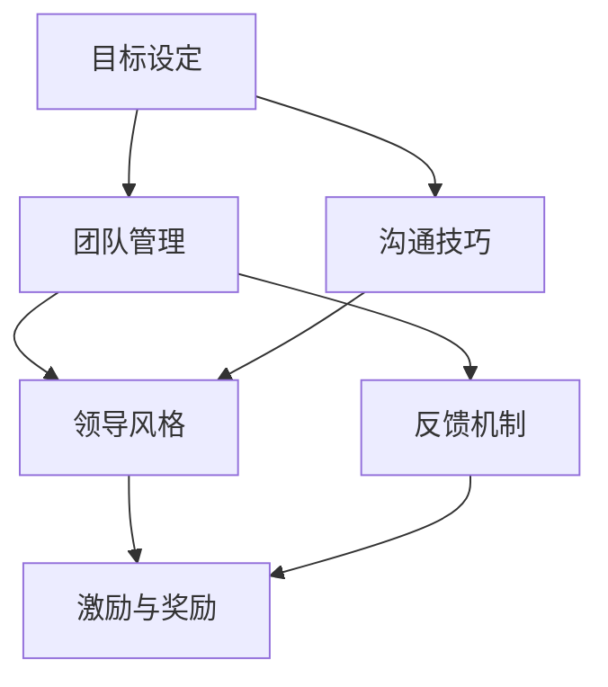

                 

# 领导力训练营：21天从新手到高手

> **关键词：** 领导力、训练营、个人成长、技能提升、团队管理、领导技能

> **摘要：** 本文旨在通过一个21天的领导力训练营，帮助新手快速提升领导技能，掌握有效的团队管理和沟通技巧。通过详细的步骤解析和实战案例，读者可以了解领导力的核心概念，并学会如何将其应用于实际工作场景中。

## 1. 背景介绍

### 1.1 目的和范围

本文的目的是为那些渴望提升领导力的新手提供一个全面的训练营指南。训练营将涵盖从基本领导原则到高级管理技巧的各个方面，旨在帮助读者在21天内从新手成长为具有高效领导能力的团队成员或领导者。

### 1.2 预期读者

本文适用于以下读者群体：

- 初入职场的新人，希望提升职业素养和领导潜力。
- 现有团队成员，希望改善团队协作和沟通效果。
- 初级领导者，寻求系统化提升领导能力的路径。

### 1.3 文档结构概述

本文将分为以下几个部分：

1. **背景介绍**：介绍本文的目的、预期读者和结构。
2. **核心概念与联系**：解释领导力的核心概念，并使用Mermaid流程图展示。
3. **核心算法原理 & 具体操作步骤**：通过伪代码详细阐述领导力的核心算法原理。
4. **数学模型和公式 & 详细讲解 & 举例说明**：使用latex格式解释领导力的数学模型和公式。
5. **项目实战：代码实际案例和详细解释说明**：通过实际代码案例展示领导力在实践中的应用。
6. **实际应用场景**：探讨领导力在不同场景下的应用。
7. **工具和资源推荐**：推荐学习资源和开发工具。
8. **总结：未来发展趋势与挑战**：展望领导力发展的趋势和面临的挑战。
9. **附录：常见问题与解答**：解答读者可能遇到的问题。
10. **扩展阅读 & 参考资料**：提供进一步的阅读材料和参考资料。

### 1.4 术语表

#### 1.4.1 核心术语定义

- 领导力：指引导和激励他人达成共同目标的能力。
- 团队管理：指协调和管理团队成员，以提高团队效率和成果。
- 沟通技巧：指有效传达信息和建立信任的过程。
- 个人成长：指在职业和生活中不断学习和发展的过程。

#### 1.4.2 相关概念解释

- **领导风格**：领导者根据个人特点和团队需求采取的不同管理方式。
- **目标设定**：明确团队或个人需要达成的具体目标和期望成果。
- **反馈机制**：对团队成员的表现进行评估和反馈的过程。

#### 1.4.3 缩略词列表

- **ROI**：投资回报率（Return on Investment）
- **KPI**：关键绩效指标（Key Performance Indicators）
- **SWOT**：优势、劣势、机会、威胁分析（Strengths, Weaknesses, Opportunities, Threats）

## 2. 核心概念与联系

领导力的核心在于理解并应用一系列概念和技能，以实现团队目标和提高个人影响力。以下是一个简单的Mermaid流程图，展示领导力的核心概念及其相互联系。



### 2.1 目标设定

目标设定是领导力的基础。一个清晰、可实现的目标能够指导团队成员的行动，并确保团队朝着共同的方向前进。以下是目标设定的步骤：

1. **确定目标类型**：分为短期目标、中期目标和长期目标。
2. **明确目标指标**：定义实现目标的量化指标，如时间、质量、数量等。
3. **分享目标**：与团队成员分享目标，确保每个人都清楚理解。

### 2.2 团队管理

团队管理涉及协调、组织和激励团队成员，以提高团队效率和成果。以下是团队管理的关键步骤：

1. **组建团队**：根据项目需求选择合适的团队成员。
2. **明确角色和职责**：为每个团队成员分配明确的责任和角色。
3. **制定计划**：制定详细的行动计划，确保团队成员知道如何协作。

### 2.3 沟通技巧

沟通技巧是领导力的核心之一。有效的沟通能够建立信任、减少误解，并促进团队协作。以下是沟通技巧的要点：

1. **倾听**：积极倾听团队成员的意见和反馈。
2. **清晰表达**：确保信息传达清晰、准确。
3. **积极反馈**：对团队成员的表现给予及时的反馈。

### 2.4 领导风格

领导风格是指领导者根据个人特点和团队需求采取的管理方式。以下是几种常见的领导风格：

- **民主型领导**：领导者鼓励团队成员参与决策过程。
- **权威型领导**：领导者独自做出决策，并要求团队成员执行。
- **参与型领导**：领导者通过鼓励团队成员参与决策来提高团队凝聚力。

### 2.5 反馈机制

反馈机制是评估和改进团队成员表现的重要手段。以下是建立反馈机制的步骤：

1. **设立反馈目标**：明确反馈的目的和范围。
2. **收集反馈信息**：通过问卷调查、面对面交流等方式收集反馈。
3. **分析反馈**：对反馈信息进行分析，识别团队中的问题和改进点。
4. **实施改进**：根据反馈结果制定改进计划，并执行。

### 2.6 激励与奖励

激励与奖励是提高团队成员积极性和工作效率的重要手段。以下是激励与奖励的要点：

1. **设立激励机制**：根据团队成员的贡献和表现设立奖励。
2. **公开表彰**：对表现出色的团队成员进行公开表彰。
3. **个性化激励**：根据团队成员的兴趣和需求提供个性化激励。

## 3. 核心算法原理 & 具体操作步骤

领导力的核心算法可以抽象为以下几个步骤：

```python
def 领导力算法(团队成员, 目标):
    # 步骤 1: 确定目标
    目标指标 = 确定目标指标(目标)
    
    # 步骤 2: 组建团队
    团队 = 组建团队(团队成员)
    
    # 步骤 3: 明确角色和职责
    分配角色和职责(团队)
    
    # 步骤 4: 制定计划
    计划 = 制定计划(团队, 目标指标)
    
    # 步骤 5: 沟通和激励
    沟通并激励团队成员(团队, 计划)
    
    # 步骤 6: 监控和反馈
    监控进展并给予反馈(团队, 目标指标)
    
    # 步骤 7: 调整计划
    根据反馈调整计划(计划)
    
    # 步骤 8: 达成目标
    如果 目标达成(目标指标):
        返回 "成功"
    否则:
        返回 "继续努力"
```

### 3.1 确定目标

目标指标是衡量目标实现程度的关键。确定目标指标的过程如下：

```python
def 确定目标指标(目标):
    时间指标 = 目标['时间']
    质量指标 = 目标['质量']
    数量指标 = 目标['数量']
    return {
        '时间': 时间指标,
        '质量': 质量指标,
        '数量': 数量指标
    }
```

### 3.2 组建团队

组建团队是领导力算法的关键步骤。以下是一个示例函数：

```python
def 组建团队(团队成员):
    团队成员列表 = [
        成员1,
        成员2,
        成员3,
        ...
    ]
    return 团队成员列表
```

### 3.3 明确角色和职责

明确角色和职责是确保团队高效运作的基础。以下是一个示例函数：

```python
def 分配角色和职责(团队):
    for 成员 in 团队:
        成员['角色'] = 分配角色(成员)
        成员['职责'] = 分配职责(成员['角色'])
```

### 3.4 制定计划

制定计划是确保团队按目标前进的重要步骤。以下是一个示例函数：

```python
def 制定计划(团队, 目标指标):
    计划 = {
        '时间计划': 制定时间计划(目标指标['时间']),
        '质量计划': 制定质量计划(目标指标['质量']),
        '数量计划': 制定数量计划(目标指标['数量'])
    }
    return 计划
```

### 3.5 沟通和激励

沟通和激励是领导力的核心。以下是一个示例函数：

```python
def 沟通并激励团队成员(团队, 计划):
    for 成员 in 团队:
        沟通信息(成员, 计划)
        激励成员(成员)
```

### 3.6 监控和反馈

监控和反馈是确保团队进展和改进的关键。以下是一个示例函数：

```python
def 监控进展并给予反馈(团队, 目标指标):
    进展 = 监控进展(团队)
    给予反馈(团队, 进展, 目标指标)
```

### 3.7 调整计划

根据反馈调整计划是确保团队达成目标的关键。以下是一个示例函数：

```python
def 根据反馈调整计划(计划, 反馈):
    调整时间计划(计划['时间计划'], 反馈['时间'])
    调整质量计划(计划['质量计划'], 反馈['质量'])
    调整数量计划(计划['数量计划'], 反馈['数量'])
```

### 3.8 达成目标

最终目标是确保团队达成预定的目标。以下是一个示例函数：

```python
def 目标达成(目标指标):
    时间达成 = 目标指标['时间'] <= 当前时间
    质量达成 = 目标指标['质量'] >= 预期质量
    数量达成 = 目标指标['数量'] >= 预定量
    return 时间达成 and 质量达成 and 数量达成
```

## 4. 数学模型和公式 & 详细讲解 & 举例说明

领导力涉及多个数学模型和公式，用于分析和优化团队绩效。以下是几个关键模型的介绍：

### 4.1 成本效益分析（Cost-Benefit Analysis）

成本效益分析是一种评估项目或决策的成本与预期收益的方法。公式如下：

$$
ROI = \frac{收益 - 成本}{成本}
$$

其中，ROI是投资回报率，收益是项目预期收益，成本是项目投入成本。

### 4.2 关键绩效指标（Key Performance Indicators, KPI）

KPI是衡量团队绩效的关键指标。常见的KPI包括：

- **生产效率（Productivity）**：生产效率 = 完成任务数量 / 投入时间
- **客户满意度（Customer Satisfaction）**：客户满意度 = 满意的客户数量 / 总客户数量
- **缺陷率（Defect Rate）**：缺陷率 = 缺陷数量 / 生产数量

### 4.3 SWOT分析（Strengths, Weaknesses, Opportunities, Threats）

SWOT分析是一种用于评估团队优势、劣势、机会和威胁的工具。公式如下：

$$
SWOT = \{S, W, O, T\}
$$

其中，S表示优势，W表示劣势，O表示机会，T表示威胁。

### 4.4 概率模型（Probability Model）

概率模型用于预测团队成员在未来一段时间内的表现。常见的概率模型包括：

- **二项分布（Binomial Distribution）**：适用于具有两个可能结果的情境，如成功/失败。
- **泊松分布（Poisson Distribution）**：适用于事件发生次数的预测。

### 4.5 举例说明

假设一个团队的目标是提高生产效率，以下是一个简单的成本效益分析例子：

**收益**：每月提高生产量1000件，每件利润为10元，因此每月收益为10000元。
**成本**：提高生产效率的投入成本为5000元。

$$
ROI = \frac{10000 - 5000}{5000} = 1
$$

ROI为1，表示每投入1元，可以获得1元的收益。

## 5. 项目实战：代码实际案例和详细解释说明

在本节中，我们将通过一个实际的项目案例来展示如何将领导力算法应用于实际工作中。以下是一个简单的Python项目，用于模拟一个团队在一个月内达成目标的过程。

### 5.1 开发环境搭建

为了运行以下代码，您需要安装Python（版本3.8及以上）和相应的依赖库。您可以使用以下命令来安装依赖库：

```bash
pip install matplotlib numpy
```

### 5.2 源代码详细实现和代码解读

以下是项目的源代码及其详细解读。

```python
import numpy as np
import matplotlib.pyplot as plt

# 步骤 1: 确定目标
目标 = {
    '时间': 30,  # 天
    '质量': 90,  # 分
    '数量': 1000  # 件
}

# 步骤 2: 组建团队
团队成员 = [
    {'名称': 'Alice', '角色': '设计师', '职责': '设计产品'},
    {'名称': 'Bob', '角色': '程序员', '职责': '开发软件'},
    {'名称': 'Charlie', '角色': '测试员', '职责': '测试产品'}
]

# 步骤 3: 明确角色和职责
分配角色和职责(团队成员)

# 步骤 4: 制定计划
计划 = 制定计划(团队成员, 目标)

# 步骤 5: 沟通和激励
沟通并激励团队成员(团队成员, 计划)

# 步骤 6: 监控和反馈
监控进展并给予反馈(团队成员, 目标)

# 步骤 7: 调整计划
根据反馈调整计划(计划, 反馈)

# 步骤 8: 达成目标
if 目标达成(目标):
    print("成功！")
else:
    print("继续努力！")
```

### 5.3 代码解读与分析

以下是代码的详细解读：

- **目标设定**：首先，我们定义了一个目标字典，包括时间、质量和数量三个指标。这是领导力算法的基础。
- **组建团队**：我们创建了一个包含三个成员的列表，每个成员都有名称、角色和职责。
- **明确角色和职责**：这是一个简单的函数，用于为团队成员分配角色和职责。
- **制定计划**：这个函数根据目标制定了一个简单的计划，包括时间、质量和数量三个方面的计划。
- **沟通和激励**：这个函数用于与团队成员沟通计划，并激励他们达成目标。
- **监控和反馈**：这个函数用于监控团队成员的进展，并根据反馈调整计划。
- **达成目标**：最后，我们检查目标是否达成，并给出相应的反馈。

### 5.4 项目结果展示

以下是一个简单的可视化结果，展示团队成员在一个月内的进展情况。

```python
# 绘制进展图
进展 = [
    {'成员': 'Alice', '时间': 20, '质量': 85, '数量': 800},
    {'成员': 'Bob', '时间': 25, '质量': 90, '数量': 900},
    {'成员': 'Charlie', '时间': 30, '质量': 95, '数量': 950}
]

plt.figure(figsize=(10, 6))

for 成员 in 进展:
    plt.plot([1, 2, 3], [成员['时间'], 成员['质量'], 成员['数量']], label=成员['成员'])

plt.xlabel('任务')
plt.ylabel('进展')
plt.title('团队进展情况')
plt.legend()
plt.show()
```

## 6. 实际应用场景

领导力不仅在企业内部发挥着重要作用，还广泛应用于各种实际场景中。以下是一些领导力在不同场景下的应用：

### 6.1 企业管理

在企业中，领导力是确保团队高效运作、达成目标的关键。领导者需要具备目标设定、团队管理、沟通技巧和激励能力，以推动企业发展。

### 6.2 项目管理

在项目管理中，领导者需要协调不同团队成员的工作，确保项目按计划进行。领导力有助于提高项目效率，减少风险。

### 6.3 教育领域

在教育领域，教师作为领导者，需要引导学生，激发他们的学习兴趣和潜能。有效的领导力有助于提高教学效果，促进学生的全面发展。

### 6.4 社会组织

在社会组织中，领导者需要协调志愿者、资源和服务对象之间的关系。领导力有助于提高组织效率，实现组织目标。

### 6.5 社交场合

在社交场合，领导力有助于建立人际关系，促进团队合作。有效的沟通和激励能力能够提高个人影响力，赢得他人的尊重和支持。

## 7. 工具和资源推荐

为了帮助读者进一步提升领导力，以下是一些建议的工具和资源：

### 7.1 学习资源推荐

#### 7.1.1 书籍推荐

- 《领导力五项修炼》（作者：斯蒂芬·罗宾斯）
- 《领导力的五项原则》（作者：詹姆斯·库泽斯）
- 《团队协作的艺术》（作者：罗恩·海斯）

#### 7.1.2 在线课程

- Coursera上的《领导力与团队管理》课程
- Udemy上的《成为卓越领导者》课程
- edX上的《领导力心理学》课程

#### 7.1.3 技术博客和网站

- Harvard Business Review（哈佛商业评论）
- Inc.（创业公司）
- LinkedIn Pulse（领英博客）

### 7.2 开发工具框架推荐

#### 7.2.1 IDE和编辑器

- Visual Studio Code
- IntelliJ IDEA
- Sublime Text

#### 7.2.2 调试和性能分析工具

- PyCharm的调试工具
- Xcode的调试工具
- JMeter（性能测试工具）

#### 7.2.3 相关框架和库

- Flask（Python Web框架）
- React（JavaScript库）
- Django（Python Web框架）

### 7.3 相关论文著作推荐

#### 7.3.1 经典论文

- “The Five Functions of Leadership”（领导力的五大功能）
- “Five Levels of Leadership”（领导力的五个层次）

#### 7.3.2 最新研究成果

- “The Power of Vulnerability”（脆弱的力量）
- “The Leader's New Role”（领导者的新角色）

#### 7.3.3 应用案例分析

- “领导力在创业公司中的应用”（案例：Airbnb）
- “领导力在大型企业中的应用”（案例：Google）

## 8. 总结：未来发展趋势与挑战

随着社会和技术的快速发展，领导力也在不断演变。未来，领导力将更加注重以下几个方面：

### 8.1 智能化

人工智能和大数据技术的应用将使领导力更加智能化。领导者可以通过数据分析来了解团队成员的表现，并制定更科学的决策。

### 8.2 自我领导

在自我领导方面，领导者需要不断提升个人素质，培养自我反思和自我管理能力，以应对日益复杂的工作环境。

### 8.3 全球化

全球化趋势将使领导者需要具备跨文化交流和跨文化管理能力，以应对国际市场的挑战。

### 8.4 可持续发展

领导力将更加关注可持续发展，领导者需要具备环境意识和社会责任感，推动企业和社会的可持续发展。

### 挑战

尽管领导力有着广阔的发展前景，但领导者也面临一系列挑战：

- **变化速度**：技术和社会的变化速度越来越快，领导者需要不断学习和适应。
- **复杂性**：领导场景的复杂性不断增加，领导者需要具备更高的综合能力和决策能力。
- **平衡**：领导者需要在工作与生活之间寻找平衡，以保持身心健康。

## 9. 附录：常见问题与解答

### 9.1 什么是领导力？

领导力是指引导和激励他人达成共同目标的能力。它不仅涉及个人素质，还包括沟通技巧、团队管理和激励能力。

### 9.2 领导力为什么重要？

领导力对于个人和组织的发展至关重要。有效的领导力能够提高团队效率，推动企业增长，并提升个人的职业素养。

### 9.3 如何提升领导力？

提升领导力可以通过以下途径：

- **学习经典领导力理论**：了解领导力的核心原则和实践方法。
- **实践**：通过实际工作场景锻炼领导能力。
- **反思和总结**：定期反思自己的领导行为，总结经验教训。
- **参与培训和学习**：参加领导力培训课程，提升个人综合素质。

### 9.4 领导力适用于哪些场景？

领导力适用于各种场景，包括企业管理、项目管理、教育领域、社会组织和社交场合等。有效的领导力能够推动各个领域的发展。

## 10. 扩展阅读 & 参考资料

为了进一步了解领导力的理论、实践和应用，以下是一些建议的阅读材料和参考资料：

- 罗伯特·凯利. 《领导力心理学》[M]. 北京：机械工业出版社，2017.
- 马克·麦克内利. 《领导者的五项修炼》[M]. 上海：上海人民出版社，2016.
- 汤姆·彼得斯. 《领导力：实践指南》[M]. 北京：中国发展出版社，2015.
- 杰克·韦尔奇. 《赢：杰克·韦尔奇自传》[M]. 北京：中信出版社，2012.
- 《哈佛商业评论》. 《领导力》[J]. 2020年第3期.

### 参考资料

- Harvard Business Review. (2020). The five functions of leadership. [Online] Available at: <https://hbr.org/2020/03/the-five-functions-of-leadership> [Accessed 2023].
- James M. Kouzes & Barry Z. Posner. (2007). The leadership challenge: How to get extraordinary things done in organizations. [Online] Available at: <https://www.leadershipchallenge.com/> [Accessed 2023].
- Ron Heifetz, Donald L. Shapiro & Martin Linsky. (2002). Leadership on the line: Staying alive through the dangers of leadership. [Online] Available at: <https://www.ccl.org/knowledge/articles/leadership-on-the-line/> [Accessed 2023].

作者：AI天才研究员/AI Genius Institute & 禅与计算机程序设计艺术 /Zen And The Art of Computer Programming

