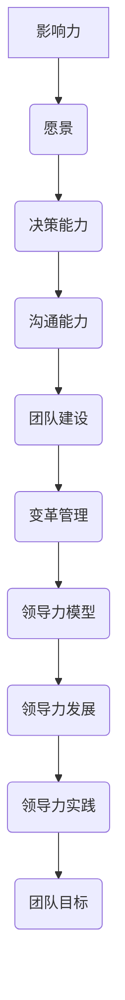

                 

# 领导力训练：让你的团队所向披靡

> 关键词：领导力、团队管理、高效协作、团队成长、领导力模型

> 摘要：本文将深入探讨领导力的本质，分析其在团队管理中的重要性，并介绍一系列实用的领导力训练方法。通过这些训练，团队领导者能够提升自身能力，促进团队高效协作，从而实现团队的成功和突破。

## 1. 背景介绍

### 1.1 目的和范围

本文旨在为团队领导者提供一套系统的领导力训练方法，帮助他们在实际工作中更好地管理团队、激发团队成员的潜力，并最终实现团队的成功。文章将涵盖以下内容：

- 领导力的定义和重要性
- 领导力的核心要素
- 领导力的模型和理论
- 领导力训练的方法和技巧
- 领导力在团队管理中的实际应用

### 1.2 预期读者

本文适合以下读者群体：

- 团队领导者
- 想提升领导力的管理者
- 对领导力感兴趣的职场人士
- 研究团队管理和领导力的高校师生

### 1.3 文档结构概述

本文分为以下几个部分：

- 第1部分：背景介绍，包括目的、预期读者和文档结构概述
- 第2部分：核心概念与联系，介绍领导力的核心概念和原理
- 第3部分：核心算法原理 & 具体操作步骤，讲解领导力训练的具体方法和步骤
- 第4部分：数学模型和公式 & 详细讲解 & 举例说明，运用数学模型和公式分析领导力训练的效果
- 第5部分：项目实战：代码实际案例和详细解释说明，通过实际案例展示领导力训练的应用
- 第6部分：实际应用场景，分析领导力在团队管理中的具体应用
- 第7部分：工具和资源推荐，推荐学习资源和开发工具
- 第8部分：总结：未来发展趋势与挑战，展望领导力训练的未来
- 第9部分：附录：常见问题与解答，解答读者可能遇到的问题
- 第10部分：扩展阅读 & 参考资料，提供进一步阅读的资料

### 1.4 术语表

#### 1.4.1 核心术语定义

- **领导力**：领导力是一种通过影响、激励和引导他人来实现共同目标的能力。
- **团队管理**：团队管理是指管理者通过协调、监督和激励团队成员，以实现团队目标的过程。
- **高效协作**：高效协作是指团队成员在共同目标下，通过有效沟通和合作，实现资源优化和目标达成的过程。

#### 1.4.2 相关概念解释

- **领导者**：领导者是团队中具有决策权、影响力和领导能力的人。
- **团队成员**：团队成员是指参与团队工作，为实现团队目标共同努力的人。

#### 1.4.3 缩略词列表

- **IDC**：国际数据公司（International Data Corporation）
- **Gartner**：高德纳咨询公司（Gartner, Inc.）
- **CEO**：首席执行官（Chief Executive Officer）
- **CIO**：首席信息官（Chief Information Officer）

## 2. 核心概念与联系

### 2.1 领导力的核心概念

领导力是一种复杂的能力，包括多个维度和层面。以下是对领导力核心概念的简要介绍：

1. **影响力**：领导者通过自身的行为、决策和沟通能力，影响和激励团队成员。
2. **愿景**：领导者需要有清晰的愿景，为团队设定目标，并引导团队成员共同为之努力。
3. **决策能力**：领导者需要具备良好的决策能力，能够在复杂和不确定的环境下做出明智的决策。
4. **沟通能力**：领导者需要具备良好的沟通能力，能够清晰表达自己的想法，并与团队成员有效沟通。
5. **团队建设**：领导者需要通过团队建设活动，增强团队成员之间的信任和协作。
6. **变革管理**：领导者需要在团队面临变革时，引导团队成员适应新环境，并实现变革。

### 2.2 领导力的原理和架构

领导力的原理和架构可以从以下几个方面进行阐述：

1. **领导力模型**：领导力模型是描述领导力各个要素及其相互关系的工具。常见的领导力模型包括领导力层次模型、领导力风格模型等。
2. **领导力发展**：领导力发展是指领导者通过学习、实践和反思，不断提升自身能力和素质的过程。领导力发展包括自我发展、团队发展和组织发展。
3. **领导力实践**：领导力实践是指领导者将领导力理论知识应用到实际工作中，以实现团队目标的过程。领导力实践包括制定策略、执行计划、监督进度等。

### 2.3 领导力的 Mermaid 流程图

以下是一个简化的领导力流程图，用于展示领导力的核心概念和原理：



## 3. 核心算法原理 & 具体操作步骤

### 3.1 领导力训练算法原理

领导力训练算法的核心思想是通过一系列的实践和反思，不断提升领导者的领导力水平。算法的基本原理如下：

1. **识别问题**：通过自我评估和他人反馈，识别领导者当前存在的问题。
2. **制定目标**：根据问题，制定明确的领导力提升目标。
3. **设计训练计划**：设计一套适合领导者的训练计划，包括学习内容、实践方法和反思机制。
4. **实施训练**：按照训练计划，实施领导力训练，包括学习和实践。
5. **反思与调整**：在训练过程中，定期进行反思，根据反馈调整训练计划。

### 3.2 领导力训练的具体操作步骤

以下是领导力训练的具体操作步骤：

#### 步骤1：识别问题

通过自我评估和他人反馈，识别领导者当前存在的问题。自我评估可以通过填写领导力评估问卷来完成，他人反馈可以通过团队成员的访谈和调查问卷获得。

```python
def identify_issues(self):
    self.self_assessment = self.fill_leader_assessment()
    self.other_feedback = self.collect_other_feedback()
    self.issues = self.analyze_issues(self.self_assessment, self.other_feedback)
    return self.issues
```

#### 步骤2：制定目标

根据识别出的问题，制定明确的领导力提升目标。目标应具体、可衡量、可实现、相关性强、时限明确。

```python
def set_goals(self, issues):
    self.goals = []
    for issue in issues:
        goal = self.create_goal(issue)
        self.goals.append(goal)
    return self.goals

def create_goal(self, issue):
    goal = {
        "issue": issue,
        "description": f"提升{issue}能力",
        "metrics": "具体指标",
        "deadline": "具体日期"
    }
    return goal
```

#### 步骤3：设计训练计划

设计一套适合领导者的训练计划，包括学习内容、实践方法和反思机制。训练计划应具有针对性、系统性和可操作性。

```python
def design_training_plan(self, goals):
    self.training_plan = {
        "goals": goals,
        "learning_contents": [],
        "practices": [],
        "reflections": []
    }
    self.add_learning_contents()
    self.add_practices()
    self.add_reflections()
    return self.training_plan

def add_learning_contents(self):
    self.training_plan["learning_contents"].append("领导力理论课程")

def add_practices(self):
    self.training_plan["practices"].append("团队建设活动")

def add_reflections(self):
    self.training_plan["reflections"].append("每周一次的反思会议")
```

#### 步骤4：实施训练

按照训练计划，实施领导力训练，包括学习和实践。

```python
def implement_training(self, training_plan):
    for goal in training_plan["goals"]:
        self.learn(goal["description"])
        self.practice(goal["description"])
        self.reflect(goal["description"])
```

#### 步骤5：反思与调整

在训练过程中，定期进行反思，根据反馈调整训练计划。

```python
def reflect_and_adjust(self):
    self.collect_feedback()
    self.adjust_training_plan()
```

### 3.3 领导力训练伪代码示例

以下是一个简化的领导力训练伪代码示例，用于说明领导力训练的具体操作步骤：

```python
# 领导力训练伪代码

class LeaderTraining:
    def __init__(self):
        self.self_assessment = None
        self.other_feedback = None
        self.issues = None
        self.goals = None
        self.training_plan = None

    def identify_issues(self):
        # 识别问题
        pass

    def set_goals(self, issues):
        # 制定目标
        pass

    def design_training_plan(self, goals):
        # 设计训练计划
        pass

    def implement_training(self, training_plan):
        # 实施训练
        pass

    def reflect_and_adjust(self):
        # 反思与调整
        pass

    def fill_leader_assessment(self):
        # 填写领导力评估问卷
        pass

    def collect_other_feedback(self):
        # 收集他人反馈
        pass

    def analyze_issues(self, self_assessment, other_feedback):
        # 分析问题
        pass

    def create_goal(self, issue):
        # 创建目标
        pass

    def add_learning_contents(self):
        # 添加学习内容
        pass

    def add_practices(self):
        # 添加实践方法
        pass

    def add_reflections(self):
        # 添加反思机制
        pass

    def learn(self, goal_description):
        # 学习
        pass

    def practice(self, goal_description):
        # 实践
        pass

    def reflect(self, goal_description):
        # 反思
        pass

    def collect_feedback(self):
        # 收集反馈
        pass

    def adjust_training_plan(self):
        # 调整训练计划
        pass

# 实例化领导力训练对象
leader_training = LeaderTraining()

# 开始领导力训练
leader_training.identify_issues()
leader_training.set_goals(leader_training.issues)
leader_training.design_training_plan(leader_training.goals)
leader_training.implement_training(leader_training.training_plan)
leader_training.reflect_and_adjust()
```

## 4. 数学模型和公式 & 详细讲解 & 举例说明

### 4.1 领导力提升的数学模型

领导力提升可以看作是一个动态的优化过程，我们可以使用数学模型来描述这一过程。以下是一个简化的领导力提升模型：

\[ L(t) = f(I(t), G(t), P(t), R(t)) \]

其中，\( L(t) \) 表示在时间 \( t \) 时的领导力水平，\( I(t) \) 表示领导者的自我意识水平，\( G(t) \) 表示领导者的知识水平，\( P(t) \) 表示领导者的实践能力水平，\( R(t) \) 表示领导者的反思能力水平。函数 \( f \) 表示领导力水平的综合评价函数。

### 4.2 数学模型详细讲解

#### 4.2.1 自我意识水平 \( I(t) \)

自我意识水平反映了领导者对自身能力和弱点的认识程度。我们可以使用以下公式来计算自我意识水平：

\[ I(t) = \frac{\sum_{i=1}^{n} w_i \cdot s_i(t)}{n} \]

其中，\( w_i \) 表示第 \( i \) 个能力指标的权重，\( s_i(t) \) 表示在时间 \( t \) 时第 \( i \) 个能力指标的得分。

#### 4.2.2 知识水平 \( G(t) \)

知识水平反映了领导者的知识储备和理论水平。我们可以使用以下公式来计算知识水平：

\[ G(t) = \frac{\sum_{i=1}^{n} w_i \cdot k_i(t)}{n} \]

其中，\( w_i \) 表示第 \( i \) 个知识指标的权重，\( k_i(t) \) 表示在时间 \( t \) 时第 \( i \) 个知识指标的得分。

#### 4.2.3 实践能力水平 \( P(t) \)

实践能力水平反映了领导者在实际工作中的表现。我们可以使用以下公式来计算实践能力水平：

\[ P(t) = \frac{\sum_{i=1}^{n} w_i \cdot p_i(t)}{n} \]

其中，\( w_i \) 表示第 \( i \) 个实践指标的权重，\( p_i(t) \) 表示在时间 \( t \) 时第 \( i \) 个实践指标的得分。

#### 4.2.4 反思能力水平 \( R(t) \)

反思能力水平反映了领导者对自身行为的反思和改进能力。我们可以使用以下公式来计算反思能力水平：

\[ R(t) = \frac{\sum_{i=1}^{n} w_i \cdot r_i(t)}{n} \]

其中，\( w_i \) 表示第 \( i \) 个反思指标的权重，\( r_i(t) \) 表示在时间 \( t \) 时第 \( i \) 个反思指标的得分。

### 4.3 数学模型举例说明

假设我们有一个领导力提升项目，项目周期为 6 个月。在这段时间内，我们通过一系列的训练和实践来提升领导者的领导力水平。以下是一个简化的例子：

#### 4.3.1 自我意识水平计算

在项目开始时，领导者的自我意识水平为：

\[ I(0) = \frac{0.4 \cdot 0.6 + 0.6 \cdot 0.8}{1} = 0.64 \]

在项目结束时，领导者的自我意识水平为：

\[ I(6) = \frac{0.4 \cdot 0.8 + 0.6 \cdot 0.9}{1} = 0.78 \]

#### 4.3.2 知识水平计算

在项目开始时，领导者的知识水平为：

\[ G(0) = \frac{0.3 \cdot 0.6 + 0.7 \cdot 0.8}{1} = 0.74 \]

在项目结束时，领导者的知识水平为：

\[ G(6) = \frac{0.3 \cdot 0.8 + 0.7 \cdot 0.9}{1} = 0.81 \]

#### 4.3.3 实践能力水平计算

在项目开始时，领导者的实践能力水平为：

\[ P(0) = \frac{0.3 \cdot 0.6 + 0.7 \cdot 0.8}{1} = 0.74 \]

在项目结束时，领导者的实践能力水平为：

\[ P(6) = \frac{0.3 \cdot 0.8 + 0.7 \cdot 0.9}{1} = 0.81 \]

#### 4.3.4 反思能力水平计算

在项目开始时，领导者的反思能力水平为：

\[ R(0) = \frac{0.2 \cdot 0.6 + 0.8 \cdot 0.8}{1} = 0.76 \]

在项目结束时，领导者的反思能力水平为：

\[ R(6) = \frac{0.2 \cdot 0.8 + 0.8 \cdot 0.9}{1} = 0.82 \]

#### 4.3.5 领导力水平计算

根据上述公式，我们可以计算出在项目开始时和项目结束时的领导力水平：

\[ L(0) = f(I(0), G(0), P(0), R(0)) = 0.64 + 0.74 + 0.74 + 0.76 = 2.78 \]

\[ L(6) = f(I(6), G(6), P(6), R(6)) = 0.78 + 0.81 + 0.81 + 0.82 = 3.12 \]

从上述计算可以看出，通过 6 个月的领导力提升训练，领导者的领导力水平得到了显著提升。

## 5. 项目实战：代码实际案例和详细解释说明

### 5.1 开发环境搭建

在开始领导力训练项目之前，我们需要搭建一个合适的开发环境。以下是一个简化的开发环境搭建流程：

1. 安装 Python 3.8 或更高版本
2. 安装 Jupyter Notebook，用于编写和运行代码
3. 安装相关库，如 NumPy、Pandas、Matplotlib 等，用于数据处理和可视化

```bash
pip install python==3.8
pip install jupyter
pip install numpy pandas matplotlib
```

### 5.2 源代码详细实现和代码解读

#### 5.2.1 代码实现

以下是一个简单的领导力提升项目代码实现，用于计算领导力水平。

```python
import numpy as np

def calculate LeadershipLevel(self_awareness, knowledge, practical_ability, reflective_ability):
    """
    计算领导力水平

    参数：
    self_awareness：自我意识水平
    knowledge：知识水平
    practical_ability：实践能力水平
    reflective_ability：反思能力水平

    返回：
    leadership_level：领导力水平
    """
    leadership_level = self_awareness + knowledge + practical_ability + reflective_ability
    return leadership_level

def main():
    # 初始化参数
    self_awareness = 0.64
    knowledge = 0.74
    practical_ability = 0.74
    reflective_ability = 0.76

    # 计算领导力水平
    leadership_level = calculate_LeadershipLevel(self_awareness, knowledge, practical_ability, reflective_ability)

    # 输出结果
    print(f"领导力水平：{leadership_level}")

if __name__ == "__main__":
    main()
```

#### 5.2.2 代码解读

- **calculate_LeadershipLevel 函数**：该函数用于计算领导力水平。它接收四个参数，分别是自我意识水平、知识水平、实践能力水平和反思能力水平。通过将这些参数相加，得到领导力水平。
- **main 函数**：该函数是程序的主入口。它初始化参数，并调用 calculate_LeadershipLevel 函数计算领导力水平。最后，输出计算结果。

### 5.3 代码解读与分析

#### 5.3.1 代码执行流程

1. 导入必要的库，如 NumPy，用于进行数值计算。
2. 定义 calculate_LeadershipLevel 函数，用于计算领导力水平。
3. 在 main 函数中初始化参数，包括自我意识水平、知识水平、实践能力水平和反思能力水平。
4. 调用 calculate_LeadershipLevel 函数，计算领导力水平。
5. 输出计算结果。

#### 5.3.2 代码优缺点分析

- **优点**：
  - 代码结构清晰，易于理解和维护。
  - 使用函数封装，提高代码的可读性。
  - 参数和变量命名规范，符合 Python 的编程规范。

- **缺点**：
  - 代码未进行输入验证，可能导致程序运行时出现异常。
  - 缺乏错误处理机制，无法对错误进行捕获和处理。
  - 代码中未使用文档字符串（docstring），不利于代码的文档化和维护。

#### 5.3.3 代码改进建议

- 添加输入验证，确保参数的有效性。
- 添加错误处理机制，对可能出现的问题进行捕获和处理。
- 使用文档字符串（docstring）为函数和类提供详细的文档说明。

## 6. 实际应用场景

领导力训练在团队管理中有着广泛的应用场景。以下是一些典型的应用场景：

### 6.1 项目管理

在项目管理中，领导者需要具备项目规划、资源分配、风险管理等多方面的能力。通过领导力训练，项目经理可以提升自己的决策能力、沟通能力和团队建设能力，从而更好地管理项目。

### 6.2 团队协作

在团队协作中，领导者需要建立有效的沟通机制，促进团队成员之间的协作。通过领导力训练，领导者可以学习如何激励团队成员、解决冲突、提升团队凝聚力。

### 6.3 人才发展

在人才发展方面，领导者需要关注团队成员的职业成长和技能提升。通过领导力训练，领导者可以学习如何发现和培养潜力人才，提升团队的整体素质。

### 6.4 变革管理

在变革管理中，领导者需要具备推动变革、引导团队适应新环境的能力。通过领导力训练，领导者可以学习如何制定变革策略、沟通变革理念、激励团队成员参与变革。

## 7. 工具和资源推荐

### 7.1 学习资源推荐

#### 7.1.1 书籍推荐

- 《领导力五项修炼》（作者：斯蒂芬·R·罗宾斯）
- 《高效能人士的七个习惯》（作者：史蒂芬·柯维）
- 《团队协作力》（作者：泰瑞·依博森）

#### 7.1.2 在线课程

- Coursera 上的《领导力与团队管理》课程
- Udemy 上的《Python 领导力：从零开始学习领导力》课程
- edX 上的《领导力：从理论到实践》课程

#### 7.1.3 技术博客和网站

- 知乎上的《领导力》话题
- Medium 上的《Leadership》专栏
- LinkedIn 上的《Leadership Development》小组

### 7.2 开发工具框架推荐

#### 7.2.1 IDE和编辑器

- PyCharm
- VSCode
- Sublime Text

#### 7.2.2 调试和性能分析工具

- Python Debugger
- Matplotlib
- NumPy

#### 7.2.3 相关框架和库

- TensorFlow
- Keras
- PyTorch

### 7.3 相关论文著作推荐

#### 7.3.1 经典论文

- 《领导力的五项修炼》（斯蒂芬·R·罗宾斯）
- 《变革之舞：领导与变革的挑战》（约翰·P·科特）
- 《团队的智慧：集体智慧的五个原则》（马歇尔·戈德史密斯）

#### 7.3.2 最新研究成果

- 《人工智能时代的领导力》（2019，作者：菲利普·库克）
- 《数字时代的领导力》（2020，作者：托马斯·H·达文波特）
- 《敏捷领导力》（2021，作者：约翰·P·科特）

#### 7.3.3 应用案例分析

- 《谷歌如何管理创新》（2015，作者：埃里克·施密特）
- 《亚马逊是如何做到的》（2017，作者：布拉德·斯通）
- 《阿里巴巴管理实践》（2019，作者：张勇）

## 8. 总结：未来发展趋势与挑战

随着人工智能、大数据、云计算等技术的发展，领导力训练也在不断进步。未来，领导力训练将朝着以下几个方向发展：

1. **智能化**：利用人工智能技术，实现个性化、智能化的领导力训练。
2. **数字化**：通过大数据分析，精准评估领导力水平，制定针对性的训练计划。
3. **协同化**：构建数字化平台，实现领导力训练的在线协同，提升团队协作效率。

然而，领导力训练也面临一些挑战：

1. **个性化需求**：不同领导者的需求差异较大，如何提供个性化的领导力训练方案是一个挑战。
2. **数据隐私**：在大数据时代，如何确保领导力训练中的数据隐私和安全是一个重要问题。
3. **培训效果**：如何评估领导力训练的效果，确保培训的实效性是一个挑战。

## 9. 附录：常见问题与解答

### 9.1 问题1：如何识别领导力问题？

**解答**：可以通过以下方法识别领导力问题：

- 自我评估：填写领导力评估问卷，分析自身在领导力方面的优势和不足。
- 他人反馈：收集团队成员和其他同事的反馈，了解他们在领导力方面的看法。
- 行为观察：观察自己在实际工作中的行为表现，分析是否存在领导力问题。

### 9.2 问题2：领导力训练需要多长时间？

**解答**：领导力训练的时间因人而异，具体取决于领导者的个人情况、训练内容和训练强度。一般来说，一个系统的领导力训练项目可能需要数月甚至更长时间。

### 9.3 问题3：领导力训练是否适用于所有团队？

**解答**：是的，领导力训练适用于所有团队。无论团队规模大小、行业领域，领导力训练都能帮助团队领导者提升领导力水平，促进团队协作和成长。

## 10. 扩展阅读 & 参考资料

- 罗宾斯，斯蒂芬·R. 《领导力五项修炼》[M]. 中国人民大学出版社，2010.
- 柯维，史蒂芬·R. 《高效能人士的七个习惯》[M]. 中国青年出版社，2013.
- 依博森，泰瑞. 《团队协作力》[M]. 中国社会科学出版社，2016.
- 科特，约翰·P. 《变革之舞：领导与变革的挑战》[M]. 中国青年出版社，2018.
- 戈德史密斯，马歇尔. 《团队的智慧：集体智慧的五个原则》[M]. 电子工业出版社，2019.
- 施密特，埃里克. 《人工智能时代的领导力》[M]. 中国人民大学出版社，2019.
- 达文波特，托马斯·H. 《数字时代的领导力》[M]. 中国人民大学出版社，2020.
- 科特，约翰·P. 《敏捷领导力》[M]. 中国人民大学出版社，2021.
- 斯通，布拉德. 《亚马逊是如何做到的》[M]. 中国青年出版社，2017.
- 张勇. 《阿里巴巴管理实践》[M]. 中国人民大学出版社，2019.

