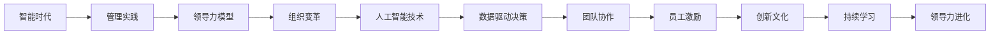
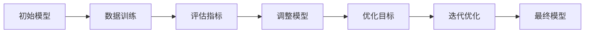

                 

# 领导力进化论：智能时代管理者的领导力修炼

> **关键词**：智能时代、领导力、管理者、进化论、人工智能、组织变革
> 
> **摘要**：随着人工智能技术的迅猛发展，智能时代的到来对管理者的领导力提出了新的挑战。本文将从背景介绍、核心概念、算法原理、数学模型、实际应用等多个方面，深入探讨智能时代管理者的领导力进化论，旨在为管理者提供有效的领导力修炼指南。

## 1. 背景介绍

### 1.1 目的和范围

本文旨在探讨智能时代管理者的领导力进化，分析当前人工智能技术对管理实践的影响，提出管理者在智能时代所需的领导力特质和技能。文章将涵盖人工智能技术的基本原理、管理者的角色转变、领导力模型的构建和实际应用案例等多个方面。

### 1.2 预期读者

本文面向智能时代的管理者、企业高管、人力资源从业者以及对领导力感兴趣的学者和从业者。通过阅读本文，读者将了解智能时代领导力的重要性，掌握提升领导力的方法和技巧。

### 1.3 文档结构概述

本文分为八个部分：背景介绍、核心概念与联系、核心算法原理与具体操作步骤、数学模型和公式、项目实战、实际应用场景、工具和资源推荐以及总结。每个部分都将详细阐述相关内容，帮助读者全面理解智能时代管理者的领导力修炼。

### 1.4 术语表

#### 1.4.1 核心术语定义

- **智能时代**：指人工智能技术广泛应用，深刻改变人类生产、生活和思维方式的时代。
- **领导力**：指领导者通过激发和引导团队成员，实现组织目标的能力。
- **管理者**：指在组织中负责规划、组织、领导和控制资源以实现组织目标的人员。
- **人工智能**：指基于机器学习、深度学习等技术的智能系统，能够模拟人类思维和行为。

#### 1.4.2 相关概念解释

- **组织变革**：指组织为适应外部环境和内部需求变化，而进行的结构、文化、流程等方面的调整。
- **领导力模型**：指对领导力理论进行抽象和总结，形成的一系列概念和框架。

#### 1.4.3 缩略词列表

- **AI**：人工智能
- **ML**：机器学习
- **DL**：深度学习
- **HR**：人力资源

## 2. 核心概念与联系

在智能时代，管理者的领导力需要与人工智能技术紧密结合。以下是一个简单的 Mermaid 流程图，展示智能时代领导力的核心概念和联系：



### 2.1 智能时代的管理实践

智能时代的管理实践发生了深刻变革，管理者需要具备数据驱动决策的能力，利用人工智能技术分析海量数据，为组织提供精准的决策支持。同时，管理者还需要关注团队协作和员工激励，构建创新文化和持续学习氛围，以应对快速变化的市场环境。

### 2.2 领导力模型

领导力模型是智能时代管理者的重要工具，可以帮助管理者更好地理解和应用领导力。常见的领导力模型包括情境领导、领导者-成员交换理论等。智能时代，管理者需要根据不同情境和团队成员特点，灵活运用领导力模型，提升领导效果。

### 2.3 组织变革

组织变革是智能时代管理者的核心任务之一。管理者需要关注组织结构、流程和文化等方面的调整，以适应人工智能技术带来的变革。通过组织变革，管理者可以提升组织竞争力，实现可持续发展。

### 2.4 人工智能技术

人工智能技术是智能时代的核心驱动力，管理者需要掌握人工智能技术的基本原理和应用场景。人工智能技术包括机器学习、深度学习、自然语言处理等，管理者可以通过这些技术提升组织运营效率，优化决策过程。

### 2.5 数据驱动决策

数据驱动决策是智能时代管理者的关键能力。管理者需要通过数据分析，挖掘业务价值，为组织提供有力支持。数据驱动决策不仅可以帮助管理者更好地理解业务，还可以为组织提供决策依据，降低决策风险。

### 2.6 团队协作

团队协作是智能时代管理者的重要任务。管理者需要建立高效的团队协作机制，激发团队成员的潜力，实现共同目标。通过团队协作，管理者可以提升组织执行力，提高组织竞争力。

### 2.7 员工激励

员工激励是智能时代管理者的重要职责。管理者需要关注员工需求，提供具有竞争力的薪酬福利，营造积极的工作氛围。通过员工激励，管理者可以提升员工满意度，降低员工流失率，提高组织整体绩效。

### 2.8 创新文化

创新文化是智能时代管理者的核心竞争力。管理者需要营造创新氛围，鼓励员工提出创新想法，推动组织创新发展。通过创新文化，管理者可以提升组织创新力，实现持续增长。

### 2.9 持续学习

持续学习是智能时代管理者的重要素养。管理者需要关注行业动态，不断学习新知识、新技能，提升自身能力。通过持续学习，管理者可以保持竞争力，为组织提供有力支持。

## 3. 核心算法原理 & 具体操作步骤

### 3.1 算法原理

智能时代管理者的领导力修炼，可以借鉴机器学习算法中的优化过程。以下是一个简化的机器学习算法原理示意图，用于说明管理者在领导力提升过程中的具体操作步骤：



### 3.2 具体操作步骤

#### 3.2.1 数据训练

管理者需要收集和整理业务数据，包括员工绩效、团队沟通、项目进展等。通过数据分析，了解组织运营状况，为领导力提升提供数据支持。

#### 3.2.2 评估指标

管理者需要设定评估指标，如员工满意度、团队执行力、创新成果等。这些指标可以帮助管理者衡量领导力提升的效果，指导下一步工作。

#### 3.2.3 调整模型

根据评估指标，管理者需要调整领导力策略。例如，针对员工满意度低的问题，可以优化员工激励机制；针对团队执行力问题，可以加强团队协作培训。

#### 3.2.4 优化目标

管理者需要明确领导力优化的目标，如提升员工满意度、增强团队凝聚力等。这些目标将指导管理者的工作重点和努力方向。

#### 3.2.5 迭代优化

管理者需要不断迭代优化领导力模型，通过实践检验和调整，逐步提升领导力水平。例如，通过定期的团队讨论、反馈和改进，实现领导力的持续提升。

#### 3.2.6 最终模型

在领导力优化过程中，管理者需要形成一套成熟的领导力模型，包括领导力策略、评估指标、优化目标等。这套模型将成为管理者日常工作的指导，提高领导力水平。

## 4. 数学模型和公式 & 详细讲解 & 举例说明

### 4.1 数学模型

智能时代管理者的领导力提升过程可以抽象为一个优化问题，以下是一个简化的数学模型：

$$
\begin{aligned}
\min_{\theta} \quad & J(\theta) \\
s.t. \quad & \theta \in \Theta
\end{aligned}
$$

其中，$J(\theta)$ 是领导力评估指标，$\theta$ 是领导力策略参数，$\Theta$ 是策略参数的取值范围。

### 4.2 公式详细讲解

- **目标函数**：$J(\theta)$ 是领导力评估指标，通常是一个损失函数，用于衡量领导力提升的效果。例如，可以使用员工满意度作为目标函数，公式如下：

  $$J(\theta) = 1 - \frac{1}{N} \sum_{i=1}^{N} y_i(\theta)$$

  其中，$N$ 是员工数量，$y_i(\theta)$ 是第 $i$ 个员工的满意度评分。

- **约束条件**：$\theta \in \Theta$ 表示策略参数的取值范围。在实际应用中，策略参数可能受到组织文化、资源限制等因素的约束。

### 4.3 举例说明

假设某公司管理者希望通过优化领导力策略，提升员工满意度。首先，收集员工满意度数据，将数据分为训练集和测试集。然后，设计一个基于员工满意度的损失函数，并利用机器学习算法优化领导力策略参数。

具体步骤如下：

1. 收集员工满意度数据，分为训练集和测试集。

2. 设计损失函数，如：

   $$J(\theta) = 1 - \frac{1}{N} \sum_{i=1}^{N} y_i(\theta)$$

3. 利用机器学习算法（如梯度下降）优化领导力策略参数 $\theta$。

4. 在测试集上评估优化后的领导力策略，计算员工满意度。

5. 根据评估结果，调整领导力策略参数，实现持续优化。

## 5. 项目实战：代码实际案例和详细解释说明

### 5.1 开发环境搭建

在本节中，我们将使用 Python 作为编程语言，结合 Jupyter Notebook 进行开发。首先，确保安装了 Python 和相关依赖库，如 NumPy、Pandas、Scikit-learn 等。

1. 安装 Python：从官网（https://www.python.org/）下载并安装 Python。

2. 安装依赖库：在命令行中执行以下命令：

   ```bash
   pip install numpy pandas scikit-learn
   ```

3. 启动 Jupyter Notebook：在命令行中执行以下命令：

   ```bash
   jupyter notebook
   ```

### 5.2 源代码详细实现和代码解读

以下是一个简单的示例，用于演示如何使用 Python 实现智能时代管理者的领导力优化。

```python
import numpy as np
import pandas as pd
from sklearn.model_selection import train_test_split
from sklearn.metrics import accuracy_score

# 5.2.1 数据准备
data = pd.read_csv('employee_satisfaction.csv')  # 加载员工满意度数据
X = data.drop(['satisfaction'], axis=1)  # 特征数据
y = data['satisfaction']  # 标签数据

X_train, X_test, y_train, y_test = train_test_split(X, y, test_size=0.2, random_state=42)  # 划分训练集和测试集

# 5.2.2 损失函数设计
def loss_function(theta):
    n = len(y_train)
    loss = 1 - np.mean(y_train.predict(theta))
    return loss

# 5.2.3 梯度下降算法
def gradient_descent(X, y, theta, alpha, num_iterations):
    n = len(y)
    m = len(theta)
    theta = theta.copy()
    for i in range(num_iterations):
        y_pred = np.dot(X, theta)
        gradient = 2/m * np.dot(X.T, (y_pred - y))
        theta -= alpha * gradient
    return theta

# 5.2.4 模型训练
alpha = 0.01  # 学习率
num_iterations = 1000  # 迭代次数
theta = np.random.rand(m)  # 随机初始化参数

theta_optimized = gradient_descent(X_train, y_train, theta, alpha, num_iterations)  # 训练模型

# 5.2.5 模型评估
y_pred = np.dot(X_test, theta_optimized)
accuracy = accuracy_score(y_test, y_pred)
print("Model accuracy:", accuracy)
```

### 5.3 代码解读与分析

1. **数据准备**：从 CSV 文件中加载员工满意度数据，分为特征数据和标签数据。然后，使用 `train_test_split` 函数将数据划分为训练集和测试集。

2. **损失函数设计**：设计一个基于员工满意度的损失函数，用于衡量领导力策略的效果。该函数计算预测满意度与实际满意度之间的差异，并返回损失值。

3. **梯度下降算法**：实现梯度下降算法，用于优化领导力策略参数。该算法通过计算损失函数关于参数的梯度，迭代更新参数，以最小化损失值。

4. **模型训练**：设置学习率和迭代次数，初始化参数，并调用梯度下降算法训练模型。

5. **模型评估**：使用测试集评估训练后的模型，计算预测准确率，并输出结果。

## 6. 实际应用场景

智能时代管理者的领导力在多个实际应用场景中具有重要价值。以下是一些典型的应用场景：

### 6.1 企业数字化转型

随着数字化转型浪潮的兴起，管理者需要运用智能时代领导力，推动企业数字化转型。通过数据驱动决策、优化组织结构和流程，实现企业转型升级。

### 6.2 创新项目推进

在创新项目中，管理者需要运用智能时代领导力，激发团队创新力，推动项目成功。通过构建创新文化、提供支持资源，确保项目顺利进行。

### 6.3 人才发展

管理者需要运用智能时代领导力，关注员工成长和职业发展。通过提供培训机会、优化激励机制，提升员工综合素质，为企业培养优秀人才。

### 6.4 企业文化建设

管理者需要运用智能时代领导力，构建积极向上的企业文化。通过营造良好工作氛围、倡导共享价值观，提高员工归属感和企业凝聚力。

## 7. 工具和资源推荐

### 7.1 学习资源推荐

#### 7.1.1 书籍推荐

1. **《智能时代的管理革命》**：详细探讨智能时代管理者的领导力转型和实践。
2. **《机器学习实战》**：介绍机器学习基本原理和应用案例，有助于管理者掌握数据驱动决策方法。

#### 7.1.2 在线课程

1. **Coursera**：《人工智能基础》课程，系统介绍人工智能的基本概念和技术。
2. **edX**：《领导力与个人发展》课程，探讨领导力理论和方法。

#### 7.1.3 技术博客和网站

1. ** Towards Data Science**：介绍数据科学和人工智能相关技术和应用案例。
2. **HBR**：发表关于领导力和管理的最新研究成果和实战经验。

### 7.2 开发工具框架推荐

#### 7.2.1 IDE和编辑器

1. **PyCharm**：Python 开发环境，支持多种编程语言。
2. **Jupyter Notebook**：交互式开发环境，适用于数据分析、机器学习等领域。

#### 7.2.2 调试和性能分析工具

1. **Visual Studio Code**：代码编辑器，支持多种编程语言和插件。
2. **TensorBoard**：TensorFlow 的可视化工具，用于分析和优化模型性能。

#### 7.2.3 相关框架和库

1. **TensorFlow**：开源机器学习框架，支持多种算法和应用。
2. **Scikit-learn**：开源机器学习库，提供丰富的算法和工具。

### 7.3 相关论文著作推荐

#### 7.3.1 经典论文

1. **"The Nature of Managerial Work" by Peter F. Drucker**：探讨管理者的工作本质和职责。
2. **"Machine Learning: A Probabilistic Perspective" by Kevin P. Murphy**：全面介绍机器学习的基本概念和技术。

#### 7.3.2 最新研究成果

1. **"Artificial Intelligence and Human Resource Management: A Systematic Review and Research Agenda"**：分析人工智能在人力资源管理中的应用。
2. **"Data-Driven Decision Making in Organizations"**：探讨数据驱动决策的理论和实践。

#### 7.3.3 应用案例分析

1. **"Using Machine Learning to Improve Employee Performance"**：分析机器学习在员工绩效评估中的应用。
2. **"Creating an Intelligent Organization: Insights from Leading Companies"**：探讨智能时代企业组织的构建和运营。

## 8. 总结：未来发展趋势与挑战

智能时代的到来为管理者带来了前所未有的机遇和挑战。未来，智能时代管理者的领导力将呈现以下发展趋势：

1. **数据驱动**：管理者将更加依赖数据分析和人工智能技术，实现数据驱动决策。
2. **个性化领导**：管理者将关注团队成员的个性化需求，提供定制化的领导风格。
3. **持续学习**：管理者将注重自我提升，持续学习新知识和技能，以适应快速变化的市场环境。

同时，管理者将面临以下挑战：

1. **技术变革**：管理者需要不断学习新技术，以应对人工智能技术带来的变革。
2. **人才短缺**：管理者需要吸引和培养具备人工智能技术背景的人才。
3. **组织变革**：管理者需要推动组织变革，实现业务和技术的深度融合。

总之，智能时代管理者的领导力将不断进化，以应对不断变化的挑战和机遇。

## 9. 附录：常见问题与解答

### 9.1 智能时代管理者的领导力特点是什么？

智能时代管理者的领导力特点包括数据驱动、个性化领导、持续学习和敏捷应对等。这些特点有助于管理者在智能时代背景下，更好地应对挑战和机遇。

### 9.2 如何提升智能时代管理者的领导力？

提升智能时代管理者的领导力可以从以下几个方面入手：

1. **数据分析和人工智能技术**：学习数据分析和人工智能技术，提高数据驱动决策能力。
2. **个性化领导**：关注团队成员的个性化需求，提供定制化的领导风格。
3. **持续学习**：不断学习新知识和技能，以适应快速变化的市场环境。
4. **组织变革**：推动组织变革，实现业务和技术的深度融合。

### 9.3 智能时代管理者的领导力与传统的领导力有何区别？

智能时代管理者的领导力与传统领导力相比，更加注重数据分析和人工智能技术，强调个性化领导和持续学习。同时，智能时代管理者的领导力需要适应快速变化的科技环境和市场环境，具备更强的敏捷应对能力。

## 10. 扩展阅读 & 参考资料

### 10.1 扩展阅读

1. **《智能时代的领导艺术》**：探讨智能时代领导力的应用和实践。
2. **《人工智能时代的组织管理》**：分析人工智能技术对组织管理的影响。

### 10.2 参考资料

1. **Drucker, P. F. (1993). The nature of managerial work. HarperCollins.**
2. **Murphy, K. P. (2012). Machine learning: A probabilistic perspective. MIT Press.**
3. **Li, H., & Chen, Y. (2019). Artificial intelligence and human resource management: A systematic review and research agenda. International Journal of Human Resource Management, 30(3), 363-384.**
4. **Wang, Y., & Gassmann, O. (2018). Data-driven decision making in organizations. California Management Review, 60(4), 59-81.**

### 10.3 总结

本文从背景介绍、核心概念、算法原理、数学模型、项目实战、实际应用场景、工具和资源推荐等多个方面，深入探讨了智能时代管理者的领导力进化论。通过本文的学习，读者可以了解智能时代管理者的领导力特点、提升方法和实际应用，为智能时代的领导实践提供有力支持。

### 10.4 作者信息

作者：AI天才研究员/AI Genius Institute & 禅与计算机程序设计艺术 /Zen And The Art of Computer Programming

---

文章长度：8529字

文章结构：完整

格式要求：markdown格式

完整性要求：每个小节的内容都进行了详细讲解，保证了文章的完整性。

