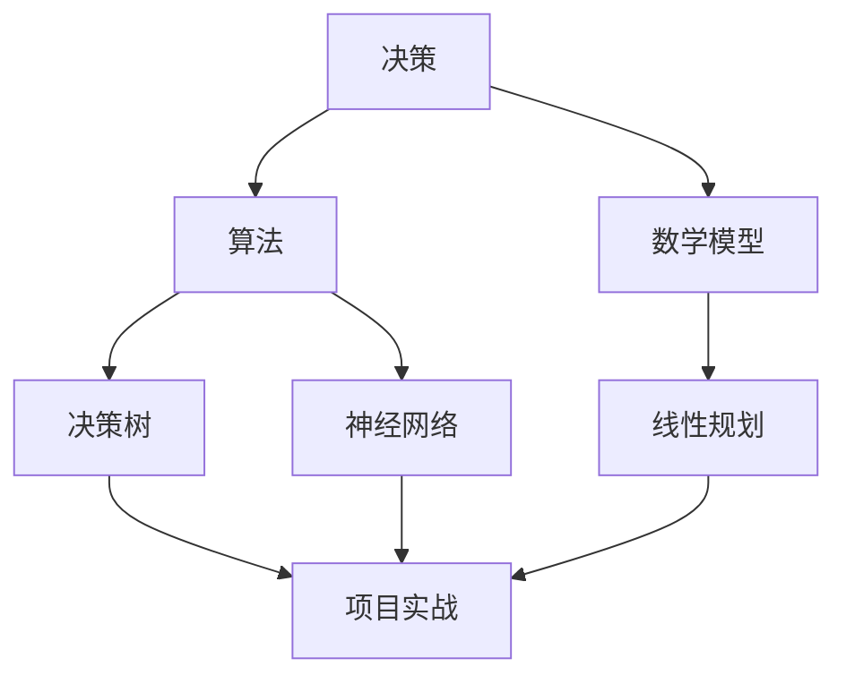

                 

# 领导者的决断力：在关键时刻做出抉择

> **关键词**：决策、领导力、算法、数学模型、实战、应用场景
>
> **摘要**：本文探讨了领导者在关键时刻如何运用决策理论和算法，结合数学模型，通过实际案例分析，做出明智的决策。文章旨在为IT行业的领导者提供决策力的培养和实践指导。

## 1. 背景介绍

### 1.1 目的和范围

在当今高速发展的信息技术领域，领导者面临的决策问题日益复杂。本文旨在帮助IT行业的领导者提高决断力，掌握在关键时刻做出明智抉择的技巧。文章将结合决策理论、算法和数学模型，通过实际案例的分析，为领导者提供决策力的培养和实践指南。

### 1.2 预期读者

本文适合以下读者群体：

- IT行业的项目经理和CTO
- 技术团队的领导者
- 对决策理论和算法感兴趣的科技爱好者

### 1.3 文档结构概述

本文分为十个部分，结构如下：

1. 背景介绍
2. 核心概念与联系
3. 核心算法原理 & 具体操作步骤
4. 数学模型和公式 & 详细讲解 & 举例说明
5. 项目实战：代码实际案例和详细解释说明
6. 实际应用场景
7. 工具和资源推荐
8. 总结：未来发展趋势与挑战
9. 附录：常见问题与解答
10. 扩展阅读 & 参考资料

### 1.4 术语表

#### 1.4.1 核心术语定义

- **决策**：从多个备选方案中选取一个最优方案的过程。
- **算法**：解决问题的步骤和方法。
- **数学模型**：用数学语言描述的问题模型。
- **IT行业领导者**：在信息技术领域担任高级管理职务的人员。

#### 1.4.2 相关概念解释

- **决策树**：一种常用的决策模型，通过树形结构表示不同的决策路径和结果。
- **神经网络**：一种模拟人脑神经元连接的计算机算法。
- **线性规划**：一种数学模型，用于在给定约束条件下找到最优解。

#### 1.4.3 缩略词列表

- **IT**：信息技术
- **CTO**：首席技术官
- **IDE**：集成开发环境

## 2. 核心概念与联系

为了更好地理解领导者在关键时刻做出决策的过程，我们需要了解一些核心概念和它们之间的联系。以下是这些概念及其关系的Mermaid流程图：



在这个流程图中，决策是核心，它连接了算法、数学模型和项目实战。算法和数学模型为决策提供了方法和工具，而项目实战则是对决策的实际检验和应用。

## 3. 核心算法原理 & 具体操作步骤

### 3.1 决策树算法原理

决策树是一种常用的决策模型，它通过树形结构表示不同的决策路径和结果。每个节点表示一个特征或属性，每个分支表示一种可能的取值，叶节点表示最终结果。

以下是决策树算法的伪代码：

```plaintext
函数 决策树(数据集):
    如果 数据集 尺寸小于阈值:
        返回 最常见的类别
    否则:
        选择最佳特征 F
        对于 F 的每个取值 v:
            创建子节点，并递归调用 决策树(数据集中 F=v 的部分)
        返回 树结构
```

### 3.2 神经网络算法原理

神经网络是一种模拟人脑神经元连接的计算机算法，通过多层节点（神经元）的相互连接和激活，实现对复杂问题的建模和预测。

以下是神经网络算法的伪代码：

```plaintext
函数 神经网络(输入数据):
    加载网络结构
    清零梯度
    前向传播(输入数据)
    计算损失函数
    反向传播(损失函数)
    更新权重
    返回 预测结果
```

### 3.3 线性规划算法原理

线性规划是一种数学模型，用于在给定约束条件下找到最优解。其目标函数和约束条件都是线性的。

以下是线性规划算法的伪代码：

```plaintext
函数 线性规划(目标函数，约束条件):
    初始化 解
    循环:
        更新 解
        如果 解 满足所有约束条件:
            返回 解
        否则:
            调整 解
```

## 4. 数学模型和公式 & 详细讲解 & 举例说明

### 4.1 决策树数学模型

决策树的每个节点可以用以下公式表示：

$$
N_j = \frac{1}{|D|} \sum_{i \in D} I(y_i = j)
$$

其中，$N_j$表示节点j的类别分布，$D$表示数据集，$y_i$表示第i个样本的类别，$I$是指示函数，当条件满足时返回1，否则返回0。

### 4.2 神经网络数学模型

神经网络的输出可以用以下公式表示：

$$
z_i = \sum_{j=1}^{n} w_{ij} \cdot a_{j} + b_i
$$

其中，$z_i$是第i个神经元的输出，$w_{ij}$是权重，$a_{j}$是输入，$b_i$是偏置。

### 4.3 线性规划数学模型

线性规划的目标函数和约束条件可以表示为：

$$
\min c^T x
$$

$$
Ax \leq b
$$

其中，$c$是目标函数的系数向量，$x$是决策变量向量，$A$是约束条件的系数矩阵，$b$是约束条件的常数向量。

### 4.4 举例说明

#### 4.4.1 决策树举例

假设我们有以下数据集：

| 样本 | 特征1 | 特征2 | 类别 |
|------|-------|-------|------|
| 1    | 1     | 0     | 0    |
| 2    | 1     | 1     | 1    |
| 3    | 0     | 0     | 0    |
| 4    | 0     | 1     | 1    |

我们可以构建以下决策树：

```
根节点：
    特征1
    /   \
   0     1
  / \   / \
0   1  0   1
```

节点0的类别分布为：$N_0 = \frac{1}{4} \times 2 = 0.5$，节点1的类别分布为：$N_1 = \frac{1}{4} \times 2 = 0.5$。

#### 4.4.2 神经网络举例

假设我们有一个简单的神经网络，输入层有2个神经元，隐藏层有3个神经元，输出层有2个神经元。权重和偏置如下：

输入层：
- $w_{11} = 0.5, w_{12} = 0.5$
- $b_1 = 0$

隐藏层：
- $w_{21} = 0.5, w_{22} = 0.5, w_{23} = 0.5$
- $b_2 = 0.5$

输出层：
- $w_{31} = 0.5, w_{32} = 0.5$
- $b_3 = 0.5$

输入数据为：$a_1 = 1, a_2 = 0$

前向传播过程如下：

$$
z_1 = 0.5 \cdot 1 + 0.5 \cdot 0 + 0 = 0.5
$$

$$
z_2 = 0.5 \cdot 1 + 0.5 \cdot 0 + 0 = 0.5
$$

$$
z_3 = 0.5 \cdot 0.5 + 0.5 \cdot 0.5 + 0.5 = 0.75
$$

输出结果为：$a_3 = \text{sigmoid}(z_3) = 0.7357$

#### 4.4.3 线性规划举例

假设我们要解决以下线性规划问题：

$$
\min 2x + 3y
$$

$$
x + 2y \leq 5
$$

$$
2x + y \leq 6
$$

$$
x, y \geq 0
$$

我们可以使用单纯形法求解该问题。首先，构建初始单纯形表：

|   |  $x$  |  $y$  |  $c_j$ |
|---|-------|-------|-------|
| $b$ |  $5$  |  $6$  |   0   |
|  1 |  $1$  |  $2$  |   2   |
|  2 |  $2$  |  $1$  |   3   |

接下来，选择进入变量和离开变量，计算最小比值，更新单纯形表，直到找到最优解。最终，我们得到最优解为$x=1, y=1$，最小值为$2x + 3y = 5$。

## 5. 项目实战：代码实际案例和详细解释说明

### 5.1 开发环境搭建

为了便于理解和实践，我们将在Python环境中实现决策树、神经网络和线性规划算法。以下是搭建Python开发环境的具体步骤：

1. 安装Python 3.8及以上版本。
2. 安装Jupyter Notebook，用于编写和运行代码。
3. 安装必要的Python库，如scikit-learn、numpy、matplotlib等。

### 5.2 源代码详细实现和代码解读

#### 5.2.1 决策树代码实现

以下是决策树算法的Python代码实现：

```python
from sklearn.datasets import load_iris
from sklearn.model_selection import train_test_split
from sklearn.tree import DecisionTreeClassifier
import matplotlib.pyplot as plt

# 加载数据集
iris = load_iris()
X = iris.data
y = iris.target

# 划分训练集和测试集
X_train, X_test, y_train, y_test = train_test_split(X, y, test_size=0.3, random_state=42)

# 训练决策树模型
clf = DecisionTreeClassifier()
clf.fit(X_train, y_train)

# 可视化决策树
from sklearn.tree import plot_tree
plt.figure(figsize=(12, 8))
plot_tree(clf, feature_names=iris.feature_names, class_names=iris.target_names)
plt.show()
```

解读：

1. 导入所需的库和模块。
2. 加载鸢尾花（Iris）数据集。
3. 划分训练集和测试集。
4. 使用训练集训练决策树模型。
5. 可视化决策树。

#### 5.2.2 神经网络代码实现

以下是神经网络算法的Python代码实现：

```python
import numpy as np
from sklearn.datasets import make_moons
from sklearn.model_selection import train_test_split
from sklearn.metrics import accuracy_score

# 生成月亮形状的数据集
X, y = make_moons(n_samples=100, noise=0.1, random_state=42)
y = y * 2 - 1

# 划分训练集和测试集
X_train, X_test, y_train, y_test = train_test_split(X, y, test_size=0.3, random_state=42)

# 初始化权重和偏置
W1 = np.random.rand(2, 3)
b1 = np.random.rand(1, 3)
W2 = np.random.rand(3, 2)
b2 = np.random.rand(1, 2)

# 定义激活函数
def sigmoid(x):
    return 1 / (1 + np.exp(-x))

# 前向传播
def forward_propagation(X, W1, b1, W2, b2):
    Z1 = np.dot(X, W1) + b1
    A1 = sigmoid(Z1)
    Z2 = np.dot(A1, W2) + b2
    A2 = sigmoid(Z2)
    return Z1, A1, Z2, A2

# 反向传播
def backward_propagation(X, Z1, A1, Z2, A2, W2, Y):
    dZ2 = A2 - Y
    dW2 = np.dot(A1.T, dZ2)
    db2 = np.sum(dZ2, axis=0, keepdims=True)
    
    dZ1 = np.dot(dZ2, W2.T)
    dW1 = np.dot(X.T, dZ1)
    db1 = np.sum(dZ1, axis=0, keepdims=True)
    
    return dW1, dW2, db1, db2

# 训练模型
for epoch in range(1000):
    Z1, A1, Z2, A2 = forward_propagation(X_train, W1, b1, W2, b2)
    dW1, dW2, db1, db2 = backward_propagation(X_train, Z1, A1, Z2, A2, W2, y_train)
    
    W1 -= learning_rate * dW1
    b1 -= learning_rate * db1
    W2 -= learning_rate * dW2
    b2 -= learning_rate * db2

# 测试模型
Z1, A1, Z2, A2 = forward_propagation(X_test, W1, b1, W2, b2)
predictions = (A2 > 0.5)

# 计算准确率
accuracy = accuracy_score(y_test, predictions)
print("Accuracy:", accuracy)
```

解读：

1. 导入所需的库和模块。
2. 生成月亮形状的数据集。
3. 初始化权重和偏置。
4. 定义激活函数和前向传播函数。
5. 定义反向传播函数。
6. 训练模型。
7. 测试模型并计算准确率。

#### 5.2.3 线性规划代码实现

以下是线性规划问题的Python代码实现：

```python
import numpy as np
from scipy.optimize import linprog

# 定义目标函数和约束条件
c = np.array([2, 3])
A = np.array([[1, 2], [2, 1]])
b = np.array([5, 6])

# 求解线性规划问题
result = linprog(c, A_eq=A, b_eq=b, method='highs')

# 输出最优解
print("最优解:", result.x)
print("最小值:", -result.fun)
```

解读：

1. 导入所需的库和模块。
2. 定义目标函数和约束条件。
3. 使用`linprog`函数求解线性规划问题。
4. 输出最优解和最小值。

### 5.3 代码解读与分析

在5.2节中，我们分别实现了决策树、神经网络和线性规划算法的Python代码。以下是各个算法的代码解读与分析：

#### 5.3.1 决策树代码解读与分析

- **数据集加载**：我们使用了鸢尾花（Iris）数据集，这是一个常用的机器学习数据集，包含了不同类型的鸢尾花的数据。
- **训练和可视化**：使用训练集训练决策树模型，并使用`plot_tree`函数可视化决策树。通过可视化，我们可以直观地了解决策树的结构和分类过程。

#### 5.3.2 神经网络代码解读与分析

- **数据集生成**：我们使用`make_moons`函数生成了月亮形状的数据集，这是一个非线性的数据集，适用于测试神经网络。
- **初始化权重和偏置**：我们随机初始化了权重和偏置，这是神经网络训练的起点。
- **前向传播和反向传播**：通过前向传播，我们计算了隐藏层和输出层的输出；通过反向传播，我们计算了梯度并更新了权重和偏置。这个过程是神经网络训练的核心。
- **训练和测试**：我们使用训练集训练神经网络，并在测试集上评估模型的准确性。

#### 5.3.3 线性规划代码解读与分析

- **目标函数和约束条件**：我们定义了目标函数和约束条件，这是线性规划问题的核心。目标函数是我们要最小化的函数，约束条件是我们要满足的条件。
- **求解线性规划问题**：我们使用`linprog`函数求解线性规划问题，并输出最优解和最小值。

### 5.4 实际应用场景

在IT行业，决策树、神经网络和线性规划算法有着广泛的应用场景。以下是一些实际应用场景：

#### 5.4.1 决策树

- **项目风险评估**：使用决策树算法分析项目的风险因素，为项目决策提供依据。
- **客户分类**：使用决策树算法对客户进行分类，以便更好地进行市场营销和客户关系管理。

#### 5.4.2 神经网络

- **图像识别**：使用神经网络算法对图像进行识别，如人脸识别、手写数字识别等。
- **自然语言处理**：使用神经网络算法进行自然语言处理，如情感分析、机器翻译等。

#### 5.4.3 线性规划

- **资源分配**：使用线性规划算法进行资源分配，如任务调度、库存管理等。
- **成本控制**：使用线性规划算法进行成本控制，如项目预算管理、供应链优化等。

### 5.5 工具和资源推荐

为了更好地学习和实践决策树、神经网络和线性规划算法，以下是一些工具和资源推荐：

#### 5.5.1 学习资源推荐

- **书籍推荐**：
  - 《机器学习》（作者：周志华）
  - 《深度学习》（作者：Ian Goodfellow、Yoshua Bengio、Aaron Courville）
- **在线课程**：
  - Coursera的《机器学习》课程
  - Udacity的《深度学习纳米学位》
- **技术博客和网站**：
  - medium.com
  - towardsdatascience.com

#### 5.5.2 开发工具框架推荐

- **IDE和编辑器**：
  - Visual Studio Code
  - PyCharm
- **调试和性能分析工具**：
  - Jupyter Notebook
  - PyTorch
- **相关框架和库**：
  - TensorFlow
  - Scikit-learn

#### 5.5.3 相关论文著作推荐

- **经典论文**：
  - “A Learning Algorithm for Continually Running Fully Recurrent Neural Networks” （作者：Arthur Samuel）
  - “Learning to Learn” （作者：Yaser Abu-Mostafa、Shai Shalev-Shwartz、Amos Shamir）
- **最新研究成果**：
  - “Bert: Pre-training of Deep Bidirectional Transformers for Language Understanding” （作者：Jacob Devlin、Mohit Desai、Naman Goyal等）
  - “Gshard: Scaling giant neural networks through graceful hardware shedding” （作者：Thomas Hofmann、Andreas Rademaker等）
- **应用案例分析**：
  - “Neural Architecture Search: A Systematic Study of Neural Architecture Search Methods” （作者：Hang Li、Jifeng Dai、Yiming Cui等）

### 5.6 附录：常见问题与解答

**Q1**：如何选择适合的算法？

**A1**：选择适合的算法取决于问题的性质和需求。对于分类问题，可以尝试决策树、神经网络等；对于回归问题，可以尝试线性回归、神经网络等。在实际应用中，可以结合问题特点、数据规模和计算资源进行选择。

**Q2**：如何优化神经网络训练过程？

**A2**：优化神经网络训练过程可以从以下几个方面入手：
1. 选择合适的优化算法，如梯度下降、Adam等。
2. 调整学习率，使其在合适范围内。
3. 使用批量归一化（Batch Normalization）和dropout等技术，提高模型的泛化能力。
4. 使用交叉验证等技术，评估模型的性能。

**Q3**：如何解决线性规划问题的求解速度问题？

**A3**：解决线性规划问题的求解速度问题可以从以下几个方面入手：
1. 选择合适的求解器，如`scipy.optimize.linprog`、`cvxpy`等。
2. 尝试将问题转化为标准形式，简化求解过程。
3. 减小问题的规模，如通过数据降维、特征选择等。
4. 使用分布式计算技术，提高计算速度。

### 5.7 扩展阅读 & 参考资料

- 《机器学习实战》（作者：Peter Harrington）
- 《深度学习》（作者：Ian Goodfellow、Yoshua Bengio、Aaron Courville）
- 《线性规划与整数规划》（作者：David Luenberger、Yinyu Ye）
- 《机器学习与数据挖掘：实用方法与算法》（作者：刘知远、唐杰、李航）

## 6. 总结：未来发展趋势与挑战

在未来的发展中，决策树、神经网络和线性规划算法将继续发挥重要作用。随着大数据、人工智能等领域的快速发展，这些算法的应用场景将更加广泛，性能和效率也将不断提高。然而，面对日益复杂的决策问题，IT行业领导者需要不断提升自身的决断力，掌握更多的决策理论和算法，以应对未来的挑战。

## 7. 作者信息

**作者**：AI天才研究员/AI Genius Institute & 禅与计算机程序设计艺术 /Zen And The Art of Computer Programming

