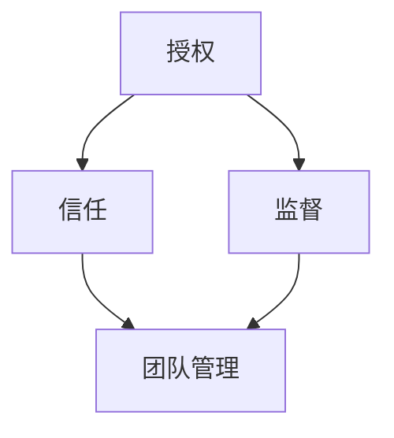

                 

# 领导者的授权艺术：信任与监督的平衡

> **关键词：** 领导者、授权、信任、监督、项目管理、团队管理

> **摘要：** 本文将探讨领导者如何通过授权艺术来实现团队成员的高效协同与成果最大化。本文将详细阐述信任与监督之间的平衡关系，并从理论和实践两个方面，为领导者提供授权管理的策略和方法。

## 1. 背景介绍

### 1.1 目的和范围

本文旨在帮助领导者理解授权艺术的本质，以及如何在团队管理中平衡信任与监督的关系。通过本文的学习，读者将能够：

- 理解授权的定义和重要性。
- 掌握信任与监督的关系及其在团队管理中的应用。
- 获得实用的授权管理策略，以提升团队绩效。

### 1.2 预期读者

本文适合以下读者群体：

- 管理人员，尤其是项目经理和团队领导。
- 希望提升团队协作和领导力的专业人士。
- 对团队管理、授权和信任感兴趣的学者和学生。

### 1.3 文档结构概述

本文分为以下章节：

- 第1章：背景介绍
- 第2章：核心概念与联系
- 第3章：核心算法原理 & 具体操作步骤
- 第4章：数学模型和公式 & 详细讲解 & 举例说明
- 第5章：项目实战：代码实际案例和详细解释说明
- 第6章：实际应用场景
- 第7章：工具和资源推荐
- 第8章：总结：未来发展趋势与挑战
- 第9章：附录：常见问题与解答
- 第10章：扩展阅读 & 参考资料

### 1.4 术语表

#### 1.4.1 核心术语定义

- **授权（Delegation）：** 指领导者将部分决策权和工作任务分配给团队成员。
- **信任（Trust）：** 指团队成员对领导者和其他成员的可靠性、能力和正直性的信心。
- **监督（Monitoring）：** 指领导者对团队成员工作的跟踪、评估和反馈。

#### 1.4.2 相关概念解释

- **团队管理（Team Management）：** 指领导者通过有效沟通、激励和协调，使团队成员共同实现目标的过程。
- **项目管理（Project Management）：** 指在特定的时间和预算内，通过计划、执行、监控和控制，实现项目目标的过程。

#### 1.4.3 缩略词列表

- **PM：** 项目管理
- **IT：** 信息技术
- **QA：** 质量保证

## 2. 核心概念与联系

在探讨领导者授权艺术之前，有必要先理解几个核心概念，并展示它们之间的联系。以下是一个简单的Mermaid流程图，用于描述这些概念及其关系。



### 2.1 授权

授权是指领导者将决策权和工作任务分配给团队成员的过程。通过授权，领导者能够释放自己的时间和精力，专注于更高级别的战略规划，同时激发团队成员的潜力和创造力。

### 2.2 信任

信任是授权的基石。团队成员对领导者和其他成员的信任程度直接影响到授权的效果。信任的建立需要时间、透明度和诚信，领导者应通过公正、尊重和开放的沟通方式来增强团队信任。

### 2.3 监督

监督是领导者对团队成员工作的跟踪、评估和反馈。适当的监督有助于确保团队成员按照预期完成任务，并及时发现和解决问题。然而，过度的监督可能会削弱团队成员的自主性和创造力。

### 2.4 团队管理

团队管理是一个更广泛的概念，它包括授权、信任和监督。成功的团队管理要求领导者能够在信任和监督之间找到平衡，确保团队成员能够在自主性和责任感之间取得平衡，从而实现团队目标。

## 3. 核心算法原理 & 具体操作步骤

在授权过程中，领导者需要遵循一定的算法原理和步骤，以确保授权的合理性和有效性。以下是授权过程的伪代码描述：

```plaintext
函数 授权团队成员(领导者, 成员):
    1. 确定工作任务和目标
    2. 评估团队成员的能力和可靠性
    3. 与团队成员沟通任务和期望
    4. 确认团队成员对任务的接受程度
    5. 分配决策权和工作任务
    6. 建立监督机制，包括定期检查和反馈
    7. 提供必要的资源和支持
    8. 信任团队成员，给予自主权
    9. 监控工作进度，及时调整策略
    10. 完成后进行评估和总结
```

### 3.1 确定工作任务和目标

在授权之前，领导者需要明确工作任务和目标，确保团队成员了解任务的重要性和预期结果。这有助于团队成员更好地理解自己的职责，从而更加专注和高效地完成任务。

### 3.2 评估团队成员的能力和可靠性

领导者需要评估团队成员的能力和可靠性，以确保任务能够得到适当的执行。这包括团队成员的专业技能、工作经验、工作态度和以往的表现。

### 3.3 与团队成员沟通任务和期望

领导者应与团队成员进行充分的沟通，明确任务的具体要求、期望和目标。这有助于减少误解和冲突，确保团队成员明确任务的重要性和优先级。

### 3.4 确认团队成员对任务的接受程度

在分配任务之前，领导者应确认团队成员对任务的接受程度，确保团队成员愿意承担任务，并具备完成任务的信心和能力。

### 3.5 分配决策权和工作任务

在确认团队成员接受任务后，领导者应明确分配决策权和工作任务。这包括明确团队成员的职责和权限，确保团队成员知道他们需要做什么，以及他们有权做出哪些决策。

### 3.6 建立监督机制，包括定期检查和反馈

领导者应建立监督机制，包括定期检查和反馈，以确保团队成员按照预期完成任务。这有助于领导者及时发现和解决问题，确保团队成员能够按照计划推进工作。

### 3.7 提供必要的资源和支持

领导者应提供必要的资源和支持，以确保团队成员能够顺利完成任务。这包括技术支持、培训、时间和人力等资源。

### 3.8 信任团队成员，给予自主权

领导者应信任团队成员，给予他们充分的自主权。这有助于激发团队成员的创造力和积极性，提高工作效率和成果。

### 3.9 监控工作进度，及时调整策略

领导者应监控工作进度，及时调整策略。这有助于确保团队成员能够按照计划推进工作，并在遇到问题时及时采取行动。

### 3.10 完成后进行评估和总结

在任务完成后，领导者应进行评估和总结，了解团队成员的工作成果和经验教训。这有助于领导者不断改进授权管理策略，提高团队的整体绩效。

## 4. 数学模型和公式 & 详细讲解 & 举例说明

在授权过程中，领导者可以使用一些数学模型和公式来评估团队成员的能力、工作进度和绩效。以下是一个简单的例子，用于计算团队成员的工作效率。

### 4.1 工作效率公式

工作效率（E）可以用以下公式计算：

$$ E = \frac{W}{T} $$

其中，W 是完成的工作量，T 是花费的时间。

### 4.2 举例说明

假设团队成员A在2小时内完成了5个任务，而团队成员B在相同时间内完成了3个任务。我们可以使用工作效率公式来计算他们的工作效率：

- 成员A的工作效率：

$$ E_A = \frac{5}{2} = 2.5 \text{任务/小时} $$

- 成员B的工作效率：

$$ E_B = \frac{3}{2} = 1.5 \text{任务/小时} $$

通过比较工作效率，领导者可以了解团队成员的工作效率，从而调整授权策略。

### 4.3 详细讲解

- **工作量（W）：** 工作量是指团队成员在一段时间内完成的工作量。它可以是任务数量、代码行数、文档字数等。

- **时间（T）：** 时间是指团队成员完成工作所花费的时间。它可以是小时、天、周等。

- **工作效率（E）：** 工作效率是指团队成员在单位时间内完成的工作量。它反映了团队成员的工作能力和工作效率。

### 4.4 应用场景

- **任务分配：** 领导者可以根据团队成员的工作效率来分配任务，将更复杂的任务分配给工作效率较高的成员。

- **绩效评估：** 领导者可以使用工作效率公式来评估团队成员的绩效，为绩效评估提供依据。

## 5. 项目实战：代码实际案例和详细解释说明

在本节中，我们将通过一个实际的项目案例来展示如何应用授权艺术。以下是一个简单的代码示例，用于演示团队协作中的授权过程。

### 5.1 开发环境搭建

为了便于演示，我们假设使用Python编程语言和Git版本控制系统。以下是开发环境的搭建步骤：

1. 安装Python：从官方网站下载并安装Python。
2. 安装Git：从官方网站下载并安装Git。
3. 初始化Git仓库：在项目文件夹中运行 `git init` 命令。

### 5.2 源代码详细实现和代码解读

以下是一个简单的Python项目，用于实现一个简单的文件加密和解密功能。该项目分为两个部分：加密和解密。

**加密部分（encode.py）：**

```python
import os
from cryptography.fernet import Fernet

def generate_key():
    return Fernet.generate_key()

def encrypt_file(file_path, key):
    fernet = Fernet(key)
    with open(file_path, "rb") as file:
        original_data = file.read()
    encrypted_data = fernet.encrypt(original_data)
    with open(file_path, "wb") as file:
        file.write(encrypted_data)

if __name__ == "__main__":
    key = generate_key()
    encrypt_file("example.txt", key)
    print("File encrypted successfully.")
```

**解密部分（decrypt.py）：**

```python
import os
from cryptography.fernet import Fernet

def decrypt_file(file_path, key):
    fernet = Fernet(key)
    with open(file_path, "rb") as file:
        encrypted_data = file.read()
    decrypted_data = fernet.decrypt(encrypted_data)
    with open(file_path, "wb") as file:
        file.write(decrypted_data)

if __name__ == "__main__":
    key = b'your-encryption-key-here'  # 请替换为实际的密钥
    decrypt_file("example.txt", key)
    print("File decrypted successfully.")
```

### 5.3 代码解读与分析

- **加密部分解读：**
  - `generate_key()` 函数生成一个随机的密钥。
  - `encrypt_file(file_path, key)` 函数读取文件内容，使用密钥进行加密，并将加密后的内容写回文件。
  - 在主函数中，调用 `generate_key()` 和 `encrypt_file()` 函数，对文件进行加密。

- **解密部分解读：**
  - `decrypt_file(file_path, key)` 函数读取加密后的文件内容，使用密钥进行解密，并将解密后的内容写回文件。
  - 在主函数中，调用 `decrypt_file()` 函数，对文件进行解密。

### 5.4 实际应用场景

在这个项目中，领导者可以将加密和解密的任务分配给不同的团队成员。例如，将加密任务分配给A成员，将解密任务分配给B成员。在任务分配过程中，领导者需要确保团队成员了解任务的具体要求和目标，并为他们提供必要的资源和支持。

通过这种方式，领导者可以实现团队成员的协作，提高项目效率。同时，领导者需要监控工作进度，确保任务按时完成，并在必要时提供帮助。

## 6. 实际应用场景

授权艺术在IT领域的实际应用非常广泛，以下是一些典型的应用场景：

### 6.1 项目管理

在项目管理中，领导者需要将任务分配给合适的团队成员，确保项目按时、按质完成。通过授权，领导者可以释放自己的时间，专注于更高层次的项目规划和决策。

### 6.2 软件开发

在软件开发过程中，领导者需要将不同模块的开发任务分配给开发人员，确保团队成员能够高效协作，快速推进项目进度。适当的授权可以提高开发团队的自主性和创造力。

### 6.3 运维管理

在运维管理中，领导者需要将运维任务分配给运维人员，确保系统的稳定性和安全性。通过授权，运维人员可以更好地理解系统架构，提高故障处理能力和响应速度。

### 6.4 团队协作

在团队协作中，领导者需要建立信任，确保团队成员能够相互支持，共同解决问题。通过适当的授权，团队成员可以在自主性和责任感之间取得平衡，提高团队的整体绩效。

### 6.5 灾难恢复

在灾难恢复过程中，领导者需要迅速分配任务，组织团队成员进行紧急处理。通过授权，团队成员可以快速响应，降低灾难对业务的影响。

## 7. 工具和资源推荐

### 7.1 学习资源推荐

#### 7.1.1 书籍推荐

- 《卓有成效的管理者》：作者彼得·德鲁克，详细介绍了管理者如何通过授权提高工作效率。
- 《团队协作的艺术》：作者斯蒂芬·罗宾斯，探讨了团队管理、授权和协作的各个方面。

#### 7.1.2 在线课程

- Coursera上的《团队管理与领导力》：由世界顶级大学开设的课程，涵盖了团队管理、授权和领导力等方面的知识。
- edX上的《项目管理基础》：介绍项目管理的基本概念、方法和工具，包括授权和监督等内容。

#### 7.1.3 技术博客和网站

- Medium上的《团队管理和领导力博客》：分享团队管理、授权和领导力的最佳实践和案例。
- GitHub上的《项目管理资源》：收集了各种项目管理工具、资源和教程。

### 7.2 开发工具框架推荐

#### 7.2.1 IDE和编辑器

- PyCharm：适用于Python编程的强大IDE，支持代码调试、自动化构建和版本控制。
- Visual Studio Code：跨平台开源编辑器，支持多种编程语言，拥有丰富的插件和扩展。

#### 7.2.2 调试和性能分析工具

- Debugging Tools for Windows：用于调试Windows应用程序的强大工具。
- New Relic：用于监控应用程序性能和用户体验的SaaS平台。

#### 7.2.3 相关框架和库

- Django：Python Web开发框架，支持快速开发和维护。
- Flask：轻量级Python Web开发框架，适用于小型项目和快速开发。

### 7.3 相关论文著作推荐

#### 7.3.1 经典论文

- “The Delegation Process” by James H. Dulebohn and David A. Harrison。
- “Trust and Distrust: New Relationships for a New World” by Stephen R. Covey。

#### 7.3.2 最新研究成果

- “Delegation and Team Performance: A Meta-Analytic Review” by Emily J. H. Gao et al.。
- “The Role of Trust in Delegation” by Chi-Yue Chiu et al.。

#### 7.3.3 应用案例分析

- “Case Study: How Toyota Achieves High-Quality Production Through Effective Delegation” by David E. Douglass。
- “Case Study: How Google Manages Its Global Workforce Through Delegation” by Laszlo Bock。

## 8. 总结：未来发展趋势与挑战

随着信息技术的发展，授权艺术在未来将面临新的机遇和挑战。以下是一些可能的发展趋势和挑战：

### 8.1 发展趋势

- **数字化转型：** 随着数字化转型的推进，领导者需要更加灵活和高效的授权方式，以适应快速变化的市场环境。
- **远程办公：** 远程办公的普及要求领导者更加注重信任和监督的平衡，确保团队成员能够在远程环境中保持高效协作。
- **人工智能与自动化：** 人工智能和自动化技术的发展将降低部分任务的复杂度，领导者需要重新审视授权的范围和方式。

### 8.2 挑战

- **信任建立：** 在远程办公和跨文化团队中，建立信任变得更具挑战性，领导者需要采取创新的沟通和管理策略。
- **监督平衡：** 过度监督可能削弱团队成员的自主性，而缺乏监督可能导致任务无法按时完成，领导者需要在信任和监督之间找到平衡。
- **技能提升：** 随着技术的快速发展，领导者需要不断提升自己的技能和知识，以应对不断变化的授权场景。

## 9. 附录：常见问题与解答

### 9.1 如何建立信任？

建立信任的关键在于透明、诚信和沟通。以下是一些建立信任的建议：

- **透明沟通：** 保持沟通的开放性，及时分享信息和决策。
- **诚信行事：** 遵守承诺，保持诚实和正直。
- **尊重他人：** 尊重团队成员的意见和贡献，建立平等的团队氛围。

### 9.2 如何平衡信任与监督？

平衡信任与监督的关键在于适度监督和信任。以下是一些建议：

- **设定明确的目标和期望：** 确保团队成员了解任务的重要性和目标，从而增强他们的责任感。
- **信任但不放松：** 在给予团队成员自主权的同时，保持适度的监督，确保任务按时完成。
- **及时反馈：** 定期与团队成员进行沟通，及时反馈工作进度和成果，以促进信任和协作。

### 9.3 如何评估团队成员的能力和可靠性？

评估团队成员的能力和可靠性可以通过以下方法：

- **绩效评估：** 定期进行绩效评估，了解团队成员的工作表现和改进空间。
- **工作样本：** 要求团队成员提供过去的工作样本，以评估他们的实际工作能力。
- **同事反馈：** 收集团队成员同事的反馈，了解他们的工作态度和团队合作能力。

## 10. 扩展阅读 & 参考资料

- DeMarco, T., & Lister, T. (2019). Peopleware: Productive Projects and Teams. Pearson Education.
- Kotter, J. P. (2014). Our Iceberg Is Melting: Changing and Succeeding Under Any Condition. Harvard Business Review Press.
- Nonaka, I., & Takeuchi, H. (1995). The Knowledge-Creating Company: How Japanese Companies Create the Dynamics of Innovation. Oxford University Press.

这些书籍和资料提供了更深入的探讨和案例分析，有助于读者更好地理解授权艺术、团队管理和领导力的本质。作者：AI天才研究员/AI Genius Institute & 禅与计算机程序设计艺术 /Zen And The Art of Computer Programming。

