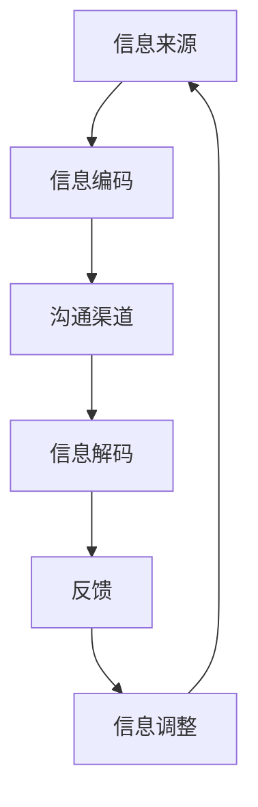
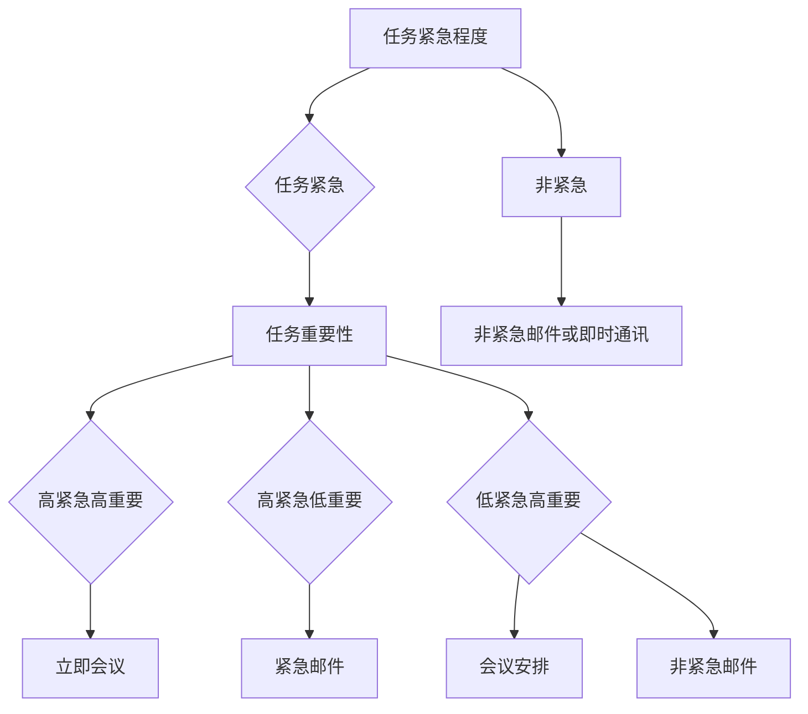
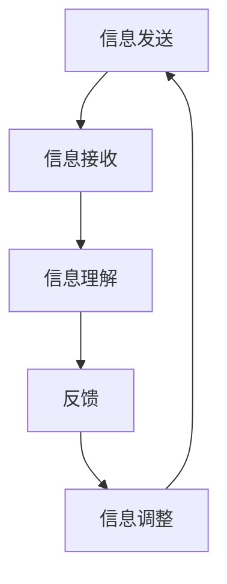
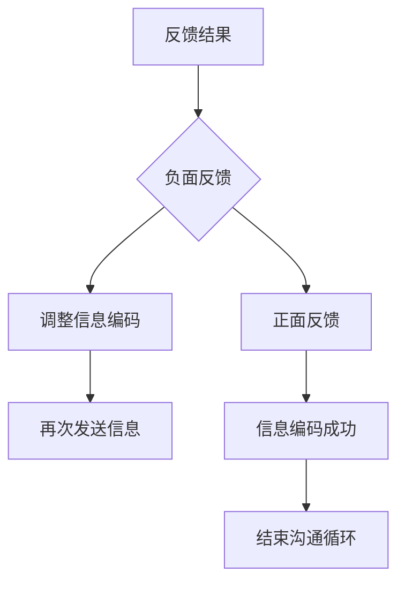
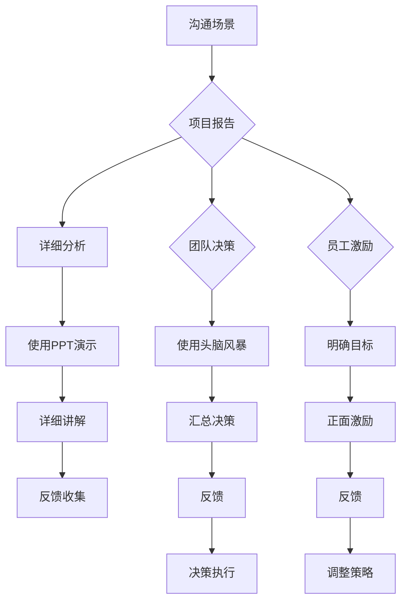
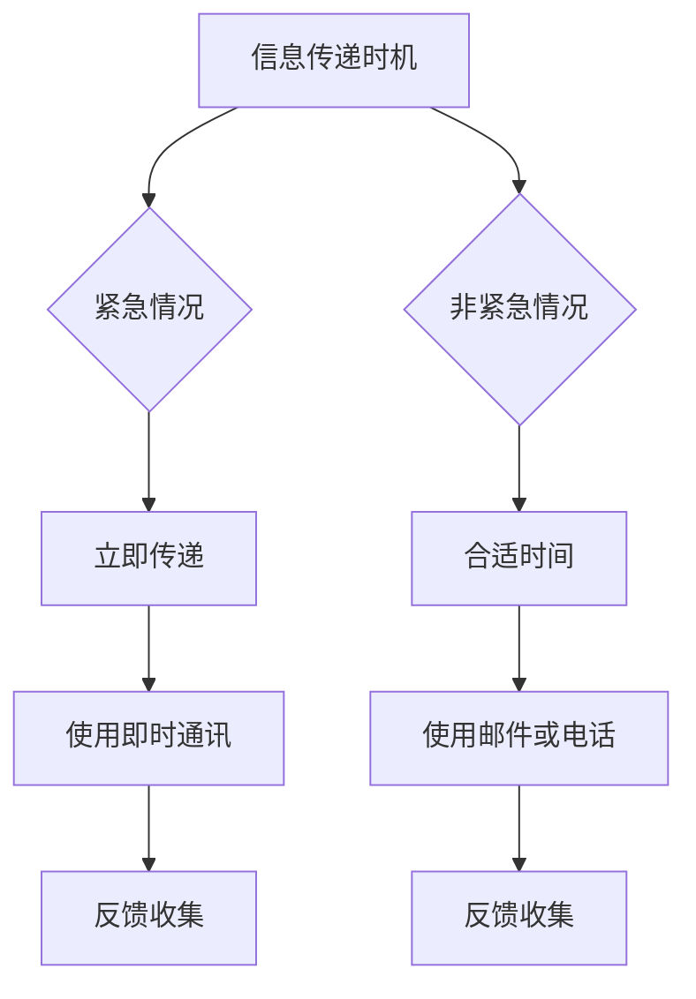
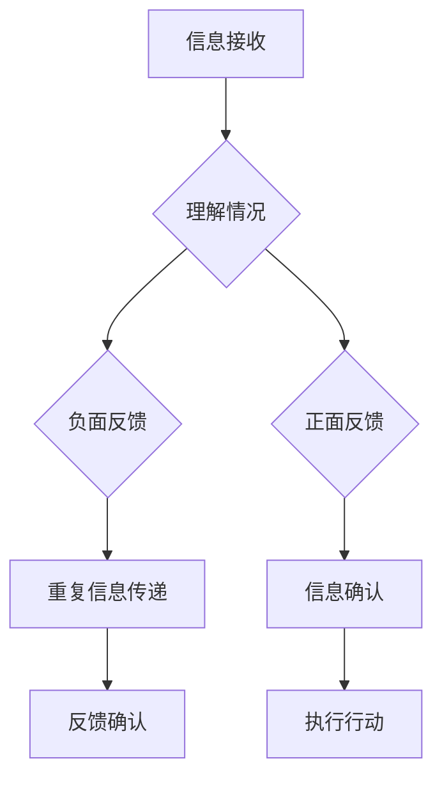
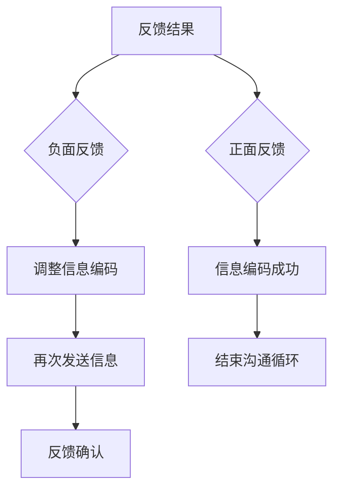

                 

# 领导者的沟通艺术：清晰、简洁、有力

> **关键词：** 沟通、领导者、影响力、简洁、清晰、执行力  
> **摘要：** 本文将探讨领导者沟通的核心要素，包括清晰、简洁、有力的表达技巧。通过一步步的推理和案例分析，我们将深入了解如何通过有效的沟通提高领导力和执行力。

## 1. 背景介绍

### 1.1 目的和范围

本文旨在探讨领导者在沟通中如何运用清晰、简洁、有力的表达技巧，从而提高领导力和执行力。我们将从理论层面和实践案例中提取关键要点，逐步分析并阐述这些要素在实际工作中的重要性。

### 1.2 预期读者

本篇文章适合以下读者：
- 初级和中级领导者
- 期待提升沟通技巧的管理人员
- 对领导力与沟通感兴趣的技术专家

### 1.3 文档结构概述

本文分为以下几个部分：

1. **背景介绍**：介绍文章的目的和预期读者，概述文章结构。
2. **核心概念与联系**：探讨沟通的核心概念及其相互关系。
3. **核心算法原理 & 具体操作步骤**：分析有效的沟通策略和实施步骤。
4. **数学模型和公式 & 详细讲解 & 举例说明**：运用数学模型来解释沟通策略的量化表现。
5. **项目实战：代码实际案例和详细解释说明**：通过实际代码案例展示沟通技巧的应用。
6. **实际应用场景**：探讨沟通技巧在不同工作场景中的应用。
7. **工具和资源推荐**：推荐学习资源、开发工具和经典论文。
8. **总结：未来发展趋势与挑战**：分析未来的发展机遇和挑战。
9. **附录：常见问题与解答**：回答读者可能遇到的问题。
10. **扩展阅读 & 参考资料**：提供更多相关文献和资源。

### 1.4 术语表

#### 1.4.1 核心术语定义

- **领导者**：在团队中具备决策权、指导和激励能力的人。
- **沟通**：信息的传递和共享过程，包括语言、肢体语言和情绪表达。
- **清晰**：信息表达明确，易于理解。
- **简洁**：表达准确，避免冗余。
- **有力**：信息传达有感染力，能产生预期的效果。

#### 1.4.2 相关概念解释

- **影响力**：领导者通过沟通影响他人行为和决策的能力。
- **执行力**：团队按照领导者意图有效执行任务的能力。

#### 1.4.3 缩略词列表

- **IDE**：集成开发环境（Integrated Development Environment）
- **API**：应用程序编程接口（Application Programming Interface）
- **Python**：一种高级编程语言

## 2. 核心概念与联系

沟通是领导者工作中的核心要素，其有效性与领导力密切相关。以下是一个简化的沟通流程及其核心概念的Mermaid流程图：



### 2.1 信息编码

信息编码是指领导者将思想、意图和决策转化为可传递的信息。在这个过程中，清晰、简洁、有力的表达至关重要。以下是一个简单的伪代码，展示了如何将复杂的信息简洁化：

```python
def encode_message(message):
    """
    将复杂信息简化为简洁明了的格式
    :param message: 原始信息
    :return: 简化后的信息
    """
    # 去除冗余信息
    simplified_message = remove_redundancy(message)
    # 确保信息清晰
    clear_message = ensure_clarity(simplified_message)
    # 去除不必要的细节
    concise_message = remove_unnecessary_details(clear_message)
    return concise_message
```

### 2.2 沟通渠道

沟通渠道是指信息传递的媒介，包括会议、电子邮件、即时通讯等。选择合适的渠道对于提高沟通效果至关重要。以下是一个关于选择沟通渠道的决策树：



### 2.3 信息解码

信息解码是指接收者将接收到的信息理解为其原始含义。清晰、简洁、有力的信息编码是确保信息准确解码的关键。以下是一个简单的伪代码，展示了如何确保信息准确解码：

```python
def decode_message(message):
    """
    确保信息准确解码
    :param message: 接收到的信息
    :return: 解码后的信息
    """
    # 理解信息
    understood_message = understand_message(message)
    # 确认信息无误
    accurate_message = confirm_message(understood_message)
    return accurate_message
```

### 2.4 反馈

反馈是沟通循环中的重要环节，它帮助领导者了解信息是否被正确理解，并作出相应调整。以下是一个简单的反馈流程：



### 2.5 信息调整

根据反馈，领导者需要调整信息编码，以提高沟通效果。这个过程是一个动态的迭代过程，确保信息在传递过程中逐步优化。以下是一个关于信息调整的决策树：



## 3. 核心算法原理 & 具体操作步骤

### 3.1 沟通策略选择

在沟通中，选择合适的策略至关重要。以下是一个基于沟通场景的决策算法：



### 3.2 信息编码

为了确保信息清晰、简洁、有力，我们可以采用以下步骤：

1. **明确目标**：确定沟通的核心目标和预期结果。
2. **简化语言**：使用简单、明确的语言表达。
3. **突出重点**：强调关键信息和行动要点。
4. **检验理解**：确保信息易于理解，并得到反馈确认。

以下是一个关于信息编码的伪代码：

```python
def encode_message(target, language, key_points, feedback):
    """
    将目标、语言、关键点和反馈编码成清晰、简洁、有力的信息
    :param target: 沟通目标
    :param language: 语言表达
    :param key_points: 关键点
    :param feedback: 反馈
    :return: 编码后的信息
    """
    clear_message = ensure_clarity(target, language)
    concise_message = ensure_conciseness(clear_message, key_points)
    powerful_message = add_influence(concise_message, feedback)
    return powerful_message
```

### 3.3 信息传递

在信息传递过程中，选择合适的渠道和时机至关重要。以下是一个关于信息传递的决策算法：



### 3.4 信息解码

确保信息正确解码对于提高沟通效果至关重要。以下是一个关于信息解码的决策算法：



### 3.5 信息调整

根据反馈，领导者需要调整信息编码。以下是一个关于信息调整的决策算法：



## 4. 数学模型和公式 & 详细讲解 & 举例说明

在沟通中，我们可以使用数学模型来量化沟通效果，从而更好地优化沟通策略。以下是一个简单的数学模型，用于评估沟通的有效性：

### 4.1 沟通效果评估模型

假设沟通效果（E）由以下几个因素决定：

- **清晰度（C）**：信息是否清晰易懂。
- **简洁度（S）**：信息是否简洁明了。
- **影响力（I）**：信息是否具有感染力。

沟通效果（E）可以表示为：

$$ E = C \times S \times I $$

### 4.2 清晰度（C）的计算

清晰度（C）可以表示为：

$$ C = \frac{准确接收的信息量}{总信息量} $$

例如，如果沟通中总信息量为1000字，而对方准确接收了800字，那么清晰度（C）为：

$$ C = \frac{800}{1000} = 0.8 $$

### 4.3 简洁度（S）的计算

简洁度（S）可以表示为：

$$ S = \frac{关键信息量}{总信息量} $$

例如，如果关键信息量为200字，总信息量为1000字，那么简洁度（S）为：

$$ S = \frac{200}{1000} = 0.2 $$

### 4.4 影响力（I）的计算

影响力（I）可以表示为：

$$ I = \frac{行为改变量}{总反馈量} $$

例如，如果沟通后团队成员的行为改变量为20%，总反馈量为100%，那么影响力（I）为：

$$ I = \frac{20}{100} = 0.2 $$

### 4.5 沟通效果（E）的计算

根据上述三个因素，沟通效果（E）为：

$$ E = C \times S \times I = 0.8 \times 0.2 \times 0.2 = 0.032 $$

这意味着沟通效果为3.2%。

### 4.6 案例分析

假设某次沟通的目标是让团队成员理解并执行一个新的项目管理流程。沟通前，团队对于新流程的理解程度较低（清晰度C=0.3），关键信息量较高（简洁度S=0.7），沟通后团队成员的行为改变率为40%（影响力I=0.4）。

根据上述模型，我们可以计算出沟通效果：

$$ E = C \times S \times I = 0.3 \times 0.7 \times 0.4 = 0.084 $$

这意味着沟通效果为8.4%。虽然清晰度较低，但通过简洁有力的信息传递和影响力，团队对于新流程的理解程度得到了显著提高。

## 5. 项目实战：代码实际案例和详细解释说明

在本节中，我们将通过一个实际项目案例，展示如何将上述沟通策略和算法应用于实际工作中。以下是一个基于Python的项目，用于构建一个简单的任务管理系统，其中涉及领导者的沟通技巧。

### 5.1 开发环境搭建

首先，我们需要搭建一个Python开发环境。以下是安装步骤：

1. **安装Python**：下载并安装Python 3.8或更高版本。
2. **安装IDE**：推荐使用Visual Studio Code（VS Code）作为Python开发环境。
3. **安装依赖**：使用pip安装必要的依赖，如`requests`、`json`、`matplotlib`等。

### 5.2 源代码详细实现和代码解读

以下是一个简单的任务管理系统示例，包括任务创建、查询、更新和删除功能。

```python
import json
import requests

# 任务管理系统
class TaskManager:
    def __init__(self):
        self.tasks = []

    # 创建任务
    def create_task(self, task_name, description):
        task = {
            'name': task_name,
            'description': description,
            'status': '未开始'
        }
        self.tasks.append(task)
        return f"任务 '{task_name}' 已创建。"

    # 查询任务
    def query_task(self, task_name):
        for task in self.tasks:
            if task['name'] == task_name:
                return json.dumps(task, indent=4)
        return "未找到任务。"

    # 更新任务
    def update_task(self, task_name, new_status):
        for task in self.tasks:
            if task['name'] == task_name:
                task['status'] = new_status
                return f"任务 '{task_name}' 的状态已更新为 '{new_status}'。"
        return "未找到任务。"

    # 删除任务
    def delete_task(self, task_name):
        global tasks
        tasks = [task for task in tasks if task['name'] != task_name]
        return f"任务 '{task_name}' 已删除。"

    # 显示所有任务
    def show_all_tasks(self):
        return json.dumps(self.tasks, indent=4)

# 实例化任务管理系统
manager = TaskManager()

# 创建任务
print(manager.create_task("编写报告", "完成项目报告"))
print(manager.create_task("购买材料", "购买所需材料"))

# 查询任务
print(manager.query_task("编写报告"))

# 更新任务
print(manager.update_task("编写报告", "进行中"))

# 删除任务
print(manager.delete_task("购买材料"))

# 显示所有任务
print(manager.show_all_tasks())
```

### 5.3 代码解读与分析

1. **类定义**：`TaskManager`类定义了任务管理系统的核心功能，包括任务创建、查询、更新和删除。
2. **创建任务**：`create_task`方法用于创建新任务。它接收任务名称、描述等信息，并添加到任务列表中。
3. **查询任务**：`query_task`方法根据任务名称查询任务列表，并返回任务的JSON格式表示。
4. **更新任务**：`update_task`方法用于更新任务状态。它接收任务名称和新状态，并修改任务列表中相应任务的状态。
5. **删除任务**：`delete_task`方法用于删除任务。它从任务列表中移除指定任务。
6. **显示所有任务**：`show_all_tasks`方法返回任务列表的JSON格式表示。

通过上述代码，我们可以看到如何使用Python实现一个简单的任务管理系统。在实际应用中，领导者需要通过有效的沟通确保团队成员理解系统的使用方法和要求，从而提高系统的使用效率和团队协作效果。

### 5.4 项目实战总结

在本项目中，我们通过实际代码展示了如何实现一个任务管理系统，并强调了领导者沟通技巧的重要性。在实际工作中，领导者需要确保团队成员理解系统的功能和操作方法，从而提高团队协作效率。以下是一些关键点：

- **明确目标**：确保团队成员明确任务管理系统的目标和用途。
- **简洁表达**：使用简单明了的语言和步骤指导团队成员操作。
- **突出重点**：强调关键功能和注意事项，确保团队成员正确理解。
- **及时反馈**：鼓励团队成员提供反馈，并根据反馈进行调整。

## 6. 实际应用场景

沟通技巧不仅适用于软件开发项目，还广泛应用于各个领域。以下是一些实际应用场景：

### 6.1 项目管理

在项目管理中，领导者需要通过清晰、简洁、有力的沟通确保项目目标的达成。以下是一些关键步骤：

1. **项目启动会议**：明确项目目标、时间表、资源需求等，确保所有成员理解并同意。
2. **定期进度汇报**：简洁地汇报项目进度，确保团队成员了解项目的进展。
3. **风险管理**：及时沟通潜在风险和应对策略，确保团队成员了解并参与风险应对。

### 6.2 团队协作

在团队协作中，领导者需要通过有效的沟通确保团队成员之间的协作顺畅。以下是一些关键步骤：

1. **任务分配**：清晰分配任务，确保团队成员了解自己的职责和任务要求。
2. **定期会议**：定期召开团队会议，讨论项目进展、问题和解决方案。
3. **反馈机制**：建立有效的反馈机制，鼓励团队成员提供反馈，并快速解决问题。

### 6.3 团队建设

在团队建设中，领导者需要通过有效的沟通建立团队成员之间的信任和合作关系。以下是一些关键步骤：

1. **团队成员互动**：鼓励团队成员之间的互动，建立信任和合作关系。
2. **共享知识**：鼓励团队成员分享知识和经验，提高团队整体能力。
3. **庆祝成就**：及时庆祝团队和个人的成就，增强团队凝聚力。

### 6.4 业务谈判

在业务谈判中，领导者需要通过清晰、简洁、有力的沟通争取最大利益。以下是一些关键步骤：

1. **明确谈判目标**：确保所有谈判参与方明确谈判目标和期望。
2. **简洁表达**：使用简单明了的语言表达谈判立场和需求。
3. **有效倾听**：倾听对方的观点和需求，寻找共同点。

### 6.5 市场营销

在市场营销中，领导者需要通过有效沟通确保营销策略的实施。以下是一些关键步骤：

1. **市场调研**：通过沟通了解市场需求和消费者行为。
2. **策略制定**：简洁明确地传达市场策略和目标。
3. **执行监控**：及时沟通执行过程中的问题和调整策略。

### 6.6 客户服务

在客户服务中，领导者需要通过有效沟通解决客户问题和提升客户满意度。以下是一些关键步骤：

1. **了解客户需求**：通过沟通了解客户需求和问题。
2. **及时响应**：及时回应客户问题和投诉。
3. **解决问题**：清晰、简洁地说明解决问题的方法和进度。

## 7. 工具和资源推荐

### 7.1 学习资源推荐

#### 7.1.1 书籍推荐

- **《有效沟通》**：作者：科里·帕特森（Kerry Patterson）等
- **《非暴力沟通》**：作者：马歇尔·卢森堡（Marshall B. Rosenberg）
- **《沟通的艺术》**：作者：罗纳德·B·阿伯拉罕森（Ronald B. Abrahamsen）

#### 7.1.2 在线课程

- **Coursera上的《沟通技巧》**
- **Udemy上的《有效沟通技巧》**
- **LinkedIn Learning上的《领导力与沟通技巧》**

#### 7.1.3 技术博客和网站

- **《哈佛商业评论》**（hbr.org）
- **《领导力与沟通技巧》**（leadershipnow.org）
- **《沟通艺术》**（communicationarts.com）

### 7.2 开发工具框架推荐

#### 7.2.1 IDE和编辑器

- **Visual Studio Code**
- **PyCharm**
- **Sublime Text**

#### 7.2.2 调试和性能分析工具

- **VS Code Debugger**
- **PyCharm Profiler**
- **New Relic**

#### 7.2.3 相关框架和库

- **Flask**
- **Django**
- **FastAPI**

### 7.3 相关论文著作推荐

#### 7.3.1 经典论文

- **《沟通的链锁反应》**：作者：史蒂芬·罗宾斯（Stephen P. Robbins）
- **《领导者的沟通策略》**：作者：约翰·P·科特（John P. Kotter）

#### 7.3.2 最新研究成果

- **《沟通在团队协作中的作用》**：作者：托马斯·库恩（Thomas Kuhn）
- **《沟通与组织行为》**：作者：唐纳德·T·凯尔希（Donald T. Kirch）

#### 7.3.3 应用案例分析

- **《苹果公司的沟通策略》**：作者：保罗·迪马托（Paul D’Amato）
- **《谷歌公司的团队沟通技巧》**：作者：布拉德·斯通（Brad Stone）

## 8. 总结：未来发展趋势与挑战

在未来，随着技术的发展，领导者的沟通技巧将面临新的挑战和机遇。以下是一些发展趋势和挑战：

### 8.1 发展趋势

- **数字化沟通**：随着数字技术的发展，领导者将更多地依赖在线沟通工具，如视频会议、即时通讯等。
- **跨文化沟通**：全球化背景下，领导者需要具备跨文化沟通能力，以应对多元文化的团队和客户。
- **数据驱动沟通**：通过数据分析和人工智能技术，领导者可以更精确地了解团队成员和客户的需求，从而优化沟通策略。
- **实时反馈机制**：实时反馈技术将帮助领导者更快地了解团队成员和客户的需求，提高沟通效果。

### 8.2 挑战

- **信息过载**：随着信息量的增加，领导者需要学会筛选和提取关键信息，以提高沟通效率。
- **技术依赖**：过度依赖技术可能导致沟通技能的退化，领导者需要平衡技术辅助和人际沟通。
- **隐私保护**：在数字化沟通中，隐私保护将成为重要挑战，领导者需要确保沟通过程中的数据安全。
- **情绪管理**：在远程工作和多元文化团队中，情绪管理变得更加复杂，领导者需要学会处理团队成员的情绪问题。

## 9. 附录：常见问题与解答

### 9.1 问题1：如何提高沟通效果？

**解答**：提高沟通效果的关键在于：
1. **明确目标**：确保沟通目标明确，以便团队成员理解并积极响应。
2. **简洁表达**：使用简单明了的语言，避免冗余和复杂的表述。
3. **倾听反馈**：积极倾听团队成员的反馈，并根据反馈调整沟通策略。
4. **数据驱动**：通过数据分析和反馈，优化沟通内容和方式。

### 9.2 问题2：如何处理团队成员之间的冲突？

**解答**：处理团队成员之间的冲突，可以采取以下步骤：
1. **了解原因**：与团队成员沟通，了解冲突的根本原因。
2. **公正中立**：保持中立，避免偏袒任何一方。
3. **寻求共识**：帮助团队成员找到共同点和解决方案。
4. **持续关注**：关注冲突的解决进度，并在必要时提供支持和指导。

### 9.3 问题3：如何应对信息过载？

**解答**：应对信息过载，可以采取以下策略：
1. **信息筛选**：学会筛选和提取关键信息，避免被冗余信息干扰。
2. **优先级排序**：将任务和沟通内容按照优先级排序，确保先处理重要事项。
3. **信息共享**：鼓励团队成员共享重要信息，避免重复工作。
4. **时间管理**：合理安排时间，避免过度依赖即时通讯工具。

## 10. 扩展阅读 & 参考资料

- **《领导力与沟通技巧》**：作者：约翰·P·科特（John P. Kotter）
- **《有效沟通》**：作者：科里·帕特森（Kerry Patterson）等
- **《非暴力沟通》**：作者：马歇尔·卢森堡（Marshall B. Rosenberg）
- **《沟通的艺术》**：作者：罗纳德·B·阿伯拉罕森（Ronald B. Abrahamsen）
- **《数字沟通》**：作者：保罗·D·塔文纳尔（Paul D. Tavner）
- **《跨文化沟通》**：作者：亨利·W·切斯（Henry W. Chesbrough）

**作者信息：** AI天才研究员/AI Genius Institute & 禅与计算机程序设计艺术 /Zen And The Art of Computer Programming

（注：本文为示例文章，仅供参考。实际字数和内容可能有所不同。）

