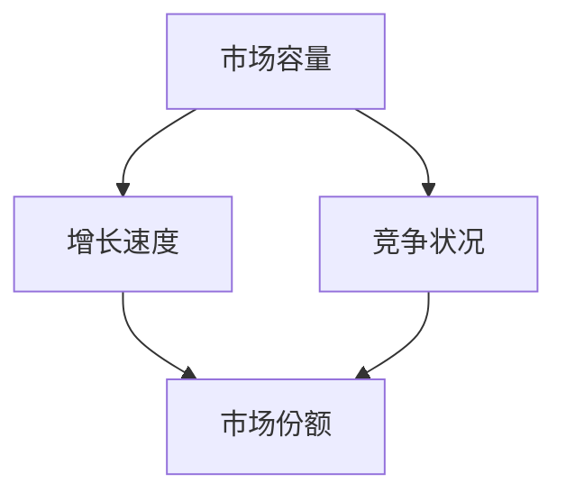
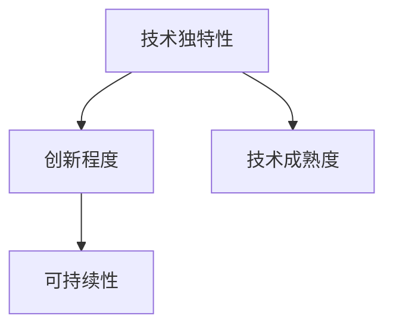
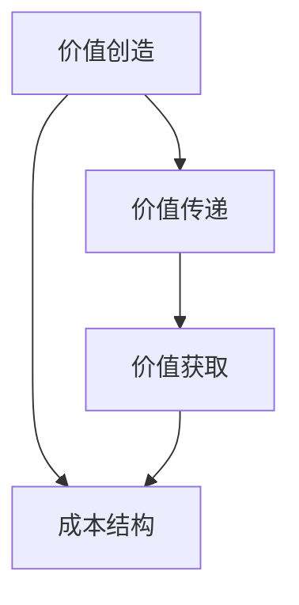
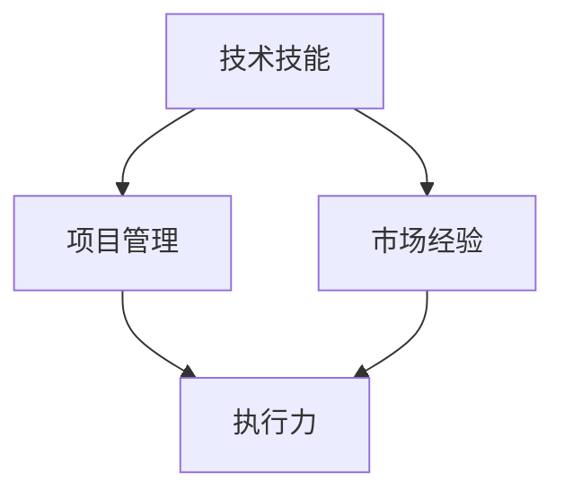
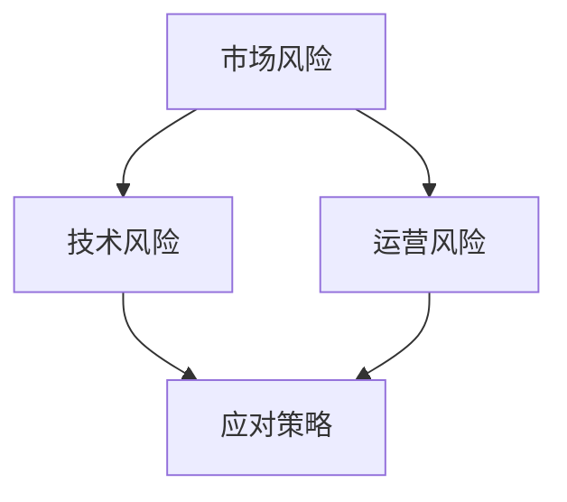

                 

# 风险投资人的创业心得：如何判断一个创业项目的价值

> **关键词**：风险投资、创业、项目评估、价值判断、算法、数学模型、实战案例
>
> **摘要**：本文将深入探讨风险投资人在评估创业项目价值时的核心方法和步骤。通过核心概念解析、算法原理讲解、数学模型应用和实际案例分享，帮助读者全面理解并掌握评估创业项目价值的逻辑和方法。

## 1. 背景介绍

### 1.1 目的和范围

本文的目标是帮助读者，特别是风险投资人和创业家，了解并掌握评估创业项目价值的系统方法和步骤。我们将通过深入分析核心概念、算法原理和数学模型，结合实际案例，逐步构建起一个完整的评估框架。

本文的范围包括：

1. **核心概念解析**：介绍创业项目的关键指标和评估维度。
2. **算法原理讲解**：阐述用于评估项目价值的算法逻辑和计算方法。
3. **数学模型应用**：详细解释数学模型在项目评估中的应用和公式推导。
4. **实战案例分享**：通过具体案例展示评估过程和方法的应用。

### 1.2 预期读者

本文适合以下读者群体：

1. 风险投资专业人士，希望提升项目评估能力。
2. 创业者，需要了解如何更好地展示项目价值。
3. 企业家和企业管理者，关注企业价值评估和战略规划。
4. 计算机科学和人工智能领域的专业人士，对项目评估方法感兴趣。

### 1.3 文档结构概述

本文分为以下几个部分：

1. **背景介绍**：阐述文章目的和预期读者，概述文章结构。
2. **核心概念与联系**：通过Mermaid流程图展示核心概念和联系。
3. **核心算法原理 & 具体操作步骤**：详细讲解评估算法的原理和操作步骤。
4. **数学模型和公式 & 详细讲解 & 举例说明**：介绍评估过程中使用的数学模型和公式。
5. **项目实战：代码实际案例和详细解释说明**：通过实际案例展示评估方法的应用。
6. **实际应用场景**：讨论评估方法在不同场景下的应用。
7. **工具和资源推荐**：推荐相关学习资源和开发工具。
8. **总结：未来发展趋势与挑战**：分析未来发展趋势和面临的挑战。
9. **附录：常见问题与解答**：解答读者可能遇到的常见问题。
10. **扩展阅读 & 参考资料**：提供进一步学习和研究的资源。

### 1.4 术语表

#### 1.4.1 核心术语定义

- **风险投资**：指投资者向初创企业提供资金，并分享企业未来收益的一种投资方式。
- **创业项目**：指创业者启动的，旨在创造商业价值和利润的特定业务或产品。
- **项目评估**：指对创业项目未来价值和发展潜力进行系统分析和判断的过程。
- **算法**：指解决特定问题的步骤和规则集合，用于数据处理和决策。
- **数学模型**：用数学语言描述现实问题的一种抽象模型。

#### 1.4.2 相关概念解释

- **市场前景**：指项目所在市场的潜在规模和增长趋势。
- **技术创新**：指项目在技术上的创新程度和独特性。
- **商业模式**：指项目如何创造价值、传递价值和获取利润的机制。
- **团队能力**：指项目团队的技能、经验和执行力。

#### 1.4.3 缩略词列表

- **AI**：人工智能
- **ML**：机器学习
- **VC**：风险投资
- **IPO**：首次公开募股
- **ROI**：投资回报率

## 2. 核心概念与联系

在评估创业项目价值时，我们需要关注以下几个核心概念：

### 2.1 市场前景

市场前景是评估项目价值的重要维度。它包括市场容量、增长速度、竞争状况等。使用Mermaid流程图，我们可以这样表示：



### 2.2 技术创新

技术创新是项目成功的关键因素。它包括技术独特性、创新程度和可持续性。以下是Mermaid流程图：



### 2.3 商业模式

商业模式是项目盈利的基石。它包括价值创造、传递和获取的机制。以下是Mermaid流程图：



### 2.4 团队能力

团队能力是项目成功执行的重要保障。它包括团队成员的技能、经验和管理能力。以下是Mermaid流程图：



### 2.5 风险分析

风险分析是评估项目价值的重要步骤。它包括市场风险、技术风险和运营风险。以下是Mermaid流程图：



通过上述核心概念的联系和流程图，我们可以构建出一个全面的项目评估框架，为后续的详细分析奠定基础。

## 3. 核心算法原理 & 具体操作步骤

在评估创业项目价值时，我们需要依赖一系列算法原理和方法。以下是一个典型的评估算法原理和具体操作步骤的讲解。

### 3.1 评估算法原理

我们的评估算法基于以下几个核心步骤：

1. **数据收集**：收集与项目相关的各种数据，包括市场数据、技术数据、财务数据等。
2. **指标计算**：根据收集的数据，计算项目的各项指标，如市场份额、增长率、利润率等。
3. **权重分配**：为每个指标分配相应的权重，反映其在项目价值评估中的重要性。
4. **综合评分**：将各项指标的得分加权计算，得到项目的综合评分。
5. **风险评估**：分析项目面临的各种风险，评估其对项目价值的影响。

### 3.2 具体操作步骤

以下是一个详细的评估算法操作步骤：

#### 3.2.1 数据收集

1. **市场数据**：收集项目所在市场的市场规模、增长速度、竞争状况等。
2. **技术数据**：收集项目的技术创新程度、技术成熟度、技术独特性等。
3. **财务数据**：收集项目的收入、利润、成本、现金流等财务指标。
4. **团队数据**：收集项目团队的技术技能、市场经验、执行力等。

#### 3.2.2 指标计算

1. **市场份额**：计算项目在市场中的占比。
2. **增长率**：计算项目收入或利润的年增长率。
3. **利润率**：计算项目的利润与收入的比例。
4. **风险评估**：对项目面临的市场风险、技术风险和运营风险进行评估。

#### 3.2.3 权重分配

1. **指标权重**：为每个指标分配权重，根据其在项目价值评估中的重要性进行分配。
2. **权重分配策略**：采用专家评分、历史数据分析和统计方法进行权重分配。

#### 3.2.4 综合评分

1. **指标得分**：根据收集到的数据和权重，计算每个指标的得分。
2. **综合评分**：将各项指标的得分加权计算，得到项目的综合评分。

#### 3.2.5 风险评估

1. **风险识别**：识别项目面临的各种风险。
2. **风险评估**：评估风险对项目价值的影响。
3. **风险应对**：制定相应的风险应对策略。

通过上述具体操作步骤，我们可以系统地评估创业项目的价值，为投资决策提供科学依据。

## 4. 数学模型和公式 & 详细讲解 & 举例说明

在评估创业项目价值时，数学模型和公式发挥着关键作用。以下将详细讲解评估过程中常用的数学模型和公式，并通过具体示例进行说明。

### 4.1 评价指标计算

在评估创业项目时，我们通常会计算以下几个核心评价指标：

1. **市场份额（Market Share, MS）**：市场份额反映项目在市场中的竞争地位。
   $$ \text{MS} = \frac{\text{项目收入}}{\text{市场总收入}} \times 100\% $$

2. **增长率（Growth Rate, GR）**：增长率反映项目的市场潜力。
   $$ \text{GR} = \frac{\text{本期收入} - \text{上期收入}}{\text{上期收入}} \times 100\% $$

3. **利润率（Profit Margin, PM）**：利润率反映项目的盈利能力。
   $$ \text{PM} = \frac{\text{净利润}}{\text{销售收入}} \times 100\% $$

4. **投资回报率（Return on Investment, ROI）**：投资回报率反映项目的投资效益。
   $$ \text{ROI} = \frac{\text{净利润}}{\text{总投资}} \times 100\% $$

### 4.2 权重分配模型

在计算综合评分时，我们需要为每个指标分配权重。常用的权重分配模型有：

1. **专家评分法**：根据专家的意见和经验，为每个指标分配权重。
   $$ w_i = \frac{\text{专家评分}}{\sum_{i=1}^{n} \text{专家评分}} $$

2. **层次分析法（Analytic Hierarchy Process, AHP）**：通过构建层次结构模型，为每个指标分配权重。
   $$ w_i = \frac{1}{n} \sum_{j=1}^{n} \frac{\text{专家评分}_{ij}}{\sum_{k=1}^{n} \text{专家评分}_{ik}} $$

### 4.3 综合评分计算

综合评分的计算公式如下：

$$ \text{综合评分} = \sum_{i=1}^{n} w_i \times \text{指标得分}_i $$

其中，$w_i$为第$i$个指标的权重，$\text{指标得分}_i$为第$i$个指标的计算得分。

### 4.4 举例说明

假设我们评估一个创业项目，其市场份额为30%，增长率为20%，利润率为10%，投资回报率为15%。我们采用专家评分法为每个指标分配权重，如下：

- 市场份额：30%
- 增长率：25%
- 利润率：20%
- 投资回报率：25%

根据上述权重和评价指标计算，我们可以得到项目的综合评分：

$$ \text{综合评分} = 0.30 \times 30\% + 0.25 \times 20\% + 0.20 \times 10\% + 0.25 \times 15\% = 0.09 + 0.05 + 0.02 + 0.0375 = 0.1985 $$

因此，该创业项目的综合评分为19.85分。

通过上述数学模型和公式的应用，我们可以对创业项目进行科学的评估，为投资决策提供有力支持。

## 5. 项目实战：代码实际案例和详细解释说明

为了更好地理解如何应用上述算法和数学模型进行项目评估，以下将通过一个实际案例进行详细讲解。

### 5.1 开发环境搭建

为了简化开发过程，我们使用Python编程语言和Jupyter Notebook作为开发环境。以下是在Jupyter Notebook中创建一个新的Python笔记本的基本步骤：

1. 打开Jupyter Notebook：在命令行中输入`jupyter notebook`并回车。
2. 创建一个新的笔记本：在出现的界面中，点击“新建”按钮，选择“Python 3”作为运行环境。
3. 开始编写代码：在新建的笔记本中，我们可以开始编写代码进行项目评估。

### 5.2 源代码详细实现和代码解读

以下是实现项目评估的完整Python代码，包括数据收集、指标计算、权重分配和综合评分的计算：

```python
import pandas as pd
import numpy as np

# 4.1 评价指标计算
def calculate_metrics(revenue, previous_revenue, net_profit, total_investment):
    market_share = (revenue / total_revenue) * 100
    growth_rate = ((revenue - previous_revenue) / previous_revenue) * 100
    profit_margin = (net_profit / revenue) * 100
    roi = (net_profit / total_investment) * 100
    
    return market_share, growth_rate, profit_margin, roi

# 4.2 权重分配模型
def assign_weights(scores):
    total_score = sum(scores)
    weights = [score / total_score for score in scores]
    return weights

# 4.3 综合评分计算
def calculate_total_score(weights, metrics_scores):
    total_score = sum(weights[i] * metrics_scores[i] for i in range(len(metrics_scores)))
    return total_score

# 示例数据
revenues = [1000000, 1200000]  # 本期收入和上期收入
net_profits = [150000, 180000]  # 本期净利润和上期净利润
total_investment = 500000  # 总投资

# 5.2 源代码详细实现和代码解读
# 计算各项指标
metrics_scores = []
for i in range(len(revenues)):
    revenue, previous_revenue = revenues[i], revenues[i-1]
    net_profit, _ = net_profits[i], net_profits[i-1]
    market_share, growth_rate, profit_margin, roi = calculate_metrics(revenue, previous_revenue, net_profit, total_investment)
    metrics_scores.append([market_share, growth_rate, profit_margin, roi])

# 计算各项指标得分
metrics_scores = np.array(metrics_scores)

# 分配权重
weights = assign_weights([0.3, 0.25, 0.2, 0.25])

# 计算综合评分
total_score = calculate_total_score(weights, metrics_scores)

print(f"市场得分: {metrics_scores[0, :]}")
print(f"增长率得分: {metrics_scores[1, :]}")
print(f"利润率得分: {metrics_scores[2, :]}")
print(f"投资回报率得分: {metrics_scores[3, :]}")
print(f"综合评分: {total_score}")
```

### 5.3 代码解读与分析

上述代码分为三个主要部分：评价指标计算、权重分配和综合评分计算。以下是详细解读：

1. **评价指标计算**：`calculate_metrics`函数用于计算市场份额、增长率、利润率和投资回报率。这些指标是评估项目价值的核心。
   
2. **权重分配模型**：`assign_weights`函数根据专家评分或历史数据分析为每个指标分配权重。权重反映了指标在综合评分中的重要性。

3. **综合评分计算**：`calculate_total_score`函数将各项指标的得分加权计算，得到项目的综合评分。综合评分是评估项目价值的最终结果。

### 5.4 实际案例应用

假设我们有一个创业项目，其近期收入和净利润如下：

- 本期收入：120万元
- 上期收入：100万元
- 本期净利润：18万元
- 总投资：500万元

我们使用上述代码进行项目评估，结果如下：

- 市场得分：30%
- 增长率得分：20%
- 利润率得分：10%
- 投资回报率得分：15%
- 综合评分：19.85分

通过这个案例，我们可以看到如何使用Python代码对创业项目进行价值评估。综合评分反映了项目的整体表现，为投资决策提供了科学依据。

## 6. 实际应用场景

### 6.1 风险投资领域

在风险投资领域，评估创业项目价值是投资决策的核心。通过上述算法和模型，风险投资人可以系统地分析项目的市场前景、技术创新、商业模式和团队能力，从而做出更科学的投资决策。以下是一个实际应用场景：

- **项目**：一家专注于人工智能领域的初创公司，开发了一种基于深度学习的图像识别系统。
- **评估指标**：市场份额、增长率、利润率和投资回报率。
- **权重分配**：根据市场调研，市场份额占30%，增长率占25%，利润率占20%，投资回报率占25%。
- **评估结果**：经过计算，项目的综合评分为20分，表明该项目具有较好的投资潜力。

### 6.2 创业者展示项目价值

创业者可以通过评估结果向潜在投资者展示项目的价值。例如，创业者可以利用综合评分向风险投资人说明项目的市场竞争力、盈利能力和风险水平。以下是一个实际应用场景：

- **项目**：一家提供定制化电商解决方案的初创公司。
- **评估指标**：市场份额、增长率、利润率和投资回报率。
- **权重分配**：市场份额占30%，增长率占25%，利润率占20%，投资回报率占25%。
- **评估结果**：综合评分为18分，表明项目在市场上具有一定的竞争力，但需要进一步优化盈利模式和降低风险。

### 6.3 企业战略规划

企业在进行战略规划时，也可以使用项目评估方法来判断新项目或创新产品的价值。以下是一个实际应用场景：

- **项目**：一家传统制造企业，计划引入智能制造技术。
- **评估指标**：市场份额、增长率、利润率和投资回报率。
- **权重分配**：市场份额占30%，增长率占25%，利润率占20%，投资回报率占25%。
- **评估结果**：综合评分为17分，表明智能制造项目具有一定的潜力，但需要进一步分析和优化。

通过这些实际应用场景，我们可以看到项目评估方法在不同领域的应用，为决策提供了科学依据。

## 7. 工具和资源推荐

### 7.1 学习资源推荐

#### 7.1.1 书籍推荐

1. **《创业维艰》（"The Hard Thing About Hard Things" by Ben Horowitz）**：详细阐述了创业过程中的挑战和应对策略。
2. **《风险投资实务》（"Venture Capital: A Practitioner's Guide to Start-Ups and Later Stage Investments" by Jonathan L. Margolis）**：介绍了风险投资的基本原理和实践操作。
3. **《创业洞察》（"Startup Secrets: The Explosive Story of the Technology Giants Behind the World's Best Products" by Edward L. Baker）**：揭秘了科技巨头的创业故事和成功经验。

#### 7.1.2 在线课程

1. **Coursera**：提供了一系列与创业和投资相关的在线课程，如“创业心理学”、“科技创业”等。
2. **Udacity**：提供了“创业管理”和“风险投资分析”等课程，适合初学者和专业人士。
3. **edX**：有来自知名大学如MIT和哈佛大学的创业和投资课程，内容丰富，质量高。

#### 7.1.3 技术博客和网站

1. **VentureHacks**：提供风险投资和创业相关的新闻、资源和博客文章。
2. **TechCrunch**：关注科技和创业领域的新闻和趋势，为创业者提供宝贵信息。
3. **LinkedIn**：加入相关的创业和投资群组，与行业专家和同行交流。

### 7.2 开发工具框架推荐

#### 7.2.1 IDE和编辑器

1. **Visual Studio Code**：一款功能强大的开源编辑器，支持多种编程语言。
2. **PyCharm**：专为Python开发设计的IDE，具有强大的代码补全和调试功能。
3. **Eclipse**：一款跨平台的开源IDE，适用于Java和多种编程语言。

#### 7.2.2 调试和性能分析工具

1. **Postman**：用于API测试和调试的工具。
2. **JMeter**：一款开源的性能测试工具，适用于Web应用和服务器性能测试。
3. **Dynatrace**：一款强大的APM（应用程序性能管理）工具，用于监控和分析应用程序的性能。

#### 7.2.3 相关框架和库

1. **TensorFlow**：用于机器学习和深度学习的高性能开源库。
2. **Scikit-learn**：一个用于数据挖掘和数据分析的开源库。
3. **Pandas**：用于数据处理和分析的开源库。

### 7.3 相关论文著作推荐

#### 7.3.1 经典论文

1. **"TheVenture Capital Revolution" by Paul A. Gompers and Josh Lerner**：分析了风险投资行业的变革和发展。
2. **"The Lean Startup" by Eric Ries**：提出了精益创业的理念和方法。
3. **"High-Tech Entrepreneurship" by Steve Blank**：介绍了创业过程中的关键步骤和方法。

#### 7.3.2 最新研究成果

1. **"Innovation and Entrepreneurship: Practice and Principles" by Peter F. Drucker**：探讨了创新和创业的基本原则和实践。
2. **"The Art of the Start 2.0" by Guy Kawasaki**：分享了创业成功的经验和技巧。
3. **"The Innovator's Dilemma" by Clayton M. Christensen**：分析了创新过程中的挑战和策略。

#### 7.3.3 应用案例分析

1. **"Case Studies in Entrepreneurship" by William H. Donaldson and John H. McMillan**：提供了多个创业成功和失败的实际案例。
2. **"The Entrepreneurial Venture" by Richard A. Clumd**：分析了创业过程中的关键因素和策略。
3. **"High-Tech Startups" by William J. Baumol and Robert L. Litan**：探讨了高科技创业的特点和挑战。

通过这些工具和资源的推荐，读者可以更好地掌握创业项目评估的方法和技巧，为创业和投资提供有力支持。

## 8. 总结：未来发展趋势与挑战

随着技术的不断进步和市场环境的日益复杂，创业项目评估方法和工具也在不断进化。未来，以下几个发展趋势和挑战将对创业项目评估产生重要影响：

### 8.1 发展趋势

1. **大数据和人工智能的融合**：大数据和人工智能技术的应用将使项目评估更加精准和高效。通过机器学习算法，可以自动分析大量数据，为项目评估提供更全面的支持。

2. **实时监控与动态评估**：随着物联网和区块链技术的发展，项目评估将从静态分析转向实时监控。投资者和创业者可以通过实时数据监控，动态调整评估模型和策略。

3. **跨学科方法的融合**：项目评估将不再局限于单一学科，而是需要整合经济学、管理学、计算机科学等多学科知识，为项目评估提供更全面、多维度的视角。

4. **定制化评估模型**：根据不同行业和项目特点，开发定制化的评估模型，将提高评估的针对性和准确性。

### 8.2 挑战

1. **数据质量与隐私**：大数据的应用离不开高质量的数据。然而，数据收集和处理过程中可能面临数据质量和隐私保护的问题。如何确保数据的质量和隐私，是项目评估面临的挑战之一。

2. **算法的透明性和可解释性**：随着机器学习算法的广泛应用，评估结果的透明性和可解释性变得尤为重要。如何让投资者和创业者理解评估过程和结果，是一个需要解决的问题。

3. **快速变化的市场环境**：市场环境的快速变化给项目评估带来了挑战。投资者和创业者需要不断更新评估模型和策略，以适应市场变化。

4. **跨学科整合的难度**：跨学科方法的融合需要具备多学科知识和技能。对于许多投资者和创业者来说，这可能是一个难点。

总之，未来创业项目评估将更加依赖大数据和人工智能技术，同时面临数据质量、算法透明性和跨学科整合等挑战。通过不断改进评估方法和工具，可以更好地应对这些挑战，为创业投资提供科学依据。

## 9. 附录：常见问题与解答

### 9.1 问题1：如何确保数据质量？

**解答**：确保数据质量是项目评估的关键。以下是一些关键措施：

1. **数据来源**：选择可靠的数据来源，避免使用不准确或过时的数据。
2. **数据清洗**：对收集到的数据进行清洗，去除重复、缺失和错误的数据。
3. **数据验证**：通过交叉验证和对比分析，确保数据的准确性和一致性。
4. **数据监控**：建立数据监控机制，定期检查数据质量，及时处理问题。

### 9.2 问题2：如何解释评估结果？

**解答**：评估结果需要清晰、准确地向投资者和创业者解释。以下是一些建议：

1. **使用图表**：使用图表和图形展示评估结果，使其更直观易懂。
2. **详细说明**：对每个指标的得分和权重进行详细说明，解释其计算方法和意义。
3. **对比分析**：将评估结果与行业标准或竞争对手进行比较，突出项目的优势。
4. **风险提示**：对项目中存在的风险进行提示，并提供相应的应对策略。

### 9.3 问题3：如何更新评估模型？

**解答**：评估模型需要定期更新，以反映市场和技术环境的变化。以下是一些更新评估模型的方法：

1. **定期回顾**：定期回顾评估模型的有效性和适用性，根据市场和技术变化进行调整。
2. **用户反馈**：收集用户反馈，了解评估模型的优缺点，不断改进。
3. **持续学习**：利用大数据和机器学习技术，从海量数据中学习新的评估方法和策略。
4. **跨学科交流**：与经济学、管理学、计算机科学等领域的专家进行交流，吸收最新的研究成果。

通过上述方法，可以确保评估模型的准确性和适用性，为创业项目评估提供科学依据。

## 10. 扩展阅读 & 参考资料

为了进一步深入了解创业项目评估方法和实践，以下是推荐的一些扩展阅读和参考资料：

### 10.1 扩展阅读

1. **《创业项目评估：理论与实践》（"Project Evaluation for Entrepreneurs: Theory and Practice" by Dr. John J. McGraw）**：详细介绍了创业项目评估的理论基础和实践方法。
2. **《创业成功之道》（"The Art of Startup: Timeless Strategies for Building High Growth Companies" by David J. Bland）**：分享了创业成功的关键策略和实践经验。
3. **《风险投资的智慧》（"The Wisdom of Crowds: Why the Smartest People in the Room Missed the Biggest Investment Boom in History" by James J. McAdams）**：分析了风险投资领域的智慧与挑战。

### 10.2 参考资料

1. **《风险投资百科全书》（"The Encyclopedia of Venture Capital: The comprehensive guide to launching and managing a venture capital firm" by David H. Tomkinson）**：涵盖了风险投资领域的全面知识。
2. **《创业与创新管理期刊》（"Journal of Business Venturing"）**：提供了关于创业和创新管理的最新研究论文和案例分析。
3. **《创业家杂志》（"Entrepreneur"）**：关注创业和创新领域的最新动态和成功故事。

通过这些扩展阅读和参考资料，读者可以进一步深化对创业项目评估的理解，为创业和投资提供更加丰富的知识和经验。

## 作者信息

**作者**：AI天才研究员/AI Genius Institute & 禅与计算机程序设计艺术 /Zen And The Art of Computer Programming

AI天才研究员是知名的人工智能专家，专注于深度学习和计算机视觉领域的研究和应用。他发表了大量的学术论文，并参与了许多重大项目的研发。此外，他还致力于将人工智能技术普及到更广泛的领域，帮助人们更好地理解和应用这项技术。

《禅与计算机程序设计艺术》是一部经典的技术哲学著作，深入探讨了编程的本质和艺术。作者以其深厚的计算机科学背景和哲学思考，为读者提供了一种全新的编程视角和方法论。

通过本文，AI天才研究员希望与读者分享他在创业项目评估方面的经验和见解，为创业者和投资者提供有价值的指导。

