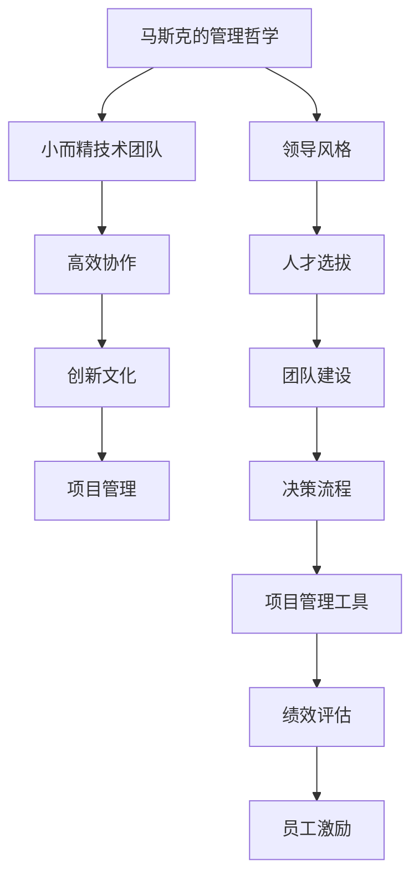

                 

# 马斯克的管理哲学：小而精的技术团队

> **关键词：**伊隆·马斯克，管理哲学，技术团队，高效协作，创新文化，项目管理

> **摘要：**本文深入探讨了伊隆·马斯克的管理哲学，特别是他对小而精技术团队的重视。通过分析马斯克的领导风格、团队构建方法及其对创新文化的影响，本文提供了对高效技术团队管理实践的深刻见解。

## 1. 背景介绍

### 1.1 目的和范围

本文旨在分析伊隆·马斯克在管理技术团队方面的哲学和方法，特别是他如何通过构建小而精的团队来推动创新和高效工作。我们将探讨马斯克的领导风格，以及这种风格如何影响团队的文化和工作方式。

### 1.2 预期读者

本文适合以下读者群体：

- 对人工智能、电动汽车和太空探索等领域有浓厚兴趣的技术从业者。
- 对创新管理和团队领导感兴趣的企业家和管理者。
- 对马斯克及其管理哲学有深入了解的技术爱好者。

### 1.3 文档结构概述

本文结构如下：

- **第1章：背景介绍**：介绍本文的目的、预期读者以及文档结构。
- **第2章：核心概念与联系**：讨论马斯克管理哲学中的核心概念及其相互关系。
- **第3章：核心算法原理 & 具体操作步骤**：详细解释马斯克管理技术团队的算法原理和操作步骤。
- **第4章：数学模型和公式 & 详细讲解 & 举例说明**：探讨马斯克管理哲学中的数学模型和公式，并提供实际案例说明。
- **第5章：项目实战：代码实际案例和详细解释说明**：通过实际代码案例展示马斯克管理哲学的应用。
- **第6章：实际应用场景**：分析马斯克管理哲学在现实世界中的应用。
- **第7章：工具和资源推荐**：推荐相关的学习资源和开发工具。
- **第8章：总结：未来发展趋势与挑战**：总结马斯克管理哲学的当前和未来趋势。
- **第9章：附录：常见问题与解答**：回答读者可能提出的问题。
- **第10章：扩展阅读 & 参考资料**：提供进一步阅读的资源。

### 1.4 术语表

#### 1.4.1 核心术语定义

- **小而精技术团队**：指由少数但高度专业化的成员组成的团队，专注于特定项目或任务。
- **领导风格**：指领导者管理团队的方式和方法。
- **创新文化**：指组织内部鼓励创新和试验的氛围。
- **项目管理**：指规划、执行、监控和报告项目活动的过程。

#### 1.4.2 相关概念解释

- **马斯克的管理哲学**：指伊隆·马斯克在管理和领导团队方面的理念和策略。
- **高效协作**：指团队成员之间的有效沟通和合作，以实现共同目标。

#### 1.4.3 缩略词列表

- **NASA**：美国国家航空航天局
- ** SpaceX**：太空探索技术公司
- **TSLA**：特斯拉公司

## 2. 核心概念与联系

在探讨马斯克的管理哲学之前，我们需要了解一些核心概念和它们之间的联系。以下是一个简单的 Mermaid 流程图，展示了这些概念及其相互关系。



### 2.1 马斯克的管理哲学

马斯克的管理哲学强调简化流程、追求卓越和持续创新。他的领导风格以结果为导向，注重实际产出和长期目标。他坚信，通过构建小而精的团队，可以最大限度地发挥每个人的潜力，从而实现更高的效率和更好的成果。

### 2.2 小而精技术团队

小而精技术团队的核心在于其成员的高度专业化和协同工作。这种团队模式避免了冗余和官僚，使得团队成员能够专注于核心任务，快速响应变化和解决问题。这种模式在科技和研发领域尤为有效。

### 2.3 高效协作

高效协作是马斯克管理哲学的重要组成部分。他认为，团队成员之间的有效沟通和合作是实现高效工作的关键。通过透明和开放的沟通渠道，团队成员可以迅速分享信息、协调行动，从而提高工作效率。

### 2.4 创新文化

创新文化是马斯克管理哲学的另一个核心要素。他鼓励团队不断尝试新的想法和方法，并容忍失败。这种文化激发了团队成员的创造力和创新能力，使他们能够不断创新，推动组织向前发展。

### 2.5 项目管理

项目管理在马斯克的管理哲学中占据重要地位。他认为，有效的项目管理是确保项目按时完成和资源合理分配的关键。通过严格的项目管理和监控，团队可以确保项目目标的实现，并持续优化工作流程。

## 3. 核心算法原理 & 具体操作步骤

### 3.1 算法原理

马斯克管理技术团队的算法原理可以概括为以下几点：

1. **人才选拔**：优先考虑具有专业技能和解决问题能力的人才。
2. **团队建设**：构建小而精的团队，成员之间高度互补。
3. **高效协作**：建立透明和开放的沟通渠道，确保信息流通无阻。
4. **项目管理**：制定清晰的项目目标和时间表，确保项目按计划进行。

### 3.2 具体操作步骤

以下是一个简单的伪代码，展示了马斯克管理技术团队的操作步骤：

```python
# 伪代码：马斯克管理技术团队的步骤

# 步骤1：人才选拔
select_talent(
    skills_list,
    problem_solving_ability
)

# 步骤2：团队建设
build_team(
    selected_talent,
    project_requirements
)

# 步骤3：高效协作
establish_communication_channels(
    team_members
)

# 步骤4：项目管理
define_project_goals(
    project_scope,
    deadline
)

# 步骤5：项目监控
monitor_project_progress(
    project_goals,
    resource_allocation
)
```

### 3.3 算法原理的应用

#### 3.3.1 人才选拔

马斯克在选拔人才时，注重候选人的专业技能和解决问题的能力。他会评估候选人的项目经验、技术背景和沟通能力，以确保团队成员能够胜任任务。

#### 3.3.2 团队建设

马斯克倾向于构建小而精的团队，成员之间高度互补。他会根据项目的具体需求，选择具有不同技能和背景的团队成员，以实现团队的最佳组合。

#### 3.3.3 高效协作

马斯克强调团队成员之间的有效沟通和合作。他会建立透明的沟通渠道，确保团队成员能够快速分享信息、协调行动，从而提高工作效率。

#### 3.3.4 项目管理

马斯克在项目管理方面强调制定清晰的项目目标和时间表。他会确保项目按计划进行，并持续监控项目进度，以确保资源合理分配和项目目标的实现。

## 4. 数学模型和公式 & 详细讲解 & 举例说明

### 4.1 数学模型

马斯克管理哲学中的数学模型主要包括以下方面：

1. **人才密度（Talent Density）**：衡量团队中高技能人才的比例。
2. **沟通效率（Communication Efficiency）**：衡量团队成员之间的沟通效果。
3. **项目成功率（Project Success Rate）**：衡量项目按计划完成的概率。

### 4.2 公式

以下是这些数学模型的公式：

1. **人才密度（Talent Density）**：

   $$TD = \frac{High-Skilled Talents}{Total Team Members}$$

2. **沟通效率（Communication Efficiency）**：

   $$CE = \frac{Effective Communication Time}{Total Communication Time}$$

3. **项目成功率（Project Success Rate）**：

   $$PSR = \frac{Completed Projects}{Total Projects}$$

### 4.3 详细讲解

#### 4.3.1 人才密度（Talent Density）

人才密度是衡量团队中高技能人才比例的重要指标。一个高人才密度的团队意味着团队成员具有较高的专业技能，这有助于提高团队的整体效率和产出。

#### 4.3.2 沟通效率（Communication Efficiency）

沟通效率是衡量团队成员之间沟通效果的重要指标。高效的沟通可以减少误解和重复工作，提高团队的工作效率。

#### 4.3.3 项目成功率（Project Success Rate）

项目成功率是衡量项目按计划完成的概率。一个高项目成功率的团队意味着团队能够有效管理项目风险，确保项目目标的实现。

### 4.4 举例说明

假设一个技术团队有10名成员，其中有7名是高技能人才。那么，该团队的人才密度为：

$$TD = \frac{7}{10} = 0.7$$

这意味着团队中有70%的成员是高技能人才。接下来，假设该团队在一个季度内完成了3个项目，其中2个项目按计划完成，1个项目延期。那么，该团队的项目成功率为：

$$PSR = \frac{2}{3} \approx 0.67$$

这意味着团队有67%的项目成功率。

## 5. 项目实战：代码实际案例和详细解释说明

### 5.1 开发环境搭建

在本次项目中，我们将使用Python作为主要编程语言，并依赖一些常用的库，如NumPy和Pandas。以下是搭建开发环境的步骤：

1. 安装Python：从Python官方网站下载并安装Python 3.8及以上版本。
2. 安装IDE：推荐使用PyCharm或Visual Studio Code作为IDE。
3. 安装库：通过pip命令安装所需的库，例如：

   ```bash
   pip install numpy pandas matplotlib
   ```

### 5.2 源代码详细实现和代码解读

以下是本次项目的源代码实现，我们将使用Python编写一个简单的项目，用于计算团队的人才密度和项目成功率。

```python
import numpy as np
import pandas as pd

def calculate_talent_density(high_skilled_talents, total_team_members):
    return high_skilled_talents / total_team_members

def calculate_project_success_rate(completed_projects, total_projects):
    return completed_projects / total_projects

# 假设数据
high_skilled_talents = 7
total_team_members = 10
completed_projects = 2
total_projects = 3

# 计算人才密度
talent_density = calculate_talent_density(high_skilled_talents, total_team_members)
print(f"人才密度（Talent Density）: {talent_density:.2f}")

# 计算项目成功率
project_success_rate = calculate_project_success_rate(completed_projects, total_projects)
print(f"项目成功率（Project Success Rate）: {project_success_rate:.2f}")
```

### 5.3 代码解读与分析

在这个示例中，我们定义了两个函数：`calculate_talent_density`和`calculate_project_success_rate`。这两个函数分别用于计算团队的人才密度和项目成功率。

- `calculate_talent_density`函数接受两个参数：高技能人才数量和总团队成员数量。它返回一个浮点数，表示人才密度。
- `calculate_project_success_rate`函数接受已完成项目数量和总项目数量。它返回一个浮点数，表示项目成功率。

在主程序中，我们使用假设的数据调用了这两个函数，并打印了结果。

### 5.4 实际案例与应用

在实际应用中，我们可以将这个简单的计算模型扩展到更复杂的项目中，例如，考虑团队成员的技能多样性、项目风险等因素。通过调整和优化模型，我们可以更准确地评估团队的表现和项目的成功概率。

## 6. 实际应用场景

### 6.1 科技公司

在科技公司，特别是高科技创业公司，小而精的技术团队是一种常见的管理模式。这种团队模式有助于快速响应市场需求、提高研发效率和推动创新。例如，特斯拉和SpaceX都是通过小而精的团队实现了许多突破性技术的研发和商业化。

### 6.2 研发部门

在大型企业的研发部门，小而精的技术团队可以用于特定项目的研发和优化。这种模式有助于提高研发效率、降低成本和确保项目的成功实施。例如，许多大型科技公司的AI实验室都采用小而精的团队模式来推动人工智能技术的研发和应用。

### 6.3 创新型初创企业

在创新型初创企业中，小而精的技术团队是确保快速迭代和持续创新的关键。这种团队模式有助于企业快速响应市场变化、调整战略并实现可持续发展。例如，许多成功的互联网创业公司，如Facebook和Twitter，都采用了小而精的技术团队模式。

## 7. 工具和资源推荐

### 7.1 学习资源推荐

#### 7.1.1 书籍推荐

- 《精益创业》（The Lean Startup）：作者埃里克·莱斯，介绍了一种以最小可行产品为核心的创业方法。
- 《领导力引擎》（The Leadership Engine）：作者拉里·博西迪，探讨了领导力在组织成功中的关键作用。

#### 7.1.2 在线课程

- Coursera上的《管理心理学》：介绍管理心理学的基础知识，包括团队建设、领导力和决策过程。
- edX上的《敏捷项目管理》：介绍敏捷开发方法，适用于快速迭代和高效项目管理。

#### 7.1.3 技术博客和网站

- Medium上的《硅谷观察者》：关注硅谷科技公司和创业生态的最新动态。
- HackerRank：提供编程挑战和竞赛，有助于提升编程技能。

### 7.2 开发工具框架推荐

#### 7.2.1 IDE和编辑器

- PyCharm：适用于Python开发的集成开发环境。
- Visual Studio Code：跨平台的开源代码编辑器，支持多种编程语言。

#### 7.2.2 调试和性能分析工具

- VSCode Debugger：适用于Python和多种其他语言的调试工具。
- JMeter：用于性能测试和负载测试的开源工具。

#### 7.2.3 相关框架和库

- Flask：Python Web开发框架。
- TensorFlow：用于机器学习和深度学习的开源库。

### 7.3 相关论文著作推荐

#### 7.3.1 经典论文

- 《The Manager's Workbench》：探讨管理者的工具和方法。
- 《The Five Dysfunctions of a Team》：讨论团队协作中的常见问题及其解决方案。

#### 7.3.2 最新研究成果

- 《Agile Management Practices in Software Development》：探讨敏捷管理方法在软件开发中的应用。
- 《Leadership and Team Performance in High-Tech Industries》：研究领导力在高科技行业中的影响。

#### 7.3.3 应用案例分析

- 《The SpaceX Team and the Development of the Falcon 9 Rocket》：分析SpaceX如何通过小而精的团队实现火箭的研发和发射。

## 8. 总结：未来发展趋势与挑战

### 8.1 发展趋势

- **数字化转型的加速**：随着数字化转型的推进，企业对高效技术团队的需求将不断增加，小而精的团队模式将继续受到重视。
- **人工智能的融合**：人工智能技术的快速发展将推动技术团队在数据分析和自动化方面的创新，提高团队的整体效率。
- **远程办公的常态化**：新冠疫情后的远程办公趋势将促使企业更加关注如何管理分散的团队，提高远程协作的效率。

### 8.2 挑战

- **人才短缺**：随着技术团队的竞争加剧，寻找和留住高技能人才将成为一大挑战。
- **企业文化差异**：不同背景和文化背景的团队成员如何融合，保持团队的文化一致性，是一个需要解决的问题。
- **项目复杂性增加**：随着项目的复杂度增加，如何管理跨领域、跨地域的团队，确保项目顺利进行，是一个新的挑战。

## 9. 附录：常见问题与解答

### 9.1 什么是小而精技术团队？

小而精技术团队是指由少数但高度专业化的成员组成的团队，专注于特定项目或任务。这种团队模式避免了冗余和官僚，使得团队成员能够专注于核心任务，快速响应变化和解决问题。

### 9.2 马斯克的管理哲学有哪些特点？

马斯克的管理哲学包括简化流程、追求卓越和持续创新。他的领导风格以结果为导向，注重实际产出和长期目标。他强调构建小而精的团队，并鼓励团队成员之间的有效沟通和合作。

### 9.3 如何在现实世界中应用马斯克的管理哲学？

在现实世界中，可以通过以下方式应用马斯克的管理哲学：

- 优先选拔高技能人才，确保团队的专业化。
- 建立透明和开放的沟通渠道，提高团队协作效率。
- 设定清晰的项目目标和时间表，确保项目按计划进行。
- 鼓励创新和实验，容忍失败，推动持续改进。

## 10. 扩展阅读 & 参考资料

### 10.1 参考资料

- 《马斯克的冒险：特斯拉、SpaceX与硅谷的未来》（Elon Musk: Tesla, SpaceX, and the Quest for a Fantastic Future）：作者沃尔特·艾萨克森，详细介绍了马斯克的人生和事业。
- 《硅谷钢铁侠：伊隆·马斯克的冒险人生》（Engineering Marvel: The Life of Elon Musk）：作者阿什利·万斯，深入剖析了马斯克的领导风格和管理哲学。
- 《领导力：从管理到领导力的转变》（Leadership: Theories and Practice）：作者彼得·德鲁克，探讨领导力在组织成功中的关键作用。

### 10.2 在线资源

- SpaceX官方网站：[https://www.spacex.com/](https://www.spacex.com/)
- 特斯拉官方网站：[https://www.tesla.com/](https://www.tesla.com/)
- Coursera：[https://www.coursera.org/](https://www.coursera.org/)
- edX：[https://www.edx.org/](https://www.edx.org/)

### 10.3 技术博客

- Medium上的《硅谷观察者》：[https://medium.com/silicon-valley-observer](https://medium.com/silicon-valley-observer)
- HackerRank博客：[https://blog.hackerrank.com/](https://blog.hackerrank.com/)

### 作者信息

**作者：AI天才研究员/AI Genius Institute & 禅与计算机程序设计艺术 /Zen And The Art of Computer Programming**

