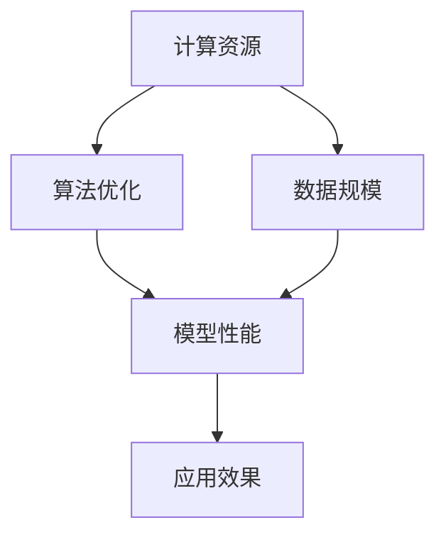

                 

# 驱动当下AI大模型发展的三驾马车

> **关键词：** 人工智能、大模型、深度学习、计算资源、数据规模、算法优化

> **摘要：** 本文将深入探讨驱动当今人工智能（AI）大模型发展的三大核心因素：计算资源的增长、数据规模的扩大和算法的持续优化。我们将通过逐步分析，揭示这些因素如何相互作用，共同推动AI技术的进步，并展望未来的发展趋势与挑战。

## 1. 背景介绍

### 1.1 目的和范围

本文旨在解析当前推动人工智能大模型发展的三大关键因素，探讨它们如何共同促进AI技术的飞速进步。我们将覆盖以下主要内容：

- **计算资源的发展**：探讨计算硬件的演进如何支持更强大的AI模型训练。
- **数据规模的扩展**：分析海量数据在AI模型训练中的重要性。
- **算法优化的进步**：探讨算法改进如何提高AI模型的效率和性能。

### 1.2 预期读者

本文适合以下读者群体：

- **人工智能研究人员和工程师**：希望了解大模型发展的最新趋势。
- **计算机科学和工程专业的学生**：对AI领域的核心技术感兴趣。
- **技术爱好者和创业者**：希望了解AI技术在商业和科研中的应用。

### 1.3 文档结构概述

本文结构如下：

- **第2章**：介绍核心概念与联系，包括计算资源、数据规模和算法优化的定义与相互关系。
- **第3章**：探讨核心算法原理，通过伪代码详细阐述关键算法。
- **第4章**：分析数学模型和公式，并举例说明。
- **第5章**：提供项目实战代码案例，详细解释说明。
- **第6章**：讨论实际应用场景。
- **第7章**：推荐学习资源、开发工具和最新研究。
- **第8章**：总结未来发展趋势与挑战。
- **第9章**：附录，常见问题与解答。
- **第10章**：扩展阅读与参考资料。

### 1.4 术语表

#### 1.4.1 核心术语定义

- **人工智能（AI）**：指由计算机模拟人类智能行为的科学和技术。
- **大模型**：指规模庞大、参数数量达到数十亿甚至数万亿的神经网络模型。
- **深度学习**：一种基于多层神经网络进行训练的人工智能算法。
- **计算资源**：指用于AI模型训练和推理的硬件设施，如GPU、TPU等。
- **数据规模**：指用于训练AI模型的数据集的大小。
- **算法优化**：指对算法进行改进，以提高效率和性能。

#### 1.4.2 相关概念解释

- **神经网络**：一种模拟人脑神经元连接的计算机算法模型。
- **参数**：在神经网络中，每个连接上的权重都称为参数。
- **训练**：通过大量数据来调整神经网络的参数，使其能够准确预测或分类数据。

#### 1.4.3 缩略词列表

- **GPU**：图形处理单元（Graphics Processing Unit）
- **TPU**：张量处理单元（Tensor Processing Unit）
- **ML**：机器学习（Machine Learning）
- **DL**：深度学习（Deep Learning）
- **AI**：人工智能（Artificial Intelligence）

## 2. 核心概念与联系

在探讨驱动AI大模型发展的三大核心因素之前，我们需要了解这些概念之间的联系。

### 2.1 计算资源的定义与重要性

计算资源是AI大模型发展的基石。随着深度学习算法的复杂度不断增加，训练大规模AI模型所需的计算资源也随之增长。GPU和TPU等专用硬件设备的出现，极大地提高了数据处理速度，从而推动了AI模型的规模和性能提升。

### 2.2 数据规模的定义与重要性

数据规模是指用于训练AI模型的数据集大小。大规模数据集有助于模型更好地学习特征，提高泛化能力。随着互联网和物联网的发展，数据获取变得更为容易，这也为AI大模型的发展提供了充足的数据资源。

### 2.3 算法优化的定义与重要性

算法优化是指通过改进算法结构或参数调整来提高模型效率和性能。优化的目标包括减少训练时间、提高模型精度和降低能耗。算法优化不仅能够提升现有模型的性能，还能为新的模型开发提供更多可能性。

### 2.4 核心概念原理和架构的Mermaid流程图

以下是一个简化的Mermaid流程图，用于展示计算资源、数据规模和算法优化之间的关系：



在这个流程图中，计算资源、数据规模和算法优化共同作用于模型性能，进而影响应用效果。

## 3. 核心算法原理 & 具体操作步骤

### 3.1 深度学习算法原理

深度学习是AI大模型发展的核心。其基本原理是模拟人脑神经元之间的连接，通过多层神经网络进行数据特征提取和建模。

### 3.2 伪代码

以下是一个简化的深度学习算法伪代码，用于描述神经网络模型的基本操作：

```python
initialize parameters
for each epoch do
    for each sample in training data do
        forward_pass(sample)
        compute_loss()
        backward_pass()
        update_parameters()
    end
end
predict(new_data)
```

### 3.3 具体操作步骤

1. **初始化参数**：设置神经网络的初始参数，包括权重和偏置。
2. **前向传播**：计算输入数据通过神经网络后的输出。
3. **计算损失**：通过比较模型输出和真实标签之间的差异，计算损失函数值。
4. **反向传播**：根据损失函数的梯度，更新网络参数。
5. **迭代更新**：重复上述步骤，直到满足停止条件（如达到预设的迭代次数或损失函数值收敛）。
6. **预测**：使用训练好的模型对新数据进行预测。

## 4. 数学模型和公式 & 详细讲解 & 举例说明

### 4.1 数学模型

在深度学习中，常用的数学模型包括前向传播和反向传播。以下分别进行讲解。

### 4.1.1 前向传播

前向传播是指在神经网络中，从输入层到输出层的正向信息传递过程。其核心公式如下：

$$
Z = W \cdot X + b
$$

其中，$Z$ 表示神经网络中间层的输出，$W$ 表示权重矩阵，$X$ 表示输入特征，$b$ 表示偏置。

### 4.1.2 反向传播

反向传播是指在神经网络中，从输出层到输入层的反向信息传递过程。其核心公式如下：

$$
\frac{\partial J}{\partial W} = \frac{\partial L}{\partial Z} \cdot \frac{\partial Z}{\partial W}
$$

$$
\frac{\partial J}{\partial b} = \frac{\partial L}{\partial Z} \cdot \frac{\partial Z}{\partial b}
$$

其中，$J$ 表示损失函数，$L$ 表示神经网络中间层的输出，$W$ 和 $b$ 分别表示权重矩阵和偏置。

### 4.2 举例说明

假设有一个简单的神经网络，输入特征为 $X$，权重矩阵为 $W$，偏置为 $b$，输出为 $Z$，损失函数为均方误差（MSE）：

$$
J = \frac{1}{2} \sum_{i=1}^{n} (Z_i - y_i)^2
$$

其中，$y_i$ 表示真实标签，$n$ 表示样本数量。

#### 4.2.1 前向传播

输入特征 $X$ 通过权重矩阵 $W$ 和偏置 $b$ 计算得到中间层的输出 $Z$：

$$
Z = W \cdot X + b
$$

假设输入特征 $X$ 为 `[1, 2]`，权重矩阵 $W$ 为 `[0.5, 0.5]`，偏置 $b$ 为 `[0.5, 0.5]`，则：

$$
Z = [0.5 \cdot 1 + 0.5, 0.5 \cdot 2 + 0.5] = [1, 1.5]
$$

#### 4.2.2 反向传播

计算损失函数的梯度：

$$
\frac{\partial J}{\partial W} = \frac{\partial L}{\partial Z} \cdot \frac{\partial Z}{\partial W} = (Z - y) \cdot X
$$

$$
\frac{\partial J}{\partial b} = \frac{\partial L}{\partial Z} \cdot \frac{\partial Z}{\partial b} = (Z - y)
$$

其中，$y$ 表示真实标签。

#### 4.2.3 参数更新

根据梯度信息更新权重矩阵 $W$ 和偏置 $b$：

$$
W = W - \alpha \cdot \frac{\partial J}{\partial W}
$$

$$
b = b - \alpha \cdot \frac{\partial J}{\partial b}
$$

其中，$\alpha$ 表示学习率。

## 5. 项目实战：代码实际案例和详细解释说明

### 5.1 开发环境搭建

为了实现一个简单的AI大模型，我们需要搭建一个开发环境。以下是所需的工具和步骤：

- **Python**：安装Python 3.8及以上版本。
- **PyTorch**：安装PyTorch库。
- **GPU**：确保计算机中安装了NVIDIA GPU驱动。

### 5.2 源代码详细实现和代码解读

以下是一个简单的AI大模型训练代码，使用PyTorch库实现：

```python
import torch
import torch.nn as nn
import torch.optim as optim

# 设置随机种子，保证实验可复现
torch.manual_seed(0)

# 定义模型结构
class SimpleModel(nn.Module):
    def __init__(self):
        super(SimpleModel, self).__init__()
        self.fc1 = nn.Linear(2, 2)
        self.fc2 = nn.Linear(2, 1)

    def forward(self, x):
        x = torch.relu(self.fc1(x))
        x = self.fc2(x)
        return x

# 创建模型、损失函数和优化器
model = SimpleModel()
criterion = nn.MSELoss()
optimizer = optim.SGD(model.parameters(), lr=0.01)

# 数据集准备
x_train = torch.tensor([[1, 2], [2, 3], [3, 4]], dtype=torch.float32)
y_train = torch.tensor([1.0, 2.0, 3.0], dtype=torch.float32)

# 模型训练
for epoch in range(100):
    optimizer.zero_grad()
    outputs = model(x_train)
    loss = criterion(outputs, y_train)
    loss.backward()
    optimizer.step()
    print(f'Epoch {epoch+1}, Loss: {loss.item()}')

# 模型预测
x_test = torch.tensor([[1.5, 2.5]], dtype=torch.float32)
predictions = model(x_test)
print(f'Predictions: {predictions.item()}')
```

### 5.3 代码解读与分析

1. **模型定义**：使用PyTorch的`nn.Module`基类定义一个简单的神经网络模型，包含两个全连接层（`nn.Linear`）和ReLU激活函数（`nn.ReLU`）。
2. **模型训练**：通过迭代（`for epoch`循环）进行模型训练，包括前向传播、损失计算、反向传播和参数更新。
3. **模型预测**：使用训练好的模型进行新数据的预测。

通过上述代码，我们可以实现一个简单的AI大模型，虽然它仅包含两个神经元，但已能演示深度学习的基本流程。

## 6. 实际应用场景

AI大模型在实际应用中具有广泛的应用场景，以下列举几个典型案例：

1. **自然语言处理（NLP）**：例如，使用GPT-3模型进行文本生成和翻译。
2. **计算机视觉（CV）**：例如，使用ImageNet中的ResNet模型进行图像分类。
3. **语音识别（ASR）**：例如，使用WaveNet模型进行语音合成。

这些案例展示了AI大模型在不同领域的应用，充分体现了其强大的能力和广泛的应用前景。

## 7. 工具和资源推荐

### 7.1 学习资源推荐

#### 7.1.1 书籍推荐

- **《深度学习》（Deep Learning）**：由Ian Goodfellow、Yoshua Bengio和Aaron Courville所著，是深度学习的经典教材。
- **《Python深度学习》（Python Deep Learning）**：由François Chollet所著，涵盖深度学习的实践应用。

#### 7.1.2 在线课程

- **Coursera上的《深度学习专项课程》**：由吴恩达教授主讲，适合初学者和进阶者。
- **Udacity的《深度学习纳米学位》**：提供全面的深度学习知识和实践项目。

#### 7.1.3 技术博客和网站

- **Medium上的`/ml`话题**：收录大量深度学习和AI领域的优质文章。
- **GitHub上的深度学习项目**：如TensorFlow、PyTorch等开源框架的官方仓库。

### 7.2 开发工具框架推荐

#### 7.2.1 IDE和编辑器

- **PyCharm**：一款功能强大的Python IDE，适合深度学习和数据科学开发。
- **Jupyter Notebook**：适用于数据可视化和交互式开发。

#### 7.2.2 调试和性能分析工具

- **Wandb**：用于实验管理和性能分析。
- **MLflow**：用于模型管理和部署。

#### 7.2.3 相关框架和库

- **TensorFlow**：Google开源的深度学习框架。
- **PyTorch**：Facebook开源的深度学习框架。

### 7.3 相关论文著作推荐

#### 7.3.1 经典论文

- **《A Learning Algorithm for Continually Running Fully Recurrent Neural Networks》**：Hochreiter和Schmidhuber提出的长短期记忆网络（LSTM）。
- **《Dropout: A Simple Way to Prevent Neural Networks from Overfitting》**：Hinton等人提出的dropout方法。

#### 7.3.2 最新研究成果

- **《An Image Database for evaluating Object Detection Algorithms》**：PASCAL VOC数据集，用于评估目标检测算法。
- **《The Unreasonable Effectiveness of Deep Learning》**：人工智能领域的综述文章。

#### 7.3.3 应用案例分析

- **《Deep Learning for Healthcare》**：探讨深度学习在医疗领域的应用。
- **《AI for Social Good》**：介绍深度学习在社会公益领域的应用案例。

## 8. 总结：未来发展趋势与挑战

随着计算资源、数据规模和算法优化的不断进步，AI大模型在未来将继续快速发展。然而，这也带来了一系列挑战：

- **计算资源瓶颈**：随着模型规模不断扩大，计算资源需求增长，如何有效利用现有资源成为关键问题。
- **数据隐私**：海量数据的收集和处理过程中，如何保护用户隐私成为重要议题。
- **算法公平性和透明性**：确保AI模型在不同群体中的公平性和透明性，避免歧视和偏见。

为了应对这些挑战，我们需要加强跨学科合作，推动技术创新，并制定相应的法律法规和伦理标准。

## 9. 附录：常见问题与解答

### 9.1 计算资源瓶颈如何解决？

**答：** 可以通过以下方式缓解计算资源瓶颈：

- **分布式训练**：将模型训练任务分布在多个计算节点上，提高训练效率。
- **模型压缩**：通过剪枝、量化等方法减小模型规模，降低计算需求。
- **异构计算**：利用GPU、TPU等专用硬件加速计算。

### 9.2 数据隐私如何保障？

**答：** 可以采取以下措施保障数据隐私：

- **数据脱敏**：对敏感信息进行脱敏处理，防止泄露。
- **差分隐私**：在数据处理过程中引入噪声，保护个体隐私。
- **隐私计算**：采用联邦学习等技术，在本地进行模型训练，避免数据上传。

### 9.3 如何评估算法的公平性和透明性？

**答：** 可以通过以下方法评估算法的公平性和透明性：

- **基准测试**：使用标准数据集评估模型在不同群体中的性能。
- **可解释性**：提高模型的可解释性，使其决策过程透明。
- **伦理审查**：建立伦理审查机制，确保算法设计符合伦理标准。

## 10. 扩展阅读 & 参考资料

- **《深度学习》（Deep Learning）**：Ian Goodfellow、Yoshua Bengio和Aaron Courville 著。
- **《Python深度学习》（Python Deep Learning）**：François Chollet 著。
- **《The Unreasonable Effectiveness of Deep Learning》**：Sebastian Ruder 著。
- **PASCAL VOC数据集**：[http://pasc

